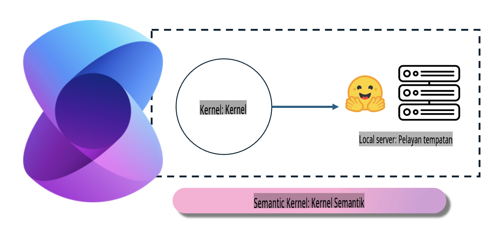
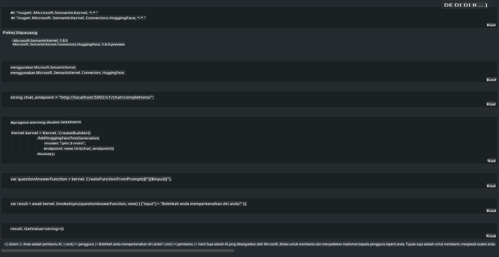

# **Inference Phi-3 di Pelayan Tempatan**

Kita boleh melaksanakan Phi-3 di pelayan tempatan. Pengguna boleh memilih penyelesaian [Ollama](https://ollama.com) atau [LM Studio](https://llamaedge.com), atau mereka boleh menulis kod mereka sendiri. Anda boleh menyambungkan perkhidmatan tempatan Phi-3 melalui [Semantic Kernel](https://github.com/microsoft/semantic-kernel?WT.mc_id=aiml-138114-kinfeylo) atau [Langchain](https://www.langchain.com/) untuk membina aplikasi Copilot.

## **Menggunakan Semantic Kernel untuk mengakses Phi-3-mini**

Dalam aplikasi Copilot, kita mencipta aplikasi melalui Semantic Kernel / LangChain. Rangka kerja aplikasi jenis ini biasanya serasi dengan Azure OpenAI Service / model OpenAI, dan juga boleh menyokong model sumber terbuka di Hugging Face serta model tempatan. Apa yang perlu kita lakukan jika kita mahu menggunakan Semantic Kernel untuk mengakses Phi-3-mini? Menggunakan .NET sebagai contoh, kita boleh menggabungkannya dengan Hugging Face Connector dalam Semantic Kernel. Secara lalai, ia boleh berpadanan dengan model id di Hugging Face (kali pertama anda menggunakannya, model akan dimuat turun dari Hugging Face, yang memakan masa yang lama). Anda juga boleh menyambung ke perkhidmatan tempatan yang telah dibina. Berbanding dengan kedua-duanya, kami mengesyorkan menggunakan kaedah kedua kerana ia mempunyai tahap autonomi yang lebih tinggi, terutamanya dalam aplikasi perusahaan.

Daripada rajah, menyambung ke perkhidmatan tempatan melalui Semantic Kernel membolehkan sambungan yang mudah ke pelayan model Phi-3-mini yang dibina sendiri. Berikut adalah hasil pelaksanaannya.

***Kod Contoh*** https://github.com/kinfey/Phi3MiniSamples/tree/main/semantickernel

**Penafian**:  
Dokumen ini telah diterjemahkan menggunakan perkhidmatan terjemahan AI berasaskan mesin. Walaupun kami berusaha untuk memastikan ketepatan, sila ambil perhatian bahawa terjemahan automatik mungkin mengandungi kesilapan atau ketidaktepatan. Dokumen asal dalam bahasa asalnya harus dianggap sebagai sumber yang berwibawa. Untuk maklumat penting, terjemahan manusia profesional adalah disyorkan. Kami tidak bertanggungjawab atas sebarang salah faham atau salah tafsir yang timbul daripada penggunaan terjemahan ini.