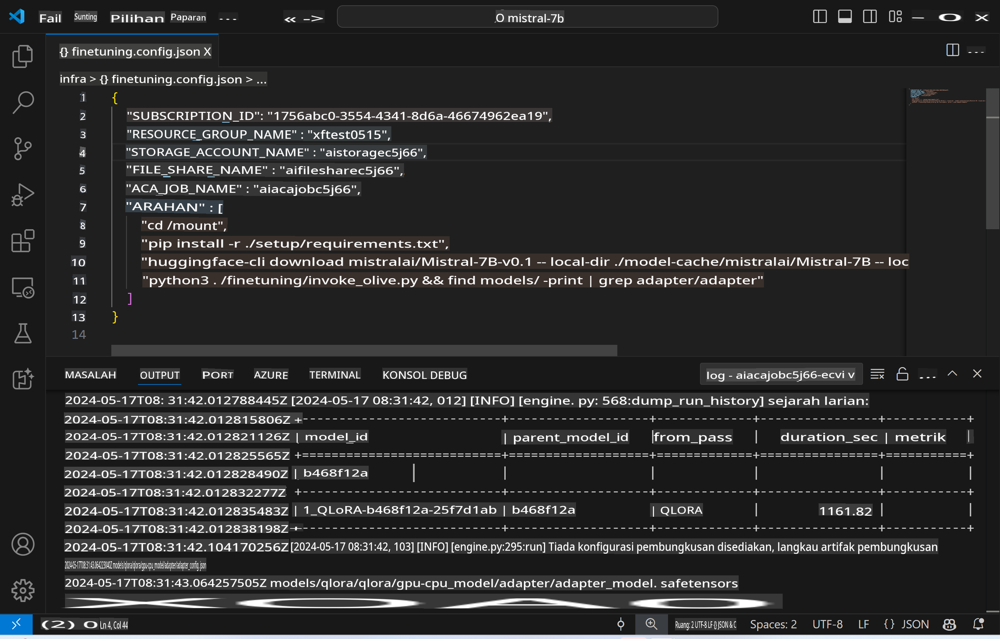
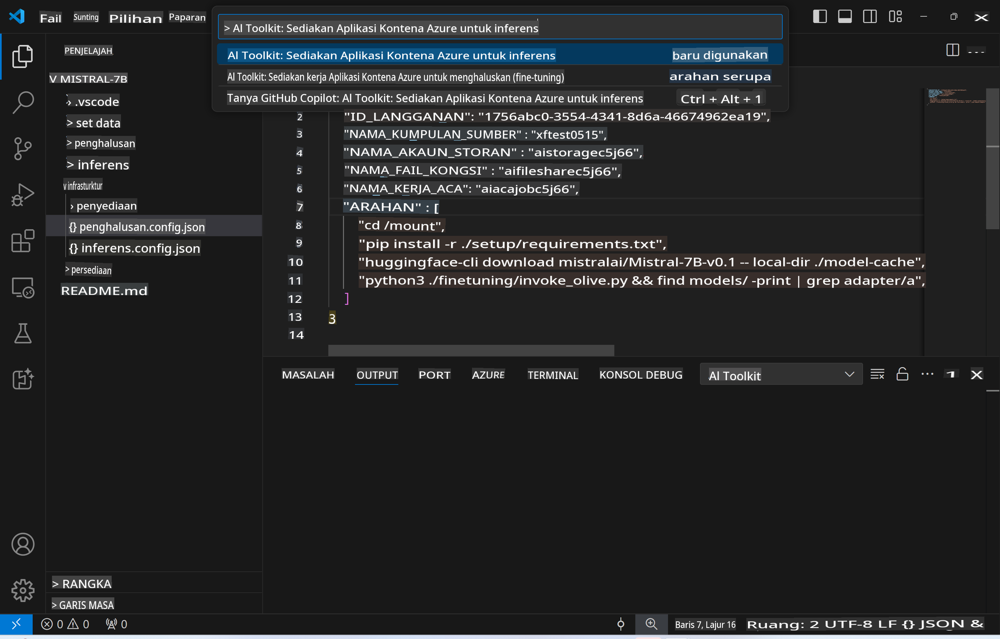
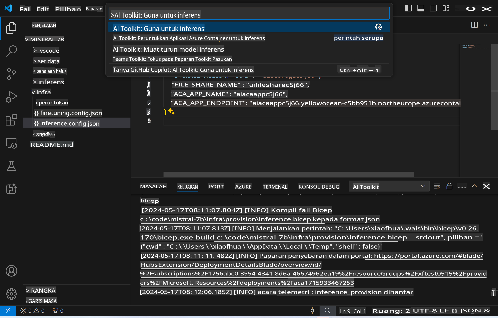
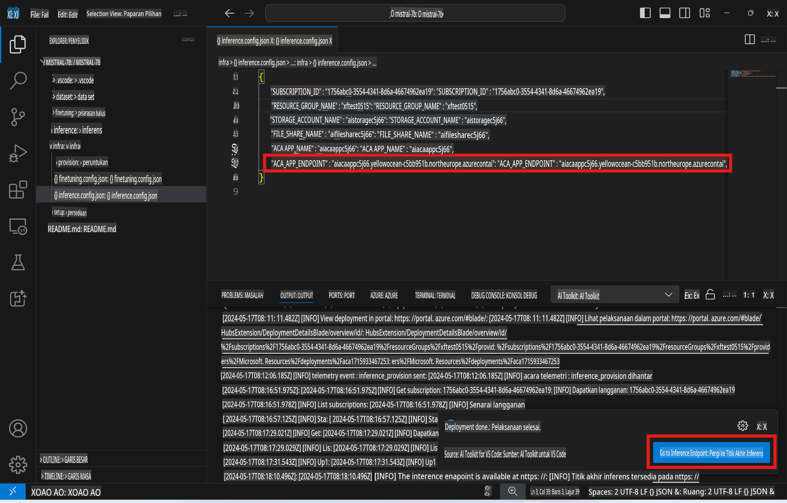

# Inferens Jauh dengan Model yang Disesuaikan

Selepas adapter dilatih dalam persekitaran jauh, gunakan aplikasi Gradio yang ringkas untuk berinteraksi dengan model.



### Menyediakan Sumber Azure
Anda perlu menyediakan Sumber Azure untuk inferens jauh dengan menjalankan `AI Toolkit: Provision Azure Container Apps for inference` dari palet arahan. Semasa proses ini, anda akan diminta untuk memilih Langganan Azure dan kumpulan sumber anda.  

   
Secara lalai, langganan dan kumpulan sumber untuk inferens sepatutnya sama dengan yang digunakan semasa penyesuaian. Inferens akan menggunakan persekitaran Azure Container App yang sama dan mengakses model serta adapter model yang disimpan dalam Azure Files, yang dihasilkan semasa langkah penyesuaian.

## Menggunakan AI Toolkit 

### Penyebaran untuk Inferens  
Jika anda ingin menyemak semula kod inferens atau memuat semula model inferens, sila jalankan arahan `AI Toolkit: Deploy for inference`. Ini akan menyelaraskan kod terkini anda dengan ACA dan memulakan semula replika.  



Selepas penyebaran selesai dengan jayanya, model kini sedia untuk dinilai menggunakan titik akhir ini.

### Mengakses API Inferens

Anda boleh mengakses API inferens dengan mengklik butang "*Go to Inference Endpoint*" yang dipaparkan dalam notifikasi VSCode. Sebagai alternatif, titik akhir web API boleh ditemui di bawah `ACA_APP_ENDPOINT` dalam `./infra/inference.config.json` dan di panel output.



> **Nota:** Titik akhir inferens mungkin memerlukan beberapa minit untuk beroperasi sepenuhnya.

## Komponen Inferens yang Termasuk dalam Templat
 
| Folder | Kandungan |
| ------ |--------- |
| `infra` | Mengandungi semua konfigurasi yang diperlukan untuk operasi jauh. |
| `infra/provision/inference.parameters.json` | Menyimpan parameter untuk templat bicep, digunakan untuk menyediakan sumber Azure untuk inferens. |
| `infra/provision/inference.bicep` | Mengandungi templat untuk menyediakan sumber Azure untuk inferens. |
| `infra/inference.config.json` | Fail konfigurasi, dihasilkan oleh arahan `AI Toolkit: Provision Azure Container Apps for inference`. Ia digunakan sebagai input untuk palet arahan jauh yang lain. |

### Menggunakan AI Toolkit untuk Mengkonfigurasi Penyediaan Sumber Azure
Konfigurasi [AI Toolkit](https://marketplace.visualstudio.com/items?itemName=ms-windows-ai-studio.windows-ai-studio)

Sediakan Azure Container Apps untuk inferens` command.

You can find configuration parameters in `./infra/provision/inference.parameters.json` file. Here are the details:
| Parameter | Description |
| --------- |------------ |
| `defaultCommands` | This is the commands to initiate a web API. |
| `maximumInstanceCount` | This parameter sets the maximum capacity of GPU instances. |
| `location` | This is the location where Azure resources are provisioned. The default value is the same as the chosen resource group's location. |
| `storageAccountName`, `fileShareName` `acaEnvironmentName`, `acaEnvironmentStorageName`, `acaAppName`,  `acaLogAnalyticsName` | These parameters are used to name the Azure resources for provision. By default, they will be same to the fine-tuning resource name. You can input a new, unused resource name to create your own custom-named resources, or you can input the name of an already existing Azure resource if you'd prefer to use that. For details, refer to the section [Using existing Azure Resources](../../../../../md/01.Introduction/03). |

### Using Existing Azure Resources

By default, the inference provision use the same Azure Container App Environment, Storage Account, Azure File Share, and Azure Log Analytics that were used for fine-tuning. A separate Azure Container App is created solely for the inference API. 

If you have customized the Azure resources during the fine-tuning step or want to use your own existing Azure resources for inference, specify their names in the `./infra/inference.parameters.json` file. Kemudian, jalankan arahan `AI Toolkit: Provision Azure Container Apps for inference` dari palet arahan. Ini akan mengemas kini sebarang sumber yang dinyatakan dan mencipta mana-mana sumber yang tiada.

Sebagai contoh, jika anda mempunyai persekitaran kontena Azure yang sedia ada, `./infra/finetuning.parameters.json` anda sepatutnya kelihatan seperti ini:

```json
{
    "$schema": "https://schema.management.azure.com/schemas/2019-04-01/deploymentParameters.json#",
    "contentVersion": "1.0.0.0",
    "parameters": {
      ...
      "acaEnvironmentName": {
        "value": "<your-aca-env-name>"
      },
      "acaEnvironmentStorageName": {
        "value": null
      },
      ...
    }
  }
```

### Penyediaan Manual  
Jika anda lebih suka mengkonfigurasi sumber Azure secara manual, anda boleh menggunakan fail bicep yang disediakan dalam `./infra/provision` folders. If you have already set up and configured all the Azure resources without using the AI Toolkit command palette, you can simply enter the resource names in the `inference.config.json` file.

Sebagai contoh:

```json
{
  "SUBSCRIPTION_ID": "<your-subscription-id>",
  "RESOURCE_GROUP_NAME": "<your-resource-group-name>",
  "STORAGE_ACCOUNT_NAME": "<your-storage-account-name>",
  "FILE_SHARE_NAME": "<your-file-share-name>",
  "ACA_APP_NAME": "<your-aca-name>",
  "ACA_APP_ENDPOINT": "<your-aca-endpoint>"
}
```

**Penafian**:  
Dokumen ini telah diterjemahkan menggunakan perkhidmatan terjemahan AI berasaskan mesin. Walaupun kami berusaha untuk memastikan ketepatan, sila ambil perhatian bahawa terjemahan automatik mungkin mengandungi kesilapan atau ketidaktepatan. Dokumen asal dalam bahasa asalnya harus dianggap sebagai sumber yang berwibawa. Untuk maklumat yang kritikal, terjemahan manusia profesional adalah disyorkan. Kami tidak bertanggungjawab atas sebarang salah faham atau salah tafsir yang timbul daripada penggunaan terjemahan ini.