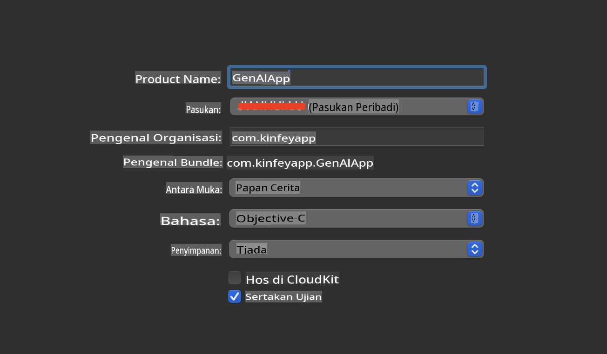
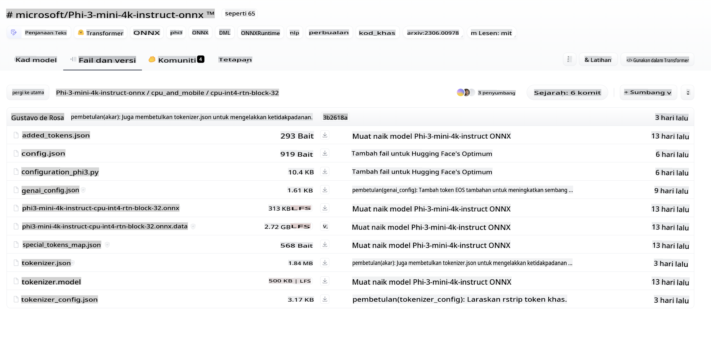
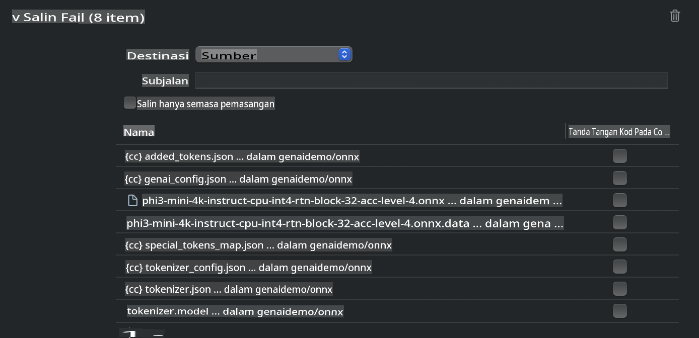
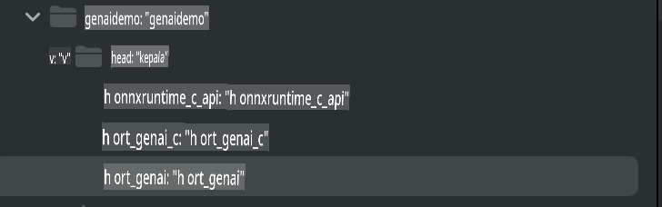
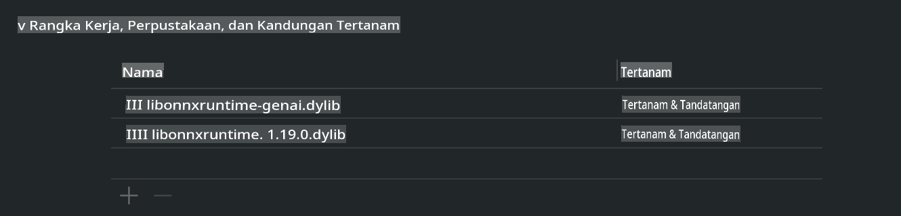
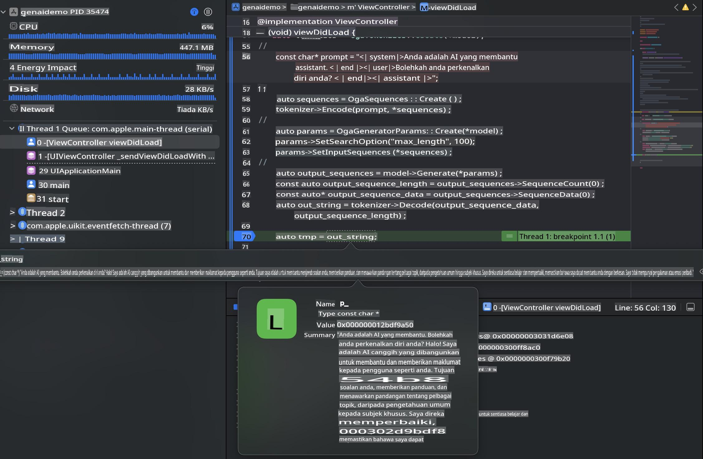

# **Inference Phi-3 dalam iOS**

Phi-3-mini adalah siri model baru dari Microsoft yang membolehkan penerapan Model Bahasa Besar (LLMs) pada peranti tepi dan peranti IoT. Phi-3-mini tersedia untuk penerapan pada iOS, Android, dan Peranti Tepi, membolehkan AI generatif digunakan dalam persekitaran BYOD. Contoh berikut menunjukkan cara untuk menerapkan Phi-3-mini pada iOS.

## **1. Persediaan**

- **a.** macOS 14+
- **b.** Xcode 15+
- **c.** iOS SDK 17.x (iPhone 14 A16 atau lebih tinggi)
- **d.** Pasang Python 3.10+ (Conda disyorkan)
- **e.** Pasang pustaka Python: `python-flatbuffers`
- **f.** Pasang CMake

### Semantic Kernel dan Inferens

Semantic Kernel ialah rangka kerja aplikasi yang membolehkan anda mencipta aplikasi yang serasi dengan Azure OpenAI Service, model OpenAI, dan juga model tempatan. Mengakses perkhidmatan tempatan melalui Semantic Kernel memudahkan integrasi dengan pelayan model Phi-3-mini yang anda hoskan sendiri.

### Memanggil Model Kuantisasi dengan Ollama atau LlamaEdge

Ramai pengguna lebih suka menggunakan model kuantisasi untuk menjalankan model secara tempatan. [Ollama](https://ollama.com) dan [LlamaEdge](https://llamaedge.com) membolehkan pengguna memanggil pelbagai model kuantisasi:

#### **Ollama**

Anda boleh menjalankan `ollama run phi3` secara langsung atau mengkonfigurasinya secara luar talian. Cipta Modelfile dengan laluan kepada fail `gguf` anda. Kod contoh untuk menjalankan model kuantisasi Phi-3-mini:

```gguf
FROM {Add your gguf file path}
TEMPLATE \"\"\"<|user|> .Prompt<|end|> <|assistant|>\"\"\"
PARAMETER stop <|end|>
PARAMETER num_ctx 4096
```

#### **LlamaEdge**

Jika anda ingin menggunakan `gguf` pada peranti awan dan tepi secara serentak, LlamaEdge adalah pilihan yang baik.

## **2. Menyusun ONNX Runtime untuk iOS**

```bash

git clone https://github.com/microsoft/onnxruntime.git

cd onnxruntime

./build.sh --build_shared_lib --ios --skip_tests --parallel --build_dir ./build_ios --ios --apple_sysroot iphoneos --osx_arch arm64 --apple_deploy_target 17.5 --cmake_generator Xcode --config Release

cd ../

```

### **Peringatan**

- **a.** Sebelum menyusun, pastikan Xcode telah dikonfigurasi dengan betul dan tetapkan ia sebagai direktori pembangun aktif dalam terminal:

    ```bash
    sudo xcode-select -switch /Applications/Xcode.app/Contents/Developer
    ```

- **b.** ONNX Runtime perlu disusun untuk pelbagai platform. Untuk iOS, anda boleh menyusun untuk `arm64` or `x86_64`.

- **c.** Disarankan untuk menggunakan SDK iOS terkini untuk penyusunan. Walau bagaimanapun, anda juga boleh menggunakan versi lama jika memerlukan keserasian dengan SDK terdahulu.

## **3. Menyusun AI Generatif dengan ONNX Runtime untuk iOS**

> **Nota:** Oleh kerana AI Generatif dengan ONNX Runtime masih dalam pratonton, sila maklum tentang kemungkinan perubahan.

```bash

git clone https://github.com/microsoft/onnxruntime-genai
 
cd onnxruntime-genai
 
mkdir ort
 
cd ort
 
mkdir include
 
mkdir lib
 
cd ../
 
cp ../onnxruntime/include/onnxruntime/core/session/onnxruntime_c_api.h ort/include
 
cp ../onnxruntime/build_ios/Release/Release-iphoneos/libonnxruntime*.dylib* ort/lib
 
export OPENCV_SKIP_XCODEBUILD_FORCE_TRYCOMPILE_DEBUG=1
 
python3 build.py --parallel --build_dir ./build_ios --ios --ios_sysroot iphoneos --ios_arch arm64 --ios_deployment_target 17.5 --cmake_generator Xcode --cmake_extra_defines CMAKE_XCODE_ATTRIBUTE_CODE_SIGNING_ALLOWED=NO

```

## **4. Cipta aplikasi App dalam Xcode**

Saya memilih Objective-C sebagai kaedah pembangunan aplikasi, kerana dengan menggunakan API C++ ONNX Runtime untuk AI Generatif, Objective-C lebih serasi. Sudah tentu, anda juga boleh melengkapkan panggilan berkaitan melalui jambatan Swift.



## **5. Salin model INT4 kuantisasi ONNX ke dalam projek aplikasi App**

Kita perlu mengimport model kuantisasi INT4 dalam format ONNX, yang perlu dimuat turun terlebih dahulu.



Selepas memuat turun, anda perlu menambahkannya ke direktori Resources projek dalam Xcode.



## **6. Menambah API C++ dalam ViewControllers**

> **Peringatan:**

- **a.** Tambahkan fail header C++ yang berkaitan ke dalam projek.

  

- **b.** Sertakan `onnxruntime-genai` dynamic library in Xcode.

  

- **c.** Use the C Samples code for testing. You can also add additional features like ChatUI for more functionality.

- **d.** Since you need to use C++ in your project, rename `ViewController.m` to `ViewController.mm` untuk membolehkan sokongan Objective-C++.

```objc

    NSString *llmPath = [[NSBundle mainBundle] resourcePath];
    char const *modelPath = llmPath.cString;

    auto model =  OgaModel::Create(modelPath);

    auto tokenizer = OgaTokenizer::Create(*model);

    const char* prompt = "<|system|>You are a helpful AI assistant.<|end|><|user|>Can you introduce yourself?<|end|><|assistant|>";

    auto sequences = OgaSequences::Create();
    tokenizer->Encode(prompt, *sequences);

    auto params = OgaGeneratorParams::Create(*model);
    params->SetSearchOption("max_length", 100);
    params->SetInputSequences(*sequences);

    auto output_sequences = model->Generate(*params);
    const auto output_sequence_length = output_sequences->SequenceCount(0);
    const auto* output_sequence_data = output_sequences->SequenceData(0);
    auto out_string = tokenizer->Decode(output_sequence_data, output_sequence_length);
    
    auto tmp = out_string;

```

## **7. Menjalankan Aplikasi**

Setelah persediaan selesai, anda boleh menjalankan aplikasi untuk melihat hasil inferens model Phi-3-mini.



Untuk kod contoh tambahan dan arahan terperinci, lawati [repositori Phi-3 Mini Samples](https://github.com/Azure-Samples/Phi-3MiniSamples/tree/main/ios).

**Penafian**:  
Dokumen ini telah diterjemahkan menggunakan perkhidmatan terjemahan AI berasaskan mesin. Walaupun kami berusaha untuk memastikan ketepatan, sila ambil maklum bahawa terjemahan automatik mungkin mengandungi kesilapan atau ketidaktepatan. Dokumen asal dalam bahasa asalnya hendaklah dianggap sebagai sumber yang berwibawa. Untuk maklumat penting, terjemahan manusia profesional adalah disyorkan. Kami tidak bertanggungjawab terhadap sebarang salah faham atau salah tafsir yang timbul daripada penggunaan terjemahan ini.