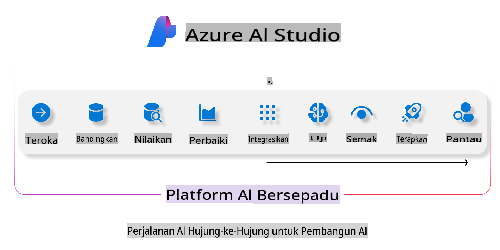
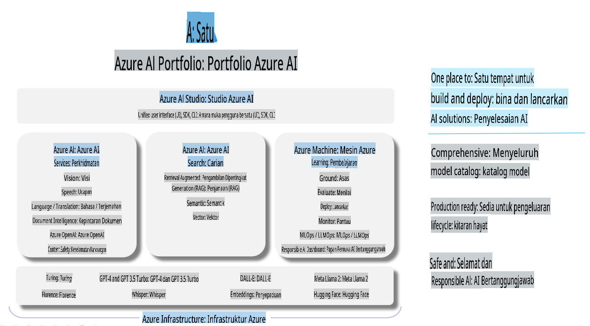

# **Menggunakan Azure AI Foundry untuk Penilaian**

Bagaimana cara menilai aplikasi AI generatif anda menggunakan [Azure AI Foundry](https://ai.azure.com?WT.mc_id=aiml-138114-kinfeylo). Sama ada anda sedang menilai perbualan satu pusingan atau pelbagai pusingan, Azure AI Foundry menyediakan alat untuk menilai prestasi dan keselamatan model.

## Cara Menilai Aplikasi AI Generatif dengan Azure AI Foundry
Untuk arahan lebih terperinci, lihat [Dokumentasi Azure AI Foundry](https://learn.microsoft.com/azure/ai-studio/how-to/evaluate-generative-ai-app?WT.mc_id=aiml-138114-kinfeylo)

Berikut adalah langkah-langkah untuk memulakan:

## Menilai Model AI Generatif di Azure AI Foundry

**Prasyarat**

- Dataset ujian dalam format CSV atau JSON.
- Model AI generatif yang telah dideploy (seperti Phi-3, GPT 3.5, GPT 4, atau model Davinci).
- Runtime dengan instance pengiraan untuk menjalankan penilaian.

## Metrik Penilaian Terbina Dalam

Azure AI Foundry membolehkan anda menilai perbualan satu pusingan serta perbualan kompleks berbilang pusingan.  
Untuk senario Retrieval Augmented Generation (RAG), di mana model berasaskan data tertentu, anda boleh menilai prestasi menggunakan metrik penilaian terbina dalam.  
Selain itu, anda boleh menilai senario soal jawab satu pusingan umum (bukan RAG).

## Membuat Proses Penilaian

Dari UI Azure AI Foundry, pergi ke halaman Evaluate atau Prompt Flow.  
Ikuti wizard penciptaan penilaian untuk menyediakan proses penilaian. Berikan nama pilihan untuk penilaian anda.  
Pilih senario yang selaras dengan objektif aplikasi anda.  
Pilih satu atau lebih metrik penilaian untuk menilai output model.

## Aliran Penilaian Khusus (Pilihan)

Untuk fleksibiliti yang lebih besar, anda boleh menetapkan aliran penilaian khusus. Sesuaikan proses penilaian berdasarkan keperluan spesifik anda.

## Melihat Hasil

Selepas menjalankan penilaian, log, lihat, dan analisis metrik penilaian terperinci di Azure AI Foundry. Dapatkan pandangan tentang keupayaan dan batasan aplikasi anda.

**Nota** Azure AI Foundry kini berada dalam pratonton awam, jadi gunakannya untuk tujuan eksperimen dan pembangunan. Untuk beban kerja produksi, pertimbangkan pilihan lain. Terokai [dokumentasi rasmi AI Foundry](https://learn.microsoft.com/azure/ai-studio/?WT.mc_id=aiml-138114-kinfeylo) untuk butiran lanjut dan arahan langkah demi langkah.

**Penafian**:  
Dokumen ini telah diterjemahkan menggunakan perkhidmatan terjemahan AI berasaskan mesin. Walaupun kami berusaha untuk ketepatan, sila maklum bahawa terjemahan automatik mungkin mengandungi kesilapan atau ketidaktepatan. Dokumen asal dalam bahasa asalnya harus dianggap sebagai sumber yang berwibawa. Untuk maklumat penting, terjemahan manusia profesional adalah disyorkan. Kami tidak bertanggungjawab atas sebarang salah faham atau salah tafsir yang timbul daripada penggunaan terjemahan ini.