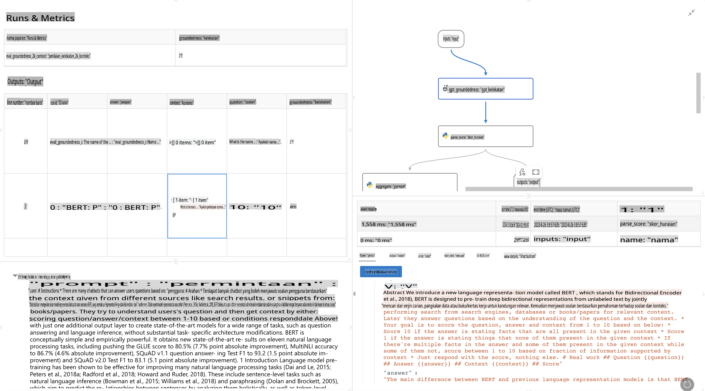

# **Memperkenalkan Promptflow**

[Microsoft Prompt Flow](https://microsoft.github.io/promptflow/index.html?WT.mc_id=aiml-138114-kinfeylo) adalah alat automasi alur kerja visual yang membolehkan pengguna mencipta alur kerja automatik menggunakan templat sedia ada dan penyambung tersuai. Ia direka untuk membolehkan pembangun dan penganalisis perniagaan dengan cepat membina proses automasi untuk tugas seperti pengurusan data, kolaborasi, dan pengoptimuman proses. Dengan Prompt Flow, pengguna dapat dengan mudah menghubungkan pelbagai perkhidmatan, aplikasi, dan sistem, serta mengotomasi proses perniagaan yang kompleks.

Microsoft Prompt Flow direka untuk mempercepat kitaran pembangunan end-to-end aplikasi AI yang dikuasakan oleh Large Language Models (LLMs). Sama ada anda sedang mencetuskan idea, membuat prototaip, menguji, menilai, atau melancarkan aplikasi berasaskan LLM, Prompt Flow mempermudah proses ini dan membolehkan anda membina aplikasi LLM dengan kualiti pengeluaran.

## Berikut adalah ciri-ciri utama dan manfaat menggunakan Microsoft Prompt Flow:

**Pengalaman Penciptaan Interaktif**

Prompt Flow menyediakan representasi visual struktur alur anda, menjadikannya mudah untuk memahami dan menavigasi projek anda.  
Ia menawarkan pengalaman pengekodan seperti notebook untuk pembangunan dan debugging alur yang cekap.

**Varian Prompt dan Penalaan**

Cipta dan bandingkan pelbagai varian prompt untuk memudahkan proses penyempurnaan iteratif.  
Nilai prestasi pelbagai prompt dan pilih yang paling berkesan.

**Alur Penilaian Terbina Dalam**

Nilai kualiti dan keberkesanan prompt dan alur anda menggunakan alat penilaian terbina dalam.  
Fahami sejauh mana prestasi aplikasi berasaskan LLM anda.

**Sumber yang Komprehensif**

Prompt Flow merangkumi perpustakaan alat terbina dalam, contoh, dan templat.  
Sumber-sumber ini menjadi titik permulaan untuk pembangunan, memberi inspirasi kreativiti, dan mempercepatkan proses.

**Kolaborasi dan Kesediaan Perusahaan**

Sokong kolaborasi pasukan dengan membolehkan pelbagai pengguna bekerja bersama dalam projek kejuruteraan prompt.  
Kekalkan kawalan versi dan kongsi pengetahuan dengan berkesan. Permudahkan keseluruhan proses kejuruteraan prompt, dari pembangunan dan penilaian hingga pelancaran dan pemantauan.

## Penilaian dalam Prompt Flow

Dalam Microsoft Prompt Flow, penilaian memainkan peranan penting dalam menilai sejauh mana prestasi model AI anda. Mari kita terokai cara anda boleh menyesuaikan alur dan metrik penilaian dalam Prompt Flow:

**Memahami Penilaian dalam Prompt Flow**

Dalam Prompt Flow, alur mewakili urutan nod yang memproses input dan menghasilkan output.  
Alur penilaian adalah jenis alur khas yang direka untuk menilai prestasi satu pelaksanaan berdasarkan kriteria dan matlamat tertentu.

**Ciri utama alur penilaian**

Biasanya dijalankan selepas alur yang diuji, menggunakan outputnya.  
Ia mengira skor atau metrik untuk mengukur prestasi alur yang diuji.  
Metrik boleh merangkumi ketepatan, skor relevansi, atau ukuran lain yang berkaitan.

### Menyesuaikan Alur Penilaian

**Mendefinisikan Input**

Alur penilaian perlu menerima output daripada pelaksanaan yang diuji.  
Tentukan input dengan cara yang sama seperti alur biasa.  
Sebagai contoh, jika anda menilai alur QnA, namakan input sebagai "jawapan." Jika menilai alur klasifikasi, namakan input sebagai "kategori." Input kebenaran asas (contohnya, label sebenar) mungkin juga diperlukan.

**Output dan Metrik**

Alur penilaian menghasilkan keputusan yang mengukur prestasi alur yang diuji.  
Metrik boleh dikira menggunakan Python atau LLM (Large Language Models).  
Gunakan fungsi log_metric() untuk mencatat metrik yang relevan.

**Menggunakan Alur Penilaian Tersuai**

Bangunkan alur penilaian anda sendiri yang disesuaikan dengan tugas dan objektif tertentu anda.  
Sesuaikan metrik berdasarkan matlamat penilaian anda.  
Gunakan alur penilaian tersuai ini untuk pelaksanaan secara batch bagi ujian berskala besar.

## Kaedah Penilaian Terbina Dalam

Prompt Flow juga menyediakan kaedah penilaian terbina dalam.  
Anda boleh menghantar pelaksanaan secara batch dan menggunakan kaedah ini untuk menilai sejauh mana prestasi alur anda dengan set data besar.  
Lihat keputusan penilaian, bandingkan metrik, dan lakukan iterasi seperti yang diperlukan.  
Ingat, penilaian adalah penting untuk memastikan model AI anda memenuhi kriteria dan matlamat yang diinginkan. Terokai dokumentasi rasmi untuk arahan terperinci tentang pembangunan dan penggunaan alur penilaian dalam Microsoft Prompt Flow.

Sebagai ringkasan, Microsoft Prompt Flow memperkasakan pembangun untuk mencipta aplikasi LLM berkualiti tinggi dengan mempermudah kejuruteraan prompt dan menyediakan persekitaran pembangunan yang kukuh. Jika anda bekerja dengan LLM, Prompt Flow adalah alat yang bernilai untuk diterokai. Terokai [Dokumen Penilaian Prompt Flow](https://learn.microsoft.com/azure/machine-learning/prompt-flow/how-to-develop-an-evaluation-flow?view=azureml-api-2?WT.mc_id=aiml-138114-kinfeylo) untuk arahan terperinci tentang pembangunan dan penggunaan alur penilaian dalam Microsoft Prompt Flow.

**Penafian**:  
Dokumen ini telah diterjemahkan menggunakan perkhidmatan terjemahan AI berasaskan mesin. Walaupun kami berusaha untuk memastikan ketepatan, sila ambil perhatian bahawa terjemahan automatik mungkin mengandungi kesilapan atau ketidaktepatan. Dokumen asal dalam bahasa asalnya harus dianggap sebagai sumber yang berautoriti. Untuk maklumat kritikal, terjemahan manusia profesional adalah disyorkan. Kami tidak bertanggungjawab atas sebarang salah faham atau salah tafsir yang timbul daripada penggunaan terjemahan ini.