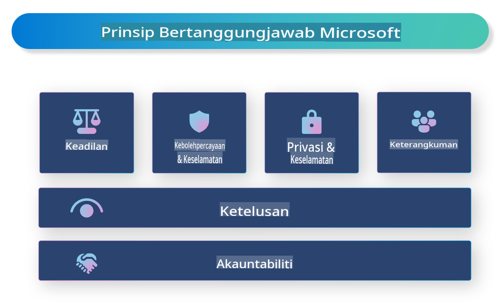

# **Pengenalan AI Bertanggungjawab**

[Microsoft Responsible AI](https://www.microsoft.com/ai/responsible-ai?WT.mc_id=aiml-138114-kinfeylo) adalah inisiatif yang bertujuan membantu pembangun dan organisasi membangunkan sistem AI yang telus, boleh dipercayai, dan bertanggungjawab. Inisiatif ini menyediakan panduan dan sumber untuk membangunkan penyelesaian AI yang bertanggungjawab, sejajar dengan prinsip etika seperti privasi, keadilan, dan ketelusan. Kita juga akan meneroka beberapa cabaran dan amalan terbaik yang berkaitan dengan pembangunan sistem AI yang bertanggungjawab.

## Gambaran Keseluruhan Microsoft Responsible AI 

**Prinsip Etika** 

Microsoft Responsible AI dipandu oleh sekumpulan prinsip etika, seperti privasi, keadilan, ketelusan, akauntabiliti, dan keselamatan. Prinsip-prinsip ini direka untuk memastikan sistem AI dibangunkan dengan cara yang beretika dan bertanggungjawab.

**AI yang Telus**

Microsoft Responsible AI menekankan kepentingan ketelusan dalam sistem AI. Ini termasuk menyediakan penjelasan yang jelas tentang cara model AI berfungsi, serta memastikan sumber data dan algoritma tersedia secara umum.

**AI yang Bertanggungjawab** 

[Microsoft Responsible AI](https://www.microsoft.com/ai/responsible-ai?WT.mc_id=aiml-138114-kinfeylo) menggalakkan pembangunan sistem AI yang bertanggungjawab, yang boleh memberikan wawasan tentang bagaimana model AI membuat keputusan. Ini dapat membantu pengguna memahami dan mempercayai output sistem AI.

**Keterangkuman** 

Sistem AI harus direka untuk memberi manfaat kepada semua orang. Microsoft bertujuan untuk mencipta AI yang inklusif dengan mempertimbangkan perspektif yang pelbagai dan mengelakkan bias atau diskriminasi.

**Kebolehpercayaan dan Keselamatan**

Memastikan sistem AI boleh dipercayai dan selamat adalah sangat penting. Microsoft memberi tumpuan kepada membina model yang kukuh, berprestasi konsisten, dan mengelakkan hasil yang berbahaya.

**Keadilan dalam AI** 

Microsoft Responsible AI mengakui bahawa sistem AI boleh meneruskan bias jika dilatih menggunakan data atau algoritma yang berat sebelah. Inisiatif ini menyediakan panduan untuk membangunkan sistem AI yang adil dan tidak mendiskriminasi berdasarkan faktor seperti bangsa, jantina, atau umur.

**Privasi dan Keselamatan** 

Microsoft Responsible AI menekankan kepentingan melindungi privasi pengguna dan keselamatan data dalam sistem AI. Ini termasuk melaksanakan penyulitan data yang kuat dan kawalan akses, serta mengaudit sistem AI secara berkala untuk mengenal pasti kelemahan.

**Akauntabiliti dan Tanggungjawab** 

Microsoft Responsible AI mempromosikan akauntabiliti dan tanggungjawab dalam pembangunan dan penerapan AI. Ini termasuk memastikan pembangun dan organisasi menyedari potensi risiko yang berkaitan dengan sistem AI, dan mengambil langkah-langkah untuk mengurangkan risiko tersebut.

## Amalan Terbaik untuk Membina Sistem AI Bertanggungjawab

**Bangunkan Model AI Menggunakan Set Data yang Pelbagai** 

Untuk mengelakkan bias dalam sistem AI, adalah penting untuk menggunakan set data yang pelbagai yang mewakili pelbagai perspektif dan pengalaman.

**Gunakan Teknik AI yang Boleh Dijelaskan** 

Teknik AI yang boleh dijelaskan dapat membantu pengguna memahami bagaimana model AI membuat keputusan, yang boleh meningkatkan kepercayaan terhadap sistem.

**Audit Sistem AI Secara Berkala untuk Kelemahan** 

Audit berkala terhadap sistem AI dapat membantu mengenal pasti potensi risiko dan kelemahan yang perlu ditangani.

**Laksanakan Penyulitan Data yang Kuat dan Kawalan Akses** 

Penyulitan data dan kawalan akses dapat membantu melindungi privasi dan keselamatan pengguna dalam sistem AI.

**Ikuti Prinsip Etika dalam Pembangunan AI** 

Mengikuti prinsip etika seperti keadilan, ketelusan, dan akauntabiliti dapat membantu membina kepercayaan terhadap sistem AI dan memastikan ia dibangunkan dengan cara yang bertanggungjawab.

## Menggunakan AI Foundry untuk AI Bertanggungjawab 

[Azure AI Foundry](https://ai.azure.com?WT.mc_id=aiml-138114-kinfeylo) adalah platform yang berkuasa yang membolehkan pembangun dan organisasi mencipta aplikasi pintar, canggih, siap pasaran, dan bertanggungjawab dengan pantas. Berikut adalah beberapa ciri dan keupayaan utama Azure AI Foundry:

**API dan Model Sedia Guna** 

Azure AI Foundry menyediakan API dan model yang telah dibina serta boleh disesuaikan. Ini merangkumi pelbagai tugas AI, termasuk AI generatif, pemprosesan bahasa semula jadi untuk perbualan, carian, pemantauan, terjemahan, pertuturan, penglihatan, dan pembuatan keputusan.

**Prompt Flow** 

Prompt flow dalam Azure AI Foundry membolehkan anda mencipta pengalaman AI perbualan. Ia memudahkan anda mereka bentuk dan mengurus aliran perbualan, menjadikannya lebih mudah untuk membina chatbot, pembantu maya, dan aplikasi interaktif lain.

**Retrieval Augmented Generation (RAG)** 

RAG adalah teknik yang menggabungkan pendekatan berasaskan pengambilan dan generatif. Ia meningkatkan kualiti respons yang dihasilkan dengan memanfaatkan pengetahuan sedia ada (retrieval) dan penjanaan kreatif (generation).

**Penilaian dan Pemantauan Metik untuk AI Generatif** 

Azure AI Foundry menyediakan alat untuk menilai dan memantau model AI generatif. Anda boleh menilai prestasi, keadilan, dan metrik penting lain untuk memastikan penerapan yang bertanggungjawab. Selain itu, jika anda telah mencipta papan pemuka, anda boleh menggunakan UI tanpa kod dalam Azure Machine Learning Studio untuk menyesuaikan dan menjana Responsible AI Dashboard dan kad skor yang berkaitan berdasarkan [Responsible AI Toolbox](https://responsibleaitoolbox.ai/?WT.mc_id=aiml-138114-kinfeylo) Python Libraries. Kad skor ini membantu anda berkongsi wawasan utama berkaitan keadilan, kepentingan ciri, dan pertimbangan penerapan bertanggungjawab lain dengan pihak berkepentingan teknikal dan bukan teknikal.

Untuk menggunakan AI Foundry dengan AI bertanggungjawab, anda boleh mengikuti amalan terbaik berikut:

**Tentukan Masalah dan Objektif Sistem AI Anda**

Sebelum memulakan proses pembangunan, adalah penting untuk dengan jelas menentukan masalah atau objektif yang ingin diselesaikan oleh sistem AI anda. Ini akan membantu anda mengenal pasti data, algoritma, dan sumber yang diperlukan untuk membina model yang berkesan.

**Kumpulkan dan Praproses Data yang Berkaitan** 

Kualiti dan kuantiti data yang digunakan dalam melatih sistem AI boleh memberi kesan besar kepada prestasinya. Oleh itu, adalah penting untuk mengumpulkan data yang relevan, membersihkannya, memprosesnya, dan memastikan ia mewakili populasi atau masalah yang anda cuba selesaikan.

**Pilih Penilaian yang Sesuai** 

Terdapat pelbagai algoritma penilaian yang tersedia. Adalah penting untuk memilih algoritma yang paling sesuai berdasarkan data dan masalah anda.

**Nilai dan Tafsirkan Model** 

Setelah anda membina model AI, adalah penting untuk menilai prestasinya menggunakan metrik yang sesuai dan mentafsirkan hasilnya dengan cara yang telus. Ini akan membantu anda mengenal pasti sebarang bias atau kelemahan dalam model dan membuat penambahbaikan yang diperlukan.

**Pastikan Ketelusan dan Kebolehjelasan** 

Sistem AI harus telus dan boleh dijelaskan supaya pengguna dapat memahami cara ia berfungsi dan bagaimana keputusan dibuat. Ini amat penting untuk aplikasi yang mempunyai impak besar terhadap kehidupan manusia, seperti penjagaan kesihatan, kewangan, dan sistem undang-undang.

**Pantau dan Kemas Kini Model** 

Sistem AI harus sentiasa dipantau dan dikemas kini untuk memastikan ia kekal tepat dan berkesan dari masa ke masa. Ini memerlukan penyelenggaraan, ujian, dan latihan semula model secara berterusan.

Kesimpulannya, Microsoft Responsible AI adalah inisiatif yang bertujuan membantu pembangun dan organisasi membina sistem AI yang telus, boleh dipercayai, dan bertanggungjawab. Ingat bahawa pelaksanaan AI bertanggungjawab adalah penting, dan Azure AI Foundry bertujuan menjadikannya praktikal untuk organisasi. Dengan mengikuti prinsip etika dan amalan terbaik, kita dapat memastikan sistem AI dibangunkan dan diterapkan dengan cara yang bertanggungjawab yang memberi manfaat kepada masyarakat secara keseluruhan.

**Penafian**:  
Dokumen ini telah diterjemahkan menggunakan perkhidmatan terjemahan AI berasaskan mesin. Walaupun kami berusaha untuk memastikan ketepatan, sila ambil perhatian bahawa terjemahan automatik mungkin mengandungi kesilapan atau ketidaktepatan. Dokumen asal dalam bahasa asalnya harus dianggap sebagai sumber yang berautoriti. Untuk maklumat yang kritikal, terjemahan manusia profesional adalah disyorkan. Kami tidak bertanggungjawab ke atas sebarang salah faham atau salah tafsir yang timbul daripada penggunaan terjemahan ini.