# Menilai Model Phi-3 / Phi-3.5 yang Telah Disesuaikan di Azure AI Foundry dengan Fokus pada Prinsip AI Bertanggung Jawab Microsoft

Contoh end-to-end (E2E) ini didasarkan pada panduan "[Menilai Model Phi-3 / 3.5 yang Telah Disesuaikan di Azure AI Foundry dengan Fokus pada AI Bertanggung Jawab Microsoft](https://techcommunity.microsoft.com/t5/educator-developer-blog/evaluate-fine-tuned-phi-3-3-5-models-in-azure-ai-studio-focusing/ba-p/4227850?WT.mc_id=aiml-137032-kinfeylo)" dari Microsoft Tech Community.

## Ikhtisar

### Bagaimana Anda dapat menilai keamanan dan kinerja model Phi-3 / Phi-3.5 yang telah disesuaikan di Azure AI Foundry?

Menyesuaikan model dapat terkadang menghasilkan respons yang tidak diinginkan atau tidak terduga. Untuk memastikan model tetap aman dan efektif, penting untuk mengevaluasi potensi model dalam menghasilkan konten berbahaya serta kemampuannya dalam memberikan respons yang akurat, relevan, dan koheren. Dalam tutorial ini, Anda akan belajar bagaimana mengevaluasi keamanan dan kinerja model Phi-3 / Phi-3.5 yang telah disesuaikan dan diintegrasikan dengan Prompt flow di Azure AI Foundry.

Berikut adalah proses evaluasi di Azure AI Foundry.

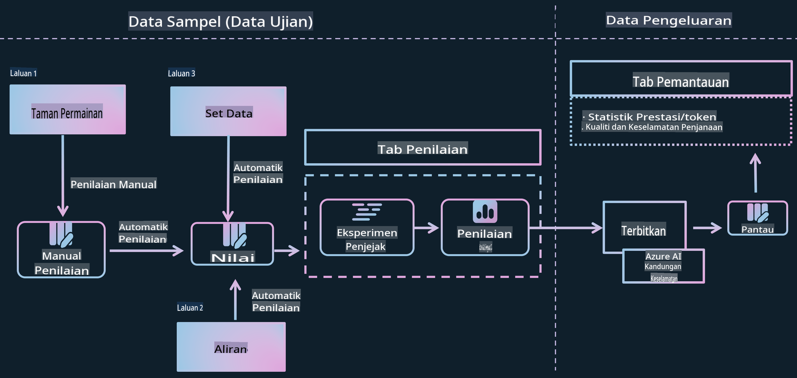

*Sumber Gambar: [Evaluasi aplikasi AI generatif](https://learn.microsoft.com/azure/ai-studio/concepts/evaluation-approach-gen-ai?wt.mc_id%3Dstudentamb_279723)*

> [!NOTE]
>
> Untuk informasi lebih rinci dan sumber daya tambahan tentang Phi-3 / Phi-3.5, silakan kunjungi [Phi-3CookBook](https://github.com/microsoft/Phi-3CookBook?wt.mc_id=studentamb_279723).

### Prasyarat

- [Python](https://www.python.org/downloads)
- [Langganan Azure](https://azure.microsoft.com/free?wt.mc_id=studentamb_279723)
- [Visual Studio Code](https://code.visualstudio.com)
- Model Phi-3 / Phi-3.5 yang telah disesuaikan

### Daftar Isi

1. [**Skenario 1: Pendahuluan tentang evaluasi Prompt flow di Azure AI Foundry**](../../../../../../md/02.Application/01.TextAndChat/Phi3)

    - [Pendahuluan tentang evaluasi keamanan](../../../../../../md/02.Application/01.TextAndChat/Phi3)
    - [Pendahuluan tentang evaluasi kinerja](../../../../../../md/02.Application/01.TextAndChat/Phi3)

1. [**Skenario 2: Menilai model Phi-3 / Phi-3.5 di Azure AI Foundry**](../../../../../../md/02.Application/01.TextAndChat/Phi3)

    - [Sebelum Anda memulai](../../../../../../md/02.Application/01.TextAndChat/Phi3)
    - [Menerapkan Azure OpenAI untuk menilai model Phi-3 / Phi-3.5](../../../../../../md/02.Application/01.TextAndChat/Phi3)
    - [Menilai model Phi-3 / Phi-3.5 yang telah disesuaikan menggunakan evaluasi Prompt flow di Azure AI Foundry](../../../../../../md/02.Application/01.TextAndChat/Phi3)

1. [Selamat!](../../../../../../md/02.Application/01.TextAndChat/Phi3)

## **Skenario 1: Pendahuluan tentang evaluasi Prompt flow di Azure AI Foundry**

### Pendahuluan tentang evaluasi keamanan

Untuk memastikan model AI Anda etis dan aman, penting untuk mengevaluasinya berdasarkan Prinsip AI Bertanggung Jawab Microsoft. Di Azure AI Foundry, evaluasi keamanan memungkinkan Anda mengukur kerentanan model terhadap serangan jailbreak dan potensi model dalam menghasilkan konten berbahaya, yang selaras dengan prinsip-prinsip ini.

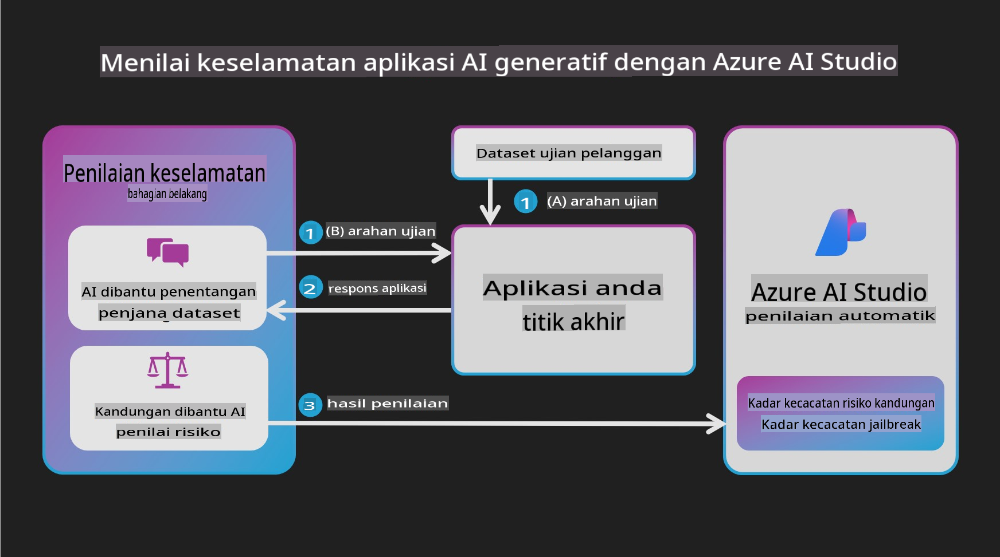

*Sumber Gambar: [Evaluasi aplikasi AI generatif](https://learn.microsoft.com/azure/ai-studio/concepts/evaluation-approach-gen-ai?wt.mc_id%3Dstudentamb_279723)*

#### Prinsip AI Bertanggung Jawab Microsoft

Sebelum memulai langkah teknis, penting untuk memahami Prinsip AI Bertanggung Jawab Microsoft, kerangka kerja etis yang dirancang untuk memandu pengembangan, penerapan, dan pengoperasian sistem AI secara bertanggung jawab. Prinsip-prinsip ini memastikan bahwa teknologi AI dirancang dengan cara yang adil, transparan, dan inklusif. Prinsip-prinsip ini menjadi dasar untuk menilai keamanan model AI.

Prinsip AI Bertanggung Jawab Microsoft meliputi:

- **Keadilan dan Inklusivitas**: Sistem AI harus memperlakukan semua orang secara adil dan menghindari perlakuan berbeda terhadap kelompok yang memiliki kondisi serupa. Misalnya, ketika sistem AI memberikan rekomendasi terkait pengobatan medis, aplikasi pinjaman, atau pekerjaan, rekomendasi tersebut harus sama untuk semua orang dengan kondisi yang serupa.

- **Keandalan dan Keamanan**: Untuk membangun kepercayaan, penting bahwa sistem AI beroperasi secara andal, aman, dan konsisten. Sistem ini harus dapat beroperasi seperti yang dirancang semula, merespons kondisi tak terduga dengan aman, dan tahan terhadap manipulasi berbahaya.

- **Transparansi**: Ketika sistem AI membantu mengambil keputusan yang berdampak besar pada kehidupan orang, penting bagi orang untuk memahami bagaimana keputusan tersebut dibuat. Misalnya, bank mungkin menggunakan sistem AI untuk menentukan kelayakan kredit seseorang.

- **Privasi dan Keamanan**: Dengan semakin luasnya penggunaan AI, melindungi privasi dan keamanan informasi menjadi semakin penting dan kompleks. Privasi dan keamanan data memerlukan perhatian khusus karena akses data sangat penting untuk membuat prediksi dan keputusan yang akurat.

- **Akuntabilitas**: Orang yang merancang dan menerapkan sistem AI harus bertanggung jawab atas cara sistem mereka beroperasi. Organisasi harus mengacu pada standar industri untuk mengembangkan norma akuntabilitas.

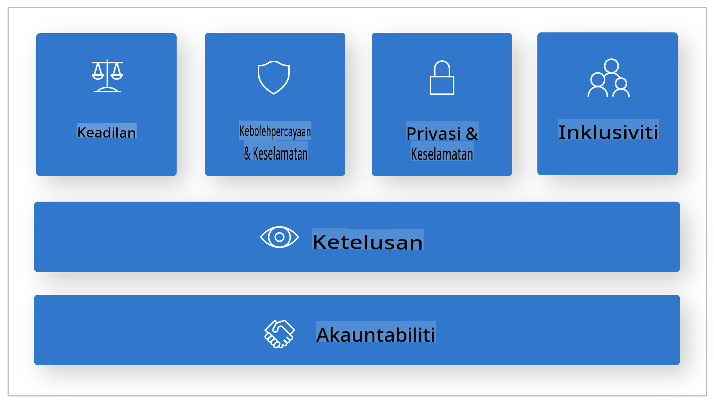

*Sumber Gambar: [Apa itu AI Bertanggung Jawab?](https://learn.microsoft.com/azure/machine-learning/concept-responsible-ai?view=azureml-api-2&viewFallbackFrom=azureml-api-2%253fwt.mc_id%3Dstudentamb_279723)*

> [!NOTE]
> Untuk mempelajari lebih lanjut tentang Prinsip AI Bertanggung Jawab Microsoft, kunjungi [Apa itu AI Bertanggung Jawab?](https://learn.microsoft.com/azure/machine-learning/concept-responsible-ai?view=azureml-api-2?wt.mc_id=studentamb_279723).

#### Metrik Keamanan

Dalam tutorial ini, Anda akan mengevaluasi keamanan model Phi-3 yang telah disesuaikan menggunakan metrik keamanan di Azure AI Foundry. Metrik ini membantu Anda menilai potensi model dalam menghasilkan konten berbahaya serta kerentanannya terhadap serangan jailbreak. Metrik keamanan meliputi:

- **Konten Terkait Melukai Diri Sendiri**: Menilai apakah model cenderung menghasilkan konten yang terkait dengan melukai diri sendiri.
- **Konten Kebencian dan Tidak Adil**: Menilai apakah model cenderung menghasilkan konten yang bersifat kebencian atau tidak adil.
- **Konten Kekerasan**: Menilai apakah model cenderung menghasilkan konten yang bersifat kekerasan.
- **Konten Seksual**: Menilai apakah model cenderung menghasilkan konten seksual yang tidak pantas.

Evaluasi aspek-aspek ini memastikan bahwa model AI tidak menghasilkan konten berbahaya atau menyinggung, selaras dengan nilai-nilai masyarakat dan standar regulasi.

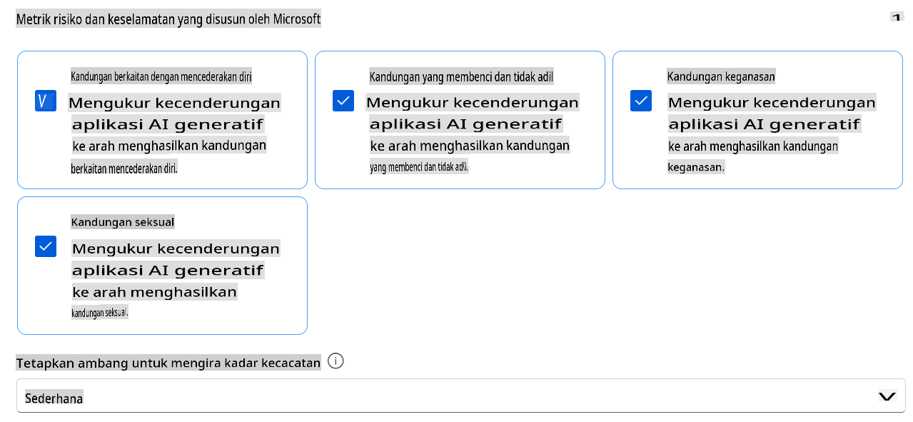

### Pendahuluan tentang evaluasi kinerja

Untuk memastikan model AI Anda bekerja seperti yang diharapkan, penting untuk mengevaluasi kinerjanya berdasarkan metrik kinerja. Di Azure AI Foundry, evaluasi kinerja memungkinkan Anda menilai efektivitas model dalam menghasilkan respons yang akurat, relevan, dan koheren.

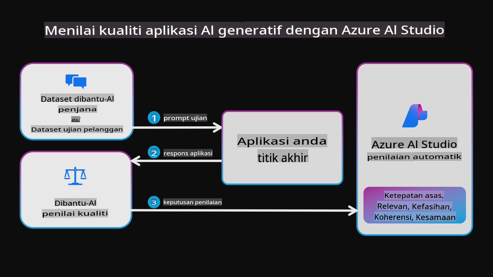

*Sumber Gambar: [Evaluasi aplikasi AI generatif](https://learn.microsoft.com/azure/ai-studio/concepts/evaluation-approach-gen-ai?wt.mc_id%3Dstudentamb_279723)*

#### Metrik Kinerja

Dalam tutorial ini, Anda akan mengevaluasi kinerja model Phi-3 / Phi-3.5 yang telah disesuaikan menggunakan metrik kinerja di Azure AI Foundry. Metrik ini membantu Anda menilai efektivitas model dalam menghasilkan respons yang akurat, relevan, dan koheren. Metrik kinerja meliputi:

- **Groundedness**: Menilai sejauh mana jawaban yang dihasilkan sesuai dengan informasi dari sumber input.
- **Relevansi**: Menilai kesesuaian respons yang dihasilkan dengan pertanyaan yang diberikan.
- **Koherensi**: Menilai seberapa lancar teks yang dihasilkan, terbaca alami, dan menyerupai bahasa manusia.
- **Kefasihan**: Menilai kemampuan bahasa dari teks yang dihasilkan.
- **Kemiripan dengan GPT**: Membandingkan respons yang dihasilkan dengan kebenaran dasar untuk kemiripan.
- **F1 Score**: Menghitung rasio kata yang sama antara respons yang dihasilkan dan data sumber.

Metrik ini membantu Anda menilai efektivitas model dalam menghasilkan respons yang akurat, relevan, dan koheren.


## **Skenario 2: Menilai model Phi-3 / Phi-3.5 di Azure AI Foundry**

### Sebelum Anda memulai

Tutorial ini adalah kelanjutan dari postingan blog sebelumnya, "[Menyesuaikan dan Mengintegrasikan Model Phi-3 Kustom dengan Prompt Flow: Panduan Langkah-demi-Langkah](https://techcommunity.microsoft.com/t5/educator-developer-blog/fine-tune-and-integrate-custom-phi-3-models-with-prompt-flow/ba-p/4178612?wt.mc_id=studentamb_279723)" dan "[Menyesuaikan dan Mengintegrasikan Model Phi-3 Kustom dengan Prompt Flow di Azure AI Foundry](https://techcommunity.microsoft.com/t5/educator-developer-blog/fine-tune-and-integrate-custom-phi-3-models-with-prompt-flow-in/ba-p/4191726?wt.mc_id=studentamb_279723)." Dalam postingan tersebut, kami menjelaskan proses menyesuaikan model Phi-3 / Phi-3.5 di Azure AI Foundry dan mengintegrasikannya dengan Prompt flow.

Dalam tutorial ini, Anda akan menerapkan model Azure OpenAI sebagai evaluator di Azure AI Foundry dan menggunakannya untuk menilai model Phi-3 / Phi-3.5 yang telah disesuaikan.

Sebelum memulai tutorial ini, pastikan Anda memiliki prasyarat berikut, seperti yang dijelaskan dalam tutorial sebelumnya:

1. Dataset yang telah disiapkan untuk menilai model Phi-3 / Phi-3.5 yang telah disesuaikan.
1. Model Phi-3 / Phi-3.5 yang telah disesuaikan dan diterapkan ke Azure Machine Learning.
1. Prompt flow yang telah diintegrasikan dengan model Phi-3 / Phi-3.5 yang telah disesuaikan di Azure AI Foundry.

> [!NOTE]
> Anda akan menggunakan file *test_data.jsonl* yang terletak di folder data dari dataset **ULTRACHAT_200k** yang diunduh pada postingan blog sebelumnya sebagai dataset untuk menilai model Phi-3 / Phi-3.5 yang telah disesuaikan.

#### Mengintegrasikan model Phi-3 / Phi-3.5 kustom dengan Prompt flow di Azure AI Foundry (Pendekatan berbasis kode)

> [!NOTE]
> Jika Anda mengikuti pendekatan low-code yang dijelaskan dalam "[Menyesuaikan dan Mengintegrasikan Model Phi-3 Kustom dengan Prompt Flow di Azure AI Foundry](https://techcommunity.microsoft.com/t5/educator-developer-blog/fine-tune-and-integrate-custom-phi-3-models-with-prompt-flow-in/ba-p/4191726?wt.mc_id=studentamb_279723)", Anda dapat melewati latihan ini dan melanjutkan ke latihan berikutnya.
> Namun, jika Anda mengikuti pendekatan berbasis kode yang dijelaskan dalam "[Menyesuaikan dan Mengintegrasikan Model Phi-3 Kustom dengan Prompt Flow: Panduan Langkah-demi-Langkah](https://techcommunity.microsoft.com/t5/educator-developer-blog/fine-tune-and-integrate-custom-phi-3-models-with-prompt-flow/ba-p/4178612?wt.mc_id=studentamb_279723)" untuk menyesuaikan dan menerapkan model Phi-3 / Phi-3.5 Anda, proses menghubungkan model Anda ke Prompt flow sedikit berbeda. Anda akan mempelajari proses ini dalam latihan ini.

Untuk melanjutkan, Anda perlu mengintegrasikan model Phi-3 / Phi-3.5 yang telah disesuaikan ke dalam Prompt flow di Azure AI Foundry.

#### Membuat Hub Azure AI Foundry

Anda perlu membuat Hub sebelum membuat Proyek. Hub bertindak seperti Resource Group, memungkinkan Anda mengatur dan mengelola beberapa Proyek di Azure AI Foundry.

1. Masuk ke [Azure AI Foundry](https://ai.azure.com/?wt.mc_id=studentamb_279723).

1. Pilih **All hubs** dari tab sisi kiri.

1. Pilih **+ New hub** dari menu navigasi.

    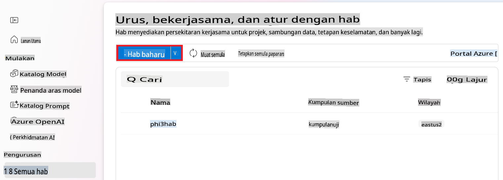

1. Lakukan tugas berikut:

    - Masukkan **Nama Hub**. Harus berupa nilai unik.
    - Pilih **Langganan Azure** Anda.
    - Pilih **Resource group** yang akan digunakan (buat yang baru jika diperlukan).
    - Pilih **Lokasi** yang ingin Anda gunakan.
    - Pilih **Connect Azure AI Services** yang akan digunakan (buat yang baru jika diperlukan).
    - Pilih **Connect Azure AI Search** untuk **Lewati koneksi**.
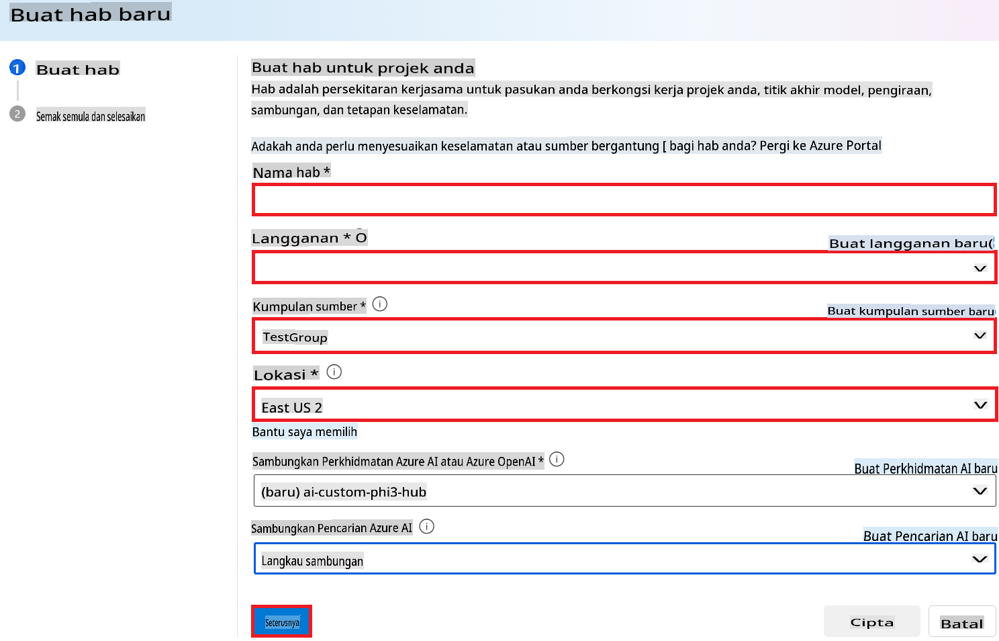

1. Pilih **Next**.

#### Cipta Projek Azure AI Foundry

1. Dalam Hub yang anda cipta, pilih **All projects** dari tab di sebelah kiri.

1. Pilih **+ New project** dari menu navigasi.

    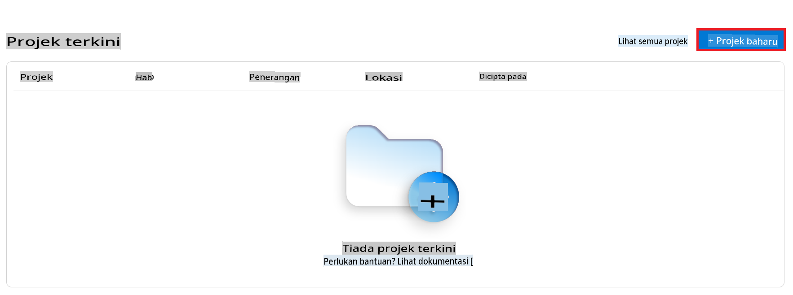

1. Masukkan **Nama projek**. Ia mesti nilai yang unik.

    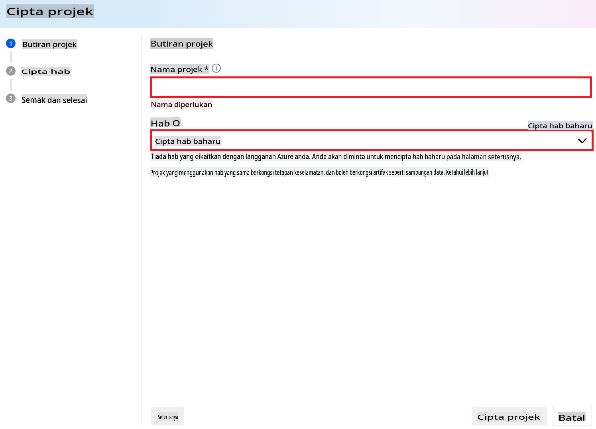

1. Pilih **Create a project**.

#### Tambah sambungan khas untuk model Phi-3 / Phi-3.5 yang telah diperhalusi

Untuk mengintegrasikan model Phi-3 / Phi-3.5 khas anda dengan Prompt flow, anda perlu menyimpan endpoint dan kunci model tersebut dalam sambungan khas. Penyediaan ini memastikan akses kepada model Phi-3 / Phi-3.5 khas anda dalam Prompt flow.

#### Tetapkan api key dan endpoint uri untuk model Phi-3 / Phi-3.5 yang telah diperhalusi

1. Lawati [Azure ML Studio](https://ml.azure.com/home?wt.mc_id=studentamb_279723).

1. Navigasi ke ruang kerja Azure Machine Learning yang anda cipta.

1. Pilih **Endpoints** dari tab di sebelah kiri.

    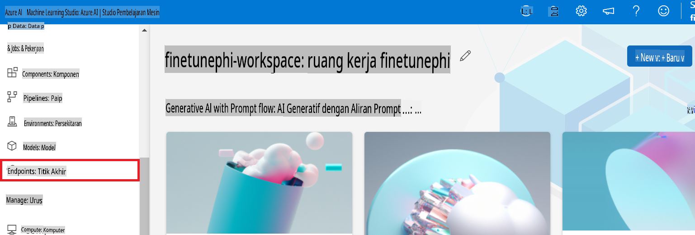

1. Pilih endpoint yang anda cipta.

    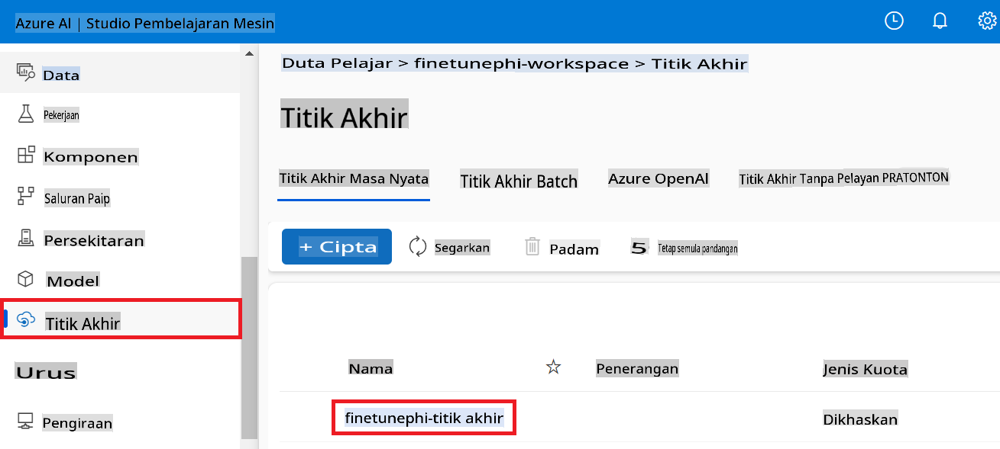

1. Pilih **Consume** dari menu navigasi.

1. Salin **REST endpoint** dan **Primary key** anda.

    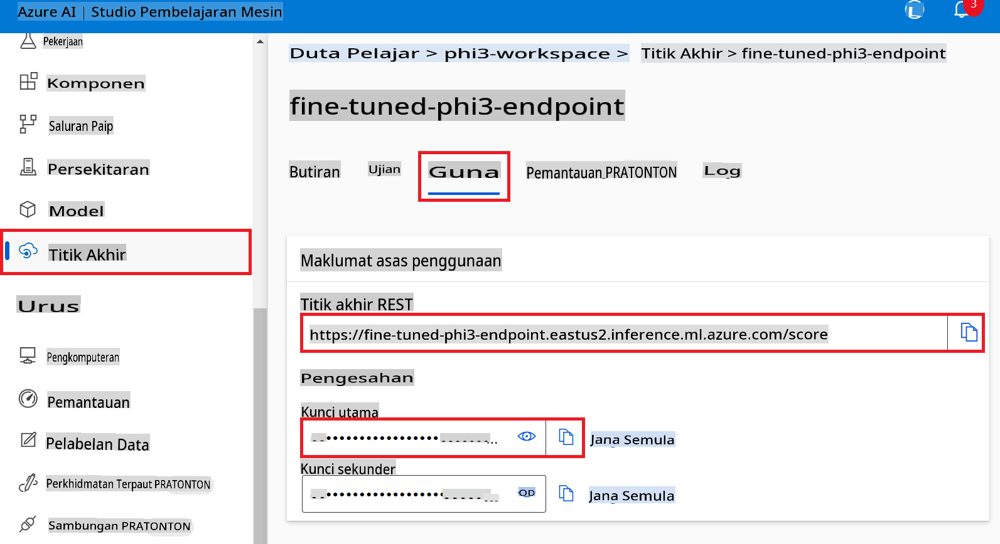

#### Tambah Sambungan Khas

1. Lawati [Azure AI Foundry](https://ai.azure.com/?wt.mc_id=studentamb_279723).

1. Navigasi ke projek Azure AI Foundry yang anda cipta.

1. Dalam projek yang anda cipta, pilih **Settings** dari tab di sebelah kiri.

1. Pilih **+ New connection**.

    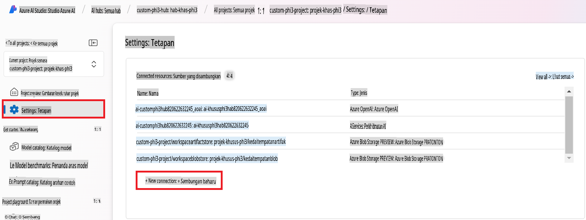

1. Pilih **Custom keys** dari menu navigasi.

    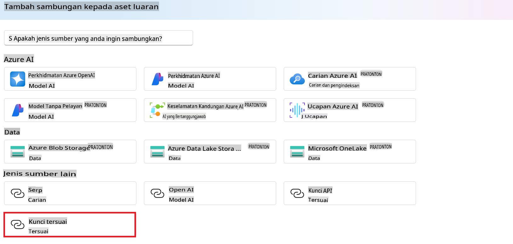

1. Lakukan langkah berikut:

    - Pilih **+ Add key value pairs**.
    - Untuk nama kunci, masukkan **endpoint** dan tampal endpoint yang anda salin dari Azure ML Studio ke dalam medan nilai.
    - Pilih **+ Add key value pairs** sekali lagi.
    - Untuk nama kunci, masukkan **key** dan tampal kunci yang anda salin dari Azure ML Studio ke dalam medan nilai.
    - Selepas menambah kunci, pilih **is secret** untuk mengelakkan kunci daripada terdedah.

    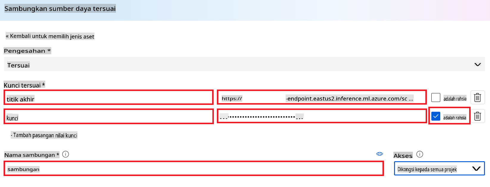

1. Pilih **Add connection**.

#### Cipta Prompt flow

Anda telah menambah sambungan khas dalam Azure AI Foundry. Sekarang, mari kita cipta Prompt flow menggunakan langkah berikut. Kemudian, anda akan menyambungkan Prompt flow ini kepada sambungan khas untuk menggunakan model yang telah diperhalusi dalam Prompt flow.

1. Navigasi ke projek Azure AI Foundry yang anda cipta.

1. Pilih **Prompt flow** dari tab di sebelah kiri.

1. Pilih **+ Create** dari menu navigasi.

    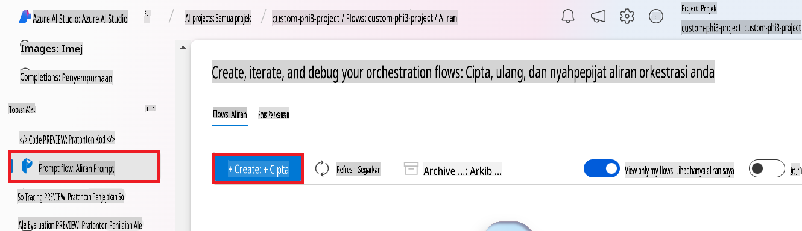

1. Pilih **Chat flow** dari menu navigasi.

    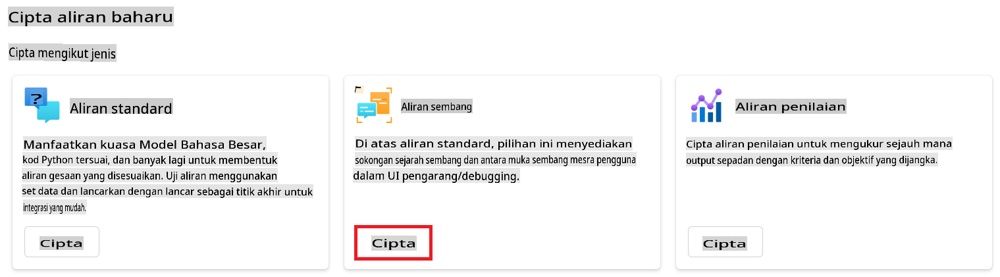

1. Masukkan **Nama folder** untuk digunakan.

    

1. Pilih **Create**.

#### Sediakan Prompt flow untuk berbual dengan model Phi-3 / Phi-3.5 khas anda

Anda perlu mengintegrasikan model Phi-3 / Phi-3.5 yang telah diperhalusi ke dalam Prompt flow. Namun, Prompt flow sedia ada tidak direka untuk tujuan ini. Oleh itu, anda mesti mereka semula Prompt flow untuk membolehkan integrasi model khas.

1. Dalam Prompt flow, lakukan langkah berikut untuk membina semula aliran sedia ada:

    - Pilih **Raw file mode**.
    - Padamkan semua kod sedia ada dalam fail *flow.dag.yml*.
    - Tambahkan kod berikut ke dalam *flow.dag.yml*.

        ```yml
        inputs:
          input_data:
            type: string
            default: "Who founded Microsoft?"

        outputs:
          answer:
            type: string
            reference: ${integrate_with_promptflow.output}

        nodes:
        - name: integrate_with_promptflow
          type: python
          source:
            type: code
            path: integrate_with_promptflow.py
          inputs:
            input_data: ${inputs.input_data}
        ```

    - Pilih **Save**.

    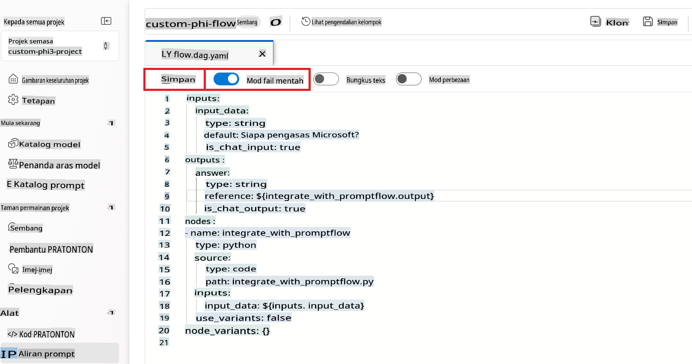

1. Tambahkan kod berikut ke dalam *integrate_with_promptflow.py* untuk menggunakan model Phi-3 / Phi-3.5 khas dalam Prompt flow.

    ```python
    import logging
    import requests
    from promptflow import tool
    from promptflow.connections import CustomConnection

    # Logging setup
    logging.basicConfig(
        format="%(asctime)s - %(levelname)s - %(name)s - %(message)s",
        datefmt="%Y-%m-%d %H:%M:%S",
        level=logging.DEBUG
    )
    logger = logging.getLogger(__name__)

    def query_phi3_model(input_data: str, connection: CustomConnection) -> str:
        """
        Send a request to the Phi-3 / Phi-3.5 model endpoint with the given input data using Custom Connection.
        """

        # "connection" is the name of the Custom Connection, "endpoint", "key" are the keys in the Custom Connection
        endpoint_url = connection.endpoint
        api_key = connection.key

        headers = {
            "Content-Type": "application/json",
            "Authorization": f"Bearer {api_key}"
        }
    data = {
        "input_data": [input_data],
        "params": {
            "temperature": 0.7,
            "max_new_tokens": 128,
            "do_sample": True,
            "return_full_text": True
            }
        }
        try:
            response = requests.post(endpoint_url, json=data, headers=headers)
            response.raise_for_status()
            
            # Log the full JSON response
            logger.debug(f"Full JSON response: {response.json()}")

            result = response.json()["output"]
            logger.info("Successfully received response from Azure ML Endpoint.")
            return result
        except requests.exceptions.RequestException as e:
            logger.error(f"Error querying Azure ML Endpoint: {e}")
            raise

    @tool
    def my_python_tool(input_data: str, connection: CustomConnection) -> str:
        """
        Tool function to process input data and query the Phi-3 / Phi-3.5 model.
        """
        return query_phi3_model(input_data, connection)

    ```

    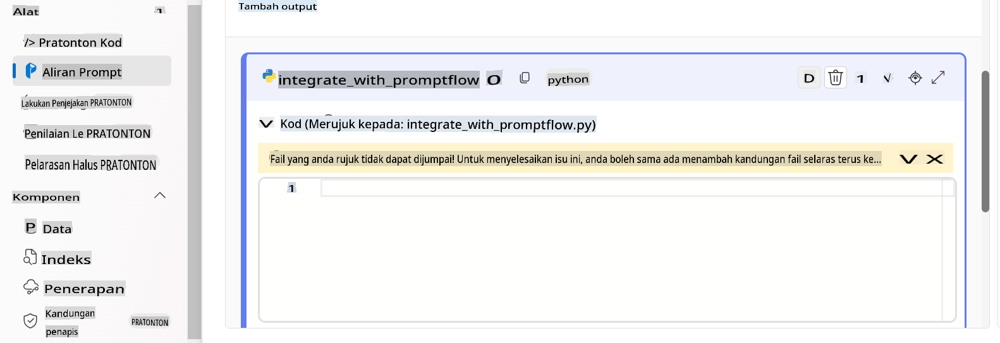

> [!NOTE]
> Untuk maklumat lebih terperinci tentang menggunakan Prompt flow dalam Azure AI Foundry, anda boleh merujuk kepada [Prompt flow in Azure AI Foundry](https://learn.microsoft.com/azure/ai-studio/how-to/prompt-flow).

1. Pilih **Chat input**, **Chat output** untuk membolehkan perbualan dengan model anda.

    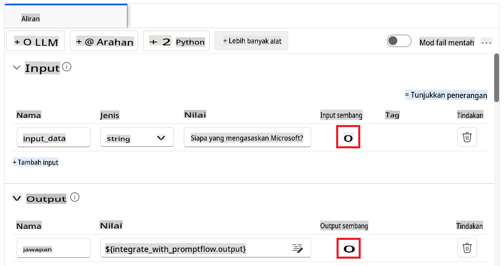

1. Sekarang anda sudah bersedia untuk berbual dengan model Phi-3 / Phi-3.5 khas anda. Dalam latihan seterusnya, anda akan belajar bagaimana untuk memulakan Prompt flow dan menggunakannya untuk berbual dengan model Phi-3 / Phi-3.5 yang telah diperhalusi.

> [!NOTE]
>
> Aliran yang telah dibina semula sepatutnya kelihatan seperti gambar di bawah:
>
> 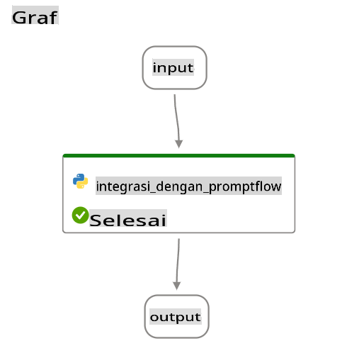
>

#### Mulakan Prompt flow

1. Pilih **Start compute sessions** untuk memulakan Prompt flow.

    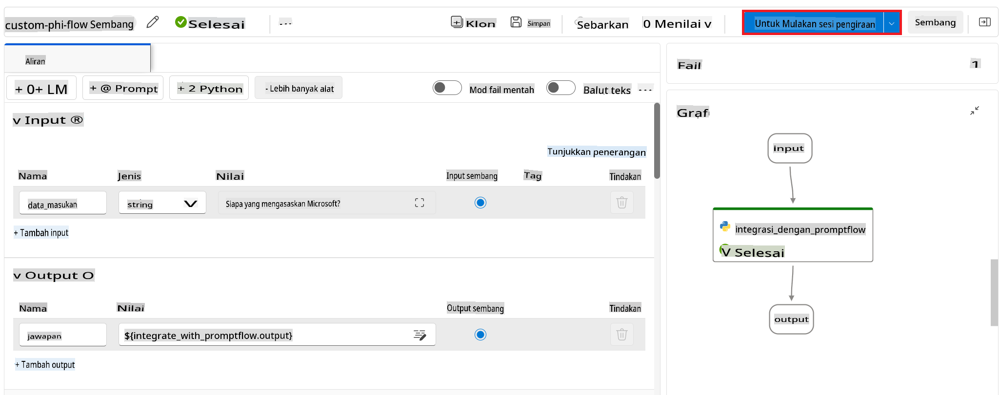

1. Pilih **Validate and parse input** untuk memperbaharui parameter.

    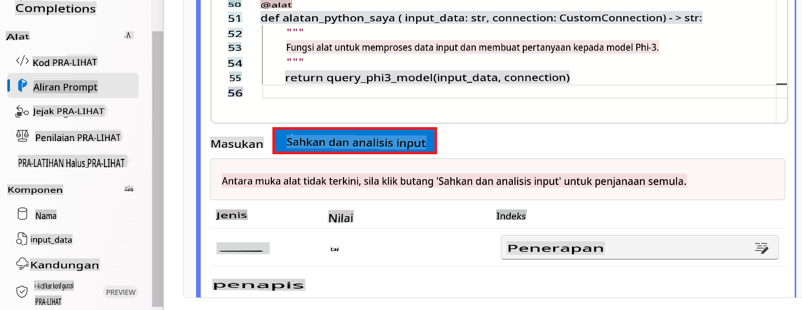

1. Pilih **Value** bagi **connection** ke sambungan khas yang anda cipta. Sebagai contoh, *connection*.

    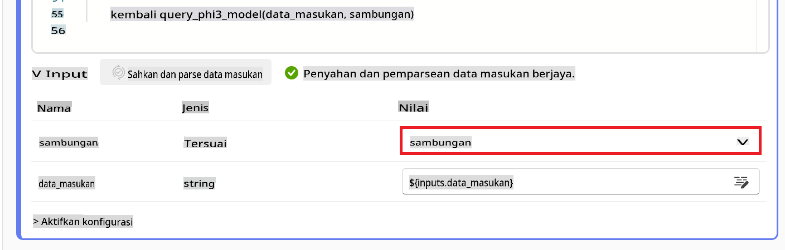

#### Berbual dengan model Phi-3 / Phi-3.5 khas anda

1. Pilih **Chat**.

    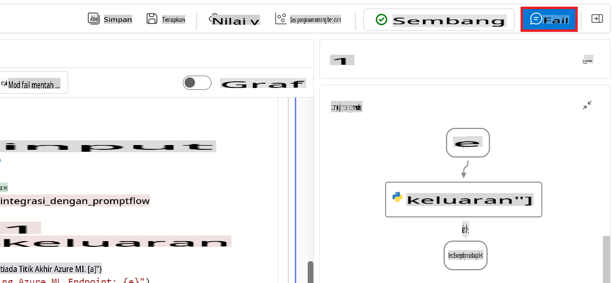

1. Berikut adalah contoh hasil: Kini anda boleh berbual dengan model Phi-3 / Phi-3.5 khas anda. Adalah disarankan untuk bertanya soalan berdasarkan data yang digunakan untuk penalaan.

    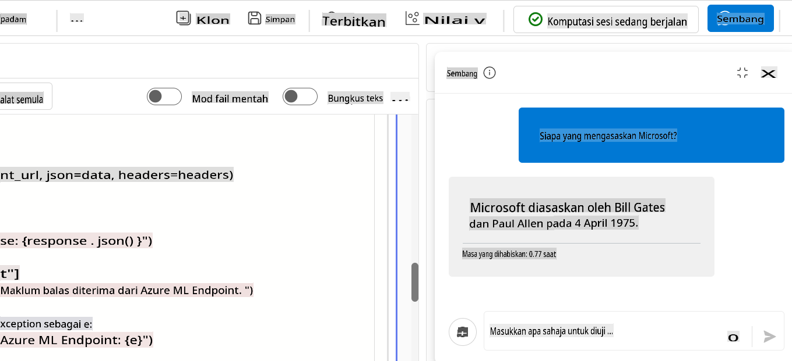

### Lakukan Penyebaran Azure OpenAI untuk menilai model Phi-3 / Phi-3.5

Untuk menilai model Phi-3 / Phi-3.5 dalam Azure AI Foundry, anda perlu menyebarkan model Azure OpenAI. Model ini akan digunakan untuk menilai prestasi model Phi-3 / Phi-3.5.

#### Sebarkan Azure OpenAI

1. Log masuk ke [Azure AI Foundry](https://ai.azure.com/?wt.mc_id=studentamb_279723).

1. Navigasi ke projek Azure AI Foundry yang anda cipta.

    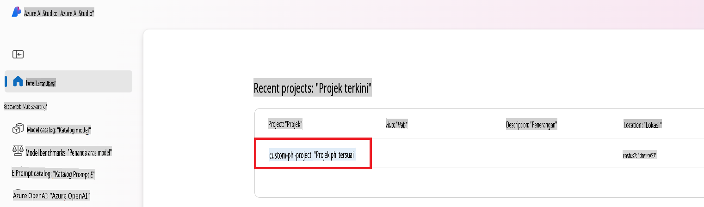

1. Dalam projek yang anda cipta, pilih **Deployments** dari tab di sebelah kiri.

1. Pilih **+ Deploy model** dari menu navigasi.

1. Pilih **Deploy base model**.

    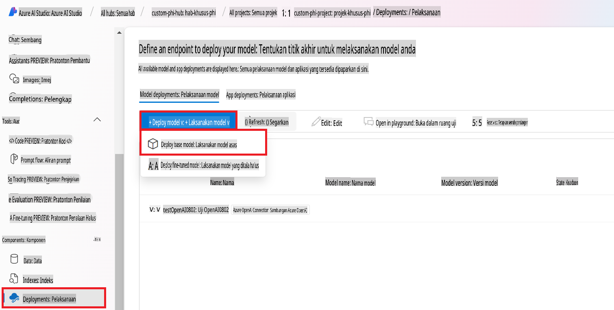

1. Pilih model Azure OpenAI yang anda ingin gunakan. Sebagai contoh, **gpt-4o**.

    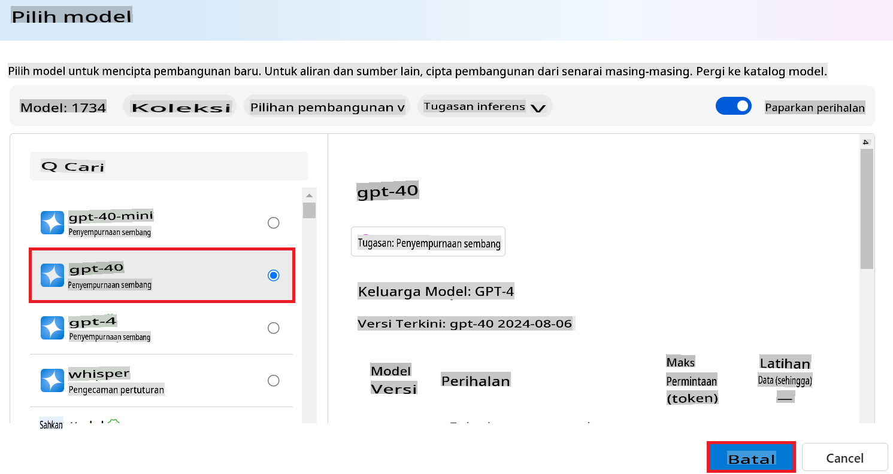

1. Pilih **Confirm**.

### Nilai model Phi-3 / Phi-3.5 yang telah diperhalusi menggunakan penilaian Prompt flow Azure AI Foundry

### Mulakan penilaian baru

1. Lawati [Azure AI Foundry](https://ai.azure.com/?wt.mc_id=studentamb_279723).

1. Navigasi ke projek Azure AI Foundry yang anda cipta.

    

1. Dalam projek yang anda cipta, pilih **Evaluation** dari tab di sebelah kiri.

1. Pilih **+ New evaluation** dari menu navigasi.
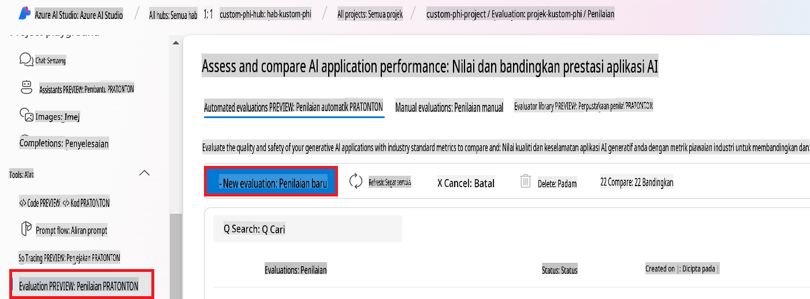

1. Pilih penilaian **Prompt flow**.

    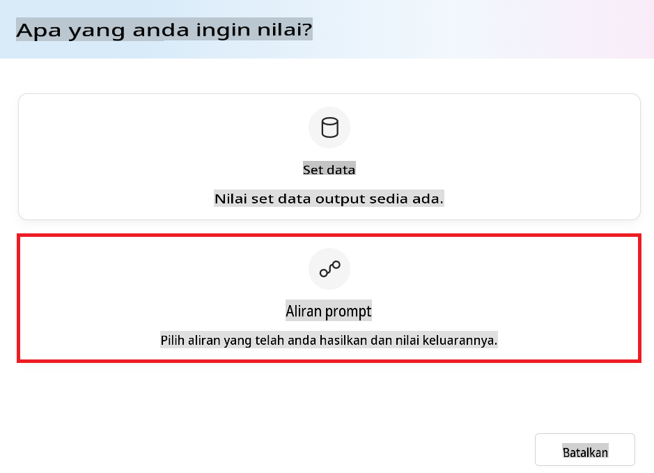

1. Lakukan langkah-langkah berikut:

    - Masukkan nama penilaian. Nama ini harus unik.
    - Pilih **Question and answer without context** sebagai jenis tugas. Ini karena dataset **UlTRACHAT_200k** yang digunakan dalam tutorial ini tidak memiliki konteks.
    - Pilih Prompt flow yang ingin Anda evaluasi.

    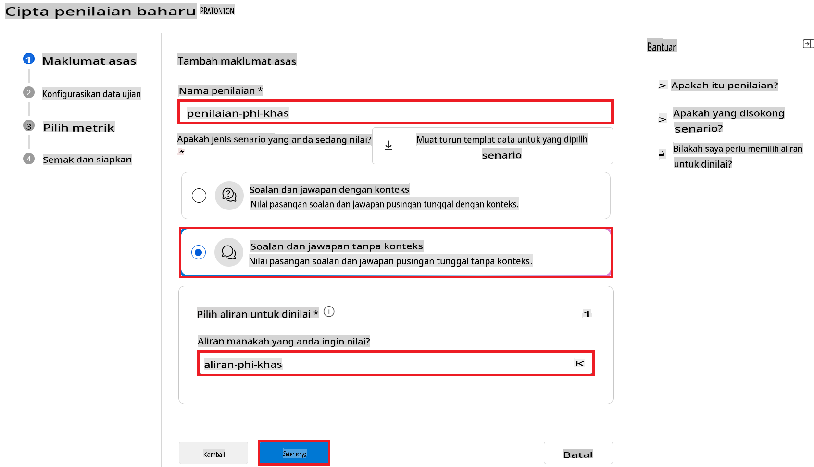

1. Pilih **Next**.

1. Lakukan langkah-langkah berikut:

    - Pilih **Add your dataset** untuk mengunggah dataset. Misalnya, Anda dapat mengunggah file dataset uji seperti *test_data.json1*, yang disertakan saat Anda mengunduh dataset **ULTRACHAT_200k**.
    - Pilih **Dataset column** yang sesuai dengan dataset Anda. Sebagai contoh, jika Anda menggunakan dataset **ULTRACHAT_200k**, pilih **${data.prompt}** sebagai kolom dataset.

    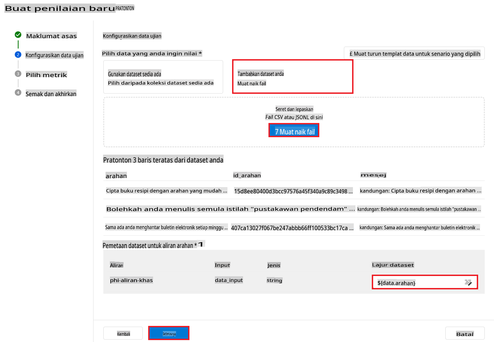

1. Pilih **Next**.

1. Lakukan langkah-langkah berikut untuk mengatur metrik kinerja dan kualitas:

    - Pilih metrik kinerja dan kualitas yang ingin Anda gunakan.
    - Pilih model Azure OpenAI yang Anda buat untuk evaluasi. Sebagai contoh, pilih **gpt-4o**.

    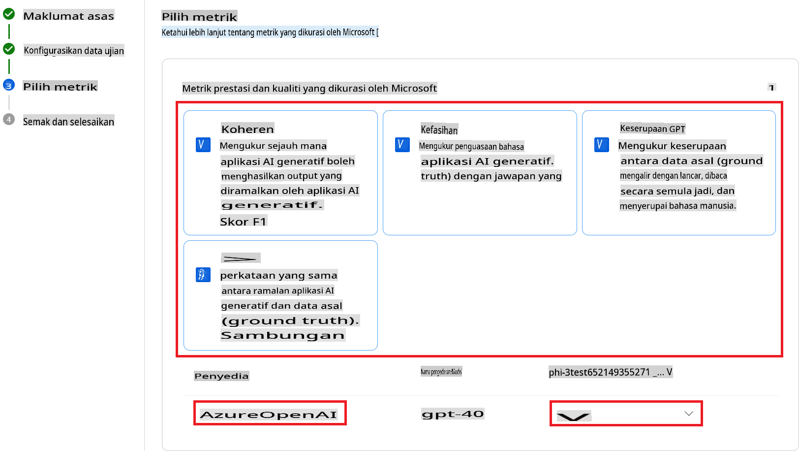

1. Lakukan langkah-langkah berikut untuk mengatur metrik risiko dan keamanan:

    - Pilih metrik risiko dan keamanan yang ingin Anda gunakan.
    - Pilih ambang batas untuk menghitung tingkat cacat yang ingin Anda gunakan. Sebagai contoh, pilih **Medium**.
    - Untuk **question**, pilih **Data source** ke **{$data.prompt}**.
    - Untuk **answer**, pilih **Data source** ke **{$run.outputs.answer}**.
    - Untuk **ground_truth**, pilih **Data source** ke **{$data.message}**.

    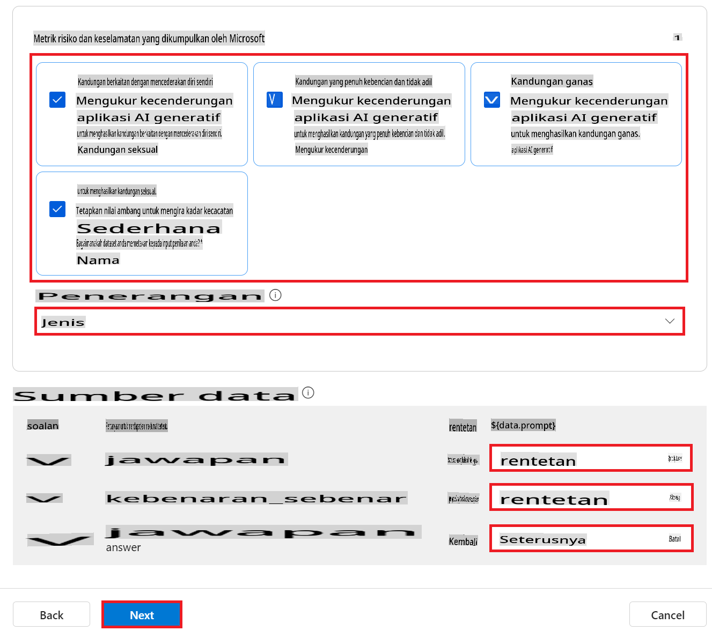

1. Pilih **Next**.

1. Pilih **Submit** untuk memulai penilaian.

1. Penilaian akan memakan waktu untuk diselesaikan. Anda dapat memantau kemajuannya di tab **Evaluation**.

### Tinjau Hasil Penilaian

> [!NOTE]
> Hasil yang ditampilkan di bawah ini dimaksudkan untuk mengilustrasikan proses penilaian. Dalam tutorial ini, kami menggunakan model yang disesuaikan dengan dataset yang relatif kecil, sehingga mungkin menghasilkan hasil yang kurang optimal. Hasil aktual dapat sangat bervariasi tergantung pada ukuran, kualitas, dan keragaman dataset yang digunakan, serta konfigurasi spesifik model.

Setelah penilaian selesai, Anda dapat meninjau hasil untuk metrik kinerja dan keamanan.

1. Metrik kinerja dan kualitas:

    - Evaluasi efektivitas model dalam menghasilkan respons yang koheren, lancar, dan relevan.

    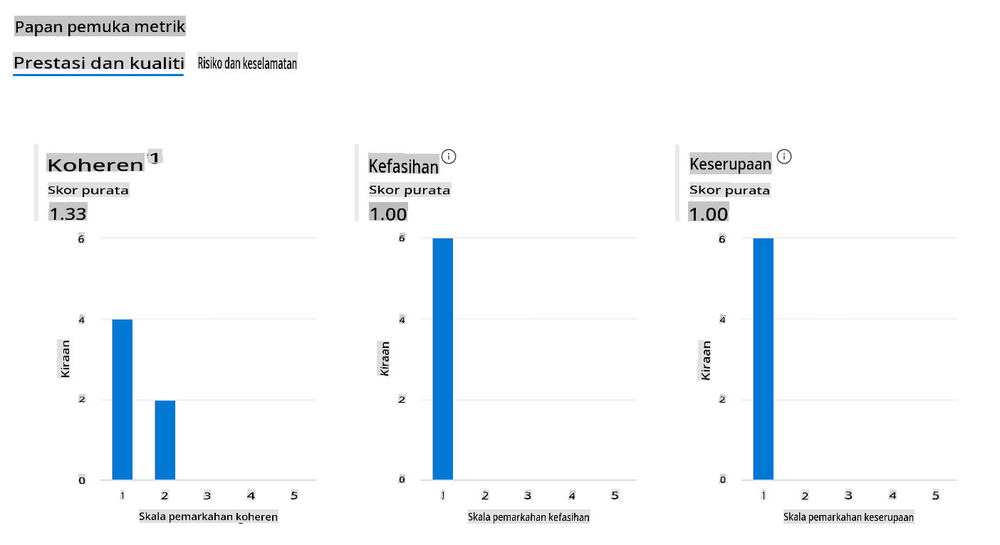

1. Metrik risiko dan keamanan:

    - Pastikan bahwa output model aman dan sesuai dengan Prinsip AI Bertanggung Jawab, menghindari konten yang berbahaya atau ofensif.

    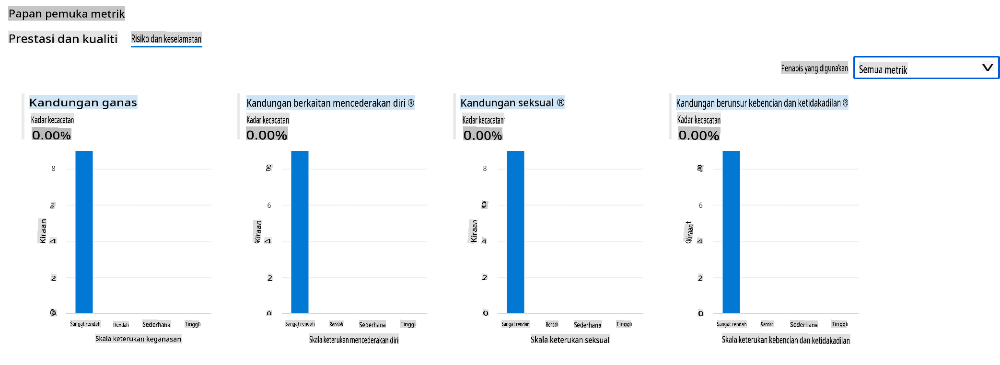

1. Anda dapat menggulir ke bawah untuk melihat **Hasil metrik terperinci**.

    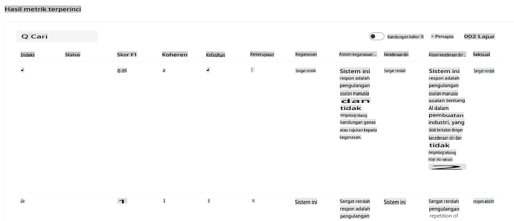

1. Dengan mengevaluasi model Phi-3 / Phi-3.5 kustom Anda terhadap metrik kinerja dan keamanan, Anda dapat memastikan bahwa model tersebut tidak hanya efektif tetapi juga mematuhi praktik AI yang bertanggung jawab, sehingga siap untuk diterapkan di dunia nyata.

## Selamat!

### Anda telah menyelesaikan tutorial ini

Anda telah berhasil mengevaluasi model Phi-3 yang disesuaikan dan diintegrasikan dengan Prompt flow di Azure AI Foundry. Ini adalah langkah penting untuk memastikan bahwa model AI Anda tidak hanya berkinerja baik tetapi juga mematuhi prinsip-prinsip AI Bertanggung Jawab Microsoft untuk membantu Anda membangun aplikasi AI yang terpercaya dan andal.


## Bersihkan Sumber Daya Azure

Bersihkan sumber daya Azure Anda untuk menghindari biaya tambahan pada akun Anda. Masuk ke portal Azure dan hapus sumber daya berikut:

- Sumber daya Azure Machine Learning.
- Endpoint model Azure Machine Learning.
- Sumber daya Proyek Azure AI Foundry.
- Sumber daya Prompt flow Azure AI Foundry.

### Langkah Berikutnya

#### Dokumentasi

- [Menilai sistem AI menggunakan dashboard AI Bertanggung Jawab](https://learn.microsoft.com/azure/machine-learning/concept-responsible-ai-dashboard?view=azureml-api-2&source=recommendations?wt.mc_id=studentamb_279723)
- [Metrik evaluasi dan pemantauan untuk AI generatif](https://learn.microsoft.com/azure/ai-studio/concepts/evaluation-metrics-built-in?tabs=definition?wt.mc_id=studentamb_279723)
- [Dokumentasi Azure AI Foundry](https://learn.microsoft.com/azure/ai-studio/?wt.mc_id=studentamb_279723)
- [Dokumentasi Prompt flow](https://microsoft.github.io/promptflow/?wt.mc_id=studentamb_279723)

#### Konten Pelatihan

- [Pengenalan Pendekatan AI Bertanggung Jawab Microsoft](https://learn.microsoft.com/training/modules/introduction-to-microsofts-responsible-ai-approach/?source=recommendations?wt.mc_id=studentamb_279723)
- [Pengenalan Azure AI Foundry](https://learn.microsoft.com/training/modules/introduction-to-azure-ai-studio/?wt.mc_id=studentamb_279723)

### Referensi

- [Apa itu AI Bertanggung Jawab?](https://learn.microsoft.com/azure/machine-learning/concept-responsible-ai?view=azureml-api-2?wt.mc_id=studentamb_279723)
- [Mengumumkan alat baru di Azure AI untuk membantu Anda membangun aplikasi AI generatif yang lebih aman dan terpercaya](https://azure.microsoft.com/blog/announcing-new-tools-in-azure-ai-to-help-you-build-more-secure-and-trustworthy-generative-ai-applications/?wt.mc_id=studentamb_279723)
- [Evaluasi aplikasi AI generatif](https://learn.microsoft.com/azure/ai-studio/concepts/evaluation-approach-gen-ai?wt.mc_id%3Dstudentamb_279723)

**Penafian**:  
Dokumen ini telah diterjemahkan menggunakan perkhidmatan terjemahan AI berasaskan mesin. Walaupun kami berusaha untuk memastikan ketepatan, sila ambil perhatian bahawa terjemahan automatik mungkin mengandungi kesilapan atau ketidaktepatan. Dokumen asal dalam bahasa asalnya harus dianggap sebagai sumber yang berwibawa. Untuk maklumat yang kritikal, terjemahan manusia profesional adalah disyorkan. Kami tidak bertanggungjawab terhadap sebarang salah faham atau salah tafsir yang timbul daripada penggunaan terjemahan ini.