# Melarasikan dan Mengintegrasikan Model Phi-3 Kustom dengan Prompt Flow di Azure AI Foundry

Contoh end-to-end (E2E) ini didasarkan pada panduan "[Melarasikan dan Mengintegrasikan Model Phi-3 Kustom dengan Prompt Flow di Azure AI Foundry](https://techcommunity.microsoft.com/t5/educator-developer-blog/fine-tune-and-integrate-custom-phi-3-models-with-prompt-flow-in/ba-p/4191726?WT.mc_id=aiml-137032-kinfeylo)" dari Komunitas Teknologi Microsoft. Panduan ini menjelaskan proses melarasikan, menyebarkan, dan mengintegrasikan model Phi-3 kustom dengan Prompt Flow di Azure AI Foundry.  
Berbeda dengan contoh E2E "[Melarasikan dan Mengintegrasikan Model Phi-3 Kustom dengan Prompt Flow](./E2E_Phi-3-FineTuning_PromptFlow_Integration.md)" yang dijalankan secara lokal, tutorial ini sepenuhnya berfokus pada melarasikan dan mengintegrasikan model Anda di dalam Azure AI / ML Studio.

## Ikhtisar

Dalam contoh E2E ini, Anda akan mempelajari cara melarasikan model Phi-3 dan mengintegrasikannya dengan Prompt Flow di Azure AI Foundry. Dengan memanfaatkan Azure AI / ML Studio, Anda akan membangun alur kerja untuk menyebarkan dan menggunakan model AI kustom. Contoh E2E ini dibagi menjadi tiga skenario:

**Skenario 1: Mengatur sumber daya Azure dan Mempersiapkan pelarasan**  
**Skenario 2: Melarasikan model Phi-3 dan Menyebarkannya di Azure Machine Learning Studio**  
**Skenario 3: Mengintegrasikan dengan Prompt Flow dan Berinteraksi dengan model kustom Anda di Azure AI Foundry**

Berikut adalah ikhtisar dari contoh E2E ini.

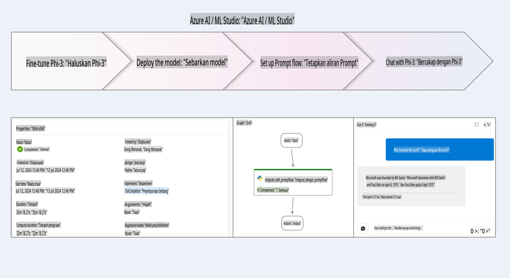

### Daftar Isi

1. **[Skenario 1: Mengatur sumber daya Azure dan Mempersiapkan pelarasan](../../../../../../md/02.Application/01.TextAndChat/Phi3)**  
    - [Membuat Azure Machine Learning Workspace](../../../../../../md/02.Application/01.TextAndChat/Phi3)  
    - [Meminta kuota GPU di Langganan Azure](../../../../../../md/02.Application/01.TextAndChat/Phi3)  
    - [Menambahkan penugasan peran](../../../../../../md/02.Application/01.TextAndChat/Phi3)  
    - [Mengatur proyek](../../../../../../md/02.Application/01.TextAndChat/Phi3)  
    - [Mempersiapkan dataset untuk pelarasan](../../../../../../md/02.Application/01.TextAndChat/Phi3)  

1. **[Skenario 2: Melarasikan model Phi-3 dan Menyebarkannya di Azure Machine Learning Studio](../../../../../../md/02.Application/01.TextAndChat/Phi3)**  
    - [Melarasikan model Phi-3](../../../../../../md/02.Application/01.TextAndChat/Phi3)  
    - [Menyebarkan model Phi-3 yang telah dilarasikan](../../../../../../md/02.Application/01.TextAndChat/Phi3)  

1. **[Skenario 3: Mengintegrasikan dengan Prompt Flow dan Berinteraksi dengan model kustom Anda di Azure AI Foundry](../../../../../../md/02.Application/01.TextAndChat/Phi3)**  
    - [Mengintegrasikan model Phi-3 kustom dengan Prompt Flow](../../../../../../md/02.Application/01.TextAndChat/Phi3)  
    - [Berinteraksi dengan model Phi-3 kustom Anda](../../../../../../md/02.Application/01.TextAndChat/Phi3)  

## Skenario 1: Mengatur sumber daya Azure dan Mempersiapkan pelarasan

### Membuat Azure Machine Learning Workspace

1. Ketik *azure machine learning* di **bilah pencarian** di bagian atas halaman portal dan pilih **Azure Machine Learning** dari opsi yang muncul.

    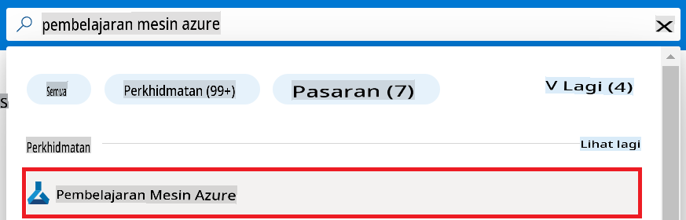

2. Pilih **+ Create** dari menu navigasi.  

3. Pilih **New workspace** dari menu navigasi.  

    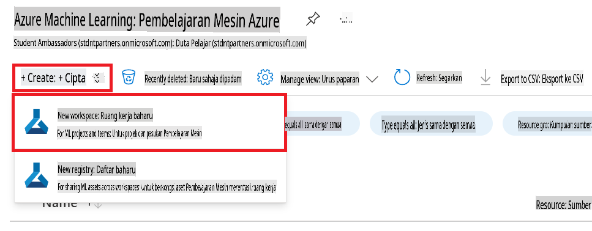

4. Lakukan langkah-langkah berikut:  

    - Pilih **Subscription** Azure Anda.  
    - Pilih **Resource group** yang akan digunakan (buat yang baru jika diperlukan).  
    - Masukkan **Workspace Name**. Nama ini harus unik.  
    - Pilih **Region** yang akan digunakan.  
    - Pilih **Storage account** yang akan digunakan (buat yang baru jika diperlukan).  
    - Pilih **Key vault** yang akan digunakan (buat yang baru jika diperlukan).  
    - Pilih **Application insights** yang akan digunakan (buat yang baru jika diperlukan).  
    - Pilih **Container registry** yang akan digunakan (buat yang baru jika diperlukan).  

    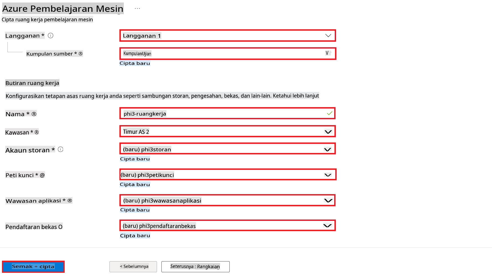

5. Pilih **Review + Create**.  

6. Pilih **Create**.  

### Meminta kuota GPU di Langganan Azure

Dalam tutorial ini, Anda akan mempelajari cara melarasikan dan menyebarkan model Phi-3 menggunakan GPU. Untuk pelarasan, Anda akan menggunakan GPU *Standard_NC24ads_A100_v4*, yang memerlukan permintaan kuota. Untuk penyebaran, Anda akan menggunakan GPU *Standard_NC6s_v3*, yang juga memerlukan permintaan kuota.

> [!NOTE]  
> Hanya langganan Pay-As-You-Go (jenis langganan standar) yang memenuhi syarat untuk alokasi GPU; langganan manfaat saat ini tidak didukung.  

1. Kunjungi [Azure ML Studio](https://ml.azure.com/home?wt.mc_id=studentamb_279723).  

1. Lakukan langkah-langkah berikut untuk meminta kuota *Standard NCADSA100v4 Family*:  

    - Pilih **Quota** dari tab sisi kiri.  
    - Pilih **Virtual machine family** yang akan digunakan. Misalnya, pilih **Standard NCADSA100v4 Family Cluster Dedicated vCPUs**, yang mencakup GPU *Standard_NC24ads_A100_v4*.  
    - Pilih **Request quota** dari menu navigasi.  

        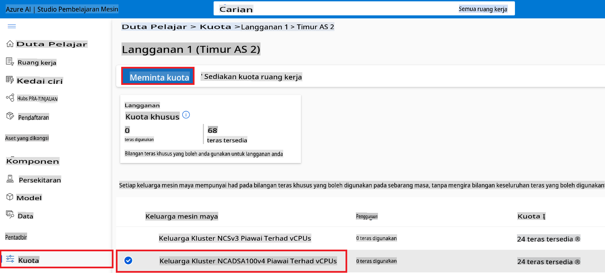

    - Di halaman Request quota, masukkan **New cores limit** yang ingin Anda gunakan. Misalnya, 24.  
    - Di halaman Request quota, pilih **Submit** untuk meminta kuota GPU.  

1. Lakukan langkah-langkah berikut untuk meminta kuota *Standard NCSv3 Family*:  

    - Pilih **Quota** dari tab sisi kiri.  
    - Pilih **Virtual machine family** yang akan digunakan. Misalnya, pilih **Standard NCSv3 Family Cluster Dedicated vCPUs**, yang mencakup GPU *Standard_NC6s_v3*.  
    - Pilih **Request quota** dari menu navigasi.  
    - Di halaman Request quota, masukkan **New cores limit** yang ingin Anda gunakan. Misalnya, 24.  
    - Di halaman Request quota, pilih **Submit** untuk meminta kuota GPU.  

### Menambahkan penugasan peran

Untuk melarasikan dan menyebarkan model Anda, Anda harus terlebih dahulu membuat User Assigned Managed Identity (UAI) dan memberikan izin yang sesuai. UAI ini akan digunakan untuk autentikasi selama penyebaran.

#### Membuat User Assigned Managed Identity (UAI)

1. Ketik *managed identities* di **bilah pencarian** di bagian atas halaman portal dan pilih **Managed Identities** dari opsi yang muncul.

    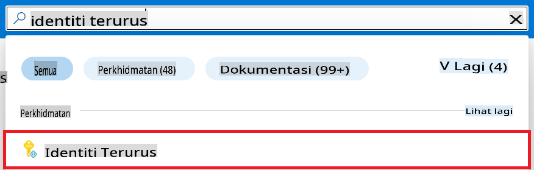

1. Pilih **+ Create**.

    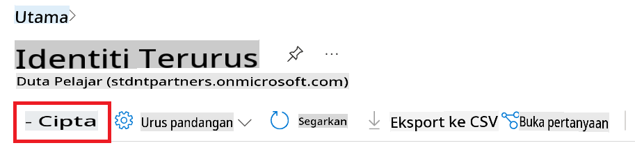

1. Lakukan langkah-langkah berikut:  

    - Pilih **Subscription** Azure Anda.  
    - Pilih **Resource group** yang akan digunakan (buat yang baru jika diperlukan).  
    - Pilih **Region** yang akan digunakan.  
    - Masukkan **Name**. Nama ini harus unik.  

    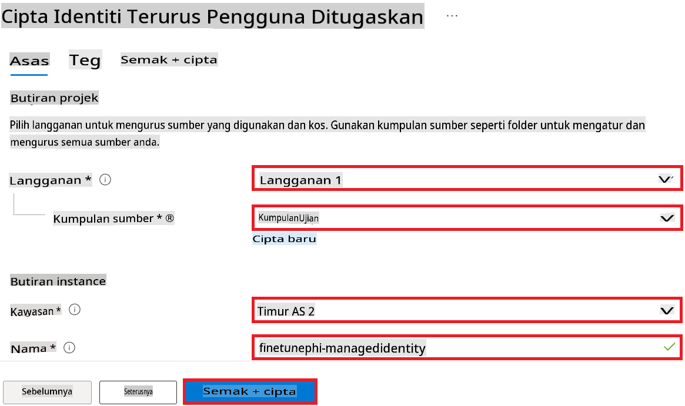

1. Pilih **Review + create**.  

1. Pilih **+ Create**.  

#### Menambahkan peran Contributor ke Managed Identity

1. Navigasikan ke resource Managed Identity yang Anda buat.  

1. Pilih **Azure role assignments** dari tab sisi kiri.  

1. Pilih **+Add role assignment** dari menu navigasi.  

1. Di halaman Add role assignment, lakukan langkah-langkah berikut:  
    - Pilih **Scope** ke **Resource group**.  
    - Pilih **Subscription** Azure Anda.  
    - Pilih **Resource group** yang akan digunakan.  
    - Pilih **Role** ke **Contributor**.  

    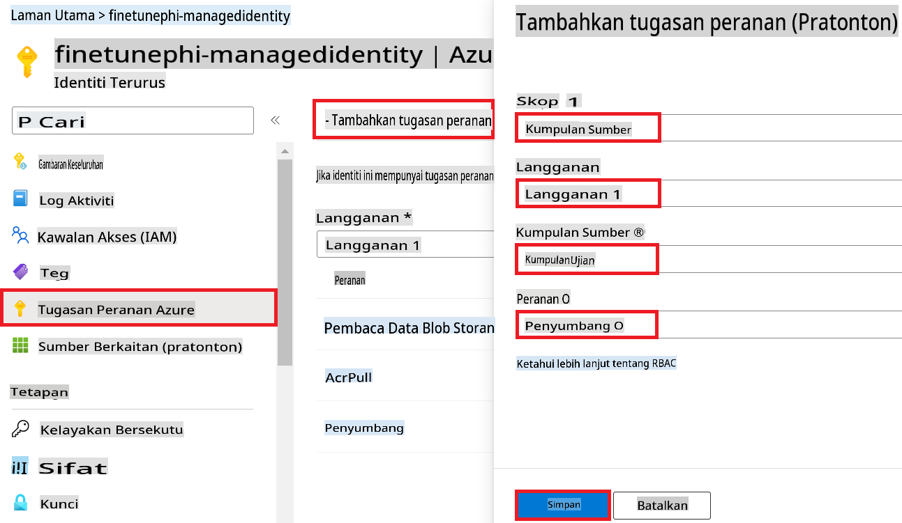

2. Pilih **Save**.  

#### Menambahkan peran Storage Blob Data Reader ke Managed Identity

1. Ketik *storage accounts* di **bilah pencarian** di bagian atas halaman portal dan pilih **Storage accounts** dari opsi yang muncul.

    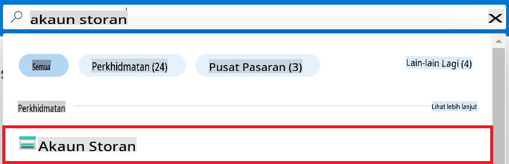

1. Pilih akun penyimpanan yang terkait dengan Azure Machine Learning workspace yang Anda buat. Misalnya, *finetunephistorage*.  

1. Lakukan langkah-langkah berikut untuk navigasi ke halaman Add role assignment:  

    - Navigasikan ke akun penyimpanan Azure yang Anda buat.  
    - Pilih **Access Control (IAM)** dari tab sisi kiri.  
    - Pilih **+ Add** dari menu navigasi.  
    - Pilih **Add role assignment** dari menu navigasi.  

    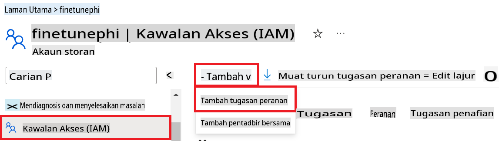

1. Di halaman Add role assignment, lakukan langkah-langkah berikut:  

    - Di halaman Role, ketik *Storage Blob Data Reader* di **bilah pencarian** dan pilih **Storage Blob Data Reader** dari opsi yang muncul.  
    - Di halaman Role, pilih **Next**.  
    - Di halaman Members, pilih **Assign access to** **Managed identity**.  
    - Di halaman Members, pilih **+ Select members**.  
    - Di halaman Select managed identities, pilih **Subscription** Azure Anda.  
    - Di halaman Select managed identities, pilih **Managed identity** ke **Manage Identity**.  
    - Di halaman Select managed identities, pilih Managed Identity yang Anda buat. Misalnya, *finetunephi-managedidentity*.  
    - Di halaman Select managed identities, pilih **Select**.  

    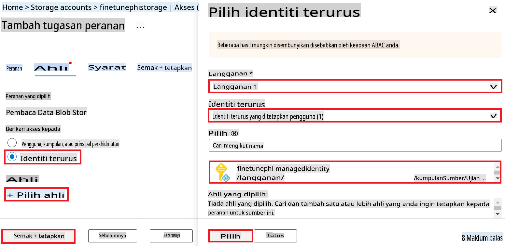

1. Pilih **Review + assign**.  

#### Menambahkan peran AcrPull ke Managed Identity

1. Ketik *container registries* di **bilah pencarian** di bagian atas halaman portal dan pilih **Container registries** dari opsi yang muncul.

    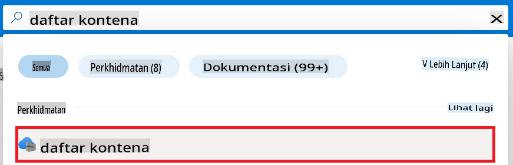

1. Pilih container registry yang terkait dengan Azure Machine Learning workspace. Misalnya, *finetunephicontainerregistry*.  

1. Lakukan langkah-langkah berikut untuk navigasi ke halaman Add role assignment:  

    - Pilih **Access Control (IAM)** dari tab sisi kiri.  
    - Pilih **+ Add** dari menu navigasi.  
    - Pilih **Add role assignment** dari menu navigasi.  

1. Di halaman Add role assignment, lakukan langkah-langkah berikut:  

    - Di halaman Role, ketik *AcrPull* di **bilah pencarian** dan pilih **AcrPull** dari opsi yang muncul.  
    - Di halaman Role, pilih **Next**.  
    - Di halaman Members, pilih **Assign access to** **Managed identity**.  
    - Di halaman Members, pilih **+ Select members**.  
    - Di halaman Select managed identities, pilih **Subscription** Azure Anda.  
    - Di halaman Select managed identities, pilih **Managed identity** ke **Manage Identity**.  
    - Di halaman Select managed identities, pilih Managed Identity yang Anda buat. Misalnya, *finetunephi-managedidentity*.  
    - Di halaman Select managed identities, pilih **Select**.  
    - Pilih **Review + assign**.  

### Mengatur proyek

Untuk mengunduh dataset yang diperlukan untuk pelarasan, Anda akan mengatur lingkungan lokal.  

Dalam latihan ini, Anda akan:  

- Membuat folder untuk bekerja di dalamnya.  
- Membuat virtual environment.  
- Menginstal paket yang diperlukan.  
- Membuat file *download_dataset.py* untuk mengunduh dataset.  

#### Membuat folder untuk bekerja di dalamnya

1. Buka jendela terminal dan ketik perintah berikut untuk membuat folder bernama *finetune-phi* di jalur default.

    ```console
    mkdir finetune-phi
    ```  

2. Ketik perintah berikut di terminal Anda untuk masuk ke folder *finetune-phi* yang Anda buat.

    ```console
    cd finetune-phi
    ```  

#### Membuat virtual environment

1. Ketik perintah berikut di terminal Anda untuk membuat virtual environment bernama *.venv*.  

    ```console
    python -m venv .venv
    ```  

2. Ketik perintah berikut di terminal Anda untuk mengaktifkan virtual environment.  

    ```console
    .venv\Scripts\activate.bat
    ```  

> [!NOTE]  
> Jika berhasil, Anda akan melihat *(.venv)* sebelum prompt perintah.  

#### Menginstal paket yang diperlukan

1. Ketik perintah berikut di terminal Anda untuk menginstal paket yang diperlukan.

    ```console
    pip install datasets==2.19.1
    ```  

#### Membuat `download_dataset.py`

> [!NOTE]  
> Struktur folder lengkap:  
>
> ```text
> └── YourUserName
> .    └── finetune-phi
> .        └── download_dataset.py
> ```  

1. Buka **Visual Studio Code**.  

1. Pilih **File** dari menu bar.  

1. Pilih **Open Folder**.  

1. Pilih folder *finetune-phi* yang Anda buat, yang terletak di *C:\Users\yourUserName\finetune-phi*.  

    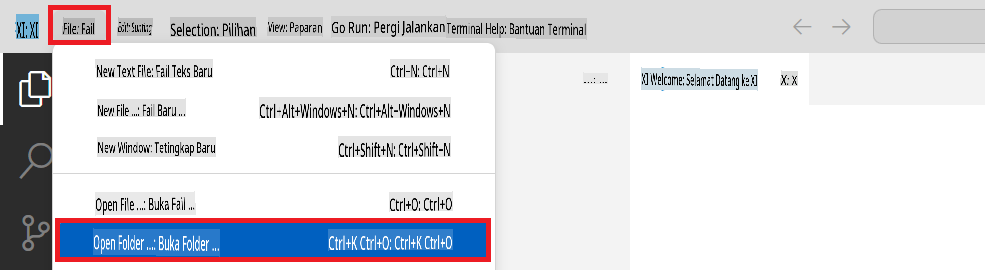  

1. Di panel kiri Visual Studio Code, klik kanan dan pilih **New File** untuk membuat file baru bernama *download_dataset.py*.  

    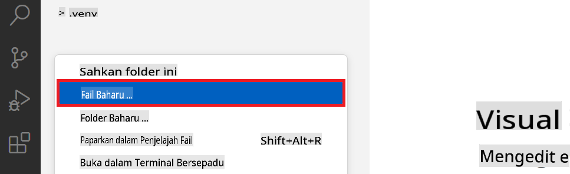  

### Mempersiapkan dataset untuk pelarasan

Dalam latihan ini, Anda akan menjalankan file *download_dataset.py* untuk mengunduh dataset *ultrachat_200k* ke lingkungan lokal Anda. Dataset ini akan digunakan untuk melarasikan model Phi-3 di Azure Machine Learning.  

Dalam latihan ini, Anda akan:  

- Menambahkan kode ke file *download_dataset.py* untuk mengunduh dataset.  
- Menjalankan file *download_dataset.py* untuk mengunduh dataset ke lingkungan lokal Anda.  

#### Mengunduh dataset menggunakan *download_dataset.py*

1. Buka file *download_dataset.py* di Visual Studio Code.  

1. Tambahkan kode berikut ke file *download_dataset.py*.  

    ```python
    import json
    import os
    from datasets import load_dataset

    def load_and_split_dataset(dataset_name, config_name, split_ratio):
        """
        Load and split a dataset.
        """
        # Load the dataset with the specified name, configuration, and split ratio
        dataset = load_dataset(dataset_name, config_name, split=split_ratio)
        print(f"Original dataset size: {len(dataset)}")
        
        # Split the dataset into train and test sets (80% train, 20% test)
        split_dataset = dataset.train_test_split(test_size=0.2)
        print(f"Train dataset size: {len(split_dataset['train'])}")
        print(f"Test dataset size: {len(split_dataset['test'])}")
        
        return split_dataset

    def save_dataset_to_jsonl(dataset, filepath):
        """
        Save a dataset to a JSONL file.
        """
        # Create the directory if it does not exist
        os.makedirs(os.path.dirname(filepath), exist_ok=True)
        
        # Open the file in write mode
        with open(filepath, 'w', encoding='utf-8') as f:
            # Iterate over each record in the dataset
            for record in dataset:
                # Dump the record as a JSON object and write it to the file
                json.dump(record, f)
                # Write a newline character to separate records
                f.write('\n')
        
        print(f"Dataset saved to {filepath}")

    def main():
        """
        Main function to load, split, and save the dataset.
        """
        # Load and split the ULTRACHAT_200k dataset with a specific configuration and split ratio
        dataset = load_and_split_dataset("HuggingFaceH4/ultrachat_200k", 'default', 'train_sft[:1%]')
        
        # Extract the train and test datasets from the split
        train_dataset = dataset['train']
        test_dataset = dataset['test']

        # Save the train dataset to a JSONL file
        save_dataset_to_jsonl(train_dataset, "data/train_data.jsonl")
        
        # Save the test dataset to a separate JSONL file
        save_dataset_to_jsonl(test_dataset, "data/test_data.jsonl")

    if __name__ == "__main__":
        main()

    ```  

1. Ketik perintah berikut di terminal Anda untuk menjalankan skrip dan mengunduh dataset ke lingkungan lokal Anda.  

    ```console
    python download_dataset.py
    ```  

1. Verifikasi bahwa dataset berhasil disimpan ke direktori lokal *finetune-phi/data*.  

> [!NOTE]  
>
> #### Catatan tentang ukuran dataset dan waktu pelarasan  
>
> Dalam tutorial ini, Anda hanya menggunakan 1% dari dataset (`split='train[:1%]'`). Ini secara signifikan mengurangi jumlah data, mempercepat proses pengunggahan dan pelarasan. Anda dapat menyesuaikan persentase untuk menemukan keseimbangan yang tepat antara waktu pelatihan dan performa model. Menggunakan subset dataset yang lebih kecil mengurangi waktu yang diperlukan untuk pelarasan, sehingga proses lebih mudah dikelola untuk tutorial ini.  

## Skenario 2: Melarasikan model Phi-3 dan Menyebarkannya di Azure Machine Learning Studio

### Melarasikan model Phi-3

Dalam latihan ini, Anda akan melarasikan model Phi-3 di Azure Machine Learning Studio.  

Dalam latihan ini, Anda akan:  

- Membuat kluster komputer untuk pelarasan.  
- Melarasikan model Phi-3 di Azure Machine Learning Studio.  

#### Membuat kluster komputer untuk pelarasan  
1. Lawati [Azure ML Studio](https://ml.azure.com/home?wt.mc_id=studentamb_279723).

1. Pilih **Compute** dari tab di sebelah kiri.

1. Pilih **Compute clusters** dari menu navigasi.

1. Pilih **+ New**.

    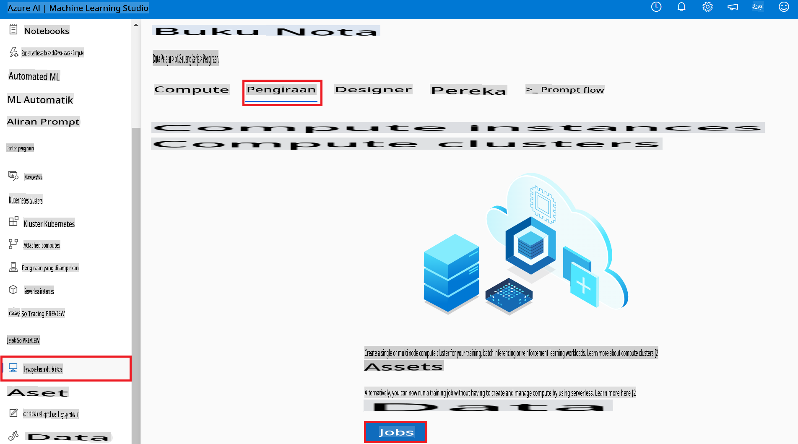

1. Lakukan tugas berikut:

    - Pilih **Region** yang ingin digunakan.
    - Pilih **Virtual machine tier** ke **Dedicated**.
    - Pilih **Virtual machine type** ke **GPU**.
    - Pilih penapis **Virtual machine size** ke **Select from all options**.
    - Pilih **Virtual machine size** ke **Standard_NC24ads_A100_v4**.

    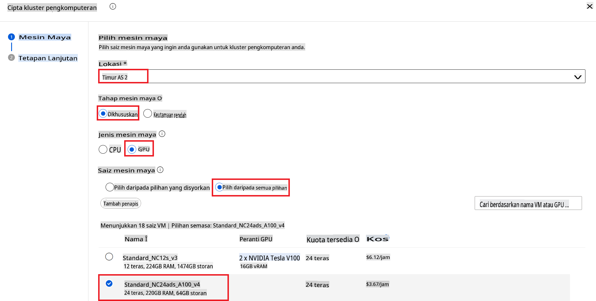

1. Pilih **Next**.

1. Lakukan tugas berikut:

    - Masukkan **Compute name**. Ia mestilah nilai unik.
    - Pilih **Minimum number of nodes** ke **0**.
    - Pilih **Maximum number of nodes** ke **1**.
    - Pilih **Idle seconds before scale down** ke **120**.

    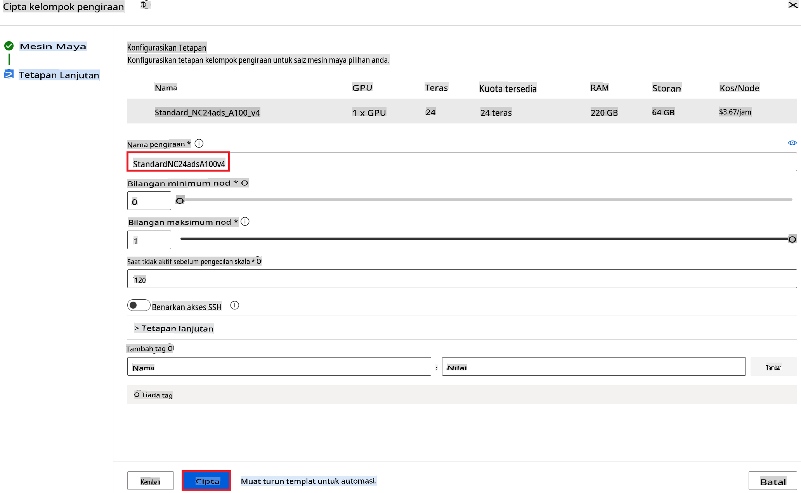

1. Pilih **Create**.

#### Melaras model Phi-3

1. Lawati [Azure ML Studio](https://ml.azure.com/home?wt.mc_id=studentamb_279723).

1. Pilih ruang kerja Azure Machine Learning yang anda cipta.

    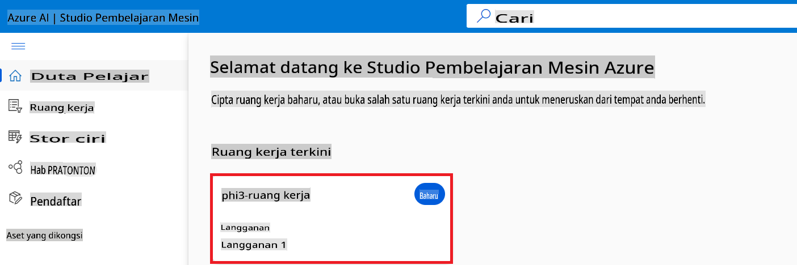

1. Lakukan tugas berikut:

    - Pilih **Model catalog** dari tab di sebelah kiri.
    - Taip *phi-3-mini-4k* dalam **search bar** dan pilih **Phi-3-mini-4k-instruct** dari pilihan yang muncul.

    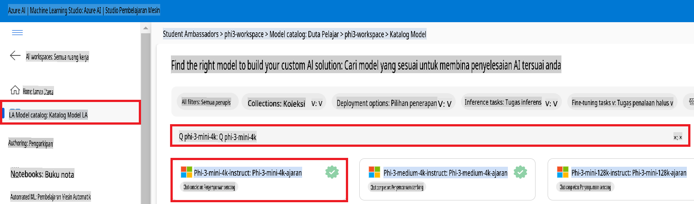

1. Pilih **Fine-tune** dari menu navigasi.

    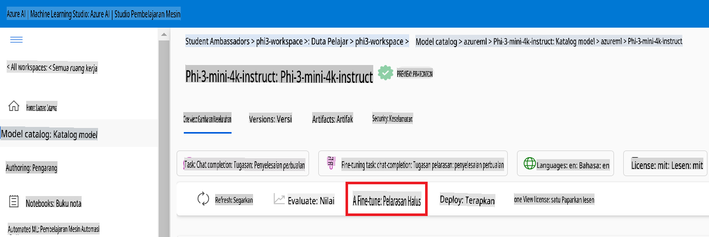

1. Lakukan tugas berikut:

    - Pilih **Select task type** ke **Chat completion**.
    - Pilih **+ Select data** untuk memuat naik **Training data**.
    - Pilih jenis muat naik data pengesahan ke **Provide different validation data**.
    - Pilih **+ Select data** untuk memuat naik **Validation data**.

    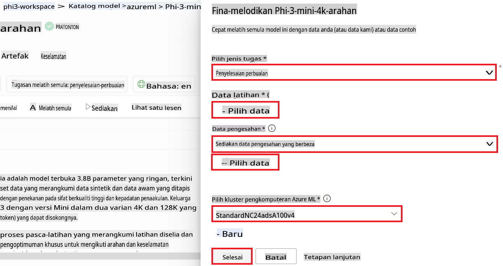

    > [!TIP]
    >
    > Anda boleh memilih **Advanced settings** untuk menyesuaikan konfigurasi seperti **learning_rate** dan **lr_scheduler_type** bagi mengoptimumkan proses fine-tuning mengikut keperluan anda.

1. Pilih **Finish**.

1. Dalam latihan ini, anda berjaya melaras model Phi-3 menggunakan Azure Machine Learning. Harap maklum bahawa proses fine-tuning boleh mengambil masa yang lama. Selepas menjalankan tugas fine-tuning, anda perlu menunggu sehingga selesai. Anda boleh memantau status tugas fine-tuning dengan pergi ke tab Jobs di sebelah kiri ruang kerja Azure Machine Learning anda. Dalam siri seterusnya, anda akan menyebarkan model yang telah dilaras dan mengintegrasikannya dengan Prompt flow.

    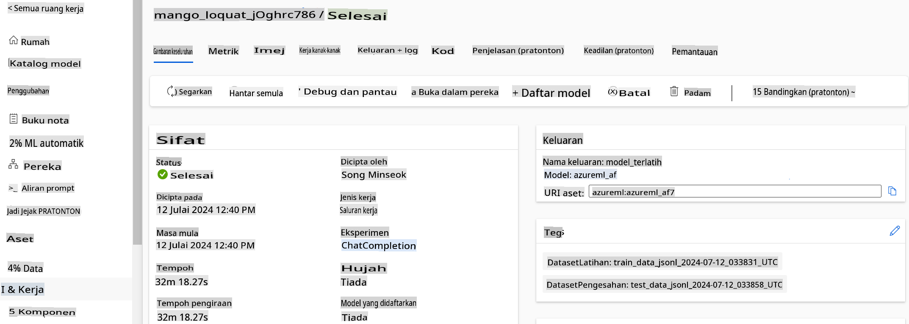

### Menyebarkan model Phi-3 yang telah dilaras

Untuk mengintegrasikan model Phi-3 yang telah dilaras dengan Prompt flow, anda perlu menyebarkan model tersebut supaya boleh diakses untuk inferens masa nyata. Proses ini melibatkan pendaftaran model, penciptaan endpoint dalam talian, dan penyebaran model.

Dalam latihan ini, anda akan:

- Mendaftar model yang telah dilaras dalam ruang kerja Azure Machine Learning.
- Mencipta endpoint dalam talian.
- Menyebarkan model Phi-3 yang telah didaftarkan.

#### Mendaftar model yang telah dilaras

1. Lawati [Azure ML Studio](https://ml.azure.com/home?wt.mc_id=studentamb_279723).

1. Pilih ruang kerja Azure Machine Learning yang anda cipta.

    

1. Pilih **Models** dari tab di sebelah kiri.
1. Pilih **+ Register**.
1. Pilih **From a job output**.

    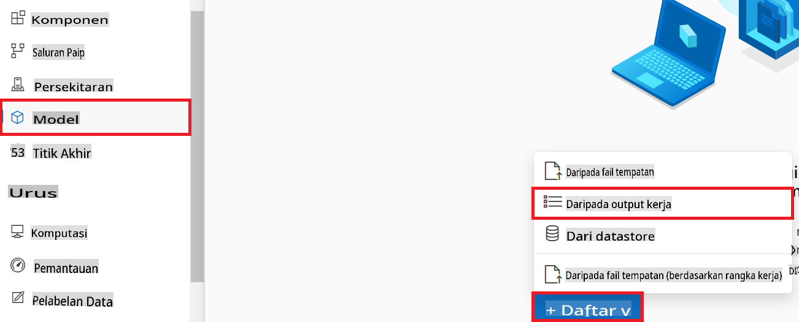

1. Pilih tugas yang anda cipta.

    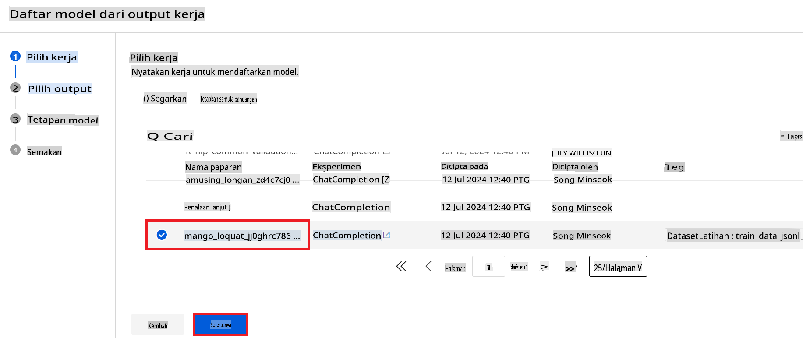

1. Pilih **Next**.

1. Pilih **Model type** ke **MLflow**.

1. Pastikan **Job output** dipilih; ia sepatutnya dipilih secara automatik.

    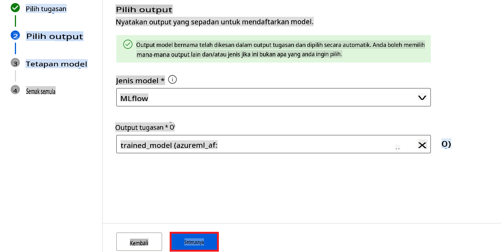

2. Pilih **Next**.

3. Pilih **Register**.

    

4. Anda boleh melihat model yang telah didaftarkan dengan pergi ke menu **Models** dari tab di sebelah kiri.

    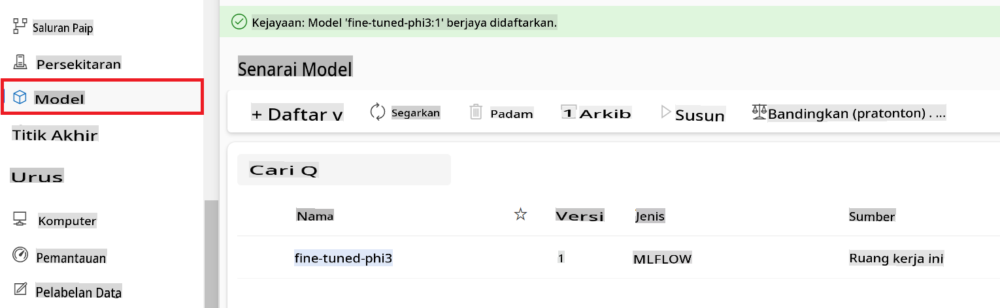

#### Menyebarkan model yang telah dilaras

1. Pergi ke ruang kerja Azure Machine Learning yang anda cipta.

1. Pilih **Endpoints** dari tab di sebelah kiri.

1. Pilih **Real-time endpoints** dari menu navigasi.

    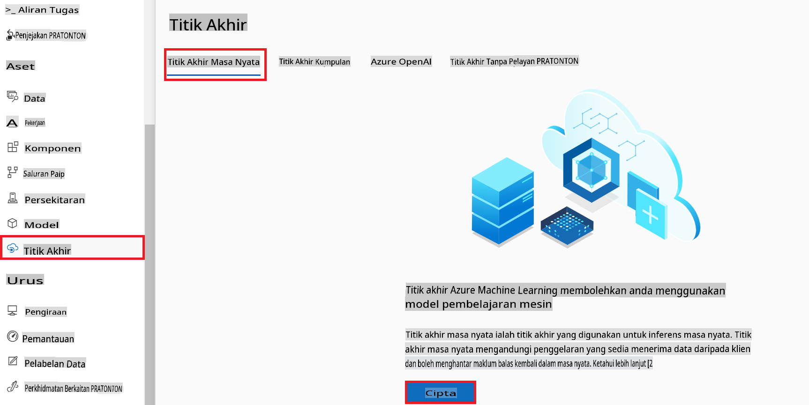

1. Pilih **Create**.

1. Pilih model yang telah didaftarkan.

    

1. Pilih **Select**.

1. Lakukan tugas berikut:

    - Pilih **Virtual machine** ke *Standard_NC6s_v3*.
    - Pilih **Instance count** yang anda mahu gunakan. Sebagai contoh, *1*.
    - Pilih **Endpoint** ke **New** untuk mencipta endpoint.
    - Masukkan **Endpoint name**. Ia mestilah nilai unik.
    - Masukkan **Deployment name**. Ia mestilah nilai unik.

    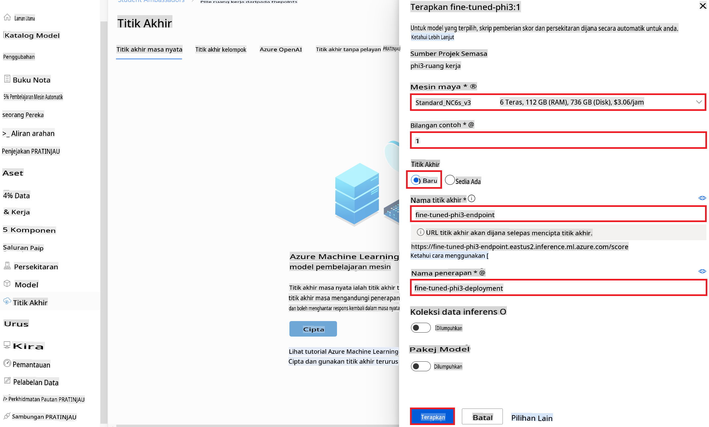

1. Pilih **Deploy**.

> [!WARNING]
> Untuk mengelakkan caj tambahan pada akaun anda, pastikan anda memadam endpoint yang dicipta di ruang kerja Azure Machine Learning.
>

#### Periksa status penyebaran dalam Azure Machine Learning Workspace

1. Pergi ke ruang kerja Azure Machine Learning yang anda cipta.

1. Pilih **Endpoints** dari tab di sebelah kiri.

1. Pilih endpoint yang anda cipta.

    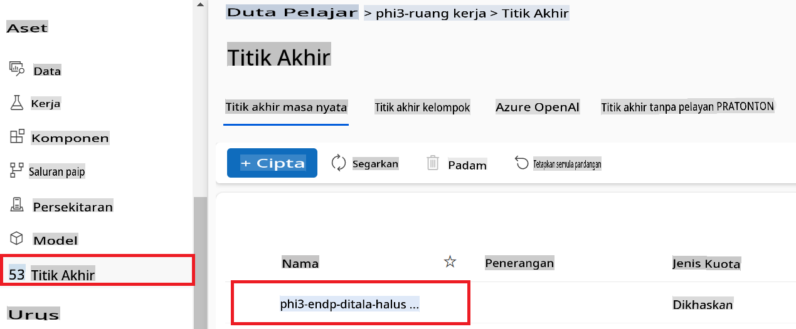

1. Pada halaman ini, anda boleh mengurus endpoint semasa proses penyebaran.

> [!NOTE]
> Setelah penyebaran selesai, pastikan **Live traffic** ditetapkan ke **100%**. Jika tidak, pilih **Update traffic** untuk menyesuaikan tetapan trafik. Harap maklum bahawa anda tidak boleh menguji model jika trafik ditetapkan ke 0%.
>
> 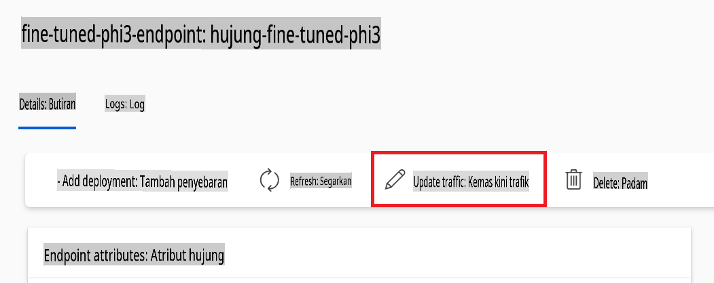
>

## Senario 3: Mengintegrasikan dengan Prompt flow dan Berinteraksi dengan model khusus anda dalam Azure AI Foundry

### Mengintegrasikan model Phi-3 khusus dengan Prompt flow

Selepas berjaya menyebarkan model yang telah dilaras, anda kini boleh mengintegrasikannya dengan Prompt Flow untuk menggunakan model anda dalam aplikasi masa nyata, membolehkan pelbagai tugas interaktif dengan model Phi-3 khusus anda.

Dalam latihan ini, anda akan:

- Mencipta Azure AI Foundry Hub.
- Mencipta Azure AI Foundry Project.
- Mencipta Prompt flow.
- Menambah sambungan khusus untuk model Phi-3 yang telah dilaras.
- Menyediakan Prompt flow untuk berinteraksi dengan model Phi-3 khusus anda.

> [!NOTE]
> Anda juga boleh mengintegrasikan dengan Promptflow menggunakan Azure ML Studio. Proses integrasi yang sama boleh digunakan di Azure ML Studio.

#### Mencipta Azure AI Foundry Hub

Anda perlu mencipta Hub sebelum mencipta Projek. Hub bertindak seperti Resource Group, membolehkan anda mengatur dan menguruskan pelbagai Projek dalam Azure AI Foundry.

1. Lawati [Azure AI Foundry](https://ai.azure.com/?WT.mc_id=aiml-137032-kinfeylo).

1. Pilih **All hubs** dari tab di sebelah kiri.

1. Pilih **+ New hub** dari menu navigasi.

    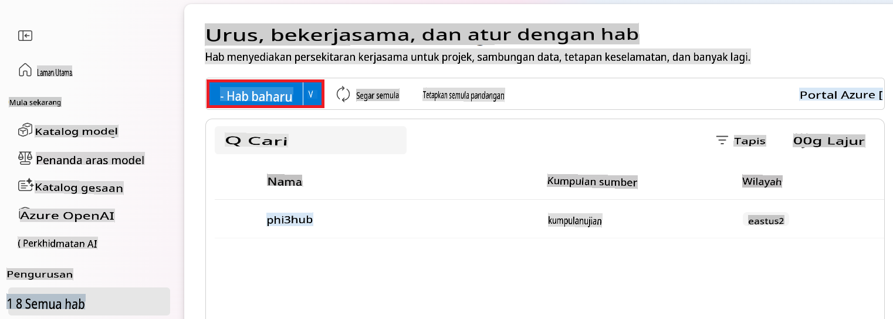

1. Lakukan tugas berikut:

    - Masukkan **Hub name**. Ia mestilah nilai unik.
    - Pilih **Subscription** Azure anda.
    - Pilih **Resource group** yang ingin digunakan (cipta baru jika perlu).
    - Pilih **Location** yang ingin digunakan.
    - Pilih **Connect Azure AI Services** yang ingin digunakan (cipta baru jika perlu).
    - Pilih **Connect Azure AI Search** ke **Skip connecting**.

    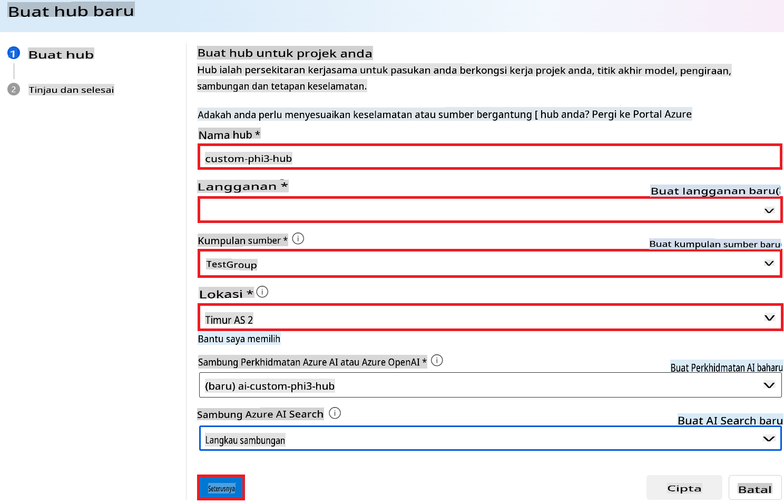

1. Pilih **Next**.

#### Mencipta Azure AI Foundry Project

1. Dalam Hub yang anda cipta, pilih **All projects** dari tab di sebelah kiri.

1. Pilih **+ New project** dari menu navigasi.

    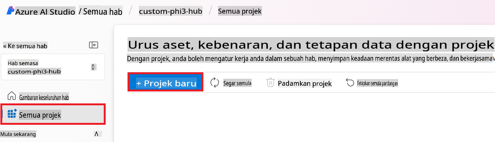

1. Masukkan **Project name**. Ia mestilah nilai unik.

    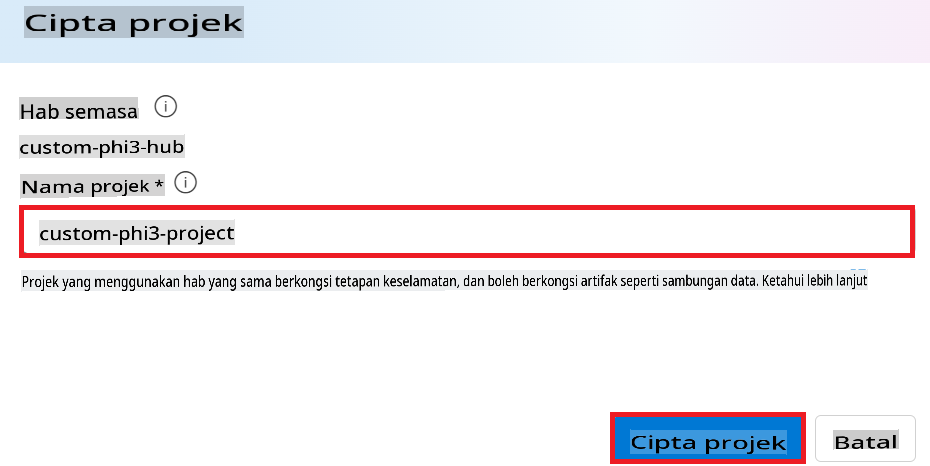

1. Pilih **Create a project**.

#### Menambah sambungan khusus untuk model Phi-3 yang telah dilaras

Untuk mengintegrasikan model Phi-3 khusus anda dengan Prompt flow, anda perlu menyimpan endpoint dan kunci model dalam sambungan khusus. Persediaan ini memastikan akses ke model Phi-3 khusus anda dalam Prompt flow.

#### Tetapkan kunci API dan URI endpoint model Phi-3 yang telah dilaras

1. Lawati [Azure ML Studio](https://ml.azure.com/home?WT.mc_id=aiml-137032-kinfeylo).

1. Pergi ke ruang kerja Azure Machine Learning yang anda cipta.

1. Pilih **Endpoints** dari tab di sebelah kiri.

    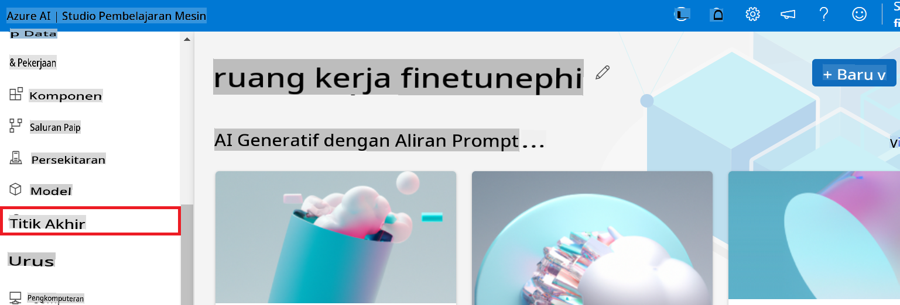

1. Pilih endpoint yang anda cipta.

    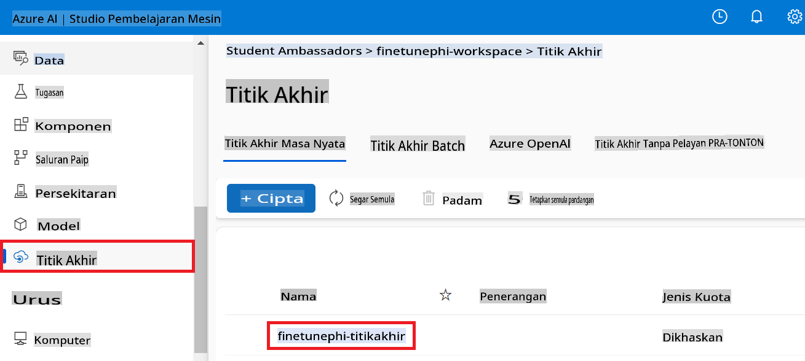

1. Pilih **Consume** dari menu navigasi.

1. Salin **REST endpoint** dan **Primary key** anda.
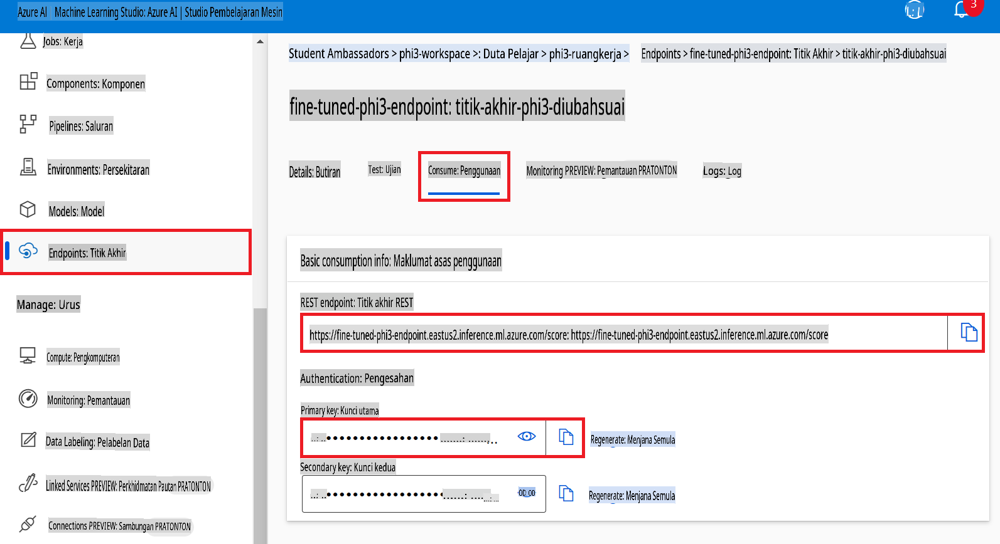

#### Tambah Sambungan Khusus

1. Lawati [Azure AI Foundry](https://ai.azure.com/?WT.mc_id=aiml-137032-kinfeylo).

1. Pergi ke projek Azure AI Foundry yang telah anda cipta.

1. Dalam projek yang telah anda cipta, pilih **Settings** dari tab sebelah kiri.

1. Pilih **+ New connection**.

    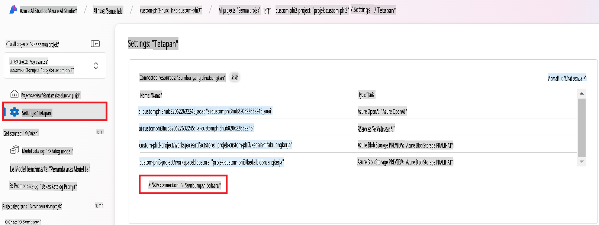

1. Pilih **Custom keys** dari menu navigasi.

    

1. Lakukan langkah berikut:

    - Pilih **+ Add key value pairs**.
    - Untuk nama kunci, masukkan **endpoint** dan tampal endpoint yang anda salin dari Azure ML Studio ke dalam medan nilai.
    - Pilih **+ Add key value pairs** sekali lagi.
    - Untuk nama kunci, masukkan **key** dan tampal kunci yang anda salin dari Azure ML Studio ke dalam medan nilai.
    - Selepas menambah kunci, pilih **is secret** untuk memastikan kunci tidak terdedah.

    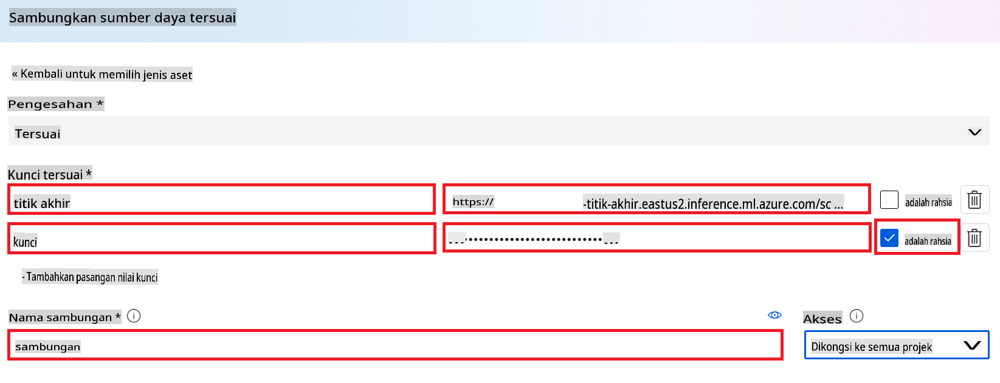

1. Pilih **Add connection**.

#### Cipta Prompt flow

Anda telah menambah sambungan khusus dalam Azure AI Foundry. Sekarang, mari kita cipta Prompt flow dengan mengikuti langkah-langkah berikut. Kemudian, anda akan menghubungkan Prompt flow ini ke sambungan khusus supaya anda boleh menggunakan model yang telah disesuaikan dalam Prompt flow.

1. Pergi ke projek Azure AI Foundry yang telah anda cipta.

1. Pilih **Prompt flow** dari tab sebelah kiri.

1. Pilih **+ Create** dari menu navigasi.

    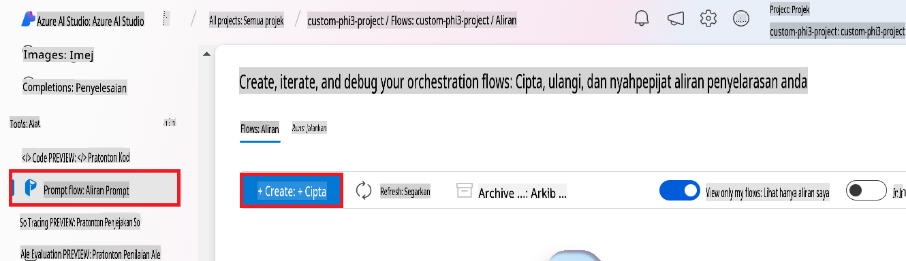

1. Pilih **Chat flow** dari menu navigasi.

    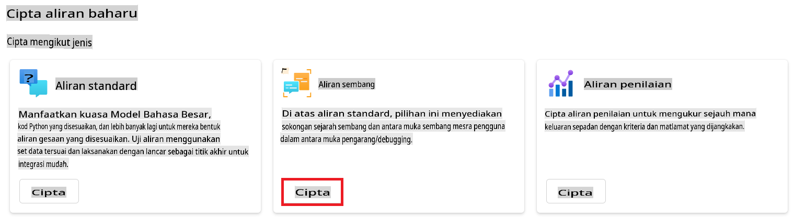

1. Masukkan **Folder name** yang akan digunakan.

    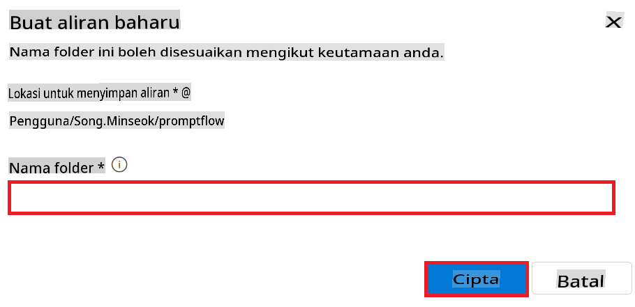

2. Pilih **Create**.

#### Sediakan Prompt flow untuk berinteraksi dengan model Phi-3 khusus anda

Anda perlu mengintegrasikan model Phi-3 yang telah disesuaikan ke dalam Prompt flow. Walau bagaimanapun, Prompt flow yang sedia ada tidak direka untuk tujuan ini. Oleh itu, anda mesti merancang semula Prompt flow untuk membolehkan integrasi model khusus tersebut.

1. Dalam Prompt flow, lakukan langkah berikut untuk membina semula aliran yang sedia ada:

    - Pilih **Raw file mode**.
    - Padam semua kod yang sedia ada dalam fail *flow.dag.yml*.
    - Tambahkan kod berikut ke dalam fail *flow.dag.yml*.

        ```yml
        inputs:
          input_data:
            type: string
            default: "Who founded Microsoft?"

        outputs:
          answer:
            type: string
            reference: ${integrate_with_promptflow.output}

        nodes:
        - name: integrate_with_promptflow
          type: python
          source:
            type: code
            path: integrate_with_promptflow.py
          inputs:
            input_data: ${inputs.input_data}
        ```

    - Pilih **Save**.

    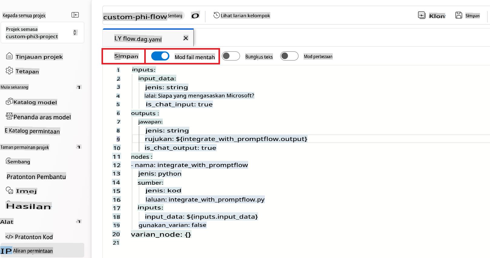

1. Tambahkan kod berikut ke dalam fail *integrate_with_promptflow.py* untuk menggunakan model Phi-3 khusus dalam Prompt flow.

    ```python
    import logging
    import requests
    from promptflow import tool
    from promptflow.connections import CustomConnection

    # Logging setup
    logging.basicConfig(
        format="%(asctime)s - %(levelname)s - %(name)s - %(message)s",
        datefmt="%Y-%m-%d %H:%M:%S",
        level=logging.DEBUG
    )
    logger = logging.getLogger(__name__)

    def query_phi3_model(input_data: str, connection: CustomConnection) -> str:
        """
        Send a request to the Phi-3 model endpoint with the given input data using Custom Connection.
        """

        # "connection" is the name of the Custom Connection, "endpoint", "key" are the keys in the Custom Connection
        endpoint_url = connection.endpoint
        api_key = connection.key

        headers = {
            "Content-Type": "application/json",
            "Authorization": f"Bearer {api_key}"
        }
        data = {
            "input_data": {
                "input_string": [
                    {"role": "user", "content": input_data}
                ],
                "parameters": {
                    "temperature": 0.7,
                    "max_new_tokens": 128
                }
            }
        }
        try:
            response = requests.post(endpoint_url, json=data, headers=headers)
            response.raise_for_status()
            
            # Log the full JSON response
            logger.debug(f"Full JSON response: {response.json()}")

            result = response.json()["output"]
            logger.info("Successfully received response from Azure ML Endpoint.")
            return result
        except requests.exceptions.RequestException as e:
            logger.error(f"Error querying Azure ML Endpoint: {e}")
            raise

    @tool
    def my_python_tool(input_data: str, connection: CustomConnection) -> str:
        """
        Tool function to process input data and query the Phi-3 model.
        """
        return query_phi3_model(input_data, connection)

    ```

    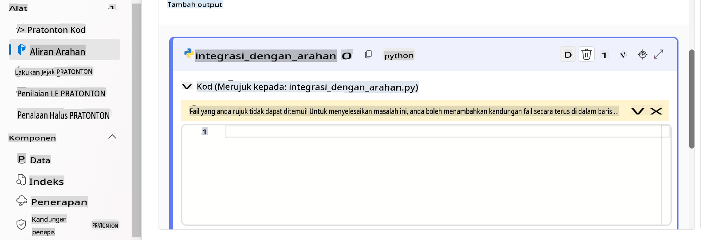

> [!NOTE]
> Untuk maklumat lebih terperinci tentang menggunakan Prompt flow dalam Azure AI Foundry, anda boleh merujuk kepada [Prompt flow dalam Azure AI Foundry](https://learn.microsoft.com/azure/ai-studio/how-to/prompt-flow).

1. Pilih **Chat input**, **Chat output** untuk membolehkan perbualan dengan model anda.

    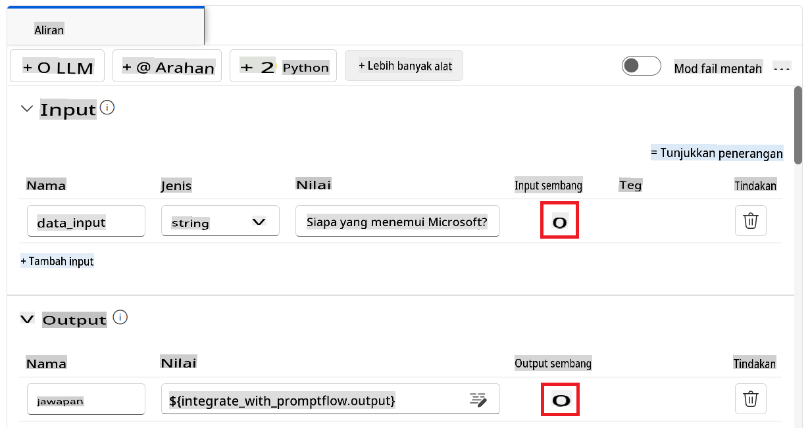

1. Kini anda bersedia untuk berinteraksi dengan model Phi-3 khusus anda. Dalam latihan seterusnya, anda akan belajar cara memulakan Prompt flow dan menggunakannya untuk berinteraksi dengan model Phi-3 yang telah disesuaikan.

> [!NOTE]
>
> Aliran yang telah dibina semula sepatutnya kelihatan seperti imej di bawah:
>
> 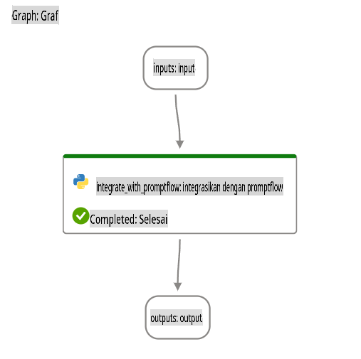
>

### Berinteraksi dengan model Phi-3 khusus anda

Sekarang bahawa anda telah menyesuaikan dan mengintegrasikan model Phi-3 khusus anda dengan Prompt flow, anda sudah bersedia untuk mula berinteraksi dengannya. Latihan ini akan membimbing anda melalui proses menyediakan dan memulakan perbualan dengan model anda menggunakan Prompt flow. Dengan mengikuti langkah-langkah ini, anda dapat sepenuhnya memanfaatkan kemampuan model Phi-3 yang telah disesuaikan untuk pelbagai tugas dan perbualan.

- Berinteraksi dengan model Phi-3 khusus anda menggunakan Prompt flow.

#### Mulakan Prompt flow

1. Pilih **Start compute sessions** untuk memulakan Prompt flow.

    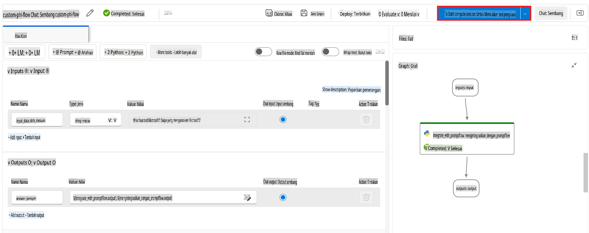

1. Pilih **Validate and parse input** untuk memperbaharui parameter.

    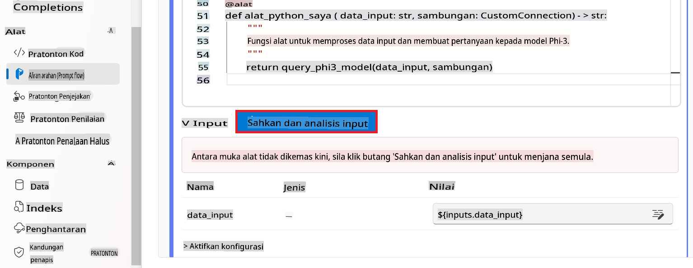

1. Pilih **Value** bagi **connection** ke sambungan khusus yang anda cipta. Sebagai contoh, *connection*.

    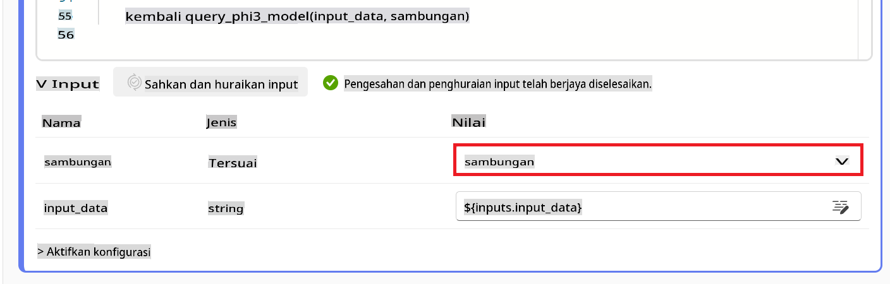

#### Berinteraksi dengan model khusus anda

1. Pilih **Chat**.

    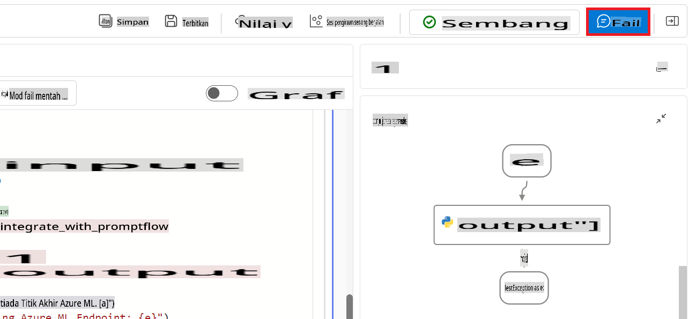

1. Berikut adalah contoh hasil: Kini anda boleh berinteraksi dengan model Phi-3 khusus anda. Disarankan untuk mengemukakan soalan berdasarkan data yang digunakan untuk penyesuaian.

    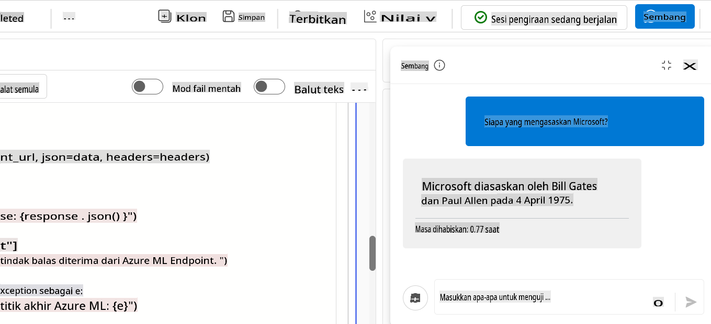

**Penafian**:  
Dokumen ini telah diterjemahkan menggunakan perkhidmatan terjemahan AI berasaskan mesin. Walaupun kami berusaha untuk memastikan ketepatan, sila ambil maklum bahawa terjemahan automatik mungkin mengandungi kesilapan atau ketidaktepatan. Dokumen asal dalam bahasa asalnya harus dianggap sebagai sumber yang berwibawa. Untuk maklumat penting, terjemahan manusia profesional adalah disyorkan. Kami tidak bertanggungjawab atas sebarang salah faham atau salah tafsir yang timbul daripada penggunaan terjemahan ini.