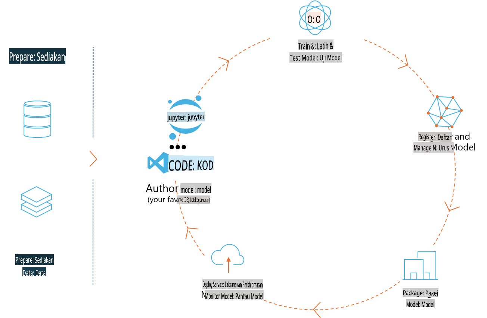
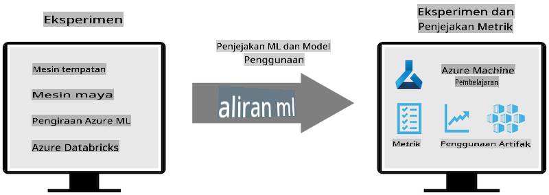
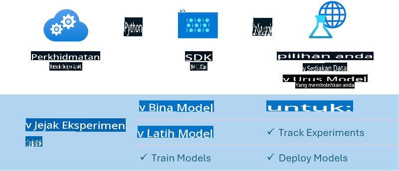

# MLflow

[MLflow](https://mlflow.org/) adalah platform sumber terbuka yang direka untuk menguruskan kitar hayat pembelajaran mesin secara menyeluruh.



MLFlow digunakan untuk menguruskan kitar hayat ML, termasuk eksperimen, kebolehulangan, penyebaran, dan repositori model pusat. MLFlow kini menawarkan empat komponen:

- **MLflow Tracking:** Merekod dan menyoal eksperimen, kod, konfigurasi data, dan keputusan.
- **MLflow Projects:** Membungkus kod sains data dalam format yang boleh menjalankan semula di mana-mana platform.
- **Mlflow Models:** Menyebarkan model pembelajaran mesin dalam pelbagai persekitaran pelayan.
- **Model Registry:** Menyimpan, memberi anotasi, dan menguruskan model dalam repositori pusat.

Ia mempunyai keupayaan untuk menjejaki eksperimen, membungkus kod ke dalam pelaksanaan yang boleh diulang, dan berkongsi serta menyebarkan model. MLFlow diintegrasikan ke dalam Databricks dan menyokong pelbagai perpustakaan ML, menjadikannya bebas perpustakaan. Ia boleh digunakan dengan mana-mana perpustakaan pembelajaran mesin dan dalam mana-mana bahasa pengaturcaraan, kerana ia menyediakan REST API dan CLI untuk kemudahan.



Ciri utama MLFlow termasuk:

- **Penjejakan Eksperimen:** Merekod dan membandingkan parameter serta keputusan.
- **Pengurusan Model:** Menyebarkan model ke pelbagai platform pelayan dan inferens.
- **Model Registry:** Menguruskan kitar hayat MLFlow Models secara kolaboratif, termasuk versi dan anotasi.
- **Projek:** Membungkus kod ML untuk dikongsi atau digunakan dalam pengeluaran.  
MLFlow juga menyokong kitaran MLOps, termasuk penyediaan data, pendaftaran dan pengurusan model, pembungkusan model untuk pelaksanaan, penyebaran perkhidmatan, dan pemantauan model. Ia bertujuan untuk mempermudah proses berpindah dari prototaip ke aliran kerja pengeluaran, terutamanya di persekitaran awan dan hujung (edge).

## Senario E2E - Membina pembungkus dan menggunakan Phi-3 sebagai model MLFlow

Dalam contoh E2E ini, kami akan menunjukkan dua pendekatan berbeza untuk membina pembungkus sekitar model bahasa kecil Phi-3 (SLM) dan kemudian menjalankannya sebagai model MLFlow sama ada secara tempatan atau di awan, contohnya, di ruang kerja Azure Machine Learning.



| Projek | Penerangan | Lokasi |
| ------------ | ----------- | -------- |
| Transformer Pipeline | Transformer Pipeline adalah pilihan paling mudah untuk membina pembungkus jika anda ingin menggunakan model HuggingFace dengan rasa transformers eksperimen MLFlow. | [**TransformerPipeline.ipynb**](../../../../../../code/06.E2E/E2E_Phi-3-MLflow_TransformerPipeline.ipynb) |
| Custom Python Wrapper | Pada masa penulisan, transformer pipeline tidak menyokong penjanaan pembungkus MLFlow untuk model HuggingFace dalam format ONNX, walaupun dengan pakej optimum Python eksperimen. Untuk kes seperti ini, anda boleh membina pembungkus Python tersuai untuk mod MLFlow | [**CustomPythonWrapper.ipynb**](../../../../../../code/06.E2E/E2E_Phi-3-MLflow_CustomPythonWrapper.ipynb) |

## Projek: Transformer Pipeline

1. Anda memerlukan pakej Python yang relevan daripada MLFlow dan HuggingFace:

    ``` Python
    import mlflow
    import transformers
    ```

2. Seterusnya, anda harus memulakan transformer pipeline dengan merujuk kepada model Phi-3 yang disasarkan dalam repositori HuggingFace. Seperti yang dapat dilihat dari kad model _Phi-3-mini-4k-instruct_, tugasnya adalah jenis "Text Generation":

    ``` Python
    pipeline = transformers.pipeline(
        task = "text-generation",
        model = "microsoft/Phi-3-mini-4k-instruct"
    )
    ```

3. Kini anda boleh menyimpan transformer pipeline model Phi-3 anda ke dalam format MLFlow dan menyediakan butiran tambahan seperti laluan artifak sasaran, tetapan konfigurasi model khusus, dan jenis API inferens:

    ``` Python
    model_info = mlflow.transformers.log_model(
        transformers_model = pipeline,
        artifact_path = "phi3-mlflow-model",
        model_config = model_config,
        task = "llm/v1/chat"
    )
    ```

## Projek: Custom Python Wrapper

1. Di sini kita boleh menggunakan [ONNX Runtime generate() API](https://github.com/microsoft/onnxruntime-genai) dari Microsoft untuk inferens model ONNX dan pengekodan/penguraian token. Anda perlu memilih pakej _onnxruntime_genai_ untuk pengiraan sasaran anda, dengan contoh di bawah mensasarkan CPU:

    ``` Python
    import mlflow
    from mlflow.models import infer_signature
    import onnxruntime_genai as og
    ```

1. Kelas tersuai kami melaksanakan dua kaedah: _load_context()_ untuk memulakan **model ONNX** Phi-3 Mini 4K Instruct, **parameter generator**, dan **tokenizer**; serta _predict()_ untuk menghasilkan token output untuk arahan yang diberikan:

    ``` Python
    class Phi3Model(mlflow.pyfunc.PythonModel):
        def load_context(self, context):
            # Retrieving model from the artifacts
            model_path = context.artifacts["phi3-mini-onnx"]
            model_options = {
                 "max_length": 300,
                 "temperature": 0.2,         
            }
        
            # Defining the model
            self.phi3_model = og.Model(model_path)
            self.params = og.GeneratorParams(self.phi3_model)
            self.params.set_search_options(**model_options)
            
            # Defining the tokenizer
            self.tokenizer = og.Tokenizer(self.phi3_model)
    
        def predict(self, context, model_input):
            # Retrieving prompt from the input
            prompt = model_input["prompt"][0]
            self.params.input_ids = self.tokenizer.encode(prompt)
    
            # Generating the model's response
            response = self.phi3_model.generate(self.params)
    
            return self.tokenizer.decode(response[0][len(self.params.input_ids):])
    ```

1. Kini anda boleh menggunakan fungsi _mlflow.pyfunc.log_model()_ untuk menjana pembungkus Python tersuai (dalam format pickle) untuk model Phi-3, bersama model ONNX asal dan kebergantungan yang diperlukan:

    ``` Python
    model_info = mlflow.pyfunc.log_model(
        artifact_path = artifact_path,
        python_model = Phi3Model(),
        artifacts = {
            "phi3-mini-onnx": "cpu_and_mobile/cpu-int4-rtn-block-32-acc-level-4",
        },
        input_example = input_example,
        signature = infer_signature(input_example, ["Run"]),
        extra_pip_requirements = ["torch", "onnxruntime_genai", "numpy"],
    )
    ```

## Tandatangan model MLFlow yang dihasilkan

1. Dalam langkah 3 projek Transformer Pipeline di atas, kami menetapkan tugas model MLFlow kepada "_llm/v1/chat_". Arahan ini menghasilkan pembungkus API model yang serasi dengan API Chat OpenAI seperti yang ditunjukkan di bawah:

    ``` Python
    {inputs: 
      ['messages': Array({content: string (required), name: string (optional), role: string (required)}) (required), 'temperature': double (optional), 'max_tokens': long (optional), 'stop': Array(string) (optional), 'n': long (optional), 'stream': boolean (optional)],
    outputs: 
      ['id': string (required), 'object': string (required), 'created': long (required), 'model': string (required), 'choices': Array({finish_reason: string (required), index: long (required), message: {content: string (required), name: string (optional), role: string (required)} (required)}) (required), 'usage': {completion_tokens: long (required), prompt_tokens: long (required), total_tokens: long (required)} (required)],
    params: 
      None}
    ```

1. Hasilnya, anda boleh menghantar arahan anda dalam format berikut:

    ``` Python
    messages = [{"role": "user", "content": "What is the capital of Spain?"}]
    ```

1. Kemudian, gunakan pasca-pemprosesan yang serasi dengan API OpenAI, contohnya, _response[0][‘choices’][0][‘message’][‘content’]_, untuk mencantikkan output anda kepada sesuatu seperti ini:

    ``` JSON
    Question: What is the capital of Spain?
    
    Answer: The capital of Spain is Madrid. It is the largest city in Spain and serves as the political, economic, and cultural center of the country. Madrid is located in the center of the Iberian Peninsula and is known for its rich history, art, and architecture, including the Royal Palace, the Prado Museum, and the Plaza Mayor.
    
    Usage: {'prompt_tokens': 11, 'completion_tokens': 73, 'total_tokens': 84}
    ```

1. Dalam langkah 3 projek Custom Python Wrapper di atas, kami membenarkan pakej MLFlow untuk menjana tandatangan model daripada contoh input yang diberikan. Tandatangan pembungkus MLFlow kami akan kelihatan seperti ini:

    ``` Python
    {inputs: 
      ['prompt': string (required)],
    outputs: 
      [string (required)],
    params: 
      None}
    ```

1. Oleh itu, arahan kami perlu mengandungi kunci kamus "prompt", serupa dengan ini:

    ``` Python
    {"prompt": "<|system|>You are a stand-up comedian.<|end|><|user|>Tell me a joke about atom<|end|><|assistant|>",}
    ```

1. Output model kemudian akan diberikan dalam format string:

    ``` JSON
    Alright, here's a little atom-related joke for you!
    
    Why don't electrons ever play hide and seek with protons?
    
    Because good luck finding them when they're always "sharing" their electrons!
    
    Remember, this is all in good fun, and we're just having a little atomic-level humor!
    ```

**Penafian**:  
Dokumen ini telah diterjemahkan menggunakan perkhidmatan terjemahan AI berasaskan mesin. Walaupun kami berusaha untuk memastikan ketepatan, sila maklum bahawa terjemahan automatik mungkin mengandungi kesilapan atau ketidaktepatan. Dokumen asal dalam bahasa asalnya harus dianggap sebagai sumber yang berwibawa. Untuk maklumat yang kritikal, terjemahan manusia profesional adalah disyorkan. Kami tidak bertanggungjawab atas sebarang salah faham atau salah tafsir yang timbul daripada penggunaan terjemahan ini.