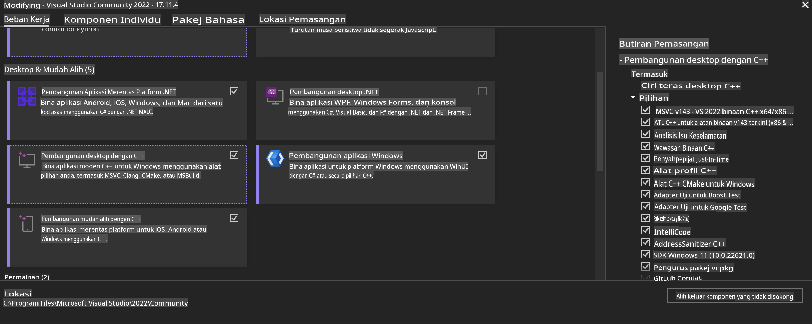
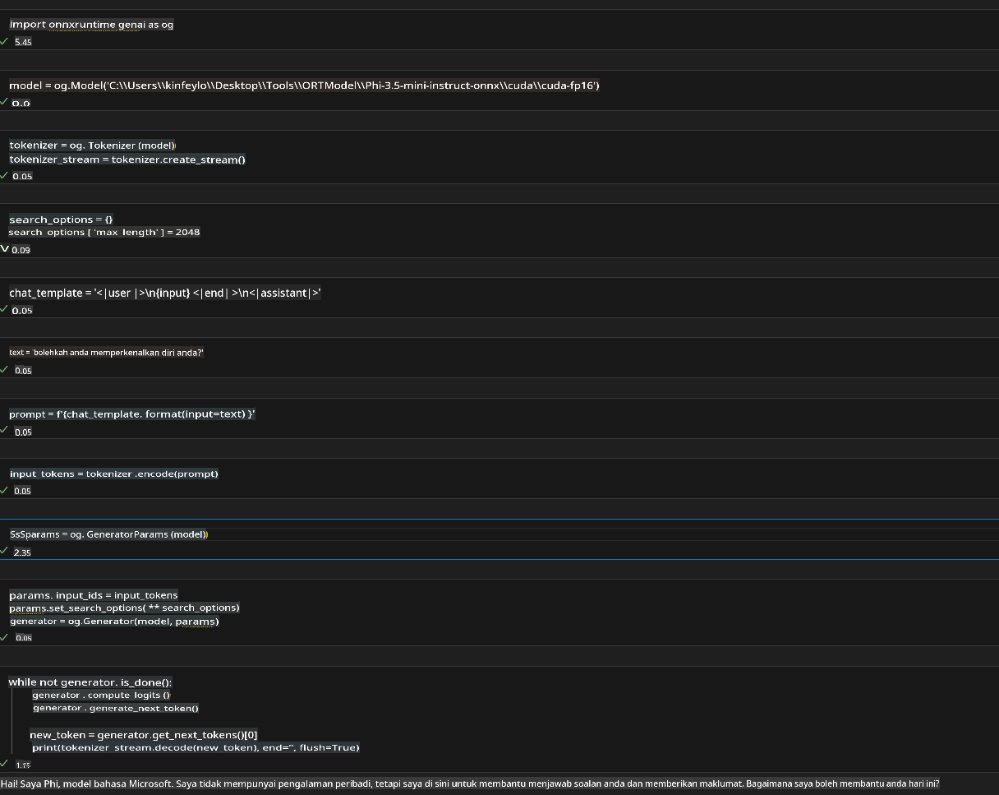
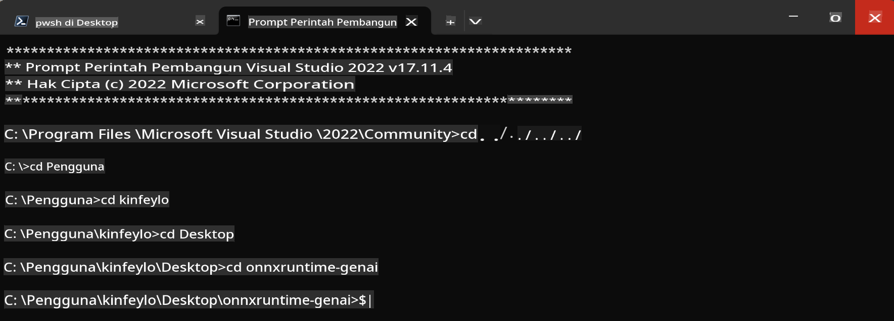

# **Panduan untuk OnnxRuntime GenAI Windows GPU**

Panduan ini memberikan langkah-langkah untuk mengatur dan menggunakan ONNX Runtime (ORT) dengan GPU di Windows. Panduan ini dirancang untuk membantu Anda memanfaatkan akselerasi GPU untuk model Anda, sehingga meningkatkan performa dan efisiensi.

Dokumen ini mencakup panduan mengenai:

- Pengaturan Lingkungan: Instruksi untuk menginstal dependensi yang diperlukan seperti CUDA, cuDNN, dan ONNX Runtime.
- Konfigurasi: Cara mengonfigurasi lingkungan dan ONNX Runtime agar dapat memanfaatkan sumber daya GPU secara efektif.
- Tips Optimasi: Saran untuk menyempurnakan pengaturan GPU Anda demi performa yang optimal.

### **1. Python 3.10.x /3.11.8**

   ***Catatan*** Disarankan menggunakan [miniforge](https://github.com/conda-forge/miniforge/releases/latest/download/Miniforge3-Windows-x86_64.exe) sebagai lingkungan Python Anda.

   ```bash

   conda create -n pydev python==3.11.8

   conda activate pydev

   ```

   ***Pengingat*** Jika Anda sudah menginstal pustaka Python ONNX, harap hapus instalasinya.

### **2. Instal CMake dengan winget**

   ```bash

   winget install -e --id Kitware.CMake

   ```

### **3. Instal Visual Studio 2022 - Desktop Development dengan C++**

   ***Catatan*** Jika Anda tidak ingin melakukan kompilasi, Anda dapat melewati langkah ini.



### **4. Instal Driver NVIDIA**

1. **NVIDIA GPU Driver** [https://www.nvidia.com/en-us/drivers/](https://www.nvidia.com/en-us/drivers/)

2. **NVIDIA CUDA 12.4** [https://developer.nvidia.com/cuda-12-4-0-download-archive](https://developer.nvidia.com/cuda-12-4-0-download-archive)

3. **NVIDIA CUDNN 9.4** [https://developer.nvidia.com/cudnn-downloads](https://developer.nvidia.com/cudnn-downloads)

***Pengingat*** Harap gunakan pengaturan default saat proses instalasi.

### **5. Atur Lingkungan NVIDIA**

Salin file lib, bin, dan include dari NVIDIA CUDNN 9.4 ke direktori lib, bin, dan include NVIDIA CUDA 12.4.

- Salin file *'C:\Program Files\NVIDIA\CUDNN\v9.4\bin\12.6'* ke *'C:\Program Files\NVIDIA GPU Computing Toolkit\CUDA\v12.4\bin*

- Salin file *'C:\Program Files\NVIDIA\CUDNN\v9.4\include\12.6'* ke *'C:\Program Files\NVIDIA GPU Computing Toolkit\CUDA\v12.4\include*

- Salin file *'C:\Program Files\NVIDIA\CUDNN\v9.4\lib\12.6'* ke *'C:\Program Files\NVIDIA GPU Computing Toolkit\CUDA\v12.4\lib\x64'*

### **6. Unduh Phi-3.5-mini-instruct-onnx**

   ```bash

   winget install -e --id Git.Git

   winget install -e --id GitHub.GitLFS

   git lfs install

   git clone https://huggingface.co/microsoft/Phi-3.5-mini-instruct-onnx

   ```

### **7. Menjalankan InferencePhi35Instruct.ipynb**

   Buka [Notebook](../../../../../../code/09.UpdateSamples/Aug/ortgpu-phi35-instruct.ipynb) dan jalankan.



### **8. Kompilasi ORT GenAI GPU**

   ***Catatan*** 
   
   1. Harap hapus semua pustaka terkait onnx, onnxruntime, dan onnxruntime-genai terlebih dahulu.

   ```bash

   pip list 
   
   ```

   Kemudian hapus semua pustaka onnxruntime, misalnya:

   ```bash

   pip uninstall onnxruntime

   pip uninstall onnxruntime-genai

   pip uninstall onnxruntume-genai-cuda
   
   ```

   2. Periksa dukungan Visual Studio Extension.

   Periksa folder C:\Program Files\NVIDIA GPU Computing Toolkit\CUDA\v12.4\extras untuk memastikan bahwa folder C:\Program Files\NVIDIA GPU Computing Toolkit\CUDA\v12.4\extras\visual_studio_integration ditemukan. 

   Jika tidak ditemukan, periksa folder driver toolkit CUDA lainnya dan salin folder visual_studio_integration beserta isinya ke C:\Program Files\NVIDIA GPU Computing Toolkit\CUDA\v12.4\extras\visual_studio_integration.

   - Jika Anda tidak ingin melakukan kompilasi, Anda dapat melewati langkah ini.

   ```bash

   git clone https://github.com/microsoft/onnxruntime-genai

   ```

   - Unduh [https://github.com/microsoft/onnxruntime/releases/download/v1.19.2/onnxruntime-win-x64-gpu-1.19.2.zip](https://github.com/microsoft/onnxruntime/releases/download/v1.19.2/onnxruntime-win-x64-gpu-1.19.2.zip).

   - Ekstrak onnxruntime-win-x64-gpu-1.19.2.zip, lalu ubah namanya menjadi **ort**, kemudian salin folder ort ke onnxruntime-genai.

   - Gunakan Windows Terminal, buka Developer Command Prompt untuk VS 2022, lalu navigasikan ke onnxruntime-genai.



   - Kompilasi menggunakan lingkungan Python Anda.

   ```bash

   cd onnxruntime-genai

   python build.py --use_cuda  --cuda_home "C:\Program Files\NVIDIA GPU Computing Toolkit\CUDA\v12.4" --config Release
 

   cd build/Windows/Release/Wheel

   pip install .whl

   ```

**Penafian**:  
Dokumen ini telah diterjemahkan menggunakan perkhidmatan terjemahan AI berasaskan mesin. Walaupun kami berusaha untuk memastikan ketepatan, sila ambil perhatian bahawa terjemahan automatik mungkin mengandungi kesilapan atau ketidaktepatan. Dokumen asal dalam bahasa asalnya harus dianggap sebagai sumber yang berwibawa. Untuk maklumat penting, terjemahan manusia profesional adalah disyorkan. Kami tidak bertanggungjawab terhadap sebarang salah faham atau salah tafsir yang timbul daripada penggunaan terjemahan ini.