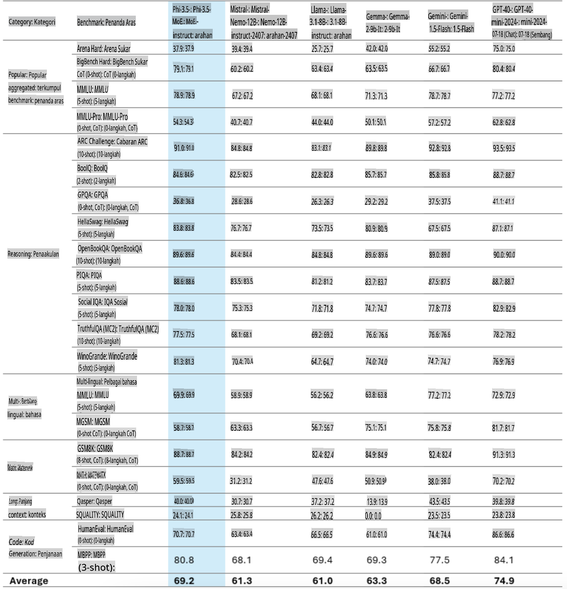
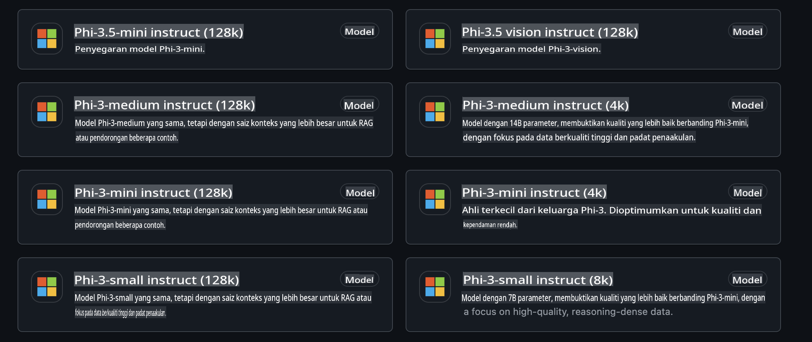
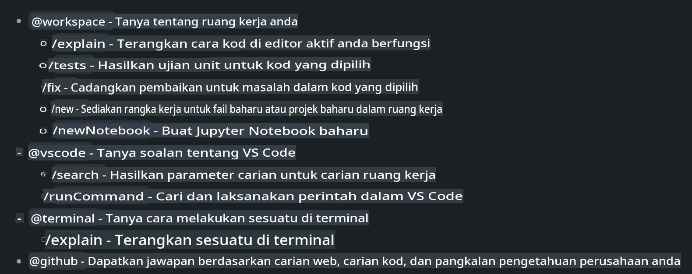
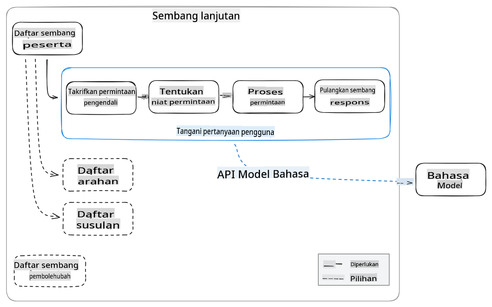
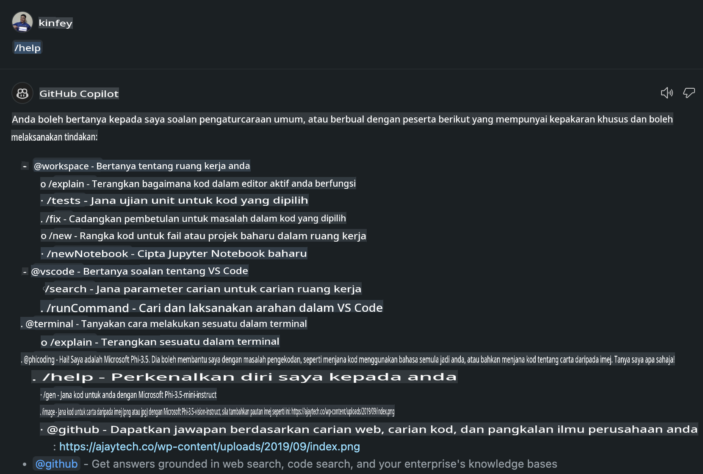
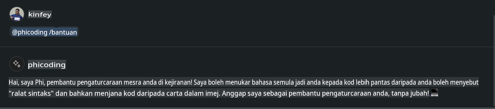
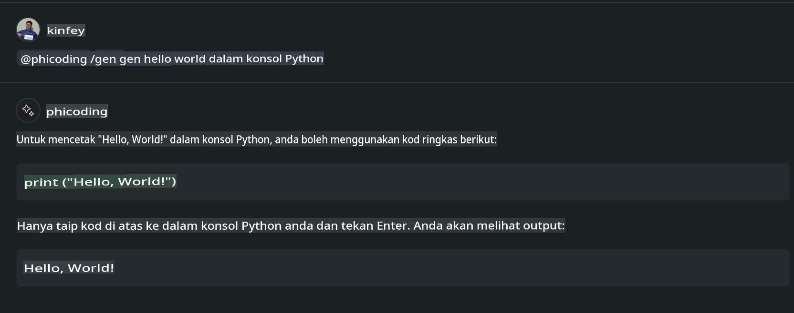
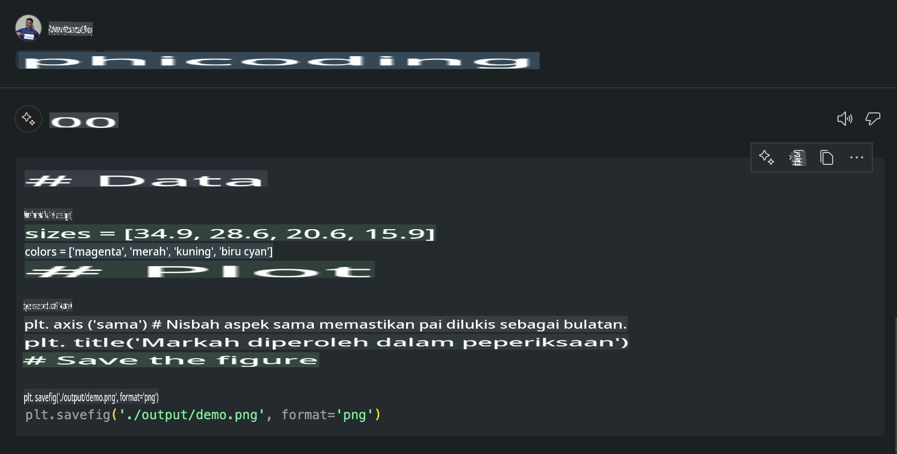

# **Cipta Ejen Chat Copilot Visual Studio Code Anda Sendiri dengan Phi-3.5 oleh GitHub Models**

Adakah anda menggunakan Visual Studio Code Copilot? Terutamanya dalam mod Chat, anda boleh menggunakan pelbagai ejen untuk meningkatkan keupayaan mencipta, menulis, dan menyelenggara projek dalam Visual Studio Code. Visual Studio Code menyediakan API yang membolehkan syarikat dan individu mencipta ejen berbeza berdasarkan keperluan perniagaan mereka untuk memperluaskan keupayaan dalam bidang proprietari tertentu. Dalam artikel ini, kita akan memberi tumpuan kepada **Phi-3.5-mini-instruct (128k)** dan **Phi-3.5-vision-instruct (128k)** daripada GitHub Models untuk mencipta Ejen Visual Studio Code anda sendiri.

## **Mengenai Phi-3.5 pada GitHub Models**

Kita tahu bahawa Phi-3/3.5-mini-instruct dalam keluarga Phi-3/3.5 mempunyai keupayaan pemahaman dan penjanaan kod yang kuat, serta kelebihan berbanding Gemma-2-9b dan Mistral-Nemo-12B-instruct-2407.



Model terkini GitHub sudah menyediakan akses kepada model Phi-3.5-mini-instruct (128k) dan Phi-3.5-vision-instruct (128k). Pembangun boleh mengaksesnya melalui OpenAI SDK, Azure AI Inference SDK, dan REST API.



***Nota:*** Disarankan menggunakan Azure AI Inference SDK di sini kerana ia lebih sesuai untuk beralih dengan Azure Model Catalog dalam persekitaran produksi.

Berikut adalah hasil **Phi-3.5-mini-instruct (128k)** dan **Phi-3.5-vision-instruct (128k)** dalam senario penjanaan kod selepas integrasi dengan GitHub Models, sebagai persediaan untuk contoh berikut.

**Demo: GitHub Models Phi-3.5-mini-instruct (128k) menghasilkan kod daripada Prompt** ([klik pautan ini](../../../../../../code/09.UpdateSamples/Aug/ghmodel_phi35_instruct_demo.ipynb))

**Demo: GitHub Models Phi-3.5-vision-instruct (128k) menghasilkan kod daripada Imej** ([klik pautan ini](../../../../../../code/09.UpdateSamples/Aug/ghmodel_phi35_vision_demo.ipynb))

## **Mengenai GitHub Copilot Chat Agent**

GitHub Copilot Chat Agent boleh menyelesaikan pelbagai tugas dalam senario projek yang berbeza berdasarkan kod. Sistem ini mempunyai empat ejen: workspace, github, terminal, vscode.



Dengan menambah nama ejen dengan ‘@’, anda boleh dengan cepat menyelesaikan kerja yang berkaitan. Untuk syarikat, jika anda menambah kandungan berkaitan perniagaan anda seperti keperluan, pengekodan, spesifikasi ujian, dan pelepasan, anda boleh mempunyai fungsi peribadi syarikat yang lebih berkuasa berdasarkan GitHub Copilot.

Visual Studio Code Chat Agent kini secara rasmi telah melancarkan API-nya, membolehkan syarikat atau pembangun syarikat membangunkan ejen berdasarkan ekosistem perniagaan perisian yang berbeza. Berdasarkan kaedah pembangunan Visual Studio Code Extension Development, anda boleh dengan mudah mengakses antara muka Visual Studio Code Chat Agent API. Kita boleh membangunkan berdasarkan proses ini.



Senario pembangunan ini menyokong akses kepada API model pihak ketiga (seperti GitHub Models, Azure Model Catalog, dan perkhidmatan binaan sendiri berdasarkan model sumber terbuka) dan juga boleh menggunakan model gpt-35-turbo, gpt-4, dan gpt-4o yang disediakan oleh GitHub Copilot.

## **Tambah Ejen @phicoding berdasarkan Phi-3.5**

Kami cuba mengintegrasikan keupayaan pengaturcaraan Phi-3.5 untuk menyelesaikan penulisan kod, penjanaan kod daripada imej, dan tugas-tugas lain. Lengkapkan sebuah Ejen yang dibina di sekitar Phi-3.5 - @PHI, berikut adalah beberapa fungsi:

1. Menjana pengenalan diri berdasarkan GPT-4o yang disediakan oleh GitHub Copilot melalui arahan **@phicoding /help**.

2. Menjana kod untuk pelbagai bahasa pengaturcaraan berdasarkan **Phi-3.5-mini-instruct (128k)** melalui arahan **@phicoding /gen**.

3. Menjana kod berdasarkan **Phi-3.5-vision-instruct (128k)** dan melengkapkan imej melalui arahan **@phicoding /image**.


## **Langkah Berkaitan**

1. Pasang sokongan pembangunan Visual Studio Code Extension menggunakan npm.

```bash

npm install --global yo generator-code 

```

2. Cipta plugin Visual Studio Code Extension (menggunakan mod pembangunan Typescript, dinamakan phiext).

```bash

yo code 

```

3. Buka projek yang dicipta dan ubah suai package.json. Berikut adalah arahan dan konfigurasi berkaitan, serta konfigurasi GitHub Models. Perhatikan bahawa anda perlu menambah token GitHub Models anda di sini.

```json

{
  "name": "phiext",
  "displayName": "phiext",
  "description": "",
  "version": "0.0.1",
  "engines": {
    "vscode": "^1.93.0"
  },
  "categories": [
    "AI",
    "Chat"
  ],
  "activationEvents": [],
  "enabledApiProposals": [
      "chatVariableResolver"
  ],
  "main": "./dist/extension.js",
  "contributes": {
    "chatParticipants": [
        {
            "id": "chat.phicoding",
            "name": "phicoding",
            "description": "Hey! I am Microsoft Phi-3.5, She can help me with coding problems, such as generation code with your natural language, or even generation code about chart from images. Just ask me anything!",
            "isSticky": true,
            "commands": [
                {
                    "name": "help",
                    "description": "Introduce myself to you"
                },
                {
                    "name": "gen",
                    "description": "Generate code for you with Microsoft Phi-3.5-mini-instruct"
                },
                {
                    "name": "image",
                    "description": "Generate code for chart from image(png or jpg) with Microsoft Phi-3.5-vision-instruct, please add image url like this : https://ajaytech.co/wp-content/uploads/2019/09/index.png"
                }
            ]
        }
    ],
    "commands": [
        {
            "command": "phicoding.namesInEditor",
            "title": "Use Microsoft Phi 3.5 in Editor"
        }
    ],
    "configuration": {
      "type": "object",
      "title": "githubmodels",
      "properties": {
        "githubmodels.endpoint": {
          "type": "string",
          "default": "https://models.inference.ai.azure.com",
          "description": "Your GitHub Models Endpoint",
          "order": 0
        },
        "githubmodels.api_key": {
          "type": "string",
          "default": "Your GitHub Models Token",
          "description": "Your GitHub Models Token",
          "order": 1
        },
        "githubmodels.phi35instruct": {
          "type": "string",
          "default": "Phi-3.5-mini-instruct",
          "description": "Your Phi-35-Instruct Model",
          "order": 2
        },
        "githubmodels.phi35vision": {
          "type": "string",
          "default": "Phi-3.5-vision-instruct",
          "description": "Your Phi-35-Vision Model",
          "order": 3
        }
      }
    }
  },
  "scripts": {
    "vscode:prepublish": "npm run package",
    "compile": "webpack",
    "watch": "webpack --watch",
    "package": "webpack --mode production --devtool hidden-source-map",
    "compile-tests": "tsc -p . --outDir out",
    "watch-tests": "tsc -p . -w --outDir out",
    "pretest": "npm run compile-tests && npm run compile && npm run lint",
    "lint": "eslint src",
    "test": "vscode-test"
  },
  "devDependencies": {
    "@types/vscode": "^1.93.0",
    "@types/mocha": "^10.0.7",
    "@types/node": "20.x",
    "@typescript-eslint/eslint-plugin": "^8.3.0",
    "@typescript-eslint/parser": "^8.3.0",
    "eslint": "^9.9.1",
    "typescript": "^5.5.4",
    "ts-loader": "^9.5.1",
    "webpack": "^5.94.0",
    "webpack-cli": "^5.1.4",
    "@vscode/test-cli": "^0.0.10",
    "@vscode/test-electron": "^2.4.1"
  },
  "dependencies": {
    "@types/node-fetch": "^2.6.11",
    "node-fetch": "^3.3.2",
    "@azure-rest/ai-inference": "latest",
    "@azure/core-auth": "latest",
    "@azure/core-sse": "latest"
  }
}


```

4. Ubah suai src/extension.ts.

```typescript

// The module 'vscode' contains the VS Code extensibility API
// Import the module and reference it with the alias vscode in your code below
import * as vscode from 'vscode';
import ModelClient from "@azure-rest/ai-inference";
import { AzureKeyCredential } from "@azure/core-auth";


interface IPhiChatResult extends vscode.ChatResult {
    metadata: {
        command: string;
    };
}


const MODEL_SELECTOR: vscode.LanguageModelChatSelector = { vendor: 'copilot', family: 'gpt-4o' };

function isValidImageUrl(url: string): boolean {
    const regex = /^(https?:\/\/.*\.(?:png|jpg))$/i;
    return regex.test(url);
}
  

// This method is called when your extension is activated
// Your extension is activated the very first time the command is executed
export function activate(context: vscode.ExtensionContext) {

    const codinghandler: vscode.ChatRequestHandler = async (request: vscode.ChatRequest, context: vscode.ChatContext, stream: vscode.ChatResponseStream, token: vscode.CancellationToken): Promise<IPhiChatResult> => {


        const config : any = vscode.workspace.getConfiguration('githubmodels');
        const endPoint: string = config.get('endpoint');
        const apiKey: string = config.get('api_key');
        const phi35instruct: string = config.get('phi35instruct');
        const phi35vision: string = config.get('phi35vision');
        
        if (request.command === 'help') {

            const content = "Welcome to Coding assistant with Microsoft Phi-3.5"; 
            stream.progress(content);


            try {
                const [model] = await vscode.lm.selectChatModels(MODEL_SELECTOR);
                if (model) {
                    const messages = [
                        vscode.LanguageModelChatMessage.User("Please help me express this content in a humorous way: I am a programming assistant who can help you convert natural language into code and generate code based on the charts in the images. output format like this : Hey I am Phi ......")
                    ];
                    const chatResponse = await model.sendRequest(messages, {}, token);
                    for await (const fragment of chatResponse.text) {
                        stream.markdown(fragment);
                    }
                }
            } catch(err) {
                console.log(err);
            }


            return { metadata: { command: 'help' } };

        }

        
        if (request.command === 'gen') {

            const content = "Welcome to use phi-3.5 to generate code";

            stream.progress(content);

            const client = new ModelClient(endPoint, new AzureKeyCredential(apiKey));

            const response = await client.path("/chat/completions").post({
              body: {
                messages: [
                  { role:"system", content: "You are a coding assistant.Help answer all code generation questions." },
                  { role:"user", content: request.prompt }
                ],
                model: phi35instruct,
                temperature: 0.4,
                max_tokens: 1000,
                top_p: 1.
              }
            });

            stream.markdown(response.body.choices[0].message.content);

            return { metadata: { command: 'gen' } };

        }


        
        if (request.command === 'image') {


            const content = "Welcome to use phi-3.5 to generate code from image(png or jpg),image url like this:https://ajaytech.co/wp-content/uploads/2019/09/index.png";

            stream.progress(content);

            if (!isValidImageUrl(request.prompt)) {
                stream.markdown('Please provide a valid image URL');
                return { metadata: { command: 'image' } };
            }
            else
            {

                const client = new ModelClient(endPoint, new AzureKeyCredential(apiKey));
    
                const response = await client.path("/chat/completions").post({
                    body: {
                      messages: [
                        { role: "system", content: "You are a helpful assistant that describes images in details." },
                        { role: "user", content: [
                            { type: "text", text: "Please generate code according to the chart in the picture according to the following requirements\n1. Keep all information in the chart, including data and text\n2. Do not generate additional information that is not included in the chart\n3. Please extract data from the picture, do not generate it from csv\n4. Please save the regenerated chart as a chart and save it to ./output/demo.png"},
                            { type: "image_url", image_url: {url: request.prompt}
                            }
                          ]
                        }
                      ],
                      model: phi35vision,
                      temperature: 0.4,
                      max_tokens: 2048,
                      top_p: 1.
                    }
                  });
    
                
                stream.markdown(response.body.choices[0].message.content);
    
                return { metadata: { command: 'image' } };
            }


        }


        return { metadata: { command: '' } };
    };


    const phi_ext = vscode.chat.createChatParticipant("chat.phicoding", codinghandler);

    phi_ext.iconPath = new vscode.ThemeIcon('sparkle');


    phi_ext.followupProvider = {
        provideFollowups(result: IPhiChatResult, context: vscode.ChatContext, token: vscode.CancellationToken) {
            return [{
                prompt: 'Let us coding with Phi-3.5 😋😋😋😋',
                label: vscode.l10n.t('Enjoy coding with Phi-3.5'),
                command: 'help'
            } satisfies vscode.ChatFollowup];
        }
    };

    context.subscriptions.push(phi_ext);
}

// This method is called when your extension is deactivated
export function deactivate() {}


```

6. Jalankan.

***/help***



***@phicoding /help***



***@phicoding /gen***



***@phicoding /image***



Anda boleh memuat turun kod contoh: [klik](../../../../../../code/09.UpdateSamples/Aug/vscode)

## **Sumber**

1. Daftar GitHub Models [https://gh.io/models](https://gh.io/models)

2. Belajar Pembangunan Visual Studio Code Extension [https://code.visualstudio.com/api/get-started/your-first-extension](https://code.visualstudio.com/api/get-started/your-first-extension)

3. Ketahui tentang Visual Studio Code Copilot Chat API [https://code.visualstudio.com/api/extension-guides/chat](https://code.visualstudio.com/api/extension-guides/chat)

**Penafian**:  
Dokumen ini telah diterjemahkan menggunakan perkhidmatan terjemahan AI berasaskan mesin. Walaupun kami berusaha untuk memastikan ketepatan, sila ambil perhatian bahawa terjemahan automatik mungkin mengandungi kesilapan atau ketidaktepatan. Dokumen asal dalam bahasa asalnya harus dianggap sebagai sumber yang berwibawa. Untuk maklumat yang kritikal, terjemahan manusia profesional adalah disyorkan. Kami tidak bertanggungjawab ke atas sebarang salah faham atau salah tafsir yang timbul daripada penggunaan terjemahan ini.