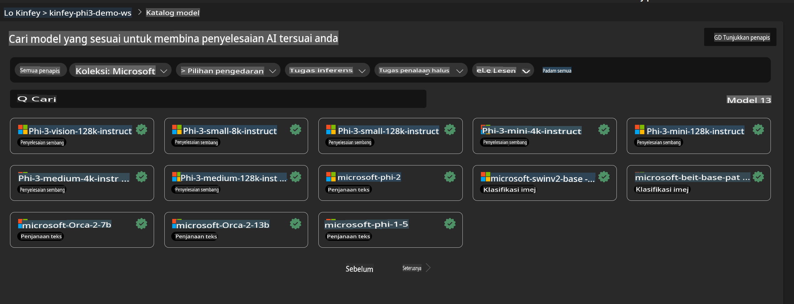
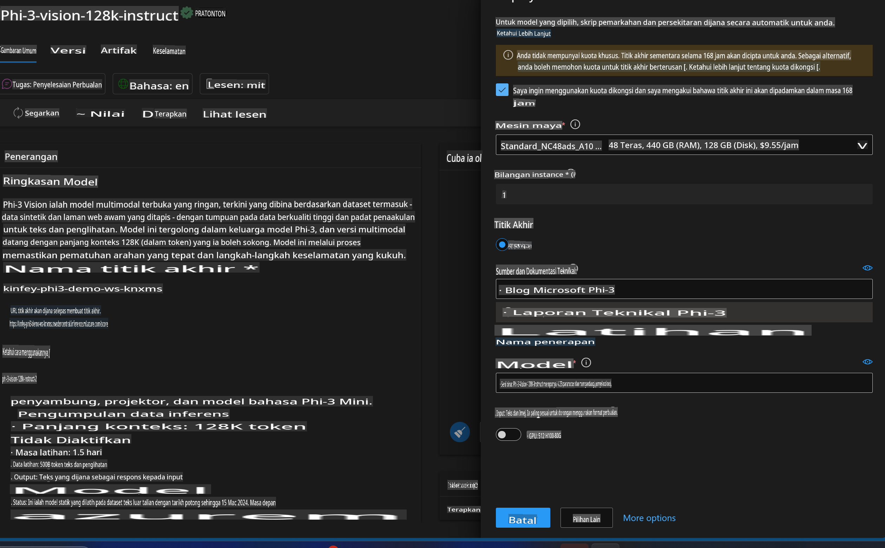
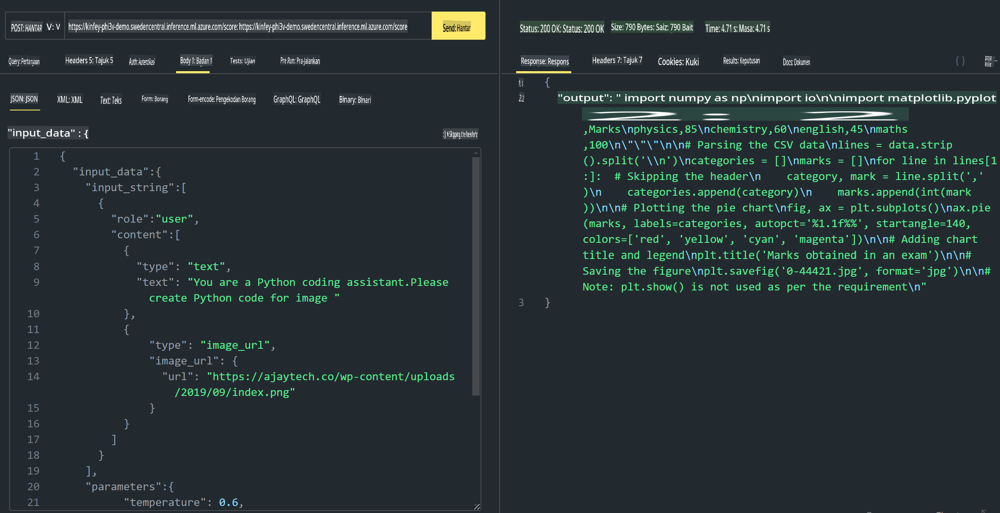

# **Lab 3 - Laksanakan Phi-3-Vision pada Azure Machine Learning Service**

Kita akan menggunakan NPU untuk melaksanakan pengeluaran kod secara tempatan, dan kemudian memperkenalkan keupayaan PHI-3-VISION untuk menghasilkan kod daripada gambar.

Dalam panduan ini, kita dapat dengan cepat membina perkhidmatan Model As Service Phi-3 Vision di Azure Machine Learning Service.

***Nota***: Phi-3 Vision memerlukan kuasa pengkomputeran untuk menghasilkan kandungan dengan lebih pantas. Kita memerlukan kuasa pengkomputeran awan untuk merealisasikannya.

### **1. Cipta Azure Machine Learning Service**

Kita perlu mencipta Azure Machine Learning Service di Azure Portal. Jika anda ingin mengetahui caranya, sila lawati pautan ini [https://learn.microsoft.com/azure/machine-learning/quickstart-create-resources?view=azureml-api-2](https://learn.microsoft.com/azure/machine-learning/quickstart-create-resources?view=azureml-api-2)

### **2. Pilih Phi-3 Vision dalam Azure Machine Learning Service**



### **3. Laksanakan Phi-3-Vision di Azure**



### **4. Uji Endpoint di Postman**



***Nota***

1. Parameter yang perlu dihantar mesti termasuk Authorization, azureml-model-deployment, dan Content-Type. Anda perlu menyemak maklumat pelaksanaan untuk mendapatkannya.

2. Untuk menghantar parameter, Phi-3-Vision memerlukan pautan gambar. Sila rujuk kaedah GPT-4-Vision untuk menghantar parameter, seperti

```json

{
  "input_data":{
    "input_string":[
      {
        "role":"user",
        "content":[ 
          {
            "type": "text",
            "text": "You are a Python coding assistant.Please create Python code for image "
          },
          {
              "type": "image_url",
              "image_url": {
                "url": "https://ajaytech.co/wp-content/uploads/2019/09/index.png"
              }
          }
        ]
      }
    ],
    "parameters":{
          "temperature": 0.6,
          "top_p": 0.9,
          "do_sample": false,
          "max_new_tokens": 2048
    }
  }
}

```

3. Gunakan kaedah Post untuk memanggil **/score**

**Tahniah**! Anda telah berjaya melaksanakan PHI-3-VISION dengan cepat dan mencuba bagaimana menggunakan gambar untuk menghasilkan kod. Seterusnya, kita boleh membina aplikasi dengan gabungan NPU dan awan.

**Penafian**:  
Dokumen ini telah diterjemahkan menggunakan perkhidmatan terjemahan AI berasaskan mesin. Walaupun kami berusaha untuk memastikan ketepatan, sila maklum bahawa terjemahan automatik mungkin mengandungi kesilapan atau ketidaktepatan. Dokumen asal dalam bahasa asalnya harus dianggap sebagai sumber yang berwibawa. Untuk maklumat kritikal, terjemahan manusia profesional adalah disyorkan. Kami tidak bertanggungjawab ke atas sebarang salah faham atau salah tafsir yang timbul daripada penggunaan terjemahan ini.