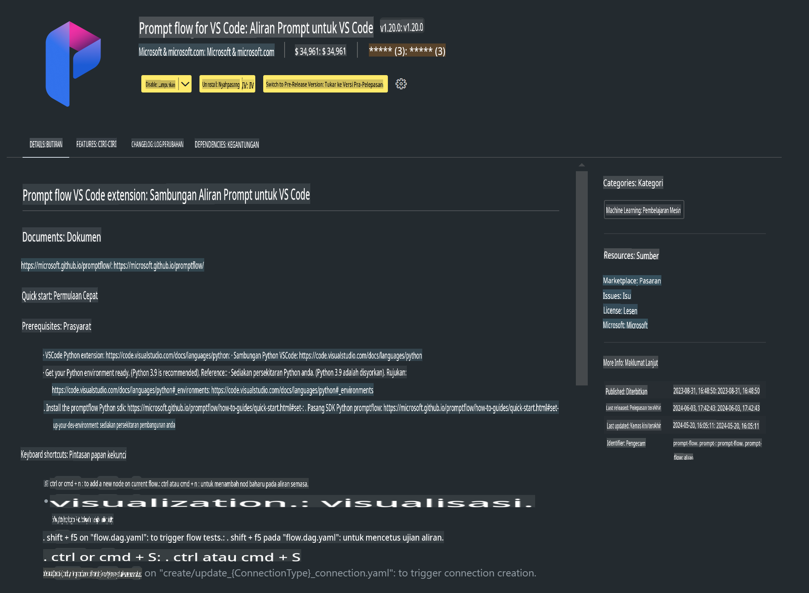

# **Lab 0 - Pemasangan**

Apabila kita memasuki Lab, kita perlu mengkonfigurasi persekitaran yang berkaitan:

### **1. Python 3.11+**

Disarankan untuk menggunakan miniforge bagi mengkonfigurasi persekitaran Python anda.

Untuk mengkonfigurasi miniforge, sila rujuk [https://github.com/conda-forge/miniforge](https://github.com/conda-forge/miniforge).

Selepas mengkonfigurasi miniforge, jalankan arahan berikut dalam Power Shell:

```bash

conda create -n pyenv python==3.11.8 -y

conda activate pyenv

```

### **2. Pasang Prompt flow SDK**

Dalam Lab 1, kita akan menggunakan Prompt flow, jadi anda perlu mengkonfigurasi Prompt flow SDK.

```bash

pip install promptflow --upgrade

```

Anda boleh menyemak promptflow sdk dengan arahan ini:

```bash

pf --version

```

### **3. Pasang Sambungan Prompt flow untuk Visual Studio Code**



### **4. Rangka Kerja MLX Apple**

MLX adalah rangka kerja array untuk penyelidikan pembelajaran mesin pada Apple silicon, yang dibangunkan oleh pasukan penyelidikan pembelajaran mesin Apple. Anda boleh menggunakan **Rangka Kerja MLX Apple** untuk mempercepatkan LLM / SLM dengan Apple Silicon. Jika anda ingin mengetahui lebih lanjut, anda boleh membaca [https://github.com/microsoft/PhiCookBook/blob/main/md/01.Introduction/03/MLX_Inference.md](https://github.com/microsoft/PhiCookBook/blob/main/md/01.Introduction/03/MLX_Inference.md).

Pasang Perpustakaan rangka kerja MLX dalam bash:

```bash

pip install mlx-lm

```

### **5. Perpustakaan Python Lain**

Buat fail requirements.txt dan tambahkan kandungan ini:

```txt

notebook
numpy 
scipy 
scikit-learn 
matplotlib 
pandas 
pillow 
graphviz

```

### **6. Pasang NVM**

Pasang nvm dalam Powershell:

```bash

brew install nvm

```

Pasang nodejs versi 18.20:

```bash

nvm install 18.20.0

nvm use 18.20.0

```

### **7. Pasang Sokongan Pembangunan untuk Visual Studio Code**

```bash

npm install --global yo generator-code

```

Tahniah! Anda telah berjaya mengkonfigurasi SDK. Seterusnya, teruskan dengan langkah-langkah praktikal.

**Penafian**:  
Dokumen ini telah diterjemahkan menggunakan perkhidmatan terjemahan AI berasaskan mesin. Walaupun kami berusaha untuk ketepatan, sila ambil perhatian bahawa terjemahan automatik mungkin mengandungi kesilapan atau ketidaktepatan. Dokumen asal dalam bahasa asalnya harus dianggap sebagai sumber yang berwibawa. Untuk maklumat kritikal, terjemahan manusia profesional adalah disyorkan. Kami tidak bertanggungjawab atas sebarang salah faham atau salah tafsir yang timbul daripada penggunaan terjemahan ini.