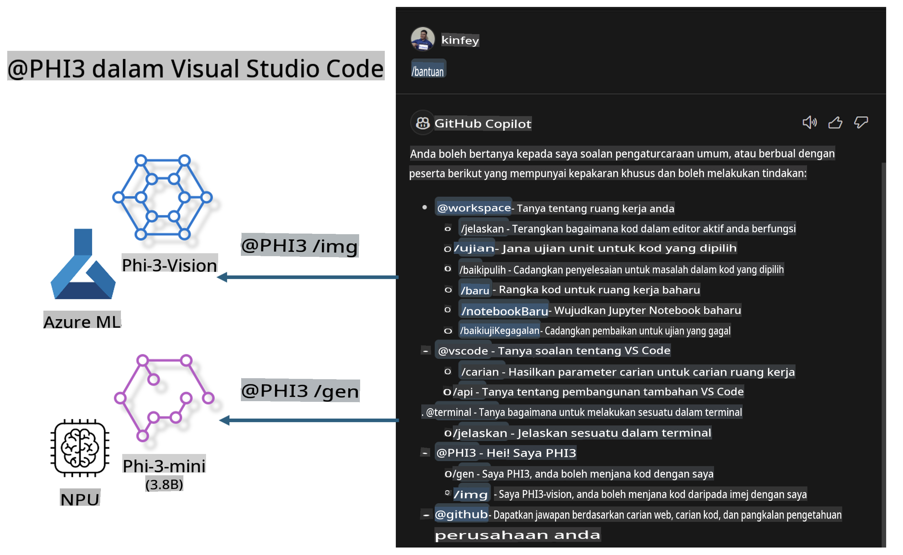

# **Bina Sendiri Visual Studio Code GitHub Copilot Chat dengan Microsoft Phi-3 Family**

Pernahkah anda menggunakan agen workspace dalam GitHub Copilot Chat? Adakah anda ingin membina agen kod pasukan anda sendiri? Makmal ini bertujuan untuk menggabungkan model sumber terbuka bagi membina agen perniagaan kod pada peringkat perusahaan.

## **Asas**

### **Kenapa memilih Microsoft Phi-3**

Phi-3 adalah siri keluarga, termasuk phi-3-mini, phi-3-small, dan phi-3-medium berdasarkan parameter latihan yang berbeza untuk penjanaan teks, pelengkap dialog, dan penjanaan kod. Terdapat juga phi-3-vision berdasarkan Vision. Ia sesuai untuk perusahaan atau pasukan yang ingin mencipta penyelesaian AI generatif secara offline.

Disyorkan untuk membaca pautan ini [https://github.com/microsoft/PhiCookBook/blob/main/md/01.Introduction/01/01.PhiFamily.md](https://github.com/microsoft/PhiCookBook/blob/main/md/01.Introduction/01/01.PhiFamily.md)

### **Microsoft GitHub Copilot Chat**

Sambungan GitHub Copilot Chat memberikan anda antara muka sembang yang membolehkan anda berinteraksi dengan GitHub Copilot dan menerima jawapan kepada soalan berkaitan kod terus dalam VS Code, tanpa perlu menyemak dokumentasi atau mencari di forum dalam talian.

Copilot Chat mungkin menggunakan penyorotan sintaks, penjajaran, dan ciri pemformatan lain untuk menambah kejelasan pada respons yang dijana. Bergantung pada jenis soalan daripada pengguna, hasilnya mungkin mengandungi pautan ke konteks yang digunakan oleh Copilot untuk menjana respons, seperti fail kod sumber atau dokumentasi, atau butang untuk mengakses fungsi VS Code.

- Copilot Chat berintegrasi dalam aliran kerja pembangun anda dan memberikan bantuan di tempat yang anda perlukan:

- Mulakan perbualan sembang terus dari editor atau terminal untuk mendapatkan bantuan semasa anda sedang menulis kod

- Gunakan paparan Chat untuk mempunyai pembantu AI di sisi anda pada bila-bila masa

- Lancarkan Quick Chat untuk bertanya soalan ringkas dan kembali kepada kerja anda

Anda boleh menggunakan GitHub Copilot Chat dalam pelbagai senario, seperti:

- Menjawab soalan kod tentang cara terbaik menyelesaikan masalah

- Menerangkan kod orang lain dan mencadangkan penambahbaikan

- Mencadangkan pembaikan kod

- Menjana kes ujian unit

- Menjana dokumentasi kod

Disyorkan untuk membaca pautan ini [https://code.visualstudio.com/docs/copilot/copilot-chat](https://code.visualstudio.com/docs/copilot/copilot-chat?WT.mc_id=aiml-137032-kinfeylo)

### **Microsoft GitHub Copilot Chat @workspace**

Merujuk kepada **@workspace** dalam Copilot Chat membolehkan anda bertanya soalan tentang keseluruhan kod asas anda. Berdasarkan soalan, Copilot dengan bijak mendapatkan fail dan simbol yang relevan, yang kemudiannya dirujuk dalam jawapannya sebagai pautan dan contoh kod.

Untuk menjawab soalan anda, **@workspace** mencari melalui sumber yang sama seperti yang digunakan oleh pembangun apabila menavigasi kod asas dalam VS Code:

- Semua fail dalam workspace, kecuali fail yang diabaikan oleh fail .gitignore

- Struktur direktori dengan folder bersarang dan nama fail

- Indeks carian kod GitHub, jika workspace adalah repositori GitHub dan diindeks oleh carian kod

- Simbol dan definisi dalam workspace

- Teks yang dipilih atau teks yang kelihatan dalam editor aktif

Nota: .gitignore akan diabaikan jika anda membuka fail atau mempunyai teks yang dipilih dalam fail yang diabaikan.

Disyorkan untuk membaca pautan ini [https://code.visualstudio.com/docs/copilot/copilot-chat](https://code.visualstudio.com/docs/copilot/workspace-context?WT.mc_id=aiml-137032-kinfeylo)

## **Ketahui lebih lanjut tentang Lab ini**

GitHub Copilot telah banyak meningkatkan kecekapan pengaturcaraan perusahaan, dan setiap perusahaan berharap dapat menyesuaikan fungsi GitHub Copilot yang relevan. Banyak perusahaan telah menyesuaikan Extensions yang serupa dengan GitHub Copilot berdasarkan senario perniagaan mereka sendiri dan model sumber terbuka. Bagi perusahaan, Extensions yang disesuaikan lebih mudah dikawal, tetapi ini juga mempengaruhi pengalaman pengguna. Lagipun, GitHub Copilot mempunyai fungsi yang lebih kuat dalam menangani senario umum dan profesionalisme. Jika pengalaman boleh dikekalkan konsisten, akan lebih baik untuk menyesuaikan Extension perusahaan sendiri. GitHub Copilot Chat menyediakan API yang relevan untuk perusahaan memperluaskan pengalaman Chat. Mengekalkan pengalaman yang konsisten sambil mempunyai fungsi tersuai adalah pengalaman pengguna yang lebih baik.

Makmal ini terutamanya menggunakan model Phi-3 yang digabungkan dengan NPU tempatan dan Azure hybrid untuk membina Agen tersuai dalam GitHub Copilot Chat ***@PHI3*** untuk membantu pembangun perusahaan menyelesaikan penjanaan kod ***(@PHI3 /gen)*** dan menjana kod berdasarkan imej ***(@PHI3 /img)***.

### ***Nota:*** 

Makmal ini kini dilaksanakan dalam AIPC pada CPU Intel dan Apple Silicon. Kami akan terus mengemas kini versi Qualcomm NPU.

## **Lab**

| Nama | Penerangan | AIPC | Apple |
| ------------ | ----------- | -------- |-------- |
| Lab0 - Installations(✅) | Konfigurasikan dan pasang persekitaran berkaitan dan alat pemasangan | [Go](./HOL/AIPC/01.Installations.md) |[Go](./HOL/Apple/01.Installations.md) |
| Lab1 - Jalankan Prompt flow dengan Phi-3-mini (✅) | Digabungkan dengan AIPC / Apple Silicon, menggunakan NPU tempatan untuk mencipta penjanaan kod melalui Phi-3-mini | [Go](./HOL/AIPC/02.PromptflowWithNPU.md) |  [Go](./HOL/Apple/02.PromptflowWithMLX.md) |
| Lab2 - Deploy Phi-3-vision pada Azure Machine Learning Service(✅) | Menjana kod dengan mendepankan Phi-3-vision Model Catalog pada Azure Machine Learning Service | [Go](./HOL/AIPC/03.DeployPhi3VisionOnAzure.md) |[Go](./HOL/Apple/03.DeployPhi3VisionOnAzure.md) |
| Lab3 - Cipta agen @phi-3 dalam GitHub Copilot Chat(✅)  | Cipta agen Phi-3 tersuai dalam GitHub Copilot Chat untuk menyelesaikan penjanaan kod, penjanaan grafik, RAG, dll. | [Go](./HOL/AIPC/04.CreatePhi3AgentInVSCode.md) | [Go](./HOL/Apple/04.CreatePhi3AgentInVSCode.md) |
| Kod Contoh (✅)  | Muat turun kod contoh | [Go](../../../../../../../code/07.Lab/01/AIPC) | [Go](../../../../../../../code/07.Lab/01/Apple) |

## **Sumber**

1. Phi-3 Cookbook [https://github.com/microsoft/Phi-3CookBook](https://github.com/microsoft/Phi-3CookBook)

2. Ketahui lebih lanjut tentang GitHub Copilot [https://learn.microsoft.com/training/paths/copilot/](https://learn.microsoft.com/training/paths/copilot/?WT.mc_id=aiml-137032-kinfeylo)

3. Ketahui lebih lanjut tentang GitHub Copilot Chat [https://learn.microsoft.com/training/paths/accelerate-app-development-using-github-copilot/](https://learn.microsoft.com/training/paths/accelerate-app-development-using-github-copilot/?WT.mc_id=aiml-137032-kinfeylo)

4. Ketahui lebih lanjut tentang API GitHub Copilot Chat [https://code.visualstudio.com/api/extension-guides/chat](https://code.visualstudio.com/api/extension-guides/chat?WT.mc_id=aiml-137032-kinfeylo)

5. Ketahui lebih lanjut tentang Azure AI Foundry [https://learn.microsoft.com/training/paths/create-custom-copilots-ai-studio/](https://learn.microsoft.com/training/paths/create-custom-copilots-ai-studio/?WT.mc_id=aiml-137032-kinfeylo)

6. Ketahui lebih lanjut tentang Model Catalog Azure AI Foundry [https://learn.microsoft.com/azure/ai-studio/how-to/model-catalog-overview](https://learn.microsoft.com/azure/ai-studio/how-to/model-catalog-overview)

**Penafian**:  
Dokumen ini telah diterjemahkan menggunakan perkhidmatan terjemahan AI berasaskan mesin. Walaupun kami berusaha untuk ketepatan, sila ambil maklum bahawa terjemahan automatik mungkin mengandungi kesilapan atau ketidaktepatan. Dokumen asal dalam bahasa asalnya harus dianggap sebagai sumber yang berwibawa. Untuk maklumat penting, terjemahan manusia profesional adalah disyorkan. Kami tidak bertanggungjawab atas sebarang salah faham atau salah tafsir yang timbul daripada penggunaan terjemahan ini.