# Melarasikan Phi-3 dengan Azure AI Foundry

Mari kita pelajari cara melarasikan model bahasa Microsoft Phi-3 Mini menggunakan Azure AI Foundry. Melarasikan model memungkinkan anda menyesuaikan Phi-3 Mini untuk tugas tertentu, menjadikannya lebih berkuasa dan kontekstual.

## Pertimbangan

- **Keupayaan:** Model mana yang boleh dilaras? Apa yang boleh dilakukan oleh model asas setelah dilaras?
- **Kos:** Apakah model penetapan harga untuk melaras?
- **Kebolehsuaian:** Sejauh mana saya boleh mengubah suai model asas – dan bagaimana caranya?
- **Kemudahan:** Bagaimana proses melaras dilakukan – adakah saya perlu menulis kod tersuai? Adakah saya perlu menyediakan infrastruktur pengkomputeran sendiri?
- **Keselamatan:** Model yang dilaras diketahui mempunyai risiko keselamatan – adakah langkah berjaga-jaga tersedia untuk mengelakkan bahaya yang tidak diingini?

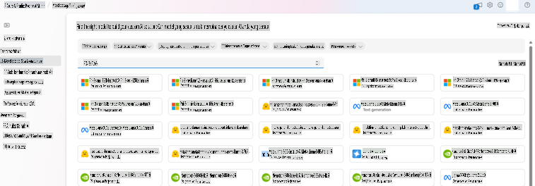

## Persediaan untuk Melaras

### Prasyarat

> [!NOTE]
> Untuk model keluarga Phi-3, tawaran melaras berdasarkan penggunaan hanya tersedia di hub yang dibuat di kawasan **East US 2**.

- Langganan Azure. Jika anda belum mempunyai langganan Azure, buat [akaun Azure berbayar](https://azure.microsoft.com/pricing/purchase-options/pay-as-you-go) untuk memulakan.

- Sebuah [projek AI Foundry](https://ai.azure.com?WT.mc_id=aiml-138114-kinfeylo).
- Kawalan akses berasaskan peranan Azure (Azure RBAC) digunakan untuk memberikan akses kepada operasi dalam Azure AI Foundry. Untuk melakukan langkah-langkah dalam artikel ini, akaun pengguna anda mesti diberikan peranan __Azure AI Developer__ pada kumpulan sumber.

### Pendaftaran Penyedia Langganan

Sahkan bahawa langganan telah didaftarkan kepada penyedia sumber `Microsoft.Network`.

1. Log masuk ke [portal Azure](https://portal.azure.com).
1. Pilih **Subscriptions** dari menu kiri.
1. Pilih langganan yang ingin digunakan.
1. Pilih **AI project settings** > **Resource providers** dari menu kiri.
1. Sahkan bahawa **Microsoft.Network** berada dalam senarai penyedia sumber. Jika tidak, tambahkan ia.

### Penyediaan Data

Sediakan data latihan dan validasi anda untuk melaras model. Set data latihan dan validasi anda terdiri daripada contoh input dan output untuk cara anda ingin model berfungsi.

Pastikan semua contoh latihan anda mengikuti format yang diharapkan untuk inferens. Untuk melaras model dengan berkesan, pastikan dataset anda seimbang dan pelbagai.

Ini melibatkan mengekalkan keseimbangan data, termasuk pelbagai senario, dan memperbaiki data latihan secara berkala untuk disesuaikan dengan jangkaan dunia nyata, yang akhirnya menghasilkan respons model yang lebih tepat dan seimbang.

Jenis model yang berbeza memerlukan format data latihan yang berbeza.

### Chat Completion

Data latihan dan validasi yang digunakan **mesti** diformatkan sebagai dokumen JSON Lines (JSONL). Untuk `Phi-3-mini-128k-instruct`, dataset melaras mesti diformatkan dalam format perbualan yang digunakan oleh API Chat completions.

### Contoh Format Fail

```json
    {"messages": [{"role": "system", "content": "You are an Xbox customer support agent whose primary goal is to help users with issues they are experiencing with their Xbox devices. You are friendly and concise. You only provide factual answers to queries, and do not provide answers that are not related to Xbox."}, {"role": "user", "content": "Is Xbox better than PlayStation?"}, {"role": "assistant", "content": "I apologize, but I cannot provide personal opinions. My primary job is to assist you with any issues related to your Xbox device. Do you have any Xbox-related issues that need addressing?"}]}
    {"messages": [{"role": "system", "content": "You are an Xbox customer support agent whose primary goal is to help users with issues they are experiencing with their Xbox devices. You are friendly and concise. You only provide factual answers to queries, and do not provide answers that are not related to Xbox."}, {"role": "user", "content": "Can I play PC games on my Xbox?"}, {"role": "assistant", "content": "While Xbox consoles don't natively support PC games, they can play an array of Xbox games, many of which are also available on PC. Can I assist you with finding games compatible with your Xbox device?"}]}
    {"messages": [{"role": "system", "content": "You are an Xbox customer support agent whose primary goal is to help users with issues they are experiencing with their Xbox devices. You are friendly and concise. You only provide factual answers to queries, and do not provide answers that are not related to Xbox."}, {"role": "user", "content": "I'm having trouble connecting my Xbox to the Wi-Fi."}, {"role": "assistant", "content": "No worries, let's go through the network settings on your Xbox. Can you please tell me what happens when you try to connect it to the Wi-Fi?"}]}
```

Jenis fail yang disokong adalah JSON Lines. Fail dimuat naik ke stor data lalai dan tersedia dalam projek anda.

## Melaras Phi-3 dengan Azure AI Foundry

Azure AI Foundry membolehkan anda menyesuaikan model bahasa besar dengan dataset peribadi anda melalui proses yang dikenali sebagai melaras. Melaras memberikan nilai besar dengan membolehkan penyesuaian dan pengoptimuman untuk tugas dan aplikasi tertentu. Ini membawa kepada prestasi yang lebih baik, kecekapan kos, latensi yang berkurang, dan output yang disesuaikan.

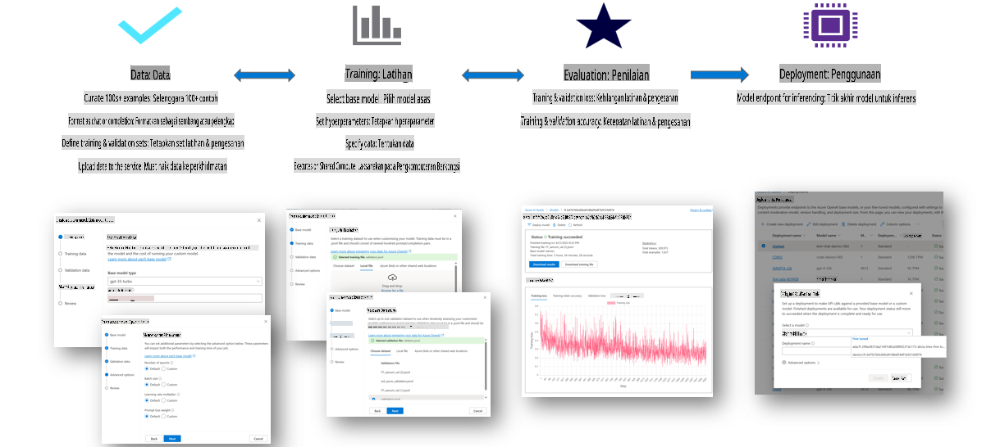

### Membuat Projek Baru

1. Log masuk ke [Azure AI Foundry](https://ai.azure.com).

1. Pilih **+New project** untuk membuat projek baru dalam Azure AI Foundry.

    

1. Lakukan tugas berikut:

    - Nama **Hub projek**. Ia mesti merupakan nilai unik.
    - Pilih **Hub** yang ingin digunakan (buat yang baru jika diperlukan).

    

1. Lakukan tugas berikut untuk membuat hub baru:

    - Masukkan **Nama Hub**. Ia mesti merupakan nilai unik.
    - Pilih **Langganan Azure** anda.
    - Pilih **Kumpulan sumber** yang ingin digunakan (buat yang baru jika diperlukan).
    - Pilih **Lokasi** yang anda inginkan.
    - Pilih **Sambungkan Perkhidmatan Azure AI** yang ingin digunakan (buat yang baru jika diperlukan).
    - Pilih **Sambungkan Carian Azure AI** kepada **Langkau sambungan**.

    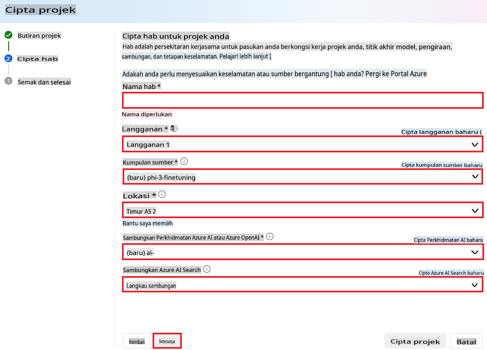

1. Pilih **Next**.
1. Pilih **Create a project**.

### Penyediaan Data

Sebelum melaras, kumpulkan atau buat dataset yang relevan dengan tugas anda, seperti arahan sembang, pasangan soal-jawab, atau teks lain yang berkaitan. Bersihkan dan pra-proses data ini dengan menghapuskan data yang tidak diperlukan, menangani nilai yang hilang, dan men-tokenkan teks.

### Melaras Model Phi-3 dalam Azure AI Foundry

> [!NOTE]
> Melaras model Phi-3 kini disokong dalam projek yang terletak di East US 2.

1. Pilih **Model catalog** dari tab sisi kiri.

1. Taip *phi-3* dalam **bar carian** dan pilih model phi-3 yang ingin digunakan.

    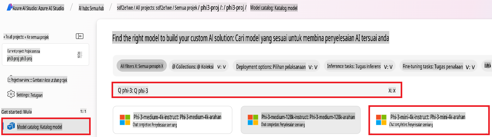

1. Pilih **Fine-tune**.

    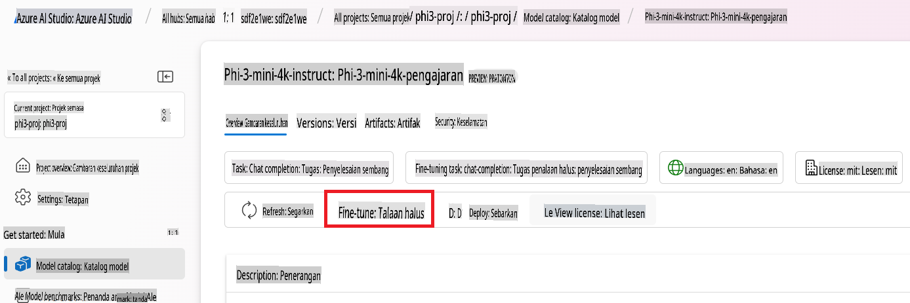

1. Masukkan **Nama model yang dilaras**.

    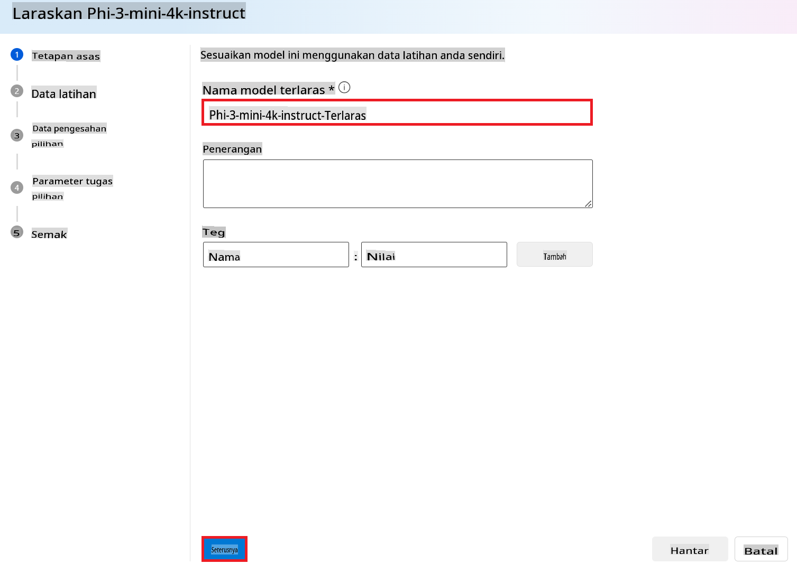

1. Pilih **Next**.

1. Lakukan tugas berikut:

    - Pilih **jenis tugas** kepada **Chat completion**.
    - Pilih **Data latihan** yang ingin digunakan. Anda boleh memuat naiknya melalui data Azure AI Foundry atau dari persekitaran tempatan anda.

    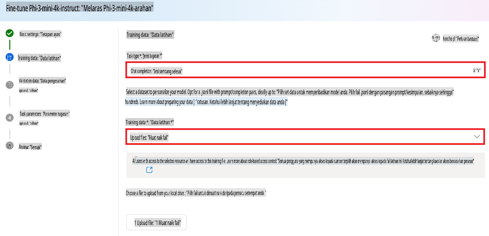

1. Pilih **Next**.

1. Muat naik **Data validasi** yang ingin digunakan, atau anda boleh memilih **Pembahagian automatik data latihan**.

    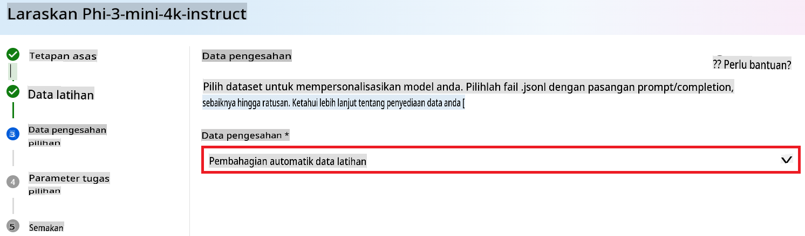

1. Pilih **Next**.

1. Lakukan tugas berikut:

    - Pilih **Pengganda saiz batch** yang ingin digunakan.
    - Pilih **Kadar pembelajaran** yang ingin digunakan.
    - Pilih **Bilangan epoch** yang ingin digunakan.

    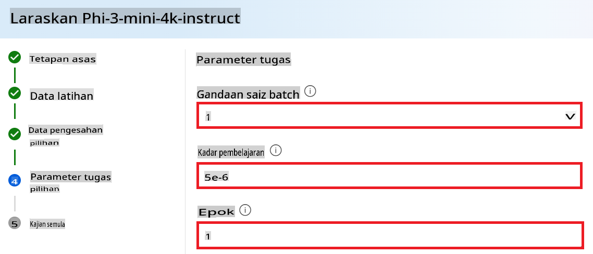

1. Pilih **Submit** untuk memulakan proses melaras.

    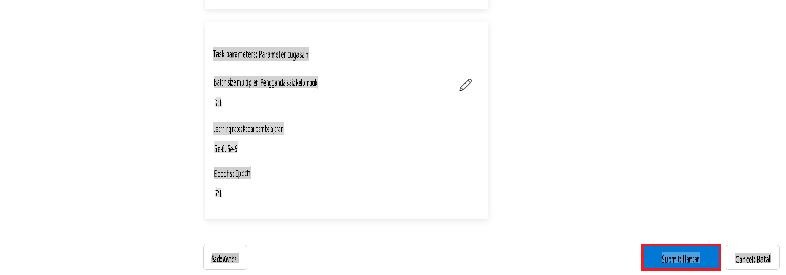

1. Setelah model anda dilaras, status akan dipaparkan sebagai **Completed**, seperti yang ditunjukkan dalam gambar di bawah. Kini anda boleh menerapkan model tersebut dan menggunakannya dalam aplikasi anda sendiri, dalam playground, atau dalam prompt flow. Untuk maklumat lanjut, lihat [Cara menerapkan model keluarga Phi-3 kecil dengan Azure AI Foundry](https://learn.microsoft.com/azure/ai-studio/how-to/deploy-models-phi-3?tabs=phi-3-5&pivots=programming-language-python).

    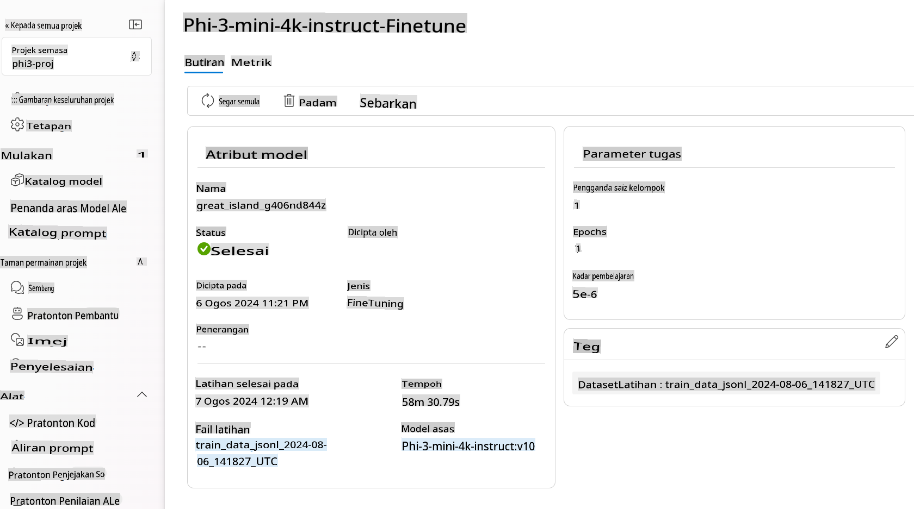

> [!NOTE]
> Untuk maklumat lebih lanjut mengenai melaras Phi-3, sila lawati [Melaras model Phi-3 dalam Azure AI Foundry](https://learn.microsoft.com/azure/ai-studio/how-to/fine-tune-phi-3?tabs=phi-3-mini).

## Membersihkan Model yang Dilaras

Anda boleh memadam model yang dilaras dari senarai model larasan dalam [Azure AI Foundry](https://ai.azure.com) atau dari halaman butiran model. Pilih model yang dilaras untuk dipadam dari halaman Larasan, kemudian pilih butang Padam untuk memadam model tersebut.

> [!NOTE]
> Anda tidak boleh memadam model tersuai jika ia mempunyai penerapan sedia ada. Anda mesti memadam penerapan model anda sebelum boleh memadam model tersuai.

## Kos dan Kuota

### Pertimbangan Kos dan Kuota untuk Model Phi-3 yang Dilaras sebagai Perkhidmatan

Model Phi yang dilaras sebagai perkhidmatan ditawarkan oleh Microsoft dan diintegrasikan dengan Azure AI Foundry untuk digunakan. Anda boleh menemui harga ketika [menerapkan](https://learn.microsoft.com/azure/ai-studio/how-to/deploy-models-phi-3?tabs=phi-3-5&pivots=programming-language-python) atau melaras model di bawah tab Harga dan syarat dalam wizard penerapan.

## Penapisan Kandungan

Model yang diterapkan sebagai perkhidmatan dengan model bayar-sambil-guna dilindungi oleh Azure AI Content Safety. Apabila diterapkan ke titik akhir masa nyata, anda boleh memilih untuk tidak menggunakan ciri ini. Dengan Azure AI content safety diaktifkan, kedua-dua prompt dan completion melalui gabungan model klasifikasi yang bertujuan untuk mengesan dan mencegah keluaran kandungan berbahaya. Sistem penapisan kandungan mengesan dan mengambil tindakan terhadap kategori tertentu kandungan yang berpotensi berbahaya dalam kedua-dua prompt input dan completion output. Ketahui lebih lanjut tentang [Azure AI Content Safety](https://learn.microsoft.com/azure/ai-studio/concepts/content-filtering).

**Konfigurasi Melaras**

Hiperparameter: Tetapkan hiperparameter seperti kadar pembelajaran, saiz batch, dan bilangan epoch latihan.

**Fungsi Kehilangan**

Pilih fungsi kehilangan yang sesuai untuk tugas anda (contohnya, cross-entropy).

**Pengoptimum**

Pilih pengoptimum (contohnya, Adam) untuk kemas kini kecerunan semasa latihan.

**Proses Melaras**

- Muatkan Model Pra-Latih: Muatkan checkpoint Phi-3 Mini.
- Tambah Lapisan Tersuai: Tambah lapisan khusus tugas (contohnya, kepala klasifikasi untuk arahan sembang).

**Latih Model**
Laraskan model menggunakan dataset yang telah disediakan. Pantau kemajuan latihan dan laraskan hiperparameter jika diperlukan.

**Penilaian dan Validasi**

Set Validasi: Bahagikan data anda kepada set latihan dan validasi.

**Nilai Prestasi**

Gunakan metrik seperti ketepatan, F1-score, atau perplexity untuk menilai prestasi model.

## Simpan Model yang Dilaras

**Checkpoint**
Simpan checkpoint model yang dilaras untuk kegunaan masa depan.

## Penerapan

- Terapkan sebagai Perkhidmatan Web: Terapkan model yang dilaras sebagai perkhidmatan web dalam Azure AI Foundry.
- Uji Titik Akhir: Hantar pertanyaan ujian ke titik akhir yang diterapkan untuk mengesahkan fungsinya.

## Iterasi dan Penambahbaikan

Iterasi: Jika prestasi tidak memuaskan, ulangi dengan melaraskan hiperparameter, menambah lebih banyak data, atau melaras untuk lebih banyak epoch.

## Pantau dan Perbaiki

Pantau secara berterusan tingkah laku model dan perbaiki jika diperlukan.

## Sesuaikan dan Kembangkan

Tugas Tersuai: Phi-3 Mini boleh dilaras untuk pelbagai tugas selain arahan sembang. Terokai kes penggunaan lain!
Eksperimen: Cuba pelbagai seni bina, kombinasi lapisan, dan teknik untuk meningkatkan prestasi.

> [!NOTE]
> Melaras adalah proses iteratif. Bereksperimen, belajar, dan sesuaikan model anda untuk mencapai hasil terbaik bagi tugas tertentu anda!

**Penafian**:  
Dokumen ini telah diterjemahkan menggunakan perkhidmatan terjemahan AI berasaskan mesin. Walaupun kami berusaha untuk ketepatan, sila ambil maklum bahawa terjemahan automatik mungkin mengandungi kesilapan atau ketidaktepatan. Dokumen asal dalam bahasa asalnya harus dianggap sebagai sumber yang berwibawa. Untuk maklumat penting, terjemahan manusia profesional adalah disyorkan. Kami tidak bertanggungjawab atas sebarang salah faham atau salah tafsir yang timbul daripada penggunaan terjemahan ini.