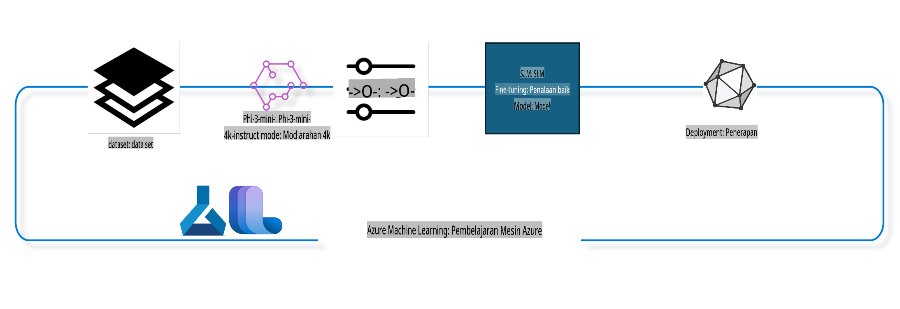

## Cara menggunakan komponen chat-completion dari sistem registry Azure ML untuk fine-tune model

Dalam contoh ini, kita akan melakukan fine-tuning pada model Phi-3-mini-4k-instruct untuk menyelesaikan percakapan antara 2 orang menggunakan dataset ultrachat_200k.



Contoh ini akan menunjukkan cara melakukan fine-tuning menggunakan Azure ML SDK dan Python, kemudian mendistribusikan model yang sudah di-fine-tune ke endpoint online untuk inferensi waktu nyata.

### Data pelatihan

Kita akan menggunakan dataset ultrachat_200k. Ini adalah versi yang sangat difilter dari dataset UltraChat dan digunakan untuk melatih Zephyr-7B-β, model chat canggih dengan 7 miliar parameter.

### Model

Kita akan menggunakan model Phi-3-mini-4k-instruct untuk menunjukkan bagaimana pengguna dapat melakukan fine-tuning model untuk tugas chat-completion. Jika Anda membuka notebook ini dari model tertentu, pastikan untuk mengganti nama model yang sesuai.

### Tugas

- Memilih model untuk fine-tune.
- Memilih dan mengeksplorasi data pelatihan.
- Mengonfigurasi pekerjaan fine-tuning.
- Menjalankan pekerjaan fine-tuning.
- Meninjau metrik pelatihan dan evaluasi.
- Mendaftarkan model yang sudah di-fine-tune.
- Mendistribusikan model yang sudah di-fine-tune untuk inferensi waktu nyata.
- Membersihkan sumber daya.

## 1. Persiapan awal

- Menginstal dependensi.
- Terhubung ke AzureML Workspace. Pelajari lebih lanjut di set up SDK authentication. Ganti <WORKSPACE_NAME>, <RESOURCE_GROUP>, dan <SUBSCRIPTION_ID> di bawah ini.
- Terhubung ke sistem registry AzureML.
- Menetapkan nama eksperimen opsional.
- Memeriksa atau membuat compute.

> [!NOTE]
> Persyaratan: sebuah node GPU tunggal dapat memiliki beberapa kartu GPU. Misalnya, dalam satu node Standard_NC24rs_v3 terdapat 4 GPU NVIDIA V100, sementara dalam Standard_NC12s_v3 terdapat 2 GPU NVIDIA V100. Lihat dokumentasi untuk informasi ini. Jumlah kartu GPU per node diatur dalam parameter `gpus_per_node` di bawah ini. Menyetel nilai ini dengan benar akan memastikan pemanfaatan semua GPU dalam node. SKU GPU compute yang direkomendasikan dapat ditemukan di sini dan di sini.

### Pustaka Python

Instal dependensi dengan menjalankan sel di bawah ini. Langkah ini tidak opsional jika Anda menjalankan di lingkungan baru.

```bash
pip install azure-ai-ml
pip install azure-identity
pip install datasets==2.9.0
pip install mlflow
pip install azureml-mlflow
```

### Berinteraksi dengan Azure ML

1. Skrip Python ini digunakan untuk berinteraksi dengan layanan Azure Machine Learning (Azure ML). Berikut adalah rincian apa yang dilakukan:

    - Mengimpor modul yang diperlukan dari paket `azure.ai.ml`, `azure.identity`, dan `azure.ai.ml.entities`. Juga mengimpor modul `time`.

    - Mencoba autentikasi menggunakan `DefaultAzureCredential()`, yang menyediakan pengalaman autentikasi sederhana untuk memulai pengembangan aplikasi di cloud Azure. Jika gagal, akan beralih ke `InteractiveBrowserCredential()`, yang menyediakan prompt login interaktif.

    - Mencoba membuat instance `MLClient` menggunakan metode `from_config`, yang membaca konfigurasi dari file config default (config.json). Jika gagal, membuat instance `MLClient` dengan secara manual memberikan `subscription_id`, `resource_group_name`, dan `workspace_name`.

    - Membuat instance `MLClient` lain, kali ini untuk registry Azure ML bernama "azureml". Registry ini adalah tempat model, pipeline fine-tuning, dan lingkungan disimpan.

    - Menetapkan `experiment_name` menjadi "chat_completion_Phi-3-mini-4k-instruct".

    - Menghasilkan timestamp unik dengan mengonversi waktu saat ini (dalam detik sejak epoch, sebagai angka floating point) ke integer, lalu menjadi string. Timestamp ini dapat digunakan untuk membuat nama dan versi unik.

    ```python
    # Import necessary modules from Azure ML and Azure Identity
    from azure.ai.ml import MLClient
    from azure.identity import (
        DefaultAzureCredential,
        InteractiveBrowserCredential,
    )
    from azure.ai.ml.entities import AmlCompute
    import time  # Import time module
    
    # Try to authenticate using DefaultAzureCredential
    try:
        credential = DefaultAzureCredential()
        credential.get_token("https://management.azure.com/.default")
    except Exception as ex:  # If DefaultAzureCredential fails, use InteractiveBrowserCredential
        credential = InteractiveBrowserCredential()
    
    # Try to create an MLClient instance using the default config file
    try:
        workspace_ml_client = MLClient.from_config(credential=credential)
    except:  # If that fails, create an MLClient instance by manually providing the details
        workspace_ml_client = MLClient(
            credential,
            subscription_id="<SUBSCRIPTION_ID>",
            resource_group_name="<RESOURCE_GROUP>",
            workspace_name="<WORKSPACE_NAME>",
        )
    
    # Create another MLClient instance for the Azure ML registry named "azureml"
    # This registry is where models, fine-tuning pipelines, and environments are stored
    registry_ml_client = MLClient(credential, registry_name="azureml")
    
    # Set the experiment name
    experiment_name = "chat_completion_Phi-3-mini-4k-instruct"
    
    # Generate a unique timestamp that can be used for names and versions that need to be unique
    timestamp = str(int(time.time()))
    ```

## 2. Memilih model dasar untuk fine-tune

1. Phi-3-mini-4k-instruct adalah model ringan dengan 3.8 miliar parameter, model canggih yang dibangun berdasarkan dataset yang digunakan untuk Phi-2. Model ini termasuk dalam keluarga model Phi-3, dan versi Mini hadir dalam dua varian: 4K dan 128K, yang merupakan panjang konteks (dalam token) yang dapat didukung. Kita perlu melakukan fine-tuning pada model ini untuk tujuan spesifik kita. Anda dapat menjelajahi model ini di Katalog Model di AzureML Studio dengan memfilter berdasarkan tugas chat-completion. Dalam contoh ini, kita menggunakan model Phi-3-mini-4k-instruct. Jika Anda membuka notebook ini untuk model yang berbeda, gantilah nama model dan versinya sesuai kebutuhan.

    > [!NOTE]
    > Properti `model id` dari model ini akan diteruskan sebagai input ke pekerjaan fine-tuning. Properti ini juga tersedia sebagai bidang Asset ID di halaman detail model di AzureML Studio Model Catalog.

2. Skrip Python ini berinteraksi dengan layanan Azure Machine Learning (Azure ML). Berikut adalah rincian apa yang dilakukan:

    - Menetapkan `model_name` menjadi "Phi-3-mini-4k-instruct".

    - Menggunakan metode `get` dari properti `models` pada objek `registry_ml_client` untuk mengambil versi terbaru dari model dengan nama yang ditentukan dari registry Azure ML. Metode `get` dipanggil dengan dua argumen: nama model dan label yang menentukan bahwa versi terbaru dari model harus diambil.

    - Mencetak pesan ke konsol yang menunjukkan nama, versi, dan id dari model yang akan digunakan untuk fine-tuning. Metode `format` dari string digunakan untuk memasukkan nama, versi, dan id model ke dalam pesan. Nama, versi, dan id model diakses sebagai properti dari objek `foundation_model`.

    ```python
    # Set the model name
    model_name = "Phi-3-mini-4k-instruct"
    
    # Get the latest version of the model from the Azure ML registry
    foundation_model = registry_ml_client.models.get(model_name, label="latest")
    
    # Print the model name, version, and id
    # This information is useful for tracking and debugging
    print(
        "\n\nUsing model name: {0}, version: {1}, id: {2} for fine tuning".format(
            foundation_model.name, foundation_model.version, foundation_model.id
        )
    )
    ```

## 3. Membuat compute untuk digunakan dengan pekerjaan

Pekerjaan fine-tuning HANYA bekerja dengan compute GPU. Ukuran compute tergantung pada seberapa besar modelnya, dan dalam banyak kasus, cukup sulit untuk mengidentifikasi compute yang tepat untuk pekerjaan ini. Di sel ini, kami membimbing pengguna untuk memilih compute yang tepat.

> [!NOTE]
> Compute yang terdaftar di bawah ini bekerja dengan konfigurasi yang paling dioptimalkan. Perubahan pada konfigurasi dapat menyebabkan error Cuda Out Of Memory. Dalam kasus seperti itu, coba tingkatkan compute ke ukuran yang lebih besar.

> [!NOTE]
> Saat memilih `compute_cluster_size` di bawah ini, pastikan compute tersedia di grup sumber daya Anda. Jika compute tertentu tidak tersedia, Anda dapat mengajukan permintaan untuk mendapatkan akses ke sumber daya compute.

### Memeriksa Model untuk Dukungan Fine Tuning

1. Skrip Python ini berinteraksi dengan model Azure Machine Learning (Azure ML). Berikut adalah rincian apa yang dilakukan:

    - Mengimpor modul `ast`, yang menyediakan fungsi untuk memproses pohon tata bahasa sintaks abstrak Python.

    - Memeriksa apakah objek `foundation_model` (yang mewakili model di Azure ML) memiliki tag bernama `finetune_compute_allow_list`. Tag di Azure ML adalah pasangan kunci-nilai yang dapat Anda buat dan gunakan untuk memfilter serta menyortir model.

    - Jika tag `finetune_compute_allow_list` ada, menggunakan fungsi `ast.literal_eval` untuk dengan aman menguraikan nilai tag (string) menjadi daftar Python. Daftar ini kemudian ditetapkan ke variabel `computes_allow_list`. Kemudian mencetak pesan yang menunjukkan bahwa compute harus dibuat dari daftar tersebut.

    - Jika tag `finetune_compute_allow_list` tidak ada, menetapkan `computes_allow_list` menjadi None dan mencetak pesan yang menunjukkan bahwa tag `finetune_compute_allow_list` bukan bagian dari tag model.

    - Singkatnya, skrip ini memeriksa tag tertentu di metadata model, mengonversi nilai tag menjadi daftar jika ada, dan memberikan umpan balik kepada pengguna sesuai kebutuhan.

    ```python
    # Import the ast module, which provides functions to process trees of the Python abstract syntax grammar
    import ast
    
    # Check if the 'finetune_compute_allow_list' tag is present in the model's tags
    if "finetune_compute_allow_list" in foundation_model.tags:
        # If the tag is present, use ast.literal_eval to safely parse the tag's value (a string) into a Python list
        computes_allow_list = ast.literal_eval(
            foundation_model.tags["finetune_compute_allow_list"]
        )  # convert string to python list
        # Print a message indicating that a compute should be created from the list
        print(f"Please create a compute from the above list - {computes_allow_list}")
    else:
        # If the tag is not present, set computes_allow_list to None
        computes_allow_list = None
        # Print a message indicating that the 'finetune_compute_allow_list' tag is not part of the model's tags
        print("`finetune_compute_allow_list` is not part of model tags")
    ```

### Memeriksa Compute Instance

1. Skrip Python ini berinteraksi dengan layanan Azure Machine Learning (Azure ML) dan melakukan beberapa pemeriksaan pada instance compute. Berikut adalah rincian apa yang dilakukan:

    - Mencoba mengambil instance compute dengan nama yang disimpan dalam `compute_cluster` dari workspace Azure ML. Jika state provisioning instance compute adalah "failed", maka akan memunculkan `ValueError`.

    - Memeriksa apakah `computes_allow_list` tidak None. Jika tidak, mengonversi semua ukuran compute dalam daftar menjadi huruf kecil dan memeriksa apakah ukuran instance compute saat ini ada dalam daftar. Jika tidak, memunculkan `ValueError`.

    - Jika `computes_allow_list` adalah None, memeriksa apakah ukuran instance compute ada dalam daftar ukuran VM GPU yang tidak didukung. Jika ada, memunculkan `ValueError`.

    - Mengambil daftar semua ukuran compute yang tersedia di workspace. Kemudian iterasi melalui daftar ini, dan untuk setiap ukuran compute, memeriksa apakah namanya cocok dengan ukuran instance compute saat ini. Jika cocok, mengambil jumlah GPU untuk ukuran compute tersebut dan menetapkan `gpu_count_found` menjadi True.

    - Jika `gpu_count_found` adalah True, mencetak jumlah GPU dalam instance compute. Jika `gpu_count_found` adalah False, memunculkan `ValueError`.

    - Singkatnya, skrip ini melakukan beberapa pemeriksaan pada instance compute di workspace Azure ML, termasuk memeriksa state provisioning, ukurannya terhadap daftar yang diperbolehkan atau dilarang, dan jumlah GPU yang dimilikinya.

    ```python
    # Print the exception message
    print(e)
    # Raise a ValueError if the compute size is not available in the workspace
    raise ValueError(
        f"WARNING! Compute size {compute_cluster_size} not available in workspace"
    )
    
    # Retrieve the compute instance from the Azure ML workspace
    compute = workspace_ml_client.compute.get(compute_cluster)
    # Check if the provisioning state of the compute instance is "failed"
    if compute.provisioning_state.lower() == "failed":
        # Raise a ValueError if the provisioning state is "failed"
        raise ValueError(
            f"Provisioning failed, Compute '{compute_cluster}' is in failed state. "
            f"please try creating a different compute"
        )
    
    # Check if computes_allow_list is not None
    if computes_allow_list is not None:
        # Convert all compute sizes in computes_allow_list to lowercase
        computes_allow_list_lower_case = [x.lower() for x in computes_allow_list]
        # Check if the size of the compute instance is in computes_allow_list_lower_case
        if compute.size.lower() not in computes_allow_list_lower_case:
            # Raise a ValueError if the size of the compute instance is not in computes_allow_list_lower_case
            raise ValueError(
                f"VM size {compute.size} is not in the allow-listed computes for finetuning"
            )
    else:
        # Define a list of unsupported GPU VM sizes
        unsupported_gpu_vm_list = [
            "standard_nc6",
            "standard_nc12",
            "standard_nc24",
            "standard_nc24r",
        ]
        # Check if the size of the compute instance is in unsupported_gpu_vm_list
        if compute.size.lower() in unsupported_gpu_vm_list:
            # Raise a ValueError if the size of the compute instance is in unsupported_gpu_vm_list
            raise ValueError(
                f"VM size {compute.size} is currently not supported for finetuning"
            )
    
    # Initialize a flag to check if the number of GPUs in the compute instance has been found
    gpu_count_found = False
    # Retrieve a list of all available compute sizes in the workspace
    workspace_compute_sku_list = workspace_ml_client.compute.list_sizes()
    available_sku_sizes = []
    # Iterate over the list of available compute sizes
    for compute_sku in workspace_compute_sku_list:
        available_sku_sizes.append(compute_sku.name)
        # Check if the name of the compute size matches the size of the compute instance
        if compute_sku.name.lower() == compute.size.lower():
            # If it does, retrieve the number of GPUs for that compute size and set gpu_count_found to True
            gpus_per_node = compute_sku.gpus
            gpu_count_found = True
    # If gpu_count_found is True, print the number of GPUs in the compute instance
    if gpu_count_found:
        print(f"Number of GPU's in compute {compute.size}: {gpus_per_node}")
    else:
        # If gpu_count_found is False, raise a ValueError
        raise ValueError(
            f"Number of GPU's in compute {compute.size} not found. Available skus are: {available_sku_sizes}."
            f"This should not happen. Please check the selected compute cluster: {compute_cluster} and try again."
        )
    ```

## 4. Memilih dataset untuk fine-tuning model

1. Kita menggunakan dataset ultrachat_200k. Dataset ini memiliki empat bagian, cocok untuk Supervised fine-tuning (sft). Generation ranking (gen). Jumlah contoh per bagian ditunjukkan sebagai berikut:

    ```bash
    train_sft test_sft  train_gen  test_gen
    207865  23110  256032  28304
    ```

1. Selanjutnya, beberapa sel akan menunjukkan persiapan data dasar untuk fine-tuning:

### Visualisasi beberapa baris data

Kita ingin contoh ini berjalan dengan cepat, jadi simpan file `train_sft` dan `test_sft` yang hanya berisi 5% dari baris yang sudah dipangkas. Artinya, model yang sudah di-fine-tune akan memiliki akurasi yang lebih rendah, sehingga tidak boleh digunakan untuk aplikasi dunia nyata. Skrip `download-dataset.py` digunakan untuk mengunduh dataset ultrachat_200k dan mengubah dataset menjadi format yang dapat dikonsumsi oleh komponen pipeline fine-tune. Karena datasetnya besar, maka kita hanya menggunakan sebagian dataset.

1. Menjalankan skrip di bawah ini hanya akan mengunduh 5% dari data. Persentase ini dapat ditingkatkan dengan mengubah parameter `dataset_split_pc` ke persentase yang diinginkan.

    > [!NOTE]
    > Beberapa model bahasa memiliki kode bahasa yang berbeda, sehingga nama kolom dalam dataset harus mencerminkan hal ini.

1. Berikut adalah contoh bagaimana data seharusnya terlihat:
Dataset chat-completion disimpan dalam format parquet dengan setiap entri menggunakan skema berikut:

    - Ini adalah dokumen JSON (JavaScript Object Notation), format pertukaran data yang populer. Ini bukan kode yang dapat dieksekusi, tetapi cara untuk menyimpan dan mentransfer data. Berikut adalah rincian strukturnya:

    - "prompt": Kunci ini berisi nilai string yang mewakili tugas atau pertanyaan yang diajukan kepada asisten AI.

    - "messages": Kunci ini berisi array objek. Setiap objek mewakili pesan dalam percakapan antara pengguna dan asisten AI. Setiap objek pesan memiliki dua kunci:

    - "content": Kunci ini berisi nilai string yang mewakili isi pesan.
    - "role": Kunci ini berisi nilai string yang mewakili peran entitas yang mengirim pesan. Bisa "user" atau "assistant".
    - "prompt_id": Kunci ini berisi nilai string yang mewakili pengenal unik untuk prompt.

1. Dalam dokumen JSON khusus ini, percakapan direpresentasikan di mana seorang pengguna meminta asisten AI untuk membuat protagonis untuk cerita distopia. Asisten merespons, dan pengguna kemudian meminta lebih banyak detail. Asisten setuju untuk memberikan lebih banyak detail. Seluruh percakapan dikaitkan dengan ID prompt tertentu.

    ```python
    {
        // The task or question posed to an AI assistant
        "prompt": "Create a fully-developed protagonist who is challenged to survive within a dystopian society under the rule of a tyrant. ...",
        
        // An array of objects, each representing a message in a conversation between a user and an AI assistant
        "messages":[
            {
                // The content of the user's message
                "content": "Create a fully-developed protagonist who is challenged to survive within a dystopian society under the rule of a tyrant. ...",
                // The role of the entity that sent the message
                "role": "user"
            },
            {
                // The content of the assistant's message
                "content": "Name: Ava\n\n Ava was just 16 years old when the world as she knew it came crashing down. The government had collapsed, leaving behind a chaotic and lawless society. ...",
                // The role of the entity that sent the message
                "role": "assistant"
            },
            {
                // The content of the user's message
                "content": "Wow, Ava's story is so intense and inspiring! Can you provide me with more details.  ...",
                // The role of the entity that sent the message
                "role": "user"
            }, 
            {
                // The content of the assistant's message
                "content": "Certainly! ....",
                // The role of the entity that sent the message
                "role": "assistant"
            }
        ],
        
        // A unique identifier for the prompt
        "prompt_id": "d938b65dfe31f05f80eb8572964c6673eddbd68eff3db6bd234d7f1e3b86c2af"
    }
    ```

### Mengunduh Data

1. Skrip Python ini digunakan untuk mengunduh dataset menggunakan skrip pembantu bernama `download-dataset.py`. Berikut adalah rincian apa yang dilakukan:

    - Mengimpor modul `os`, yang menyediakan cara portabel untuk menggunakan fungsi yang bergantung pada sistem operasi.

    - Menggunakan fungsi `os.system` untuk menjalankan skrip `download-dataset.py` di shell dengan argumen baris perintah tertentu. Argumen tersebut menentukan dataset yang akan diunduh (`HuggingFaceH4/ultrachat_200k`), direktori tempat dataset diunduh (`ultrachat_200k_dataset`), dan persentase dataset untuk dibagi (5). Fungsi `os.system` mengembalikan status keluar dari perintah yang dieksekusi; status ini disimpan dalam variabel `exit_status`.

    - Memeriksa apakah `exit_status` tidak sama dengan 0. Dalam sistem operasi seperti Unix, status keluar 0 biasanya menunjukkan bahwa perintah berhasil, sedangkan angka lainnya menunjukkan kesalahan. Jika `exit_status` tidak sama dengan 0, memunculkan Exception dengan pesan yang menunjukkan bahwa ada kesalahan saat mengunduh dataset.

    - Singkatnya, skrip ini menjalankan perintah untuk mengunduh dataset menggunakan skrip pembantu, dan memunculkan pengecualian jika perintah gagal.

    ```python
    # Import the os module, which provides a way of using operating system dependent functionality
    import os
    
    # Use the os.system function to run the download-dataset.py script in the shell with specific command-line arguments
    # The arguments specify the dataset to download (HuggingFaceH4/ultrachat_200k), the directory to download it to (ultrachat_200k_dataset), and the percentage of the dataset to split (5)
    # The os.system function returns the exit status of the command it executed; this status is stored in the exit_status variable
    exit_status = os.system(
        "python ./download-dataset.py --dataset HuggingFaceH4/ultrachat_200k --download_dir ultrachat_200k_dataset --dataset_split_pc 5"
    )
    
    # Check if exit_status is not 0
    # In Unix-like operating systems, an exit status of 0 usually indicates that a command has succeeded, while any other number indicates an error
    # If exit_status is not 0, raise an Exception with a message indicating that there was an error downloading the dataset
    if exit_status != 0:
        raise Exception("Error downloading dataset")
    ```

### Memuat Data ke dalam DataFrame

1. Skrip Python ini memuat file JSON Lines ke dalam DataFrame pandas dan menampilkan 5 baris pertama. Berikut adalah rincian apa yang dilakukan:

    - Mengimpor pustaka `pandas`, pustaka yang kuat untuk manipulasi dan analisis data.

    - Menyetel lebar kolom maksimum untuk opsi tampilan pandas ke 0. Ini berarti teks lengkap dari setiap kolom akan ditampilkan tanpa pemotongan saat DataFrame dicetak.

    - Menggunakan fungsi `pd.read_json` untuk memuat file `train_sft.jsonl` dari direktori `ultrachat_200k_dataset` ke dalam DataFrame. Argumen `lines=True` menunjukkan bahwa file tersebut dalam format JSON Lines, di mana setiap baris adalah objek JSON terpisah.

    - Menggunakan metode `head` untuk menampilkan 5 baris pertama dari DataFrame. Jika DataFrame memiliki kurang dari 5 baris, maka akan menampilkan semuanya.

    - Singkatnya, skrip ini memuat file JSON Lines ke dalam DataFrame dan menampilkan 5 baris pertama dengan teks kolom lengkap.

    ```python
    # Import the pandas library, which is a powerful data manipulation and analysis library
    import pandas as pd
    
    # Set the maximum column width for pandas' display options to 0
    # This means that the full text of each column will be displayed without truncation when the DataFrame is printed
    pd.set_option("display.max_colwidth", 0)
    
    # Use the pd.read_json function to load the train_sft.jsonl file from the ultrachat_200k_dataset directory into a DataFrame
    # The lines=True argument indicates that the file is in JSON Lines format, where each line is a separate JSON object
    df = pd.read_json("./ultrachat_200k_dataset/train_sft.jsonl", lines=True)
    
    # Use the head method to display the first 5 rows of the DataFrame
    # If the DataFrame has less than 5 rows, it will display all of them
    df.head()
    ```

## 5. Mengirimkan pekerjaan fine-tuning menggunakan model dan data sebagai input

Buat pekerjaan yang menggunakan komponen pipeline chat-completion. Pelajari lebih lanjut tentang semua parameter yang didukung untuk fine-tuning.

### Mendefinisikan parameter fine-tuning

1. Parameter fine-tuning dapat dikelompokkan ke dalam 2 kategori: parameter pelatihan dan parameter optimasi.

1. Parameter pelatihan mendefinisikan aspek pelatihan seperti:

    - Optimizer, scheduler yang digunakan.
    - Metrik untuk mengoptimalkan fine-tuning.
    - Jumlah langkah pelatihan, ukuran batch, dan sebagainya.

1. Parameter optimasi membantu dalam mengoptimalkan memori GPU dan menggunakan sumber daya compute secara efektif.

    - Mengaktifkan deepspeed dan LoRA.
    - Mengaktifkan pelatihan presisi campuran.
    - Mengaktifkan pelatihan multi-node.

> [!NOTE]
> Fine-tuning terawasi dapat menyebabkan kehilangan alignment atau lupa secara drastis. Kami merekomendasikan untuk memeriksa masalah ini dan menjalankan tahap alignment setelah Anda melakukan fine-tuning.

### Parameter Fine-Tuning

1. Skrip Python ini menyetel parameter untuk fine-tuning model machine learning. Berikut adalah rincian apa yang dilakukan:

    - Menyetel parameter pelatihan default seperti jumlah epoch pelatihan, ukuran batch untuk pelatihan dan evaluasi, learning rate, dan tipe scheduler learning rate.

    - Menyetel parameter optimasi default seperti apakah akan menerapkan Layer-wise Relevance Propagation (LoRa) dan DeepSpeed, serta tahap DeepSpeed.

    - Menggabungkan parameter pelatihan dan optimasi ke dalam satu dictionary yang disebut `finetune_parameters`.

    - Memeriksa apakah `foundation_model` memiliki parameter default spesifik model. Jika iya, mencetak pesan peringatan dan memperbarui dictionary `finetune_parameters` dengan default spesifik model ini. Fungsi `ast.literal_eval` digunakan untuk mengonversi default spesifik model dari string ke dictionary Python.

    - Mencetak set parameter fine-tuning akhir yang akan digunakan untuk menjalankan.

    - Singkatnya, skrip ini menyetel dan menampilkan parameter untuk fine-tuning model machine learning, dengan kemampuan untuk menimpa parameter default dengan parameter spesifik model.

    ```python
    # Set up default training parameters such as the number of training epochs, batch sizes for training and evaluation, learning rate, and learning rate scheduler type
    training_parameters = dict(
        num_train_epochs=3,
        per_device_train_batch_size=1,
        per_device_eval_batch_size=1,
        learning_rate=5e-6,
        lr_scheduler_type="cosine",
    )
    
    # Set up default optimization parameters such as whether to apply Layer-wise Relevance Propagation (LoRa) and DeepSpeed, and the DeepSpeed stage
    optimization_parameters = dict(
        apply_lora="true",
        apply_deepspeed="true",
        deepspeed_stage=2,
    )
    
    # Combine the training and optimization parameters into a single dictionary called finetune_parameters
    finetune_parameters = {**training_parameters, **optimization_parameters}
    
    # Check if the foundation_model has any model-specific default parameters
    # If it does, print a warning message and update the finetune_parameters dictionary with these model-specific defaults
    # The ast.literal_eval function is used to convert the model-specific defaults from a string to a Python dictionary
    if "model_specific_defaults" in foundation_model.tags:
        print("Warning! Model specific defaults exist. The defaults could be overridden.")
        finetune_parameters.update(
            ast.literal_eval(  # convert string to python dict
                foundation_model.tags["model_specific_defaults"]
            )
        )
    
    # Print the final set of fine-tuning parameters that will be used for the run
    print(
        f"The following finetune parameters are going to be set for the run: {finetune_parameters}"
    )
    ```

### Pipeline Pelatihan

1. Skrip Python ini mendefinisikan fungsi untuk menghasilkan nama tampilan untuk pipeline pelatihan machine learning, kemudian memanggil fungsi ini untuk menghasilkan dan mencetak nama tampilan. Berikut adalah rincian apa yang dilakukan:

    - Fungsi `get_pipeline_display_name` didefinisikan. Fungsi ini menghasilkan nama tampilan berdasarkan berbagai parameter terkait pipeline pelatihan.

    - Di dalam fungsi, menghitung total ukuran batch dengan mengalikan ukuran batch per perangkat, jumlah langkah akumulasi gradien, jumlah GPU per node, dan jumlah node yang digunakan untuk fine-tuning.

    - Mengambil berbagai parameter lainnya seperti tipe scheduler learning rate, apakah DeepSpeed diterapkan, tahap DeepSpeed, apakah Layer-wise Relevance Propagation (LoRa) diterapkan, batas jumlah checkpoint model yang disimpan, dan panjang urutan maksimum.

    - Mengonstruksi string yang mencakup semua parameter ini, dipisahkan oleh tanda hubung. Jika DeepSpeed atau LoRa diterapkan, string tersebut mencakup "ds" diikuti oleh tahap DeepSpeed, atau "lora". Jika tidak, mencakup "nods" atau "nolora".

    - Fungsi mengembalikan string ini, yang berfungsi sebagai nama tampilan untuk pipeline pelatihan.

    - Setelah fungsi didefinisikan, fungsi dipanggil untuk menghasilkan nama tampilan, yang kemudian dicetak.

    - Singkatnya, skrip ini menghasilkan nama tampilan untuk pipeline pelatihan machine learning.
### Konfigurasi Pipeline

Skrip Python ini mendefinisikan dan mengkonfigurasi pipeline pembelajaran mesin menggunakan Azure Machine Learning SDK. Berikut adalah penjelasan tentang apa yang dilakukan:

1. Mengimpor modul-modul yang diperlukan dari Azure AI ML SDK.
2. Mengambil komponen pipeline bernama "chat_completion_pipeline" dari registry.
3. Mendefinisikan pekerjaan pipeline menggunakan `@pipeline` decorator and the function `create_pipeline`. The name of the pipeline is set to `pipeline_display_name`.

1. Inside the `create_pipeline` function, it initializes the fetched pipeline component with various parameters, including the model path, compute clusters for different stages, dataset splits for training and testing, the number of GPUs to use for fine-tuning, and other fine-tuning parameters.

1. It maps the output of the fine-tuning job to the output of the pipeline job. This is done so that the fine-tuned model can be easily registered, which is required to deploy the model to an online or batch endpoint.

1. It creates an instance of the pipeline by calling the `create_pipeline` function.

1. It sets the `force_rerun` setting of the pipeline to `True`, meaning that cached results from previous jobs will not be used.

1. It sets the `continue_on_step_failure` setting of the pipeline to `False`, yang berarti pipeline akan berhenti jika ada langkah yang gagal.
4. Secara keseluruhan, skrip ini mendefinisikan dan mengkonfigurasi pipeline pembelajaran mesin untuk tugas penyelesaian chat menggunakan Azure Machine Learning SDK.

```python
    # Import necessary modules from the Azure AI ML SDK
    from azure.ai.ml.dsl import pipeline
    from azure.ai.ml import Input
    
    # Fetch the pipeline component named "chat_completion_pipeline" from the registry
    pipeline_component_func = registry_ml_client.components.get(
        name="chat_completion_pipeline", label="latest"
    )
    
    # Define the pipeline job using the @pipeline decorator and the function create_pipeline
    # The name of the pipeline is set to pipeline_display_name
    @pipeline(name=pipeline_display_name)
    def create_pipeline():
        # Initialize the fetched pipeline component with various parameters
        # These include the model path, compute clusters for different stages, dataset splits for training and testing, the number of GPUs to use for fine-tuning, and other fine-tuning parameters
        chat_completion_pipeline = pipeline_component_func(
            mlflow_model_path=foundation_model.id,
            compute_model_import=compute_cluster,
            compute_preprocess=compute_cluster,
            compute_finetune=compute_cluster,
            compute_model_evaluation=compute_cluster,
            # Map the dataset splits to parameters
            train_file_path=Input(
                type="uri_file", path="./ultrachat_200k_dataset/train_sft.jsonl"
            ),
            test_file_path=Input(
                type="uri_file", path="./ultrachat_200k_dataset/test_sft.jsonl"
            ),
            # Training settings
            number_of_gpu_to_use_finetuning=gpus_per_node,  # Set to the number of GPUs available in the compute
            **finetune_parameters
        )
        return {
            # Map the output of the fine tuning job to the output of pipeline job
            # This is done so that we can easily register the fine tuned model
            # Registering the model is required to deploy the model to an online or batch endpoint
            "trained_model": chat_completion_pipeline.outputs.mlflow_model_folder
        }
    
    # Create an instance of the pipeline by calling the create_pipeline function
    pipeline_object = create_pipeline()
    
    # Don't use cached results from previous jobs
    pipeline_object.settings.force_rerun = True
    
    # Set continue on step failure to False
    # This means that the pipeline will stop if any step fails
    pipeline_object.settings.continue_on_step_failure = False
    ```

### Kirimkan Pekerjaan

1. Skrip Python ini mengirimkan pekerjaan pipeline pembelajaran mesin ke workspace Azure Machine Learning dan menunggu hingga pekerjaan selesai. Berikut adalah penjelasannya:

   - Memanggil metode `create_or_update` dari objek `jobs` di `workspace_ml_client` untuk mengirimkan pekerjaan pipeline. Pipeline yang akan dijalankan ditentukan oleh `pipeline_object`, dan eksperimen tempat pekerjaan dijalankan ditentukan oleh `experiment_name`.
   - Kemudian memanggil metode `stream` dari objek `jobs` di `workspace_ml_client` untuk menunggu pekerjaan pipeline selesai. Pekerjaan yang ditunggu ditentukan oleh atribut `name` dari objek `pipeline_job`.
   - Secara keseluruhan, skrip ini mengirimkan pekerjaan pipeline pembelajaran mesin ke workspace Azure Machine Learning dan menunggu hingga pekerjaan selesai.

```python
    # Submit the pipeline job to the Azure Machine Learning workspace
    # The pipeline to be run is specified by pipeline_object
    # The experiment under which the job is run is specified by experiment_name
    pipeline_job = workspace_ml_client.jobs.create_or_update(
        pipeline_object, experiment_name=experiment_name
    )
    
    # Wait for the pipeline job to complete
    # The job to wait for is specified by the name attribute of the pipeline_job object
    workspace_ml_client.jobs.stream(pipeline_job.name)
    ```

## 6. Daftarkan Model yang Telah Dioptimalkan ke Workspace

Kita akan mendaftarkan model dari keluaran pekerjaan fine-tuning. Ini akan melacak garis keturunan antara model yang telah dioptimalkan dan pekerjaan fine-tuning. Pekerjaan fine-tuning juga melacak garis keturunan ke model dasar, data, dan kode pelatihan.

### Mendaftarkan Model Pembelajaran Mesin

1. Skrip Python ini mendaftarkan model pembelajaran mesin yang telah dilatih dalam pipeline Azure Machine Learning. Berikut adalah penjelasannya:

   - Mengimpor modul-modul yang diperlukan dari Azure AI ML SDK.
   - Memeriksa apakah output `trained_model` tersedia dari pekerjaan pipeline dengan memanggil metode `get` dari objek `jobs` di `workspace_ml_client` dan mengakses atribut `outputs`-nya.
   - Membuat jalur ke model yang telah dilatih dengan memformat string menggunakan nama pekerjaan pipeline dan nama output ("trained_model").
   - Mendefinisikan nama untuk model yang telah dioptimalkan dengan menambahkan "-ultrachat-200k" ke nama model asli dan mengganti garis miring dengan tanda hubung.
   - Mempersiapkan pendaftaran model dengan membuat objek `Model` dengan berbagai parameter, termasuk jalur ke model, tipe model (model MLflow), nama dan versi model, serta deskripsi model.
   - Mendaftarkan model dengan memanggil metode `create_or_update` dari objek `models` di `workspace_ml_client` dengan objek `Model` sebagai argumennya.
   - Mencetak model yang telah didaftarkan.

1. Secara keseluruhan, skrip ini mendaftarkan model pembelajaran mesin yang telah dilatih dalam pipeline Azure Machine Learning.

```python
    # Import necessary modules from the Azure AI ML SDK
    from azure.ai.ml.entities import Model
    from azure.ai.ml.constants import AssetTypes
    
    # Check if the `trained_model` output is available from the pipeline job
    print("pipeline job outputs: ", workspace_ml_client.jobs.get(pipeline_job.name).outputs)
    
    # Construct a path to the trained model by formatting a string with the name of the pipeline job and the name of the output ("trained_model")
    model_path_from_job = "azureml://jobs/{0}/outputs/{1}".format(
        pipeline_job.name, "trained_model"
    )
    
    # Define a name for the fine-tuned model by appending "-ultrachat-200k" to the original model name and replacing any slashes with hyphens
    finetuned_model_name = model_name + "-ultrachat-200k"
    finetuned_model_name = finetuned_model_name.replace("/", "-")
    
    print("path to register model: ", model_path_from_job)
    
    # Prepare to register the model by creating a Model object with various parameters
    # These include the path to the model, the type of the model (MLflow model), the name and version of the model, and a description of the model
    prepare_to_register_model = Model(
        path=model_path_from_job,
        type=AssetTypes.MLFLOW_MODEL,
        name=finetuned_model_name,
        version=timestamp,  # Use timestamp as version to avoid version conflict
        description=model_name + " fine tuned model for ultrachat 200k chat-completion",
    )
    
    print("prepare to register model: \n", prepare_to_register_model)
    
    # Register the model by calling the create_or_update method of the models object in the workspace_ml_client with the Model object as the argument
    registered_model = workspace_ml_client.models.create_or_update(
        prepare_to_register_model
    )
    
    # Print the registered model
    print("registered model: \n", registered_model)
    ```

## 7. Deploy Model yang Telah Dioptimalkan ke Endpoint Online

Endpoint online memberikan API REST yang tahan lama yang dapat digunakan untuk mengintegrasikan model ke aplikasi.

### Kelola Endpoint

1. Skrip Python ini membuat endpoint online terkelola di Azure Machine Learning untuk model yang telah didaftarkan. Berikut adalah penjelasannya:

   - Mengimpor modul-modul yang diperlukan dari Azure AI ML SDK.
   - Mendefinisikan nama unik untuk endpoint online dengan menambahkan timestamp ke string "ultrachat-completion-".
   - Mempersiapkan pembuatan endpoint online dengan membuat objek `ManagedOnlineEndpoint` dengan berbagai parameter, termasuk nama endpoint, deskripsi endpoint, dan mode autentikasi ("key").
   - Membuat endpoint online dengan memanggil metode `begin_create_or_update` dari `workspace_ml_client` dengan objek `ManagedOnlineEndpoint` sebagai argumen. Kemudian menunggu operasi pembuatan selesai dengan memanggil metode `wait`.

1. Secara keseluruhan, skrip ini membuat endpoint online terkelola di Azure Machine Learning untuk model yang telah didaftarkan.

```python
    # Import necessary modules from the Azure AI ML SDK
    from azure.ai.ml.entities import (
        ManagedOnlineEndpoint,
        ManagedOnlineDeployment,
        ProbeSettings,
        OnlineRequestSettings,
    )
    
    # Define a unique name for the online endpoint by appending a timestamp to the string "ultrachat-completion-"
    online_endpoint_name = "ultrachat-completion-" + timestamp
    
    # Prepare to create the online endpoint by creating a ManagedOnlineEndpoint object with various parameters
    # These include the name of the endpoint, a description of the endpoint, and the authentication mode ("key")
    endpoint = ManagedOnlineEndpoint(
        name=online_endpoint_name,
        description="Online endpoint for "
        + registered_model.name
        + ", fine tuned model for ultrachat-200k-chat-completion",
        auth_mode="key",
    )
    
    # Create the online endpoint by calling the begin_create_or_update method of the workspace_ml_client with the ManagedOnlineEndpoint object as the argument
    # Then wait for the creation operation to complete by calling the wait method
    workspace_ml_client.begin_create_or_update(endpoint).wait()
    ```

> [!NOTE]
> Anda dapat menemukan daftar SKU yang didukung untuk deployment di sini - [Managed online endpoints SKU list](https://learn.microsoft.com/azure/machine-learning/reference-managed-online-endpoints-vm-sku-list)

### Melakukan Deployment Model ML

1. Skrip Python ini melakukan deployment model pembelajaran mesin yang telah didaftarkan ke endpoint online terkelola di Azure Machine Learning. Berikut adalah penjelasannya:

   - Mengimpor modul `ast`, yang menyediakan fungsi untuk memproses pohon sintaks abstrak Python.
   - Menentukan jenis instance untuk deployment ke "Standard_NC6s_v3".
   - Memeriksa apakah tag `inference_compute_allow_list` ada pada model dasar. Jika ada, nilai tag dikonversi dari string ke daftar Python dan ditetapkan ke `inference_computes_allow_list`. Jika tidak, `inference_computes_allow_list` disetel ke `None`.
   - Memeriksa apakah jenis instance yang ditentukan ada dalam daftar yang diizinkan. Jika tidak, mencetak pesan untuk meminta pengguna memilih jenis instance dari daftar yang diizinkan.
   - Mempersiapkan pembuatan deployment dengan membuat objek `ManagedOnlineDeployment` dengan berbagai parameter, termasuk nama deployment, nama endpoint, ID model, jenis instance dan jumlahnya, pengaturan liveness probe, serta pengaturan permintaan.
   - Membuat deployment dengan memanggil metode `begin_create_or_update` dari `workspace_ml_client` dengan objek `ManagedOnlineDeployment` sebagai argumen. Kemudian menunggu operasi pembuatan selesai dengan memanggil metode `wait`.
   - Menetapkan traffic endpoint untuk mengarahkan 100% traffic ke deployment "demo".
   - Memperbarui endpoint dengan memanggil metode `begin_create_or_update` dari `workspace_ml_client` dengan objek endpoint sebagai argumen. Kemudian menunggu operasi pembaruan selesai dengan memanggil metode `result`.

1. Secara keseluruhan, skrip ini melakukan deployment model pembelajaran mesin yang telah didaftarkan ke endpoint online terkelola di Azure Machine Learning.

```python
    # Import the ast module, which provides functions to process trees of the Python abstract syntax grammar
    import ast
    
    # Set the instance type for the deployment
    instance_type = "Standard_NC6s_v3"
    
    # Check if the `inference_compute_allow_list` tag is present in the foundation model
    if "inference_compute_allow_list" in foundation_model.tags:
        # If it is, convert the tag value from a string to a Python list and assign it to `inference_computes_allow_list`
        inference_computes_allow_list = ast.literal_eval(
            foundation_model.tags["inference_compute_allow_list"]
        )
        print(f"Please create a compute from the above list - {computes_allow_list}")
    else:
        # If it's not, set `inference_computes_allow_list` to `None`
        inference_computes_allow_list = None
        print("`inference_compute_allow_list` is not part of model tags")
    
    # Check if the specified instance type is in the allow list
    if (
        inference_computes_allow_list is not None
        and instance_type not in inference_computes_allow_list
    ):
        print(
            f"`instance_type` is not in the allow listed compute. Please select a value from {inference_computes_allow_list}"
        )
    
    # Prepare to create the deployment by creating a `ManagedOnlineDeployment` object with various parameters
    demo_deployment = ManagedOnlineDeployment(
        name="demo",
        endpoint_name=online_endpoint_name,
        model=registered_model.id,
        instance_type=instance_type,
        instance_count=1,
        liveness_probe=ProbeSettings(initial_delay=600),
        request_settings=OnlineRequestSettings(request_timeout_ms=90000),
    )
    
    # Create the deployment by calling the `begin_create_or_update` method of the `workspace_ml_client` with the `ManagedOnlineDeployment` object as the argument
    # Then wait for the creation operation to complete by calling the `wait` method
    workspace_ml_client.online_deployments.begin_create_or_update(demo_deployment).wait()
    
    # Set the traffic of the endpoint to direct 100% of the traffic to the "demo" deployment
    endpoint.traffic = {"demo": 100}
    
    # Update the endpoint by calling the `begin_create_or_update` method of the `workspace_ml_client` with the `endpoint` object as the argument
    # Then wait for the update operation to complete by calling the `result` method
    workspace_ml_client.begin_create_or_update(endpoint).result()
    ```

## 8. Uji Endpoint dengan Data Contoh

Kita akan mengambil beberapa data contoh dari dataset pengujian dan mengirimkannya ke endpoint online untuk inferensi. Kemudian kita akan menampilkan label yang dihasilkan bersama label ground truth.

### Membaca Hasil

1. Skrip Python ini membaca file JSON Lines ke dalam DataFrame pandas, mengambil sampel acak, dan mengatur ulang indeks. Berikut adalah penjelasannya:

   - Membaca file `./ultrachat_200k_dataset/test_gen.jsonl` ke dalam DataFrame pandas. Fungsi `read_json` digunakan dengan argumen `lines=True` karena file tersebut dalam format JSON Lines, di mana setiap baris adalah objek JSON terpisah.
   - Mengambil sampel acak 1 baris dari DataFrame. Fungsi `sample` digunakan dengan argumen `n=1` untuk menentukan jumlah baris acak yang akan dipilih.
   - Mengatur ulang indeks DataFrame. Fungsi `reset_index` digunakan dengan argumen `drop=True` untuk menghapus indeks asli dan menggantinya dengan indeks baru berupa nilai integer default.
   - Menampilkan 2 baris pertama dari DataFrame menggunakan fungsi `head` dengan argumen 2. Namun, karena DataFrame hanya berisi satu baris setelah pengambilan sampel, ini hanya akan menampilkan satu baris tersebut.

1. Secara keseluruhan, skrip ini membaca file JSON Lines ke dalam DataFrame pandas, mengambil sampel acak 1 baris, mengatur ulang indeks, dan menampilkan baris pertama.

```python
    # Import pandas library
    import pandas as pd
    
    # Read the JSON Lines file './ultrachat_200k_dataset/test_gen.jsonl' into a pandas DataFrame
    # The 'lines=True' argument indicates that the file is in JSON Lines format, where each line is a separate JSON object
    test_df = pd.read_json("./ultrachat_200k_dataset/test_gen.jsonl", lines=True)
    
    # Take a random sample of 1 row from the DataFrame
    # The 'n=1' argument specifies the number of random rows to select
    test_df = test_df.sample(n=1)
    
    # Reset the index of the DataFrame
    # The 'drop=True' argument indicates that the original index should be dropped and replaced with a new index of default integer values
    # The 'inplace=True' argument indicates that the DataFrame should be modified in place (without creating a new object)
    test_df.reset_index(drop=True, inplace=True)
    
    # Display the first 2 rows of the DataFrame
    # However, since the DataFrame only contains one row after the sampling, this will only display that one row
    test_df.head(2)
    ```

### Membuat Objek JSON

1. Skrip Python ini membuat objek JSON dengan parameter tertentu dan menyimpannya ke file. Berikut adalah penjelasannya:

   - Mengimpor modul `json`, yang menyediakan fungsi untuk bekerja dengan data JSON.
   - Membuat dictionary `parameters` dengan kunci dan nilai yang mewakili parameter untuk model pembelajaran mesin. Kunci tersebut adalah "temperature", "top_p", "do_sample", dan "max_new_tokens", dengan nilai masing-masing 0.6, 0.9, True, dan 200.
   - Membuat dictionary lain `test_json` dengan dua kunci: "input_data" dan "params". Nilai dari "input_data" adalah dictionary lain dengan kunci "input_string" dan "parameters". Nilai dari "input_string" adalah daftar yang berisi pesan pertama dari DataFrame `test_df`. Nilai dari "parameters" adalah dictionary `parameters` yang dibuat sebelumnya. Nilai dari "params" adalah dictionary kosong.
   - Membuka file bernama `sample_score.json`.

```python
    # Import the json module, which provides functions to work with JSON data
    import json
    
    # Create a dictionary `parameters` with keys and values that represent parameters for a machine learning model
    # The keys are "temperature", "top_p", "do_sample", and "max_new_tokens", and their corresponding values are 0.6, 0.9, True, and 200 respectively
    parameters = {
        "temperature": 0.6,
        "top_p": 0.9,
        "do_sample": True,
        "max_new_tokens": 200,
    }
    
    # Create another dictionary `test_json` with two keys: "input_data" and "params"
    # The value of "input_data" is another dictionary with keys "input_string" and "parameters"
    # The value of "input_string" is a list containing the first message from the `test_df` DataFrame
    # The value of "parameters" is the `parameters` dictionary created earlier
    # The value of "params" is an empty dictionary
    test_json = {
        "input_data": {
            "input_string": [test_df["messages"][0]],
            "parameters": parameters,
        },
        "params": {},
    }
    
    # Open a file named `sample_score.json` in the `./ultrachat_200k_dataset` directory in write mode
    with open("./ultrachat_200k_dataset/sample_score.json", "w") as f:
        # Write the `test_json` dictionary to the file in JSON format using the `json.dump` function
        json.dump(test_json, f)
    ```

### Memanggil Endpoint

1. Skrip Python ini memanggil endpoint online di Azure Machine Learning untuk melakukan scoring pada file JSON. Berikut adalah penjelasannya:

   - Memanggil metode `invoke` dari properti `online_endpoints` dari objek `workspace_ml_client`. Metode ini digunakan untuk mengirim permintaan ke endpoint online dan mendapatkan respons.
   - Menentukan nama endpoint dan deployment dengan argumen `endpoint_name` dan `deployment_name`. Dalam kasus ini, nama endpoint disimpan dalam variabel `online_endpoint_name` dan nama deployment adalah "demo".
   - Menentukan jalur ke file JSON yang akan dilakukan scoring dengan argumen `request_file`. Dalam kasus ini, file tersebut adalah `./ultrachat_200k_dataset/sample_score.json`.
   - Menyimpan respons dari endpoint ke dalam variabel `response`.
   - Mencetak respons mentah.

1. Secara keseluruhan, skrip ini memanggil endpoint online di Azure Machine Learning untuk melakukan scoring pada file JSON dan mencetak respons.

```python
    # Invoke the online endpoint in Azure Machine Learning to score the `sample_score.json` file
    # The `invoke` method of the `online_endpoints` property of the `workspace_ml_client` object is used to send a request to an online endpoint and get a response
    # The `endpoint_name` argument specifies the name of the endpoint, which is stored in the `online_endpoint_name` variable
    # The `deployment_name` argument specifies the name of the deployment, which is "demo"
    # The `request_file` argument specifies the path to the JSON file to be scored, which is `./ultrachat_200k_dataset/sample_score.json`
    response = workspace_ml_client.online_endpoints.invoke(
        endpoint_name=online_endpoint_name,
        deployment_name="demo",
        request_file="./ultrachat_200k_dataset/sample_score.json",
    )
    
    # Print the raw response from the endpoint
    print("raw response: \n", response, "\n")
    ```

## 9. Hapus Endpoint Online

1. Jangan lupa untuk menghapus endpoint online, jika tidak, Anda akan meninggalkan meteran tagihan berjalan untuk compute yang digunakan oleh endpoint. Baris kode Python ini menghapus endpoint online di Azure Machine Learning. Berikut adalah penjelasannya:

   - Memanggil metode `begin_delete` dari properti `online_endpoints` dari objek `workspace_ml_client`. Metode ini digunakan untuk memulai penghapusan endpoint online.
   - Menentukan nama endpoint yang akan dihapus dengan argumen `name`. Dalam kasus ini, nama endpoint disimpan dalam variabel `online_endpoint_name`.
   - Memanggil metode `wait` untuk menunggu operasi penghapusan selesai. Ini adalah operasi blocking, yang berarti skrip akan berhenti hingga penghapusan selesai.
   - Secara keseluruhan, baris kode ini memulai penghapusan endpoint online di Azure Machine Learning dan menunggu operasi selesai.

```python
    # Delete the online endpoint in Azure Machine Learning
    # The `begin_delete` method of the `online_endpoints` property of the `workspace_ml_client` object is used to start the deletion of an online endpoint
    # The `name` argument specifies the name of the endpoint to be deleted, which is stored in the `online_endpoint_name` variable
    # The `wait` method is called to wait for the deletion operation to complete. This is a blocking operation, meaning that it will prevent the script from continuing until the deletion is finished
    workspace_ml_client.online_endpoints.begin_delete(name=online_endpoint_name).wait()
    ```

**Penafian**:  
Dokumen ini telah diterjemahkan menggunakan perkhidmatan terjemahan AI berasaskan mesin. Walaupun kami berusaha untuk memastikan ketepatan, sila ambil perhatian bahawa terjemahan automatik mungkin mengandungi kesilapan atau ketidaktepatan. Dokumen asal dalam bahasa asalnya harus dianggap sebagai sumber yang berwibawa. Untuk maklumat penting, disarankan menggunakan perkhidmatan terjemahan manusia profesional. Kami tidak bertanggungjawab terhadap sebarang salah faham atau salah tafsir yang timbul daripada penggunaan terjemahan ini.