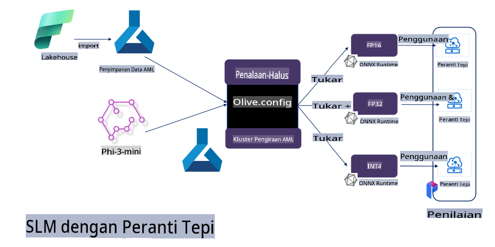

# **Menyesuaikan Phi-3 dengan Microsoft Olive**

[Olive](https://github.com/microsoft/OLive?WT.mc_id=aiml-138114-kinfeylo) ialah alat pengoptimuman model yang mesra perkakasan dan mudah digunakan, yang menggabungkan teknik-teknik terkemuka industri dalam pemampatan model, pengoptimuman, dan penyusunan.

Ia direka untuk mempermudah proses pengoptimuman model pembelajaran mesin, memastikan penggunaan yang paling efisien terhadap seni bina perkakasan tertentu.

Sama ada anda bekerja pada aplikasi berasaskan awan atau peranti tepi, Olive membolehkan anda mengoptimumkan model anda dengan mudah dan efektif.

## Ciri Utama:
- Olive menggabungkan dan mengautomasikan teknik pengoptimuman untuk perkakasan sasaran yang diinginkan.
- Tiada satu teknik pengoptimuman yang sesuai untuk semua situasi, jadi Olive membolehkan kebolehlanjutan dengan membenarkan pakar industri untuk memasukkan inovasi pengoptimuman mereka.

## Kurangkan Usaha Kejuruteraan:
- Pembangun sering perlu mempelajari dan menggunakan pelbagai rantai alat khusus vendor perkakasan untuk menyediakan dan mengoptimumkan model yang telah dilatih untuk digunakan.
- Olive mempermudah pengalaman ini dengan mengautomasikan teknik pengoptimuman untuk perkakasan yang diinginkan.

## Penyelesaian Pengoptimuman E2E Sedia Digunakan:

Dengan menggabungkan dan menyesuaikan teknik yang terintegrasi, Olive menawarkan penyelesaian terpadu untuk pengoptimuman menyeluruh.
Ia mempertimbangkan kekangan seperti ketepatan dan latensi semasa mengoptimumkan model.

## Menggunakan Microsoft Olive untuk Penyesuaian

Microsoft Olive ialah alat pengoptimuman model sumber terbuka yang sangat mudah digunakan dan boleh meliputi kedua-dua penyesuaian dan rujukan dalam bidang kecerdasan buatan generatif. Ia hanya memerlukan konfigurasi yang mudah, digabungkan dengan penggunaan model bahasa kecil sumber terbuka dan persekitaran runtime berkaitan (AzureML / GPU tempatan, CPU, DirectML). Anda boleh melengkapkan penyesuaian atau rujukan model melalui pengoptimuman automatik dan mencari model terbaik untuk digunakan ke awan atau pada peranti tepi. Ini membolehkan perusahaan membina model menegak industri mereka sendiri di lokasi atau di awan.


## Penyesuaian Phi-3 dengan Microsoft Olive 



## Contoh Kod dan Sampel Phi-3 Olive
Dalam contoh ini, anda akan menggunakan Olive untuk:

- Menyesuaikan penyesuai LoRA untuk mengklasifikasikan frasa kepada kategori Sedih, Gembira, Takut, Terkejut.
- Menggabungkan berat penyesuai ke dalam model asas.
- Mengoptimumkan dan mengkuantisasi model ke dalam int4.

[Contoh Kod](../../code/03.Finetuning/olive-ort-example/README.md)

### Pemasangan Microsoft Olive

Pemasangan Microsoft Olive sangat mudah, dan ia boleh dipasang untuk CPU, GPU, DirectML, dan Azure ML

```bash
pip install olive-ai
```

Jika anda ingin menjalankan model ONNX dengan CPU, anda boleh gunakan

```bash
pip install olive-ai[cpu]
```

Jika anda ingin menjalankan model ONNX dengan GPU, anda boleh gunakan

```python
pip install olive-ai[gpu]
```

Jika anda ingin menggunakan Azure ML, gunakan

```python
pip install git+https://github.com/microsoft/Olive#egg=olive-ai[azureml]
```

**Perhatian**
Keperluan OS: Ubuntu 20.04 / 22.04 

### **Config.json Microsoft Olive**

Selepas pemasangan, anda boleh mengkonfigurasi tetapan khusus model yang berbeza melalui fail Config, termasuk data, pengkomputeran, latihan, penggunaan, dan penjanaan model.

**1. Data**

Pada Microsoft Olive, latihan pada data tempatan dan data awan disokong, dan boleh dikonfigurasi dalam tetapan.

*Tetapan data tempatan*

Anda boleh dengan mudah menyediakan set data yang perlu dilatih untuk penyesuaian, biasanya dalam format json, dan menyesuaikannya dengan templat data. Ini perlu disesuaikan berdasarkan keperluan model (contohnya, sesuaikan dengan format yang diperlukan oleh Microsoft Phi-3-mini. Jika anda mempunyai model lain, sila rujuk format penyesuaian yang diperlukan oleh model lain untuk pemprosesan)

```json

    "data_configs": [
        {
            "name": "dataset_default_train",
            "type": "HuggingfaceContainer",
            "load_dataset_config": {
                "params": {
                    "data_name": "json", 
                    "data_files":"dataset/dataset-classification.json",
                    "split": "train"
                }
            },
            "pre_process_data_config": {
                "params": {
                    "dataset_type": "corpus",
                    "text_cols": [
                            "phrase",
                            "tone"
                    ],
                    "text_template": "### Text: {phrase}\n### The tone is:\n{tone}",
                    "corpus_strategy": "join",
                    "source_max_len": 2048,
                    "pad_to_max_len": false,
                    "use_attention_mask": false
                }
            }
        }
    ],
```

**Tetapan sumber data awan**

Dengan menghubungkan datastore Azure AI Studio/Azure Machine Learning Service untuk menghubungkan data di awan, anda boleh memilih untuk memperkenalkan sumber data yang berbeza ke Azure AI Studio/Azure Machine Learning Service melalui Microsoft Fabric dan Azure Data sebagai sokongan untuk penyesuaian data.

```json

    "data_configs": [
        {
            "name": "dataset_default_train",
            "type": "HuggingfaceContainer",
            "load_dataset_config": {
                "params": {
                    "data_name": "json", 
                    "data_files": {
                        "type": "azureml_datastore",
                        "config": {
                            "azureml_client": {
                                "subscription_id": "Your Azure Subscrition ID",
                                "resource_group": "Your Azure Resource Group",
                                "workspace_name": "Your Azure ML Workspaces name"
                            },
                            "datastore_name": "workspaceblobstore",
                            "relative_path": "Your train_data.json Azure ML Location"
                        }
                    },
                    "split": "train"
                }
            },
            "pre_process_data_config": {
                "params": {
                    "dataset_type": "corpus",
                    "text_cols": [
                            "Question",
                            "Best Answer"
                    ],
                    "text_template": "<|user|>\n{Question}<|end|>\n<|assistant|>\n{Best Answer}\n<|end|>",
                    "corpus_strategy": "join",
                    "source_max_len": 2048,
                    "pad_to_max_len": false,
                    "use_attention_mask": false
                }
            }
        }
    ],
    
```

**2. Konfigurasi pengkomputeran**

Jika anda perlu menggunakan secara tempatan, anda boleh terus menggunakan sumber data tempatan. Jika anda perlu menggunakan sumber Azure AI Studio / Azure Machine Learning Service, anda perlu mengkonfigurasi parameter Azure berkaitan, nama kuasa pengkomputeran, dan sebagainya.

```json

    "systems": {
        "aml": {
            "type": "AzureML",
            "config": {
                "accelerators": ["gpu"],
                "hf_token": true,
                "aml_compute": "Your Azure AI Studio / Azure Machine Learning Service Compute Name",
                "aml_docker_config": {
                    "base_image": "Your Azure AI Studio / Azure Machine Learning Service docker",
                    "conda_file_path": "conda.yaml"
                }
            }
        },
        "azure_arc": {
            "type": "AzureML",
            "config": {
                "accelerators": ["gpu"],
                "aml_compute": "Your Azure AI Studio / Azure Machine Learning Service Compute Name",
                "aml_docker_config": {
                    "base_image": "Your Azure AI Studio / Azure Machine Learning Service docker",
                    "conda_file_path": "conda.yaml"
                }
            }
        }
    },
```

***Perhatian***

Oleh kerana ia dijalankan melalui kontena pada Azure AI Studio/Azure Machine Learning Service, persekitaran yang diperlukan perlu dikonfigurasi. Ini dikonfigurasi dalam persekitaran conda.yaml.

```yaml

name: project_environment
channels:
  - defaults
dependencies:
  - python=3.8.13
  - pip=22.3.1
  - pip:
      - einops
      - accelerate
      - azure-keyvault-secrets
      - azure-identity
      - bitsandbytes
      - datasets
      - huggingface_hub
      - peft
      - scipy
      - sentencepiece
      - torch>=2.2.0
      - transformers
      - git+https://github.com/microsoft/Olive@jiapli/mlflow_loading_fix#egg=olive-ai[gpu]
      - --extra-index-url https://aiinfra.pkgs.visualstudio.com/PublicPackages/_packaging/ORT-Nightly/pypi/simple/ 
      - ort-nightly-gpu==1.18.0.dev20240307004
      - --extra-index-url https://aiinfra.pkgs.visualstudio.com/PublicPackages/_packaging/onnxruntime-genai/pypi/simple/
      - onnxruntime-genai-cuda

    

```

**3. Pilih SLM anda**

Anda boleh menggunakan model secara langsung dari Hugging Face, atau anda boleh terus menggabungkannya dengan Model Catalog dari Azure AI Studio / Azure Machine Learning untuk memilih model yang akan digunakan. Dalam contoh kod di bawah, kami akan menggunakan Microsoft Phi-3-mini sebagai contoh.

Jika anda mempunyai model secara tempatan, anda boleh menggunakan kaedah ini

```json

    "input_model":{
        "type": "PyTorchModel",
        "config": {
            "hf_config": {
                "model_name": "model-cache/microsoft/phi-3-mini",
                "task": "text-generation",
                "model_loading_args": {
                    "trust_remote_code": true
                }
            }
        }
    },
```

Jika anda ingin menggunakan model dari Azure AI Studio / Azure Machine Learning Service, anda boleh menggunakan kaedah ini

```json

    "input_model":{
        "type": "PyTorchModel",
        "config": {
            "model_path": {
                "type": "azureml_registry_model",
                "config": {
                    "name": "microsoft/Phi-3-mini-4k-instruct",
                    "registry_name": "azureml-msr",
                    "version": "11"
                }
            },
             "model_file_format": "PyTorch.MLflow",
             "hf_config": {
                "model_name": "microsoft/Phi-3-mini-4k-instruct",
                "task": "text-generation",
                "from_pretrained_args": {
                    "trust_remote_code": true
                }
            }
        }
    },
```

**Perhatian:**
Kita perlu mengintegrasikan dengan Azure AI Studio / Azure Machine Learning Service, jadi semasa menyediakan model, sila rujuk nombor versi dan penamaan berkaitan.

Semua model di Azure perlu disetkan ke PyTorch.MLflow

Anda perlu mempunyai akaun Hugging Face dan mengikat kunci ke nilai Kunci Azure AI Studio / Azure Machine Learning.

**4. Algoritma**

Microsoft Olive telah mengenkapsulasi algoritma penyesuaian Lora dan QLora dengan sangat baik. Anda hanya perlu mengkonfigurasi beberapa parameter berkaitan. Di sini saya mengambil QLora sebagai contoh.

```json
        "lora": {
            "type": "LoRA",
            "config": {
                "target_modules": [
                    "o_proj",
                    "qkv_proj"
                ],
                "double_quant": true,
                "lora_r": 64,
                "lora_alpha": 64,
                "lora_dropout": 0.1,
                "train_data_config": "dataset_default_train",
                "eval_dataset_size": 0.3,
                "training_args": {
                    "seed": 0,
                    "data_seed": 42,
                    "per_device_train_batch_size": 1,
                    "per_device_eval_batch_size": 1,
                    "gradient_accumulation_steps": 4,
                    "gradient_checkpointing": false,
                    "learning_rate": 0.0001,
                    "num_train_epochs": 3,
                    "max_steps": 10,
                    "logging_steps": 10,
                    "evaluation_strategy": "steps",
                    "eval_steps": 187,
                    "group_by_length": true,
                    "adam_beta2": 0.999,
                    "max_grad_norm": 0.3
                }
            }
        },
```

Jika anda mahu penukaran kuantisasi, cabang utama Microsoft Olive sudah menyokong kaedah onnxruntime-genai. Anda boleh menetapkannya mengikut keperluan anda:

1. Gabungkan berat penyesuai ke dalam model asas
2. Tukar model ke model onnx dengan ketepatan yang diperlukan menggunakan ModelBuilder

seperti menukarkan ke INT4 yang dikuantisasi

```json

        "merge_adapter_weights": {
            "type": "MergeAdapterWeights"
        },
        "builder": {
            "type": "ModelBuilder",
            "config": {
                "precision": "int4"
            }
        }
```

**Perhatian** 
- Jika anda menggunakan QLoRA, penukaran kuantisasi ONNXRuntime-genai belum disokong buat masa ini.

- Perlu ditekankan bahawa anda boleh menetapkan langkah-langkah di atas mengikut keperluan anda sendiri. Ia tidak perlu untuk sepenuhnya mengkonfigurasi semua langkah di atas. Bergantung pada keperluan anda, anda boleh terus menggunakan langkah algoritma tanpa penyesuaian. Akhir sekali, anda perlu mengkonfigurasi enjin berkaitan.

```json

    "engine": {
        "log_severity_level": 0,
        "host": "aml",
        "target": "aml",
        "search_strategy": false,
        "execution_providers": ["CUDAExecutionProvider"],
        "cache_dir": "../model-cache/models/phi3-finetuned/cache",
        "output_dir" : "../model-cache/models/phi3-finetuned"
    }
```

**5. Selesai penyesuaian**

Pada baris perintah, jalankan dalam direktori olive-config.json

```bash
olive run --config olive-config.json  
```

**Penafian**:  
Dokumen ini telah diterjemahkan menggunakan perkhidmatan terjemahan AI berasaskan mesin. Walaupun kami berusaha untuk ketepatan, sila ambil perhatian bahawa terjemahan automatik mungkin mengandungi kesilapan atau ketidaktepatan. Dokumen asal dalam bahasa asalnya harus dianggap sebagai sumber yang berwibawa. Untuk maklumat kritikal, terjemahan manusia profesional adalah disyorkan. Kami tidak bertanggungjawab atas sebarang salah faham atau salah tafsir yang timbul daripada penggunaan terjemahan ini.