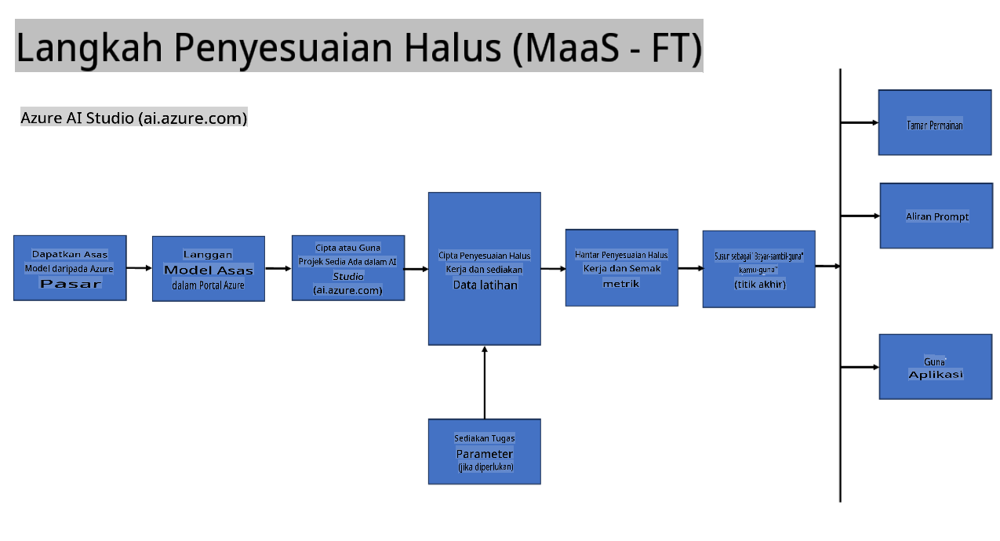
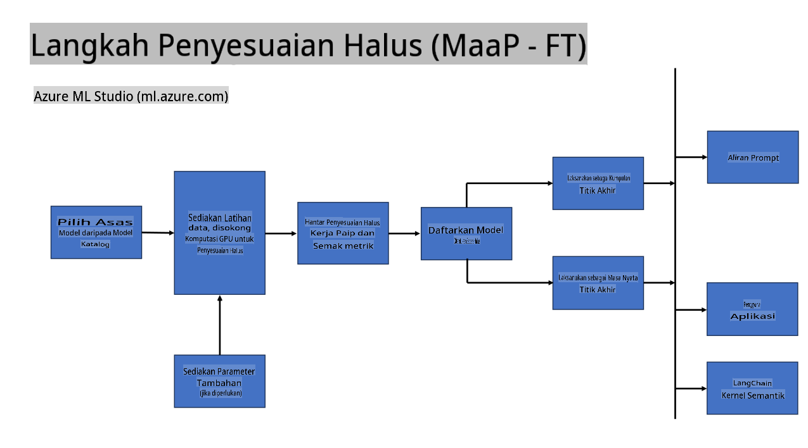
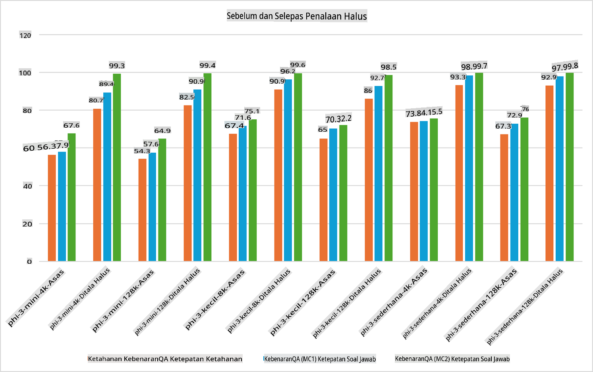

## Senario Penalaan Halus

**Platform** Ini merangkumi pelbagai teknologi seperti Azure AI Foundry, Azure Machine Learning, AI Tools, Kaito, dan ONNX Runtime.

**Infrastruktur** Ini termasuk CPU dan FPGA, yang penting untuk proses penalaan halus. Saya akan tunjukkan ikon untuk setiap teknologi ini.

**Alat & Rangka Kerja** Ini termasuk ONNX Runtime dan ONNX Runtime. Saya akan tunjukkan ikon untuk setiap teknologi ini.  
[Masukkan ikon untuk ONNX Runtime dan ONNX Runtime]

Proses penalaan halus dengan teknologi Microsoft melibatkan pelbagai komponen dan alat. Dengan memahami dan menggunakan teknologi ini, kita dapat menala halus aplikasi kita dengan berkesan dan mencipta penyelesaian yang lebih baik.

## Model sebagai Perkhidmatan

Tala halus model menggunakan penalaan halus yang dihoskan, tanpa perlu mencipta dan menguruskan pengiraan.

Penalaan halus tanpa pelayan tersedia untuk model Phi-3-mini dan Phi-3-medium, membolehkan pembangun menyesuaikan model dengan cepat dan mudah untuk senario awan dan edge tanpa perlu mengatur pengiraan. Kami juga telah mengumumkan bahawa Phi-3-small kini tersedia melalui tawaran Models-as-a-Service kami, jadi pembangun boleh mula membangunkan AI dengan cepat dan mudah tanpa perlu mengurus infrastruktur asas.

## Model sebagai Platform

Pengguna mengurus pengiraan mereka sendiri untuk menala halus model mereka.

[Contoh Penalaan Halus](https://github.com/Azure/azureml-examples/blob/main/sdk/python/foundation-models/system/finetune/chat-completion/chat-completion.ipynb)

## Senario Penalaan Halus

| | | | | | | |
|-|-|-|-|-|-|-|
|Senario|LoRA|QLoRA|PEFT|DeepSpeed|ZeRO|DORA|
|Menyesuaikan LLM pra-latihan kepada tugas atau domain tertentu|Ya|Ya|Ya|Ya|Ya|Ya|
|Menala halus untuk tugas NLP seperti klasifikasi teks, pengecaman entiti bernama, dan terjemahan mesin|Ya|Ya|Ya|Ya|Ya|Ya|
|Menala halus untuk tugas QA|Ya|Ya|Ya|Ya|Ya|Ya|
|Menala halus untuk menghasilkan respons seperti manusia dalam chatbot|Ya|Ya|Ya|Ya|Ya|Ya|
|Menala halus untuk menghasilkan muzik, seni, atau bentuk kreativiti lain|Ya|Ya|Ya|Ya|Ya|Ya|
|Mengurangkan kos pengiraan dan kewangan|Ya|Ya|Tidak|Ya|Ya|Tidak|
|Mengurangkan penggunaan memori|Tidak|Ya|Tidak|Ya|Ya|Ya|
|Menggunakan parameter yang lebih sedikit untuk penalaan halus yang cekap|Tidak|Ya|Ya|Tidak|Tidak|Ya|
|Bentuk paralelisme data yang cekap memori yang memberikan akses kepada memori GPU agregat semua peranti GPU yang tersedia|Tidak|Tidak|Tidak|Ya|Ya|Ya|

## Contoh Prestasi Penalaan Halus

**Penafian**:  
Dokumen ini telah diterjemahkan menggunakan perkhidmatan terjemahan AI berasaskan mesin. Walaupun kami berusaha untuk memastikan ketepatan, sila ambil perhatian bahawa terjemahan automatik mungkin mengandungi kesilapan atau ketidaktepatan. Dokumen asal dalam bahasa asalnya harus dianggap sebagai sumber yang berwibawa. Untuk maklumat yang kritikal, terjemahan manusia profesional adalah disyorkan. Kami tidak bertanggungjawab atas sebarang salah faham atau salah tafsir yang timbul daripada penggunaan terjemahan ini.