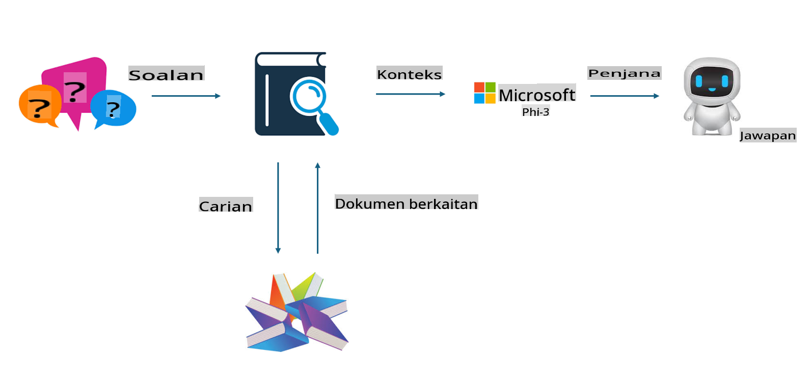

## Penalaan Halus vs RAG

## Retrieval Augmented Generation

RAG adalah gabungan pengambilan data + penjanaan teks. Data berstruktur dan tidak berstruktur dalam sesebuah organisasi disimpan dalam pangkalan data vektor. Apabila mencari kandungan yang berkaitan, ringkasan dan kandungan relevan akan ditemui untuk membentuk konteks, dan keupayaan pelengkap teks daripada LLM/SLM digabungkan untuk menghasilkan kandungan.

## Proses RAG

## Penalaan Halus
Penalaan halus adalah berdasarkan peningkatan model tertentu. Ia tidak memerlukan permulaan daripada algoritma model, tetapi data perlu dikumpulkan secara berterusan. Jika anda mahukan istilah yang lebih tepat dan ekspresi bahasa yang sesuai dalam aplikasi industri, penalaan halus adalah pilihan yang lebih baik. Tetapi jika data anda sering berubah, penalaan halus boleh menjadi rumit.

## Cara Memilih
Jika jawapan kita memerlukan pengenalan data luaran, RAG adalah pilihan terbaik.

Jika anda perlu menghasilkan pengetahuan industri yang stabil dan tepat, penalaan halus adalah pilihan yang baik. RAG mengutamakan pengambilan kandungan berkaitan tetapi mungkin tidak selalu menangkap nuansa khusus.

Penalaan halus memerlukan set data berkualiti tinggi, dan jika ia hanya melibatkan data dalam skop kecil, perbezaannya tidak akan ketara. RAG lebih fleksibel.  
Penalaan halus adalah seperti kotak hitam, satu bentuk metafizik, dan sukar untuk memahami mekanisme dalaman. Tetapi RAG boleh memudahkan untuk mengenal pasti sumber data, sekali gus membantu membetulkan halusinasi atau kesilapan kandungan dan memberikan lebih ketelusan.

**Penafian**:  
Dokumen ini telah diterjemahkan menggunakan perkhidmatan terjemahan AI berasaskan mesin. Walaupun kami berusaha untuk memastikan ketepatan, sila ambil maklum bahawa terjemahan automatik mungkin mengandungi kesilapan atau ketidaktepatan. Dokumen asal dalam bahasa asalnya harus dianggap sebagai sumber yang berwibawa. Untuk maklumat kritikal, terjemahan manusia profesional adalah disyorkan. Kami tidak bertanggungjawab atas sebarang salah faham atau salah tafsir yang timbul daripada penggunaan terjemahan ini.