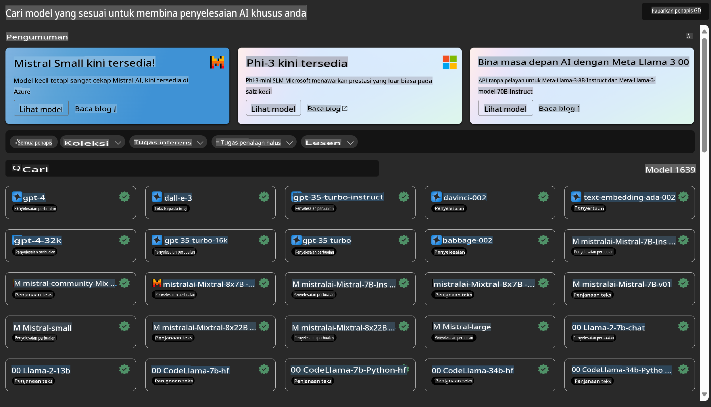

# **Pengenalan Azure Machine Learning Service**

[Azure Machine Learning](https://ml.azure.com?WT.mc_id=aiml-138114-kinfeylo) adalah perkhidmatan awan yang mempercepat dan menguruskan kitar hayat projek pembelajaran mesin (ML).

Pakar ML, saintis data, dan jurutera boleh menggunakannya dalam aliran kerja harian mereka untuk:

- Melatih dan melancarkan model.
- Menguruskan operasi pembelajaran mesin (MLOps).
- Anda boleh mencipta model dalam Azure Machine Learning atau menggunakan model yang dibangunkan daripada platform sumber terbuka seperti PyTorch, TensorFlow, atau scikit-learn.
- Alat MLOps membantu anda memantau, melatih semula, dan melancarkan semula model.

## Siapa yang Patut Menggunakan Azure Machine Learning?

**Saintis Data dan Jurutera ML**

Mereka boleh menggunakan alat untuk mempercepat dan mengautomasi aliran kerja harian mereka.  
Azure ML menyediakan ciri-ciri untuk keadilan, kebolehjelasan, penjejakan, dan auditabiliti.  

**Pembangun Aplikasi**

Mereka boleh mengintegrasikan model ke dalam aplikasi atau perkhidmatan dengan lancar.

**Pembangun Platform**

Mereka mempunyai akses kepada set alat yang mantap yang disokong oleh API Azure Resource Manager yang kukuh.  
Alat ini membolehkan pembinaan alat pembelajaran mesin yang canggih.

**Perusahaan**

Bekerja dalam awan Microsoft Azure, perusahaan mendapat manfaat daripada keselamatan yang biasa dan kawalan akses berasaskan peranan.  
Tetapkan projek untuk mengawal akses kepada data terlindung dan operasi tertentu.

## Produktiviti untuk Semua Ahli Pasukan

Projek ML sering memerlukan pasukan dengan pelbagai kemahiran untuk membina dan menyelenggara.  

Azure ML menyediakan alat yang membolehkan anda:
- Bekerjasama dengan pasukan anda melalui buku nota bersama, sumber pengkomputeran, pengkomputeran tanpa pelayan, data, dan persekitaran.
- Membangunkan model dengan keadilan, kebolehjelasan, penjejakan, dan auditabiliti untuk memenuhi keperluan pematuhan garis keturunan dan audit.
- Melancarkan model ML dengan cepat dan mudah pada skala besar, serta mengurus dan mengawalnya dengan cekap menggunakan MLOps.
- Menjalankan beban kerja pembelajaran mesin di mana-mana dengan tadbir urus, keselamatan, dan pematuhan terbina dalam.

## Alat Platform yang Serasi

Sesiapa sahaja dalam pasukan ML boleh menggunakan alat pilihan mereka untuk menyelesaikan tugas.  
Sama ada anda menjalankan eksperimen pantas, penyelarasan hiperparameter, membina saluran paip, atau mengurus inferens, anda boleh menggunakan antara muka yang biasa termasuk:
- Azure Machine Learning Studio
- Python SDK (v2)
- Azure CLI (v2)
- Azure Resource Manager REST APIs

Apabila anda memperhalusi model dan bekerjasama sepanjang kitaran pembangunan, anda boleh berkongsi dan mencari aset, sumber, dan metrik dalam antara muka Azure Machine Learning studio.

## **LLM/SLM dalam Azure ML**

Azure ML telah menambah banyak fungsi berkaitan LLM/SLM, menggabungkan LLMOps dan SLMOps untuk mencipta platform teknologi kecerdasan buatan generatif di seluruh perusahaan.

### **Katalog Model**

Pengguna perusahaan boleh melancarkan model yang berbeza mengikut senario perniagaan yang berbeza melalui Katalog Model, dan menyediakan perkhidmatan sebagai Model as Service untuk pembangun atau pengguna perusahaan mengakses.

Katalog Model dalam Azure Machine Learning studio adalah hab untuk menemui dan menggunakan pelbagai model yang membolehkan anda membina aplikasi AI Generatif. Katalog model ini menampilkan ratusan model daripada penyedia model seperti Azure OpenAI service, Mistral, Meta, Cohere, Nvidia, Hugging Face, termasuk model yang dilatih oleh Microsoft. Model daripada penyedia selain Microsoft adalah Produk Bukan Microsoft, seperti yang ditakrifkan dalam Terma Produk Microsoft, dan tertakluk kepada terma yang disediakan bersama model tersebut.

### **Saluran Paip Tugas**

Inti saluran paip pembelajaran mesin adalah untuk memecahkan tugas pembelajaran mesin yang lengkap kepada aliran kerja berbilang langkah.  
Setiap langkah adalah komponen yang boleh diurus, yang boleh dibangunkan, dioptimumkan, dikonfigurasikan, dan diautomasi secara individu. Langkah-langkah ini disambungkan melalui antara muka yang ditakrifkan dengan baik. Perkhidmatan saluran paip Azure Machine Learning secara automatik menyelaraskan semua kebergantungan antara langkah-langkah saluran paip.

Dalam penyelarasan SLM/LLM, kita boleh menguruskan data, latihan, dan proses penjanaan kita melalui Saluran Paip.

### **Prompt Flow**

**Manfaat Menggunakan Azure Machine Learning Prompt Flow**  
Azure Machine Learning prompt flow menawarkan pelbagai manfaat yang membantu pengguna beralih dari ideasi ke eksperimen, dan akhirnya, kepada aplikasi LLM yang sedia untuk pengeluaran:

**Kelincahan Kejuruteraan Prompt**

- Pengalaman pengarang interaktif: Azure Machine Learning prompt flow menyediakan representasi visual struktur aliran, membolehkan pengguna memahami dan menavigasi projek mereka dengan mudah. Ia juga menawarkan pengalaman pengekodan seperti buku nota untuk pembangunan dan penyahpepijatan aliran yang cekap.
- Variasi untuk penyelarasan prompt: Pengguna boleh mencipta dan membandingkan pelbagai varian prompt, memudahkan proses penambahbaikan iteratif.
- Penilaian: Aliran penilaian terbina dalam membolehkan pengguna menilai kualiti dan keberkesanan prompt dan aliran mereka.
- Sumber yang komprehensif: Azure Machine Learning prompt flow termasuk perpustakaan alat terbina dalam, sampel, dan templat yang menjadi titik permulaan untuk pembangunan, memberi inspirasi kepada kreativiti dan mempercepatkan proses.

**Kesediaan Perusahaan untuk Aplikasi Berasaskan LLM**

- Kolaborasi: Azure Machine Learning prompt flow menyokong kolaborasi pasukan, membolehkan pelbagai pengguna bekerja bersama-sama pada projek kejuruteraan prompt, berkongsi pengetahuan, dan mengekalkan kawalan versi.
- Platform serba lengkap: Azure Machine Learning prompt flow menyelaraskan keseluruhan proses kejuruteraan prompt, dari pembangunan dan penilaian hingga ke pelancaran dan pemantauan. Pengguna boleh melancarkan aliran mereka sebagai titik akhir Azure Machine Learning dan memantau prestasi mereka secara masa nyata, memastikan operasi yang optimum dan penambahbaikan berterusan.
- Penyelesaian Kesediaan Perusahaan Azure Machine Learning: Prompt flow memanfaatkan penyelesaian kesediaan perusahaan Azure Machine Learning yang mantap, menyediakan asas yang selamat, berskala, dan boleh dipercayai untuk pembangunan, eksperimen, dan pelancaran aliran.

Dengan Azure Machine Learning prompt flow, pengguna boleh melepaskan kelincahan kejuruteraan prompt mereka, bekerjasama dengan berkesan, dan memanfaatkan penyelesaian peringkat perusahaan untuk pembangunan dan pelancaran aplikasi berasaskan LLM yang berjaya.

Menggabungkan kuasa pengkomputeran, data, dan komponen berbeza Azure ML, pembangun perusahaan boleh dengan mudah membina aplikasi kecerdasan buatan mereka sendiri.

**Penafian**:  
Dokumen ini telah diterjemahkan menggunakan perkhidmatan terjemahan AI berasaskan mesin. Walaupun kami berusaha untuk memastikan ketepatan, sila maklum bahawa terjemahan automatik mungkin mengandungi kesilapan atau ketidaktepatan. Dokumen asal dalam bahasa asalnya harus dianggap sebagai sumber yang berwibawa. Untuk maklumat yang kritikal, terjemahan manusia profesional adalah disyorkan. Kami tidak bertanggungjawab ke atas sebarang salah faham atau salah tafsir yang timbul daripada penggunaan terjemahan ini.