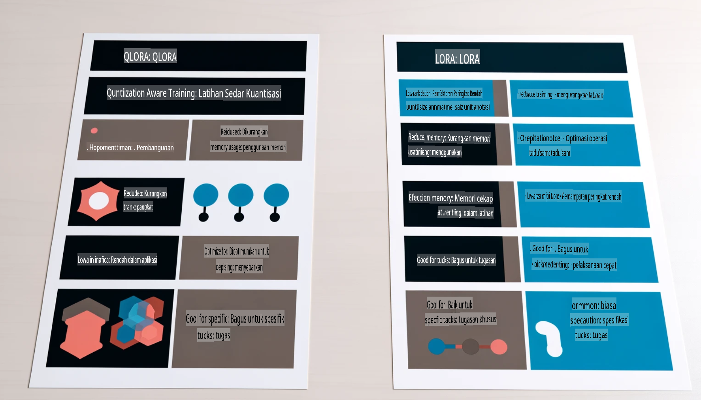

# **Jadikan Phi-3 sebagai Pakar Industri**

Untuk memasukkan model Phi-3 ke dalam sebuah industri, anda perlu menambahkan data perniagaan industri ke dalam model Phi-3. Terdapat dua pilihan yang boleh digunakan, iaitu RAG (Retrieval Augmented Generation) dan Fine Tuning.

## **RAG vs Fine-Tuning**

### **Retrieval Augmented Generation**

RAG adalah gabungan pengambilan data dan penjanaan teks. Data terstruktur dan tidak terstruktur dari syarikat disimpan dalam pangkalan data vektor. Apabila mencari kandungan yang berkaitan, ringkasan dan kandungan yang relevan ditemui untuk membentuk konteks, dan keupayaan penyelesaian teks LLM/SLM digunakan untuk menjana kandungan.

### **Fine-tuning**

Fine-tuning adalah penyesuaian berdasarkan model tertentu. Ia tidak memerlukan permulaan dari algoritma model, tetapi data perlu terus dikumpulkan. Jika anda memerlukan terminologi dan ekspresi bahasa yang lebih tepat dalam aplikasi industri, fine-tuning adalah pilihan terbaik anda. Namun, jika data anda sering berubah, fine-tuning boleh menjadi rumit.

### **Bagaimana untuk memilih**

1. Jika jawapan kita memerlukan data luaran, RAG adalah pilihan terbaik.

2. Jika anda memerlukan pengetahuan industri yang stabil dan tepat, fine-tuning adalah pilihan yang baik. RAG mengutamakan pengambilan kandungan yang relevan tetapi mungkin tidak selalu memahami nuansa khusus.

3. Fine-tuning memerlukan set data berkualiti tinggi, dan jika hanya melibatkan data dalam skala kecil, ia tidak akan memberikan banyak perbezaan. RAG lebih fleksibel.

4. Fine-tuning adalah seperti "kotak hitam," sukar untuk memahami mekanisme dalaman. Tetapi RAG memudahkan untuk mengenal pasti sumber data, dengan itu dapat menyesuaikan halusinasi atau kesalahan kandungan secara efektif dan memberikan lebih banyak ketelusan.

### **Senario**

1. Industri vertikal yang memerlukan kosa kata dan ekspresi profesional tertentu, ***Fine-tuning*** adalah pilihan terbaik.

2. Sistem soal jawab yang melibatkan sintesis pelbagai titik pengetahuan, ***RAG*** adalah pilihan terbaik.

3. Gabungan aliran kerja automatik ***RAG + Fine-tuning*** adalah pilihan terbaik.

## **Cara menggunakan RAG**

Pangkalan data vektor adalah koleksi data yang disimpan dalam bentuk matematik. Pangkalan data vektor memudahkan model pembelajaran mesin untuk mengingati input sebelumnya, memungkinkan pembelajaran mesin digunakan untuk menyokong kes penggunaan seperti carian, cadangan, dan penjanaan teks. Data dapat dikenalpasti berdasarkan metrik keserupaan dan bukan padanan tepat, memungkinkan model komputer memahami konteks data.

Pangkalan data vektor adalah kunci untuk merealisasikan RAG. Kita boleh menukar data ke penyimpanan vektor melalui model vektor seperti text-embedding-3, jina-ai-embedding, dan lain-lain.

Ketahui lebih lanjut tentang mencipta aplikasi RAG [https://github.com/microsoft/Phi-3CookBook](https://github.com/microsoft/Phi-3CookBook?WT.mc_id=aiml-138114-kinfeylo)

## **Cara menggunakan Fine-tuning**

Algoritma yang sering digunakan dalam Fine-tuning adalah Lora dan QLora. Bagaimana untuk memilih?
- [Ketahui lebih lanjut dengan notebook contoh ini](../../../../code/04.Finetuning/Phi_3_Inference_Finetuning.ipynb)
- [Contoh Python FineTuning Sample](../../../../code/04.Finetuning/FineTrainingScript.py)

### **Lora dan QLora**

LoRA (Low-Rank Adaptation) dan QLoRA (Quantized Low-Rank Adaptation) adalah teknik yang digunakan untuk fine-tuning model bahasa besar (LLMs) menggunakan Parameter Efficient Fine Tuning (PEFT). Teknik PEFT dirancang untuk melatih model dengan lebih efisien berbanding kaedah tradisional.  
LoRA adalah teknik fine-tuning mandiri yang mengurangkan penggunaan memori dengan menerapkan pendekatan low-rank pada matriks kemas kini berat. Ia menawarkan masa latihan yang cepat dan mengekalkan prestasi yang hampir sama dengan kaedah fine-tuning tradisional.

QLoRA adalah versi lanjutan dari LoRA yang menggabungkan teknik kuantisasi untuk mengurangkan penggunaan memori lebih jauh. QLoRA mengkuantisasi ketepatan parameter berat dalam LLM pra-latih ke ketepatan 4-bit, yang lebih efisien dari segi memori berbanding LoRA. Namun, latihan QLoRA kira-kira 30% lebih lambat daripada latihan LoRA kerana langkah tambahan kuantisasi dan dekuantisasi.

QLoRA menggunakan LoRA sebagai pelengkap untuk memperbaiki kesalahan yang diperkenalkan semasa proses kuantisasi. QLoRA memungkinkan fine-tuning model besar dengan berbilion parameter menggunakan GPU yang lebih kecil dan lebih mudah diperoleh. Sebagai contoh, QLoRA dapat melakukan fine-tuning model 70B parameter yang memerlukan 36 GPU dengan hanya 2.

**Penafian**:  
Dokumen ini telah diterjemahkan menggunakan perkhidmatan terjemahan AI berasaskan mesin. Walaupun kami berusaha untuk ketepatan, sila ambil maklum bahawa terjemahan automatik mungkin mengandungi kesilapan atau ketidaktepatan. Dokumen asal dalam bahasa asalnya harus dianggap sebagai sumber yang berwibawa. Untuk maklumat kritikal, terjemahan manusia profesional adalah disyorkan. Kami tidak bertanggungjawab atas sebarang salah faham atau salah tafsir yang timbul daripada penggunaan terjemahan ini.