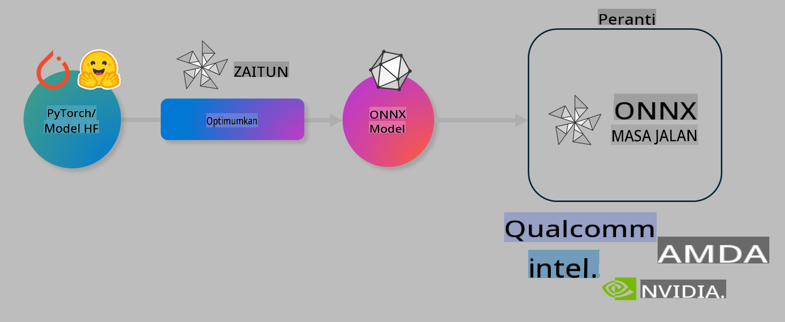

# Makmal. Optimumkan Model AI untuk Inferens di Peranti

## Pengenalan

> [!IMPORTANT]
> Makmal ini memerlukan **GPU Nvidia A10 atau A100** dengan pemacu berkaitan dan toolkit CUDA (versi 12+) yang telah dipasang.

> [!NOTE]
> Ini adalah makmal selama **35 minit** yang akan memberi anda pengenalan praktikal kepada konsep teras dalam mengoptimumkan model untuk inferens di peranti menggunakan OLIVE.

## Objektif Pembelajaran

Pada akhir makmal ini, anda akan dapat menggunakan OLIVE untuk:

- Kuantisasi model AI menggunakan kaedah kuantisasi AWQ.
- Melaras model AI untuk tugasan tertentu.
- Menjana LoRA adapters (model yang telah dilaras) untuk inferens di peranti yang cekap menggunakan ONNX Runtime.

### Apa itu Olive

Olive (*O*NNX *live*) ialah alat pengoptimuman model dengan CLI yang membolehkan anda menyediakan model untuk ONNX runtime +++https://onnxruntime.ai+++ dengan kualiti dan prestasi.



Input kepada Olive biasanya adalah model PyTorch atau Hugging Face dan outputnya adalah model ONNX yang dioptimumkan untuk dijalankan pada peranti (sasaran penerapan) yang menggunakan ONNX runtime. Olive akan mengoptimumkan model untuk pemecut AI sasaran penerapan (NPU, GPU, CPU) yang disediakan oleh vendor perkakasan seperti Qualcomm, AMD, Nvidia atau Intel.

Olive menjalankan *workflow*, iaitu urutan tugas pengoptimuman model individu yang dipanggil *passes* - contoh *passes* termasuk: pemampatan model, tangkapan graf, kuantisasi, pengoptimuman graf. Setiap *pass* mempunyai parameter yang boleh ditala untuk mencapai metrik terbaik, seperti ketepatan dan latensi, yang dinilai oleh penilai masing-masing. Olive menggunakan strategi pencarian dengan algoritma pencarian untuk secara automatik menala setiap *pass* satu demi satu atau sekumpulan *pass* bersama.

#### Kelebihan Olive

- **Mengurangkan kekecewaan dan masa** daripada percubaan dan kesilapan manual dengan teknik yang berbeza untuk pengoptimuman graf, pemampatan, dan kuantisasi. Tetapkan kekangan kualiti dan prestasi anda dan biarkan Olive secara automatik mencari model terbaik untuk anda.
- **40+ komponen pengoptimuman model terbina dalam** yang meliputi teknik canggih dalam kuantisasi, pemampatan, pengoptimuman graf, dan pelarasan.
- **CLI yang mudah digunakan** untuk tugas pengoptimuman model yang biasa. Contohnya, `olive quantize`, `olive auto-opt`, `olive finetune`.
- Pembungkusan dan penerapan model yang terbina dalam.
- Menyokong penjanaan model untuk **Multi LoRA serving**.
- Membina *workflow* menggunakan YAML/JSON untuk menyusun tugas pengoptimuman dan penerapan model.
- Integrasi **Hugging Face** dan **Azure AI**.
- Mekanisme **cache** terbina dalam untuk **menjimatkan kos**.

## Arahan Makmal
> [!NOTE]
> Pastikan anda telah menyediakan Azure AI Hub dan Projek anda serta menyiapkan pengkomputeran A100 seperti yang diterangkan dalam Makmal 1.

### Langkah 0: Sambung ke Azure AI Compute

Anda akan menyambung ke Azure AI compute menggunakan ciri jauh dalam **VS Code.**

1. Buka aplikasi desktop **VS Code** anda:
1. Buka **command palette** menggunakan **Shift+Ctrl+P**.
1. Dalam *command palette*, cari **AzureML - remote: Connect to compute instance in New Window**.
1. Ikuti arahan pada skrin untuk menyambung ke Compute. Ini melibatkan pemilihan Langganan Azure anda, Kumpulan Sumber, Projek, dan nama Compute yang telah anda sediakan dalam Makmal 1.
1. Setelah anda disambungkan ke nod Azure ML Compute, ini akan dipaparkan di **bahagian kiri bawah Visual Code** `><Azure ML: Compute Name`.

### Langkah 1: Klon repositori ini

Dalam VS Code, anda boleh membuka terminal baharu dengan **Ctrl+J** dan klon repositori ini:

Dalam terminal, anda sepatutnya melihat prompt:

```
azureuser@computername:~/cloudfiles/code$ 
```
Klon penyelesaian:

```bash
cd ~/localfiles
git clone https://github.com/microsoft/phi-3cookbook.git
```

### Langkah 2: Buka Folder dalam VS Code

Untuk membuka VS Code dalam folder yang berkaitan, jalankan arahan berikut dalam terminal, yang akan membuka tetingkap baharu:

```bash
code phi-3cookbook/code/04.Finetuning/Olive-lab
```

Sebagai alternatif, anda boleh membuka folder dengan memilih **File** > **Open Folder**.

### Langkah 3: Kebergantungan

Buka tetingkap terminal dalam VS Code pada Azure AI Compute Instance anda (tip: **Ctrl+J**) dan jalankan arahan berikut untuk memasang kebergantungan:

```bash
conda create -n olive-ai python=3.11 -y
conda activate olive-ai
pip install -r requirements.txt
az extension remove -n azure-cli-ml
az extension add -n ml
```

> [!NOTE]
> Ia akan mengambil masa ~5 minit untuk memasang semua kebergantungan.

Dalam makmal ini, anda akan memuat turun dan memuat naik model ke katalog model Azure AI. Supaya anda boleh mengakses katalog model, anda perlu log masuk ke Azure menggunakan:

```bash
az login
```

> [!NOTE]
> Semasa log masuk, anda akan diminta untuk memilih langganan anda. Pastikan anda menetapkan langganan kepada yang disediakan untuk makmal ini.

### Langkah 4: Jalankan arahan Olive 

Buka tetingkap terminal dalam VS Code pada Azure AI Compute Instance anda (tip: **Ctrl+J**) dan pastikan persekitaran `olive-ai` conda diaktifkan:

```bash
conda activate olive-ai
```

Seterusnya, jalankan arahan Olive berikut di baris arahan.

1. **Periksa data:** Dalam contoh ini, anda akan melaras model Phi-3.5-Mini supaya ia khusus untuk menjawab soalan berkaitan perjalanan. Kod di bawah memaparkan beberapa rekod pertama dataset, yang berada dalam format JSON lines:
   
    ```bash
    head data/data_sample_travel.jsonl
    ```
1. **Kuantisasi model:** Sebelum melatih model, anda terlebih dahulu melakukan kuantisasi dengan arahan berikut yang menggunakan teknik bernama Active Aware Quantization (AWQ) +++https://arxiv.org/abs/2306.00978+++. AWQ mengkuantisasi berat model dengan mengambil kira aktivasi yang dihasilkan semasa inferens. Ini bermakna proses kuantisasi mengambil kira taburan data sebenar dalam aktivasi, yang membawa kepada pemeliharaan ketepatan model yang lebih baik berbanding dengan kaedah kuantisasi berat tradisional.
    
    ```bash
    olive quantize \
       --model_name_or_path microsoft/Phi-3.5-mini-instruct \
       --trust_remote_code \
       --algorithm awq \
       --output_path models/phi/awq \
       --log_level 1
    ```
    
    Ia mengambil masa **~8 minit** untuk menyelesaikan kuantisasi AWQ, yang akan **mengurangkan saiz model daripada ~7.5GB kepada ~2.5GB**.
   
   Dalam makmal ini, kami menunjukkan kepada anda cara untuk memasukkan model daripada Hugging Face (contohnya: `microsoft/Phi-3.5-mini-instruct`). However, Olive also allows you to input models from the Azure AI catalog by updating the `model_name_or_path` argument to an Azure AI asset ID (for example:  `azureml://registries/azureml/models/Phi-3.5-mini-instruct/versions/4`). 

1. **Train the model:** Next, the `olive finetune` arahan melaras model yang telah dikuantisasi. Melakukan kuantisasi pada model *sebelum* pelarasan dan bukannya selepas akan memberikan ketepatan yang lebih baik kerana proses pelarasan akan memulihkan sebahagian daripada kehilangan akibat kuantisasi.
    
    ```bash
    olive finetune \
        --method lora \
        --model_name_or_path models/phi/awq \
        --data_files "data/data_sample_travel.jsonl" \
        --data_name "json" \
        --text_template "<|user|>\n{prompt}<|end|>\n<|assistant|>\n{response}<|end|>" \
        --max_steps 100 \
        --output_path ./models/phi/ft \
        --log_level 1
    ```
    
    Ia mengambil masa **~6 minit** untuk menyelesaikan pelarasan (dengan 100 langkah).

1. **Optimumkan:** Dengan model yang telah dilatih, kini anda boleh mengoptimumkan model menggunakan arahan `auto-opt` Olive dengan argumen `--device` command, which will capture the ONNX graph and automatically perform a number of optimizations to improve the model performance for CPU by compressing the model and doing fusions. It should be noted, that you can also optimize for other devices such as NPU or GPU by just updating the `--provider` - tetapi untuk tujuan makmal ini kita akan menggunakan CPU.

    ```bash
    olive auto-opt \
       --model_name_or_path models/phi/ft/model \
       --adapter_path models/phi/ft/adapter \
       --device cpu \
       --provider CPUExecutionProvider \
       --use_ort_genai \
       --output_path models/phi/onnx-ao \
       --log_level 1
    ```
    
    Ia mengambil masa **~5 minit** untuk menyelesaikan pengoptimuman.

### Langkah 5: Ujian cepat inferens model

Untuk menguji inferens model, buat fail Python dalam folder anda yang dinamakan **app.py** dan salin-dan-tampal kod berikut:

```python
import onnxruntime_genai as og
import numpy as np

print("loading model and adapters...", end="", flush=True)
model = og.Model("models/phi/onnx-ao/model")
adapters = og.Adapters(model)
adapters.load("models/phi/onnx-ao/model/adapter_weights.onnx_adapter", "travel")
print("DONE!")

tokenizer = og.Tokenizer(model)
tokenizer_stream = tokenizer.create_stream()

params = og.GeneratorParams(model)
params.set_search_options(max_length=100, past_present_share_buffer=False)
user_input = "what is the best thing to see in chicago"
params.input_ids = tokenizer.encode(f"<|user|>\n{user_input}<|end|>\n<|assistant|>\n")

generator = og.Generator(model, params)

generator.set_active_adapter(adapters, "travel")

print(f"{user_input}")

while not generator.is_done():
    generator.compute_logits()
    generator.generate_next_token()

    new_token = generator.get_next_tokens()[0]
    print(tokenizer_stream.decode(new_token), end='', flush=True)

print("\n")
```

Jalankan kod menggunakan:

```bash
python app.py
```

### Langkah 6: Muat naik model ke Azure AI

Memuat naik model ke repositori model Azure AI menjadikan model boleh dikongsi dengan ahli pasukan pembangunan lain dan juga mengendalikan kawalan versi model. Untuk memuat naik model, jalankan arahan berikut:

> [!NOTE]
> Kemas kini `{}` placeholders with the name of your resource group and Azure AI Project Name. 

To find your resource group `"resourceGroup"dan nama Projek Azure AI, jalankan arahan berikut:

```
az ml workspace show
```

Atau dengan pergi ke +++ai.azure.com+++ dan memilih **management center** **project** **overview**.

Kemas kini `{}` dengan nama kumpulan sumber dan Nama Projek Azure AI anda.

```bash
az ml model create \
    --name ft-for-travel \
    --version 1 \
    --path ./models/phi/onnx-ao \
    --resource-group {RESOURCE_GROUP_NAME} \
    --workspace-name {PROJECT_NAME}
```
Anda kemudian boleh melihat model yang dimuat naik dan menerapkan model anda di https://ml.azure.com/model/list

**Penafian**:  
Dokumen ini telah diterjemahkan menggunakan perkhidmatan terjemahan AI berasaskan mesin. Walaupun kami berusaha untuk memastikan ketepatan, sila ambil perhatian bahawa terjemahan automatik mungkin mengandungi kesilapan atau ketidaktepatan. Dokumen asal dalam bahasa asalnya harus dianggap sebagai sumber yang berwibawa. Untuk maklumat kritikal, terjemahan manusia profesional adalah disyorkan. Kami tidak bertanggungjawab atas sebarang salah faham atau salah tafsir yang timbul daripada penggunaan terjemahan ini.