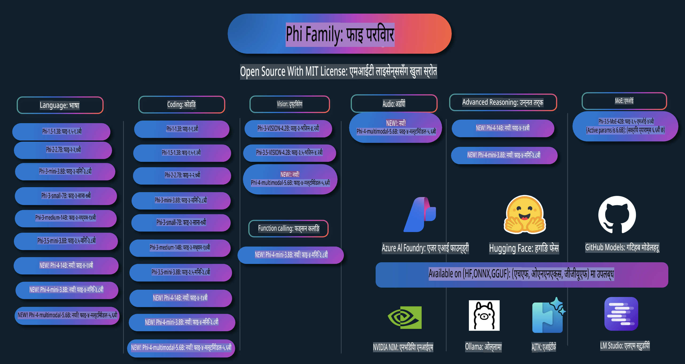

# Phi कुकबुक: माइक्रोसफ्टको Phi मोडेलहरूसँग व्यावहारिक उदाहरणहरू

  

  
  
  

  
  

Phi माइक्रोसफ्टद्वारा विकसित ओपन सोर्स AI मोडेलहरूको शृंखला हो।  

Phi हालको अवस्थामा सबैभन्दा शक्तिशाली र लागत-प्रभावी सानो भाषा मोडेल (SLM) हो, जसले बहुभाषा, तर्कशक्ति, पाठ/च्याट सिर्जना, कोडिङ, छवि, अडियो र अन्य परिस्थितिहरूमा उत्कृष्ट प्रदर्शन गर्दछ।  

तपाईं Phi लाई क्लाउडमा वा किनार उपकरणहरूमा तैनाथ गर्न सक्नुहुन्छ, र सीमित कम्प्युटिङ पावरको साथमा सजिलै जेनेरेटिभ AI एप्लिकेसनहरू बनाउन सक्नुहुन्छ।  

यी स्रोतहरू प्रयोग गर्न सुरु गर्न निम्न चरणहरू अनुसरण गर्नुहोस्:
1. **रेपोजिटरी फोर्क गर्नुहोस्**: क्लिक गर्नुहोस्   
2. **रेपोजिटरी क्लोन गर्नुहोस्**:   `git clone https://github.com/microsoft/PhiCookBook.git`  
3. [**Microsoft AI Discord समुदायमा सामेल हुनुहोस् र विशेषज्ञहरू र अन्य विकासकर्ताहरूलाई भेट्नुहोस्**](https://discord.com/invite/ByRwuEEgH4?WT.mc_id=aiml-137032-kinfeylo)

## सामग्रीको सूची

- परिचय  
  - [Phi परिवारमा स्वागत छ](./md/01.Introduction/01/01.PhiFamily.md)  
  - [आफ्नो वातावरण सेटअप गर्दै](./md/01.Introduction/01/01.EnvironmentSetup.md)  
  - [मुख्य प्रविधिहरू बुझ्दै](./md/01.Introduction/01/01.Understandingtech.md)  
  - [Phi मोडेलहरूको लागि AI सुरक्षा](./md/01.Introduction/01/01.AISafety.md)  
  - [Phi हार्डवेयर समर्थन](./md/01.Introduction/01/01.Hardwaresupport.md)  
  - [Phi मोडेलहरू र प्लेटफर्महरूमा उपलब्धता](./md/01.Introduction/01/01.Edgeandcloud.md)  
  - [Guidance-ai र Phi प्रयोग गर्दै](./md/01.Introduction/01/01.Guidance.md)  
  - [GitHub Marketplace मोडेलहरू](https://github.com/marketplace/models)  
  - [Azure AI मोडेल क्याटलग](https://ai.azure.com)  

- विभिन्न वातावरणमा Phi को इन्फरेन्स  
    - [Hugging face](./md/01.Introduction/02/01.HF.md)  
    - [GitHub मोडेलहरू](./md/01.Introduction/02/02.GitHubModel.md)  
    - [Azure AI Foundry मोडेल क्याटलग](./md/01.Introduction/02/03.AzureAIFoundry.md)  
    - [Ollama](./md/01.Introduction/02/04.Ollama.md)  
    - [AI Toolkit VSCode (AITK)](./md/01.Introduction/02/05.AITK.md)  
    - [NVIDIA NIM](./md/01.Introduction/02/06.NVIDIA.md)  

- Phi परिवारको इन्फरेन्स  
    - [iOS मा Phi को इन्फरेन्स](./md/01.Introduction/03/iOS_Inference.md)  
    - [Android मा Phi को इन्फरेन्स](./md/01.Introduction/03/Android_Inference.md)  
- [Jetson मा Phi Inference](./md/01.Introduction/03/Jetson_Inference.md)  
    - [AI PC मा Phi Inference](./md/01.Introduction/03/AIPC_Inference.md)  
    - [Apple MLX Framework प्रयोग गरेर Phi Inference](./md/01.Introduction/03/MLX_Inference.md)  
    - [स्थानीय सर्भरमा Phi Inference](./md/01.Introduction/03/Local_Server_Inference.md)  
    - [AI Toolkit प्रयोग गरेर रिमोट सर्भरमा Phi Inference](./md/01.Introduction/03/Remote_Interence.md)  
    - [Rust प्रयोग गरेर Phi Inference](./md/01.Introduction/03/Rust_Inference.md)  
    - [स्थानीयमा Phi--Vision Inference](./md/01.Introduction/03/Vision_Inference.md)  
    - [Kaito AKS, Azure Containers (औपचारिक समर्थन) सँग Phi Inference](./md/01.Introduction/03/Kaito_Inference.md)  

- [Phi Family को परिमाण](./md/01.Introduction/04/QuantifyingPhi.md)  
    - [llama.cpp प्रयोग गरेर Phi-3.5 / 4 को परिमाण](./md/01.Introduction/04/UsingLlamacppQuantifyingPhi.md)  
    - [onnxruntime का लागि Generative AI extensions प्रयोग गरेर Phi-3.5 / 4 को परिमाण](./md/01.Introduction/04/UsingORTGenAIQuantifyingPhi.md)  
    - [Intel OpenVINO प्रयोग गरेर Phi-3.5 / 4 को परिमाण](./md/01.Introduction/04/UsingIntelOpenVINOQuantifyingPhi.md)  
    - [Apple MLX Framework प्रयोग गरेर Phi-3.5 / 4 को परिमाण](./md/01.Introduction/04/UsingAppleMLXQuantifyingPhi.md)  

- Phi को मूल्याङ्कन  
    - [Responsible AI](./md/01.Introduction/05/ResponsibleAI.md)  
    - [मूल्याङ्कनका लागि Azure AI Foundry](./md/01.Introduction/05/AIFoundry.md)  
    - [मूल्याङ्कनका लागि Promptflow प्रयोग गर्ने](./md/01.Introduction/05/Promptflow.md)  

- Azure AI Search सँग RAG  
    - [Azure AI Search सँग Phi-4-mini र Phi-4-multimodal (RAG) प्रयोग गर्ने तरिका](https://github.com/microsoft/PhiCookBook/blob/main/code/06.E2E/E2E_Phi-4-RAG-Azure-AI-Search.ipynb)  

- Phi एप्लिकेसन विकासका नमूनाहरू  
  - पाठ र च्याट एप्लिकेसनहरू  
    - Phi-4 का नमूनाहरू 🆕  
      - [📓] [Phi-4-mini ONNX मोडेलसँग च्याट गर्नुहोस्](./md/02.Application/01.TextAndChat/Phi4/ChatWithPhi4ONNX/README.md)  
      - [स्थानीय Phi-4 ONNX मोडेल .NET सँग च्याट गर्नुहोस्](../../md/04.HOL/dotnet/src/LabsPhi4-Chat-01OnnxRuntime)  
      - [Sementic Kernel प्रयोग गरेर Phi-4 ONNX सँग .NET कन्सोल एप च्याट गर्नुहोस्](../../md/04.HOL/dotnet/src/LabsPhi4-Chat-02SK)  
    - Phi-3 / 3.5 का नमूनाहरू  
      - [ब्राउजरमा Phi3, ONNX Runtime Web र WebGPU प्रयोग गरेर स्थानीय च्याटबोट](https://github.com/microsoft/onnxruntime-inference-examples/tree/main/js/chat)  
      - [OpenVino च्याट](./md/02.Application/01.TextAndChat/Phi3/E2E_OpenVino_Chat.md)  
      - [मल्टि मोडेल - Phi-3-mini र OpenAI Whisper को Interactive प्रयोग](./md/02.Application/01.TextAndChat/Phi3/E2E_Phi-3-mini_with_whisper.md)  
      - [MLFlow - Phi-3 लाई Wrapper बनाएर MLFlow सँग प्रयोग गर्ने](./md//02.Application/01.TextAndChat/Phi3/E2E_Phi-3-MLflow.md)  
      - [मोडेल अप्टिमाइजेसन - Olive प्रयोग गरेर Phi-3-min मोडेललाई ONNX Runtime Web का लागि कसरी अप्टिमाइज गर्ने](https://github.com/microsoft/Olive/tree/main/examples/phi3)  
      - [Phi-3 mini-4k-instruct-onnx सँग WinUI3 एप](https://github.com/microsoft/Phi3-Chat-WinUI3-Sample/)  
      - [WinUI3 मल्टि मोडेल AI Powered Notes App नमूना](https://github.com/microsoft/ai-powered-notes-winui3-sample)  
      - [Prompt flow सँग अनुकूलित Phi-3 मोडेललाई फाइन-ट्यून र एकीकृत गर्ने](./md/02.Application/01.TextAndChat/Phi3/E2E_Phi-3-FineTuning_PromptFlow_Integration.md)  
      - [Azure AI Foundry मा Prompt flow सँग अनुकूलित Phi-3 मोडेललाई फाइन-ट्यून र एकीकृत गर्ने](./md/02.Application/01.TextAndChat/Phi3/E2E_Phi-3-FineTuning_PromptFlow_Integration_AIFoundry.md)  
      - [Microsoft को Responsible AI सिद्धान्तलाई ध्यानमा राख्दै Azure AI Foundry मा अनुकूलित Phi-3 / Phi-3.5 मोडेलको मूल्याङ्कन गर्ने](./md/02.Application/01.TextAndChat/Phi3/E2E_Phi-3-Evaluation_AIFoundry.md)  
- [📓] [Phi-3.5-mini-instruct भाषा पूर्वानुमान नमूना (चिनियाँ/अंग्रेजी)](../../md/02.Application/01.TextAndChat/Phi3/phi3-instruct-demo.ipynb)
      - [Phi-3.5-Instruct WebGPU RAG Chatbot](./md/02.Application/01.TextAndChat/Phi3/WebGPUWithPhi35Readme.md)
      - [Windows GPU प्रयोग गरेर Phi-3.5-Instruct ONNX सँग Prompt flow समाधान बनाउन](./md/02.Application/01.TextAndChat/Phi3/UsingPromptFlowWithONNX.md)
      - [Microsoft Phi-3.5 tflite प्रयोग गरेर Android एप बनाउने](./md/02.Application/01.TextAndChat/Phi3/UsingPhi35TFLiteCreateAndroidApp.md)
      - [Microsoft.ML.OnnxRuntime प्रयोग गरी स्थानीय ONNX Phi-3 मोडेलका लागि Q&A .NET उदाहरण](../../md/04.HOL/dotnet/src/LabsPhi301)
      - [Semantic Kernel र Phi-3 सँग Console chat .NET एप](../../md/04.HOL/dotnet/src/LabsPhi302)

  - Azure AI Inference SDK कोड आधारित नमूनाहरू 
    - Phi-4 नमूनाहरू 🆕
      - [📓] [Phi-4-multimodal प्रयोग गरी प्रोजेक्ट कोड निर्माण गर्ने](./md/02.Application/02.Code/Phi4/GenProjectCode/README.md)
    - Phi-3 / 3.5 नमूनाहरू
      - [Microsoft Phi-3 Family प्रयोग गरेर आफ्नै Visual Studio Code GitHub Copilot Chat बनाउने](./md/02.Application/02.Code/Phi3/VSCodeExt/README.md)
      - [Phi-3.5 प्रयोग गरी GitHub Models सँग Visual Studio Code Chat Copilot Agent बनाउने](/md/02.Application/02.Code/Phi3/CreateVSCodeChatAgentWithGitHubModels.md)

  - उन्नत तर्क नमूनाहरू
    - Phi-4 नमूनाहरू 🆕
      - [📓] [Phi-4-mini तर्क नमूनाहरू](./md/02.Application/03.AdvancedReasoning/Phi4/AdvancedResoningPhi4mini/README.md)
  
  - डेमोहरू
      - [Hugging Face Spaces मा होस्ट गरिएको Phi-4-mini डेमोहरू](https://huggingface.co/spaces/microsoft/phi-4-mini?WT.mc_id=aiml-137032-kinfeylo)
      - [Hugging Face Spaces मा होस्ट गरिएको Phi-4-multimodal डेमोहरू](https://huggingface.co/spaces/microsoft/phi-4-multimodal?WT.mc_id=aiml-137032-kinfeylo)
  - Vision नमूनाहरू
    - Phi-4 नमूनाहरू 🆕
      - [📓] [Phi-4-multimodal प्रयोग गरेर छवि पढ्ने र कोड निर्माण गर्ने](./md/02.Application/04.Vision/Phi4/CreateFrontend/README.md) 
    - Phi-3 / 3.5 नमूनाहरू
      -  [📓][Phi-3-vision-छवि पाठलाई पाठमा रूपान्तरण गर्ने](../../md/02.Application/04.Vision/Phi3/E2E_Phi-3-vision-image-text-to-text-online-endpoint.ipynb)
      - [Phi-3-vision-ONNX](https://onnxruntime.ai/docs/genai/tutorials/phi3-v.html)
      - [📓][Phi-3-vision CLIP Embedding](../../md/02.Application/04.Vision/Phi3/E2E_Phi-3-vision-image-text-to-text-online-endpoint.ipynb)
      - [DEMO: Phi-3 पुन:प्रयोग](https://github.com/jennifermarsman/PhiRecycling/)
      - [Phi-3-vision - दृश्य भाषा सहायक - Phi3-Vision र OpenVINO सँग](https://docs.openvino.ai/nightly/notebooks/phi-3-vision-with-output.html)
      - [Phi-3 Vision Nvidia NIM](./md/02.Application/04.Vision/Phi3/E2E_Nvidia_NIM_Vision.md)
      - [Phi-3 Vision OpenVino](./md/02.Application/04.Vision/Phi3/E2E_OpenVino_Phi3Vision.md)
      - [📓][Phi-3.5 Vision बहु-फ्रेम वा बहु-छवि नमूना](../../md/02.Application/04.Vision/Phi3/phi3-vision-demo.ipynb)
      - [Microsoft.ML.OnnxRuntime .NET प्रयोग गरी स्थानीय ONNX मोडेलका लागि Phi-3 Vision](../../md/04.HOL/dotnet/src/LabsPhi303)
      - [Microsoft.ML.OnnxRuntime .NET प्रयोग गरी स्थानीय ONNX मोडेलका लागि मेनु आधारित Phi-3 Vision](../../md/04.HOL/dotnet/src/LabsPhi304)

  - Audio नमूनाहरू
    - Phi-4 नमूनाहरू 🆕
      - [📓] [Phi-4-multimodal प्रयोग गरी अडियो प्रतिलिपि निकाल्ने](./md/02.Application/05.Audio/Phi4/Transciption/README.md)
      - [📓] [Phi-4-multimodal अडियो नमूना](../../md/02.Application/05.Audio/Phi4/Siri/demo.ipynb)
      - [📓] [Phi-4-multimodal भाषण अनुवाद नमूना](../../md/02.Application/05.Audio/Phi4/Translate/demo.ipynb)
      - [.NET कन्सोल एप्लिकेसन Phi-4-multimodal अडियो प्रयोग गरी अडियो फाइल विश्लेषण गर्न र प्रतिलिपि उत्पादन गर्न](../../md/04.HOL/dotnet/src/LabsPhi4-MultiModal-02Audio)

  - MOE नमूनाहरू
    - Phi-3 / 3.5 नमूनाहरू
      - [📓] [Phi-3.5 मिश्रित विशेषज्ञ मोडेलहरू (MoEs) सामाजिक मिडिया नमूना](../../md/02.Application/06.MoE/Phi3/phi3_moe_demo.ipynb)
      - [📓] [NVIDIA NIM Phi-3 MOE, Azure AI Search, र LlamaIndex सँग Retrieval-Augmented Generation (RAG) पाइपलाइन निर्माण गर्ने](../../md/02.Application/06.MoE/Phi3/azure-ai-search-nvidia-rag.ipynb)
  - Function Calling नमूनाहरू
    - Phi-4 नमूनाहरू 🆕
      -  [📓] [Phi-4-mini प्रयोग गरी Function Calling गर्ने](./md/02.Application/07.FunctionCalling/Phi4/FunctionCallingBasic/README.md)
  - Multimodal Mixing नमूनाहरू
    - Phi-4 नमूनाहरू 🆕
- [📓] [Phi-4-मल्टिमोडललाई टेक्नोलोजी पत्रकारको रूपमा प्रयोग गर्ने](../../md/02.Application/08.Multimodel/Phi4/TechJournalist/phi_4_mm_audio_text_publish_news.ipynb)
      - [.NET कन्सोल एप्लिकेसन प्रयोग गरेर Phi-4-मल्टिमोडलद्वारा छविहरू विश्लेषण गर्ने](../../md/04.HOL/dotnet/src/LabsPhi4-MultiModal-01Images)

- Phi स्याम्पलहरूलाई फाइन-ट्युनिङ गर्ने
  - [फाइन-ट्युनिङ परिदृश्यहरू](./md/03.FineTuning/FineTuning_Scenarios.md)
  - [फाइन-ट्युनिङ बनाम RAG](./md/03.FineTuning/FineTuning_vs_RAG.md)
  - [Phi-3 लाई उद्योग विशेषज्ञ बनाउन फाइन-ट्युनिङ गर्नुहोस्](./md/03.FineTuning/LetPhi3gotoIndustriy.md)
  - [VS Code का लागि AI टूलकिट प्रयोग गरेर Phi-3 फाइन-ट्युनिङ गर्नुहोस्](./md/03.FineTuning/Finetuning_VSCodeaitoolkit.md)
  - [Azure Machine Learning Service प्रयोग गरेर Phi-3 फाइन-ट्युनिङ गर्नुहोस्](./md/03.FineTuning/Introduce_AzureML.md)
  - [Lora प्रयोग गरेर Phi-3 फाइन-ट्युनिङ गर्नुहोस्](./md/03.FineTuning/FineTuning_Lora.md)
  - [QLora प्रयोग गरेर Phi-3 फाइन-ट्युनिङ गर्नुहोस्](./md/03.FineTuning/FineTuning_Qlora.md)
  - [Azure AI Foundry प्रयोग गरेर Phi-3 फाइन-ट्युनिङ गर्नुहोस्](./md/03.FineTuning/FineTuning_AIFoundry.md)
  - [Azure ML CLI/SDK प्रयोग गरेर Phi-3 फाइन-ट्युनिङ गर्नुहोस्](./md/03.FineTuning/FineTuning_MLSDK.md)
  - [Microsoft Olive प्रयोग गरेर फाइन-ट्युनिङ गर्नुहोस्](./md/03.FineTuning/FineTuning_MicrosoftOlive.md)
  - [Microsoft Olive Hands-On Lab प्रयोग गरेर फाइन-ट्युनिङ गर्नुहोस्](./md/03.FineTuning/olive-lab/readme.md)
  - [Weights and Bias प्रयोग गरेर Phi-3-vision फाइन-ट्युनिङ गर्नुहोस्](./md/03.FineTuning/FineTuning_Phi-3-visionWandB.md)
  - [Apple MLX Framework प्रयोग गरेर Phi-3 फाइन-ट्युनिङ गर्नुहोस्](./md/03.FineTuning/FineTuning_MLX.md)
  - [Phi-3-vision (औपचारिक समर्थन) फाइन-ट्युनिङ गर्नुहोस्](./md/03.FineTuning/FineTuning_Vision.md)
  - [Kaito AKS, Azure Containers (औपचारिक समर्थन) प्रयोग गरेर Phi-3 फाइन-ट्युनिङ गर्नुहोस्](./md/03.FineTuning/FineTuning_Kaito.md)
  - [Phi-3 र 3.5 Vision फाइन-ट्युनिङ गर्नुहोस्](https://github.com/2U1/Phi3-Vision-Finetune)

- Hands on Lab
  - [कटिङ-एज मोडेलहरू अन्वेषण गर्नुहोस्: LLMs, SLMs, स्थानीय विकास र थप](https://github.com/microsoft/aitour-exploring-cutting-edge-models)
  - [Microsoft Olive संग NLP क्षमता अनलक गर्नुहोस्: फाइन-ट्युनिङ](https://github.com/azure/Ignite_FineTuning_workshop)

- शैक्षिक अनुसन्धान पत्रहरू र प्रकाशनहरू
  - [Textbooks Are All You Need II: phi-1.5 प्राविधिक रिपोर्ट](https://arxiv.org/abs/2309.05463)
  - [Phi-3 प्राविधिक रिपोर्ट: तपाईंको फोनमा स्थानीय रूपमा एक अत्यन्त सक्षम भाषा मोडेल](https://arxiv.org/abs/2404.14219)
  - [Phi-4 प्राविधिक रिपोर्ट](https://arxiv.org/abs/2412.08905)
  - [साना भाषा मोडेलहरूलाई सवारी साधन भित्रको फङ्सन-कलिङको लागि अनुकूलित गर्दै](https://arxiv.org/abs/2501.02342)
  - [(WhyPHI) PHI-3 लाई बहुविकल्पीय प्रश्न उत्तरको लागि फाइन-ट्युनिङ गर्दै: कार्यप्रणाली, परिणामहरू, र चुनौतीहरू](https://arxiv.org/abs/2501.01588)

## Phi मोडेलहरूको प्रयोग

### Azure AI Foundry मा Phi

तपाईं Microsoft Phi कसरी प्रयोग गर्ने र तपाईंका विभिन्न हार्डवेयर उपकरणहरूमा E2E समाधानहरू कसरी निर्माण गर्ने भन्ने कुरा सिक्न सक्नुहुन्छ। Phi लाई आफैं अनुभव गर्न, मोडेलहरूसँग खेल्न सुरू गर्नुहोस् र तपाईंका परिदृश्यहरूका लागि Phi अनुकूलन गर्न [Azure AI Foundry Azure AI Model Catalog](https://aka.ms/phi3-azure-ai) प्रयोग गर्नुहोस्। थप जानकारीको लागि [Azure AI Foundry](./md/02.QuickStart/AzureAIFoundry_QuickStart.md) बाट सुरू गर्नुहोस्।

**Playground**  
प्रत्येक मोडेलको परीक्षण गर्नका लागि एक समर्पित Playground छ [Azure AI Playground](https://aka.ms/try-phi3)।

### GitHub मा Phi मोडेलहरू

तपाईं Microsoft Phi कसरी प्रयोग गर्ने र तपाईंका विभिन्न हार्डवेयर उपकरणहरूमा E2E समाधानहरू कसरी निर्माण गर्ने भन्ने कुरा सिक्न सक्नुहुन्छ। Phi लाई आफैं अनुभव गर्न, मोडेलहरूसँग खेल्न सुरू गर्नुहोस् र तपाईंका परिदृश्यहरूका लागि Phi अनुकूलन गर्न [GitHub Model Catalog](https://github.com/marketplace/models?WT.mc_id=aiml-137032-kinfeylo) प्रयोग गर्नुहोस्। थप जानकारीको लागि [GitHub Model Catalog](./md/02.QuickStart/GitHubModel_QuickStart.md) बाट सुरू गर्नुहोस्।

**Playground**
प्रत्येक मोडेलको लागि [मोडेल परीक्षण गर्नको लागि छुट्टै प्लेग्राउन्ड](/md/02.QuickStart/GitHubModel_QuickStart.md) उपलब्ध छ। 

### Hugging Face मा Phi

तपाईं यो मोडेललाई [Hugging Face](https://huggingface.co/microsoft) मा पनि भेट्न सक्नुहुन्छ। 

**प्लेग्राउन्ड**  
[Hugging Chat प्लेग्राउन्ड](https://huggingface.co/chat/models/microsoft/Phi-3-mini-4k-instruct)

## जिम्मेवार एआई 

Microsoft आफ्नो ग्राहकहरूलाई एआई उत्पादनहरू जिम्मेवारीपूर्वक प्रयोग गर्न सहयोग गर्न, आफ्नो अनुभवहरू साझा गर्न, र विश्वासमा आधारित साझेदारी निर्माण गर्न प्रतिबद्ध छ। यसका लागि Transparency Notes र Impact Assessments जस्ता उपकरणहरू प्रयोग गरिन्छ। यी स्रोतहरूमध्ये धेरैलाई [https://aka.ms/RAI](https://aka.ms/RAI) मा फेला पार्न सकिन्छ।  
Microsoft को जिम्मेवार एआई प्रति दृष्टिकोण हाम्रो एआई सिद्धान्तहरूमा आधारित छ: निष्पक्षता, विश्वसनीयता र सुरक्षा, गोपनीयता र सुरक्षा, समावेशिता, पारदर्शिता, र उत्तरदायित्व। 

ठूलो-स्तरका प्राकृतिक भाषा, छवि, र आवाज मोडेलहरू - जसलाई यो नमुनामा प्रयोग गरिएको छ - कहिलेकाहीँ अन्यायपूर्ण, अविश्वसनीय, वा आपत्तिजनक व्यवहार गर्न सक्ने सम्भावना हुन्छ, जसले हानि पुर्‍याउन सक्छ। कृपया [Azure OpenAI सेवा Transparency नोट](https://learn.microsoft.com/legal/cognitive-services/openai/transparency-note?tabs=text) हेर्नुहोस् ताकि जोखिम र सीमाहरूको बारेमा जानकारी लिन सक्नुहोस्। 

यी जोखिमहरू कम गर्न सिफारिस गरिएको दृष्टिकोण भनेको तपाईंको आर्किटेक्चरमा सुरक्षा प्रणाली समावेश गर्नु हो, जसले हानिकारक व्यवहार पत्ता लगाउन र रोक्न सक्छ। [Azure AI Content Safety](https://learn.microsoft.com/azure/ai-services/content-safety/overview) ले सुरक्षाको स्वतन्त्र तह प्रदान गर्दछ, जसले अनुप्रयोगहरू र सेवाहरूमा प्रयोगकर्ताद्वारा सिर्जित र एआईद्वारा सिर्जित हानिकारक सामग्री पत्ता लगाउन सक्षम बनाउँछ। Azure AI Content Safety ले पाठ र छवि एपीआईहरू समावेश गर्दछ, जसले हानिकारक सामग्री पत्ता लगाउन मद्दत गर्दछ। Azure AI Foundry भित्र, Content Safety सेवाले तपाईंलाई विभिन्न मोडालिटीहरूमा हानिकारक सामग्री पत्ता लगाउनको लागि नमूना कोड हेर्न, अन्वेषण गर्न, र प्रयास गर्न अनुमति दिन्छ। निम्न [छिटो सुरुवात दस्तावेज](https://learn.microsoft.com/azure/ai-services/content-safety/quickstart-text?tabs=visual-studio%2Clinux&pivots=programming-language-rest) ले तपाईंलाई सेवामा अनुरोध गर्न मार्गदर्शन गर्दछ। 

अर्को पक्ष भनेको समग्र अनुप्रयोग प्रदर्शन हो। बहु-मोडालिटी र बहु-मोडेल अनुप्रयोगहरूसँग, प्रदर्शनले तपाईं र तपाईंका प्रयोगकर्ताहरूको अपेक्षाअनुसार प्रणालीले काम गर्छ भन्ने अर्थ राख्छ, जसमा हानिकारक आउटपुट उत्पादन नगर्ने कुरा पनि समावेश छ। तपाईंले आफ्नो समग्र अनुप्रयोगको प्रदर्शन [Performance and Quality and Risk and Safety evaluators](https://learn.microsoft.com/azure/ai-studio/concepts/evaluation-metrics-built-in) प्रयोग गरेर मूल्याङ्कन गर्नु महत्त्वपूर्ण छ। तपाईंले [custom evaluators](https://learn.microsoft.com/azure/ai-studio/how-to/develop/evaluate-sdk#custom-evaluators) सिर्जना गर्न र मूल्याङ्कन गर्न पनि सक्नुहुन्छ। 

तपाईंले आफ्नो विकास वातावरणमा [Azure AI Evaluation SDK](https://microsoft.github.io/promptflow/index.html) प्रयोग गरेर आफ्नो एआई अनुप्रयोगको मूल्याङ्कन गर्न सक्नुहुन्छ। कुनै परीक्षण डेटासेट वा लक्ष्य दिइएमा, तपाईंको जेनेरेटिभ एआई अनुप्रयोगको उत्पादनलाई इनबिल्ट मूल्याङ्कनकर्ता वा तपाईंको रोजाइका कस्टम मूल्याङ्कनकर्ताहरूको प्रयोग गरेर परिमाणात्मक रूपमा मापन गरिन्छ। Azure AI Evaluation SDK प्रयोग गरेर प्रणाली मूल्याङ्कन गर्न सुरु गर्न, तपाईं [छिटो सुरुवात गाइड](https://learn.microsoft.com/azure/ai-studio/how-to/develop/flow-evaluate-sdk) अनुसरण गर्न सक्नुहुन्छ। मूल्याङ्कन रन पूरा गरेपछि, तपाईं [Azure AI Foundry मा नतिजाहरू दृश्यात्मक रूपमा हेर्न सक्नुहुन्छ](https://learn.microsoft.com/azure/ai-studio/how-to/evaluate-flow-results)।  

## ट्रेडमार्कहरू 

यस प्रोजेक्टमा प्रोजेक्टहरू, उत्पादनहरू, वा सेवाहरूका लागि ट्रेडमार्क वा लोगोहरू समावेश हुन सक्छन्। Microsoft ट्रेडमार्क वा लोगोहरूको अधिकृत प्रयोग [Microsoft's Trademark & Brand Guidelines](https://www.microsoft.com/legal/intellectualproperty/trademarks/usage/general) पालना गर्नुपर्छ।  
यस प्रोजेक्टको परिमार्जित संस्करणहरूमा Microsoft ट्रेडमार्क वा लोगोहरूको प्रयोगले भ्रम सिर्जना गर्नु हुँदैन वा Microsoft को प्रायोजनको संकेत गर्नु हुँदैन। तेस्रो पक्षका ट्रेडमार्क वा लोगोहरूको कुनै पनि प्रयोग तिनीहरूको नीतिहरूको अधीनमा हुन्छ। 

**अस्वीकरण**:  
यो दस्तावेज मेसिन-आधारित एआई अनुवाद सेवाहरू प्रयोग गरी अनुवाद गरिएको हो। हामी शुद्धताको लागि प्रयास गर्दछौं, तर कृपया जानकारी रहनुहोस् कि स्वचालित अनुवादहरूमा त्रुटिहरू वा अशुद्धताहरू हुन सक्छ। यसको मूल भाषामा रहेको मूल दस्तावेजलाई आधिकारिक स्रोत मानिनुपर्छ। महत्वपूर्ण जानकारीको लागि, व्यावसायिक मानव अनुवाद सिफारिस गरिन्छ। यो अनुवादको प्रयोगबाट उत्पन्न कुनै पनि गलतफहमी वा गलत व्याख्याका लागि हामी जिम्मेवार हुनेछैनौं।