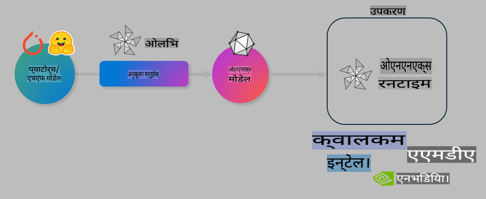

# प्रयोगशाला: डिभाइसमा इन्फरेन्सका लागि AI मोडेलहरूलाई अनुकूल बनाउनुहोस्

## परिचय 

> [!IMPORTANT]
> यो प्रयोगशाला **Nvidia A10 वा A100 GPU** आवश्यक पर्दछ, जसमा सम्बन्धित ड्राइभरहरू र CUDA टूलकिट (संस्करण 12+) स्थापित भएको हुनुपर्छ।

> [!NOTE]
> यो **35-मिनेटको** प्रयोगशाला हो, जसले OLIVE प्रयोग गरी डिभाइसमा इन्फरेन्सका लागि मोडेलहरू अनुकूल बनाउने मुख्य अवधारणाहरूमा व्यावहारिक अनुभव दिन्छ।

## सिकाइ उद्देश्यहरू

यो प्रयोगशाला समाप्त गर्दा, तपाईं OLIVE प्रयोग गरी निम्न गर्न सक्षम हुनुहुनेछ:

- AWQ क्वान्टाइजेसन विधि प्रयोग गरी AI मोडेल क्वान्टाइज गर्नुहोस्।
- विशेष कार्यका लागि AI मोडेललाई फाइन-ट्युन गर्नुहोस्।
- ONNX Runtime मा कुशल डिभाइस इन्फरेन्सका लागि LoRA एडेप्टरहरू (फाइन-ट्युन गरिएको मोडेल) निर्माण गर्नुहोस्।

### Olive के हो

Olive (*O*NNX *live*) एउटा मोडेल अनुकूलन उपकरण हो, जससँग CLI (कमाण्ड लाइन इन्टरफेस) छ, जसले तपाईंलाई ONNX Runtime +++https://onnxruntime.ai+++ का लागि मोडेलहरू तयार पार्न सक्षम बनाउँछ।



Olive को इनपुट प्रायः PyTorch वा Hugging Face मोडेल हुन्छ र आउटपुट अनुकूलित ONNX मोडेल हुन्छ, जुन ONNX Runtime चलिरहेको डिभाइस (डिप्लोयमेन्ट टार्गेट) मा कार्यान्वयन गरिन्छ। Olive ले डिप्लोयमेन्ट टार्गेटको AI एक्सेलेरेटर (NPU, GPU, CPU) लाई हार्डवेयर विक्रेताजस्तै Qualcomm, AMD, Nvidia वा Intel द्वारा प्रदान गरिन्छ, त्यसका लागि मोडेल अनुकूल बनाउँछ।

Olive ले *workflow* कार्यान्वयन गर्दछ, जुन व्यक्तिगत मोडेल अनुकूलन कार्यहरूको क्रमबद्ध श्रृंखला (*passes*) हो - उदाहरणका लागि: मोडेल कम्प्रेसन, ग्राफ क्याप्चर, क्वान्टाइजेसन, ग्राफ अनुकूलन। प्रत्येक पाससँग सेटिङहरू हुन्छन्, जसलाई सटीकता र लेटेन्सी जस्ता मेट्रिक्सहरूलाई अनुकूल बनाउन ट्युन गर्न सकिन्छ। Olive ले खोज एल्गोरिदम प्रयोग गरी प्रत्येक पासलाई स्वत: ट्युन गर्न खोज रणनीति अपनाउँछ।

#### Olive का फाइदाहरू

- ग्राफ अनुकूलन, कम्प्रेसन र क्वान्टाइजेसनका विभिन्न प्रविधिहरूमा ट्रायल-एण्ड-एररको झन्झट र समय घटाउनुहोस्। तपाईंको गुणस्तर र प्रदर्शन मापदण्डहरू परिभाषित गर्नुहोस् र Olive ले तपाईंका लागि उत्कृष्ट मोडेल स्वत: फेला पार्नेछ।
- **40+ निर्मित मोडेल अनुकूलन कम्पोनेन्टहरू**, जसमा क्वान्टाइजेसन, कम्प्रेसन, ग्राफ अनुकूलन र फाइन-ट्युनिङका अत्याधुनिक प्रविधिहरू समावेश छन्।
- सामान्य मोडेल अनुकूलन कार्यहरूका लागि **सजिलो CLI**। उदाहरणका लागि, olive quantize, olive auto-opt, olive finetune।
- मोडेल प्याकेजिङ र डिप्लोयमेन्ट समावेश।
- **मल्टिपल LoRA सर्भिङ** को लागि मोडेलहरू निर्माण गर्न समर्थन गर्दछ।
- YAML/JSON प्रयोग गरी मोडेल अनुकूलन र डिप्लोयमेन्ट कार्यहरूको व्यवस्थापन गर्न workflow निर्माण गर्नुहोस्।
- **Hugging Face** र **Azure AI** एकीकरण।
- **क्यासिङ** प्रविधि निर्मित छ, जसले **खर्च बचत** गर्दछ।

## प्रयोगशाला निर्देशनहरू
> [!NOTE]
> कृपया सुनिश्चित गर्नुहोस् कि तपाईंले Azure AI Hub र प्रोजेक्टलाई प्रावधान गरिसक्नुभएको छ र Lab 1 अनुसार तपाईंको A100 कम्प्युट सेटअप गर्नुभएको छ।

### चरण 0: Azure AI Compute मा जडान गर्नुहोस्

तपाईं **VS Code** को रिमोट सुविधा प्रयोग गरी Azure AI कम्प्युटमा जडान गर्नुहुनेछ।

1. तपाईंको **VS Code** डेस्कटप एप्लिकेसन खोल्नुहोस्:
1. **Shift+Ctrl+P** प्रयोग गरी **कमाण्ड प्यालेट** खोल्नुहोस्।
1. कमाण्ड प्यालेटमा **AzureML - remote: Connect to compute instance in New Window** खोज्नुहोस्।
1. स्क्रीनमा देखिएका निर्देशनहरू पालना गरी कम्प्युटमा जडान गर्नुहोस्। यसमा तपाईंले Lab 1 मा सेटअप गरिएको Azure Subscription, Resource Group, Project र Compute नाम चयन गर्नु पर्नेछ।
1. Azure ML Compute नोडमा जडान भएपछि यो **VS Code को तल बायाँ भागमा** देखिनेछ `><Azure ML: Compute Name`

### चरण 1: यो रिपोजिटरी क्लोन गर्नुहोस्

VS Code मा, **Ctrl+J** प्रयोग गरी नयाँ टर्मिनल खोल्नुहोस् र यो रिपोजिटरी क्लोन गर्नुहोस्:

टर्मिनलमा तपाईंले निम्न प्रम्प्ट देख्नुहुनेछ:

```
azureuser@computername:~/cloudfiles/code$ 
```
रिपोजिटरी क्लोन गर्नुहोस्:

```bash
cd ~/localfiles
git clone https://github.com/microsoft/phi-3cookbook.git
```

### चरण 2: VS Code मा फोल्डर खोल्नुहोस्

सम्बन्धित फोल्डरमा VS Code खोल्न टर्मिनलमा निम्न कमाण्ड कार्यान्वयन गर्नुहोस्, जसले नयाँ विन्डो खोल्नेछ:

```bash
code phi-3cookbook/code/04.Finetuning/Olive-lab
```

वैकल्पिक रूपमा, तपाईं **File** > **Open Folder** चयन गरेर फोल्डर खोल्न सक्नुहुन्छ।

### चरण 3: निर्भरताहरू स्थापना गर्नुहोस्

Azure AI Compute Instance मा VS Code मा टर्मिनल विन्डो खोल्नुहोस् (सुझाव: **Ctrl+J**) र निर्भरताहरू स्थापना गर्न निम्न कमाण्डहरू कार्यान्वयन गर्नुहोस्:

```bash
conda create -n olive-ai python=3.11 -y
conda activate olive-ai
pip install -r requirements.txt
az extension remove -n azure-cli-ml
az extension add -n ml
```

> [!NOTE]
> सबै निर्भरताहरू स्थापना गर्न ~5 मिनेट लाग्छ।

यस प्रयोगशालामा तपाईं मोडेलहरू Azure AI Model catalog मा डाउनलोड र अपलोड गर्नुहुनेछ। त्यसैले, मोडेल क्याटलगमा पहुँच गर्न, तपाईंले Azure मा लगइन गर्नु पर्नेछ:

```bash
az login
```

> [!NOTE]
> लगइन गर्दा तपाईंले आफ्नो सब्स्क्रिप्सन चयन गर्नु पर्नेछ। यो प्रयोगशालाका लागि प्रदान गरिएको सब्स्क्रिप्सन सुनिश्चित गर्नुहोस्।

### चरण 4: Olive कमाण्डहरू कार्यान्वयन गर्नुहोस्

Azure AI Compute Instance मा VS Code मा टर्मिनल विन्डो खोल्नुहोस् (सुझाव: **Ctrl+J**) र सुनिश्चित गर्नुहोस् कि `olive-ai` कन्डा वातावरण सक्रिय छ:

```bash
conda activate olive-ai
```

पछिका Olive कमाण्डहरू कमाण्ड लाइनमा कार्यान्वयन गर्नुहोस्।

1. **डेटा निरीक्षण गर्नुहोस्:** यस उदाहरणमा, तपाईं Phi-3.5-Mini मोडेललाई यात्रा सम्बन्धी प्रश्नहरूको उत्तर दिन विशेष बनाउने गरी फाइन-ट्युन गर्नुहुनेछ। तलको कोडले डेटासेटका प्रारम्भिक केही रेकर्डहरू प्रदर्शन गर्दछ, जुन JSON lines ढाँचामा छन्:

    ```bash
    head data/data_sample_travel.jsonl
    ```
1. **मोडेल क्वान्टाइज गर्नुहोस्:** मोडेललाई प्रशिक्षण गर्नु अघि, तपाईंले Active Aware Quantization (AWQ) नामक प्रविधि प्रयोग गरी निम्न कमाण्डसँग क्वान्टाइज गर्नुहुनेछ +++https://arxiv.org/abs/2306.00978+++। AWQ मोडेलका वजनहरूलाई इन्फरेन्सको क्रममा उत्पन्न हुने एक्टिभेसनहरूलाई ध्यानमा राखेर क्वान्टाइज गर्छ। यसले परम्परागत वजन क्वान्टाइजेसन विधिहरूको तुलनामा मोडेलको सटीकता राम्रोसँग संरक्षण गर्न मद्दत गर्दछ।

    ```bash
    olive quantize \
       --model_name_or_path microsoft/Phi-3.5-mini-instruct \
       --trust_remote_code \
       --algorithm awq \
       --output_path models/phi/awq \
       --log_level 1
    ```
    
    AWQ क्वान्टाइजेसन पूरा गर्न **~8 मिनेट** लाग्छ, जसले **मोडेल आकार ~7.5GB बाट ~2.5GB मा घटाउँछ**।
   
    यस प्रयोगशालामा, हामी Hugging Face बाट मोडेल इनपुट गर्ने विधि देखाउँदैछौं (उदाहरणका लागि: `microsoft/Phi-3.5-mini-instruct`). However, Olive also allows you to input models from the Azure AI catalog by updating the `model_name_or_path` argument to an Azure AI asset ID (for example:  `azureml://registries/azureml/models/Phi-3.5-mini-instruct/versions/4`). 

1. **Train the model:** Next, the `olive finetune` कमाण्डले क्वान्टाइज गरिएको मोडेललाई फाइन-ट्युन गर्छ। मोडेललाई फाइन-ट्युन गर्नु अघि क्वान्टाइज गर्दा सटीकता राम्रो हुन्छ किनभने फाइन-ट्युन प्रक्रियाले क्वान्टाइजेसनबाट आएको केही हानि पुन: प्राप्त गर्छ।

    ```bash
    olive finetune \
        --method lora \
        --model_name_or_path models/phi/awq \
        --data_files "data/data_sample_travel.jsonl" \
        --data_name "json" \
        --text_template "<|user|>\n{prompt}<|end|>\n<|assistant|>\n{response}<|end|>" \
        --max_steps 100 \
        --output_path ./models/phi/ft \
        --log_level 1
    ```
    
    फाइन-ट्युनिङ (१०० चरणहरू सहित) पूरा गर्न **~6 मिनेट** लाग्छ।

1. **अनुकूल बनाउनुहोस्:** मोडेल प्रशिक्षित भएपछि, तपाईं Olive को `auto-opt` command, which will capture the ONNX graph and automatically perform a number of optimizations to improve the model performance for CPU by compressing the model and doing fusions. It should be noted, that you can also optimize for other devices such as NPU or GPU by just updating the `--device` and `--provider` तर्कहरू प्रयोग गरी मोडेललाई अनुकूल बनाउनुहुनेछ - तर यो प्रयोगशालाका लागि हामी CPU प्रयोग गर्नेछौं।

    ```bash
    olive auto-opt \
       --model_name_or_path models/phi/ft/model \
       --adapter_path models/phi/ft/adapter \
       --device cpu \
       --provider CPUExecutionProvider \
       --use_ort_genai \
       --output_path models/phi/onnx-ao \
       --log_level 1
    ```
    
    अनुकूलन पूरा गर्न **~5 मिनेट** लाग्छ।

### चरण 5: मोडेल इन्फरेन्स द्रुत परीक्षण

मोडेल इन्फरेन्स परीक्षण गर्न, तपाईंको फोल्डरमा **app.py** नामक Python फाइल सिर्जना गर्नुहोस् र निम्न कोड कपी-पेस्ट गर्नुहोस्:

```python
import onnxruntime_genai as og
import numpy as np

print("loading model and adapters...", end="", flush=True)
model = og.Model("models/phi/onnx-ao/model")
adapters = og.Adapters(model)
adapters.load("models/phi/onnx-ao/model/adapter_weights.onnx_adapter", "travel")
print("DONE!")

tokenizer = og.Tokenizer(model)
tokenizer_stream = tokenizer.create_stream()

params = og.GeneratorParams(model)
params.set_search_options(max_length=100, past_present_share_buffer=False)
user_input = "what is the best thing to see in chicago"
params.input_ids = tokenizer.encode(f"<|user|>\n{user_input}<|end|>\n<|assistant|>\n")

generator = og.Generator(model, params)

generator.set_active_adapter(adapters, "travel")

print(f"{user_input}")

while not generator.is_done():
    generator.compute_logits()
    generator.generate_next_token()

    new_token = generator.get_next_tokens()[0]
    print(tokenizer_stream.decode(new_token), end='', flush=True)

print("\n")
```

कोड कार्यान्वयन गर्न:

```bash
python app.py
```

### चरण 6: मोडेल Azure AI मा अपलोड गर्नुहोस्

मोडेललाई Azure AI मोडेल रिपोजिटरीमा अपलोड गर्दा, यो मोडेल तपाईंको विकास टोलीका अन्य सदस्यहरूसँग साझा गर्न सकिन्छ र मोडेलको संस्करण नियन्त्रण पनि गर्न सकिन्छ। मोडेल अपलोड गर्न निम्न कमाण्ड चलाउनुहोस्:

> [!NOTE]
> `{}` placeholders with the name of your resource group and Azure AI Project Name. 

To find your resource group `"resourceGroup" र Azure AI प्रोजेक्ट नाम अपडेट गर्नुहोस् र निम्न कमाण्ड चलाउनुहोस्:

```
az ml workspace show
```

वा +++ai.azure.com+++ मा गएर **management center**, **project**, **overview** चयन गर्नुहोस्।

`{}` प्लेसहोल्डरलाई तपाईंको Resource Group र Azure AI Project Name का नामले अपडेट गर्नुहोस्।

```bash
az ml model create \
    --name ft-for-travel \
    --version 1 \
    --path ./models/phi/onnx-ao \
    --resource-group {RESOURCE_GROUP_NAME} \
    --workspace-name {PROJECT_NAME}
```
तपाईंले आफ्नो अपलोड गरिएको मोडेल देख्न सक्नुहुनेछ र https://ml.azure.com/model/list मा आफ्नो मोडेल डिप्लोय गर्न सक्नुहुनेछ।

**अस्वीकरण**:  
यो दस्तावेज मेसिन-आधारित एआई अनुवाद सेवाहरू प्रयोग गरेर अनुवाद गरिएको हो। यद्यपि हामी शुद्धताका लागि प्रयास गर्छौं, कृपया जानकार रहनुहोस् कि स्वचालित अनुवादहरूमा त्रुटिहरू वा अशुद्धताहरू हुन सक्छ। मूल भाषामा रहेको मूल दस्तावेजलाई आधिकारिक स्रोत मानिनुपर्छ। महत्वपूर्ण जानकारीका लागि, व्यावसायिक मानव अनुवाद सिफारिस गरिन्छ। यो अनुवादको प्रयोगबाट उत्पन्न कुनै पनि गलतफहमी वा गलत व्याख्याको लागि हामी जिम्मेवार हुने छैनौं।