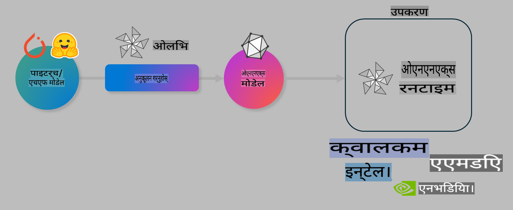

# प्रयोगशाला। उपकरणमा AI मोडेलहरूको इन्फरेन्सलाई अनुकूलन गर्नुहोस्

## परिचय

> [!IMPORTANT]
> यो प्रयोगशालाका लागि **Nvidia A10 वा A100 GPU** र सम्बन्धित ड्राइभरहरू तथा CUDA टूलकिट (संस्करण 12+) आवश्यक छ।

> [!NOTE]
> यो एक **35-मिनेट** को प्रयोगशाला हो जसले तपाईंलाई OLIVE प्रयोग गरेर उपकरणमा इन्फरेन्सका लागि मोडेल अनुकूलन गर्ने मुख्य अवधारणाहरूमा व्यावहारिक परिचय दिनेछ।

## सिकाइ उद्देश्यहरू

यो प्रयोगशाला समाप्त गर्दा, तपाईं OLIVE प्रयोग गरेर निम्न कार्यहरू गर्न सक्षम हुनुहुनेछ:

- AWQ क्वान्टाइजेसन विधि प्रयोग गरेर AI मोडेल क्वान्टाइज गर्नुहोस्।
- विशेष कार्यका लागि AI मोडेललाई फाइन-ट्युन गर्नुहोस्।
- ONNX Runtime मा प्रभावकारी उपकरण-आधारित इन्फरेन्सका लागि LoRA एडाप्टरहरू (फाइन-ट्युन गरिएको मोडेल) उत्पन्न गर्नुहोस्।

### Olive के हो

Olive (*O*NNX *live*) एक मोडेल अनुकूलन टूलकिट हो जसमा CLI पनि समावेश छ। यसले तपाईंलाई ONNX Runtime +++https://onnxruntime.ai+++ का लागि मोडेलहरू तयार गर्न सक्षम बनाउँछ।



Olive मा इनपुट प्रायः PyTorch वा Hugging Face मोडेल हुन्छ, र आउटपुट एक अनुकूलित ONNX मोडेल हो जसलाई उपकरण (डिप्लोयमेन्ट टार्गेट) मा चलाइन्छ। Olive मोडेललाई हार्डवेयर विक्रेता जस्तै Qualcomm, AMD, Nvidia वा Intel द्वारा प्रदान गरिएको उपकरणको AI एक्सेलेरेटर (NPU, GPU, CPU) का लागि अनुकूलित गर्दछ।

Olive ले *workflow* कार्यान्वयन गर्दछ, जसमा मोडेल अनुकूलन कार्यहरूको क्रमबद्ध शृंखला हुन्छ, जसलाई *passes* भनिन्छ। उदाहरणका लागि: मोडेल कम्प्रेसन, ग्राफ क्याप्चर, क्वान्टाइजेसन, ग्राफ अनुकूलन। प्रत्येक पाससँग यस्ता पैरामीटरहरू हुन्छन् जसलाई उत्तम मेट्रिक्स (उदाहरणका लागि, सटीकता र लेटेंसी) प्राप्त गर्न ट्युन गर्न सकिन्छ। Olive ले खोज एल्गोरिदम प्रयोग गरेर हरेक पासलाई स्वतः ट्युन गर्दछ।

#### Olive का फाइदाहरू

- **समय र निराशा घटाउनुहोस्**: विभिन्न अनुकूलन प्रविधिहरूको म्यानुअल प्रयोगबाट बच्न Olive ले तपाईंको गुणस्तर र प्रदर्शन आवश्यकताहरूको आधारमा स्वतः उत्तम मोडेल फेला पार्छ।
- **40+ पूर्वनिर्मित मोडेल अनुकूलन कम्पोनेन्टहरू**: क्वान्टाइजेसन, कम्प्रेसन, ग्राफ अनुकूलन र फाइन-ट्युनिङका अत्याधुनिक प्रविधिहरू समावेश।
- **सजिलो CLI**: सामान्य मोडेल अनुकूलन कार्यहरूका लागि। उदाहरणका लागि, olive quantize, olive auto-opt, olive finetune।
- मोडेल प्याकेजिङ र डिप्लोयमेन्ट समावेश।
- **Multi LoRA serving** का लागि मोडेल उत्पन्न गर्न समर्थन।
- YAML/JSON प्रयोग गरेर कार्यप्रवाह निर्माण गर्नुहोस्।
- **Hugging Face** र **Azure AI** एकीकरण।
- **क्यासिङ** मेकानिजमले **खर्च बचत**।

## प्रयोगशाला निर्देशनहरू

> [!NOTE]
> कृपया सुनिश्चित गर्नुहोस् कि तपाईंले आफ्नो Azure AI हब, प्रोजेक्ट, र A100 कम्प्युटरको सेटअप Lab 1 अनुसार गरेका हुनुहुन्छ।

### चरण 0: Azure AI Compute सँग जडान गर्नुहोस्

तपाईं **VS Code** को रिमोट फिचर प्रयोग गरेर Azure AI कम्प्युटरमा जडान गर्नुहुनेछ।

1. आफ्नो **VS Code** डेस्कटप एप्लिकेसन खोल्नुहोस्:
1. **Shift+Ctrl+P** प्रयोग गरेर **कमाण्ड प्यालेट** खोल्नुहोस्।
1. कमाण्ड प्यालेटमा **AzureML - remote: Connect to compute instance in New Window** खोज्नुहोस्।
1. स्क्रीनमा देखाइएका निर्देशनहरू अनुसरण गर्नुहोस्। यसले Azure सब्सक्रिप्सन, रिसोर्स ग्रुप, प्रोजेक्ट, र कम्प्युटर नाम चयन गर्न समावेश गर्दछ।
1. Azure ML कम्प्युटरमा जडान भएपछि, यो **VS Code को तल बायाँ** मा देखिनेछ। `><Azure ML: Compute Name`

### चरण 1: यो रिपोजिटरी क्लोन गर्नुहोस्

VS Code मा, **Ctrl+J** प्रयोग गरेर नयाँ टर्मिनल खोल्नुहोस् र यो रिपोजिटरी क्लोन गर्नुहोस्:

टर्मिनलमा तपाईंले निम्न देख्नुहुनेछ:

```
azureuser@computername:~/cloudfiles/code$ 
```
रिपोजिटरी क्लोन गर्नुहोस्:

```bash
cd ~/localfiles
git clone https://github.com/microsoft/phi-3cookbook.git
```

### चरण 2: फोल्डर खोल्नुहोस्

VS Code मा सम्बन्धित फोल्डर खोल्न टर्मिनलमा निम्न कमाण्ड चलाउनुहोस्। यसले नयाँ विन्डो खोल्नेछ:

```bash
code phi-3cookbook/code/04.Finetuning/Olive-lab
```

वैकल्पिक रूपमा, तपाईं **File** > **Open Folder** बाट पनि फोल्डर खोल्न सक्नुहुन्छ।

### चरण 3: Dependencies

Azure AI Compute Instance मा VS Code को टर्मिनल (टिप: **Ctrl+J**) खोल्नुहोस् र निम्न कमाण्डहरू dependencies इन्स्टल गर्न चलाउनुहोस्:

```bash
conda create -n olive-ai python=3.11 -y
conda activate olive-ai
pip install -r requirements.txt
az extension remove -n azure-cli-ml
az extension add -n ml
```

> [!NOTE]
> सबै dependencies इन्स्टल गर्न ~5 मिनेट लाग्छ।

यस प्रयोगशालामा, तपाईं Azure AI Model catalog मा मोडेलहरू डाउनलोड र अपलोड गर्नुहुनेछ। त्यसका लागि Azure मा लगइन गर्नुहोस्:

```bash
az login
```

> [!NOTE]
> लगइन गर्दा तपाईंलाई आफ्नो सब्सक्रिप्सन चयन गर्न सोधिनेछ। सुनिश्चित गर्नुहोस् कि तपाईंले यो प्रयोगशालाका लागि प्रदान गरिएको सब्सक्रिप्सन सेट गर्नुभएको छ।

### चरण 4: Olive कमाण्डहरू चलाउनुहोस्

Azure AI Compute Instance मा टर्मिनल खोल्नुहोस् (टिप: **Ctrl+J**) र सुनिश्चित गर्नुहोस् कि `olive-ai` कन्डा वातावरण सक्रिय छ:

```bash
conda activate olive-ai
```

अहिले, निम्न Olive कमाण्डहरू कमाण्ड लाइनमा चलाउनुहोस्।

1. **डेटा निरीक्षण गर्नुहोस्:** यस उदाहरणमा, तपाईं Phi-3.5-Mini मोडेललाई यात्रा सम्बन्धी प्रश्नहरूको उत्तर दिन विशेषज्ञ बनाउन फाइन-ट्युन गर्नुहुनेछ। तलको कोडले डेटा सेटका केही रेकर्डहरू प्रदर्शन गर्दछ, जुन JSON lines ढाँचामा छन्:

    ```bash
    head data/data_sample_travel.jsonl
    ```
1. **मोडेल क्वान्टाइज गर्नुहोस्:** मोडेल फाइन-ट्युन गर्नुअघि, तपाईं Active Aware Quantization (AWQ) +++https://arxiv.org/abs/2306.00978+++ प्रविधि प्रयोग गरेर क्वान्टाइज गर्नुहोस्। AWQ ले इन्फरेन्सको क्रममा उत्पादन हुने सक्रियताहरूलाई ध्यानमा राखेर मोडेलका तौलहरू क्वान्टाइज गर्छ। यसले परम्परागत तौल क्वान्टाइजेसन विधिहरूको तुलनामा मोडेल सटीकता राम्रोसँग कायम राख्न मद्दत गर्दछ।

    ```bash
    olive quantize \
       --model_name_or_path microsoft/Phi-3.5-mini-instruct \
       --trust_remote_code \
       --algorithm awq \
       --output_path models/phi/awq \
       --log_level 1
    ```
    
    यो प्रक्रिया **~8 मिनेट** लाग्छ र **मोडेलको साइज ~7.5GB बाट ~2.5GB मा घटाउँछ**।
   
   यस प्रयोगशालामा, Hugging Face बाट मोडेल इनपुट गर्ने तरिका देखाइन्छ। उदाहरणका लागि: `microsoft/Phi-3.5-mini-instruct`). However, Olive also allows you to input models from the Azure AI catalog by updating the `model_name_or_path` argument to an Azure AI asset ID (for example:  `azureml://registries/azureml/models/Phi-3.5-mini-instruct/versions/4`). 

1. **Train the model:** Next, the `olive finetune` कमाण्डले क्वान्टाइज गरिएको मोडेल फाइन-ट्युन गर्छ। क्वान्टाइजेसन *पछि* फाइन-ट्युन गर्नुभन्दा पहिले क्वान्टाइज गर्दा सटीकता राम्रो हुन्छ।

    ```bash
    olive finetune \
        --method lora \
        --model_name_or_path models/phi/awq \
        --data_files "data/data_sample_travel.jsonl" \
        --data_name "json" \
        --text_template "<|user|>\n{prompt}<|end|>\n<|assistant|>\n{response}<|end|>" \
        --max_steps 100 \
        --output_path ./models/phi/ft \
        --log_level 1
    ```
    
    यो प्रक्रिया **~6 मिनेट** लाग्छ (100 स्टेपहरूमा)।

1. **अनुकूलन गर्नुहोस्:** मोडेललाई प्रशिक्षण गरेपछि, Olive को `auto-opt` command, which will capture the ONNX graph and automatically perform a number of optimizations to improve the model performance for CPU by compressing the model and doing fusions. It should be noted, that you can also optimize for other devices such as NPU or GPU by just updating the `--device` and `--provider` तर्कहरू प्रयोग गरेर मोडेल अनुकूलन गर्नुहोस् - यस प्रयोगशालाका लागि हामी CPU प्रयोग गर्नेछौं।

    ```bash
    olive auto-opt \
       --model_name_or_path models/phi/ft/model \
       --adapter_path models/phi/ft/adapter \
       --device cpu \
       --provider CPUExecutionProvider \
       --use_ort_genai \
       --output_path models/phi/onnx-ao \
       --log_level 1
    ```
    
    यो प्रक्रिया **~5 मिनेट** लाग्छ।

### चरण 5: मोडेल इन्फरेन्स परीक्षण

मोडेल इन्फरेन्स परीक्षण गर्न, आफ्नो फोल्डरमा **app.py** नामक Python फाइल सिर्जना गर्नुहोस् र तलको कोड कपी-पेस्ट गर्नुहोस्:

```python
import onnxruntime_genai as og
import numpy as np

print("loading model and adapters...", end="", flush=True)
model = og.Model("models/phi/onnx-ao/model")
adapters = og.Adapters(model)
adapters.load("models/phi/onnx-ao/model/adapter_weights.onnx_adapter", "travel")
print("DONE!")

tokenizer = og.Tokenizer(model)
tokenizer_stream = tokenizer.create_stream()

params = og.GeneratorParams(model)
params.set_search_options(max_length=100, past_present_share_buffer=False)
user_input = "what is the best thing to see in chicago"
params.input_ids = tokenizer.encode(f"<|user|>\n{user_input}<|end|>\n<|assistant|>\n")

generator = og.Generator(model, params)

generator.set_active_adapter(adapters, "travel")

print(f"{user_input}")

while not generator.is_done():
    generator.compute_logits()
    generator.generate_next_token()

    new_token = generator.get_next_tokens()[0]
    print(tokenizer_stream.decode(new_token), end='', flush=True)

print("\n")
```

कोड चलाउन:

```bash
python app.py
```

### चरण 6: मोडेल Azure AI मा अपलोड गर्नुहोस्

Azure AI मोडेल रिपोजिटरीमा मोडेल अपलोड गर्दा, यो अन्य विकास टोलीका सदस्यहरूसँग साझा गर्न सकिन्छ र संस्करण नियन्त्रण पनि सम्भव बनाउँछ। मोडेल अपलोड गर्न निम्न कमाण्ड चलाउनुहोस्:

> [!NOTE]
> `{}`` placeholders with the name of your resource group and Azure AI Project Name. 

To find your resource group ` "resourceGroup" र Azure AI Project नाम अद्यावधिक गर्नुहोस् र निम्न कमाण्ड चलाउनुहोस्:

```
az ml workspace show
```

वा +++ai.azure.com+++ मा गएर **management center**, **project**, **overview** चयन गर्न सक्नुहुन्छ।

`{}` प्लेसहोल्डरहरूलाई आफ्नो रिसोर्स ग्रुप र Azure AI Project Name को नामले अद्यावधिक गर्नुहोस्।

```bash
az ml model create \
    --name ft-for-travel \
    --version 1 \
    --path ./models/phi/onnx-ao \
    --resource-group {RESOURCE_GROUP_NAME} \
    --workspace-name {PROJECT_NAME}
```
तपाईं आफ्नो अपलोड गरिएको मोडेल देख्न सक्नुहुन्छ र https://ml.azure.com/model/list मा डिप्लोय गर्न सक्नुहुन्छ।

**अस्वीकरण**:  
यो दस्तावेज मेसिन-आधारित एआई अनुवाद सेवाहरू प्रयोग गरी अनुवाद गरिएको हो। यद्यपि हामी शुद्धताको लागि प्रयास गर्छौं, कृपया जानकार हुनुहोस् कि स्वचालित अनुवादहरूले त्रुटिहरू वा अशुद्धताहरू समावेश गर्न सक्छ। यसको मौलिक भाषामा रहेको मूल दस्तावेजलाई आधिकारिक स्रोत मानिनुपर्छ। महत्वपूर्ण जानकारीका लागि, व्यावसायिक मानव अनुवादको सिफारिस गरिन्छ। यस अनुवादको प्रयोगबाट उत्पन्न हुने कुनै पनि गलतफहमी वा गलत व्याख्याको लागि हामी जिम्मेवार हुनेछैनौं।