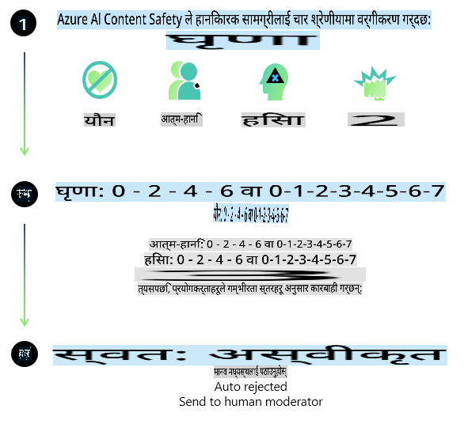
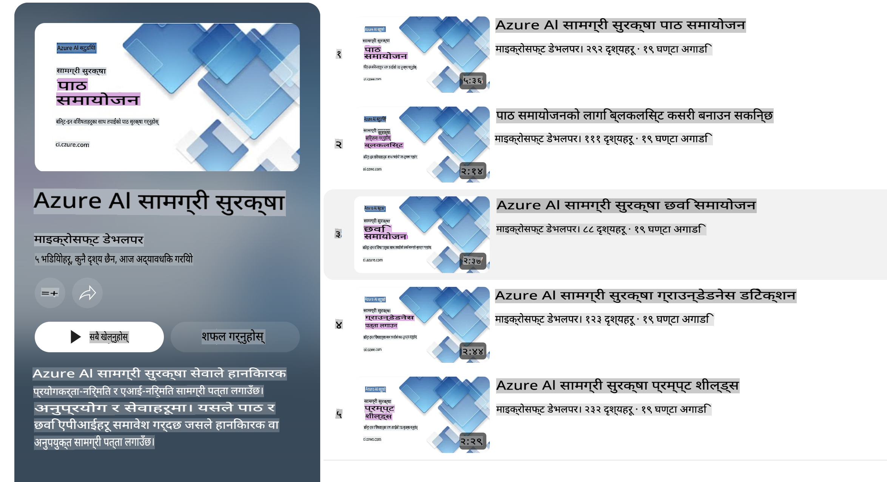

# Phi मोडेलहरूको लागि एआई सुरक्षा  
Phi मोडेलहरूको परिवार [Microsoft Responsible AI Standard](https://query.prod.cms.rt.microsoft.com/cms/api/am/binary/RE5cmFl) अनुसार विकास गरिएको हो, जुन कम्पनीभरि लागू हुने आवश्यकताहरूको एक सेट हो। यसमा जिम्मेवारी, पारदर्शिता, निष्पक्षता, विश्वसनीयता र सुरक्षा, गोपनीयता र समावेशिता जस्ता छ वटा सिद्धान्तहरू समावेश छन्, जसले [Microsoft को Responsible AI सिद्धान्तहरू](https://www.microsoft.com/ai/responsible-ai) निर्माण गर्छ।  

पहिलेका Phi मोडेलहरूको जस्तै, यसमा बहुआयामिक सुरक्षा मूल्याङ्कन र सुरक्षा-पश्चात प्रशिक्षण दृष्टिकोण अपनाइएको छ। यस संस्करणको बहुभाषिक क्षमताहरूलाई ध्यानमा राखेर थप उपायहरू लिइएका छन्। हाम्रो सुरक्षा प्रशिक्षण र मूल्याङ्कनहरूको दृष्टिकोण, जसमा विभिन्न भाषाहरू र जोखिम कोटीहरूमा परीक्षण समावेश छ, [Phi Safety Post-Training Paper](https://arxiv.org/abs/2407.13833) मा वर्णन गरिएको छ। यद्यपि Phi मोडेलहरूले यस दृष्टिकोणबाट फाइदा लिन्छन्, विकासकर्ताहरूले आफ्नो विशेष प्रयोगको केस र सांस्कृतिक तथा भाषिक सन्दर्भसँग सम्बन्धित जोखिमहरूलाई म्याप, मापन, र न्यूनीकरण गर्ने जिम्मेवार एआई अभ्यासहरू लागू गर्नुपर्छ।  

## उत्तम अभ्यासहरू  

अन्य मोडेलहरूको जस्तै, Phi मोडेलहरूको परिवारले कहिलेकाहीँ अन्यायपूर्ण, अविश्वसनीय, वा आपत्तिजनक व्यवहार गर्न सक्छ।  

SLM र LLM का केही सीमित व्यवहारहरू जसको बारेमा तपाईंले सचेत रहनुपर्नेछ:  

- **सेवाको गुणस्तर:** Phi मोडेलहरू मुख्य रूपमा अंग्रेजी पाठमा आधारित भएर प्रशिक्षित गरिएको छ। अंग्रेजी बाहेकका भाषाहरूमा प्रदर्शन कमजोर हुन सक्छ। प्रशिक्षण डाटामा कम प्रतिनिधित्व भएका अंग्रेजीका भिन्नताहरूले मानक अमेरिकी अंग्रेजीभन्दा कमजोर प्रदर्शन देखाउन सक्छ।  
- **हानिको प्रतिनिधित्व र रूढीवादी धारणा कायम राख्ने:** यी मोडेलहरूले मानिसहरूको समूहलाई अधिक वा कम प्रतिनिधित्व गर्न सक्छ, केही समूहहरूको प्रतिनिधित्व मेटाउन सक्छ, वा अपमानजनक वा नकारात्मक रूढीवादी धारणा बलियो बनाउन सक्छ। सुरक्षा-पश्चात प्रशिक्षण हुँदासमेत, प्रशिक्षण डाटामा विभिन्न समूहहरूको भिन्न स्तरको प्रतिनिधित्व वा वास्तविक संसारका ढाँचाहरू र सामाजिक पूर्वाग्रहहरू प्रतिबिम्बित गर्ने नकारात्मक रूढीवादी धारणा भएका उदाहरणहरूको कारणले गर्दा यी सीमाहरू रहन सक्छन्।  
- **अप्रासंगिक वा आपत्तिजनक सामग्री:** यी मोडेलहरूले अन्य प्रकारका अप्रासंगिक वा आपत्तिजनक सामग्री उत्पादन गर्न सक्छन्, जसले गर्दा विशेष प्रयोगको केसका लागि थप न्यूनीकरण बिना संवेदनशील सन्दर्भहरूमा यसलाई प्रयोग गर्न उपयुक्त नहुन सक्छ।  
- **जानकारीको विश्वसनीयता:** भाषा मोडेलहरूले कहिलेकाहीँ अर्थहीन सामग्री उत्पादन गर्न सक्छन् वा यस्तो सामग्री निर्माण गर्न सक्छन् जुन तर्कसंगत जस्तो सुनिन्छ तर गलत वा पुरानो छ।  
- **कोडको सीमित दायरा:** Phi-3 को प्रशिक्षण डाटाको धेरैजसो हिस्सा Python मा आधारित छ र "typing, math, random, collections, datetime, itertools" जस्ता सामान्य प्याकेजहरू प्रयोग गर्छ। यदि मोडेलले अन्य प्याकेजहरू वा अन्य भाषाहरूमा स्क्रिप्टहरू प्रयोग गर्ने Python स्क्रिप्टहरू उत्पन्न गर्छ भने, हामी प्रयोगकर्ताहरूलाई सबै API प्रयोगहरू म्यानुअली जाँच गर्न कडा सिफारिस गर्छौं।  

विकासकर्ताहरूले जिम्मेवार एआई अभ्यासहरू लागू गर्नुपर्छ र निश्चित गर्नुपर्छ कि विशेष प्रयोगको केसले सम्बन्धित कानुन र नियमहरू (जस्तै, गोपनीयता, व्यापार, आदि) पालना गर्छ।  

## जिम्मेवार एआईका विचारहरू  

अन्य भाषा मोडेलहरूको जस्तै, Phi श्रृंखलाका मोडेलहरूले अन्यायपूर्ण, अविश्वसनीय, वा आपत्तिजनक व्यवहार गर्न सक्छ। सचेत रहनुपर्ने केही सीमित व्यवहारहरूमा समावेश छन्:  

**सेवाको गुणस्तर:** Phi मोडेलहरू मुख्य रूपमा अंग्रेजी पाठमा आधारित भएर प्रशिक्षित गरिएको छ। अंग्रेजी बाहेकका भाषाहरूमा प्रदर्शन कमजोर हुन सक्छ। प्रशिक्षण डाटामा कम प्रतिनिधित्व भएका अंग्रेजीका भिन्नताहरूले मानक अमेरिकी अंग्रेजीभन्दा कमजोर प्रदर्शन देखाउन सक्छ।  

**हानिको प्रतिनिधित्व र रूढीवादी धारणा कायम राख्ने:** यी मोडेलहरूले मानिसहरूको समूहलाई अधिक वा कम प्रतिनिधित्व गर्न सक्छ, केही समूहहरूको प्रतिनिधित्व मेटाउन सक्छ, वा अपमानजनक वा नकारात्मक रूढीवादी धारणा बलियो बनाउन सक्छ। सुरक्षा-पश्चात प्रशिक्षण हुँदासमेत, प्रशिक्षण डाटामा विभिन्न समूहहरूको भिन्न स्तरको प्रतिनिधित्व वा वास्तविक संसारका ढाँचाहरू र सामाजिक पूर्वाग्रहहरू प्रतिबिम्बित गर्ने नकारात्मक रूढीवादी धारणा भएका उदाहरणहरूको कारणले गर्दा यी सीमाहरू रहन सक्छन्।  

**अप्रासंगिक वा आपत्तिजनक सामग्री:** यी मोडेलहरूले अन्य प्रकारका अप्रासंगिक वा आपत्तिजनक सामग्री उत्पादन गर्न सक्छन्, जसले गर्दा विशेष प्रयोगको केसका लागि थप न्यूनीकरण बिना संवेदनशील सन्दर्भहरूमा यसलाई प्रयोग गर्न उपयुक्त नहुन सक्छ।  
**जानकारीको विश्वसनीयता:** भाषा मोडेलहरूले कहिलेकाहीँ अर्थहीन सामग्री उत्पादन गर्न सक्छन् वा यस्तो सामग्री निर्माण गर्न सक्छन् जुन तर्कसंगत जस्तो सुनिन्छ तर गलत वा पुरानो छ।  

**कोडको सीमित दायरा:** Phi-3 को प्रशिक्षण डाटाको धेरैजसो हिस्सा Python मा आधारित छ र "typing, math, random, collections, datetime, itertools" जस्ता सामान्य प्याकेजहरू प्रयोग गर्छ। यदि मोडेलले अन्य प्याकेजहरू वा अन्य भाषाहरूमा स्क्रिप्टहरू प्रयोग गर्ने Python स्क्रिप्टहरू उत्पन्न गर्छ भने, हामी प्रयोगकर्ताहरूलाई सबै API प्रयोगहरू म्यानुअली जाँच गर्न कडा सिफारिस गर्छौं।  

विकासकर्ताहरूले जिम्मेवार एआई अभ्यासहरू लागू गर्नुपर्छ र निश्चित गर्नुपर्छ कि विशेष प्रयोगको केसले सम्बन्धित कानुन र नियमहरू (जस्तै, गोपनीयता, व्यापार, आदि) पालना गर्छ। विचार गर्नुपर्ने महत्त्वपूर्ण क्षेत्रहरूमा समावेश छन्:  

**वितरण:** मोडेलहरू कानूनी स्थिति वा स्रोतहरू वा जीवनका अवसरहरूको वितरण (जस्तै, आवास, रोजगार, क्रेडिट, आदि) मा महत्त्वपूर्ण प्रभाव पार्न सक्ने परिदृश्यहरूको लागि उपयुक्त नहुन सक्छन्। यसका लागि थप मूल्याङ्कन र पूर्वाग्रह घटाउने प्रविधिहरू आवश्यक पर्छ।  

**उच्च-जोखिम परिदृश्यहरू:** विकासकर्ताहरूले मोडेलहरूको प्रयोग उच्च-जोखिम परिदृश्यहरूमा उपयुक्त छ कि छैन भन्ने मूल्याङ्कन गर्नुपर्छ, जहाँ अन्यायपूर्ण, अविश्वसनीय, वा आपत्तिजनक परिणाम अत्यधिक महँगो पर्न सक्छ वा हानी पुर्‍याउन सक्छ। यसमा संवेदनशील वा विशेषज्ञ डोमेनहरूमा सल्लाह प्रदान गर्ने समावेश छ, जहाँ सटीकता र विश्वसनीयता अत्यन्त महत्त्वपूर्ण छ (जस्तै, कानूनी वा स्वास्थ्य सल्लाह)। तैनातीको सन्दर्भ अनुसार अनुप्रयोग स्तरमा थप सुरक्षाहरू लागू गर्नुपर्छ।  

**भ्रामक जानकारी:** मोडेलहरूले गलत जानकारी उत्पादन गर्न सक्छन्। विकासकर्ताहरूले पारदर्शिताका लागि उत्तम अभ्यासहरू अनुसरण गर्नुपर्छ र अन्त-प्रयोगकर्ताहरूलाई जानकारी दिनुपर्छ कि उनीहरूले एआई प्रणालीसँग अन्तरक्रिया गरिरहेका छन्। अनुप्रयोग स्तरमा, विकासकर्ताहरूले प्रतिक्रिया संयन्त्रहरू र प्रयोग-केस विशिष्ट, सन्दर्भगत जानकारीमा प्रतिक्रियाहरू आधारित गर्न पाइपलाइनहरू निर्माण गर्न सक्छन्, जसलाई Retrieval Augmented Generation (RAG) भनिन्छ।  

**हानिकारक सामग्रीको उत्पादन:** विकासकर्ताहरूले आफ्नो सन्दर्भका लागि उत्पादनहरू मूल्याङ्कन गर्नुपर्छ र आफ्नो प्रयोगको केसका लागि उपयुक्त उपलब्ध सुरक्षा वर्गीकरणकर्ता वा अनुकूल समाधानहरू प्रयोग गर्नुपर्छ।  

**दुरुपयोग:** अन्य प्रकारका दुरुपयोगहरू जस्तै ठगी, स्प्याम, वा मालवेयर उत्पादन सम्भव हुन सक्छ, र विकासकर्ताहरूले सुनिश्चित गर्नुपर्छ कि उनीहरूको अनुप्रयोगले लागू हुने कानुन र नियमहरूको उल्लङ्घन गर्दैन।  

### फाइन-ट्युनिङ र एआई सामग्री सुरक्षा  

मोडेललाई फाइन-ट्युनिङ गरेपछि, हामी [Azure AI Content Safety](https://learn.microsoft.com/azure/ai-services/content-safety/overview) उपायहरूको उपयोग गर्न सिफारिस गर्छौं, जसले मोडेलहरूले उत्पादन गर्ने सामग्रीको निगरानी गर्न, सम्भावित जोखिमहरू, खतराहरू, र गुणस्तरका समस्याहरू पहिचान गर्न र ब्लक गर्न मद्दत गर्छ।  

  

[Azure AI Content Safety](https://learn.microsoft.com/azure/ai-services/content-safety/overview) ले पाठ र छवि सामग्री दुवैलाई समर्थन गर्छ। यसलाई क्लाउड, डिस्कनेक्टेड कन्टेनरहरू, र एज/एम्बेडेड उपकरणहरूमा तैनाती गर्न सकिन्छ।  

## Azure AI सामग्री सुरक्षाको अवलोकन  

Azure AI Content Safety कुनै पनि सबैका लागि उपयुक्त समाधान होइन; यसलाई व्यवसायहरूको विशिष्ट नीतिहरूसँग मिलाउन अनुकूलित गर्न सकिन्छ। साथै, यसको बहुभाषिक मोडेलहरूले यसलाई एकैपटक धेरै भाषाहरू बुझ्न सक्षम बनाउँछ।  

  

- **Azure AI सामग्री सुरक्षा**  
- **Microsoft Developer**  
- **5 भिडियोहरू**  

Azure AI सामग्री सुरक्षा सेवाले अनुप्रयोगहरू र सेवाहरूमा हानिकारक प्रयोगकर्ता-उत्पन्न र एआई-उत्पन्न सामग्री पत्ता लगाउँछ। यसमा पाठ र छवि API हरू समावेश छन्, जसले हानिकारक वा अनुपयुक्त सामग्री पत्ता लगाउन मद्दत गर्छ।  

[एआई सामग्री सुरक्षा प्लेलिस्ट](https://www.youtube.com/playlist?list=PLlrxD0HtieHjaQ9bJjyp1T7FeCbmVcPkQ)  

**अस्वीकरण**:  
यो दस्तावेज मेसिन-आधारित एआई अनुवाद सेवाहरू प्रयोग गरी अनुवाद गरिएको हो। हामी शुद्धताको लागि प्रयास गर्दछौं, तर कृपया जानकार हुनुहोस् कि स्वचालित अनुवादहरूमा त्रुटिहरू वा अशुद्धताहरू हुन सक्छ। यसको मूल भाषा भएको मूल दस्तावेजलाई आधिकारिक स्रोत मानिनुपर्छ। महत्त्वपूर्ण जानकारीका लागि, व्यावसायिक मानव अनुवाद सिफारिस गरिन्छ। यस अनुवादको प्रयोगबाट उत्पन्न हुने कुनै पनि गलतफहमी वा गलत व्याख्याको लागि हामी जिम्मेवार हुने छैनौं।