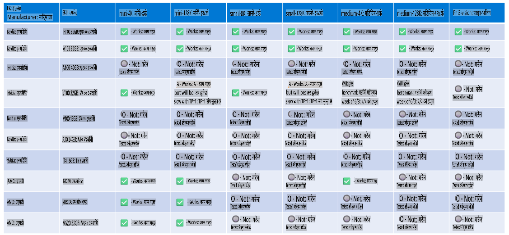

# फाई हार्डवेयर समर्थन

Microsoft Phi लाई ONNX Runtime का लागि अनुकूलित गरिएको छ र यो Windows DirectML लाई समर्थन गर्दछ। यो विभिन्न प्रकारका हार्डवेयरहरूमा राम्रोसँग काम गर्छ, जसमा GPUs, CPUs, र मोबाइल उपकरणहरू पनि समावेश छन्।

## उपकरण हार्डवेयर
विशेष रूपमा, समर्थित हार्डवेयरमा समावेश छन्:

- GPU SKU: RTX 4090 (DirectML)
- GPU SKU: 1 A100 80GB (CUDA)
- CPU SKU: Standard F64s v2 (64 vCPUs, 128 GiB मेमोरी)

## मोबाइल SKU

- एन्ड्रोइड - Samsung Galaxy S21
- एप्पल iPhone 14 वा उच्च A16/A17 प्रोसेसर

## फाई हार्डवेयर विशिष्टता

- न्यूनतम आवश्यक कन्फिगरेसन।
- Windows: DirectX 12-सक्षम GPU र कम्तीमा 4GB संयुक्त RAM

CUDA: Compute Capability >= 7.02 भएको NVIDIA GPU



## धेरै GPUs मा onnxruntime चलाउनुहोस्

हाल उपलब्ध Phi ONNX मोडेलहरू 1 GPU का लागि मात्र हुन्। Phi मोडेलको लागि multi-gpu समर्थन सम्भव छ, तर ORT लाई 2 gpu सँग चलाउँदा 2 वटा ORT इन्स्ट्यान्सको तुलनामा बढी throughput दिने ग्यारेन्टी हुँदैन। कृपया [ONNX Runtime](https://onnxruntime.ai/) मा पछिल्लो अपडेटहरू हेर्नुहोस्।

[Build 2024 मा GenAI ONNX Team](https://youtu.be/WLW4SE8M9i8?si=EtG04UwDvcjunyfC) ले घोषणा गरे कि उनीहरूले Phi मोडेलहरूको लागि multi-gpu को सट्टा multi-instance सक्षम गरेका छन्।

हाल यसले तपाईंलाई CUDA_VISIBLE_DEVICES environment variable प्रयोग गरेर एक onnxruntime वा onnxruntime-genai इन्स्ट्यान्स चलाउन अनुमति दिन्छ, यस प्रकार:

```Python
CUDA_VISIBLE_DEVICES=0 python infer.py
CUDA_VISIBLE_DEVICES=1 python infer.py
```

[Azure AI Foundry](https://ai.azure.com) मा Phi को थप अन्वेषण गर्न स्वतन्त्र महसुस गर्नुहोस्।

**अस्वीकरण**:  
यो दस्तावेज मेसिन-आधारित एआई अनुवाद सेवाहरू प्रयोग गरेर अनुवाद गरिएको हो। हामी यथासम्भव सही अनुवाद प्रदान गर्न प्रयास गर्दछौं, तर कृपया ध्यान दिनुहोस् कि स्वचालित अनुवादमा त्रुटिहरू वा असमानताहरू हुन सक्छ। यसको मूल भाषामा रहेको मूल दस्तावेजलाई प्राधिकृत स्रोतको रूपमा मानिनुपर्छ। महत्वपूर्ण जानकारीको लागि, व्यावसायिक मानव अनुवाद सिफारिस गरिन्छ। यस अनुवादको प्रयोगबाट उत्पन्न हुने कुनै पनि गलतफहमी वा गलत व्याख्याको लागि हामी जिम्मेवार हुने छैनौं।