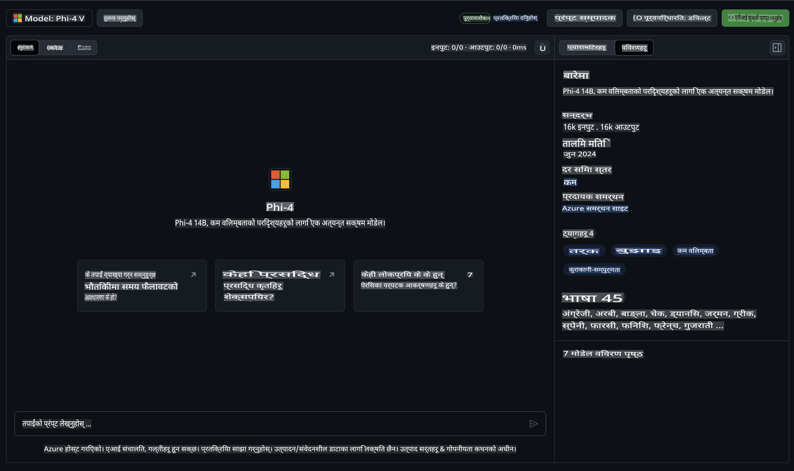

## GitHub मोडेल्समा Phi परिवार

[GitHub मोडेल्स](https://github.com/marketplace/models) मा स्वागत छ! हामीले Azure AI मा होस्ट गरिएका AI मोडेल्स अन्वेषण गर्न तपाईंलाई तयार राखेका छौं। 


GitHub मोडेल्समा उपलब्ध मोडेलहरूको बारेमा थप जानकारीका लागि [GitHub Model Marketplace](https://github.com/marketplace/models) हेर्नुहोस्।

## उपलब्ध मोडेल्स

प्रत्येक मोडेलसँग एउटा छुट्टै प्लेग्राउन्ड र नमूना कोड उपलब्ध छ।



### GitHub मोडेल क्याटलगमा Phi परिवार

- [Phi-4](https://github.com/marketplace/models/azureml/Phi-4)

- [Phi-3.5-MoE instruct (128k)](https://github.com/marketplace/models/azureml/Phi-3-5-MoE-instruct)

- [Phi-3.5-vision instruct (128k)](https://github.com/marketplace/models/azureml/Phi-3-5-vision-instruct)

- [Phi-3.5-mini instruct (128k)](https://github.com/marketplace/models/azureml/Phi-3-5-mini-instruct)

- [Phi-3-Medium-128k-Instruct](https://github.com/marketplace/models/azureml/Phi-3-medium-128k-instruct)

- [Phi-3-medium-4k-instruct](https://github.com/marketplace/models/azureml/Phi-3-medium-4k-instruct)

- [Phi-3-mini-128k-instruct](https://github.com/marketplace/models/azureml/Phi-3-mini-128k-instruct)

- [Phi-3-mini-4k-instruct](https://github.com/marketplace/models/azureml/Phi-3-mini-4k-instruct)

- [Phi-3-small-128k-instruct](https://github.com/marketplace/models/azureml/Phi-3-small-128k-instruct)

- [Phi-3-small-8k-instruct](https://github.com/marketplace/models/azureml/Phi-3-small-8k-instruct)

## सुरु गर्दै

केही आधारभूत उदाहरणहरू तयार छन् जुन तपाईं तुरुन्त चलाउन सक्नुहुन्छ। यी नमूनाहरू तपाईंले `samples` डाइरेक्टरीमा फेला पार्न सक्नुहुन्छ। यदि तपाईं आफ्नो मनपर्ने भाषामा सिधै काम सुरु गर्न चाहनुहुन्छ भने, निम्न भाषाहरूमा उदाहरणहरू उपलब्ध छन्:

- Python  
- JavaScript  
- C#  
- Java  
- cURL  

नमूनाहरू र मोडेलहरू चलाउनका लागि एउटा छुट्टै Codespaces Environment पनि उपलब्ध छ।


## नमूना कोड

तल केही प्रयोगका केसहरूका लागि उदाहरण कोड स्निपेटहरू छन्। Azure AI Inference SDK को बारेमा थप जानकारीका लागि पूर्ण डक्युमेन्टेसन र नमूनाहरू हेर्नुहोस्।

## सेटअप

1. व्यक्तिगत एक्सेस टोकन सिर्जना गर्नुहोस्  
तपाईंले यो टोकनलाई कुनै विशेष अनुमति दिन आवश्यक छैन। ध्यान दिनुहोस् कि यो टोकन Microsoft सेवामा पठाइनेछ।  

तलका कोड स्निपेटहरू प्रयोग गर्न, वातावरणीय भेरिएबल बनाएर तपाईंको टोकनलाई क्लाइन्ट कोडको लागि कुञ्जीको रूपमा सेट गर्नुहोस्।  

यदि तपाईं bash प्रयोग गर्दै हुनुहुन्छ:  
```
export GITHUB_TOKEN="<your-github-token-goes-here>"
```  
यदि तपाईं powershell मा हुनुहुन्छ:  
```
$Env:GITHUB_TOKEN="<your-github-token-goes-here>"
```  
यदि तपाईं Windows command prompt प्रयोग गर्दै हुनुहुन्छ:  
```
set GITHUB_TOKEN=<your-github-token-goes-here>
```  

## Python नमूना

### निर्भरता स्थापना गर्नुहोस्  
Azure AI Inference SDK लाई pip प्रयोग गरेर स्थापना गर्नुहोस् (आवश्यक: Python >=3.8):  
```
pip install azure-ai-inference
```  

### आधारभूत कोड नमूना चलाउनुहोस्  

यस नमूनाले chat completion API मा एउटा आधारभूत कल प्रदर्शन गर्दछ। यसमा GitHub AI मोडेल इन्फरेन्स अन्तर्क्रियालाई प्रयोग गरिएको छ र तपाईंको GitHub टोकन। यो कल synchronous छ।  

```python
import os
from azure.ai.inference import ChatCompletionsClient
from azure.ai.inference.models import SystemMessage, UserMessage
from azure.core.credentials import AzureKeyCredential

endpoint = "https://models.inference.ai.azure.com"
model_name = "Phi-4"
token = os.environ["GITHUB_TOKEN"]

client = ChatCompletionsClient(
    endpoint=endpoint,
    credential=AzureKeyCredential(token),
)

response = client.complete(
    messages=[
        UserMessage(content="I have $20,000 in my savings account, where I receive a 4% profit per year and payments twice a year. Can you please tell me how long it will take for me to become a millionaire? Also, can you please explain the math step by step as if you were explaining it to an uneducated person?"),
    ],
    temperature=0.4,
    top_p=1.0,
    max_tokens=2048,
    model=model_name
)

print(response.choices[0].message.content)
```  

### बहु-चरण संवाद चलाउनुहोस्  

यस नमूनाले chat completion API सँग बहु-चरण संवाद प्रदर्शन गर्दछ। यदि तपाईं मोडेललाई च्याट एप्लिकेसनको लागि प्रयोग गर्दै हुनुहुन्छ भने, तपाईंले संवादको इतिहास व्यवस्थापन गर्नुपर्नेछ र मोडेललाई पछिल्लो सन्देशहरू पठाउनुपर्नेछ।  

```
import os
from azure.ai.inference import ChatCompletionsClient
from azure.ai.inference.models import AssistantMessage, SystemMessage, UserMessage
from azure.core.credentials import AzureKeyCredential

token = os.environ["GITHUB_TOKEN"]
endpoint = "https://models.inference.ai.azure.com"
# Replace Model_Name
model_name = "Phi-4"

client = ChatCompletionsClient(
    endpoint=endpoint,
    credential=AzureKeyCredential(token),
)

messages = [
    SystemMessage(content="You are a helpful assistant."),
    UserMessage(content="What is the capital of France?"),
    AssistantMessage(content="The capital of France is Paris."),
    UserMessage(content="What about Spain?"),
]

response = client.complete(messages=messages, model=model_name)

print(response.choices[0].message.content)
```  

### आउटपुट स्ट्रिम गर्नुहोस्  

बेहतर प्रयोगकर्ता अनुभवको लागि, तपाईंले मोडेलको प्रतिक्रिया स्ट्रिम गर्न चाहनुहुनेछ ताकि पहिलो टोकन चाँडै देखियोस् र लामो प्रतिक्रियाको लागि प्रतीक्षा गर्न नपरोस्।  

```
import os
from azure.ai.inference import ChatCompletionsClient
from azure.ai.inference.models import SystemMessage, UserMessage
from azure.core.credentials import AzureKeyCredential

token = os.environ["GITHUB_TOKEN"]
endpoint = "https://models.inference.ai.azure.com"
# Replace Model_Name
model_name = "Phi-4"

client = ChatCompletionsClient(
    endpoint=endpoint,
    credential=AzureKeyCredential(token),
)

response = client.complete(
    stream=True,
    messages=[
        SystemMessage(content="You are a helpful assistant."),
        UserMessage(content="Give me 5 good reasons why I should exercise every day."),
    ],
    model=model_name,
)

for update in response:
    if update.choices:
        print(update.choices[0].delta.content or "", end="")

client.close()
```  

## GitHub मोडेल्सको निःशुल्क प्रयोग र दर सीमा


[प्लेग्राउन्ड र निःशुल्क API प्रयोगका लागि दर सीमा](https://docs.github.com/en/github-models/prototyping-with-ai-models#rate-limits) तपाईंलाई मोडेलहरूसँग प्रयोग गर्न र तपाईंको AI एप्लिकेसन प्रोटोटाइप गर्न मद्दत गर्न डिजाइन गरिएको हो। ती सीमाभन्दा बाहिरको प्रयोगका लागि, र तपाईंको एप्लिकेसनलाई स्केल गर्न, तपाईंले Azure खाताबाट स्रोतहरू प्रावधान गर्नुपर्नेछ, र GitHub व्यक्तिगत एक्सेस टोकनको सट्टा त्यहाँबाट प्रमाणित गर्नुपर्नेछ। तपाईंको कोडमा अन्य केही परिवर्तन गर्न आवश्यक छैन। Azure AI मा निःशुल्क स्तर सीमाभन्दा बाहिर जानको लागि यो लिङ्क प्रयोग गर्नुहोस्।  

### प्रकटीकरणहरू  

मोडेलसँग अन्तरक्रिया गर्दा, तपाईं AI सँग परीक्षण गर्दै हुनुहुन्छ भन्ने कुरा सम्झनुहोस्, त्यसैले सामग्रीमा गल्तीहरू हुन सक्छन्।  

यो सुविधा विभिन्न सीमाहरू (जस्तै, प्रति मिनेट अनुरोध, प्रति दिन अनुरोध, प्रति अनुरोध टोकन, र समानान्तर अनुरोध) को अधीनमा छ र उत्पादन प्रयोगका केसहरूको लागि डिजाइन गरिएको छैन।  

GitHub मोडेल्सले Azure AI सामग्री सुरक्षा प्रयोग गर्दछ। यी फिल्टरहरू GitHub मोडेल्स अनुभवको भागको रूपमा बन्द गर्न सकिँदैन। यदि तपाईंले मोडेलहरूलाई सशुल्क सेवामार्फत प्रयोग गर्ने निर्णय गर्नुभयो भने, कृपया तपाईंको आवश्यकताहरू पूरा गर्न सामग्री फिल्टरहरू कन्फिगर गर्नुहोस्।  

यो सेवा GitHub का प्रि-रिलिज सर्तहरूको अधीनमा छ।  

**अस्वीकरण**:  
यो दस्तावेज मेसिन-आधारित एआई अनुवाद सेवाहरू प्रयोग गरेर अनुवाद गरिएको हो। हामी यथासम्भव सही अनुवादको प्रयास गर्दछौं, तर कृपया ध्यान दिनुहोस् कि स्वचालित अनुवादहरूमा त्रुटि वा अशुद्धता हुन सक्ने सम्भावना हुन्छ। मूल भाषामा रहेको मूल दस्तावेजलाई आधिकारिक स्रोत मानिनुपर्छ। महत्वपूर्ण जानकारीको लागि, पेशेवर मानव अनुवादको सिफारिस गरिन्छ। यस अनुवादको प्रयोगबाट उत्पन्न हुने कुनै पनि गलतफहमी वा गलत व्याख्याका लागि हामी जिम्मेवार हुनेछैनौं।