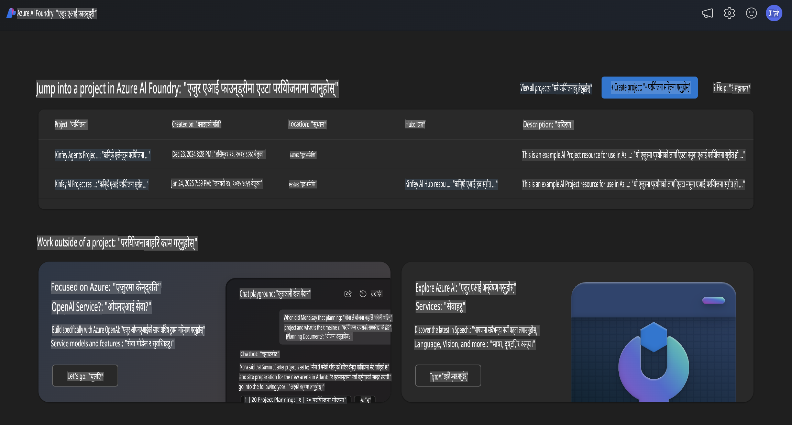
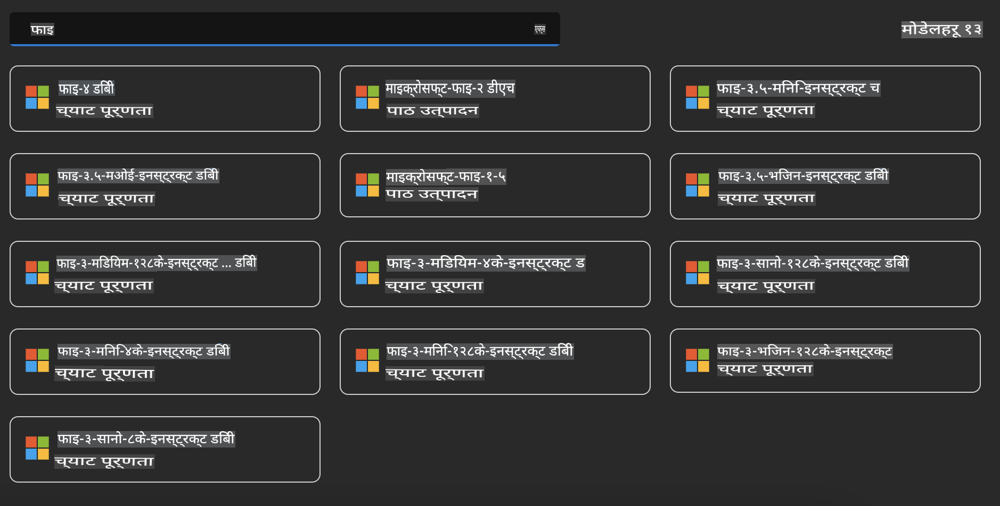
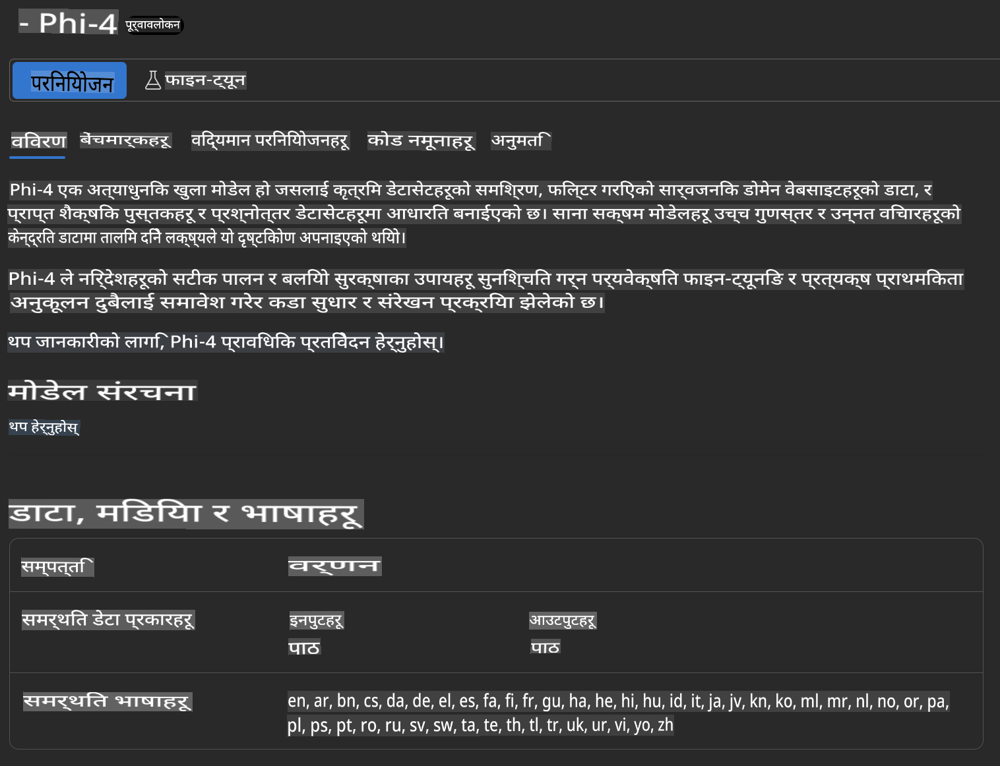
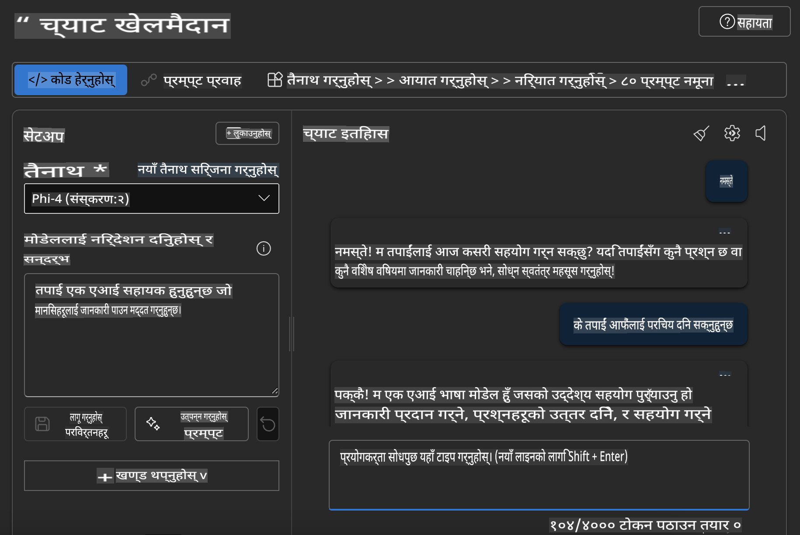

## Azure AI Foundry मा Phi परिवार

[Azure AI Foundry](https://ai.azure.com) एक विश्वासिलो प्लेटफर्म हो जसले विकासकर्ताहरूलाई AI को माध्यमबाट नवप्रवर्तन गर्न र भविष्यलाई सुरक्षित, सुरक्षित र जिम्मेवार तरिकाले आकार दिन सशक्त बनाउँछ।  

[Azure AI Foundry](https://ai.azure.com) विशेष गरी विकासकर्ताहरूको लागि डिजाइन गरिएको छ:

- उद्यम-स्तरको प्लेटफर्ममा जेनेरेटिभ AI एप्लिकेसन निर्माण गर्न।  
- अत्याधुनिक AI उपकरणहरू र ML मोडेलहरूको उपयोग गरेर अन्वेषण, निर्माण, परीक्षण, र परिनियोजन गर्न, जिम्मेवार AI अभ्यासहरूको आधारमा।  
- एप्लिकेसन विकासको सम्पूर्ण जीवनचक्रमा टोलीसँग सहकार्य गर्न।  

Azure AI Foundry को माध्यमबाट, तपाईं विभिन्न प्रकारका मोडेलहरू, सेवाहरू, र क्षमताहरू अन्वेषण गर्न सक्नुहुन्छ, र आफ्ना लक्ष्यहरूलाई सबैभन्दा राम्रोसँग सेवा दिने AI एप्लिकेसनहरू निर्माण गर्न सक्नुहुन्छ। Azure AI Foundry प्लेटफर्मले प्रूफ अफ कन्सेप्टलाई सजिलै उत्पादन-स्तरका एप्लिकेसनहरूमा रूपान्तरण गर्न स्केलेबिलिटी प्रदान गर्दछ। दीर्घकालीन सफलताका लागि निरन्तर निगरानी र परिमार्जन समर्थन गर्दछ।  

  

Azure AI Foundry मा Azure AOAI Service को उपयोग गर्न सकिनुका साथै, तपाईं Azure AI Foundry Model Catalog मा तेस्रो-पक्ष मोडेलहरूको पनि उपयोग गर्न सक्नुहुन्छ। यदि तपाईं Azure AI Foundry लाई आफ्नो AI समाधान प्लेटफर्मको रूपमा प्रयोग गर्न चाहनुहुन्छ भने यो राम्रो विकल्प हो।  

हामी Azure AI Foundry मा Model Catalog मार्फत Phi परिवारका मोडेलहरू छिटो परिनियोजन गर्न सक्छौं।  

  

### **Azure AI Foundry मा Phi-4 परिनियोजन गर्नुहोस्**  

  

### **Azure AI Foundry Playground मा Phi-4 परीक्षण गर्नुहोस्**  

  

### **Azure AI Foundry Phi-4 कल गर्न Python कोड चलाउनुहोस्**  

```python

import os  
import base64
from openai import AzureOpenAI  
from azure.identity import DefaultAzureCredential, get_bearer_token_provider  
        
endpoint = os.getenv("ENDPOINT_URL", "Your Azure AOAI Service Endpoint")  
deployment = os.getenv("DEPLOYMENT_NAME", "Phi-4")  
      
token_provider = get_bearer_token_provider(  
    DefaultAzureCredential(),  
    "https://cognitiveservices.azure.com/.default"  
)  
  
client = AzureOpenAI(  
    azure_endpoint=endpoint,  
    azure_ad_token_provider=token_provider,  
    api_version="2024-05-01-preview",  
)  
  

chat_prompt = [
    {
        "role": "system",
        "content": "You are an AI assistant that helps people find information."
    },
    {
        "role": "user",
        "content": "can you introduce yourself"
    }
] 
    
# Include speech result if speech is enabled  
messages = chat_prompt 

completion = client.chat.completions.create(  
    model=deployment,  
    messages=messages,
    max_tokens=800,  
    temperature=0.7,  
    top_p=0.95,  
    frequency_penalty=0,  
    presence_penalty=0,
    stop=None,  
    stream=False  
)  
  
print(completion.to_json())  

```  

**अस्वीकरण**:  
यो दस्तावेज मेसिन-आधारित एआई अनुवाद सेवाहरू प्रयोग गरी अनुवाद गरिएको हो। हामी यथासम्भव सही अनुवाद प्रदान गर्न प्रयास गर्दछौं, तर कृपया ध्यान दिनुहोस् कि स्वचालित अनुवादहरूमा त्रुटिहरू वा अशुद्धताहरू हुन सक्छन्। यसको मूल भाषामा रहेको मूल दस्तावेजलाई नै आधिकारिक स्रोतको रूपमा मानिनुपर्छ। महत्त्वपूर्ण जानकारीका लागि, व्यावसायिक मानव अनुवाद सिफारिस गरिन्छ। यस अनुवादको प्रयोगबाट उत्पन्न हुने कुनै पनि गलतफहमी वा व्याख्याका लागि हामी जिम्मेवार हुने छैनौं।