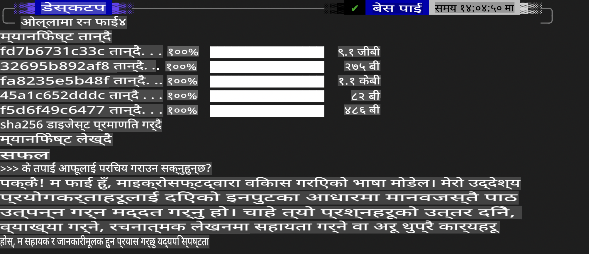
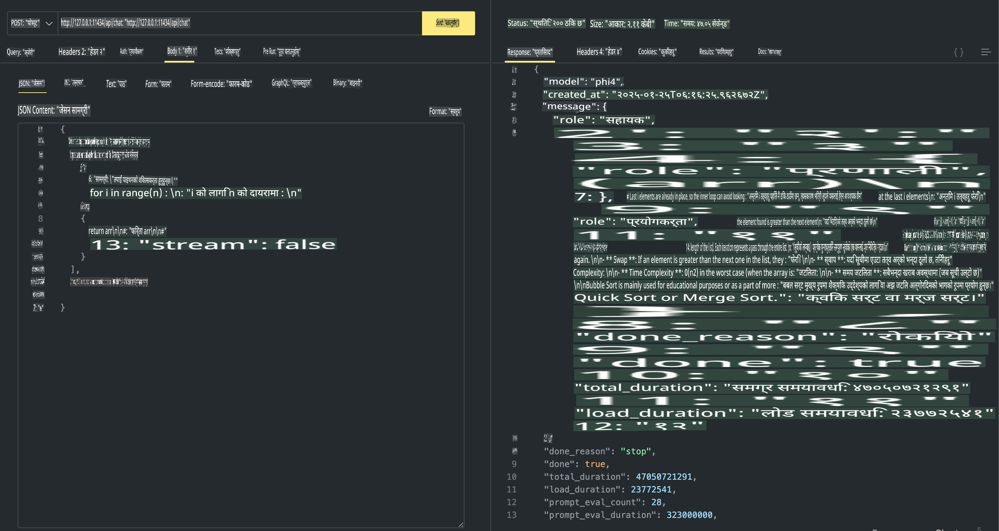

## Phi Family in Ollama

[Ollama](https://ollama.com) ले साधारण स्क्रिप्टहरूको प्रयोग गरेर धेरै व्यक्तिहरूलाई खुला स्रोत LLM वा SLM तैनाथ गर्न सिधै अनुमति दिन्छ, र स्थानीय Copilot अनुप्रयोग परिदृश्यहरूलाई सहयोग गर्न API निर्माण गर्न पनि सक्छ।

## **1. स्थापना**

Ollama Windows, macOS, र Linux मा चलाउन समर्थन गर्दछ। तपाईं यो लिंक ([https://ollama.com/download](https://ollama.com/download)) मार्फत Ollama स्थापना गर्न सक्नुहुन्छ। सफलतापूर्वक स्थापना भएपछि, तपाईं टर्मिनल विन्डो मार्फत Phi-3 कल गर्न सिधै Ollama स्क्रिप्ट प्रयोग गर्न सक्नुहुन्छ। तपाईं [Ollama मा उपलब्ध सबै पुस्तकालयहरू](https://ollama.com/library) हेर्न सक्नुहुन्छ। यदि तपाईंले यो रिपोजिटरी Codespace मा खोल्नुभयो भने, यसमा Ollama पहिले नै स्थापना भइसकेको हुनेछ।

```bash

ollama run phi4

```

> [!NOTE]
> पहिलो पटक चलाउँदा मोडेल डाउनलोड हुनेछ। अवश्य पनि, तपाईंले पहिले नै डाउनलोड गरिएको Phi-4 मोडेल पनि सिधै निर्दिष्ट गर्न सक्नुहुन्छ। हामी WSL लाई उदाहरणको रूपमा आदेश चलाउन लिन्छौं। मोडेल सफलतापूर्वक डाउनलोड भएपछि, तपाईं टर्मिनलमा सिधै अन्तरक्रिया गर्न सक्नुहुन्छ।



## **2. Ollama बाट phi-4 API कल गर्नुहोस्**

यदि तपाईं Ollama द्वारा उत्पन्न Phi-4 API कल गर्न चाहनुहुन्छ भने, तपाईंले टर्मिनलमा यो आदेश प्रयोग गरेर Ollama सर्भर सुरु गर्न सक्नुहुन्छ।

```bash

ollama serve

```

> [!NOTE]
> यदि तपाईं macOS वा Linux चलाउँदै हुनुहुन्छ भने, तपाईंले निम्न त्रुटि सामना गर्न सक्नुहुन्छ **"Error: listen tcp 127.0.0.1:11434: bind: address already in use"**। यो आदेश चलाउँदा आउने त्रुटि हो। तपाईंले यो त्रुटि बेवास्ता गर्न सक्नुहुन्छ, किनभने यसले सामान्यतया सर्भर पहिले नै चलिरहेको संकेत गर्दछ, वा तपाईंले Ollama बन्द गरेर पुनः सुरु गर्न सक्नुहुन्छ:

**macOS**

```bash

brew services restart ollama

```

**Linux**

```bash

sudo systemctl stop ollama

```

Ollama ले दुईवटा API समर्थन गर्दछ: generate र chat। तपाईं आफ्नो आवश्यकताअनुसार, Ollama द्वारा प्रदान गरिएको मोडेल API कल गर्न सक्नुहुन्छ, जसले पोर्ट 11434 मा चलिरहेको स्थानीय सेवामा अनुरोध पठाउँछ।

**Chat**

```bash

curl http://127.0.0.1:11434/api/chat -d '{
  "model": "phi3",
  "messages": [
    {
      "role": "system",
      "content": "Your are a python developer."
    },
    {
      "role": "user",
      "content": "Help me generate a bubble algorithm"
    }
  ],
  "stream": false
  
}'

This is the result in Postman



## Additional Resources

Check the list of available models in Ollama in [their library](https://ollama.com/library).

Pull your model from the Ollama server using this command

```bash
ollama pull phi4
```

Run the model using this command

```bash
ollama run phi4
```

***Note:*** Visit this link [https://github.com/ollama/ollama/blob/main/docs/api.md](https://github.com/ollama/ollama/blob/main/docs/api.md) to learn more

## Calling Ollama from Python

You can use `requests` or `urllib3` to make requests to the local server endpoints used above. However, a popular way to use Ollama in Python is via the [openai](https://pypi.org/project/openai/) SDK, since Ollama provides OpenAI-compatible server endpoints as well.

Here is an example for phi3-mini:

```python
import openai

client = openai.OpenAI(
    base_url="http://localhost:11434/v1",
    api_key="nokeyneeded",
)

response = client.chat.completions.create(
    model="phi4",
    temperature=0.7,
    n=1,
    messages=[
        {"role": "system", "content": "You are a helpful assistant."},
        {"role": "user", "content": "Write a haiku about a hungry cat"},
    ],
)

print("Response:")
print(response.choices[0].message.content)
```

## Calling Ollama from JavaScript 

```javascript
// Phi-4 को साथमा फाइलको सारांश बनाउने उदाहरण
script({
    model: "ollama:phi4",
    title: "Summarize with Phi-4",
    system: ["system"],
})

// सारांशको उदाहरण
const file = def("FILE", env.files)
$`Summarize ${file} in a single paragraph.`
```

## Calling Ollama from C#

Create a new C# Console application and add the following NuGet package:

```bash
dotnet add package Microsoft.SemanticKernel --version 1.34.0
```

Then replace this code in the `Program.cs` file

```csharp
using Microsoft.SemanticKernel;
using Microsoft.SemanticKernel.ChatCompletion;

// स्थानीय Ollama सर्भरको अन्त बिन्दु प्रयोग गरेर च्याट कम्प्लिसन सेवा थप्नुहोस्
#pragma warning disable SKEXP0001, SKEXP0003, SKEXP0010, SKEXP0011, SKEXP0050, SKEXP0052
builder.AddOpenAIChatCompletion(
    modelId: "phi4",
    endpoint: new Uri("http://localhost:11434/"),
    apiKey: "non required");

// च्याट सेवामा साधारण प्रम्प्ट चलाउनुहोस्
string prompt = "Write a joke about kittens";
var response = await kernel.InvokePromptAsync(prompt);
Console.WriteLine(response.GetValue<string>());
```

Run the app with the command:

```bash
dotnet run
```

**अस्वीकरण**:  
यो दस्तावेज मेसिन-आधारित एआई अनुवाद सेवाहरू प्रयोग गरेर अनुवाद गरिएको हो। यद्यपि हामी शुद्धताका लागि प्रयास गर्छौं, कृपया ध्यान दिनुहोस् कि स्वचालित अनुवादहरूमा त्रुटि वा असमानताहरू हुन सक्छन्। यसको मौलिक भाषामा रहेको मूल दस्तावेजलाई आधिकारिक स्रोत मानिनुपर्छ। महत्त्वपूर्ण जानकारीका लागि, व्यावसायिक मानव अनुवाद सिफारिस गरिन्छ। यो अनुवाद प्रयोग गर्दा उत्पन्न हुने कुनै पनि गलतफहमी वा व्याख्याका लागि हामी जिम्मेवार हुने छैनौं।