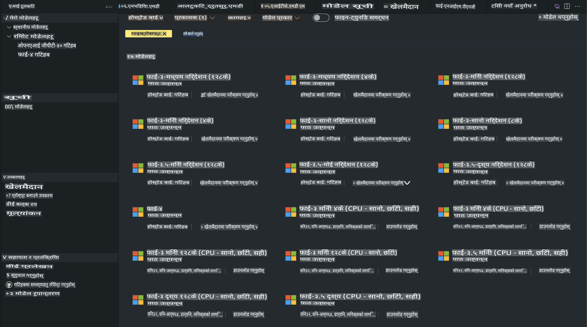

# AITK मा फाई परिवार

[AI Toolkit for VS Code](https://marketplace.visualstudio.com/items?itemName=ms-windows-ai-studio.windows-ai-studio) ले जेनरेटिभ AI एप विकासलाई सरल बनाउँछ। यसले Azure AI Foundry Catalog र Hugging Face जस्ता अन्य क्याटलगबाट अत्याधुनिक AI विकास उपकरण र मोडेलहरूलाई एकै ठाउँमा ल्याउँछ। तपाईं GitHub Models र Azure AI Foundry Model Catalog द्वारा सञ्चालित AI मोडेल क्याटलग ब्राउज गर्न, तिनीहरूलाई स्थानीय रूपमा वा रिमोट रूपमा डाउनलोड गर्न, फाइन-ट्यून गर्न, परीक्षण गर्न र आफ्नो एप्लिकेसनमा प्रयोग गर्न सक्षम हुनुहुनेछ।

AI Toolkit Preview स्थानीय रूपमा चल्नेछ। स्थानीय इन्फरेन्स वा फाइन-ट्यून, तपाईंले चयन गरेको मोडेलमा निर्भर गर्दछ, तपाईंलाई NVIDIA CUDA GPU जस्तो GPU चाहिन सक्छ। तपाईं GitHub Models लाई AITK मार्फत पनि सिधै चलाउन सक्नुहुन्छ।

## सुरु गर्दै

[Windows Subsystem for Linux कसरी स्थापना गर्ने जान्नुहोस्](https://learn.microsoft.com/windows/wsl/install?WT.mc_id=aiml-137032-kinfeylo)

र [डिफल्ट वितरण परिवर्तन गर्ने](https://learn.microsoft.com/windows/wsl/install#change-the-default-linux-distribution-installed)।

[AI Toolkit GitHub Repo](https://github.com/microsoft/vscode-ai-toolkit/)

- Windows, Linux, macOS
  
- Windows र Linux दुवैमा फाइन-ट्यूनिङको लागि, तपाईंलाई Nvidia GPU चाहिन्छ। थप रूपमा, **Windows** मा Ubuntu वितरण 18.4 वा सोभन्दा माथिको साथ Subsystem for Linux आवश्यक छ। [Windows Subsystem for Linux कसरी स्थापना गर्ने जान्नुहोस्](https://learn.microsoft.com/windows/wsl/install) र [डिफल्ट वितरण परिवर्तन गर्ने](https://learn.microsoft.com/windows/wsl/install#change-the-default-linux-distribution-installed)।

### AI Toolkit स्थापना गर्नुहोस्

AI Toolkit लाई [Visual Studio Code Extension](https://code.visualstudio.com/docs/setup/additional-components#_vs-code-extensions) को रूपमा पठाइएको छ, त्यसैले तपाईंले पहिले [VS Code](https://code.visualstudio.com/docs/setup/windows?WT.mc_id=aiml-137032-kinfeylo) स्थापना गर्नुपर्नेछ र [VS Marketplace](https://marketplace.visualstudio.com/items?itemName=ms-windows-ai-studio.windows-ai-studio) बाट AI Toolkit डाउनलोड गर्नुपर्नेछ।  
[AI Toolkit Visual Studio Marketplace मा उपलब्ध छ](https://marketplace.visualstudio.com/items?itemName=ms-windows-ai-studio.windows-ai-studio) र अन्य VS Code विस्तारहरू जस्तै स्थापना गर्न सकिन्छ।

यदि तपाईं VS Code विस्तारहरू कसरी स्थापना गर्ने थाहा छैन भने, यी चरणहरू पालना गर्नुहोस्:

### साइन इन गर्नुहोस्

1. VS Code को Activity Bar मा **Extensions** चयन गर्नुहोस्।
1. Extensions खोज पट्टीमा "AI Toolkit" टाइप गर्नुहोस्।
1. "AI Toolkit for Visual Studio Code" चयन गर्नुहोस्।
1. **Install** चयन गर्नुहोस्।

अब, तपाईं विस्तार प्रयोग गर्न तयार हुनुहुन्छ!

तपाईंलाई GitHub मा साइन इन गर्न सोधिनेछ, कृपया जारी राख्न "Allow" क्लिक गर्नुहोस्। तपाईंलाई GitHub साइन इन पृष्ठमा पुनर्निर्देशित गरिनेछ।

कृपया साइन इन गर्नुहोस् र प्रक्रिया चरणहरू पालना गर्नुहोस्। सफलतापूर्वक पूरा भएपछि, तपाईंलाई VS Code मा पुनर्निर्देशित गरिनेछ।

एक पटक विस्तार स्थापना भएपछि, तपाईंले आफ्नो Activity Bar मा AI Toolkit आइकन देख्नुहुनेछ।

अब उपलब्ध कार्यहरू अन्वेषण गरौं!

### उपलब्ध कार्यहरू

AI Toolkit को प्राथमिक साइडबारलाई निम्नमा वर्गीकृत गरिएको छ  

- **Models**
- **Resources**
- **Playground**  
- **Fine-tuning**
- **Evaluation**

Resources खण्डमा उपलब्ध छन्। सुरु गर्न **Model Catalog** चयन गर्नुहोस्।

### क्याटलगबाट मोडेल डाउनलोड गर्नुहोस्

VS Code साइड बारबाट AI Toolkit सुरू गरेपछि, तपाईंले निम्न विकल्पहरूबाट चयन गर्न सक्नुहुन्छ:



- **Model Catalog** बाट समर्थित मोडेल खोज्नुहोस् र स्थानीय रूपमा डाउनलोड गर्नुहोस्।
- **Model Playground** मा मोडेल इन्फरेन्स परीक्षण गर्नुहोस्।
- **Model Fine-tuning** मा स्थानीय वा रिमोट रूपमा मोडेल फाइन-ट्यून गर्नुहोस्।
- AI Toolkit को कमाण्ड प्यालेट मार्फत क्लाउडमा फाइन-ट्यून गरिएका मोडेलहरू डिप्लोय गर्नुहोस्।
- मोडेलहरूको मूल्याङ्कन गर्नुहोस्।

> [!NOTE]
>
> **GPU Vs CPU**
>
> तपाईंले मोडेल कार्डहरूमा मोडेल साइज, प्लेटफर्म र एक्सेलेरेटर प्रकार (CPU, GPU) देख्नुहुनेछ। **Windows उपकरणहरू जसमा कम्तिमा एक GPU छ** को लागि अनुकूलित प्रदर्शनको लागि, Windows मात्र लक्षित गर्ने मोडेल संस्करणहरू चयन गर्नुहोस्।
>
> यसले तपाईंलाई DirectML एक्सेलेरेटरको लागि अनुकूलित मोडेल सुनिश्चित गर्दछ।
>
> मोडेल नामहरू यस ढाँचामा हुन्छन्:
>
> - `{model_name}-{accelerator}-{quantization}-{format}`।
>
> तपाईंको Windows उपकरणमा GPU छ कि छैन जाँच गर्न, **Task Manager** खोल्नुहोस् र त्यसपछि **Performance** ट्याब चयन गर्नुहोस्। यदि तपाईंको GPU(s) छ भने, तिनीहरू "GPU 0" वा "GPU 1" जस्ता नामहरू अन्तर्गत सूचीबद्ध हुनेछन्।

### Playground मा मोडेल चलाउनुहोस्

सबै प्यारामिटर सेट भएपछि, **Generate Project** क्लिक गर्नुहोस्।

तपाईंको मोडेल डाउनलोड भएपछि, क्याटलगमा मोडेल कार्डमा **Load in Playground** चयन गर्नुहोस्:

- मोडेल डाउनलोड सुरू गर्नुहोस्।
- सबै पूर्वापेक्षा र निर्भरताहरू स्थापना गर्नुहोस्।
- VS Code कार्यक्षेत्र सिर्जना गर्नुहोस्।


### आफ्नो एप्लिकेसनमा REST API प्रयोग गर्नुहोस् 

AI Toolkit ले [OpenAI chat completions format](https://platform.openai.com/docs/api-reference/chat/create) प्रयोग गर्ने **port 5272 मा स्थानीय REST API वेब सर्भर** प्रदान गर्दछ।

यसले क्लाउड AI मोडेल सेवामा निर्भर नभई तपाईंलाई आफ्नो एप्लिकेसन स्थानीय रूपमा परीक्षण गर्न सक्षम बनाउँछ। उदाहरणका लागि, निम्न JSON फाइलले अनुरोधको बडी कसरी कन्फिगर गर्ने देखाउँछ:

```json
{
    "model": "Phi-4",
    "messages": [
        {
            "role": "user",
            "content": "what is the golden ratio?"
        }
    ],
    "temperature": 0.7,
    "top_p": 1,
    "top_k": 10,
    "max_tokens": 100,
    "stream": true
}
```

तपाईं (भन्नुपर्दा) [Postman](https://www.postman.com/) वा CURL (Client URL) युटिलिटी प्रयोग गरेर REST API परीक्षण गर्न सक्नुहुन्छ:

```bash
curl -vX POST http://127.0.0.1:5272/v1/chat/completions -H 'Content-Type: application/json' -d @body.json
```

### Python को लागि OpenAI क्लाइन्ट लाइब्रेरी प्रयोग गर्दै

```python
from openai import OpenAI

client = OpenAI(
    base_url="http://127.0.0.1:5272/v1/", 
    api_key="x" # required for the API but not used
)

chat_completion = client.chat.completions.create(
    messages=[
        {
            "role": "user",
            "content": "what is the golden ratio?",
        }
    ],
    model="Phi-4",
)

print(chat_completion.choices[0].message.content)
```

### Azure OpenAI क्लाइन्ट लाइब्रेरी .NET को लागि प्रयोग गर्दै

NuGet प्रयोग गरेर आफ्नो प्रोजेक्टमा [Azure OpenAI क्लाइन्ट लाइब्रेरी .NET को लागि](https://www.nuget.org/packages/Azure.AI.OpenAI/) थप्नुहोस्:

```bash
dotnet add {project_name} package Azure.AI.OpenAI --version 1.0.0-beta.17
```

**OverridePolicy.cs** नामक C# फाइल आफ्नो प्रोजेक्टमा थप्नुहोस् र निम्न कोड पेस्ट गर्नुहोस्:

```csharp
// OverridePolicy.cs
using Azure.Core.Pipeline;
using Azure.Core;

internal partial class OverrideRequestUriPolicy(Uri overrideUri)
    : HttpPipelineSynchronousPolicy
{
    private readonly Uri _overrideUri = overrideUri;

    public override void OnSendingRequest(HttpMessage message)
    {
        message.Request.Uri.Reset(_overrideUri);
    }
}
```

पछि, आफ्नो **Program.cs** फाइलमा निम्न कोड पेस्ट गर्नुहोस्:

```csharp
// Program.cs
using Azure.AI.OpenAI;

Uri localhostUri = new("http://localhost:5272/v1/chat/completions");

OpenAIClientOptions clientOptions = new();
clientOptions.AddPolicy(
    new OverrideRequestUriPolicy(localhostUri),
    Azure.Core.HttpPipelinePosition.BeforeTransport);
OpenAIClient client = new(openAIApiKey: "unused", clientOptions);

ChatCompletionsOptions options = new()
{
    DeploymentName = "Phi-4",
    Messages =
    {
        new ChatRequestSystemMessage("You are a helpful assistant. Be brief and succinct."),
        new ChatRequestUserMessage("What is the golden ratio?"),
    }
};

StreamingResponse<StreamingChatCompletionsUpdate> streamingChatResponse
    = await client.GetChatCompletionsStreamingAsync(options);

await foreach (StreamingChatCompletionsUpdate chatChunk in streamingChatResponse)
{
    Console.Write(chatChunk.ContentUpdate);
}
```


## AI Toolkit को साथ फाइन ट्यूनिङ

- मोडेल खोज र Playground बाट सुरु गर्नुहोस्।
- स्थानीय कम्प्युटिङ स्रोतहरू प्रयोग गरेर मोडेल फाइन-ट्यूनिङ र इन्फरेन्स।
- Azure स्रोतहरू प्रयोग गरेर रिमोट फाइन-ट्यूनिङ र इन्फरेन्स।

[AI Toolkit को साथ फाइन ट्यूनिङ](../../03.FineTuning/Finetuning_VSCodeaitoolkit.md)

## AI Toolkit Q&A स्रोतहरू

कृपया सबैभन्दा सामान्य समस्या र समाधानहरूको लागि हाम्रो [Q&A पृष्ठ](https://github.com/microsoft/vscode-ai-toolkit/blob/main/archive/QA.md) हेर्नुहोस्।

**अस्वीकरण**:  
यो दस्तावेज मेसिन-आधारित एआई अनुवाद सेवाहरू प्रयोग गरी अनुवाद गरिएको हो। यद्यपि हामी शुद्धताका लागि प्रयास गर्छौं, कृपया जानकार हुनुहोस् कि स्वचालित अनुवादमा त्रुटिहरू वा अशुद्धताहरू हुन सक्छ। मूल भाषामा रहेको मूल दस्तावेजलाई आधिकारिक स्रोत मानिनुपर्छ। महत्त्वपूर्ण जानकारीका लागि, पेशेवर मानव अनुवाद सिफारिस गरिन्छ। यस अनुवादको प्रयोगबाट उत्पन्न हुने कुनै पनि गलतफहमी वा गलत व्याख्याको लागि हामी जिम्मेवार हुनेछैनौं।