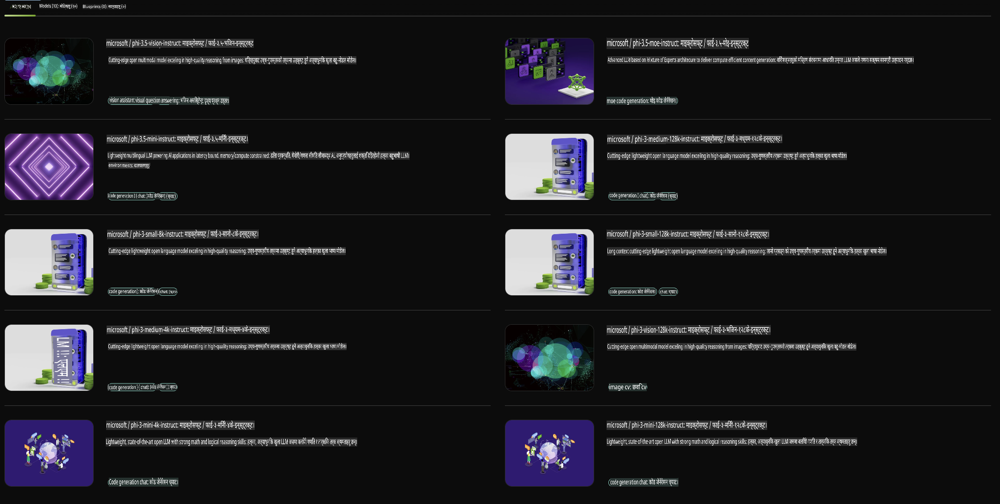

## NVIDIA NIM मा Phi Family

NVIDIA NIM सजिलो र छिटो माइक्रोसर्भिसहरूको सेट हो, जसले क्लाउड, डेटा सेन्टर, र वर्कस्टेशनमा जनरेटिभ AI मोडेलहरूको तैनातीलाई तीव्र बनाउँछ। NIM हरू मोडेल परिवार र प्रत्येक मोडेलको आधारमा वर्गीकृत गरिन्छ। उदाहरणका लागि, ठूला भाषा मोडेलहरू (LLMs) का लागि NVIDIA NIM ले अत्याधुनिक LLM हरूको शक्ति उद्यम अनुप्रयोगहरूमा ल्याउँछ, जसले उत्कृष्ट प्राकृतिक भाषा प्रशोधन र बुझाइ क्षमताहरू प्रदान गर्दछ।

NIM ले IT र DevOps टोलीहरूलाई ठूला भाषा मोडेलहरू (LLMs) आफ्नै व्यवस्थापन गरिएको वातावरणमा होस्ट गर्न सजिलो बनाउँछ, जबकि विकासकर्ताहरूलाई उद्योग मापदण्ड अनुसारको API प्रदान गर्दछ, जसले उनीहरूलाई शक्तिशाली कोपाइलटहरू, च्याटबटहरू, र AI सहायकहरू बनाउन अनुमति दिन्छ, जसले व्यवसाय परिवर्तन गर्न सक्छ। NVIDIA को अत्याधुनिक GPU एक्सेलेरेशन र स्केलेबल तैनाती प्रयोग गर्दै, NIM ले अनुपम प्रदर्शनसहितको सबैभन्दा छिटो इन्फरेन्सको बाटो प्रदान गर्दछ।

तपाईं NVIDIA NIM प्रयोग गरेर Phi Family मोडेलहरूको इन्फरेन्स गर्न सक्नुहुन्छ।



### **उदाहरणहरू - NVIDIA NIM मा Phi-3-Vision**

कल्पना गर्नुहोस् कि तपाईंसँग एउटा छवि छ (`demo.png`) र तपाईं यस छविलाई प्रोसेस गर्ने र यसको नयाँ संस्करण बचत गर्ने Python कोड बनाउन चाहनुहुन्छ (`phi-3-vision.jpg`)।

माथिको कोडले यो प्रक्रिया स्वचालित रूपमा गर्छ:

1. वातावरण र आवश्यक कन्फिगरेसन सेटअप गर्ने।
2. मोडेललाई आवश्यक Python कोड जेनेरेट गर्न निर्देशन दिने प्रॉम्प्ट सिर्जना गर्ने।
3. प्रॉम्प्टलाई मोडेलमा पठाउने र उत्पन्न भएको कोड सङ्कलन गर्ने।
4. उत्पन्न कोडलाई निकाल्ने र चलाउने।
5. मूल र प्रोसेस गरिएको छविहरू प्रदर्शन गर्ने।

यो दृष्टिकोणले छवि प्रशोधन कार्यहरू स्वचालित गर्न AI को शक्तिको उपयोग गर्छ, जसले तपाईंको लक्ष्य हासिल गर्न सजिलो र छिटो बनाउँछ।

[उदाहरण कोड समाधान](../../../../../code/06.E2E/E2E_Nvidia_NIM_Phi3_Vision.ipynb)

अब यो कोडले के गर्छ भन्ने कुरा चरणबद्ध रूपमा बुझौं:

1. **आवश्यक प्याकेज इन्स्टल गर्नुहोस्**:
    ```python
    !pip install langchain_nvidia_ai_endpoints -U
    ```
    यो कमाण्डले `langchain_nvidia_ai_endpoints` प्याकेजको नवीनतम संस्करण इन्स्टल गर्छ।

2. **आवश्यक मोड्युलहरू आयात गर्नुहोस्**:
    ```python
    from langchain_nvidia_ai_endpoints import ChatNVIDIA
    import getpass
    import os
    import base64
    ```
    यी आयातहरूले NVIDIA AI endpoints सँग अन्तरक्रिया गर्न, पासवर्ड सुरक्षित रूपमा व्यवस्थापन गर्न, अपरेटिङ सिस्टमसँग अन्तरक्रिया गर्न, र base64 ढाँचामा डाटा एन्कोड/डिकोड गर्न आवश्यक मोड्युलहरू ल्याउँछन्।

3. **API Key सेट गर्नुहोस्**:
    ```python
    if not os.getenv("NVIDIA_API_KEY"):
        os.environ["NVIDIA_API_KEY"] = getpass.getpass("Enter your NVIDIA API key: ")
    ```
    यो कोडले `NVIDIA_API_KEY` वातावरणीय भेरिएबल सेट गरिएको छ कि छैन भनेर जाँच गर्छ। यदि छैन भने, यसले प्रयोगकर्तालाई API key सुरक्षित रूपमा प्रविष्ट गर्न आग्रह गर्छ।

4. **मोडेल र छवि पथ परिभाषित गर्नुहोस्**:
    ```python
    model = 'microsoft/phi-3-vision-128k-instruct'
    chat = ChatNVIDIA(model=model)
    img_path = './imgs/demo.png'
    ```
    यो कोडले प्रयोग गर्नुपर्ने मोडेल सेट गर्छ, निर्दिष्ट मोडेलसँग `ChatNVIDIA` को एक उदाहरण सिर्जना गर्छ, र छवि फाइलको पथ परिभाषित गर्छ।

5. **टेक्स्ट प्रॉम्प्ट सिर्जना गर्नुहोस्**:
    ```python
    text = "Please create Python code for image, and use plt to save the new picture under imgs/ and name it phi-3-vision.jpg."
    ```
    यो कोडले मोडेललाई छवि प्रोसेस गर्न Python कोड उत्पन्न गर्न निर्देशन दिने टेक्स्ट प्रॉम्प्ट परिभाषित गर्छ।

6. **छविलाई Base64 मा एन्कोड गर्नुहोस्**:
    ```python
    with open(img_path, "rb") as f:
        image_b64 = base64.b64encode(f.read()).decode()
    image = f''
    ```
    यो कोडले छवि फाइल पढ्छ, base64 मा एन्कोड गर्छ, र एन्कोड गरिएको डाटासहितको HTML छवि ट्याग बनाउँछ।

7. **टेक्स्ट र छविलाई प्रॉम्प्टमा संयोजन गर्नुहोस्**:
    ```python
    prompt = f"{text} {image}"
    ```
    यो कोडले टेक्स्ट प्रॉम्प्ट र HTML छवि ट्यागलाई एकल स्ट्रिङमा संयोजन गर्छ।

8. **ChatNVIDIA प्रयोग गरेर कोड उत्पन्न गर्नुहोस्**:
    ```python
    code = ""
    for chunk in chat.stream(prompt):
        print(chunk.content, end="")
        code += chunk.content
    ```
    यो कोडले प्रॉम्प्टलाई `ChatNVIDIA` model and collects the generated code in chunks, printing and appending each chunk to the `code` स्ट्रिङमा पठाउँछ।

9. **उत्पन्न सामग्रीबाट Python कोड निकाल्नुहोस्**:
    ```python
    begin = code.index('```python') + 9
    code = code[begin:]
    end = code.index('```')
    code = code[:end]
    ```
    यो कोडले markdown फर्म्याटिङ हटाएर उत्पन्न सामग्रीबाट वास्तविक Python कोड निकाल्छ।

10. **उत्पन्न कोड चलाउनुहोस्**:
    ```python
    import subprocess
    result = subprocess.run(["python", "-c", code], capture_output=True)
    ```
    यो कोडले निकालेको Python कोडलाई subprocess का रूपमा चलाउँछ र यसको आउटपुट कैप्चर गर्छ।

11. **छविहरू प्रदर्शन गर्नुहोस्**:
    ```python
    from IPython.display import Image, display
    display(Image(filename='./imgs/phi-3-vision.jpg'))
    display(Image(filename='./imgs/demo.png'))
    ```
    यी लाइनहरूले `IPython.display` मोड्युल प्रयोग गरेर छविहरू प्रदर्शन गर्छ।

**अस्वीकरण**:  
यो दस्तावेज मेसिन-आधारित एआई अनुवाद सेवाहरू प्रयोग गरेर अनुवाद गरिएको हो। हामी यथासम्भव सही अनुवाद गर्न प्रयास गर्छौं, तर कृपया बुझ्नुस् कि स्वचालित अनुवादमा त्रुटिहरू वा अशुद्धताहरू हुन सक्छ। यसको मौलिक भाषा रहेको मूल दस्तावेजलाई प्रामाणिक स्रोत मानिनुपर्छ। महत्त्वपूर्ण जानकारीको लागि, व्यावसायिक मानव अनुवाद सिफारिस गरिन्छ। यो अनुवादको प्रयोगबाट उत्पन्न हुने कुनै पनि गलतफहमी वा गलत व्याख्याको लागि हामी जिम्मेवार हुने छैनौं।