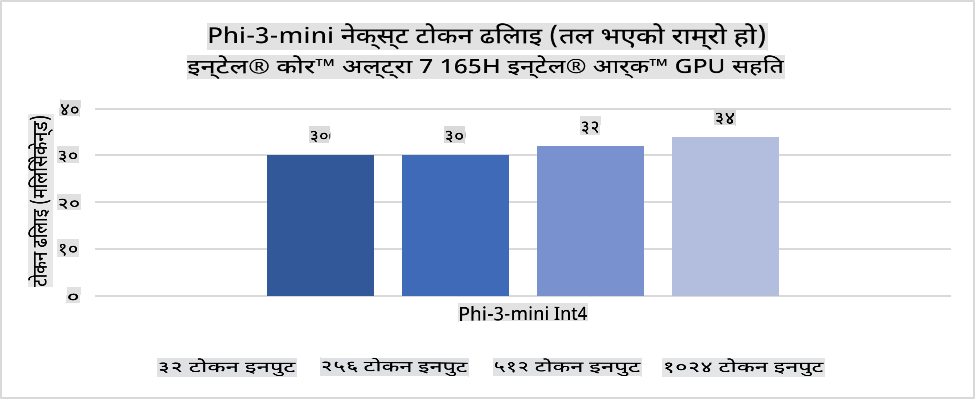
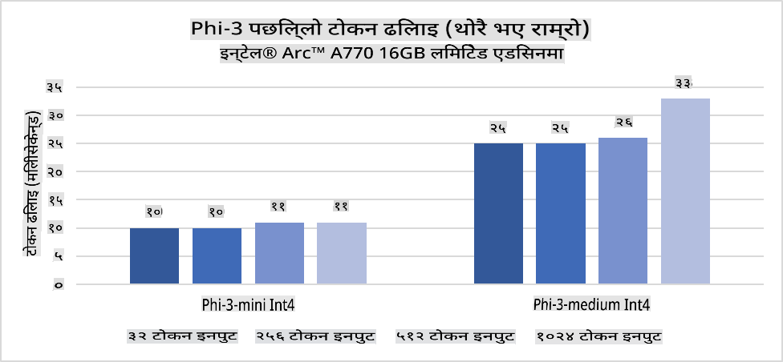
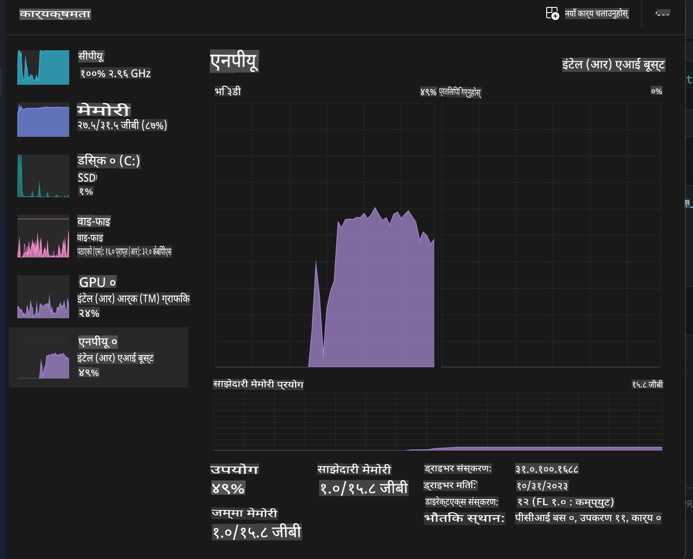
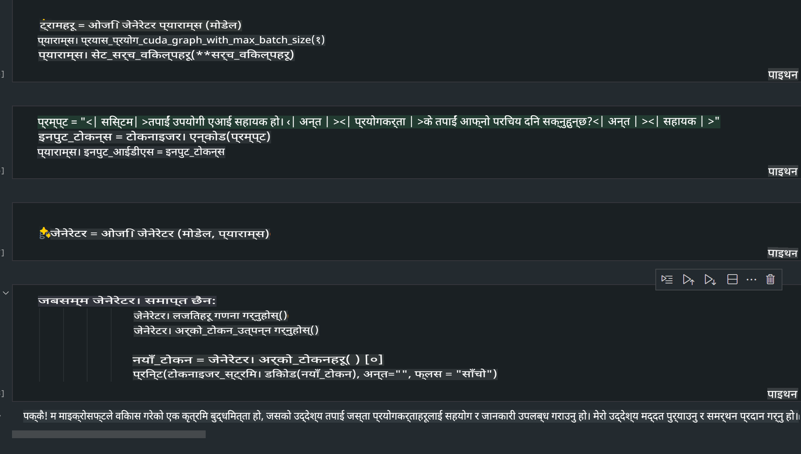
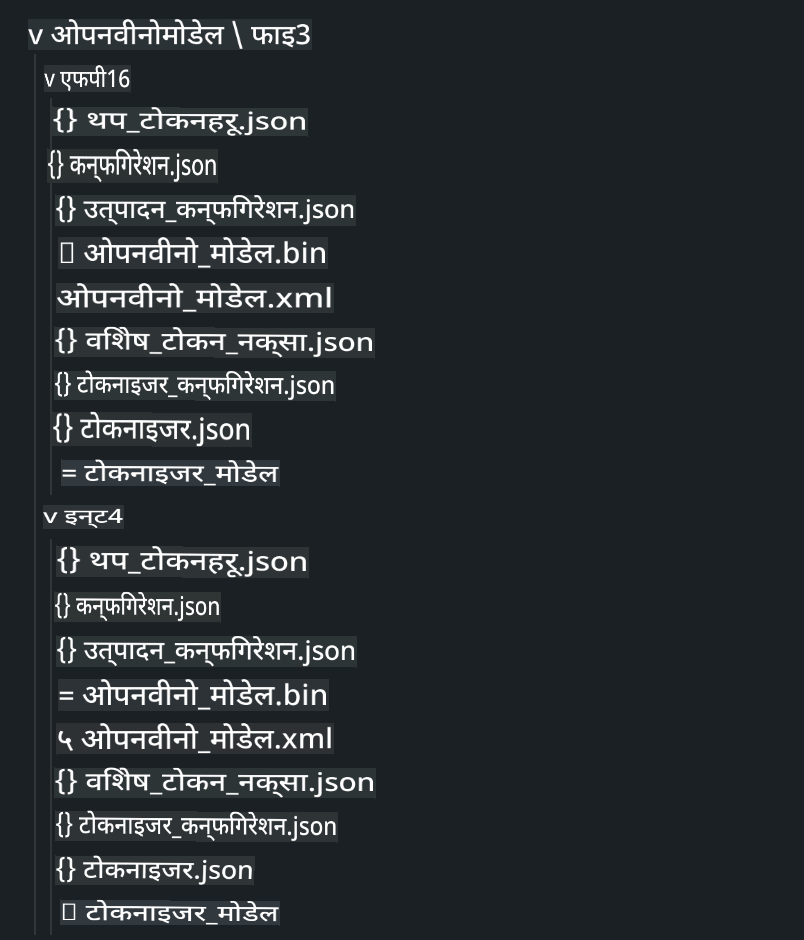
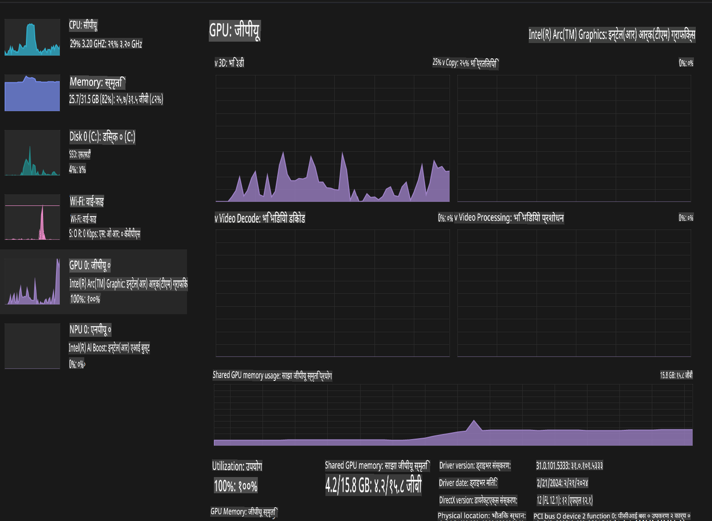

# **AI PC मा Phi-3 को इनफरेन्स**

जेनरेटिभ AI को प्रगतिसँगै र एज डिभाइसहरूको हार्डवेयर क्षमतामा सुधारसँगै, अब धेरै जेनरेटिभ AI मोडेलहरू प्रयोगकर्ताहरूको BYOD (Bring Your Own Device) डिभाइसहरूमा एकीकृत गर्न सकिन्छ। AI PC हरू यस्तै मोडेलहरू मध्ये एक हुन्। 2024 देखि, Intel, AMD, र Qualcomm ले PC निर्माता कम्पनीहरूसँग मिलेर हार्डवेयर परिमार्जनको माध्यमबाट स्थानीय जेनरेटिभ AI मोडेलहरू तैनाथ गर्न सक्षम AI PC हरू प्रस्तुत गर्ने योजना बनाएका छन्। यस छलफलमा, हामी Intel AI PC हरूमा केन्द्रित हुनेछौं र Intel AI PC मा Phi-3 कसरी तैनाथ गर्ने भन्ने कुरा बुझ्नेछौं।

### NPU भनेको के हो?

NPU (Neural Processing Unit) एक समर्पित प्रोसेसर वा ठूलो SoC (System on Chip) मा समावेश गरिएको युनिट हो, जसले न्यूरल नेटवर्क अपरेशन र AI कार्यहरूलाई तीव्र बनाउँछ। सामान्य CPU र GPU भन्दा फरक, NPU हरू डाटा-चालित समानान्तर कम्प्युटिङका लागि अनुकूलित छन्, जसले तस्बिर र भिडियोजस्ता विशाल मल्टिमिडिया डाटालाई कुशलतापूर्वक प्रशोधन गर्न सक्षम बनाउँछ। यी AI सम्बन्धित कार्यहरू, जस्तै स्पिच रिकग्निसन, भिडियो कलहरूमा पृष्ठभूमि ब्लरिङ, र फोटो वा भिडियो सम्पादन प्रक्रियाहरू (जस्तै वस्तु पहिचान) मा विशेष रूपमा प्रभावकारी छन्।

## NPU बनाम GPU

यद्यपि धेरै AI र मेशिन लर्निङ वर्कलोडहरू GPU मा चल्छन्, GPU र NPU बीचमा महत्त्वपूर्ण भिन्नता छ।
GPU हरू समानान्तर कम्प्युटिङ क्षमताका लागि परिचित छन्, तर सबै GPU हरू ग्राफिक्स प्रोसेसिङ बाहेकका कामहरूमा समान रूपले कुशल हुँदैनन्। NPU हरू, अर्कोतर्फ, न्यूरल नेटवर्क अपरेशनहरूमा लाग्ने जटिल गणनाहरूका लागि विशेष रूपमा डिजाइन गरिएका हुन्छन्, जसले तिनीहरूलाई AI कार्यहरूको लागि अत्यन्त प्रभावकारी बनाउँछ।

संक्षेपमा, NPU हरू AI गणनाहरूलाई तीव्र बनाउने गणितका माहिर हुन्, र यी AI PC को उदीयमान युगमा महत्त्वपूर्ण भूमिका खेल्छन्!

***यो उदाहरण Intel को नयाँ Intel Core Ultra Processor मा आधारित छ।***

## **1. NPU प्रयोग गरेर Phi-3 मोडेल चलाउनुहोस्**

Intel® NPU डिभाइस Intel® Core™ Ultra जेनरेशनका CPU (पहिले Meteor Lake का नामले चिनिन्थ्यो) मा समावेश गरिएको AI इनफरेन्स एक्सेलेरेटर हो। यसले कृत्रिम न्यूरल नेटवर्क कार्यहरूको ऊर्जा-कुशल कार्यान्वयन सक्षम बनाउँछ।





**Intel NPU Acceleration Library**

Intel NPU Acceleration Library [https://github.com/intel/intel-npu-acceleration-library](https://github.com/intel/intel-npu-acceleration-library) एक Python लाइब्रेरी हो जसले Intel Neural Processing Unit (NPU) को शक्ति प्रयोग गरेर उपयुक्त हार्डवेयरमा उच्च-गति गणनाहरू गर्न तपाईंको एप्लिकेसनहरूको कार्यक्षमता बढाउँछ।

Intel® Core™ Ultra प्रोसेसरहरूले संचालित AI PC मा Phi-3-mini को उदाहरण:


Python लाइब्रेरीलाई pip मार्फत इन्स्टल गर्नुहोस्:

```bash

   pip install intel-npu-acceleration-library

```

***Note*** यो प्रोजेक्ट अझै विकासको क्रममा छ, तर रेफरेन्स मोडेल पहिले नै धेरै परिपूर्ण छ।

### **Intel NPU Acceleration Library प्रयोग गरेर Phi-3 चलाउनुहोस्**

Intel NPU एक्सेलेरेशन प्रयोग गर्दा, यो लाइब्रेरीले परम्परागत एनकोडिङ प्रक्रियालाई असर गर्दैन। तपाईंले केवल यो लाइब्रेरी प्रयोग गरेर मूल Phi-3 मोडेललाई क्वान्टाइज गर्नुपर्छ, जस्तै FP16, INT8, INT4।

```python
from transformers import AutoTokenizer, pipeline,TextStreamer
from intel_npu_acceleration_library import NPUModelForCausalLM, int4
from intel_npu_acceleration_library.compiler import CompilerConfig
import warnings

model_id = "microsoft/Phi-3-mini-4k-instruct"

compiler_conf = CompilerConfig(dtype=int4)
model = NPUModelForCausalLM.from_pretrained(
    model_id, use_cache=True, config=compiler_conf, attn_implementation="sdpa"
).eval()

tokenizer = AutoTokenizer.from_pretrained(model_id)

text_streamer = TextStreamer(tokenizer, skip_prompt=True)
```

क्वान्टिफिकेसन सफल भएपछि, NPU लाई कल गरेर Phi-3 मोडेल चलाउन अगाडि बढ्नुहोस्।

```python
generation_args = {
   "max_new_tokens": 1024,
   "return_full_text": False,
   "temperature": 0.3,
   "do_sample": False,
   "streamer": text_streamer,
}

pipe = pipeline(
   "text-generation",
   model=model,
   tokenizer=tokenizer,
)

query = "<|system|>You are a helpful AI assistant.<|end|><|user|>Can you introduce yourself?<|end|><|assistant|>"

with warnings.catch_warnings():
    warnings.simplefilter("ignore")
    pipe(query, **generation_args)
```

कोड चलाउँदा, हामी Task Manager मार्फत NPU को चलिरहेको स्थिति हेर्न सक्छौं।



***Samples*** : [AIPC_NPU_DEMO.ipynb](../../../../../code/03.Inference/AIPC/AIPC_NPU_DEMO.ipynb)

## **2. DirectML + ONNX Runtime प्रयोग गरेर Phi-3 मोडेल चलाउनुहोस्**

### **DirectML भनेको के हो?**

[DirectML](https://github.com/microsoft/DirectML) एक उच्च-प्रदर्शन, हार्डवेयर-एक्सेलेरेटेड DirectX 12 लाइब्रेरी हो, जुन मेशिन लर्निङको लागि डिजाइन गरिएको हो। DirectML ले AMD, Intel, NVIDIA, र Qualcomm जस्ता विक्रेताहरूका सबै DirectX 12-सक्षम GPU हरूमा सामान्य मेशिन लर्निङ कार्यहरूको GPU एक्सेलेरेशन प्रदान गर्दछ।

DirectML लाई स्ट्यान्डअलोन प्रयोग गर्दा, यो DirectX 12 को कम-स्तरीय लाइब्रेरी हो, र उच्च-प्रदर्शन, कम-विलम्बिता अनुप्रयोगहरूको लागि उपयुक्त छ। Direct3D 12 सँगको सहज अन्तरक्रिया र यसको कम ओभरहेडले DirectML लाई मेशिन लर्निङ एक्सेलेरेट गर्न उपयुक्त बनाउँछ, विशेष गरी जब उच्च प्रदर्शन र हार्डवेयरमा स्थिरता आवश्यक हुन्छ।

***Note*** : नवीनतम DirectML ले पहिले नै NPU समर्थन गर्दछ (https://devblogs.microsoft.com/directx/introducing-neural-processor-unit-npu-support-in-directml-developer-preview/)

### DirectML र CUDA को क्षमता र प्रदर्शनको तुलनामा:

**DirectML** Microsoft द्वारा विकसित मेशिन लर्निङ लाइब्रेरी हो। यो Windows उपकरणहरूमा मेशिन लर्निङ वर्कलोडलाई तीव्र बनाउन डिजाइन गरिएको हो।
- DX12-आधारित: DirectML DirectX 12 (DX12) मा निर्माण गरिएको छ, जसले NVIDIA र AMD दुवै GPU हरूमा व्यापक हार्डवेयर समर्थन प्रदान गर्दछ।
- व्यापक समर्थन: DX12 प्रयोग गर्ने भएकाले, DirectML DX12 समर्थन गर्ने कुनै पनि GPU सँग काम गर्न सक्छ।
- छवि प्रशोधन: DirectML न्यूरल नेटवर्क प्रयोग गरेर छविहरू र अन्य डेटा प्रशोधन गर्दछ, जसले यसलाई छवि पहिचान, वस्तु पहिचान, र अन्य कार्यहरूको लागि उपयुक्त बनाउँछ।
- सजिलो सेटअप: DirectML सेटअप गर्न सजिलो छ, र यसलाई GPU निर्माताहरूका विशिष्ट SDK वा लाइब्रेरीहरूको आवश्यकता पर्दैन।
- प्रदर्शन: केही अवस्थामा, DirectML राम्रो प्रदर्शन दिन्छ र CUDA भन्दा छिटो हुन सक्छ, विशेष गरी निश्चित वर्कलोडहरूमा।
- सीमितता: तर, केही अवस्थामा, विशेष गरी float16 ठूला ब्याच साइजहरूमा, DirectML ढिलो हुन सक्छ।

**CUDA** NVIDIA को समानान्तर कम्प्युटिङ प्लेटफर्म र प्रोग्रामिङ मोडेल हो। यसले NVIDIA GPU को शक्ति प्रयोग गरेर सामान्य-उद्देश्यीय कम्प्युटिङ, मेशिन लर्निङ, र वैज्ञानिक सिमुलेसनहरू सक्षम बनाउँछ।
- NVIDIA-विशिष्ट: CUDA NVIDIA GPU सँग कडा रूपमा एकीकृत छ र विशेष रूपमा तिनका लागि डिजाइन गरिएको छ।
- अत्यधिक अनुकूलित: यसले GPU-एक्सेलेरेटेड कार्यहरूको लागि उत्कृष्ट प्रदर्शन प्रदान गर्दछ, विशेष गरी NVIDIA GPU हरू प्रयोग गर्दा।
- व्यापक रूपमा प्रयोग हुने: धेरै मेशिन लर्निङ फ्रेमवर्कहरू र लाइब्रेरीहरू (जस्तै TensorFlow र PyTorch) ले CUDA समर्थन गर्दछ।
- अनुकूलन: विकासकर्ताहरूले CUDA सेटिङहरू विशिष्ट कार्यहरूको लागि परिमार्जन गर्न सक्छन्, जसले इष्टतम प्रदर्शन दिन सक्छ।
- सीमितता: तर, CUDA को NVIDIA हार्डवेयरमा निर्भरता, यदि तपाईं विभिन्न GPU हरूमा व्यापक अनुकूलता चाहनुहुन्छ भने, सीमित हुन सक्छ।

### DirectML र CUDA बीच छनोट गर्नुहोस्

DirectML र CUDA बीचको छनोट तपाईंको विशेष प्रयोग केस, हार्डवेयर उपलब्धता, र प्राथमिकतामा निर्भर गर्दछ।
यदि तपाईं व्यापक अनुकूलता र सजिलो सेटअप खोज्दै हुनुहुन्छ भने, DirectML राम्रो विकल्प हुन सक्छ। तर, यदि तपाईंसँग NVIDIA GPU छ र अत्यधिक अनुकूलित प्रदर्शन आवश्यक छ भने, CUDA बलियो विकल्प रहन्छ। संक्षेपमा, DirectML र CUDA दुबैका आफ्नै फाइदा र सीमितता छन्, त्यसैले निर्णय गर्दा तपाईंको आवश्यकताहरू र उपलब्ध हार्डवेयरलाई ध्यान दिनुहोस्।

### **ONNX Runtime का साथ जेनरेटिभ AI**

AI को युगमा, AI मोडेलहरूको पोर्टेबिलिटी धेरै महत्त्वपूर्ण छ। ONNX Runtime ले प्रशिक्षित मोडेलहरूलाई सजिलै विभिन्न उपकरणहरूमा तैनाथ गर्न सक्छ। विकासकर्ताहरूले इनफरेन्स फ्रेमवर्कमा ध्यान दिनु पर्दैन र एकीकृत API प्रयोग गरेर मोडेल इनफरेन्स पूरा गर्न सक्छन्। जेनरेटिभ AI को युगमा, ONNX Runtime ले पनि कोड अनुकूलन गरेको छ (https://onnxruntime.ai/docs/genai/)। अनुकूलित ONNX Runtime मार्फत, क्वान्टाइज गरिएको जेनरेटिभ AI मोडेललाई विभिन्न टर्मिनलहरूमा इनफर गर्न सकिन्छ। Generative AI with ONNX Runtime मा, तपाईं Python, C#, C / C++ प्रयोग गरेर AI मोडेल API इनफर गर्न सक्नुहुन्छ। अवश्य पनि, iPhone मा तैनाथ गर्दा C++ को Generative AI with ONNX Runtime API को फाइदा लिन सकिन्छ।

[Sample Code](https://github.com/Azure-Samples/Phi-3MiniSamples/tree/main/onnx)

***ONNX Runtime लाइब्रेरीसँग जेनरेटिभ AI कम्पाइल गर्नुहोस्***

```bash

winget install --id=Kitware.CMake  -e

git clone https://github.com/microsoft/onnxruntime.git

cd .\onnxruntime\

./build.bat --build_shared_lib --skip_tests --parallel --use_dml --config Release

cd ../

git clone https://github.com/microsoft/onnxruntime-genai.git

cd .\onnxruntime-genai\

mkdir ort

cd ort

mkdir include

mkdir lib

copy ..\onnxruntime\include\onnxruntime\core\providers\dml\dml_provider_factory.h ort\include

copy ..\onnxruntime\include\onnxruntime\core\session\onnxruntime_c_api.h ort\include

copy ..\onnxruntime\build\Windows\Release\Release\*.dll ort\lib

copy ..\onnxruntime\build\Windows\Release\Release\onnxruntime.lib ort\lib

python build.py --use_dml


```

**लाइब्रेरी इन्स्टल गर्नुहोस्**

```bash

pip install .\onnxruntime_genai_directml-0.3.0.dev0-cp310-cp310-win_amd64.whl

```

यो चलिरहेको नतिजा हो:



***Samples*** : [AIPC_DirectML_DEMO.ipynb](../../../../../code/03.Inference/AIPC/AIPC_DirectML_DEMO.ipynb)

## **3. Intel OpenVINO प्रयोग गरेर Phi-3 मोडेल चलाउनुहोस्**

### **OpenVINO भनेको के हो?**

[OpenVINO](https://github.com/openvinotoolkit/openvino) गहिरो सिकाइ मोडेलहरूलाई अनुकूलन र तैनाथ गर्नका लागि ओपन-सोर्स टूलकिट हो। यसले TensorFlow, PyTorch, र अन्य लोकप्रिय फ्रेमवर्कबाट भिजन, अडियो, र भाषा मोडेलहरूको लागि प्रदर्शनलाई बढाउँछ। OpenVINO CPU र GPU सँग मिलाएर Phi-3 मोडेल चलाउन पनि प्रयोग गर्न सकिन्छ।

***Note***: हालको समयमा, OpenVINO ले NPU समर्थन गर्दैन।

### **OpenVINO लाइब्रेरी इन्स्टल गर्नुहोस्**

```bash

 pip install git+https://github.com/huggingface/optimum-intel.git

 pip install git+https://github.com/openvinotoolkit/nncf.git

 pip install openvino-nightly

```

### **OpenVINO प्रयोग गरेर Phi-3 चलाउनुहोस्**

NPU जस्तै, OpenVINO ले क्वान्टिटेटिभ मोडेल चलाएर जेनरेटिभ AI मोडेलहरूको कल पूरा गर्दछ। हामीले सुरुमा Phi-3 मोडेललाई क्वान्टाइज गर्नुपर्छ र कमाण्ड लाइनमार्फत optimum-cli प्रयोग गरेर मोडेल क्वान्टाइजेसन पूरा गर्नुपर्छ।

**INT4**

```bash

optimum-cli export openvino --model "microsoft/Phi-3-mini-4k-instruct" --task text-generation-with-past --weight-format int4 --group-size 128 --ratio 0.6  --sym  --trust-remote-code ./openvinomodel/phi3/int4

```

**FP16**

```bash

optimum-cli export openvino --model "microsoft/Phi-3-mini-4k-instruct" --task text-generation-with-past --weight-format fp16 --trust-remote-code ./openvinomodel/phi3/fp16

```

कनभर्ट गरिएको फर्म्याट यस्तो देखिन्छ:



OVModelForCausalLM मार्फत मोडेल पथहरू (model_dir), सम्बन्धित कन्फिगरेसनहरू (ov_config = {"PERFORMANCE_HINT": "LATENCY", "NUM_STREAMS": "1", "CACHE_DIR": ""}), र हार्डवेयर-एक्सेलेरेटेड डिभाइसहरू (GPU.0) लोड गर्नुहोस्।

```python

ov_model = OVModelForCausalLM.from_pretrained(
     model_dir,
     device='GPU.0',
     ov_config=ov_config,
     config=AutoConfig.from_pretrained(model_dir, trust_remote_code=True),
     trust_remote_code=True,
)

```

कोड चलाउँदा, हामी Task Manager मार्फत GPU को चलिरहेको स्थिति हेर्न सक्छौं।



***Samples*** : [AIPC_OpenVino_Demo.ipynb](../../../../../code/03.Inference/AIPC/AIPC_OpenVino_Demo.ipynb)

### ***Note*** : माथिका तीनवटा विधिहरूको आफ्नै फाइदा छन्, तर AI PC इनफरेन्सका लागि NPU एक्सेलेरेशन प्रयोग गर्न सिफारिस गरिन्छ।

**अस्वीकरण**:  
यो दस्तावेज मेशिन-आधारित एआई अनुवाद सेवाहरू प्रयोग गरी अनुवाद गरिएको हो। यद्यपि हामी शुद्धताको लागि प्रयास गर्छौं, कृपया ध्यान दिनुहोस् कि स्वचालित अनुवादहरूले त्रुटिहरू वा अशुद्धताहरू समावेश गर्न सक्छ। यसको मूल भाषामा रहेको मूल दस्तावेजलाई आधिकारिक स्रोत मानिनुपर्छ। महत्वपूर्ण जानकारीको लागि, व्यावसायिक मानव अनुवाद सिफारिस गरिन्छ। यस अनुवादको प्रयोगबाट उत्पन्न हुने कुनै पनि गलतफहमी वा गलत व्याख्याका लागि हामी जिम्मेवार हुनेछैनौं।