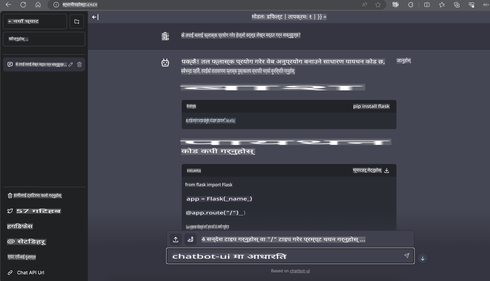

# **Nvidia Jetson मा Phi-3 को Inference**

Nvidia Jetson Nvidia बाट आएको एम्बेडेड कम्प्युटिङ बोर्डहरूको श्रृंखला हो। Jetson TK1, TX1, र TX2 मोडेलहरूमा Nvidia को Tegra प्रोसेसर (वा SoC) समावेश छ, जसले ARM आर्किटेक्चरमा आधारित सेंट्रल प्रोसेसिङ युनिट (CPU) एकीकृत गर्दछ। Jetson कम पावर खपत गर्ने प्रणाली हो र यो मेसिन लर्निङ एप्लिकेसनहरूलाई गति दिन डिजाइन गरिएको छ। Nvidia Jetson पेशेवर विकासकर्ताहरूले विभिन्न उद्योगहरूमा नवीन AI उत्पादनहरू बनाउन प्रयोग गर्छन्, र विद्यार्थी तथा उत्साहीहरूलाई हातले प्रयोग गर्न र अद्भुत प्रोजेक्टहरू बनाउनको लागि प्रयोग गरिन्छ। SLM Jetson जस्ता एज डिभाइसहरूमा तैनाथ गरिन्छ, जसले औद्योगिक जेनेरेटिभ AI एप्लिकेसन परिदृश्यहरूको राम्रो कार्यान्वयनलाई सक्षम बनाउँछ।

## NVIDIA Jetson मा डिप्लोयमेन्ट:
स्वायत्त रोबोटिक्स र एम्बेडेड डिभाइसहरूमा काम गर्ने विकासकर्ताहरूले Phi-3 Mini को उपयोग गर्न सक्छन्। Phi-3 को सानो आकारले यसलाई एज डिप्लोयमेन्टका लागि उपयुक्त बनाउँछ। प्रशिक्षणको क्रममा प्यारामिटरहरू ध्यानपूर्वक ट्युन गरिएका छन्, जसले प्रतिक्रियाहरूमा उच्च शुद्धता सुनिश्चित गर्छ।

### TensorRT-LLM अप्टिमाइजेसन:
NVIDIA को [TensorRT-LLM लाइब्रेरी](https://github.com/NVIDIA/TensorRT-LLM?WT.mc_id=aiml-138114-kinfeylo) ले ठूला भाषा मोडेलहरूको इन्फरेन्सलाई अप्टिमाइज गर्छ। यसले Phi-3 Mini को लामो कन्टेक्स्ट विन्डो समर्थन गर्दछ, जसले थ्रुपुट र लेटेन्सी दुवै सुधार गर्छ। अप्टिमाइजेसनहरूमा LongRoPE, FP8, र inflight batching जस्ता प्रविधिहरू समावेश छन्।

### उपलब्धता र डिप्लोयमेन्ट:
विकासकर्ताहरूले [NVIDIA's AI](https://www.nvidia.com/en-us/ai-data-science/generative-ai/) मा 128K कन्टेक्स्ट विन्डो भएको Phi-3 Mini अन्वेषण गर्न सक्छन्। यो NVIDIA NIM को रूपमा प्याकेज गरिएको छ, जुन मानक API भएको माइक्रोसर्भिस हो र जुन जुनसुकै ठाउँमा डिप्लोय गर्न सकिन्छ। थप रूपमा, [GitHub मा TensorRT-LLM कार्यान्वयनहरू](https://github.com/NVIDIA/TensorRT-LLM) उपलब्ध छन्।

## **1. तयारी**

a. Jetson Orin NX / Jetson NX

b. JetPack 5.1.2+
   
c. Cuda 11.8
   
d. Python 3.8+

## **2. Jetson मा Phi-3 चलाउने तरिका**

हामी [Ollama](https://ollama.com) वा [LlamaEdge](https://llamaedge.com) छनोट गर्न सक्छौं।

यदि तपाईं gguf लाई क्लाउड र एज डिभाइसहरूमा एकै समयमा प्रयोग गर्न चाहनुहुन्छ भने, LlamaEdge लाई WasmEdge को रूपमा बुझ्न सकिन्छ (WasmEdge एक हल्का, उच्च-प्रदर्शन, स्केलेबल WebAssembly रनटाइम हो, जुन क्लाउड नेटिभ, एज, र विकेन्द्रित एप्लिकेसनहरूको लागि उपयुक्त छ। यसले सर्भरलेस एप्लिकेसनहरू, एम्बेडेड फङ्सनहरू, माइक्रोसर्भिसहरू, स्मार्ट कन्ट्र्याक्टहरू, र IoT डिभाइसहरूलाई समर्थन गर्दछ। तपाईं gguf को मात्रात्मक मोडेललाई LlamaEdge मार्फत एज डिभाइसहरू र क्लाउडमा डिप्लोय गर्न सक्नुहुन्छ।)


प्रयोग गर्ने चरणहरू यहाँ छन्:

1. सम्बन्धित लाइब्रेरीहरू र फाइलहरू स्थापना र डाउनलोड गर्नुहोस्

```bash

curl -sSf https://raw.githubusercontent.com/WasmEdge/WasmEdge/master/utils/install.sh | bash -s -- --plugin wasi_nn-ggml

curl -LO https://github.com/LlamaEdge/LlamaEdge/releases/latest/download/llama-api-server.wasm

curl -LO https://github.com/LlamaEdge/chatbot-ui/releases/latest/download/chatbot-ui.tar.gz

tar xzf chatbot-ui.tar.gz

```

**नोट**: llama-api-server.wasm र chatbot-ui एउटै डाइरेक्टरीमा हुनुपर्छ।

2. टर्मिनलमा स्क्रिप्टहरू चलाउनुहोस्

```bash

wasmedge --dir .:. --nn-preload default:GGML:AUTO:{Your gguf path} llama-api-server.wasm -p phi-3-chat

```

चलाउने नतिजा यहाँ छ:



***नमूना कोड*** [Phi-3 Mini WASM Notebook Sample](https://github.com/Azure-Samples/Phi-3MiniSamples/tree/main/wasm)

समग्रमा, Phi-3 Mini ले भाषा मोडेलिङमा ठूलो फड्को प्रस्तुत गर्दछ, जसले कार्यक्षमता, सन्दर्भ बुझाइ, र NVIDIA को अप्टिमाइजेसन क्षमताहरूलाई संयोजन गर्छ। चाहे तपाईं रोबोटहरू बनाउँदै हुनुहुन्छ वा एज एप्लिकेसनहरू, Phi-3 Mini एउटा शक्तिशाली उपकरण हो जसको बारेमा जान्नुपर्छ।

**अस्वीकरण**:  
यो दस्तावेज मेसिन-आधारित एआई अनुवाद सेवाहरू प्रयोग गरेर अनुवाद गरिएको छ। हामी यथासम्भव सही अनुवाद प्रदान गर्न प्रयास गर्दछौं, तर कृपया ध्यान दिनुहोस् कि स्वचालित अनुवादहरूमा त्रुटिहरू वा अशुद्धताहरू हुन सक्छ। मूल भाषामा रहेको मूल दस्तावेजलाई नै आधिकारिक स्रोत मानिनुपर्छ। महत्वपूर्ण जानकारीको लागि, व्यावसायिक मानव अनुवाद सिफारिस गरिन्छ। यो अनुवाद प्रयोग गर्दा उत्पन्न हुने कुनै पनि गलतफहमी वा गलत व्याख्याको लागि हामी जिम्मेवार हुने छैनौं।