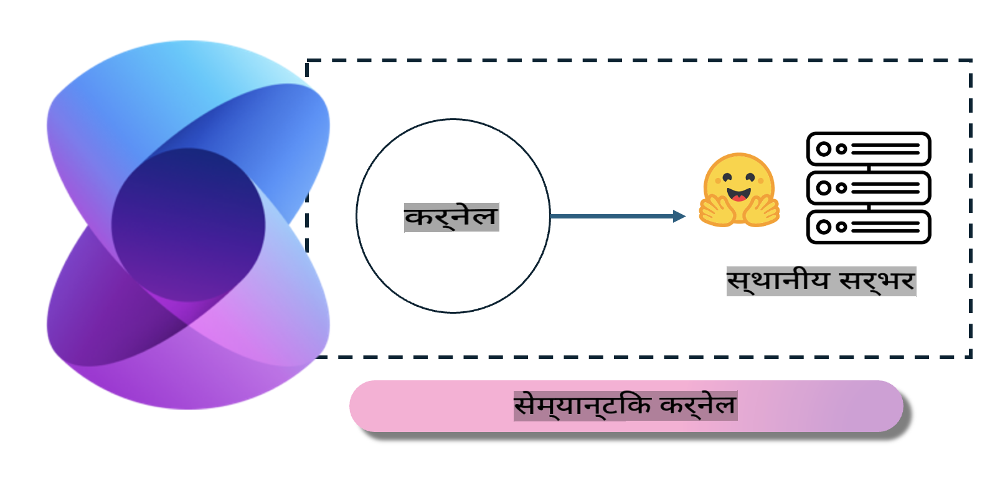
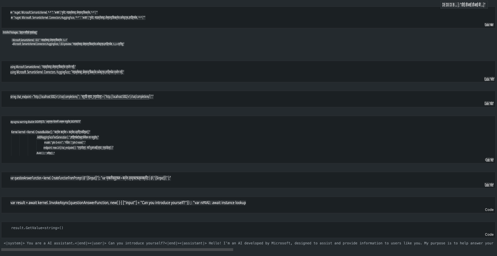

# **स्थानीय सर्भरमा Phi-3 इन्फरेन्स**

हामी Phi-3 लाई स्थानीय सर्भरमा डिप्लोय गर्न सक्छौं। प्रयोगकर्ताहरूले [Ollama](https://ollama.com) वा [LM Studio](https://llamaedge.com) समाधानहरू छनोट गर्न सक्छन्, वा आफ्नो कोड लेख्न सक्छन्। तपाईं [Semantic Kernel](https://github.com/microsoft/semantic-kernel?WT.mc_id=aiml-138114-kinfeylo) वा [Langchain](https://www.langchain.com/) को माध्यमबाट Phi-3 को स्थानीय सेवाहरूमा जडान गरेर Copilot एप्लिकेसनहरू बनाउन सक्नुहुन्छ।

## **Semantic Kernel प्रयोग गरेर Phi-3-mini पहुँच गर्नुहोस्**

Copilot एप्लिकेसनमा, हामी Semantic Kernel / LangChain मार्फत एप्लिकेसनहरू बनाउँछौं। यस्तो प्रकारको एप्लिकेसन फ्रेमवर्क सामान्यतया Azure OpenAI Service / OpenAI मोडेलहरूसँग उपयुक्त हुन्छ, र Hugging Face मा रहेको ओपन सोर्स मोडेलहरू तथा स्थानीय मोडेलहरूको पनि समर्थन गर्न सक्छ। यदि हामीले Phi-3-mini पहुँच गर्न Semantic Kernel प्रयोग गर्नुपर्‍यो भने के गर्नुपर्छ? .NET लाई उदाहरणको रूपमा प्रयोग गरेर, हामी यसलाई Semantic Kernel मा Hugging Face Connector सँग संयोजन गर्न सक्छौं। डिफल्ट रूपमा, यसले Hugging Face मा रहेको मोडेल आईडीसँग मेल खान्छ (पहिलो पटक प्रयोग गर्दा, मोडेल Hugging Face बाट डाउनलोड हुनेछ, जसमा धेरै समय लाग्छ)। तपाईं यसलाई स्थानीय रूपमा बनाइएको सर्भरमा पनि जडान गर्न सक्नुहुन्छ। यी दुईको तुलनामा, हामी दोस्रो विकल्प सिफारिस गर्छौं किनभने यसमा उच्च स्तरको स्वायत्तता हुन्छ, विशेष गरी व्यवसायिक एप्लिकेसनहरूमा।

चित्रमा देखिएझैं, Semantic Kernel को माध्यमबाट स्थानीय सेवाहरूमा पहुँच गरेर आफैंले बनाएको Phi-3-mini मोडेल सर्भरसँग सजिलै जडान गर्न सकिन्छ। यहाँ चलिरहेको परिणाम छ।

***नमूना कोड*** https://github.com/kinfey/Phi3MiniSamples/tree/main/semantickernel

**अस्वीकरण**:  
यो दस्तावेज मेशिन-आधारित एआई अनुवाद सेवाहरू प्रयोग गरेर अनुवाद गरिएको हो। हामी यथासम्भव सही अनुवाद प्रदान गर्न प्रयास गर्दछौं, तर कृपया जानकार रहनुहोस् कि स्वचालित अनुवादमा त्रुटिहरू वा अशुद्धताहरू हुन सक्छ। मूल भाषामा रहेको मूल दस्तावेजलाई आधिकारिक स्रोत मान्नुपर्छ। महत्वपूर्ण जानकारीका लागि, व्यावसायिक मानव अनुवाद सिफारिस गरिन्छ। यो अनुवाद प्रयोगबाट उत्पन्न हुने कुनै पनि गलतफहमी वा गलत व्याख्याका लागि हामी जिम्मेवार हुनेछैनौं। 