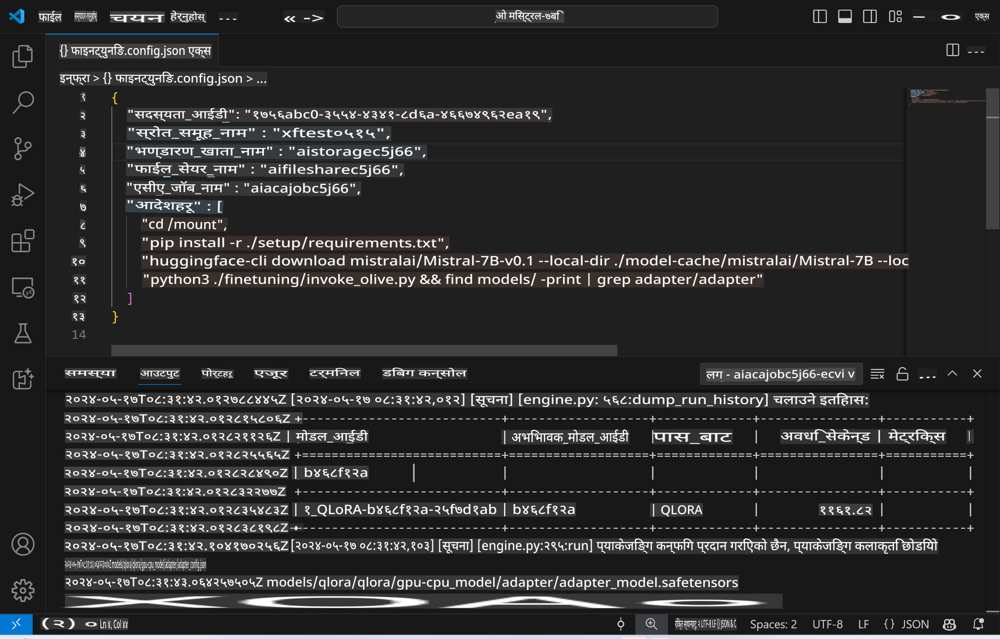
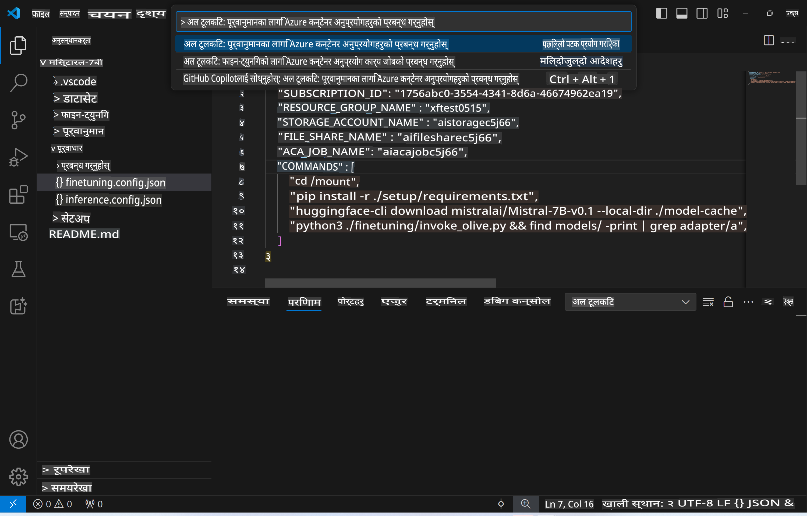
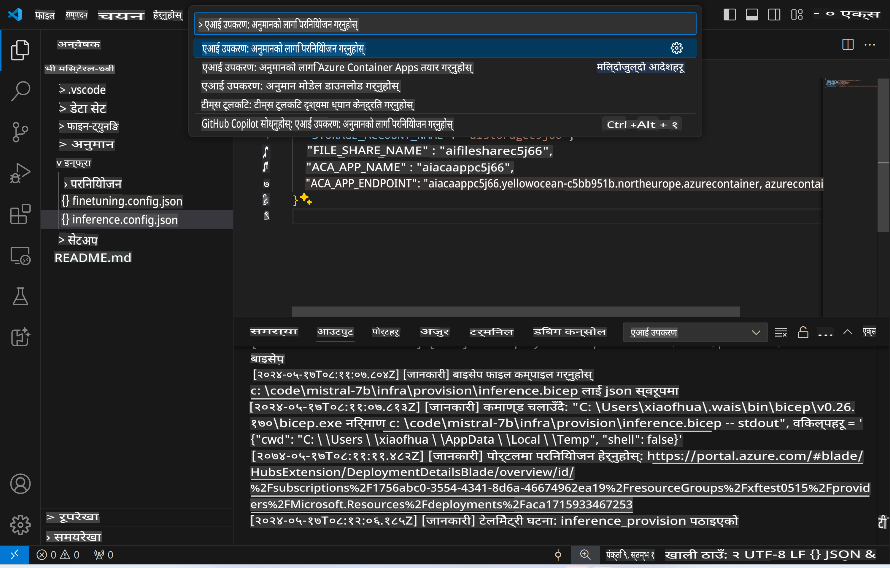
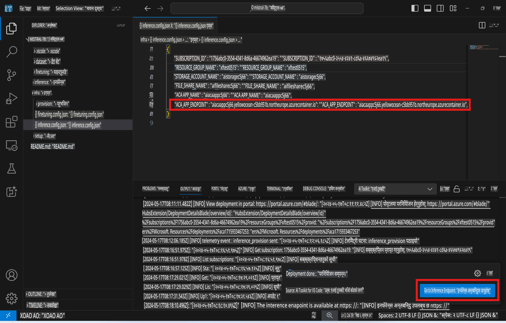

# फाइन-ट्यून गरिएको मोडेलसँग रिमोट इनफरेन्सिङ

रिमोट वातावरणमा एडाप्टरहरू प्रशिक्षण गरेपछि, मोडेलसँग अन्तरक्रिया गर्न एउटा साधारण Gradio एप्लिकेसन प्रयोग गर्नुहोस्।



### Azure स्रोतहरू तयार पार्नुहोस्
रिमोट इनफरेन्सका लागि Azure स्रोतहरू सेटअप गर्न, कमाण्ड प्यालेटबाट `AI Toolkit: Provision Azure Container Apps for inference` चलाउनुहोस्। यो सेटअपको क्रममा तपाईंलाई आफ्नो Azure सब्स्क्रिप्सन र स्रोत समूह चयन गर्न सोधिनेछ।  


डिफल्ट रूपमा, इनफरेन्सका लागि सब्स्क्रिप्सन र स्रोत समूह फाइन-ट्यूनिङका लागि प्रयोग गरिएका सेटिङ्ससँग मिल्नुपर्छ। इनफरेन्सले त्यही Azure Container App Environment प्रयोग गर्नेछ र फाइन-ट्यूनिङ चरणमा Azure Files मा स्टोर गरिएको मोडेल र मोडेल एडाप्टरलाई एक्सेस गर्नेछ। 

## AI Toolkit प्रयोग गर्दै

### इनफरेन्सको लागि डिप्लोयमेन्ट  
यदि तपाईं इनफरेन्स कोड संशोधन गर्न वा इनफरेन्स मोडेल पुनः लोड गर्न चाहनुहुन्छ भने, कृपया `AI Toolkit: Deploy for inference` कमाण्ड चलाउनुहोस्। यसले तपाईंको पछिल्लो कोडलाई ACA सँग समिकरण गर्नेछ र रेप्लिका पुनः सुरु गर्नेछ।  



डिप्लोयमेन्ट सफलतापूर्वक सम्पन्न भएपछि, मोडेल अब यस अन्तबिन्दुको माध्यमबाट मूल्याङ्कन गर्न तयार हुनेछ।

### इनफरेन्स API पहुँच गर्ने

तपाईं "*Go to Inference Endpoint*" बटनमा क्लिक गरेर, जुन VSCode नोटिफिकेसनमा देखिन्छ, इनफरेन्स API पहुँच गर्न सक्नुहुन्छ। वैकल्पिक रूपमा, वेब API अन्तबिन्दु `ACA_APP_ENDPOINT` मा `./infra/inference.config.json` र आउटपुट प्यानलमा पाउन सकिन्छ।



> **नोट:** इनफरेन्स अन्तबिन्दुलाई पूर्ण रूपमा सञ्चालनमा आउन केही मिनेट लाग्न सक्छ।

## टेम्प्लेटमा समावेश इनफरेन्स कम्पोनेन्टहरू
 
| फोल्डर | सामग्री |
| ------ |--------- |
| `infra` | रिमोट अपरेसनका लागि आवश्यक सबै कन्फिगरेसनहरू समावेश गर्दछ। |
| `infra/provision/inference.parameters.json` | बाइसेप टेम्प्लेटहरूका लागि प्यारामिटरहरू समावेश गर्दछ, जुन Azure स्रोतहरू तयार गर्न प्रयोग गरिन्छ। |
| `infra/provision/inference.bicep` | Azure स्रोतहरू तयार गर्नका लागि टेम्प्लेटहरू समावेश गर्दछ। |
| `infra/inference.config.json` | कन्फिगरेसन फाइल, जुन `AI Toolkit: Provision Azure Container Apps for inference` कमाण्डले उत्पादन गर्दछ। यो अन्य रिमोट कमाण्ड प्यालेटहरूको इनपुटको रूपमा प्रयोग गरिन्छ। |

### Azure स्रोत तयार गर्न AI Toolkit प्रयोग गर्दै
[AI Toolkit](https://marketplace.visualstudio.com/items?itemName=ms-windows-ai-studio.windows-ai-studio) कन्फिगर गर्नुहोस्।

इनफरेन्सका लागि Azure Container Apps तयार गर्नुहोस्` command.

You can find configuration parameters in `./infra/provision/inference.parameters.json` file. Here are the details:
| Parameter | Description |
| --------- |------------ |
| `defaultCommands` | This is the commands to initiate a web API. |
| `maximumInstanceCount` | This parameter sets the maximum capacity of GPU instances. |
| `location` | This is the location where Azure resources are provisioned. The default value is the same as the chosen resource group's location. |
| `storageAccountName`, `fileShareName` `acaEnvironmentName`, `acaEnvironmentStorageName`, `acaAppName`,  `acaLogAnalyticsName` | These parameters are used to name the Azure resources for provision. By default, they will be same to the fine-tuning resource name. You can input a new, unused resource name to create your own custom-named resources, or you can input the name of an already existing Azure resource if you'd prefer to use that. For details, refer to the section [Using existing Azure Resources](../../../../../md/01.Introduction/03). |

### Using Existing Azure Resources

By default, the inference provision use the same Azure Container App Environment, Storage Account, Azure File Share, and Azure Log Analytics that were used for fine-tuning. A separate Azure Container App is created solely for the inference API. 

If you have customized the Azure resources during the fine-tuning step or want to use your own existing Azure resources for inference, specify their names in the `./infra/inference.parameters.json` फाइल। त्यसपछि, कमाण्ड प्यालेटबाट `AI Toolkit: Provision Azure Container Apps for inference` कमाण्ड चलाउनुहोस्। यसले निर्दिष्ट स्रोतहरू अद्यावधिक गर्नेछ र हराएका स्रोतहरू सिर्जना गर्नेछ।

उदाहरणका लागि, यदि तपाईंसँग पहिले नै Azure कन्टेनर वातावरण छ भने, तपाईंको `./infra/finetuning.parameters.json` यस्तो देखिनुपर्छ:

```json
{
    "$schema": "https://schema.management.azure.com/schemas/2019-04-01/deploymentParameters.json#",
    "contentVersion": "1.0.0.0",
    "parameters": {
      ...
      "acaEnvironmentName": {
        "value": "<your-aca-env-name>"
      },
      "acaEnvironmentStorageName": {
        "value": null
      },
      ...
    }
  }
```

### म्यानुअल रूपमा तयार गर्नुहोस्  
यदि तपाईं Azure स्रोतहरू म्यानुअल रूपमा कन्फिगर गर्न चाहनुहुन्छ भने, `./infra/provision` folders. If you have already set up and configured all the Azure resources without using the AI Toolkit command palette, you can simply enter the resource names in the `inference.config.json` फाइलमा उपलब्ध बाइसेप फाइलहरू प्रयोग गर्न सक्नुहुन्छ।

उदाहरणका लागि:

```json
{
  "SUBSCRIPTION_ID": "<your-subscription-id>",
  "RESOURCE_GROUP_NAME": "<your-resource-group-name>",
  "STORAGE_ACCOUNT_NAME": "<your-storage-account-name>",
  "FILE_SHARE_NAME": "<your-file-share-name>",
  "ACA_APP_NAME": "<your-aca-name>",
  "ACA_APP_ENDPOINT": "<your-aca-endpoint>"
}
```

**अस्वीकरण**:  
यो दस्तावेज मेसिन-आधारित एआई अनुवाद सेवाहरू प्रयोग गरेर अनुवाद गरिएको छ। यद्यपि हामी शुद्धताको लागि प्रयास गर्छौं, कृपया ध्यान दिनुहोस् कि स्वचालित अनुवादहरूमा त्रुटि वा असत्यता हुन सक्छ। मूल भाषामा रहेको मूल दस्तावेजलाई प्राधिकृत स्रोतको रूपमा मानिनुपर्छ। महत्वपूर्ण जानकारीका लागि, व्यावसायिक मानव अनुवाद सिफारिस गरिन्छ। यस अनुवादको प्रयोगबाट उत्पन्न हुने कुनै पनि गलतफहमी वा गलत व्याख्याको लागि हामी उत्तरदायी हुने छैनौं।