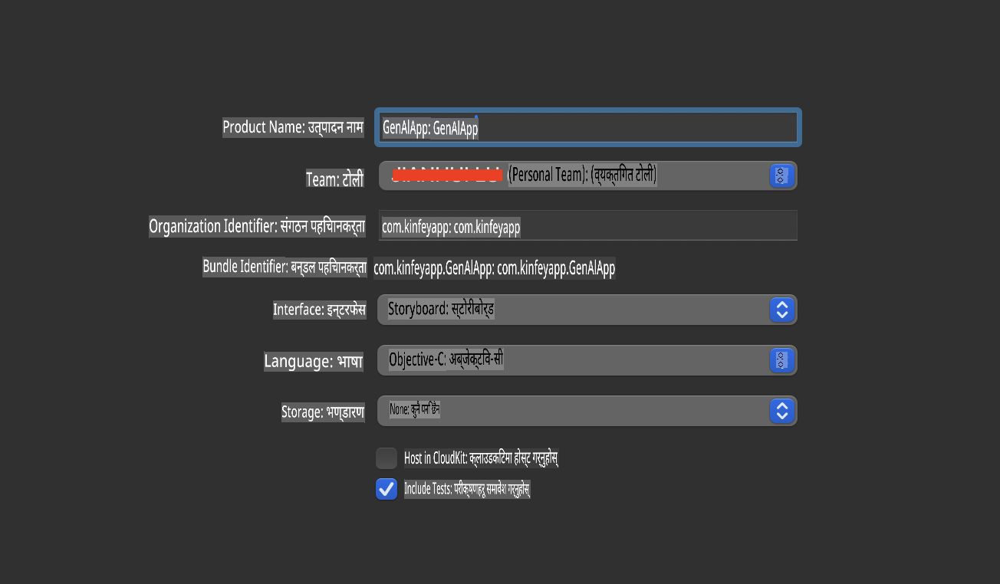
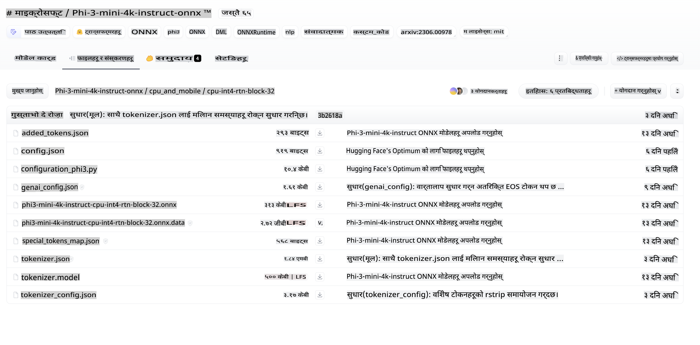
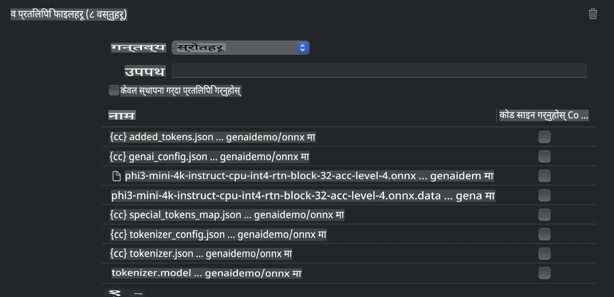
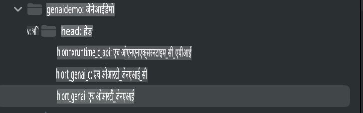
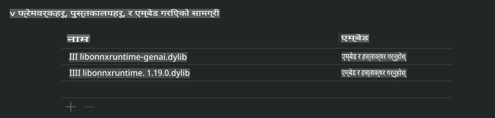
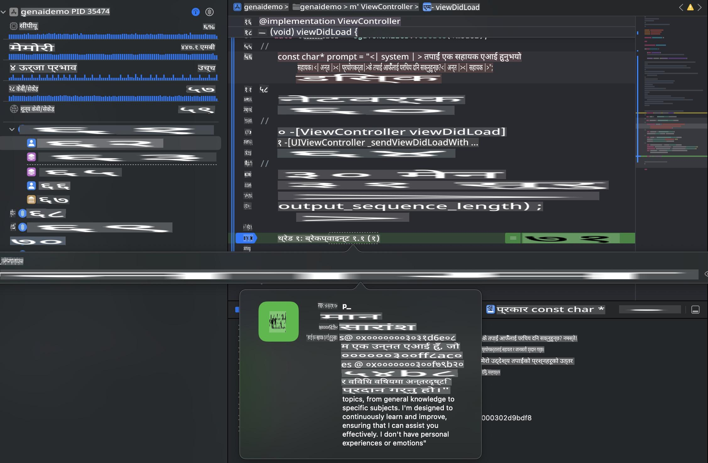

# **iOS मा Phi-3 इन्फरेन्स**

Phi-3-mini माइक्रोसफ्टको नयाँ मोडेल श्रृंखला हो, जसले ठूला भाषा मोडेलहरू (LLMs) लाई एज डिभाइस र IoT डिभाइसहरूमा डिप्लोय गर्न सक्षम बनाउँछ। Phi-3-mini iOS, Android, र Edge Device डिप्लोयमेन्टका लागि उपलब्ध छ, जसले BYOD वातावरणमा जेनेरेटिभ एआई डिप्लोय गर्न अनुमति दिन्छ। तलको उदाहरणले iOS मा Phi-3-mini कसरी डिप्लोय गर्ने भनेर देखाउँछ।

## **१. तयारी**

- **क.** macOS 14+  
- **ख.** Xcode 15+  
- **ग.** iOS SDK 17.x (iPhone 14 A16 वा माथि)  
- **घ.** Python 3.10+ इन्स्टल गर्नुहोस् (Conda सिफारिस गरिन्छ)  
- **ङ.** Python लाइब्रेरी इन्स्टल गर्नुहोस्: `python-flatbuffers`  
- **च.** CMake इन्स्टल गर्नुहोस्  

### सेमान्टिक कर्नेल र इन्फरेन्स

सेमान्टिक कर्नेल एउटा एप्लिकेसन फ्रेमवर्क हो, जसले Azure OpenAI Service, OpenAI मोडेलहरू, र स्थानीय मोडेलहरूसँग अनुकूल एप्लिकेसनहरू बनाउन अनुमति दिन्छ। सेमान्टिक कर्नेल प्रयोग गरेर आफ्नो स्व-होस्ट गरिएको Phi-3-mini मोडेल सर्भरसँग सजिलै एकीकरण गर्न सकिन्छ।

### क्वान्टाइज्ड मोडेलहरू Ollama वा LlamaEdge मार्फत चलाउनु

धेरै प्रयोगकर्ताहरूले स्थानीय रूपमा मोडेल चलाउन क्वान्टाइज्ड मोडेलहरू प्रयोग गर्न रुचाउँछन्। [Ollama](https://ollama.com) र [LlamaEdge](https://llamaedge.com) ले विभिन्न क्वान्टाइज्ड मोडेलहरू चलाउन अनुमति दिन्छन्:

#### **Ollama**

तपाईं `ollama run phi3` सिधै चलाउन सक्नुहुन्छ वा यसलाई अफलाइन कन्फिगर गर्न सक्नुहुन्छ। आफ्नो `gguf` फाइलको पथ सहित Modelfile सिर्जना गर्नुहोस्। Phi-3-mini क्वान्टाइज्ड मोडेल चलाउनको लागि नमुना कोड:

```gguf
FROM {Add your gguf file path}
TEMPLATE \"\"\"<|user|> .Prompt<|end|> <|assistant|>\"\"\"
PARAMETER stop <|end|>
PARAMETER num_ctx 4096
```

#### **LlamaEdge**

यदि तपाईंलाई क्लाउड र एज डिभाइसहरूमा एकसाथ `gguf` प्रयोग गर्न मन छ भने, LlamaEdge राम्रो विकल्प हो।

## **२. iOS का लागि ONNX Runtime कम्पाइल गर्नु**

```bash

git clone https://github.com/microsoft/onnxruntime.git

cd onnxruntime

./build.sh --build_shared_lib --ios --skip_tests --parallel --build_dir ./build_ios --ios --apple_sysroot iphoneos --osx_arch arm64 --apple_deploy_target 17.5 --cmake_generator Xcode --config Release

cd ../

```

### **ध्यान दिनुहोस्**

- **क.** कम्पाइल गर्नु अघि, सुनिश्चित गर्नुहोस् कि Xcode सही रूपमा कन्फिगर गरिएको छ र टर्मिनलमा यसलाई सक्रिय डेभलपर डाइरेक्टरीको रूपमा सेट गर्नुहोस्:

    ```bash
    sudo xcode-select -switch /Applications/Xcode.app/Contents/Developer
    ```

- **ख.** ONNX Runtime विभिन्न प्लेटफर्महरूको लागि कम्पाइल गर्न आवश्यक छ। iOS का लागि, तपाईंले `arm64` or `x86_64` का लागि कम्पाइल गर्न सक्नुहुन्छ।

- **ग.** कम्पाइलका लागि नवीनतम iOS SDK प्रयोग गर्न सिफारिस गरिन्छ। यद्यपि, यदि तपाईंलाई पुराना SDK हरूसँग अनुकूलता आवश्यक छ भने, पुरानो संस्करण पनि प्रयोग गर्न सक्नुहुन्छ।

## **३. iOS का लागि ONNX Runtime प्रयोग गरेर जेनेरेटिभ एआई कम्पाइल गर्नु**

> **नोट:** ONNX Runtime प्रयोग गरेर जेनेरेटिभ एआई हाल प्रिभ्यूमा छ, त्यसैले सम्भावित परिवर्तनहरूको लागि तयार रहनुहोस्।

```bash

git clone https://github.com/microsoft/onnxruntime-genai
 
cd onnxruntime-genai
 
mkdir ort
 
cd ort
 
mkdir include
 
mkdir lib
 
cd ../
 
cp ../onnxruntime/include/onnxruntime/core/session/onnxruntime_c_api.h ort/include
 
cp ../onnxruntime/build_ios/Release/Release-iphoneos/libonnxruntime*.dylib* ort/lib
 
export OPENCV_SKIP_XCODEBUILD_FORCE_TRYCOMPILE_DEBUG=1
 
python3 build.py --parallel --build_dir ./build_ios --ios --ios_sysroot iphoneos --ios_arch arm64 --ios_deployment_target 17.5 --cmake_generator Xcode --cmake_extra_defines CMAKE_XCODE_ATTRIBUTE_CODE_SIGNING_ALLOWED=NO

```

## **४. Xcode मा एप्लिकेसन बनाउनुहोस्**

मैले एप्लिकेसन विकास विधिको रूपमा Objective-C रोजें, किनभने ONNX Runtime C++ API प्रयोग गरेर जेनेरेटिभ एआईको लागि Objective-C राम्रोसँग अनुकूल हुन्छ। अवश्य पनि, तपाईं Swift bridging मार्फत पनि सम्बन्धित कार्यहरू पूरा गर्न सक्नुहुन्छ।



## **५. ONNX क्वान्टाइज्ड INT4 मोडेललाई एप्लिकेसन प्रोजेक्टमा प्रतिलिपि गर्नुहोस्**

हामीले ONNX फर्म्याटमा INT4 क्वान्टाइजेशन मोडेल आयात गर्नुपर्छ, जुन पहिले डाउनलोड गर्न आवश्यक छ।



डाउनलोड गरेपछि, यसलाई Xcode को प्रोजेक्टको Resources डाइरेक्टरीमा थप्नुपर्छ।



## **६. ViewControllers मा C++ API थप्नुहोस्**

> **ध्यान दिनुहोस्:**

- **क.** प्रोजेक्टमा सम्बन्धित C++ हेडर फाइलहरू थप्नुहोस्।

  

- **ख.** `onnxruntime-genai` dynamic library in Xcode.

  

- **c.** Use the C Samples code for testing. You can also add additional features like ChatUI for more functionality.

- **d.** Since you need to use C++ in your project, rename `ViewController.m` to `ViewController.mm` समावेश गरेर Objective-C++ समर्थन सक्षम गर्नुहोस्।

```objc

    NSString *llmPath = [[NSBundle mainBundle] resourcePath];
    char const *modelPath = llmPath.cString;

    auto model =  OgaModel::Create(modelPath);

    auto tokenizer = OgaTokenizer::Create(*model);

    const char* prompt = "<|system|>You are a helpful AI assistant.<|end|><|user|>Can you introduce yourself?<|end|><|assistant|>";

    auto sequences = OgaSequences::Create();
    tokenizer->Encode(prompt, *sequences);

    auto params = OgaGeneratorParams::Create(*model);
    params->SetSearchOption("max_length", 100);
    params->SetInputSequences(*sequences);

    auto output_sequences = model->Generate(*params);
    const auto output_sequence_length = output_sequences->SequenceCount(0);
    const auto* output_sequence_data = output_sequences->SequenceData(0);
    auto out_string = tokenizer->Decode(output_sequence_data, output_sequence_length);
    
    auto tmp = out_string;

```

## **७. एप्लिकेसन चलाउनुहोस्**

सेटअप पूरा भएपछि, तपाईं एप्लिकेसन चलाएर Phi-3-mini मोडेल इन्फरेन्सको परिणाम हेर्न सक्नुहुन्छ।



थप नमुना कोड र विस्तृत निर्देशनहरूको लागि, [Phi-3 Mini Samples repository](https://github.com/Azure-Samples/Phi-3MiniSamples/tree/main/ios) भ्रमण गर्नुहोस्।

**अस्वीकरण**:  
यो दस्तावेज मेशिन-आधारित एआई अनुवाद सेवाहरू प्रयोग गरेर अनुवाद गरिएको हो। यद्यपि हामी शुद्धताको प्रयास गर्छौं, कृपया सचेत रहनुहोस् कि स्वचालित अनुवादहरूमा त्रुटिहरू वा अशुद्धताहरू हुन सक्छन्। यसको मूल भाषामा रहेको मूल दस्तावेजलाई प्रामाणिक स्रोतको रूपमा मानिनुपर्छ। महत्त्वपूर्ण जानकारीका लागि, व्यावसायिक मानव अनुवाद सिफारिस गरिन्छ। यस अनुवादको प्रयोगबाट उत्पन्न हुने कुनै पनि गलतफहमी वा गलत व्याख्याको लागि हामी जिम्मेवार हुनेछैनौं।