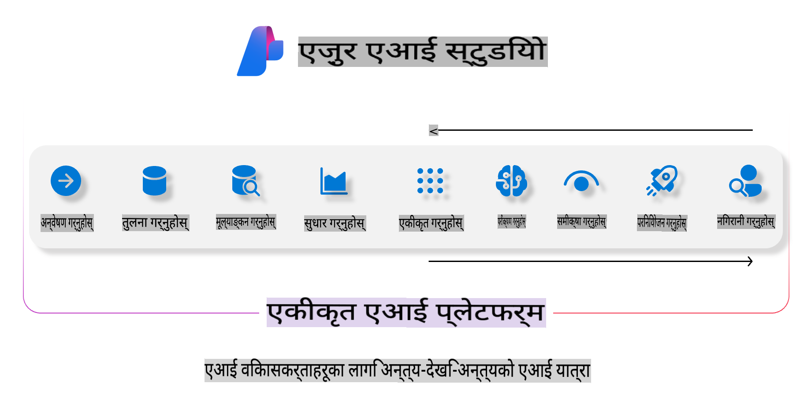
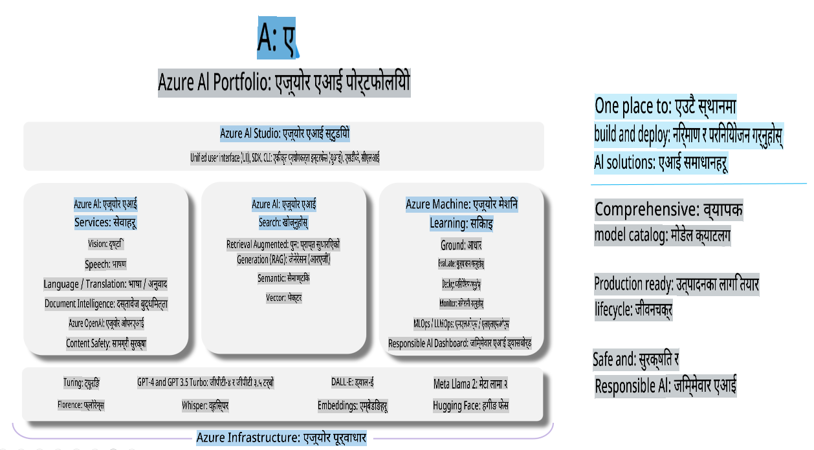

# **Azure AI Foundry प्रयोग गरेर मूल्याङ्कन गर्ने**

[Azure AI Foundry](https://ai.azure.com?WT.mc_id=aiml-138114-kinfeylo) प्रयोग गरेर तपाईंको जनरेटिभ AI एप्लिकेसन कसरी मूल्याङ्कन गर्ने। चाहे तपाईं एकल टर्न वार्तालाप वा बहु-टर्न वार्तालापको मूल्याङ्कन गर्दै हुनुहुन्छ, Azure AI Foundry ले मोडेलको प्रदर्शन र सुरक्षाको मूल्याङ्कन गर्न उपकरणहरू प्रदान गर्दछ।

## Azure AI Foundry प्रयोग गरेर जनरेटिभ AI एप्स कसरी मूल्याङ्कन गर्ने
थप विवरणहरूको लागि [Azure AI Foundry Documentation](https://learn.microsoft.com/azure/ai-studio/how-to/evaluate-generative-ai-app?WT.mc_id=aiml-138114-kinfeylo) हेर्नुहोस्।

यहाँ सुरु गर्नका लागि चरणहरू छन्:

## Azure AI Foundry मा जनरेटिभ AI मोडेलहरूको मूल्याङ्कन

**पूर्व-आवश्यकताहरू**

- CSV वा JSON ढाँचामा एउटा परीक्षण डाटासेट।
- एक डिप्लोय गरिएको जनरेटिभ AI मोडेल (जस्तै Phi-3, GPT 3.5, GPT 4, वा Davinci मोडेलहरू)।
- मूल्याङ्कन चलाउन कम्प्युट इन्स्टेन्ससहितको रनटाइम।

## बिल्ट-इन मूल्याङ्कन मेट्रिक्स

Azure AI Foundry ले तपाईंलाई एकल-टर्न र जटिल, बहु-टर्न वार्तालापहरूको मूल्याङ्कन गर्न अनुमति दिन्छ।  
विशिष्ट डाटामा आधारित Retrieval Augmented Generation (RAG) परिदृश्यहरूका लागि, तपाईं बिल्ट-इन मूल्याङ्कन मेट्रिक्स प्रयोग गरेर प्रदर्शन मूल्याङ्कन गर्न सक्नुहुन्छ।  
थप रूपमा, तपाईं सामान्य एकल-टर्न प्रश्न उत्तर परिदृश्यहरूको (गैर-RAG) मूल्याङ्कन गर्न सक्नुहुन्छ।

## मूल्याङ्कन रन सिर्जना गर्ने

Azure AI Foundry UI बाट, Evaluate पृष्ठ वा Prompt Flow पृष्ठमा जानुहोस्।  
मूल्याङ्कन सिर्जना गर्ने विजार्डलाई पछ्याएर मूल्याङ्कन रन सेटअप गर्नुहोस्।  
तपाईंको मूल्याङ्कनका लागि वैकल्पिक नाम प्रदान गर्नुहोस्।  
तपाईंको एप्लिकेसनको उद्देश्यसँग मिल्दोजुल्दो परिदृश्य चयन गर्नुहोस्।  
मोडेलको आउटपुट मूल्याङ्कन गर्न एक वा बढी मूल्याङ्कन मेट्रिक्स चयन गर्नुहोस्।

## अनुकूलन मूल्याङ्कन फ्लो (वैकल्पिक)

अझ बढी लचिलोपनका लागि, तपाईं अनुकूलन मूल्याङ्कन फ्लो स्थापना गर्न सक्नुहुन्छ।  
तपाईंका विशिष्ट आवश्यकताहरूको आधारमा मूल्याङ्कन प्रक्रिया अनुकूलन गर्नुहोस्।

## नतिजा हेर्ने

मूल्याङ्कन चलाएपछि, Azure AI Foundry मा विस्तृत मूल्याङ्कन मेट्रिक्स लग गर्नुहोस्, हेर्नुहोस्, र विश्लेषण गर्नुहोस्।  
तपाईंको एप्लिकेसनको क्षमता र सीमाहरूको बारेमा जानकारी प्राप्त गर्नुहोस्।

**नोट** Azure AI Foundry हाल सार्वजनिक प्रिभ्यूमा छ, त्यसैले यसलाई प्रयोग र विकासका लागि मात्र प्रयोग गर्नुहोस्।  
प्रोडक्सन वर्कलोडका लागि, अन्य विकल्पहरू विचार गर्नुहोस्। थप विवरण र चरण-दर-चरण निर्देशनहरूको लागि आधिकारिक [AI Foundry Documentation](https://learn.microsoft.com/azure/ai-studio/?WT.mc_id=aiml-138114-kinfeylo) अन्वेषण गर्नुहोस्।  

**अस्वीकरण**:  
यो दस्तावेज मेसिन-आधारित एआई अनुवाद सेवाहरू प्रयोग गरी अनुवाद गरिएको हो। हामी यथार्थताको लागि प्रयास गर्छौं तर कृपया जानकारी हुनुहोस् कि स्वचालित अनुवादमा त्रुटिहरू वा अशुद्धताहरू हुन सक्छ। मूल भाषामा रहेको मूल दस्तावेजलाई प्रामाणिक स्रोत मानिनुपर्छ। महत्वपूर्ण जानकारीको लागि, पेशेवर मानव अनुवाद सिफारिस गरिन्छ। यो अनुवादको प्रयोगबाट उत्पन्न कुनै पनि गलतफहमी वा गलत व्याख्याका लागि हामी जिम्मेवार हुनेछैनौं। 