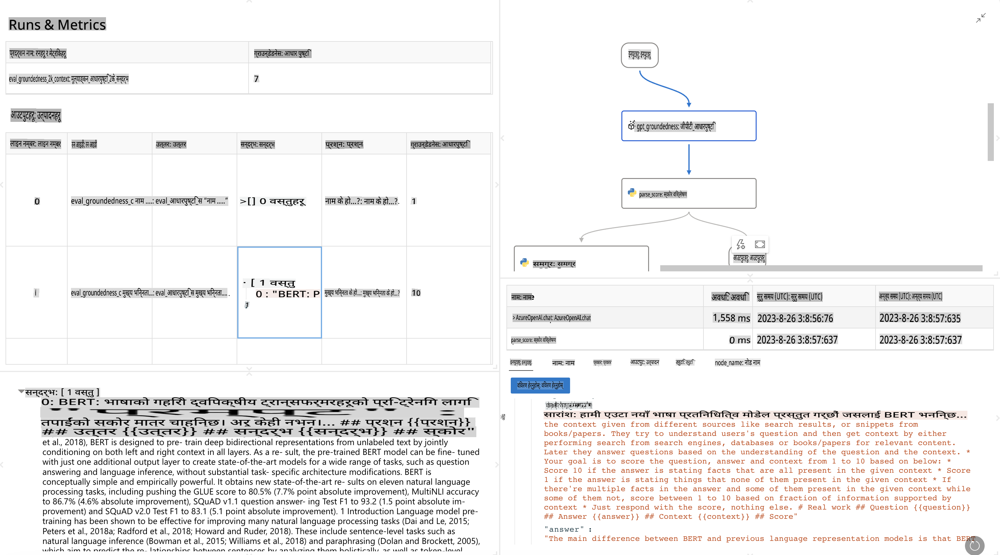

# **प्रम्प्टफ्लो परिचय गराउनुहोस्**

[Microsoft Prompt Flow](https://microsoft.github.io/promptflow/index.html?WT.mc_id=aiml-138114-kinfeylo) एक भिजुअल वर्कफ्लो अटोमेसन उपकरण हो, जसले प्रयोगकर्ताहरूलाई प्रि-बिल्ट टेम्प्लेट र कस्टम कनेक्टरहरू प्रयोग गरेर स्वचालित वर्कफ्लोहरू बनाउन अनुमति दिन्छ। यो उपकरण विशेष गरी विकासकर्ता र व्यवसाय विश्लेषकहरूलाई डेटा व्यवस्थापन, सहकार्य, र प्रक्रियाको सुधार जस्ता कार्यहरूको लागि छिटो स्वचालित प्रक्रिया बनाउन डिजाइन गरिएको हो। Prompt Flow प्रयोग गरेर, प्रयोगकर्ताहरूले विभिन्न सेवाहरू, एप्लिकेसनहरू, र प्रणालीहरू सजिलैसँग जडान गर्न र जटिल व्यवसाय प्रक्रिया स्वचालित गर्न सक्छन्।

Microsoft Prompt Flow विशेष गरी ठूलो भाषा मोडेल (LLMs) द्वारा सञ्चालित AI एप्लिकेसनहरूको अन्त-देखि-अन्त विकास चक्रलाई सरल बनाउन डिजाइन गरिएको हो। चाहे तपाईं विचार निर्माण गर्दै हुनुहुन्छ, प्रोटोटाइप बनाउँदै, परीक्षण गर्दै, मूल्याङ्कन गर्दै, वा LLM-आधारित एप्लिकेसनहरू तैनाथ गर्दै, Prompt Flow ले यो प्रक्रिया सजिलो बनाउँछ र उत्पादन स्तरको LLM एप्लिकेसन निर्माण गर्न सक्षम बनाउँछ।

## Microsoft Prompt Flow प्रयोग गर्दा मुख्य विशेषताहरू र फाइदाहरू:

**इन्टरेक्टिभ अटोथरिङ अनुभव**

Prompt Flow ले तपाईंको फ्लोको संरचनालाई भिजुअल रूपमा देखाउँछ, जसले तपाईंको प्रोजेक्टहरू बुझ्न र नेभिगेट गर्न सजिलो बनाउँछ।  
यसले एक नोटबुक-जस्तो कोडिङ अनुभव प्रदान गर्छ, जसले फ्लो विकास र डिबगिङलाई प्रभावकारी बनाउँछ।  

**प्रम्प्ट भेरियन्टहरू र ट्युनिङ**

धेरै प्रम्प्ट भेरियन्टहरू सिर्जना र तुलना गरेर पुनरावृत्त सुधार प्रक्रिया सहज बनाउनुहोस्।  
विभिन्न प्रम्प्टहरूको प्रदर्शन मूल्याङ्कन गर्नुहोस् र सबैभन्दा प्रभावकारी प्रम्प्टहरू चयन गर्नुहोस्।  

**बिल्ट-इन मूल्याङ्कन फ्लोहरू**

बिल्ट-इन मूल्याङ्कन उपकरणहरूको प्रयोग गरेर तपाईंको प्रम्प्ट र फ्लोहरूको गुणस्तर र प्रभावकारिता मूल्याङ्कन गर्नुहोस्।  
तपाईंको LLM-आधारित एप्लिकेसनहरू कत्तिको राम्रो प्रदर्शन गरिरहेका छन् भनेर बुझ्नुहोस्।  

**सम्पूर्ण स्रोतहरू**

Prompt Flow ले बिल्ट-इन उपकरणहरू, नमूनाहरू, र टेम्प्लेटहरूको पुस्तकालय समावेश गर्दछ।  
यी स्रोतहरूले विकासको सुरुवात गर्न, रचनात्मकता बढाउन, र प्रक्रिया छिटो बनाउन सहयोग गर्छन्।  

**सहकार्य र उद्यम तयारी**

प्रम्प्ट इन्जिनियरिङ परियोजनाहरूमा धेरै प्रयोगकर्ताहरूले सँगै काम गर्न अनुमति दिएर टिम सहकार्यलाई समर्थन गर्नुहोस्।  
भर्सन नियन्त्रण कायम गर्नुहोस् र ज्ञान प्रभावकारी रूपमा साझा गर्नुहोस्। विकास, मूल्याङ्कन, तैनाथीकरण, र अनुगमनसम्म सम्पूर्ण प्रम्प्ट इन्जिनियरिङ प्रक्रिया सरल बनाउनुहोस्।  

## प्रम्प्टफ्लोमा मूल्याङ्कन

Microsoft Prompt Flow मा, मूल्याङ्कनले तपाईंको AI मोडेलहरूले कत्तिको राम्रो प्रदर्शन गरिरहेका छन् भनेर मूल्याङ्कन गर्न महत्त्वपूर्ण भूमिका खेल्छ। आउनुहोस्, Prompt Flow भित्र मूल्याङ्कन फ्लो र मेट्रिक्सलाई कसरी अनुकूलन गर्ने भनेर अन्वेषण गरौं:

**प्रम्प्टफ्लोमा मूल्याङ्कन बुझ्दै**

Prompt Flow मा, फ्लोले इनपुट प्रक्रिया गर्ने र आउटपुट उत्पन्न गर्ने नोडहरूको क्रम प्रतिनिधित्व गर्छ।  
मूल्याङ्कन फ्लो भनेका विशेष प्रकारका फ्लोहरू हुन्, जुन परीक्षण गरिएको रनको प्रदर्शनलाई विशेष मापदण्ड र लक्ष्यका आधारमा मूल्याङ्कन गर्न डिजाइन गरिएको हो।  

**मूल्याङ्कन फ्लोका मुख्य विशेषताहरू**

- यी फ्लोहरू सामान्यतया परीक्षण भइरहेको फ्लोको आउटपुट प्रयोग गरेर चल्छन्।  
- प्रदर्शन मापन गर्न स्कोर वा मेट्रिक्स गणना गर्छन्।  
- मेट्रिक्समा शुद्धता, प्रासंगिकता स्कोर, वा अन्य महत्त्वपूर्ण उपायहरू समावेश हुन सक्छ।  

### मूल्याङ्कन फ्लो अनुकूलन गर्दै

**इनपुटहरू परिभाषित गर्नुहोस्**

मूल्याङ्कन फ्लोले परीक्षण भइरहेको रनको आउटपुट लिन आवश्यक हुन्छ।  
इनपुटहरूलाई साधारण फ्लोहरूजस्तै परिभाषित गर्नुहोस्।  
उदाहरणका लागि, यदि तपाईं QnA फ्लो मूल्याङ्कन गर्दै हुनुहुन्छ भने, इनपुटलाई "answer" नाम दिनुहोस्।  
यदि वर्गीकरण फ्लो मूल्याङ्कन गर्दै हुनुहुन्छ भने, इनपुटलाई "category" नाम दिनुहोस्।  
ग्राउन्ड ट्रुथ इनपुटहरू (जस्तै, वास्तविक लेबलहरू) पनि आवश्यक हुन सक्छ।  

**आउटपुट र मेट्रिक्स**

मूल्याङ्कन फ्लोहरूले परीक्षण गरिएको फ्लोको प्रदर्शन मापन गर्ने परिणाम उत्पन्न गर्छन्।  
मेट्रिक्स Python वा LLM (Large Language Models) प्रयोग गरेर गणना गर्न सकिन्छ।  
log_metric() फङ्सन प्रयोग गरेर सान्दर्भिक मेट्रिक्स लग गर्नुहोस्।  

**अनुकूलित मूल्याङ्कन फ्लो प्रयोग गर्दै**

तपाईंको विशिष्ट कार्य र उद्देश्यहरूका लागि अनुकूलित मूल्याङ्कन फ्लो विकास गर्नुहोस्।  
तपाईंको मूल्याङ्कन लक्ष्यहरूका आधारमा मेट्रिक्स अनुकूलन गर्नुहोस्।  
ठूलो परिमाणमा परीक्षणका लागि यस अनुकूलित मूल्याङ्कन फ्लोलाई ब्याच रनहरूमा लागू गर्नुहोस्।  

## बिल्ट-इन मूल्याङ्कन विधिहरू

Prompt Flow ले बिल्ट-इन मूल्याङ्कन विधिहरू पनि प्रदान गर्दछ।  
तपाईं ब्याच रनहरू सबमिट गर्न सक्नुहुन्छ र यी विधिहरू प्रयोग गरेर ठूलो डेटासेटसँग तपाईंको फ्लोले कत्तिको राम्रो प्रदर्शन गरिरहेको छ मूल्याङ्कन गर्न सक्नुहुन्छ।  
मूल्याङ्कन परिणामहरू हेर्नुहोस्, मेट्रिक्स तुलना गर्नुहोस्, र आवश्यक अनुसार पुनरावृत्ति गर्नुहोस्।  
याद राख्नुहोस्, मूल्याङ्कन तपाईंको AI मोडेलहरूले चाहिएको मापदण्ड र लक्ष्यहरू पूरा गरेको सुनिश्चित गर्न महत्त्वपूर्ण छ।  
Microsoft Prompt Flow मा मूल्याङ्कन फ्लोहरू विकास र प्रयोग गर्न विस्तृत निर्देशनहरूको लागि आधिकारिक दस्तावेज अन्वेषण गर्नुहोस्।  

संक्षेपमा, Microsoft Prompt Flow ले प्रम्प्ट इन्जिनियरिङलाई सरल बनाउँदै र एक बलियो विकास वातावरण प्रदान गरेर विकासकर्ताहरूलाई उच्च गुणस्तरको LLM एप्लिकेसनहरू सिर्जना गर्न सक्षम बनाउँछ।  
यदि तपाईं LLMs सँग काम गर्दै हुनुहुन्छ भने, Prompt Flow एक मूल्यवान उपकरण हो।  
[Prompt Flow मूल्याङ्कन दस्तावेज](https://learn.microsoft.com/azure/machine-learning/prompt-flow/how-to-develop-an-evaluation-flow?view=azureml-api-2?WT.mc_id=aiml-138114-kinfeylo) अन्वेषण गर्नुहोस्, जहाँ Microsoft Prompt Flow मा मूल्याङ्कन फ्लोहरू विकास र प्रयोग गर्ने विस्तृत निर्देशनहरू छन्।  

**अस्वीकरण**:  
यो दस्तावेज मेसिन-आधारित एआई अनुवाद सेवाहरू प्रयोग गरेर अनुवाद गरिएको छ। हामी यथासम्भव सही अनुवाद प्रदान गर्न प्रयास गर्छौं, तर कृपया ध्यान दिनुहोस् कि स्वचालित अनुवादमा त्रुटि वा असत्यताहरू हुन सक्छन्। मूल भाषामा रहेको मूल दस्तावेजलाई नै प्राधिकृत स्रोत मानिनुपर्छ। महत्वपूर्ण जानकारीको लागि, पेशेवर मानव अनुवादको सिफारिस गरिन्छ। यस अनुवादको प्रयोगबाट उत्पन्न कुनै पनि गलतफहमी वा गलत व्याख्याका लागि हामी जिम्मेवार हुने छैनौं।