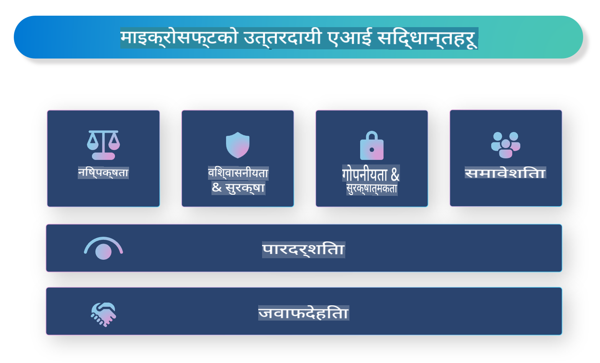

# **जिम्मेवार AI को परिचय गराउनुहोस्**

[Microsoft Responsible AI](https://www.microsoft.com/ai/responsible-ai?WT.mc_id=aiml-138114-kinfeylo) एक पहल हो जसको उद्देश्य विकासकर्ताहरू र संस्थाहरूलाई पारदर्शी, विश्वासयोग्य, र उत्तरदायी AI प्रणालीहरू निर्माण गर्न मद्दत गर्नु हो। यो पहलले नैतिक सिद्धान्तहरू जस्तै गोपनीयता, निष्पक्षता, र पारदर्शितासँग मेल खाने जिम्मेवार AI समाधानहरू विकास गर्न मार्गनिर्देशन र स्रोतहरू प्रदान गर्दछ। हामी जिम्मेवार AI प्रणाली निर्माणसँग सम्बन्धित चुनौतीहरू र उत्कृष्ट अभ्यासहरूको पनि अन्वेषण गर्नेछौं।

## Microsoft Responsible AI को अवलोकन

**नैतिक सिद्धान्तहरू** 

Microsoft Responsible AI ले गोपनीयता, निष्पक्षता, पारदर्शिता, उत्तरदायित्व, र सुरक्षा जस्ता नैतिक सिद्धान्तहरूको एक सेटद्वारा मार्गनिर्देशन गर्दछ। यी सिद्धान्तहरू AI प्रणालीहरूलाई नैतिक र जिम्मेवार तरिकाले विकास गर्न सुनिश्चित गर्नका लागि डिजाइन गरिएका हुन्।

**पारदर्शी AI**

Microsoft Responsible AI ले AI प्रणालीहरूमा पारदर्शिताको महत्त्वलाई जोड दिन्छ। यसमा AI मोडेलहरू कसरी काम गर्छन् भन्ने स्पष्ट व्याख्या प्रदान गर्नु र डाटा स्रोतहरू र एल्गोरिदमहरू सार्वजनिक रूपमा उपलब्ध गराउनु समावेश छ।

**उत्तरदायी AI** 

[Microsoft Responsible AI](https://www.microsoft.com/ai/responsible-ai?WT.mc_id=aiml-138114-kinfeylo) ले उत्तरदायी AI प्रणालीहरूको विकासलाई प्रोत्साहन गर्दछ, जसले AI मोडेलहरूले कसरी निर्णय लिन्छन् भन्नेमा अन्तर्दृष्टि प्रदान गर्न सक्छ। यसले प्रयोगकर्ताहरूलाई AI प्रणालीहरूको परिणामहरू बुझ्न र विश्वास गर्न मद्दत पुर्‍याउन सक्छ।

**समावेशिता** 

AI प्रणालीहरूले सबैलाई फाइदा पुर्‍याउने गरी डिजाइन गरिनुपर्छ। Microsoft ले विविध दृष्टिकोणहरूलाई ध्यानमा राख्ने र पूर्वाग्रह वा भेदभाव नगर्ने समावेशी AI सिर्जना गर्ने लक्ष्य राख्छ।

**विश्वसनीयता र सुरक्षा**

AI प्रणालीहरू विश्वसनीय र सुरक्षित हुनु महत्त्वपूर्ण छ। Microsoft ले स्थिर रूपमा प्रदर्शन गर्ने र हानिकारक परिणामहरूबाट जोगिने बलियो मोडेलहरू निर्माणमा ध्यान केन्द्रित गर्दछ।

**AI मा निष्पक्षता** 

Microsoft Responsible AI ले यो मान्यता दिन्छ कि यदि AI प्रणालीहरू पूर्वाग्रही डाटा वा एल्गोरिदममा आधारित छन् भने ती प्रणालीहरूले पूर्वाग्रहलाई निरन्तरता दिन सक्छन्। यो पहलले जाति, लिंग, वा उमेर जस्ता कारकहरूको आधारमा भेदभाव नगर्ने निष्पक्ष AI प्रणालीहरू विकास गर्न मार्गनिर्देशन प्रदान गर्दछ।

**गोपनीयता र सुरक्षा** 

Microsoft Responsible AI ले AI प्रणालीहरूमा प्रयोगकर्ताको गोपनीयता र डाटा सुरक्षाको महत्त्वलाई जोड दिन्छ। यसमा बलियो डाटा एन्क्रिप्शन र पहुँच नियन्त्रण लागू गर्नु, साथै AI प्रणालीहरूलाई नियमित रूपमा जोखिमहरूको लागि अडिट गर्नु समावेश छ।

**उत्तरदायित्व र जिम्मेवारी** 

Microsoft Responsible AI ले AI विकास र कार्यान्वयनमा उत्तरदायित्व र जिम्मेवारीलाई प्रोत्साहन गर्दछ। यसमा विकासकर्ताहरू र संस्थाहरूलाई AI प्रणालीहरूसँग सम्बन्धित सम्भावित जोखिमहरूको बारेमा सचेत गराउनु र ती जोखिमहरू कम गर्न कदम चाल्नु समावेश छ।

## जिम्मेवार AI प्रणालीहरू निर्माणका लागि उत्कृष्ट अभ्यासहरू

**विविध डाटा सेटहरूको प्रयोग गरेर AI मोडेलहरू विकास गर्नुहोस्** 

AI प्रणालीहरूमा पूर्वाग्रहबाट जोगिनका लागि, विभिन्न दृष्टिकोणहरू र अनुभवहरूको प्रतिनिधित्व गर्ने विविध डाटा सेटहरू प्रयोग गर्नु महत्त्वपूर्ण छ।

**व्याख्यात्मक AI प्रविधिहरू प्रयोग गर्नुहोस्** 

व्याख्यात्मक AI प्रविधिहरूले प्रयोगकर्ताहरूलाई AI मोडेलहरूले कसरी निर्णय लिन्छन् भन्ने कुरा बुझ्न मद्दत गर्न सक्छ, जसले प्रणालीमा विश्वास बढाउन सक्छ।

**AI प्रणालीहरूको जोखिमका लागि नियमित अडिट गर्नुहोस्** 

AI प्रणालीहरूको नियमित अडिटले सम्बोधन गर्नुपर्ने सम्भावित जोखिमहरू र कमजोर पक्षहरूको पहिचान गर्न मद्दत गर्न सक्छ।

**बलियो डाटा एन्क्रिप्शन र पहुँच नियन्त्रण लागू गर्नुहोस्** 

डाटा एन्क्रिप्शन र पहुँच नियन्त्रणले AI प्रणालीहरूमा प्रयोगकर्ताको गोपनीयता र सुरक्षालाई जोगाउन मद्दत गर्न सक्छ।

**AI विकासमा नैतिक सिद्धान्तहरू पालना गर्नुहोस्** 

निष्पक्षता, पारदर्शिता, र उत्तरदायित्व जस्ता नैतिक सिद्धान्तहरूको पालना गर्नुले AI प्रणालीहरूमा विश्वास निर्माण गर्न र तिनीहरूलाई जिम्मेवार तरिकाले विकास गर्न मद्दत गर्दछ।

## जिम्मेवार AI का लागि AI Foundry को प्रयोग

[Azure AI Foundry](https://ai.azure.com?WT.mc_id=aiml-138114-kinfeylo) एक शक्तिशाली प्लेटफर्म हो जसले विकासकर्ताहरू र संस्थाहरूलाई छिटो बौद्धिक, अत्याधुनिक, बजारका लागि तयार, र जिम्मेवार एप्लिकेसनहरू सिर्जना गर्न अनुमति दिन्छ। यहाँ Azure AI Foundry का केही मुख्य विशेषताहरू र क्षमताहरू छन्:

**पूर्वनिर्मित API र मोडेलहरू** 

Azure AI Foundry ले पूर्वनिर्मित र अनुकूलन योग्य API र मोडेलहरू प्रदान गर्दछ। यीमा जेनेरेटिभ AI, संवादको लागि प्राकृतिक भाषा प्रशोधन, खोज, अनुगमन, अनुवाद, आवाज, दृष्टि, र निर्णय-निर्माण जस्ता धेरै AI कार्यहरू समावेश छन्।

**प्रम्ट फ्लो** 

Azure AI Foundry मा प्रम्ट फ्लोले तपाईंलाई संवादात्मक AI अनुभवहरू सिर्जना गर्न सक्षम बनाउँछ। यसले संवादात्मक फ्लोहरू डिजाइन गर्न र व्यवस्थापन गर्न अनुमति दिन्छ, जसले च्याटबट, भर्चुअल असिस्टेन्ट, र अन्य अन्तरक्रियात्मक एप्लिकेसनहरू बनाउन सजिलो बनाउँछ।

**Retrieval Augmented Generation (RAG)** 

RAG एक प्रविधि हो जसले रिट्रिभल-आधारित र जेनेरेटिभ-आधारित दृष्टिकोणहरूलाई संयोजन गर्छ। यसले पूर्व-अवस्थित ज्ञान (रिट्रिभल) र सिर्जनात्मक उत्पादन (जेनेरेशन) दुवैलाई उपयोग गरेर उत्पन्न प्रतिक्रियाहरूको गुणस्तर सुधार गर्छ।

**जेनेरेटिभ AI का लागि मूल्याङ्कन र अनुगमन मेट्रिक्स** 

Azure AI Foundry ले जेनेरेटिभ AI मोडेलहरूको मूल्याङ्कन र अनुगमनका लागि उपकरणहरू प्रदान गर्दछ। तपाईंले तिनीहरूको प्रदर्शन, निष्पक्षता, र अन्य महत्त्वपूर्ण मेट्रिक्सको मूल्याङ्कन गर्न सक्नुहुन्छ ताकि जिम्मेवार कार्यान्वयन सुनिश्चित गर्न सकियोस्। साथै, यदि तपाईंले ड्यासबोर्ड बनाउनु भएको छ भने, तपाईंले Azure Machine Learning Studio मा रहेको नो-कोड UI प्रयोग गरेर [Responsible AI Toolbox](https://responsibleaitoolbox.ai/?WT.mc_id=aiml-138114-kinfeylo) Python Libraries मा आधारित जिम्मेवार AI ड्यासबोर्ड र सम्बन्धित स्कोरकार्ड अनुकूलन र उत्पादन गर्न सक्नुहुन्छ। यस स्कोरकार्डले निष्पक्षता, विशेषताहरूको महत्त्व, र अन्य जिम्मेवार कार्यान्वयन विचारहरू सम्बन्धी प्रमुख अन्तर्दृष्टिहरू प्राविधिक र गैर-प्राविधिक दुवै सरोकारवालाहरूसँग साझा गर्न मद्दत गर्छ।

जिम्मेवार AI सँग AI Foundry प्रयोग गर्न तपाईंले यी उत्कृष्ट अभ्यासहरू अनुसरण गर्न सक्नुहुन्छ:

**तपाईंको AI प्रणालीको समस्या र उद्देश्य परिभाषित गर्नुहोस्** 

विकास प्रक्रिया सुरु गर्नु अघि, तपाईंको AI प्रणालीले समाधान गर्न खोजिरहेको समस्या वा उद्देश्य स्पष्ट रूपमा परिभाषित गर्नु महत्त्वपूर्ण छ। यसले प्रभावकारी मोडेल निर्माण गर्न आवश्यक डाटा, एल्गोरिदम, र स्रोतहरू पहिचान गर्न मद्दत गर्छ।

**साम्बन्धित डाटा सङ्कलन र पूर्वप्रक्रिया गर्नुहोस्** 

AI प्रणालीको प्रदर्शनमा प्रयोग गरिएको डाटाको गुणस्तर र परिमाणले महत्त्वपूर्ण प्रभाव पार्न सक्छ। त्यसैले, सम्बन्धित डाटा सङ्कलन गर्नु, सफा गर्नु, पूर्वप्रक्रिया गर्नु, र तपाईंले समाधान गर्न खोजिरहेको जनसङ्ख्या वा समस्याको प्रतिनिधित्व गर्ने सुनिश्चित गर्नु महत्त्वपूर्ण छ।

**उचित मूल्याङ्कन छनोट गर्नुहोस्** 

विभिन्न मूल्याङ्कन एल्गोरिदमहरू उपलब्ध छन्। तपाईंको डाटा र समस्याको आधारमा सबैभन्दा उपयुक्त एल्गोरिदम छनोट गर्नु महत्त्वपूर्ण छ।

**मोडेलको मूल्याङ्कन र व्याख्या गर्नुहोस्** 

एकपटक तपाईंले AI मोडेल निर्माण गरेपछि, यसको प्रदर्शनलाई उपयुक्त मेट्रिक्सहरू प्रयोग गरेर मूल्याङ्कन गर्नु र परिणामलाई पारदर्शी तरिकाले व्याख्या गर्नु महत्त्वपूर्ण छ। यसले मोडेलमा कुनै पनि पूर्वाग्रह वा सीमाहरू पहिचान गर्न र आवश्यकताअनुसार सुधार गर्न मद्दत गर्दछ।

**पारदर्शिता र व्याख्यात्मकता सुनिश्चित गर्नुहोस्** 

AI प्रणालीहरू पारदर्शी र व्याख्यात्मक हुनुपर्छ ताकि प्रयोगकर्ताहरूले तिनीहरू कसरी काम गर्छन् र निर्णयहरू कसरी लिइन्छन् भन्ने कुरा बुझ्न सकून्। यो विशेष गरी स्वास्थ्य सेवा, वित्त, र कानुनी प्रणालीजस्ता मानव जीवनमा महत्त्वपूर्ण प्रभाव पार्ने अनुप्रयोगहरूको लागि महत्त्वपूर्ण छ।

**मोडेललाई अनुगमन र अद्यावधिक गर्नुहोस्** 

AI प्रणालीहरूलाई समयसँगै सही र प्रभावकारी रहन सुनिश्चित गर्न निरन्तर अनुगमन र अद्यावधिक गर्नुपर्छ। यसका लागि मोडेलको निरन्तर मर्मत, परीक्षण, र पुन: तालिम आवश्यक पर्छ।

अन्त्यमा, Microsoft Responsible AI एक पहल हो जसको उद्देश्य विकासकर्ताहरू र संस्थाहरूलाई पारदर्शी, विश्वासयोग्य, र उत्तरदायी AI प्रणालीहरू निर्माण गर्न मद्दत गर्नु हो। याद गर्नुहोस् कि जिम्मेवार AI कार्यान्वयन महत्त्वपूर्ण छ, र Azure AI Foundry ले यसलाई संस्थाहरूका लागि व्यावहारिक बनाउन लक्ष्य राख्छ। नैतिक सिद्धान्तहरू र उत्कृष्ट अभ्यासहरू पालना गरेर, हामी AI प्रणालीहरूलाई जिम्मेवार तरिकाले विकास र कार्यान्वयन गर्न सुनिश्चित गर्न सक्छौं, जसले समाजलाई समग्र रूपमा फाइदा पुर्‍याउँछ।

**अस्वीकरण**:  
यो दस्तावेज़ मेशिन-आधारित एआई अनुवाद सेवाहरू प्रयोग गरेर अनुवाद गरिएको हो। हामी शुद्धताका लागि प्रयास गर्छौं, तर कृपया ध्यान दिनुहोस् कि स्वचालित अनुवादहरूमा त्रुटिहरू वा अशुद्धताहरू हुन सक्छन्। यसको मूल भाषामा रहेको मूल दस्तावेजलाई प्राधिकृत स्रोत मानिनुपर्छ। महत्वपूर्ण जानकारीको लागि, व्यावसायिक मानव अनुवाद सिफारिस गरिन्छ। यस अनुवादको प्रयोगबाट उत्पन्न कुनै पनि गलतफहमी वा गलत व्याख्याका लागि हामी उत्तरदायी हुने छैनौं।