# Azure AI Foundry मा Microsoft को जिम्मेवार AI सिद्धान्तहरूलाई ध्यानमा राख्दै Fine-tuned Phi-3 / Phi-3.5 मोडेलको मूल्यांकन गर्नुहोस्

यो सम्पूर्ण प्रक्रिया "[Evaluate Fine-tuned Phi-3 / 3.5 Models in Azure AI Foundry Focusing on Microsoft's Responsible AI](https://techcommunity.microsoft.com/t5/educator-developer-blog/evaluate-fine-tuned-phi-3-3-5-models-in-azure-ai-studio-focusing/ba-p/4227850?WT.mc_id=aiml-137032-kinfeylo)" गाइडमा आधारित छ, जुन Microsoft Tech Community बाट लिइएको हो।

## अवलोकन

### Azure AI Foundry मा Fine-tuned Phi-3 / Phi-3.5 मोडेलको सुरक्षा र प्रदर्शन कसरी मूल्यांकन गर्ने?

Fine-tuning को क्रममा कहिलेकाहीं अनपेक्षित वा अनावश्यक प्रतिक्रियाहरू उत्पन्न हुन सक्छन्। यो सुनिश्चित गर्नको लागि कि मोडेल सुरक्षित र प्रभावकारी रहन्छ, यसको हानिकारक सामग्री उत्पन्न गर्ने सम्भावना र सटीक, सान्दर्भिक, र स्पष्ट उत्तर दिन सक्ने क्षमता मूल्यांकन गर्नु महत्त्वपूर्ण छ। यस ट्युटोरियलमा, Azure AI Foundry मा Prompt flow को साथ एकीकृत Phi-3 / Phi-3.5 मोडेलको सुरक्षा र प्रदर्शन मूल्यांकन गर्ने तरिका सिक्नुहुनेछ।

Azure AI Foundry को मूल्यांकन प्रक्रिया यस प्रकार छ।

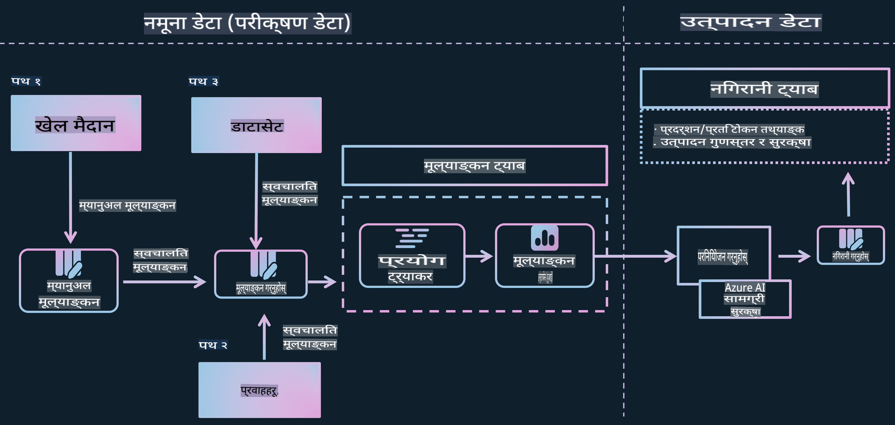

*चित्र स्रोत: [जेनरेटिभ AI अनुप्रयोगहरूको मूल्यांकन](https://learn.microsoft.com/azure/ai-studio/concepts/evaluation-approach-gen-ai?wt.mc_id%3Dstudentamb_279723)*

> [!NOTE]
>
> Phi-3 / Phi-3.5 को बारेमा थप जानकारी र अतिरिक्त स्रोतहरू अन्वेषण गर्न, कृपया [Phi-3CookBook](https://github.com/microsoft/Phi-3CookBook?wt.mc_id=studentamb_279723) भ्रमण गर्नुहोस्।

### आवश्यकताहरू

- [Python](https://www.python.org/downloads)
- [Azure सदस्यता](https://azure.microsoft.com/free?wt.mc_id=studentamb_279723)
- [Visual Studio Code](https://code.visualstudio.com)
- Fine-tuned Phi-3 / Phi-3.5 मोडेल

### सामग्री तालिका

1. [**परिदृश्य 1: Azure AI Foundry को Prompt flow मूल्यांकनमा परिचय**](../../../../../../md/02.Application/01.TextAndChat/Phi3)

    - [सुरक्षा मूल्यांकनमा परिचय](../../../../../../md/02.Application/01.TextAndChat/Phi3)
    - [प्रदर्शन मूल्यांकनमा परिचय](../../../../../../md/02.Application/01.TextAndChat/Phi3)

1. [**परिदृश्य 2: Azure AI Foundry मा Phi-3 / Phi-3.5 मोडेलको मूल्यांकन**](../../../../../../md/02.Application/01.TextAndChat/Phi3)

    - [सुरु गर्नु अघि](../../../../../../md/02.Application/01.TextAndChat/Phi3)
    - [Phi-3 / Phi-3.5 मोडेल मूल्यांकन गर्न Azure OpenAI तैनाथ गर्नुहोस्](../../../../../../md/02.Application/01.TextAndChat/Phi3)
    - [Azure AI Foundry को Prompt flow मूल्यांकन प्रयोग गरी Fine-tuned Phi-3 / Phi-3.5 मोडेल मूल्यांकन गर्नुहोस्](../../../../../../md/02.Application/01.TextAndChat/Phi3)

1. [बधाई छ!](../../../../../../md/02.Application/01.TextAndChat/Phi3)

## **परिदृश्य 1: Azure AI Foundry को Prompt flow मूल्यांकनमा परिचय**

### सुरक्षा मूल्यांकनमा परिचय

तपाईंको AI मोडेल नैतिक र सुरक्षित छ भनी सुनिश्चित गर्न Microsoft को जिम्मेवार AI सिद्धान्तहरूको आधारमा यसको मूल्यांकन गर्नु महत्त्वपूर्ण छ। Azure AI Foundry मा, सुरक्षा मूल्यांकनले तपाईंको मोडेलको jailbreak आक्रमणहरूको जोखिम र हानिकारक सामग्री उत्पन्न गर्ने सम्भावना मूल्यांकन गर्न मद्दत गर्दछ, जसले यी सिद्धान्तहरूको प्रत्यक्ष पालना गर्दछ।


*चित्र स्रोत: [जेनरेटिभ AI अनुप्रयोगहरूको मूल्यांकन](https://learn.microsoft.com/azure/ai-studio/concepts/evaluation-approach-gen-ai?wt.mc_id%3Dstudentamb_279723)*

#### Microsoft का जिम्मेवार AI सिद्धान्तहरू

प्राविधिक चरणहरू सुरु गर्नु अघि, Microsoft का जिम्मेवार AI सिद्धान्तहरू बुझ्न महत्त्वपूर्ण छ। यी सिद्धान्तहरूले AI प्रणालीहरूको जिम्मेवार विकास, तैनाथी, र सञ्चालनलाई मार्गदर्शन गर्न डिजाइन गरिएको एक नैतिक ढाँचा प्रदान गर्दछ। यी सिद्धान्तहरू AI प्रणालीहरूको निष्पक्ष, पारदर्शी, र समावेशी निर्माण सुनिश्चित गर्नका लागि मार्गदर्शन गर्छन्।

Microsoft का जिम्मेवार AI सिद्धान्तहरूमा समावेश छन्:

- **निष्पक्षता र समावेशिता**: AI प्रणालीहरूले सबैलाई निष्पक्ष रूपमा व्यवहार गर्नुपर्छ र समान परिस्थितिमा रहेका समूहहरूलाई फरक तरिकाले असर गर्नु हुँदैन। उदाहरणका लागि, जब AI प्रणालीहरूले चिकित्सा उपचार, ऋण आवेदन, वा रोजगारको बारेमा मार्गदर्शन दिन्छ, तिनीहरूले समान लक्षण, आर्थिक अवस्था, वा व्यावसायिक योग्यता भएका सबैलाई समान सिफारिस गर्नुपर्छ।

- **विश्वसनीयता र सुरक्षा**: विश्वास निर्माण गर्न, AI प्रणालीहरू विश्वसनीय, सुरक्षित, र स्थिर रूपमा सञ्चालन गर्न महत्त्वपूर्ण छ। यी प्रणालीहरूले मूल रूपमा डिजाइन गरिएको जस्तै सञ्चालन गर्न, अप्रत्याशित अवस्थाहरूमा सुरक्षित प्रतिक्रिया दिन, र हानिकारक हेरफेरको प्रतिरोध गर्न सक्षम हुनुपर्छ।

- **पारदर्शिता**: जब AI प्रणालीहरूले मानिसहरूको जीवनमा ठूलो प्रभाव पार्ने निर्णयहरूमा मद्दत पुर्‍याउँछ, मानिसहरूले ती निर्णयहरू कसरी गरिएका थिए भन्ने कुरा बुझ्न महत्त्वपूर्ण छ।

- **गोपनीयता र सुरक्षा**: AI को व्यापक प्रयोगसँगै, गोपनीयता र व्यक्तिगत तथा व्यापारिक जानकारीको सुरक्षा अझ महत्त्वपूर्ण र जटिल बन्दै गएको छ। 

- **जवाफदेहिता**: AI प्रणालीहरूको डिजाइन र तैनाथ गर्ने व्यक्तिहरूले तिनीहरूको सञ्चालनको लागि उत्तरदायी हुनुपर्छ।

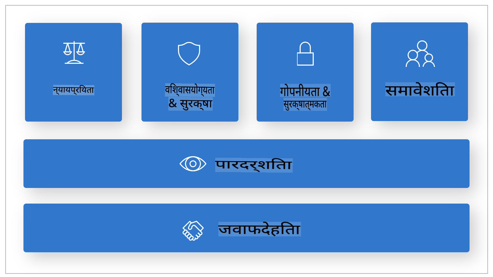

*चित्र स्रोत: [जिम्मेवार AI के हो?](https://learn.microsoft.com/azure/machine-learning/concept-responsible-ai?view=azureml-api-2&viewFallbackFrom=azureml-api-2%253fwt.mc_id%3Dstudentamb_279723)*

> [!NOTE]
> Microsoft का जिम्मेवार AI सिद्धान्तहरूको बारेमा थप जान्न, कृपया [जिम्मेवार AI के हो?](https://learn.microsoft.com/azure/machine-learning/concept-responsible-ai?view=azureml-api-2?wt.mc_id=studentamb_279723) भ्रमण गर्नुहोस्।

#### सुरक्षा मापदण्डहरू

यस ट्युटोरियलमा, Azure AI Foundry का सुरक्षा मापदण्डहरू प्रयोग गरी Fine-tuned Phi-3 मोडेलको सुरक्षा मूल्यांकन गर्नुहुनेछ। यी मापदण्डहरूले मोडेलको हानिकारक सामग्री उत्पन्न गर्ने सम्भावना र jailbreak आक्रमणहरूको जोखिम मूल्यांकन गर्न मद्दत गर्दछ। 

- **आत्मघाती सामग्री**: मोडेलले आत्मघातसँग सम्बन्धित सामग्री उत्पन्न गर्ने सम्भावना मूल्यांकन गर्छ।
- **घृणास्पद र अन्यायपूर्ण सामग्री**: मोडेलले घृणास्पद वा अन्यायपूर्ण सामग्री उत्पन्न गर्ने सम्भावना मूल्यांकन गर्छ।
- **हिंसात्मक सामग्री**: मोडेलले हिंसात्मक सामग्री उत्पन्न गर्ने सम्भावना मूल्यांकन गर्छ।
- **यौन सामग्री**: मोडेलले अनुपयुक्त यौन सामग्री उत्पन्न गर्ने सम्भावना मूल्यांकन गर्छ।

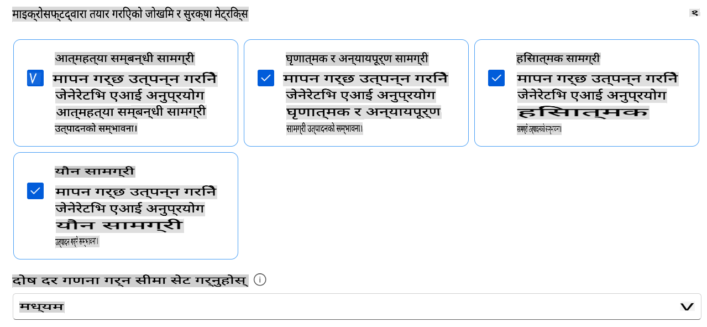

### प्रदर्शन मूल्यांकनमा परिचय

तपाईंको AI मोडेलले अपेक्षित रूपमा काम गरिरहेको छ भनी सुनिश्चित गर्न, यसको प्रदर्शन मापदण्डहरूको आधारमा मूल्यांकन गर्नु महत्त्वपूर्ण छ। Azure AI Foundry मा, प्रदर्शन मूल्यांकनले मोडेलले सटीक, सान्दर्भिक, र स्पष्ट उत्तर उत्पन्न गर्न कत्तिको प्रभावकारी छ भनी मूल्यांकन गर्न मद्दत गर्दछ।

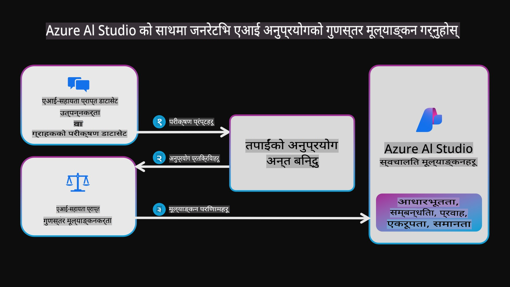

#### प्रदर्शन मापदण्डहरू

यस ट्युटोरियलमा, Azure AI Foundry का प्रदर्शन मापदण्डहरू प्रयोग गरी Fine-tuned Phi-3 / Phi-3.5 मोडेलको प्रदर्शन मूल्यांकन गर्नुहुनेछ। 

- **Groundedness**: मोडेलका उत्तरहरू इनपुट स्रोतसँग कत्तिको मेल खान्छन् भन्ने मूल्यांकन गर्छ।
- **Relevance**: दिएको प्रश्नसँग उत्तरहरूको सान्दर्भिकता मूल्यांकन गर्छ।
- **Coherence**: उत्पन्न गरिएको पाठ कत्तिको स्पष्ट र प्राकृतिक रूपमा पढ्न मिल्छ भन्ने मूल्यांकन गर्छ।
- **Fluency**: पाठको भाषागत दक्षता मूल्यांकन गर्छ।
- **GPT Similarity**: उत्पन्न उत्तरलाई ग्राउन्ड ट्रुथसँग तुलना गर्छ।
- **F1 Score**: उत्पन्न उत्तर र स्रोत डाटाबीच साझा शब्दहरूको अनुपात गणना गर्छ।

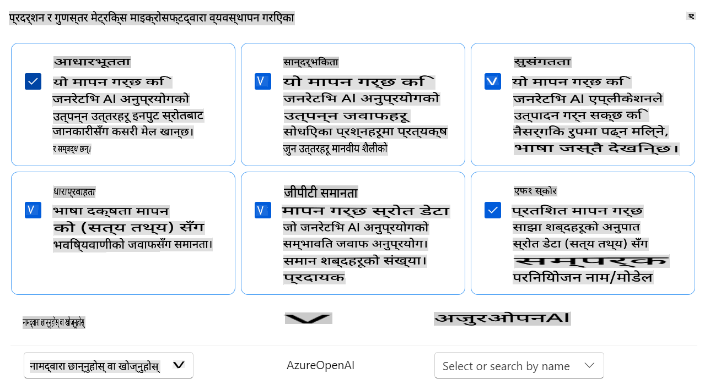
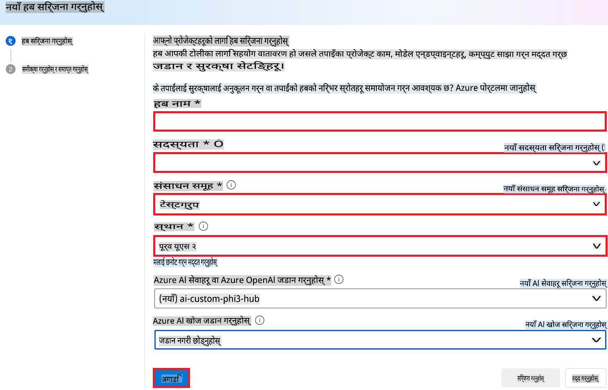

1. **Next** चयन गर्नुहोस्।

#### Azure AI Foundry प्रोजेक्ट सिर्जना गर्नुहोस्

1. तपाईंले सिर्जना गर्नुभएको हबमा, बाँया पट्टि रहेको ट्याबबाट **All projects** चयन गर्नुहोस्।

1. नेभिगेसन मेनुबाट **+ New project** चयन गर्नुहोस्।

    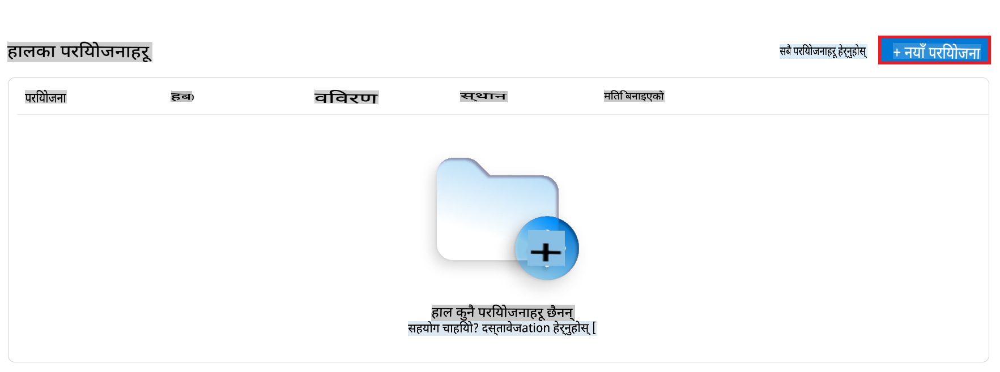

1. **Project name** प्रविष्ट गर्नुहोस्। यो अनौठो मान हुनुपर्छ।

    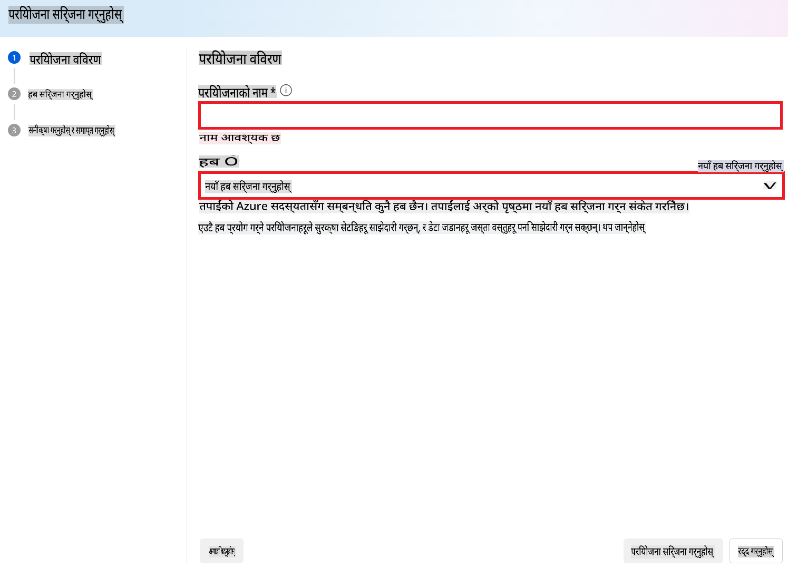

1. **Create a project** चयन गर्नुहोस्।

#### Fine-tuned Phi-3 / Phi-3.5 मोडेलको लागि कस्टम कनेक्शन थप्नुहोस्

तपाईंको कस्टम Phi-3 / Phi-3.5 मोडेललाई Prompt flow मा समाहित गर्न, मोडेलको endpoint र key कस्टम कनेक्शनमा सुरक्षित गर्नु आवश्यक छ। यस सेटअपले Prompt flow मा तपाईंको कस्टम Phi-3 / Phi-3.5 मोडेलमा पहुँच सुनिश्चित गर्दछ।

#### Fine-tuned Phi-3 / Phi-3.5 मोडेलको api key र endpoint uri सेट गर्नुहोस्

1. [Azure ML Studio](https://ml.azure.com/home?wt.mc_id=studentamb_279723) मा जानुहोस्।

1. तपाईंले सिर्जना गर्नुभएको Azure Machine Learning workspace मा नेभिगेट गर्नुहोस्।

1. बाँया पट्टि रहेको ट्याबबाट **Endpoints** चयन गर्नुहोस्।

    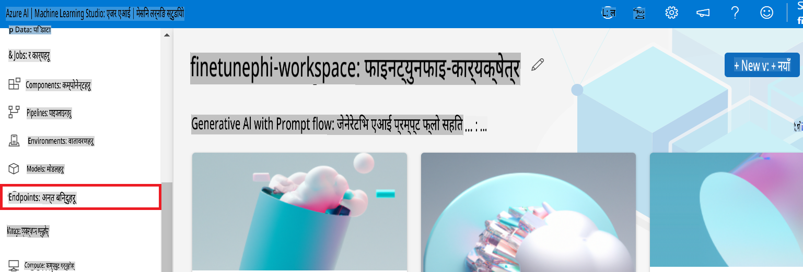

1. तपाईंले सिर्जना गर्नुभएको endpoint चयन गर्नुहोस्।

    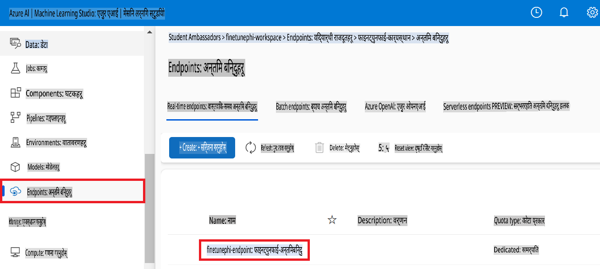

1. नेभिगेसन मेनुबाट **Consume** चयन गर्नुहोस्।

1. तपाईंको **REST endpoint** र **Primary key** प्रतिलिपि गर्नुहोस्।

    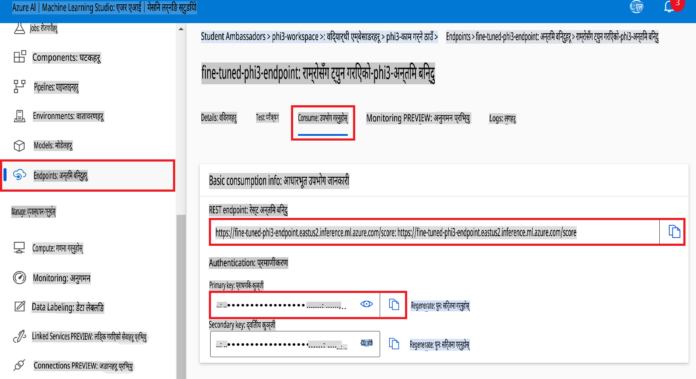

#### कस्टम कनेक्शन थप्नुहोस्

1. [Azure AI Foundry](https://ai.azure.com/?wt.mc_id=studentamb_279723) मा जानुहोस्।

1. तपाईंले सिर्जना गर्नुभएको Azure AI Foundry प्रोजेक्टमा नेभिगेट गर्नुहोस्।

1. तपाईंले सिर्जना गर्नुभएको प्रोजेक्टमा, बाँया पट्टि रहेको ट्याबबाट **Settings** चयन गर्नुहोस्।

1. **+ New connection** चयन गर्नुहोस्।

    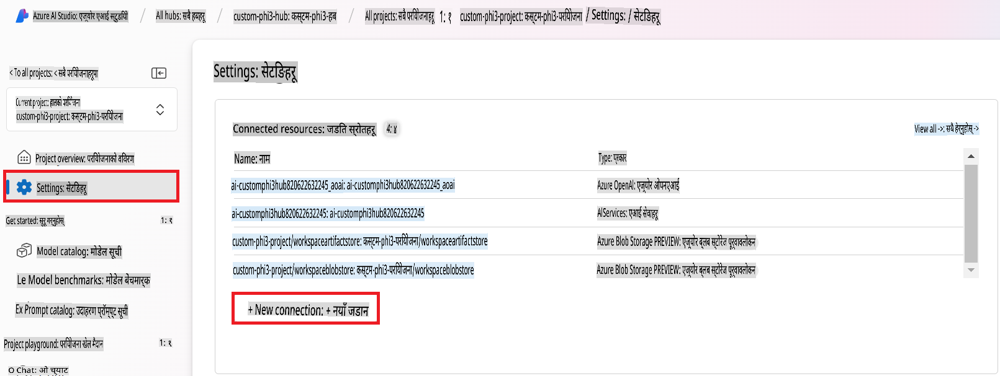

1. नेभिगेसन मेनुबाट **Custom keys** चयन गर्नुहोस्।

    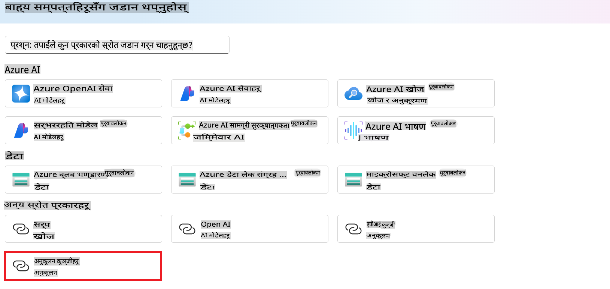

1. निम्न कार्यहरू गर्नुहोस्:

    - **+ Add key value pairs** चयन गर्नुहोस्।
    - key नामको लागि **endpoint** प्रविष्ट गर्नुहोस् र Azure ML Studio बाट प्रतिलिपि गरिएको endpoint मानको क्षेत्रमा पेस्ट गर्नुहोस्।
    - पुन: **+ Add key value pairs** चयन गर्नुहोस्।
    - key नामको लागि **key** प्रविष्ट गर्नुहोस् र Azure ML Studio बाट प्रतिलिपि गरिएको key मानको क्षेत्रमा पेस्ट गर्नुहोस्।
    - key हरू थपिसकेपछि, **is secret** चयन गर्नुहोस् ताकि key देखाउन नपाओस्।

    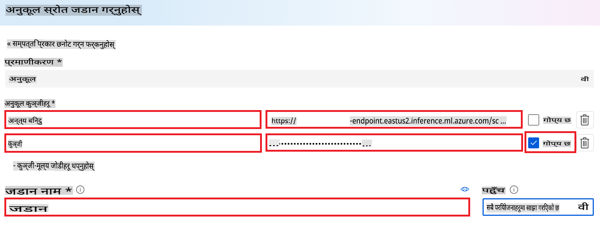

1. **Add connection** चयन गर्नुहोस्।

#### Prompt flow सिर्जना गर्नुहोस्

तपाईंले Azure AI Foundry मा कस्टम कनेक्शन थप्नुभएको छ। अब, निम्न चरणहरू प्रयोग गरेर Prompt flow सिर्जना गरौं। त्यसपछि, तपाईं कस्टम कनेक्शनलाई Prompt flow मा जडान गरेर fine-tuned मोडेल प्रयोग गर्नुहुनेछ।

1. तपाईंले सिर्जना गर्नुभएको Azure AI Foundry प्रोजेक्टमा नेभिगेट गर्नुहोस्।

1. बाँया पट्टि रहेको ट्याबबाट **Prompt flow** चयन गर्नुहोस्।

1. नेभिगेसन मेनुबाट **+ Create** चयन गर्नुहोस्।

    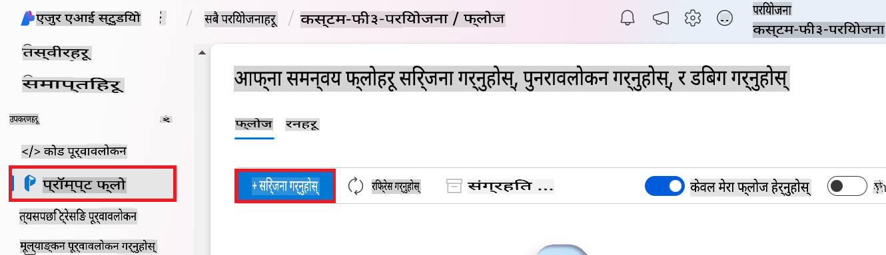

1. नेभिगेसन मेनुबाट **Chat flow** चयन गर्नुहोस्।

    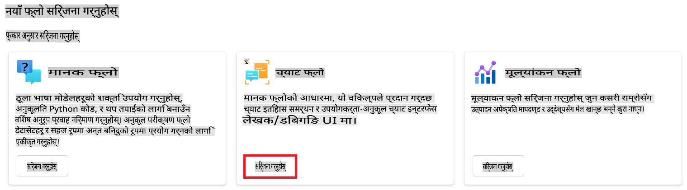

1. प्रयोग गर्न **Folder name** प्रविष्ट गर्नुहोस्।

    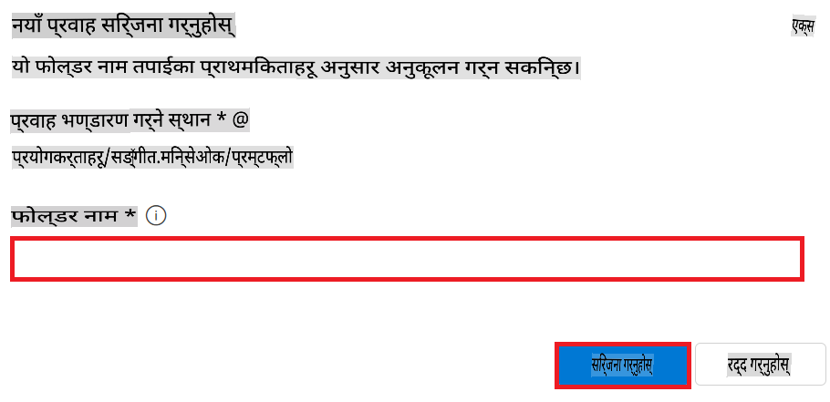

1. **Create** चयन गर्नुहोस्।

#### तपाईंको कस्टम Phi-3 / Phi-3.5 मोडेलसँग च्याट गर्न Prompt flow सेट गर्नुहोस्

Fine-tuned Phi-3 / Phi-3.5 मोडेललाई Prompt flow मा समाहित गर्न आवश्यक छ। यद्यपि, उपलब्ध Prompt flow यो उद्देश्यको लागि डिजाइन गरिएको छैन। त्यसैले, तपाईंले कस्टम मोडेल समाहित गर्न Prompt flow पुन: डिजाइन गर्नुपर्छ।

1. Prompt flow मा, निम्न कार्यहरू गर्नुहोस्:

    - **Raw file mode** चयन गर्नुहोस्।
    - *flow.dag.yml* फाइलमा रहेको सबै कोड मेट्नुहोस्।
    - *flow.dag.yml* फाइलमा निम्न कोड थप्नुहोस्।

        ```yml
        inputs:
          input_data:
            type: string
            default: "Who founded Microsoft?"

        outputs:
          answer:
            type: string
            reference: ${integrate_with_promptflow.output}

        nodes:
        - name: integrate_with_promptflow
          type: python
          source:
            type: code
            path: integrate_with_promptflow.py
          inputs:
            input_data: ${inputs.input_data}
        ```

    - **Save** चयन गर्नुहोस्।

    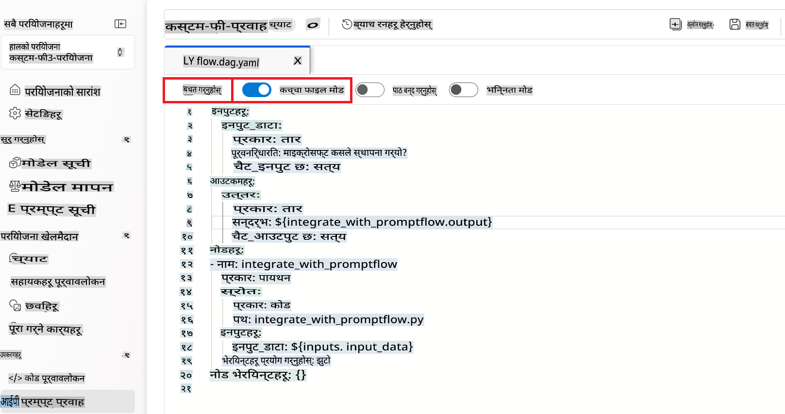

1. कस्टम Phi-3 / Phi-3.5 मोडेललाई Prompt flow मा प्रयोग गर्न *integrate_with_promptflow.py* मा निम्न कोड थप्नुहोस्।

    ```python
    import logging
    import requests
    from promptflow import tool
    from promptflow.connections import CustomConnection

    # Logging setup
    logging.basicConfig(
        format="%(asctime)s - %(levelname)s - %(name)s - %(message)s",
        datefmt="%Y-%m-%d %H:%M:%S",
        level=logging.DEBUG
    )
    logger = logging.getLogger(__name__)

    def query_phi3_model(input_data: str, connection: CustomConnection) -> str:
        """
        Send a request to the Phi-3 / Phi-3.5 model endpoint with the given input data using Custom Connection.
        """

        # "connection" is the name of the Custom Connection, "endpoint", "key" are the keys in the Custom Connection
        endpoint_url = connection.endpoint
        api_key = connection.key

        headers = {
            "Content-Type": "application/json",
            "Authorization": f"Bearer {api_key}"
        }
    data = {
        "input_data": [input_data],
        "params": {
            "temperature": 0.7,
            "max_new_tokens": 128,
            "do_sample": True,
            "return_full_text": True
            }
        }
        try:
            response = requests.post(endpoint_url, json=data, headers=headers)
            response.raise_for_status()
            
            # Log the full JSON response
            logger.debug(f"Full JSON response: {response.json()}")

            result = response.json()["output"]
            logger.info("Successfully received response from Azure ML Endpoint.")
            return result
        except requests.exceptions.RequestException as e:
            logger.error(f"Error querying Azure ML Endpoint: {e}")
            raise

    @tool
    def my_python_tool(input_data: str, connection: CustomConnection) -> str:
        """
        Tool function to process input data and query the Phi-3 / Phi-3.5 model.
        """
        return query_phi3_model(input_data, connection)

    ```

    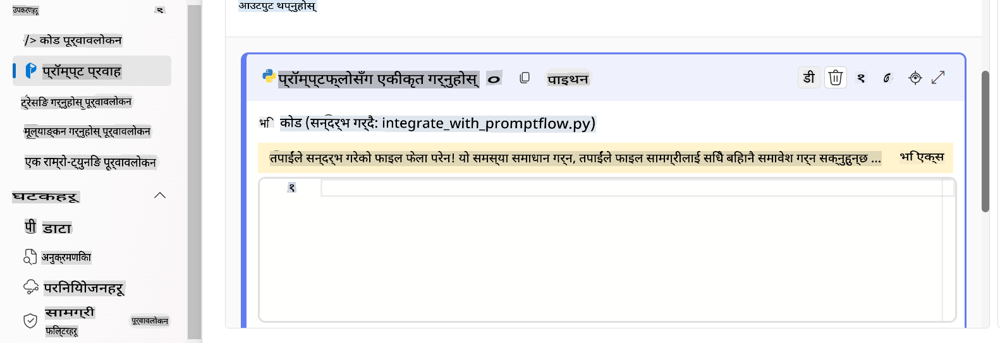

> [!NOTE]
> Azure AI Foundry मा Prompt flow प्रयोग गर्ने विस्तृत जानकारीका लागि, [Prompt flow in Azure AI Foundry](https://learn.microsoft.com/azure/ai-studio/how-to/prompt-flow) हेर्न सक्नुहुन्छ।

1. **Chat input**, **Chat output** चयन गरी तपाईंको मोडेलसँग च्याट सक्षम गर्नुहोस्।

    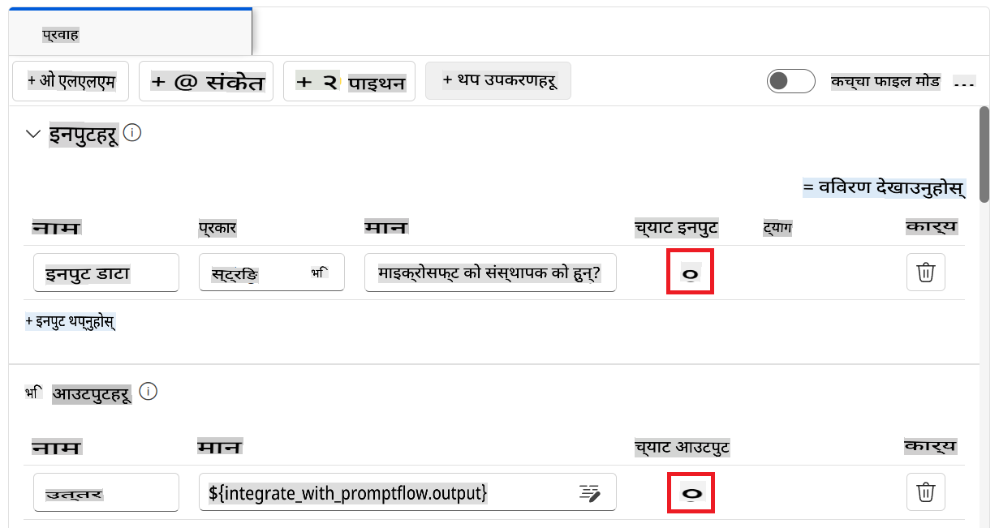

1. अब तपाईं कस्टम Phi-3 / Phi-3.5 मोडेलसँग च्याट गर्न तयार हुनुहुन्छ। अर्को अभ्यासमा, तपाईं Prompt flow सुरु गर्ने र fine-tuned Phi-3 / Phi-3.5 मोडेलसँग च्याट गर्न यसलाई प्रयोग गर्ने सिक्नुहुनेछ।

> [!NOTE]
>
> पुन:निर्मित flow तलको चित्रजस्तै देखिनुपर्छ:
>
> 
>

#### Prompt flow सुरु गर्नुहोस्

1. Prompt flow सुरु गर्न **Start compute sessions** चयन गर्नुहोस्।

    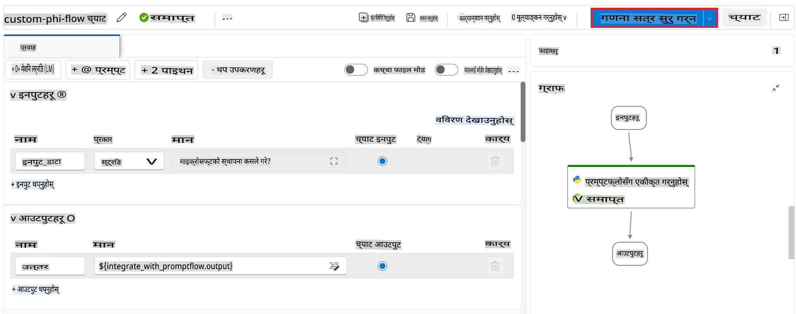

1. प्यारामिटरहरू नवीकरण गर्न **Validate and parse input** चयन गर्नुहोस्।

    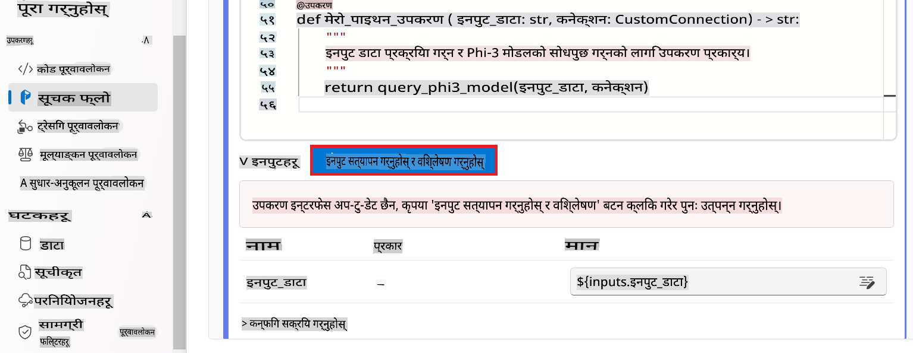

1. तपाईंले सिर्जना गर्नुभएको कस्टम कनेक्शनको **connection** को **Value** चयन गर्नुहोस्। उदाहरणका लागि, *connection*।

    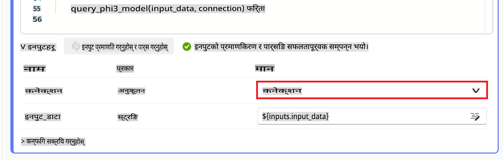

#### तपाईंको कस्टम Phi-3 / Phi-3.5 मोडेलसँग च्याट गर्नुहोस्

1. **Chat** चयन गर्नुहोस्।

    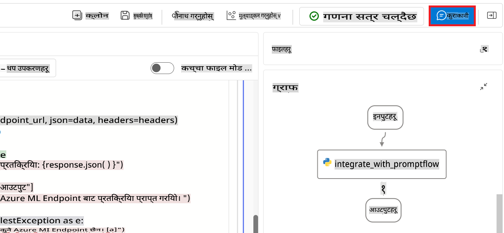

1. यहाँ एउटा उदाहरण परिणाम हो: अब तपाईं आफ्नो कस्टम Phi-3 / Phi-3.5 मोडेलसँग च्याट गर्न सक्नुहुन्छ। Fine-tuning को लागि प्रयोग गरिएका डाटामा आधारित प्रश्नहरू सोध्न सिफारिस गरिन्छ।

    

### Phi-3 / Phi-3.5 मोडेलको मूल्यांकन गर्न Azure OpenAI डिप्लोय गर्नुहोस्

Azure AI Foundry मा Phi-3 / Phi-3.5 मोडेलको मूल्यांकन गर्न, तपाईंले Azure OpenAI मोडेल डिप्लोय गर्न आवश्यक छ। यो मोडेल Phi-3 / Phi-3.5 मोडेलको प्रदर्शन मूल्यांकन गर्न प्रयोग हुनेछ।

#### Azure OpenAI डिप्लोय गर्नुहोस्

1. [Azure AI Foundry](https://ai.azure.com/?wt.mc_id=studentamb_279723) मा साइन इन गर्नुहोस्।

1. तपाईंले सिर्जना गर्नुभएको Azure AI Foundry प्रोजेक्टमा नेभिगेट गर्नुहोस्।

    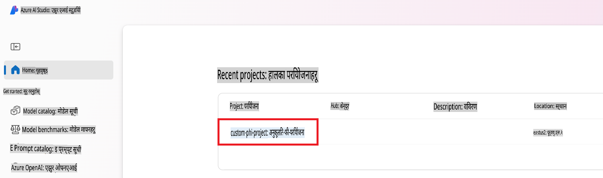

1. तपाईंले सिर्जना गर्नुभएको प्रोजेक्टमा, बाँया पट्टि रहेको ट्याबबाट **Deployments** चयन गर्नुहोस्।

1. नेभिगेसन मेनुबाट **+ Deploy model** चयन गर्नुहोस्।

1. **Deploy base model** चयन गर्नुहोस्।

    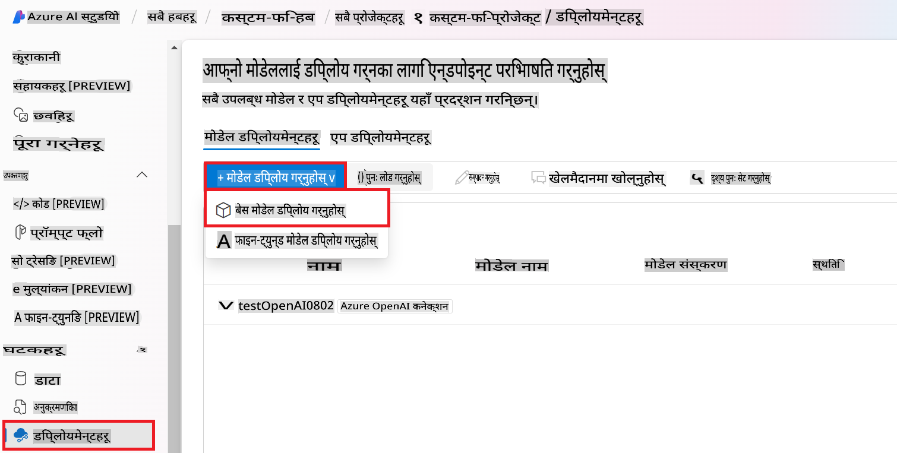

1. तपाईंले प्रयोग गर्न चाहनुभएको Azure OpenAI मोडेल चयन गर्नुहोस्। उदाहरणका लागि, **gpt-4o**।

    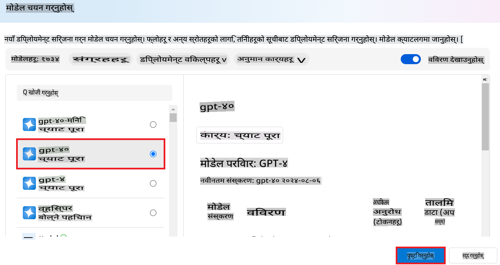

1. **Confirm** चयन गर्नुहोस्।

### Azure AI Foundry को Prompt flow मूल्यांकन प्रयोग गरी Fine-tuned Phi-3 / Phi-3.5 मोडेलको मूल्यांकन गर्नुहोस्

### नयाँ मूल्यांकन सुरु गर्नुहोस्

1. [Azure AI Foundry](https://ai.azure.com/?wt.mc_id=studentamb_279723) मा जानुहोस्।

1. तपाईंले सिर्जना गर्नुभएको Azure AI Foundry प्रोजेक्टमा नेभिगेट गर्नुहोस्।

    

1. तपाईंले सिर्जना गर्नुभएको प्रोजेक्टमा, बाँया पट्टि रहेको ट्याबबाट **Evaluation** चयन गर्नुहोस्।

1. नेभिगेसन मेनुबाट **+ New evaluation** चयन गर्नुहोस्।
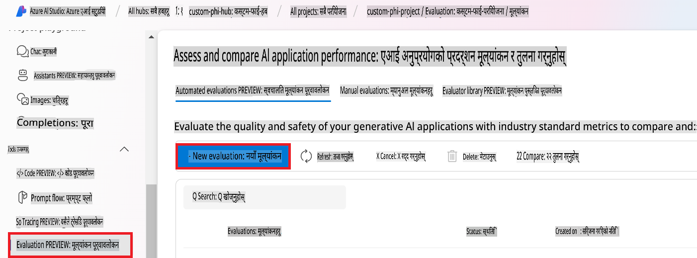

1. **Prompt flow** मूल्याङ्कन चयन गर्नुहोस्।

    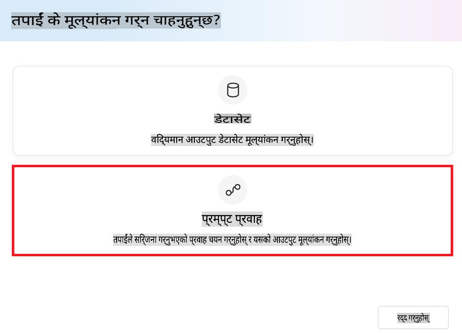

1. निम्न कार्यहरू गर्नुहोस्:

    - मूल्याङ्कनको नाम प्रविष्ट गर्नुहोस्। यो नाम अद्वितीय हुनुपर्छ।
    - कार्य प्रकारको रूपमा **Question and answer without context** चयन गर्नुहोस्। किनभने, यस ट्युटोरियलमा प्रयोग गरिएको **ULTRACHAT_200k** डेटासेटमा प्रसङ्ग छैन।
    - मूल्याङ्कन गर्न चाहेको prompt flow चयन गर्नुहोस्।

    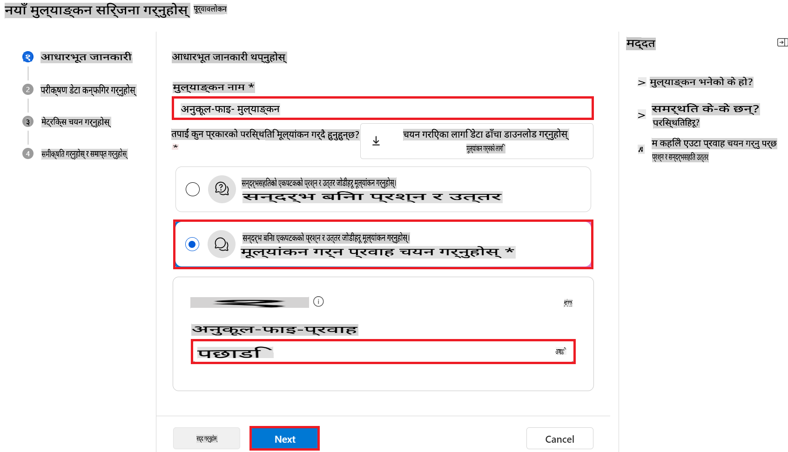

1. **Next** चयन गर्नुहोस्।

1. निम्न कार्यहरू गर्नुहोस्:

    - डेटासेट अपलोड गर्न **Add your dataset** चयन गर्नुहोस्। उदाहरणका लागि, तपाईं परीक्षण डेटासेट फाइल, जस्तै *test_data.json1* अपलोड गर्न सक्नुहुन्छ, जुन तपाईंले **ULTRACHAT_200k** डेटासेट डाउनलोड गर्दा समावेश गरिएको हुन्छ।
    - तपाईंको डेटासेटसँग मेल खाने उपयुक्त **Dataset column** चयन गर्नुहोस्। उदाहरणका लागि, यदि तपाईं **ULTRACHAT_200k** डेटासेट प्रयोग गर्दै हुनुहुन्छ भने, **${data.prompt}** चयन गर्नुहोस्।

    

1. **Next** चयन गर्नुहोस्।

1. प्रदर्शन र गुणस्तर मेट्रिक्स कन्फिगर गर्न निम्न कार्यहरू गर्नुहोस्:

    - तपाईं प्रयोग गर्न चाहनुभएको प्रदर्शन र गुणस्तर मेट्रिक्स चयन गर्नुहोस्।
    - मूल्याङ्कनका लागि तपाईंले सिर्जना गर्नुभएको Azure OpenAI मोडेल चयन गर्नुहोस्। उदाहरणका लागि, **gpt-4o** चयन गर्नुहोस्।

    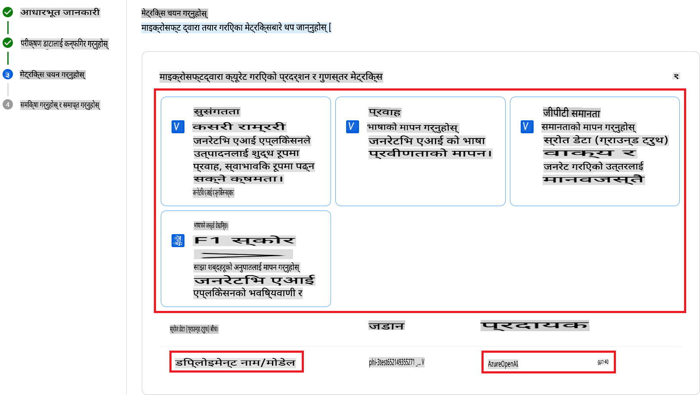

1. जोखिम र सुरक्षासम्बन्धी मेट्रिक्स कन्फिगर गर्न निम्न कार्यहरू गर्नुहोस्:

    - तपाईं प्रयोग गर्न चाहनुभएको जोखिम र सुरक्षासम्बन्धी मेट्रिक्स चयन गर्नुहोस्।
    - दोष दर गणना गर्न चाहनुभएको थ्रेसहोल्ड चयन गर्नुहोस्। उदाहरणका लागि, **Medium** चयन गर्नुहोस्।
    - **question** का लागि, **Data source** लाई **{$data.prompt}** मा सेट गर्नुहोस्।
    - **answer** का लागि, **Data source** लाई **{$run.outputs.answer}** मा सेट गर्नुहोस्।
    - **ground_truth** का लागि, **Data source** लाई **{$data.message}** मा सेट गर्नुहोस्।

    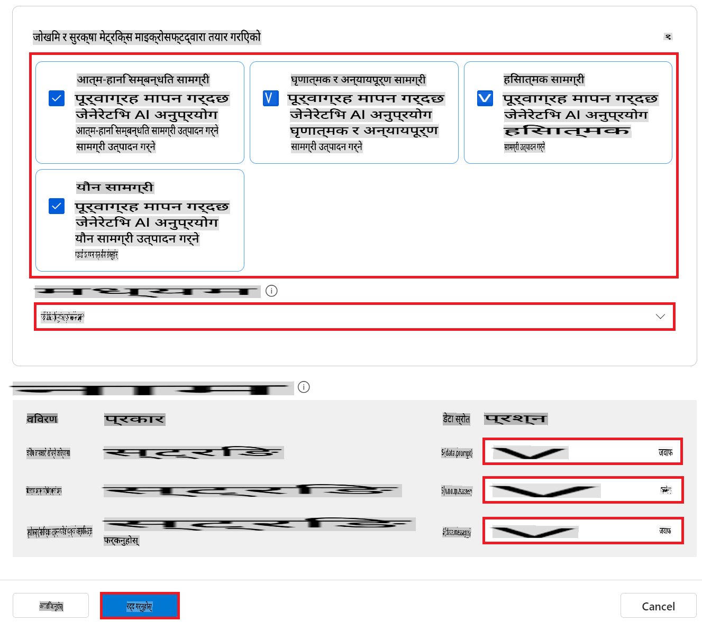

1. **Next** चयन गर्नुहोस्।

1. मूल्याङ्कन सुरु गर्न **Submit** चयन गर्नुहोस्।

1. मूल्याङ्कन पूरा हुन केही समय लाग्नेछ। तपाईं **Evaluation** ट्याबमा प्रगति अनुगमन गर्न सक्नुहुन्छ।

### मूल्याङ्कन परिणामहरू समीक्षा गर्नुहोस्

> [!NOTE]
> तल प्रस्तुत गरिएका परिणामहरू मूल्याङ्कन प्रक्रियाको प्रदर्शन गर्नका लागि मात्र हुन्। यस ट्युटोरियलमा, सापेक्षिक रूपमा सानो डेटासेटमा फाइन-ट्युन गरिएको मोडेल प्रयोग गरिएको छ, जसले सब-अप्टिमल परिणाम दिन सक्छ। वास्तविक परिणामहरू प्रयोग गरिएको डेटासेटको आकार, गुणस्तर, र विविधताका साथै मोडेलको विशिष्ट कन्फिगरेसनमा निर्भर गर्दै धेरै फरक हुन सक्छ।

मूल्याङ्कन पूरा भएपछि, तपाईं प्रदर्शन र सुरक्षासम्बन्धी मेट्रिक्सको लागि परिणामहरू समीक्षा गर्न सक्नुहुन्छ।

1. प्रदर्शन र गुणस्तर मेट्रिक्स:

    - मोडेलले स्पष्ट, प्रवाही, र सान्दर्भिक उत्तरहरू उत्पन्न गर्न कत्तिको प्रभावकारी छ भनी मूल्याङ्कन गर्नुहोस्।

    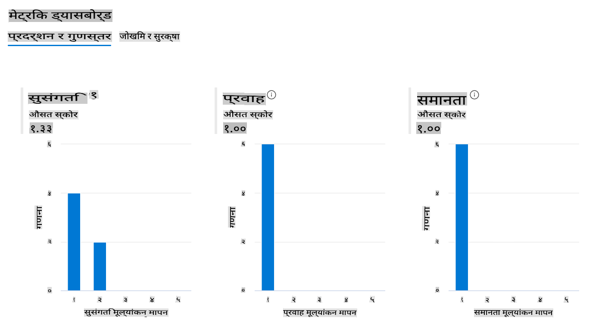

1. जोखिम र सुरक्षासम्बन्धी मेट्रिक्स:

    - सुनिश्चित गर्नुहोस् कि मोडेलको आउटपुट सुरक्षित छ र Responsible AI Principles अनुरूप छ, कुनै पनि हानिकारक वा आपत्तिजनक सामग्रीबाट जोगिन्छ।

    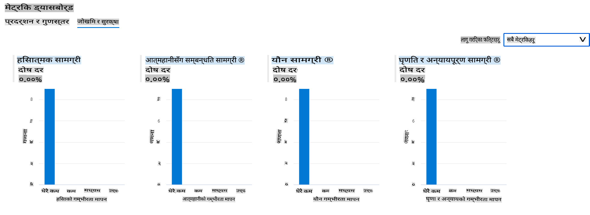

1. **Detailed metrics result** हेर्न तल स्क्रोल गर्न सक्नुहुन्छ।

    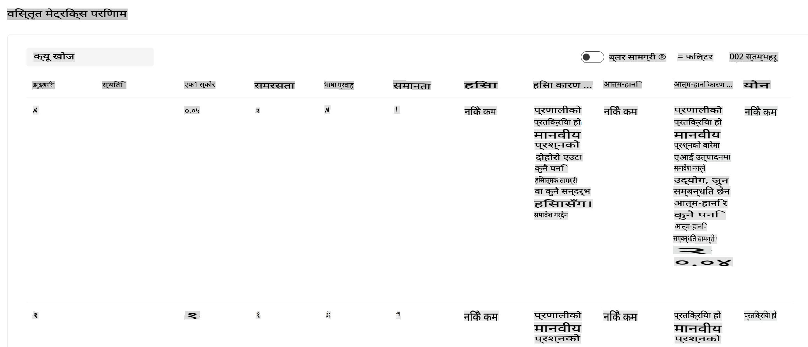

1. तपाईंले आफ्नो कस्टम Phi-3 / Phi-3.5 मोडेललाई प्रदर्शन र सुरक्षासम्बन्धी मेट्रिक्सको आधारमा मूल्याङ्कन गरेर, यो मात्र प्रभावकारी नभई उत्तरदायी AI अभ्यासहरूको पालना पनि गरेको पुष्टि गर्न सक्नुहुन्छ, जसले यसलाई वास्तविक संसारमा प्रयोगका लागि तयार बनाउँछ।

## बधाई छ!

### तपाईंले यो ट्युटोरियल पूरा गर्नुभयो

तपाईंले Azure AI Foundry मा Prompt flow सँग एकीकृत गरिएको फाइन-ट्युन गरिएको Phi-3 मोडेललाई सफलतापूर्वक मूल्याङ्कन गर्नुभयो। यो कदम तपाईंको AI मोडेलहरू केवल राम्रो प्रदर्शन गर्न मात्र नभई Microsoft का Responsible AI सिद्धान्तहरूको पालना गर्न पनि सुनिश्चित गर्न महत्त्वपूर्ण छ, जसले तपाईंलाई विश्वासिलो र भरपर्दो AI अनुप्रयोगहरू निर्माण गर्न मद्दत गर्दछ।


## Azure स्रोतहरू सफा गर्नुहोस्

तपाईंको खातामा अतिरिक्त शुल्क नलागोस् भन्नका लागि Azure स्रोतहरू सफा गर्नुहोस्। Azure पोर्टलमा जानुहोस् र निम्न स्रोतहरू मेटाउनुहोस्:

- Azure Machine learning स्रोत।
- Azure Machine learning मोडेल अन्त्यबिन्दु।
- Azure AI Foundry Project स्रोत।
- Azure AI Foundry Prompt flow स्रोत।

### आगामी चरणहरू

#### दस्तावेजीकरण

- [Responsible AI ड्यासबोर्ड प्रयोग गरेर AI प्रणालीहरूको मूल्याङ्कन गर्नुहोस्](https://learn.microsoft.com/azure/machine-learning/concept-responsible-ai-dashboard?view=azureml-api-2&source=recommendations?wt.mc_id=studentamb_279723)
- [जनरेटिभ AI को लागि मूल्याङ्कन र निगरानी मेट्रिक्स](https://learn.microsoft.com/azure/ai-studio/concepts/evaluation-metrics-built-in?tabs=definition?wt.mc_id=studentamb_279723)
- [Azure AI Foundry दस्तावेजीकरण](https://learn.microsoft.com/azure/ai-studio/?wt.mc_id=studentamb_279723)
- [Prompt flow दस्तावेजीकरण](https://microsoft.github.io/promptflow/?wt.mc_id=studentamb_279723)

#### तालिम सामग्री

- [Microsoft को उत्तरदायी AI दृष्टिकोणको परिचय](https://learn.microsoft.com/training/modules/introduction-to-microsofts-responsible-ai-approach/?source=recommendations?wt.mc_id=studentamb_279723)
- [Azure AI Foundry को परिचय](https://learn.microsoft.com/training/modules/introduction-to-azure-ai-studio/?wt.mc_id=studentamb_279723)

### सन्दर्भ

- [उत्तरदायी AI के हो?](https://learn.microsoft.com/azure/machine-learning/concept-responsible-ai?view=azureml-api-2?wt.mc_id=studentamb_279723)
- [Azure AI मा सुरक्षित र विश्वासिलो जनरेटिभ AI अनुप्रयोगहरू निर्माण गर्न नयाँ उपकरणहरूको घोषणा](https://azure.microsoft.com/blog/announcing-new-tools-in-azure-ai-to-help-you-build-more-secure-and-trustworthy-generative-ai-applications/?wt.mc_id=studentamb_279723)
- [जनरेटिभ AI अनुप्रयोगहरूको मूल्याङ्कन](https://learn.microsoft.com/azure/ai-studio/concepts/evaluation-approach-gen-ai?wt.mc_id%3Dstudentamb_279723)

**अस्वीकरण**:  
यो दस्तावेज मेसिन-आधारित एआई अनुवाद सेवाहरू प्रयोग गरी अनुवाद गरिएको हो। हामी शुद्धताका लागि प्रयास गर्छौं, तर कृपया सचेत रहनुहोस् कि स्वचालित अनुवादमा त्रुटि वा अशुद्धता हुन सक्छ। यसको मूल भाषामा रहेको मूल दस्तावेजलाई आधिकारिक स्रोत मानिनुपर्छ। महत्वपूर्ण जानकारीका लागि, व्यावसायिक मानव अनुवाद सिफारिस गरिन्छ। यस अनुवादको प्रयोगबाट उत्पन्न हुने कुनै पनि गलतफहमी वा गलत व्याख्याको लागि हामी जिम्मेवार हुनेछैनौं।