# फाइन-ट्यून र कस्टम Phi-3 मोडेलहरूलाई Prompt flow सँग एकीकृत गर्नुहोस्

यो अन्त-देखि-अन्त (E2E) नमूना "[Fine-Tune and Integrate Custom Phi-3 Models with Prompt Flow: Step-by-Step Guide](https://techcommunity.microsoft.com/t5/educator-developer-blog/fine-tune-and-integrate-custom-phi-3-models-with-prompt-flow/ba-p/4178612?WT.mc_id=aiml-137032-kinfeylo)" बाट आधारित छ, जुन Microsoft Tech Community मा उपलब्ध छ। यसले कस्टम Phi-3 मोडेलहरूलाई फाइन-ट्यून, डिप्लोय र Prompt flow सँग एकीकृत गर्ने प्रक्रिया प्रस्तुत गर्दछ।

## अवलोकन

यस E2E नमूनामा, तपाईं Phi-3 मोडेललाई कसरी फाइन-ट्यून गर्ने र Prompt flow सँग एकीकृत गर्ने सिक्नुहुनेछ। Azure Machine Learning र Prompt flow को उपयोग गरेर, तपाईं कस्टम AI मोडेलहरू डिप्लोय गर्न र प्रयोग गर्नको लागि वर्कफ्लो स्थापना गर्नुहुनेछ। यो E2E नमूना तीन परिदृश्यहरूमा विभाजित छ:

**परिदृश्य १: Azure स्रोतहरू सेट अप गर्नुहोस् र फाइन-ट्यूनिङको लागि तयारी गर्नुहोस्**

**परिदृश्य २: Phi-3 मोडेल फाइन-ट्यून गर्नुहोस् र Azure Machine Learning Studio मा डिप्लोय गर्नुहोस्**

**परिदृश्य ३: Prompt flow सँग एकीकृत गर्नुहोस् र आफ्नो कस्टम मोडेलसँग कुराकानी गर्नुहोस्**

यहाँ यस E2E नमूनाको अवलोकन छ।

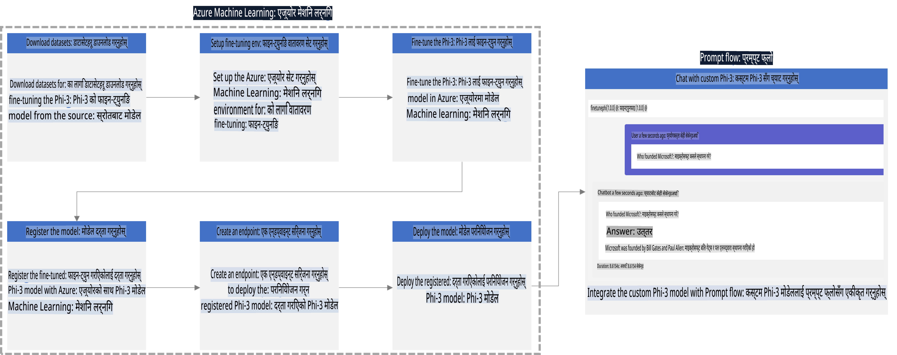

### सामग्री तालिका

1. **[परिदृश्य १: Azure स्रोतहरू सेट अप गर्नुहोस् र फाइन-ट्यूनिङको लागि तयारी गर्नुहोस्](../../../../../../md/02.Application/01.TextAndChat/Phi3)**
    - [Azure Machine Learning Workspace बनाउनुहोस्](../../../../../../md/02.Application/01.TextAndChat/Phi3)
    - [Azure Subscription मा GPU कोटा अनुरोध गर्नुहोस्](../../../../../../md/02.Application/01.TextAndChat/Phi3)
    - [भूमिका असाइनमेन्ट थप्नुहोस्](../../../../../../md/02.Application/01.TextAndChat/Phi3)
    - [प्रोजेक्ट सेट अप गर्नुहोस्](../../../../../../md/02.Application/01.TextAndChat/Phi3)
    - [फाइन-ट्यूनिङको लागि डाटासेट तयार गर्नुहोस्](../../../../../../md/02.Application/01.TextAndChat/Phi3)

1. **[परिदृश्य २: Phi-3 मोडेल फाइन-ट्यून गर्नुहोस् र Azure Machine Learning Studio मा डिप्लोय गर्नुहोस्](../../../../../../md/02.Application/01.TextAndChat/Phi3)**
    - [Azure CLI सेट अप गर्नुहोस्](../../../../../../md/02.Application/01.TextAndChat/Phi3)
    - [Phi-3 मोडेल फाइन-ट्यून गर्नुहोस्](../../../../../../md/02.Application/01.TextAndChat/Phi3)
    - [फाइन-ट्यून गरिएको मोडेल डिप्लोय गर्नुहोस्](../../../../../../md/02.Application/01.TextAndChat/Phi3)

1. **[परिदृश्य ३: Prompt flow सँग एकीकृत गर्नुहोस् र आफ्नो कस्टम मोडेलसँग कुराकानी गर्नुहोस्](../../../../../../md/02.Application/01.TextAndChat/Phi3)**
    - [कस्टम Phi-3 मोडेललाई Prompt flow सँग एकीकृत गर्नुहोस्](../../../../../../md/02.Application/01.TextAndChat/Phi3)
    - [आफ्नो कस्टम मोडेलसँग कुराकानी गर्नुहोस्](../../../../../../md/02.Application/01.TextAndChat/Phi3)

## परिदृश्य १: Azure स्रोतहरू सेट अप गर्नुहोस् र फाइन-ट्यूनिङको लागि तयारी गर्नुहोस्

### Azure Machine Learning Workspace बनाउनुहोस्

1. पोर्टल पृष्ठको माथिल्लो **खोज बार** मा *azure machine learning* टाइप गर्नुहोस् र देखिएका विकल्पहरूबाट **Azure Machine Learning** चयन गर्नुहोस्।

    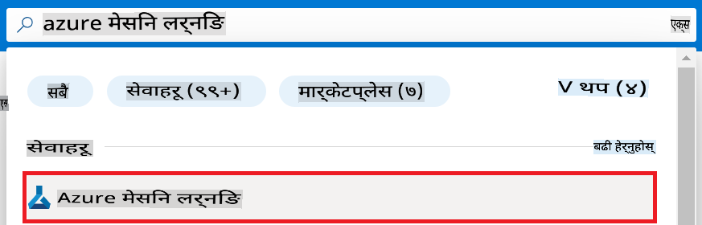

1. नेभिगेसन मेनुबाट **+ Create** चयन गर्नुहोस्।

1. नेभिगेसन मेनुबाट **New workspace** चयन गर्नुहोस्।

    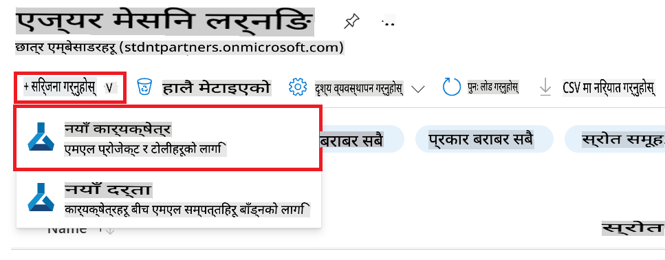

1. निम्न कार्यहरू गर्नुहोस्:

    - आफ्नो Azure **Subscription** चयन गर्नुहोस्।
    - प्रयोग गर्नको लागि **Resource group** चयन गर्नुहोस् (आवश्यक भएमा नयाँ बनाउनुहोस्)।
    - **Workspace Name** प्रविष्ट गर्नुहोस्। यो अद्वितीय हुनुपर्छ।
    - प्रयोग गर्न चाहिएको **Region** चयन गर्नुहोस्।
    - प्रयोग गर्नको लागि **Storage account** चयन गर्नुहोस् (आवश्यक भएमा नयाँ बनाउनुहोस्)।
    - प्रयोग गर्नको लागि **Key vault** चयन गर्नुहोस् (आवश्यक भएमा नयाँ बनाउनुहोस्)।
    - प्रयोग गर्नको लागि **Application insights** चयन गर्नुहोस् (आवश्यक भएमा नयाँ बनाउनुहोस्)।
    - प्रयोग गर्नको लागि **Container registry** चयन गर्नुहोस् (आवश्यक भएमा नयाँ बनाउनुहोस्)।

    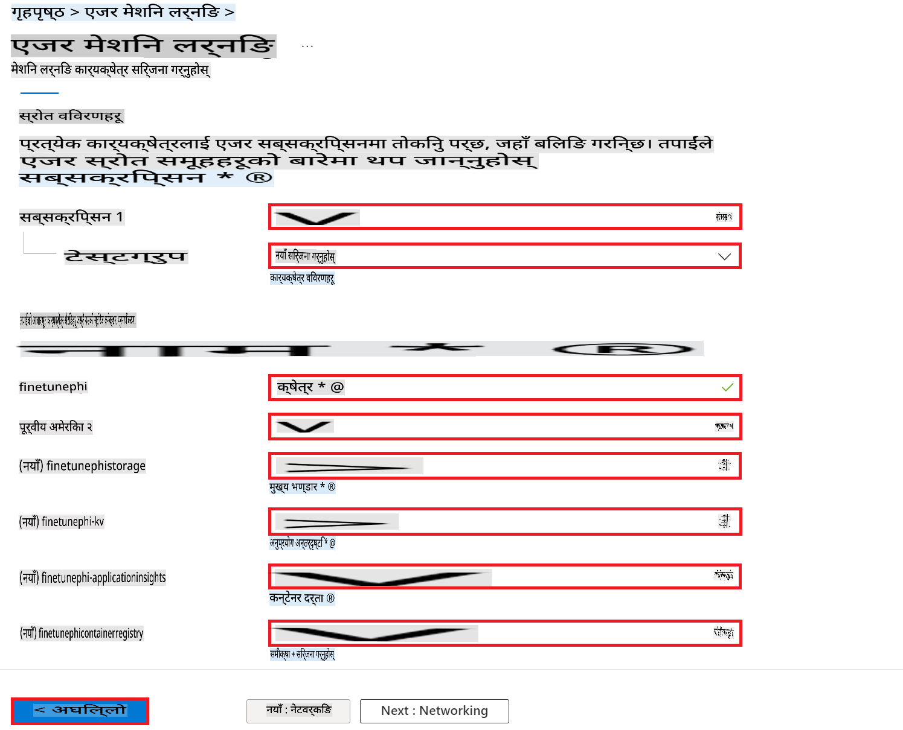

1. **Review + Create** चयन गर्नुहोस्।

1. **Create** चयन गर्नुहोस्।

### Azure Subscription मा GPU कोटा अनुरोध गर्नुहोस्

यस E2E नमूनामा, तपाईं फाइन-ट्यूनिङको लागि *Standard_NC24ads_A100_v4 GPU* प्रयोग गर्नुहुनेछ, जसका लागि कोटा अनुरोध आवश्यक छ, र डिप्लोयमेन्टको लागि *Standard_E4s_v3* CPU प्रयोग गर्नुहुनेछ, जसका लागि कोटा अनुरोध आवश्यक छैन।

> [!NOTE]
>
> केवल Pay-As-You-Go सब्स्क्रिप्शन (मानक सब्स्क्रिप्शन प्रकार) GPU आवंटनको लागि योग्य छन्; हाल लाभ सब्स्क्रिप्शनहरू समर्थन गरिएका छैनन्।
>
> लाभ सब्स्क्रिप्शनहरू (जस्तै Visual Studio Enterprise Subscription) प्रयोग गर्नेहरू वा फाइन-ट्यूनिङ र डिप्लोयमेन्ट प्रक्रिया छिटो परीक्षण गर्न चाहनेहरूका लागि, यो ट्युटोरियलले CPU प्रयोग गरेर न्यूनतम डाटासेटसँग फाइन-ट्यूनिङको लागि निर्देशन पनि प्रदान गर्दछ। तर, यो महत्त्वपूर्ण छ कि ठूलो डाटासेट र GPU प्रयोग गर्दा फाइन-ट्यूनिङ परिणामहरू उल्लेखनीय रूपमा राम्रो हुन्छन्।

1. [Azure ML Studio](https://ml.azure.com/home?wt.mc_id=studentamb_279723) भ्रमण गर्नुहोस्।

1. *Standard NCADSA100v4 Family* कोटा अनुरोध गर्न निम्न कार्यहरू गर्नुहोस्:

    - बाँया पट्टिको ट्याबबाट **Quota** चयन गर्नुहोस्।
    - प्रयोग गर्नको लागि **Virtual machine family** चयन गर्नुहोस्। उदाहरणका लागि, **Standard NCADSA100v4 Family Cluster Dedicated vCPUs** चयन गर्नुहोस्, जसमा *Standard_NC24ads_A100_v4* GPU समावेश छ।
    - नेभिगेसन मेनुबाट **Request quota** चयन गर्नुहोस्।

        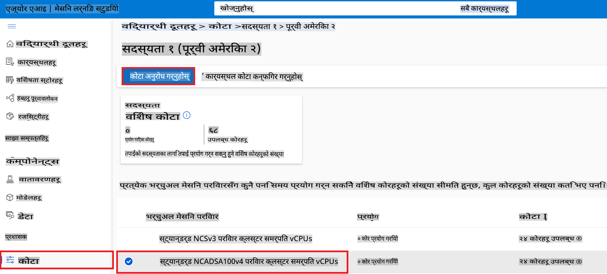

    - Request quota पृष्ठमा, तपाईं प्रयोग गर्न चाहनुभएको **New cores limit** प्रविष्ट गर्नुहोस्। उदाहरणका लागि, 24।
    - Request quota पृष्ठमा, GPU कोटा अनुरोध गर्न **Submit** चयन गर्नुहोस्।

> [!NOTE]
> तपाईं आफ्नो आवश्यकता अनुसार उपयुक्त GPU वा CPU चयन गर्न सक्नुहुन्छ। [Sizes for Virtual Machines in Azure](https://learn.microsoft.com/azure/virtual-machines/sizes/overview?tabs=breakdownseries%2Cgeneralsizelist%2Ccomputesizelist%2Cmemorysizelist%2Cstoragesizelist%2Cgpusizelist%2Cfpgasizelist%2Chpcsizelist) कागजातलाई सन्दर्भ गर्नुस्।

### भूमिका असाइनमेन्ट थप्नुहोस्

मोडेलहरू फाइन-ट्यून र डिप्लोय गर्न, तपाईंले पहिले एक User Assigned Managed Identity (UAI) बनाउनुपर्छ र यसलाई उपयुक्त अनुमतिहरू असाइन गर्नुपर्छ। यो UAI डिप्लोयमेन्टको समयमा प्रमाणीकरणको लागि प्रयोग गरिनेछ। 

#### User Assigned Managed Identity (UAI) बनाउनुहोस्

1. पोर्टल पृष्ठको माथिल्लो **खोज बार** मा *managed identities* टाइप गर्नुहोस् र देखिएका विकल्पहरूबाट **Managed Identities** चयन गर्नुहोस्।

    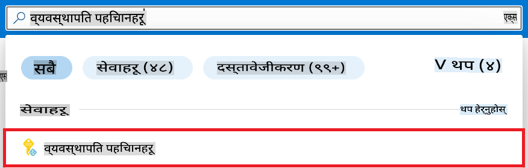

1. **+ Create** चयन गर्नुहोस्।

    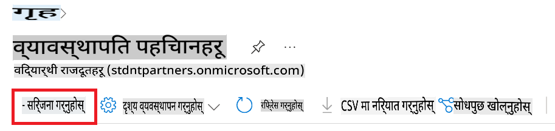

1. निम्न कार्यहरू गर्नुहोस्:

    - आफ्नो Azure **Subscription** चयन गर्नुहोस्।
    - प्रयोग गर्नको लागि **Resource group** चयन गर्नुहोस् (आवश्यक भएमा नयाँ बनाउनुहोस्)।
    - प्रयोग गर्न चाहिएको **Region** चयन गर्नुहोस्।
    - **Name** प्रविष्ट गर्नुहोस्। यो अद्वितीय हुनुपर्छ।

1. **Review + create** चयन गर्नुहोस्।

1. **+ Create** चयन गर्नुहोस्।

#### Managed Identity लाई Contributor भूमिका असाइन गर्नुहोस्

1. तपाईंले बनाएको Managed Identity स्रोतमा नेभिगेट गर्नुहोस्।

1. बाँया पट्टिको ट्याबबाट **Azure role assignments** चयन गर्नुहोस्।

1. नेभिगेसन मेनुबाट **+Add role assignment** चयन गर्नुहोस्।

1. Add role assignment पृष्ठमा, निम्न कार्यहरू गर्नुहोस्:
    - **Scope** लाई **Resource group** मा सेट गर्नुहोस्।
    - आफ्नो Azure **Subscription** चयन गर्नुहोस्।
    - प्रयोग गर्नको लागि **Resource group** चयन गर्नुहोस्।
    - **Role** लाई **Contributor** मा सेट गर्नुहोस्।

    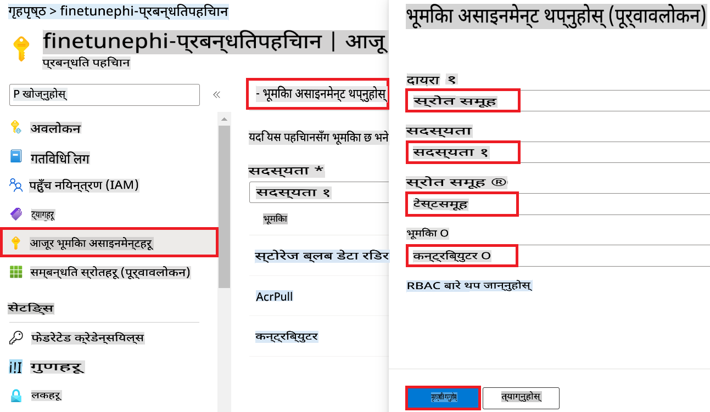

1. **Save** चयन गर्नुहोस्।

#### Managed Identity लाई Storage Blob Data Reader भूमिका असाइन गर्नुहोस्

1. पोर्टल पृष्ठको माथिल्लो **खोज बार** मा *storage accounts* टाइप गर्नुहोस् र देखिएका विकल्पहरूबाट **Storage accounts** चयन गर्नुहोस्।

    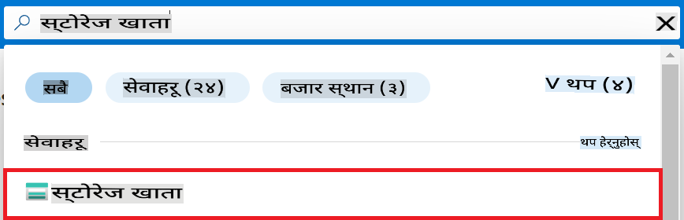

1. तपाईंले बनाएको Azure Machine Learning Workspace सँग सम्बन्धित Storage account चयन गर्नुहोस्। उदाहरणका लागि, *finetunephistorage*।

1. Add role assignment पृष्ठमा नेभिगेट गर्न निम्न कार्यहरू गर्नुहोस्:

    - तपाईंले बनाएको Azure Storage account मा नेभिगेट गर्नुहोस्।
    - बाँया पट्टिको ट्याबबाट **Access Control (IAM)** चयन गर्नुहोस्।
    - नेभिगेसन मेनुबाट **+ Add** चयन गर्नुहोस्।
    - नेभिगेसन मेनुबाट **Add role assignment** चयन गर्नुहोस्।

    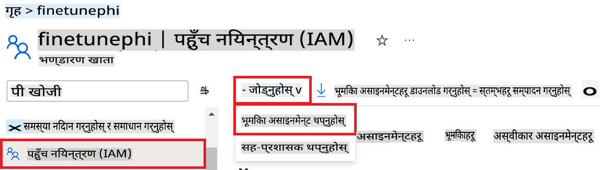

1. Add role assignment पृष्ठमा, निम्न कार्यहरू गर्नुहोस्:

    - **Role** पृष्ठमा, **Storage Blob Data Reader** टाइप गर्नुहोस् र देखिएका विकल्पहरूबाट **Storage Blob Data Reader** चयन गर्नुहोस्।
    - **Role** पृष्ठमा, **Next** चयन गर्नुहोस्।
    - **Members** पृष्ठमा, **Assign access to** लाई **Managed identity** मा सेट गर्नुहोस्।
    - **Members** पृष्ठमा, **+ Select members** चयन गर्नुहोस्।
    - Select managed identities पृष्ठमा, आफ्नो Azure **Subscription** चयन गर्नुहोस्।
    - Select managed identities पृष्ठमा, **Managed identity** लाई **Manage Identity** मा सेट गर्नुहोस्।
    - Select managed identities पृष्ठमा, तपाईंले बनाएको Managed Identity चयन गर्नुहोस्। उदाहरणका लागि, *finetunephi-managedidentity*।
    - Select managed identities पृष्ठमा, **Select** चयन गर्नुहोस्।

    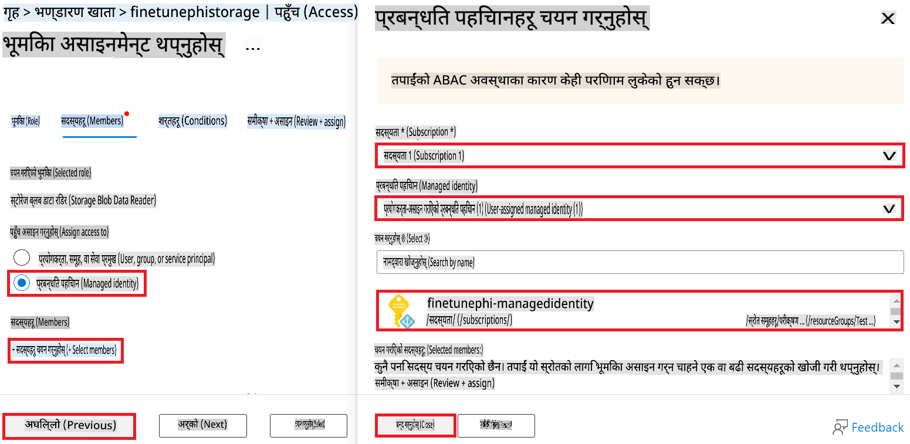

1. **Review + assign** चयन गर्नुहोस्।

#### Managed Identity लाई AcrPull भूमिका असाइन गर्नुहोस्

1. पोर्टल पृष्ठको माथिल्लो **खोज बार** मा *container registries* टाइप गर्नुहोस् र देखिएका विकल्पहरूबाट **Container registries** चयन गर्नुहोस्।

    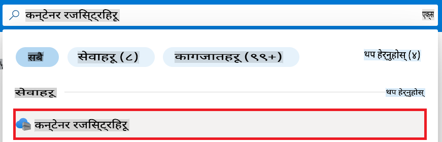

1. तपाईंले बनाएको Azure Machine Learning Workspace सँग सम्बन्धित Container registry चयन गर्नुहोस्। उदाहरणका लागि, *finetunephicontainerregistries*।

1. Add role assignment पृष्ठमा नेभिगेट गर्न निम्न कार्यहरू गर्नुहोस्:

    - बाँया पट्टिको ट्याबबाट **Access Control (IAM)** चयन गर्नुहोस्।
    - नेभिगेसन मेनुबाट **+ Add** चयन गर्नुहोस्।
    - नेभिगेसन मेनुबाट **Add role assignment** चयन गर्नुहोस्।

1. Add role assignment पृष्ठमा, निम्न कार्यहरू गर्नुहोस्:

    - **Role** पृष्ठमा, **AcrPull** टाइप गर्नुहोस् र देखिएका विकल्पहरूबाट **AcrPull** चयन गर्नुहोस्।
    - **Role** पृष्ठमा, **Next** चयन गर्नुहोस्।
    - **Members** पृष्ठमा, **Assign access to** लाई **Managed identity** मा सेट गर्नुहोस्।
    - **Members** पृष्ठमा, **+ Select members** चयन गर्नुहोस्।
    - Select managed identities पृष्ठमा, आफ्नो Azure **Subscription** चयन गर्नुहोस्।
    - Select managed identities पृष्ठमा, **Managed identity** लाई **Manage Identity** मा सेट गर्नुहोस्।
    - Select managed identities पृष्ठमा, तपाईंले बनाएको Managed Identity चयन गर्नुहोस्। उदाहरणका लागि, *finetunephi-managedidentity*।
    - Select managed identities पृष्ठमा, **Select** चयन गर्नुहोस्।
    - **Review + assign** चयन गर्नुहोस्।

### प्रोजेक्ट सेट अप गर्नुहोस्

अब, तपाईंले काम गर्नको लागि एउटा फोल्डर बनाउनुहुनेछ र Azure Cosmos DB मा भण्डारण गरिएको च्याट इतिहास प्रयोग गरेर प्रयोगकर्ताहरूसँग अन्तरक्रिया गर्ने प्रोग्राम विकास गर्न भर्चुअल वातावरण सेट अप गर्नुहुनेछ।

#### काम गर्नको लागि एउटा फोल्डर बनाउनुहोस्

1. टर्मिनल विन्डो खोल्नुहोस् र *finetune-phi* नामको फोल्डर बनाउन निम्न कमाण्ड टाइप गर्नुहोस्।

    ```console
    mkdir finetune-phi
    ```

1. बनाइएको *finetune-phi* फोल्डरमा जान निम्न कमाण्ड टाइप गर्नुहोस्।

    ```console
    cd finetune-phi
    ```

#### भर्चुअल वातावरण बनाउनुहोस्

1. *.venv* नामको भर्चुअल वातावरण बनाउन निम्न कमाण्ड टाइप गर्नुहोस्।

    ```console
    python -m venv .venv
    ```

1. भर्चुअल वातावरण सक्रिय गर्न निम्न कमाण्ड टाइप गर्नुहोस्।

    ```console
    .venv\Scripts\activate.bat
    ```

> [!NOTE]
>
> यदि यो सफल भयो भने, तपाईंले कमाण्ड प्रम्प्ट अघि *(.venv)* देख्नुहुनेछ।

#### आवश्यक प्याकेजहरू इन्स्टल गर्नुहोस्

1. आवश्यक प्याकेजहरू इन्स्टल गर्न निम्न कमाण्डहरू टाइप गर्नुहोस्।

    ```console
    pip install datasets==2.19.1
    pip install transformers==4.41.1
    pip install azure-ai-ml==1.16.0
    pip install torch==2.3.1
    pip install trl==0.9.4
    pip install promptflow==1.12.0
    ```

#### प्रोजेक्ट फाइलहरू बनाउनुहोस्

यस अभ्यासमा, तपाईंले प्रोजेक्टका लागि आवश्यक फाइलहरू बनाउनुहुनेछ। यी फाइलहरूमा डाटासेट डाउनलोड गर्ने, Azure Machine Learning वातावरण सेट अप गर्ने, Phi-3 मोडेल फाइन-ट्यून गर्ने, र फाइन-ट्यून गरिएको मोडेल डिप्लोय गर्ने स्क्रिप्टहरू समावेश छन्। तपाईंले *conda.yml* फाइल पनि बनाउनुहुनेछ जसले फाइन-ट्यूनिङ वातावरण सेट अप गर्दछ।

यस अभ्यासमा, तपाईं:

- डाटासेट डाउनलोड गर्न *download_dataset.py* फाइल बनाउनुहोस्।
- Azure Machine Learning वातावरण सेट अप गर्न *setup_ml.py* फाइल बनाउनुहोस्।
- *finetuning_dir* फोल्डरमा Phi-3 मोडेल फाइन-ट्यून गर्न *fine_tune.py* फाइल बनाउनुहोस्।
- फाइन-ट्यूनिङ वातावरण सेट अप गर्न *conda.yml* फाइल बनाउनुहोस्।
- फाइन-ट्यून गरिएको मोडेल डिप्लोय गर्न *deploy_model.py* फाइल बनाउनुहोस्।
- फाइन-ट्यून गरिएको मोडेललाई Prompt flow सँग एकीकृत गर्न र मोडेल कार्यान्वयन गर्न *integrate_with_promptflow.py* फाइल बनाउनुहोस्।
- Prompt flow को लागि वर्कफ्लो संरचना सेट अप गर्न flow.dag.yml फाइल बनाउनुहोस्।
- Azure जानकारी प्रविष्ट गर्न *config.py* फाइल बनाउनुहोस्।

> [!NOTE]
>
> पूर्ण फोल्डर संरचना:
>
> ```text
> └── YourUserName
> .    └── finetune-phi
> .        ├── finetuning_dir
> .        │      └── fine_tune.py
> .        ├── conda.yml
> .        ├── config.py
> .        ├── deploy_model.py
> .        ├── download_dataset.py
> .        ├── flow.dag.yml
> .        ├── integrate_with_promptflow.py
> .        └── setup_ml.py
> ```

1. **Visual Studio Code** खोल्नुहोस्।

1. मेनु बारबाट **File** चयन गर्नुहोस्।

1. **Open Folder** चयन गर्नुहोस्।

1. तपाईंले बनाएको *finetune-phi* फोल्डर चयन गर्नुहोस्, जुन *C:\Users\yourUserName\finetune-phi* मा अवस्थित छ।

    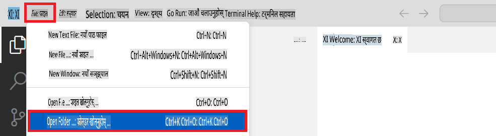

1. Visual Studio Code को बाँया प्यानलमा, दायाँ क्लिक गर्नुहोस् र *download_dataset.py* नामको नयाँ फाइल बनाउन **New File** चयन गर्नुहोस्।

1. Visual Studio Code को बाँया प्यानलमा, दायाँ क्लिक गर्नुहोस् र *setup_ml.py* नामको नयाँ फाइल बनाउन **New File** चयन गर्नुहोस्।

1. Visual Studio Code को बाँया प्यानलमा, दायाँ क्लिक गर्नुहोस् र *deploy_model.py* नामको नयाँ फ
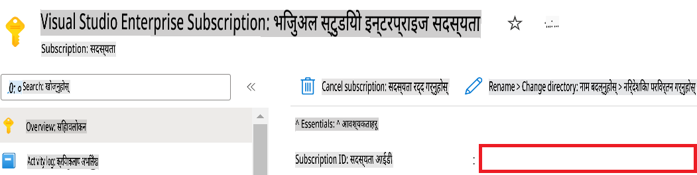

1. Azure Workspace Name थप्न निम्न चरणहरू गर्नुहोस्:

    - तपाईंले सिर्जना गरेको Azure Machine Learning स्रोतमा जानुहोस्।
    - आफ्नो खाता नाम *config.py* फाइलमा कपी गरेर पेस्ट गर्नुहोस्।

    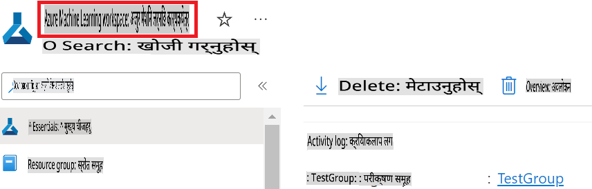

1. Azure Resource Group Name थप्न निम्न चरणहरू गर्नुहोस्:

    - तपाईंले सिर्जना गरेको Azure Machine Learning स्रोतमा जानुहोस्।
    - आफ्नो Azure Resource Group Name *config.py* फाइलमा कपी गरेर पेस्ट गर्नुहोस्।

    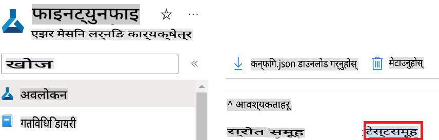

2. Azure Managed Identity नाम थप्न निम्न चरणहरू गर्नुहोस्:

    - तपाईंले सिर्जना गरेको Managed Identities स्रोतमा जानुहोस्।
    - आफ्नो Azure Managed Identity नाम *config.py* फाइलमा कपी गरेर पेस्ट गर्नुहोस्।

    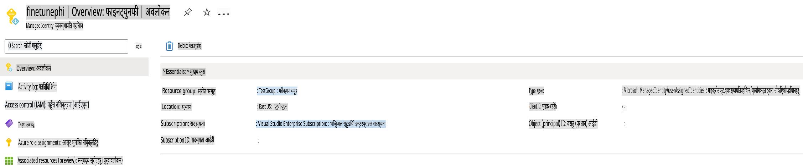

### फाइन-ट्युनिङको लागि डेटासेट तयार गर्नुहोस्

यस अभ्यासमा, तपाईं *download_dataset.py* फाइल चलाएर *ULTRACHAT_200k* डेटासेटहरू आफ्नो स्थानीय वातावरणमा डाउनलोड गर्नुहुनेछ। त्यसपछि, तपाईं यी डेटासेटहरूलाई Azure Machine Learning मा Phi-3 मोडेल फाइन-ट्युन गर्न प्रयोग गर्नुहुनेछ।

#### *download_dataset.py* प्रयोग गरेर आफ्नो डेटासेट डाउनलोड गर्नुहोस्

1. Visual Studio Code मा *download_dataset.py* फाइल खोल्नुहोस्।

1. निम्न कोड *download_dataset.py* मा थप्नुहोस्।

    ```python
    import json
    import os
    from datasets import load_dataset
    from config import (
        TRAIN_DATA_PATH,
        TEST_DATA_PATH)

    def load_and_split_dataset(dataset_name, config_name, split_ratio):
        """
        Load and split a dataset.
        """
        # Load the dataset with the specified name, configuration, and split ratio
        dataset = load_dataset(dataset_name, config_name, split=split_ratio)
        print(f"Original dataset size: {len(dataset)}")
        
        # Split the dataset into train and test sets (80% train, 20% test)
        split_dataset = dataset.train_test_split(test_size=0.2)
        print(f"Train dataset size: {len(split_dataset['train'])}")
        print(f"Test dataset size: {len(split_dataset['test'])}")
        
        return split_dataset

    def save_dataset_to_jsonl(dataset, filepath):
        """
        Save a dataset to a JSONL file.
        """
        # Create the directory if it does not exist
        os.makedirs(os.path.dirname(filepath), exist_ok=True)
        
        # Open the file in write mode
        with open(filepath, 'w', encoding='utf-8') as f:
            # Iterate over each record in the dataset
            for record in dataset:
                # Dump the record as a JSON object and write it to the file
                json.dump(record, f)
                # Write a newline character to separate records
                f.write('\n')
        
        print(f"Dataset saved to {filepath}")

    def main():
        """
        Main function to load, split, and save the dataset.
        """
        # Load and split the ULTRACHAT_200k dataset with a specific configuration and split ratio
        dataset = load_and_split_dataset("HuggingFaceH4/ultrachat_200k", 'default', 'train_sft[:1%]')
        
        # Extract the train and test datasets from the split
        train_dataset = dataset['train']
        test_dataset = dataset['test']

        # Save the train dataset to a JSONL file
        save_dataset_to_jsonl(train_dataset, TRAIN_DATA_PATH)
        
        # Save the test dataset to a separate JSONL file
        save_dataset_to_jsonl(test_dataset, TEST_DATA_PATH)

    if __name__ == "__main__":
        main()

    ```

> [!TIP]
>
> **CPU को साथ न्यूनतम डेटासेट प्रयोग गरेर फाइन-ट्युनिङको लागि सुझाव**
>
> यदि तपाईं CPU प्रयोग गरेर फाइन-ट्युनिङ गर्न चाहनुहुन्छ भने, यो विधि लाभदायक सब्सक्रिप्शन (जस्तै Visual Studio Enterprise Subscription) भएका व्यक्तिहरूका लागि वा फाइन-ट्युनिङ र डिप्लोइमेन्ट प्रक्रिया छिटो परीक्षण गर्न उपयुक्त छ।
>
> `dataset = load_and_split_dataset("HuggingFaceH4/ultrachat_200k", 'default', 'train_sft[:1%]')` with `dataset = load_and_split_dataset("HuggingFaceH4/ultrachat_200k", 'default', 'train_sft[:10]')` प्रतिस्थापन गर्नुहोस्।
>

1. आफ्नो टर्मिनलमा निम्न कमाण्ड टाइप गरेर स्क्रिप्ट चलाउनुहोस् र डेटासेट आफ्नो स्थानीय वातावरणमा डाउनलोड गर्नुहोस्।

    ```console
    python download_data.py
    ```

1. डेटासेटहरू सफलतापूर्वक *finetune-phi/data* डाइरेक्टरीमा सुरक्षित भएको सुनिश्चित गर्नुहोस्।

> [!NOTE]
>
> **डेटासेट आकार र फाइन-ट्युनिङ समय**
>
> यस E2E नमूनामा, तपाईंले केवल 1% डेटासेट (`train_sft[:1%]`) प्रयोग गर्नुहुन्छ। यसले डेटा मात्रा उल्लेखनीय रूपमा घटाउँछ, अपलोड र फाइन-ट्युनिङ प्रक्रियाहरू दुबैलाई छिटो बनाउँछ। तपाईंले प्रशिक्षण समय र मोडेल प्रदर्शनको बीच सही सन्तुलन पत्ता लगाउन प्रतिशत समायोजन गर्न सक्नुहुन्छ। सानो डेटासेट प्रयोग गर्दा फाइन-ट्युनिङ समय घट्छ, जसले E2E नमूनाको लागि प्रक्रिया व्यवस्थापनयोग्य बनाउँछ।

## परिदृश्य २: Phi-3 मोडेल फाइन-ट्युन गर्नुहोस् र Azure Machine Learning Studio मा डिप्लोइ गर्नुहोस्

### Azure CLI सेटअप गर्नुहोस्

तपाईंले Azure CLI सेटअप गरेर आफ्नो वातावरण प्रमाणिकरण गर्नु आवश्यक छ। Azure CLI ले तपाईंलाई कमाण्ड लाइनबाट Azure स्रोतहरू प्रबन्ध गर्न अनुमति दिन्छ र Azure Machine Learning लाई यी स्रोतहरू पहुँच गर्न आवश्यक प्रमाणहरू प्रदान गर्दछ। सुरु गर्न [Azure CLI](https://learn.microsoft.com/cli/azure/install-azure-cli) स्थापना गर्नुहोस्।

1. टर्मिनल विन्डो खोल्नुहोस् र आफ्नो Azure खातामा लगइन गर्न निम्न कमाण्ड टाइप गर्नुहोस्।

    ```console
    az login
    ```

1. प्रयोग गर्न आफ्नो Azure खाता चयन गर्नुहोस्।

1. प्रयोग गर्न आफ्नो Azure सब्सक्रिप्शन चयन गर्नुहोस्।

    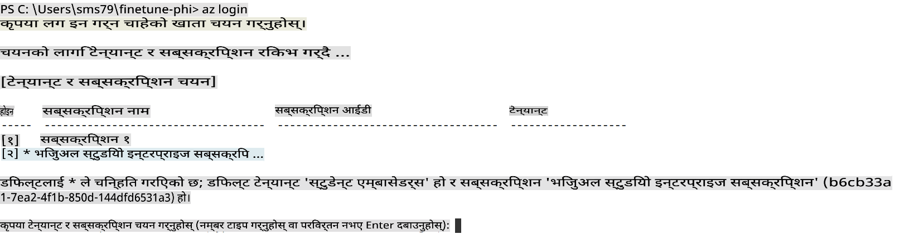

> [!TIP]
>
> यदि तपाईंलाई Azure मा साइन इन गर्न समस्या भइरहेको छ भने, डिभाइस कोड प्रयोग गरेर प्रयास गर्नुहोस्। टर्मिनल विन्डो खोल्नुहोस् र आफ्नो Azure खातामा साइन इन गर्न निम्न कमाण्ड टाइप गर्नुहोस्:
>
> ```console
> az login --use-device-code
> ```
>

### Phi-3 मोडेल फाइन-ट्युन गर्नुहोस्

यस अभ्यासमा, तपाईं प्रदान गरिएको डेटासेट प्रयोग गरेर Phi-3 मोडेल फाइन-ट्युन गर्नुहुनेछ। पहिलो, तपाईं *fine_tune.py* फाइलमा फाइन-ट्युनिङ प्रक्रिया परिभाषित गर्नुहुनेछ। त्यसपछि, तपाईं Azure Machine Learning वातावरण कन्फिगर गर्नुहुनेछ र *setup_ml.py* फाइल चलाएर फाइन-ट्युनिङ प्रक्रिया सुरु गर्नुहुनेछ। यस स्क्रिप्टले Azure Machine Learning वातावरणभित्र फाइन-ट्युनिङ सुनिश्चित गर्दछ।

*setup_ml.py* चलाएर, तपाईंले Azure Machine Learning वातावरणमा फाइन-ट्युनिङ प्रक्रिया सुरु गर्नुहुनेछ।

#### *fine_tune.py* फाइलमा कोड थप्नुहोस्

1. *finetuning_dir* फोल्डरमा जानुहोस् र Visual Studio Code मा *fine_tune.py* फाइल खोल्नुहोस्।

1. निम्न कोड *fine_tune.py* मा थप्नुहोस्।

    ```python
    import argparse
    import sys
    import logging
    import os
    from datasets import load_dataset
    import torch
    import mlflow
    from transformers import AutoModelForCausalLM, AutoTokenizer, TrainingArguments
    from trl import SFTTrainer

    # To avoid the INVALID_PARAMETER_VALUE error in MLflow, disable MLflow integration
    os.environ["DISABLE_MLFLOW_INTEGRATION"] = "True"

    # Logging setup
    logging.basicConfig(
        format="%(asctime)s - %(levelname)s - %(name)s - %(message)s",
        datefmt="%Y-%m-%d %H:%M:%S",
        handlers=[logging.StreamHandler(sys.stdout)],
        level=logging.WARNING
    )
    logger = logging.getLogger(__name__)

    def initialize_model_and_tokenizer(model_name, model_kwargs):
        """
        Initialize the model and tokenizer with the given pretrained model name and arguments.
        """
        model = AutoModelForCausalLM.from_pretrained(model_name, **model_kwargs)
        tokenizer = AutoTokenizer.from_pretrained(model_name)
        tokenizer.model_max_length = 2048
        tokenizer.pad_token = tokenizer.unk_token
        tokenizer.pad_token_id = tokenizer.convert_tokens_to_ids(tokenizer.pad_token)
        tokenizer.padding_side = 'right'
        return model, tokenizer

    def apply_chat_template(example, tokenizer):
        """
        Apply a chat template to tokenize messages in the example.
        """
        messages = example["messages"]
        if messages[0]["role"] != "system":
            messages.insert(0, {"role": "system", "content": ""})
        example["text"] = tokenizer.apply_chat_template(
            messages, tokenize=False, add_generation_prompt=False
        )
        return example

    def load_and_preprocess_data(train_filepath, test_filepath, tokenizer):
        """
        Load and preprocess the dataset.
        """
        train_dataset = load_dataset('json', data_files=train_filepath, split='train')
        test_dataset = load_dataset('json', data_files=test_filepath, split='train')
        column_names = list(train_dataset.features)

        train_dataset = train_dataset.map(
            apply_chat_template,
            fn_kwargs={"tokenizer": tokenizer},
            num_proc=10,
            remove_columns=column_names,
            desc="Applying chat template to train dataset",
        )

        test_dataset = test_dataset.map(
            apply_chat_template,
            fn_kwargs={"tokenizer": tokenizer},
            num_proc=10,
            remove_columns=column_names,
            desc="Applying chat template to test dataset",
        )

        return train_dataset, test_dataset

    def train_and_evaluate_model(train_dataset, test_dataset, model, tokenizer, output_dir):
        """
        Train and evaluate the model.
        """
        training_args = TrainingArguments(
            bf16=True,
            do_eval=True,
            output_dir=output_dir,
            eval_strategy="epoch",
            learning_rate=5.0e-06,
            logging_steps=20,
            lr_scheduler_type="cosine",
            num_train_epochs=3,
            overwrite_output_dir=True,
            per_device_eval_batch_size=4,
            per_device_train_batch_size=4,
            remove_unused_columns=True,
            save_steps=500,
            seed=0,
            gradient_checkpointing=True,
            gradient_accumulation_steps=1,
            warmup_ratio=0.2,
        )

        trainer = SFTTrainer(
            model=model,
            args=training_args,
            train_dataset=train_dataset,
            eval_dataset=test_dataset,
            max_seq_length=2048,
            dataset_text_field="text",
            tokenizer=tokenizer,
            packing=True
        )

        train_result = trainer.train()
        trainer.log_metrics("train", train_result.metrics)

        mlflow.transformers.log_model(
            transformers_model={"model": trainer.model, "tokenizer": tokenizer},
            artifact_path=output_dir,
        )

        tokenizer.padding_side = 'left'
        eval_metrics = trainer.evaluate()
        eval_metrics["eval_samples"] = len(test_dataset)
        trainer.log_metrics("eval", eval_metrics)

    def main(train_file, eval_file, model_output_dir):
        """
        Main function to fine-tune the model.
        """
        model_kwargs = {
            "use_cache": False,
            "trust_remote_code": True,
            "torch_dtype": torch.bfloat16,
            "device_map": None,
            "attn_implementation": "eager"
        }

        # pretrained_model_name = "microsoft/Phi-3-mini-4k-instruct"
        pretrained_model_name = "microsoft/Phi-3.5-mini-instruct"

        with mlflow.start_run():
            model, tokenizer = initialize_model_and_tokenizer(pretrained_model_name, model_kwargs)
            train_dataset, test_dataset = load_and_preprocess_data(train_file, eval_file, tokenizer)
            train_and_evaluate_model(train_dataset, test_dataset, model, tokenizer, model_output_dir)

    if __name__ == "__main__":
        parser = argparse.ArgumentParser()
        parser.add_argument("--train-file", type=str, required=True, help="Path to the training data")
        parser.add_argument("--eval-file", type=str, required=True, help="Path to the evaluation data")
        parser.add_argument("--model_output_dir", type=str, required=True, help="Directory to save the fine-tuned model")
        args = parser.parse_args()
        main(args.train_file, args.eval_file, args.model_output_dir)

    ```

1. *fine_tune.py* फाइल सुरक्षित गरेर बन्द गर्नुहोस्।

> [!TIP]
> **तपाईं Phi-3.5 मोडेल फाइन-ट्युन गर्न सक्नुहुन्छ**
>
> *fine_tune.py* फाइलमा, तपाईं आफ्नो स्क्रिप्टमा `pretrained_model_name` from `"microsoft/Phi-3-mini-4k-instruct"` to any model you want to fine-tune. For example, if you change it to `"microsoft/Phi-3.5-mini-instruct"`, you'll be using the Phi-3.5-mini-instruct model for fine-tuning. To find and use the model name you prefer, visit [Hugging Face](https://huggingface.co/), search for the model you're interested in, and then copy and paste its name into the `pretrained_model_name` फिल्ड परिवर्तन गर्न सक्नुहुन्छ।
>
> :::image type="content" source="../../imgs/03/FineTuning-PromptFlow/finetunephi3.5.png" alt-text="Phi-3.5 फाइन-ट्युन गर्नुहोस्।":::
>

#### *setup_ml.py* फाइलमा कोड थप्नुहोस्

1. Visual Studio Code मा *setup_ml.py* फाइल खोल्नुहोस्।

1. निम्न कोड *setup_ml.py* मा थप्नुहोस्।

    ```python
    import logging
    from azure.ai.ml import MLClient, command, Input
    from azure.ai.ml.entities import Environment, AmlCompute
    from azure.identity import AzureCliCredential
    from config import (
        AZURE_SUBSCRIPTION_ID,
        AZURE_RESOURCE_GROUP_NAME,
        AZURE_ML_WORKSPACE_NAME,
        TRAIN_DATA_PATH,
        TEST_DATA_PATH
    )

    # Constants

    # Uncomment the following lines to use a CPU instance for training
    # COMPUTE_INSTANCE_TYPE = "Standard_E16s_v3" # cpu
    # COMPUTE_NAME = "cpu-e16s-v3"
    # DOCKER_IMAGE_NAME = "mcr.microsoft.com/azureml/openmpi4.1.0-ubuntu20.04:latest"

    # Uncomment the following lines to use a GPU instance for training
    COMPUTE_INSTANCE_TYPE = "Standard_NC24ads_A100_v4"
    COMPUTE_NAME = "gpu-nc24s-a100-v4"
    DOCKER_IMAGE_NAME = "mcr.microsoft.com/azureml/curated/acft-hf-nlp-gpu:59"

    CONDA_FILE = "conda.yml"
    LOCATION = "eastus2" # Replace with the location of your compute cluster
    FINETUNING_DIR = "./finetuning_dir" # Path to the fine-tuning script
    TRAINING_ENV_NAME = "phi-3-training-environment" # Name of the training environment
    MODEL_OUTPUT_DIR = "./model_output" # Path to the model output directory in azure ml

    # Logging setup to track the process
    logger = logging.getLogger(__name__)
    logging.basicConfig(
        format="%(asctime)s - %(levelname)s - %(name)s - %(message)s",
        datefmt="%Y-%m-%d %H:%M:%S",
        level=logging.WARNING
    )

    def get_ml_client():
        """
        Initialize the ML Client using Azure CLI credentials.
        """
        credential = AzureCliCredential()
        return MLClient(credential, AZURE_SUBSCRIPTION_ID, AZURE_RESOURCE_GROUP_NAME, AZURE_ML_WORKSPACE_NAME)

    def create_or_get_environment(ml_client):
        """
        Create or update the training environment in Azure ML.
        """
        env = Environment(
            image=DOCKER_IMAGE_NAME,  # Docker image for the environment
            conda_file=CONDA_FILE,  # Conda environment file
            name=TRAINING_ENV_NAME,  # Name of the environment
        )
        return ml_client.environments.create_or_update(env)

    def create_or_get_compute_cluster(ml_client, compute_name, COMPUTE_INSTANCE_TYPE, location):
        """
        Create or update the compute cluster in Azure ML.
        """
        try:
            compute_cluster = ml_client.compute.get(compute_name)
            logger.info(f"Compute cluster '{compute_name}' already exists. Reusing it for the current run.")
        except Exception:
            logger.info(f"Compute cluster '{compute_name}' does not exist. Creating a new one with size {COMPUTE_INSTANCE_TYPE}.")
            compute_cluster = AmlCompute(
                name=compute_name,
                size=COMPUTE_INSTANCE_TYPE,
                location=location,
                tier="Dedicated",  # Tier of the compute cluster
                min_instances=0,  # Minimum number of instances
                max_instances=1  # Maximum number of instances
            )
            ml_client.compute.begin_create_or_update(compute_cluster).wait()  # Wait for the cluster to be created
        return compute_cluster

    def create_fine_tuning_job(env, compute_name):
        """
        Set up the fine-tuning job in Azure ML.
        """
        return command(
            code=FINETUNING_DIR,  # Path to fine_tune.py
            command=(
                "python fine_tune.py "
                "--train-file ${{inputs.train_file}} "
                "--eval-file ${{inputs.eval_file}} "
                "--model_output_dir ${{inputs.model_output}}"
            ),
            environment=env,  # Training environment
            compute=compute_name,  # Compute cluster to use
            inputs={
                "train_file": Input(type="uri_file", path=TRAIN_DATA_PATH),  # Path to the training data file
                "eval_file": Input(type="uri_file", path=TEST_DATA_PATH),  # Path to the evaluation data file
                "model_output": MODEL_OUTPUT_DIR
            }
        )

    def main():
        """
        Main function to set up and run the fine-tuning job in Azure ML.
        """
        # Initialize ML Client
        ml_client = get_ml_client()

        # Create Environment
        env = create_or_get_environment(ml_client)
        
        # Create or get existing compute cluster
        create_or_get_compute_cluster(ml_client, COMPUTE_NAME, COMPUTE_INSTANCE_TYPE, LOCATION)

        # Create and Submit Fine-Tuning Job
        job = create_fine_tuning_job(env, COMPUTE_NAME)
        returned_job = ml_client.jobs.create_or_update(job)  # Submit the job
        ml_client.jobs.stream(returned_job.name)  # Stream the job logs
        
        # Capture the job name
        job_name = returned_job.name
        print(f"Job name: {job_name}")

    if __name__ == "__main__":
        main()

    ```

1. `COMPUTE_INSTANCE_TYPE`, `COMPUTE_NAME`, and `LOCATION` तपाईंको विशेष विवरणहरूमा प्रतिस्थापन गर्नुहोस्।

    ```python
   # Uncomment the following lines to use a GPU instance for training
    COMPUTE_INSTANCE_TYPE = "Standard_NC24ads_A100_v4"
    COMPUTE_NAME = "gpu-nc24s-a100-v4"
    ...
    LOCATION = "eastus2" # Replace with the location of your compute cluster
    ```

> [!TIP]
>
> **CPU को साथ न्यूनतम डेटासेट प्रयोग गरेर फाइन-ट्युनिङको लागि सुझाव**
>
> यदि तपाईं CPU प्रयोग गरेर फाइन-ट्युनिङ गर्न चाहनुहुन्छ भने, यो विधि लाभदायक सब्सक्रिप्शन भएका व्यक्तिहरूका लागि उपयुक्त छ।
>
> 1. *setup_ml* फाइल खोल्नुहोस्।
> 1. `COMPUTE_INSTANCE_TYPE`, `COMPUTE_NAME`, and `DOCKER_IMAGE_NAME` with the following. If you do not have access to *Standard_E16s_v3*, you can use an equivalent CPU instance or request a new quota.
> 1. Replace `LOCATION` तपाईंको विशेष विवरणहरूमा प्रतिस्थापन गर्नुहोस्।
>
>    ```python
>    # Uncomment the following lines to use a CPU instance for training
>    COMPUTE_INSTANCE_TYPE = "Standard_E16s_v3" # cpu
>    COMPUTE_NAME = "cpu-e16s-v3"
>    DOCKER_IMAGE_NAME = "mcr.microsoft.com/azureml/openmpi4.1.0-ubuntu20.04:latest"
>    LOCATION = "eastus2" # Replace with the location of your compute cluster
>    ```
>

1. *setup_ml.py* स्क्रिप्ट चलाउन निम्न कमाण्ड टाइप गर्नुहोस् र Azure Machine Learning मा फाइन-ट्युनिङ प्रक्रिया सुरु गर्नुहोस्।

    ```python
    python setup_ml.py
    ```

1. यस अभ्यासमा, तपाईंले Azure Machine Learning प्रयोग गरेर Phi-3 मोडेल सफलतापूर्वक फाइन-ट्युन गर्नुभयो। *setup_ml.py* स्क्रिप्ट चलाएर, तपाईंले Azure Machine Learning वातावरण सेट गर्नुभयो र *fine_tune.py* फाइलमा परिभाषित फाइन-ट्युनिङ प्रक्रिया सुरु गर्नुभयो। कृपया ध्यान दिनुहोस् कि फाइन-ट्युनिङ प्रक्रिया समय लाग्न सक्छ। `python setup_ml.py` command, you need to wait for the process to complete. You can monitor the status of the fine-tuning job by following the link provided in the terminal to the Azure Machine Learning portal.

    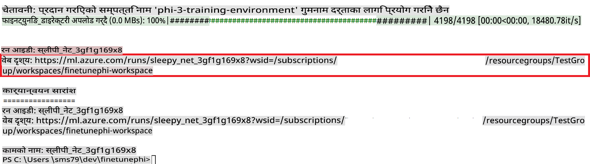

### Deploy the fine-tuned model

To integrate the fine-tuned Phi-3 model with Prompt Flow, you need to deploy the model to make it accessible for real-time inference. This process involves registering the model, creating an online endpoint, and deploying the model.

#### Set the model name, endpoint name, and deployment name for deployment

1. Open *config.py* file.

1. Replace `AZURE_MODEL_NAME = "your_fine_tuned_model_name"` with the desired name for your model.

1. Replace `AZURE_ENDPOINT_NAME = "your_fine_tuned_model_endpoint_name"` with the desired name for your endpoint.

1. Replace `AZURE_DEPLOYMENT_NAME = "your_fine_tuned_model_deployment_name"` तपाईंको डिप्लोइमेन्टको लागि इच्छित नाम प्रयोग गरेर चलाउनुहोस्।

#### *deploy_model.py* फाइलमा कोड थप्नुहोस्

*deploy_model.py* फाइल चलाउँदा सम्पूर्ण डिप्लोइमेन्ट प्रक्रिया स्वचालित हुन्छ। यसले मोडेल दर्ता गर्दछ, एउटा एन्डप्वाइन्ट सिर्जना गर्दछ, र *config.py* फाइलमा निर्दिष्ट सेटिङहरूमा आधारित डिप्लोइमेन्ट कार्यान्वयन गर्दछ।

1. Visual Studio Code मा *deploy_model.py* फाइल खोल्नुहोस्।

1. निम्न कोड *deploy_model.py* मा थप्नुहोस्।

    ```python
    import logging
    from azure.identity import AzureCliCredential
    from azure.ai.ml import MLClient
    from azure.ai.ml.entities import Model, ProbeSettings, ManagedOnlineEndpoint, ManagedOnlineDeployment, IdentityConfiguration, ManagedIdentityConfiguration, OnlineRequestSettings
    from azure.ai.ml.constants import AssetTypes

    # Configuration imports
    from config import (
        AZURE_SUBSCRIPTION_ID,
        AZURE_RESOURCE_GROUP_NAME,
        AZURE_ML_WORKSPACE_NAME,
        AZURE_MANAGED_IDENTITY_RESOURCE_ID,
        AZURE_MANAGED_IDENTITY_CLIENT_ID,
        AZURE_MODEL_NAME,
        AZURE_ENDPOINT_NAME,
        AZURE_DEPLOYMENT_NAME
    )

    # Constants
    JOB_NAME = "your-job-name"
    COMPUTE_INSTANCE_TYPE = "Standard_E4s_v3"

    deployment_env_vars = {
        "SUBSCRIPTION_ID": AZURE_SUBSCRIPTION_ID,
        "RESOURCE_GROUP_NAME": AZURE_RESOURCE_GROUP_NAME,
        "UAI_CLIENT_ID": AZURE_MANAGED_IDENTITY_CLIENT_ID,
    }

    # Logging setup
    logging.basicConfig(
        format="%(asctime)s - %(levelname)s - %(name)s - %(message)s",
        datefmt="%Y-%m-%d %H:%M:%S",
        level=logging.DEBUG
    )
    logger = logging.getLogger(__name__)

    def get_ml_client():
        """Initialize and return the ML Client."""
        credential = AzureCliCredential()
        return MLClient(credential, AZURE_SUBSCRIPTION_ID, AZURE_RESOURCE_GROUP_NAME, AZURE_ML_WORKSPACE_NAME)

    def register_model(ml_client, model_name, job_name):
        """Register a new model."""
        model_path = f"azureml://jobs/{job_name}/outputs/artifacts/paths/model_output"
        logger.info(f"Registering model {model_name} from job {job_name} at path {model_path}.")
        run_model = Model(
            path=model_path,
            name=model_name,
            description="Model created from run.",
            type=AssetTypes.MLFLOW_MODEL,
        )
        model = ml_client.models.create_or_update(run_model)
        logger.info(f"Registered model ID: {model.id}")
        return model

    def delete_existing_endpoint(ml_client, endpoint_name):
        """Delete existing endpoint if it exists."""
        try:
            endpoint_result = ml_client.online_endpoints.get(name=endpoint_name)
            logger.info(f"Deleting existing endpoint {endpoint_name}.")
            ml_client.online_endpoints.begin_delete(name=endpoint_name).result()
            logger.info(f"Deleted existing endpoint {endpoint_name}.")
        except Exception as e:
            logger.info(f"No existing endpoint {endpoint_name} found to delete: {e}")

    def create_or_update_endpoint(ml_client, endpoint_name, description=""):
        """Create or update an endpoint."""
        delete_existing_endpoint(ml_client, endpoint_name)
        logger.info(f"Creating new endpoint {endpoint_name}.")
        endpoint = ManagedOnlineEndpoint(
            name=endpoint_name,
            description=description,
            identity=IdentityConfiguration(
                type="user_assigned",
                user_assigned_identities=[ManagedIdentityConfiguration(resource_id=AZURE_MANAGED_IDENTITY_RESOURCE_ID)]
            )
        )
        endpoint_result = ml_client.online_endpoints.begin_create_or_update(endpoint).result()
        logger.info(f"Created new endpoint {endpoint_name}.")
        return endpoint_result

    def create_or_update_deployment(ml_client, endpoint_name, deployment_name, model):
        """Create or update a deployment."""

        logger.info(f"Creating deployment {deployment_name} for endpoint {endpoint_name}.")
        deployment = ManagedOnlineDeployment(
            name=deployment_name,
            endpoint_name=endpoint_name,
            model=model.id,
            instance_type=COMPUTE_INSTANCE_TYPE,
            instance_count=1,
            environment_variables=deployment_env_vars,
            request_settings=OnlineRequestSettings(
                max_concurrent_requests_per_instance=3,
                request_timeout_ms=180000,
                max_queue_wait_ms=120000
            ),
            liveness_probe=ProbeSettings(
                failure_threshold=30,
                success_threshold=1,
                period=100,
                initial_delay=500,
            ),
            readiness_probe=ProbeSettings(
                failure_threshold=30,
                success_threshold=1,
                period=100,
                initial_delay=500,
            ),
        )
        deployment_result = ml_client.online_deployments.begin_create_or_update(deployment).result()
        logger.info(f"Created deployment {deployment.name} for endpoint {endpoint_name}.")
        return deployment_result

    def set_traffic_to_deployment(ml_client, endpoint_name, deployment_name):
        """Set traffic to the specified deployment."""
        try:
            # Fetch the current endpoint details
            endpoint = ml_client.online_endpoints.get(name=endpoint_name)
            
            # Log the current traffic allocation for debugging
            logger.info(f"Current traffic allocation: {endpoint.traffic}")
            
            # Set the traffic allocation for the deployment
            endpoint.traffic = {deployment_name: 100}
            
            # Update the endpoint with the new traffic allocation
            endpoint_poller = ml_client.online_endpoints.begin_create_or_update(endpoint)
            updated_endpoint = endpoint_poller.result()
            
            # Log the updated traffic allocation for debugging
            logger.info(f"Updated traffic allocation: {updated_endpoint.traffic}")
            logger.info(f"Set traffic to deployment {deployment_name} at endpoint {endpoint_name}.")
            return updated_endpoint
        except Exception as e:
            # Log any errors that occur during the process
            logger.error(f"Failed to set traffic to deployment: {e}")
            raise


    def main():
        ml_client = get_ml_client()

        registered_model = register_model(ml_client, AZURE_MODEL_NAME, JOB_NAME)
        logger.info(f"Registered model ID: {registered_model.id}")

        endpoint = create_or_update_endpoint(ml_client, AZURE_ENDPOINT_NAME, "Endpoint for finetuned Phi-3 model")
        logger.info(f"Endpoint {AZURE_ENDPOINT_NAME} is ready.")

        try:
            deployment = create_or_update_deployment(ml_client, AZURE_ENDPOINT_NAME, AZURE_DEPLOYMENT_NAME, registered_model)
            logger.info(f"Deployment {AZURE_DEPLOYMENT_NAME} is created for endpoint {AZURE_ENDPOINT_NAME}.")

            set_traffic_to_deployment(ml_client, AZURE_ENDPOINT_NAME, AZURE_DEPLOYMENT_NAME)
            logger.info(f"Traffic is set to deployment {AZURE_DEPLOYMENT_NAME} at endpoint {AZURE_ENDPOINT_NAME}.")
        except Exception as e:
            logger.error(f"Failed to create or update deployment: {e}")

    if __name__ == "__main__":
        main()

    ```

1. `JOB_NAME`:

    - Navigate to Azure Machine Learning resource that you created.
    - Select **Studio web URL** to open the Azure Machine Learning workspace.
    - Select **Jobs** from the left side tab.
    - Select the experiment for fine-tuning. For example, *finetunephi*.
    - Select the job that you created.
    - Copy and paste your job Name into the `JOB_NAME = "your-job-name"` in *deploy_model.py* file.

1. Replace `COMPUTE_INSTANCE_TYPE` तपाईंको विशेष विवरणहरूमा प्रतिस्थापन गर्नुहोस्।

1. *deploy_model.py* स्क्रिप्ट चलाउन निम्न कमाण्ड टाइप गर्नुहोस् र Azure Machine Learning मा डिप्लोइमेन्ट प्रक्रिया सुरु गर्नुहोस्।

    ```python
    python deploy_model.py
    ```

> [!WARNING]
> तपाईंको खातामा थप शुल्क लाग्न नदिन, Azure Machine Learning कार्यक्षेत्रमा सिर्जना गरिएको एन्डप्वाइन्ट मेटाउन निश्चित गर्नुहोस्।
>

#### Azure Machine Learning Workspace मा डिप्लोइमेन्ट स्थिति जाँच गर्नुहोस्

1. [Azure ML Studio](https://ml.azure.com/home?wt.mc_id=studentamb_279723) भ्रमण गर्नुहोस्।

1. तपाईंले सिर्जना गरेको Azure Machine Learning कार्यक्षेत्रमा जानुहोस्।

1. **Studio web URL** चयन गर्नुहोस् र Azure Machine Learning कार्यक्षेत्र खोल्नुहोस्।

1. बाँयापट्टिको ट्याबबाट **Endpoints** चयन गर्नुहोस्।

    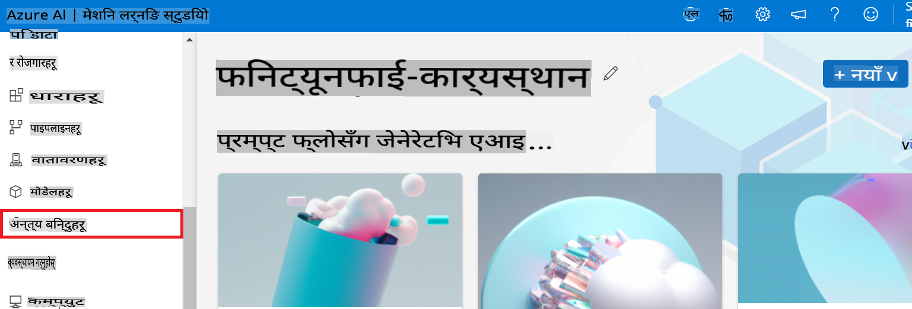

2. तपाईंले सिर्जना गरेको एन्डप्वाइन्ट चयन गर्नुहोस्।

    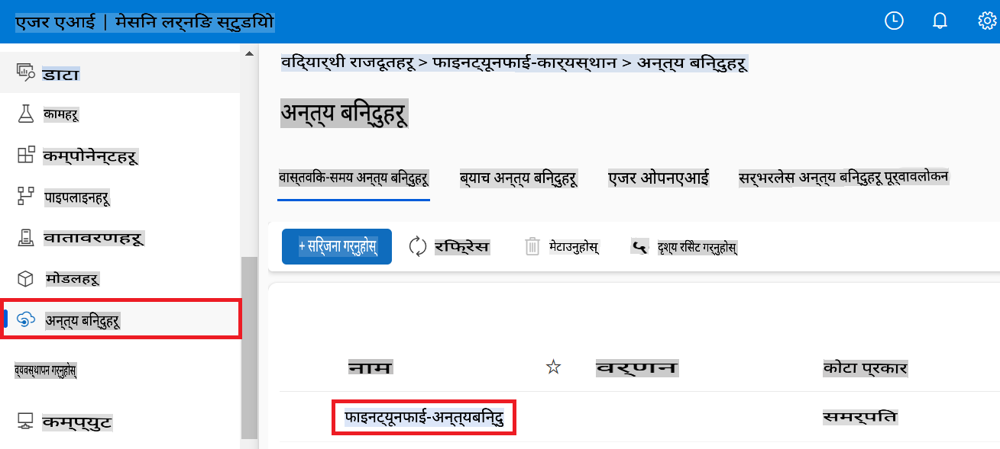

3. यस पृष्ठमा, तपाईं डिप्लोइमेन्ट प्रक्रियाको क्रममा सिर्जना गरिएका एन्डप्वाइन्टहरू व्यवस्थापन गर्न सक्नुहुन्छ।

## परिदृश्य ३: Prompt flow संग एकीकृत गर्नुहोस् र आफ्नो कस्टम मोडेलसँग कुराकानी गर्नुहोस्

### कस्टम Phi-3 मोडेललाई Prompt flow सँग एकीकृत गर्नुहोस्

तपाईंको फाइन-ट्युन गरिएको मोडेल सफलतापूर्वक डिप्लोइ गरेपछि, अब तपाईं यसलाई Prompt flow सँग एकीकृत गर्न सक्नुहुन्छ। यसले तपाईंलाई वास्तविक-समय अनुप्रयोगहरूमा आफ्नो मोडेल प्रयोग गर्न सक्षम बनाउँछ, जसले तपाईंको कस्टम Phi-3 मोडेलसँग अन्तरक्रियात्मक कार्यहरूको विविधता प्रदान गर्दछ।

#### फाइन-ट्युन गरिएको Phi-3 मोडेलको एपीआई कुञ्जी र एन्डप्वाइन्ट URI सेट गर्नुहोस्

1. तपाईंले सिर्जना गरेको Azure Machine Learning कार्यक्षेत्रमा जानुहोस्।
1. बाँयापट्टिको ट्याबबाट **Endpoints** चयन गर्नुहोस्।
1. तपाईंले सिर्जना गरेको एन्डप्वाइन्ट चयन गर्नुहोस्।
1. नेभिगेसन मेनुबाट **Consume** चयन गर्नुहोस्।
1. आफ्नो **REST endpoint** कपी गरेर *config.py* फाइलमा पेस्ट गर्नुहोस्, `AZURE_ML_ENDPOINT = "your_fine_tuned_model_endpoint_uri"` with your **REST endpoint**.
1. Copy and paste your **Primary key** into the *config.py* file, replacing `AZURE_ML_API_KEY = "your_fine_tuned_model_api_key"` लाई आफ्नो **Primary key** सँग प्रतिस्थापन गर्दै।

    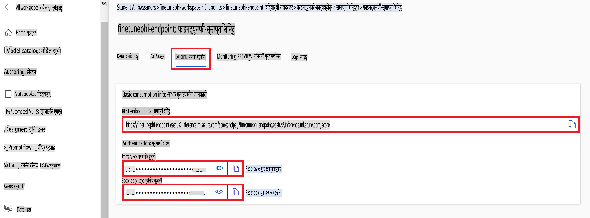

#### *flow.dag.yml* फाइलमा कोड थप्नुहोस्

1. Visual Studio Code मा *flow.dag.yml* फाइल खोल्नुहोस्।

1. निम्न कोड *flow.dag.yml* मा थप्नुहोस्।

    ```yml
    inputs:
      input_data:
        type: string
        default: "Who founded Microsoft?"

    outputs:
      answer:
        type: string
        reference: ${integrate_with_promptflow.output}

    nodes:
    - name: integrate_with_promptflow
      type: python
      source:
        type: code
        path: integrate_with_promptflow.py
      inputs:
        input_data: ${inputs.input_data}
    ```

#### *integrate_with_promptflow.py* फाइलमा कोड थप्नुहोस्

1. Visual Studio Code मा *integrate_with_promptflow.py* फाइल खोल्नुहोस्।

1. निम्न कोड *integrate_with_promptflow.py* मा थप्नुहोस्।

    ```python
    import logging
    import requests
    from promptflow.core import tool
    import asyncio
    import platform
    from config import (
        AZURE_ML_ENDPOINT,
        AZURE_ML_API_KEY
    )

    # Logging setup
    logging.basicConfig(
        format="%(asctime)s - %(levelname)s - %(name)s - %(message)s",
        datefmt="%Y-%m-%d %H:%M:%S",
        level=logging.DEBUG
    )
    logger = logging.getLogger(__name__)

    def query_azml_endpoint(input_data: list, endpoint_url: str, api_key: str) -> str:
        """
        Send a request to the Azure ML endpoint with the given input data.
        """
        headers = {
            "Content-Type": "application/json",
            "Authorization": f"Bearer {api_key}"
        }
        data = {
            "input_data": [input_data],
            "params": {
                "temperature": 0.7,
                "max_new_tokens": 128,
                "do_sample": True,
                "return_full_text": True
            }
        }
        try:
            response = requests.post(endpoint_url, json=data, headers=headers)
            response.raise_for_status()
            result = response.json()[0]
            logger.info("Successfully received response from Azure ML Endpoint.")
            return result
        except requests.exceptions.RequestException as e:
            logger.error(f"Error querying Azure ML Endpoint: {e}")
            raise

    def setup_asyncio_policy():
        """
        Setup asyncio event loop policy for Windows.
        """
        if platform.system() == 'Windows':
            asyncio.set_event_loop_policy(asyncio.WindowsSelectorEventLoopPolicy())
            logger.info("Set Windows asyncio event loop policy.")

    @tool
    def my_python_tool(input_data: str) -> str:
        """
        Tool function to process input data and query the Azure ML endpoint.
        """
        setup_asyncio_policy()
        return query_azml_endpoint(input_data, AZURE_ML_ENDPOINT, AZURE_ML_API_KEY)

    ```

### आफ्नो कस्टम मोडेलसँग कुराकानी गर्नुहोस्

1. *deploy_model.py* स्क्रिप्ट चलाउन निम्न कमाण्ड टाइप गर्नुहोस् र Azure Machine Learning मा डिप्लोइमेन्ट प्रक्रिया सुरु गर्नुहोस्।

    ```python
    pf flow serve --source ./ --port 8080 --host localhost
    ```

1. यहाँ परिणामहरूको उदाहरण छ: अब तपाईं आफ्नो कस्टम Phi-3 मोडेलसँग कुराकानी गर्न सक्नुहुन्छ। फाइन-ट्युनिङको लागि प्रयोग गरिएको डेटा आधारमा प्रश्न सोध्न सिफारिस गरिन्छ।

    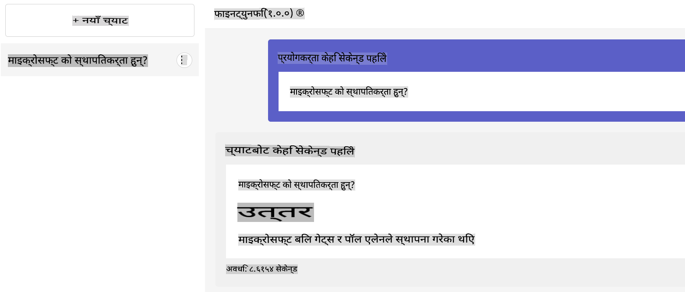

**अस्वीकरण**:  
यो दस्तावेज़ मेसिन-आधारित एआई अनुवाद सेवाहरू प्रयोग गरेर अनुवाद गरिएको हो। यद्यपि हामी शुद्धताको लागि प्रयास गर्छौं, कृपया जानकार रहनुहोस् कि स्वचालित अनुवादहरूमा त्रुटिहरू वा अशुद्धताहरू हुन सक्छन्। यसको मूल भाषामा रहेको मूल दस्तावेज़लाई प्राधिकृत स्रोत मानिनुपर्छ। महत्वपूर्ण जानकारीका लागि, व्यावसायिक मानव अनुवाद सिफारिस गरिन्छ। यस अनुवादको प्रयोगबाट उत्पन्न हुने कुनै पनि गलतफहमी वा गलत व्याख्याको लागि हामी उत्तरदायी हुने छैनौं।