# Azure AI Foundry मा Prompt Flow सँग कस्टम Phi-3 मोडेलहरूलाई फाइन-ट्यून र इन्टिग्रेट गर्नुहोस्

यो एन्ड-टु-एन्ड (E2E) उदाहरण "[Fine-Tune and Integrate Custom Phi-3 Models with Prompt Flow in Azure AI Foundry](https://techcommunity.microsoft.com/t5/educator-developer-blog/fine-tune-and-integrate-custom-phi-3-models-with-prompt-flow-in/ba-p/4191726?WT.mc_id=aiml-137032-kinfeylo)" बाट आधारित छ, जुन Microsoft Tech Community मा प्रकाशित छ। यसले Azure AI Foundry मा Prompt Flow सँग कस्टम Phi-3 मोडेलहरूलाई फाइन-ट्यून, डिप्लोय र इन्टिग्रेट गर्ने प्रक्रिया प्रस्तुत गर्दछ।  
पहिलेको उदाहरण "[Fine-Tune and Integrate Custom Phi-3 Models with Prompt Flow](./E2E_Phi-3-FineTuning_PromptFlow_Integration.md)" मा कोड स्थानीय रूपमा चलाउने कुरा समावेश गरिएको थियो, तर यो ट्युटोरियल Azure AI / ML Studio भित्र मोडेल फाइन-ट्यून र इन्टिग्रेट गर्न मात्र केन्द्रित छ।

## अवलोकन

यस E2E उदाहरणमा, तपाईंले Phi-3 मोडेललाई फाइन-ट्यून गर्न र Azure AI Foundry मा Prompt Flow सँग इन्टिग्रेट गर्न सिक्नुहुनेछ। Azure AI / ML Studio को प्रयोग गरेर, तपाईं कस्टम AI मोडेलहरू डिप्लोय गर्न र प्रयोग गर्नको लागि वर्कफ्लो स्थापना गर्नुहुनेछ। यो उदाहरण तीन परिदृश्यहरूमा विभाजित छ:

**परिदृश्य 1: Azure स्रोतहरू सेटअप गर्नुहोस् र फाइन-ट्यूनिङको तयारी गर्नुहोस्।**

**परिदृश्य 2: Phi-3 मोडेललाई फाइन-ट्यून गर्नुहोस् र Azure Machine Learning Studio मा डिप्लोय गर्नुहोस्।**

**परिदृश्य 3: Prompt Flow सँग इन्टिग्रेट गर्नुहोस् र Azure AI Foundry मा आफ्नो कस्टम मोडेलसँग संवाद गर्नुहोस्।**

यो E2E उदाहरणको अवलोकन यहाँ छ।

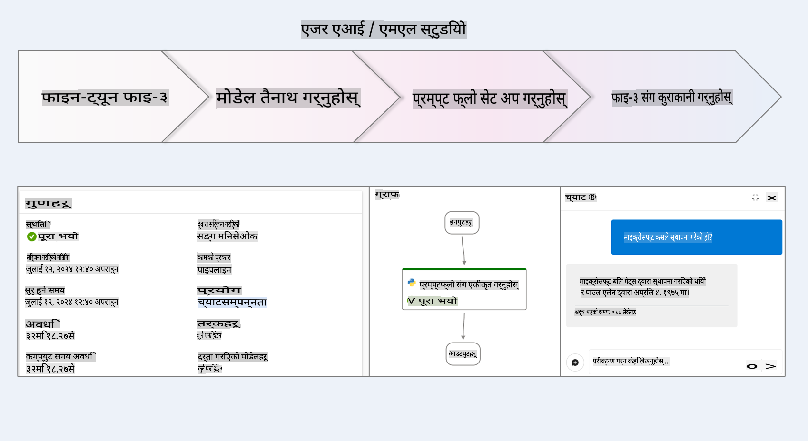

### विषय सूची

1. **[परिदृश्य 1: Azure स्रोतहरू सेटअप गर्नुहोस् र फाइन-ट्यूनिङको तयारी गर्नुहोस्](../../../../../../md/02.Application/01.TextAndChat/Phi3)**  
    - [Azure Machine Learning Workspace सिर्जना गर्नुहोस्](../../../../../../md/02.Application/01.TextAndChat/Phi3)  
    - [Azure Subscription मा GPU कोटा अनुरोध गर्नुहोस्](../../../../../../md/02.Application/01.TextAndChat/Phi3)  
    - [रोल असाइनमेन्ट थप्नुहोस्](../../../../../../md/02.Application/01.TextAndChat/Phi3)  
    - [प्रोजेक्ट सेटअप गर्नुहोस्](../../../../../../md/02.Application/01.TextAndChat/Phi3)  
    - [फाइन-ट्यूनिङको लागि डेटासेट तयार गर्नुहोस्](../../../../../../md/02.Application/01.TextAndChat/Phi3)

1. **[परिदृश्य 2: Phi-3 मोडेललाई फाइन-ट्यून गर्नुहोस् र Azure Machine Learning Studio मा डिप्लोय गर्नुहोस्](../../../../../../md/02.Application/01.TextAndChat/Phi3)**  
    - [Phi-3 मोडेललाई फाइन-ट्यून गर्नुहोस्](../../../../../../md/02.Application/01.TextAndChat/Phi3)  
    - [फाइन-ट्यून गरिएको Phi-3 मोडेललाई डिप्लोय गर्नुहोस्](../../../../../../md/02.Application/01.TextAndChat/Phi3)

1. **[परिदृश्य 3: Prompt Flow सँग इन्टिग्रेट गर्नुहोस् र Azure AI Foundry मा आफ्नो कस्टम मोडेलसँग संवाद गर्नुहोस्](../../../../../../md/02.Application/01.TextAndChat/Phi3)**  
    - [कस्टम Phi-3 मोडेललाई Prompt Flow सँग इन्टिग्रेट गर्नुहोस्](../../../../../../md/02.Application/01.TextAndChat/Phi3)  
    - [आफ्नो कस्टम Phi-3 मोडेलसँग संवाद गर्नुहोस्](../../../../../../md/02.Application/01.TextAndChat/Phi3)

## परिदृश्य 1: Azure स्रोतहरू सेटअप गर्नुहोस् र फाइन-ट्यूनिङको तयारी गर्नुहोस्

### Azure Machine Learning Workspace सिर्जना गर्नुहोस्

1. पोर्टल पृष्ठको माथिल्लो **सर्च बार** मा *azure machine learning* टाइप गर्नुहोस् र देखापर्ने विकल्पहरूबाट **Azure Machine Learning** चयन गर्नुहोस्।  

    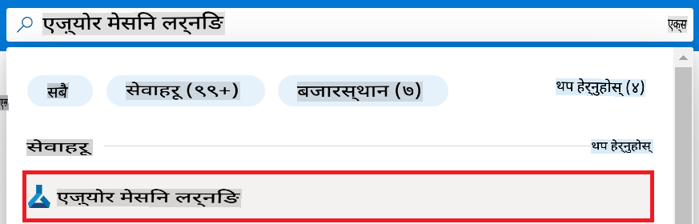

2. नेभिगेसन मेनुबाट **+ Create** चयन गर्नुहोस्।  

3. नेभिगेसन मेनुबाट **New workspace** चयन गर्नुहोस्।  

    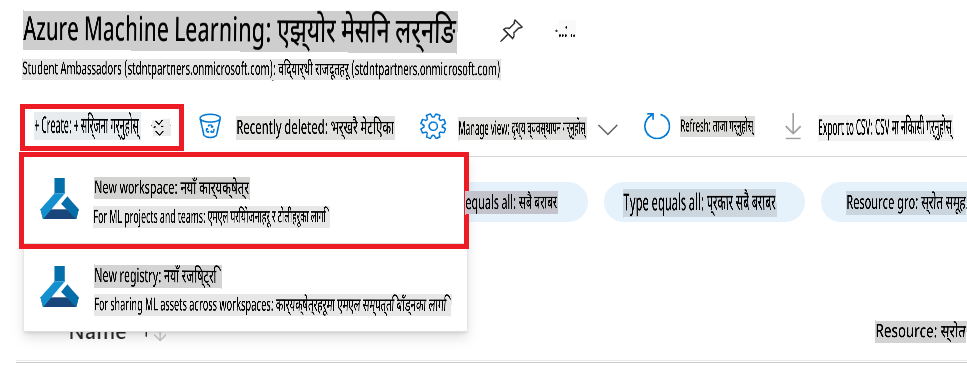

4. निम्न कार्यहरू गर्नुहोस्:  

    - तपाईंको Azure **Subscription** चयन गर्नुहोस्।  
    - प्रयोग गर्नको लागि **Resource group** चयन गर्नुहोस् (आवश्यक भए नयाँ सिर्जना गर्नुहोस्)।  
    - **Workspace Name** प्रविष्ट गर्नुहोस्। यो अद्वितीय हुनुपर्छ।  
    - तपाईंले प्रयोग गर्न चाहनुभएको **Region** चयन गर्नुहोस्।  
    - **Storage account** चयन गर्नुहोस् (आवश्यक भए नयाँ सिर्जना गर्नुहोस्)।  
    - **Key vault** चयन गर्नुहोस् (आवश्यक भए नयाँ सिर्जना गर्नुहोस्)।  
    - **Application insights** चयन गर्नुहोस् (आवश्यक भए नयाँ सिर्जना गर्नुहोस्)।  
    - **Container registry** चयन गर्नुहोस् (आवश्यक भए नयाँ सिर्जना गर्नुहोस्)।  

    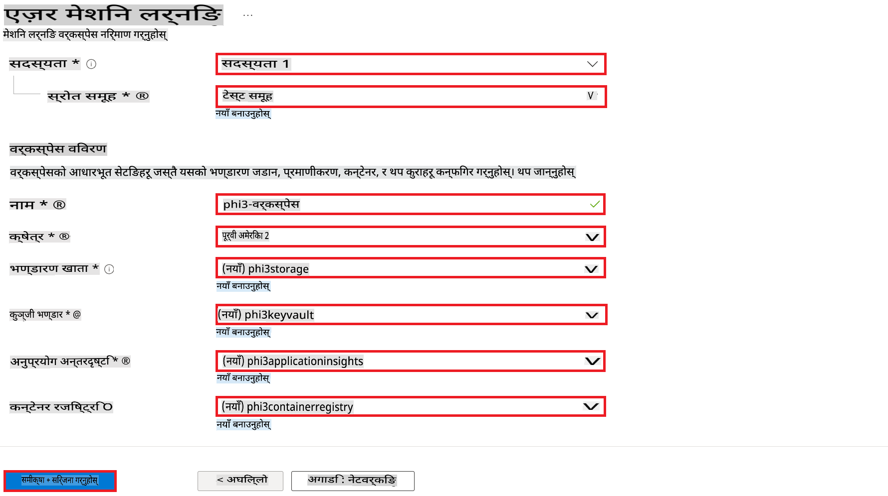

5. **Review + Create** चयन गर्नुहोस्।  

6. **Create** चयन गर्नुहोस्।  

### Azure Subscription मा GPU कोटा अनुरोध गर्नुहोस्

यस ट्युटोरियलमा, तपाईं GPU प्रयोग गरेर Phi-3 मोडेललाई फाइन-ट्यून र डिप्लोय गर्नुहुनेछ। फाइन-ट्यूनिङका लागि, तपाईंले *Standard_NC24ads_A100_v4* GPU प्रयोग गर्नुहुनेछ, जसका लागि कोटा अनुरोध आवश्यक छ। डिप्लोयमेन्टका लागि, तपाईंले *Standard_NC6s_v3* GPU प्रयोग गर्नुहुनेछ, जसका लागि पनि कोटा अनुरोध आवश्यक छ।

> [!NOTE]
>  
> GPU कोटा केवल Pay-As-You-Go सब्स्क्रिप्शनहरू (मानक सब्स्क्रिप्शन प्रकार) मा उपलब्ध छ; लाभ सब्स्क्रिप्शनहरू हाल समर्थित छैनन्।  

1. [Azure ML Studio](https://ml.azure.com/home?wt.mc_id=studentamb_279723) भ्रमण गर्नुहोस्।  

1. *Standard NCADSA100v4 Family* कोटा अनुरोध गर्न निम्न कार्यहरू गर्नुहोस्:  

    - बायाँपट्टि रहेको ट्याबबाट **Quota** चयन गर्नुहोस्।  
    - प्रयोग गर्नको लागि **Virtual machine family** चयन गर्नुहोस्। उदाहरणका लागि, **Standard NCADSA100v4 Family Cluster Dedicated vCPUs** चयन गर्नुहोस्, जसमा *Standard_NC24ads_A100_v4* GPU समावेश छ।  
    - नेभिगेसन मेनुबाट **Request quota** चयन गर्नुहोस्।  

        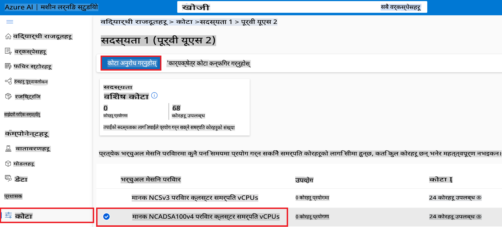

    - Request quota पृष्ठमा, तपाईंले प्रयोग गर्न चाहनुभएको **New cores limit** प्रविष्ट गर्नुहोस्। उदाहरणका लागि, 24।  
    - Request quota पृष्ठमा, GPU कोटा अनुरोध गर्न **Submit** चयन गर्नुहोस्।  

1. *Standard NCSv3 Family* कोटा अनुरोध गर्न निम्न कार्यहरू गर्नुहोस्:  

    - बायाँपट्टि रहेको ट्याबबाट **Quota** चयन गर्नुहोस्।  
    - प्रयोग गर्नको लागि **Virtual machine family** चयन गर्नुहोस्। उदाहरणका लागि, **Standard NCSv3 Family Cluster Dedicated vCPUs** चयन गर्नुहोस्, जसमा *Standard_NC6s_v3* GPU समावेश छ।  
    - नेभिगेसन मेनुबाट **Request quota** चयन गर्नुहोस्।  
    - Request quota पृष्ठमा, तपाईंले प्रयोग गर्न चाहनुभएको **New cores limit** प्रविष्ट गर्नुहोस्। उदाहरणका लागि, 24।  
    - Request quota पृष्ठमा, GPU कोटा अनुरोध गर्न **Submit** चयन गर्नुहोस्।  

### रोल असाइनमेन्ट थप्नुहोस्

तपाईंको मोडेललाई फाइन-ट्यून र डिप्लोय गर्नको लागि, तपाईंले User Assigned Managed Identity (UAI) सिर्जना गर्नुपर्छ र यसलाई उपयुक्त अनुमति दिनुपर्छ। यो UAI डिप्लोयमेन्टको क्रममा प्रमाणिकरणको लागि प्रयोग हुनेछ।  

#### User Assigned Managed Identity (UAI) सिर्जना गर्नुहोस्

1. पोर्टल पृष्ठको माथिल्लो **सर्च बार** मा *managed identities* टाइप गर्नुहोस् र देखापर्ने विकल्पहरूबाट **Managed Identities** चयन गर्नुहोस्।  

    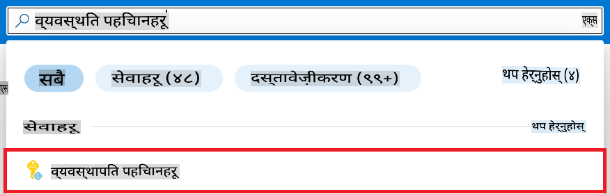

1. **+ Create** चयन गर्नुहोस्।  

    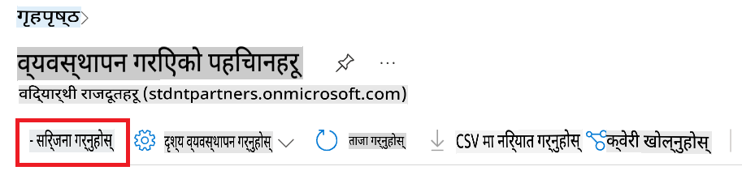

1. निम्न कार्यहरू गर्नुहोस्:  

    - तपाईंको Azure **Subscription** चयन गर्नुहोस्।  
    - प्रयोग गर्नको लागि **Resource group** चयन गर्नुहोस् (आवश्यक भए नयाँ सिर्जना गर्नुहोस्)।  
    - तपाईंले प्रयोग गर्न चाहनुभएको **Region** चयन गर्नुहोस्।  
    - **Name** प्रविष्ट गर्नुहोस्। यो अद्वितीय हुनुपर्छ।  

    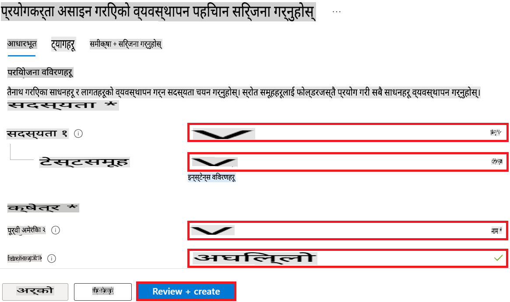

1. **Review + create** चयन गर्नुहोस्।  

1. **+ Create** चयन गर्नुहोस्।  

#### Managed Identity मा Contributor रोल असाइनमेन्ट थप्नुहोस्

1. तपाईंले सिर्जना गर्नुभएको Managed Identity स्रोतमा जानुहोस्।  

1. बायाँपट्टि रहेको ट्याबबाट **Azure role assignments** चयन गर्नुहोस्।  

1. नेभिगेसन मेनुबाट **+Add role assignment** चयन गर्नुहोस्।  

1. Add role assignment पृष्ठमा, निम्न कार्यहरू गर्नुहोस्:  
    - **Scope** लाई **Resource group** मा सेट गर्नुहोस्।  
    - तपाईंको Azure **Subscription** चयन गर्नुहोस्।  
    - प्रयोग गर्नको लागि **Resource group** चयन गर्नुहोस्।  
    - **Role** लाई **Contributor** मा सेट गर्नुहोस्।  

    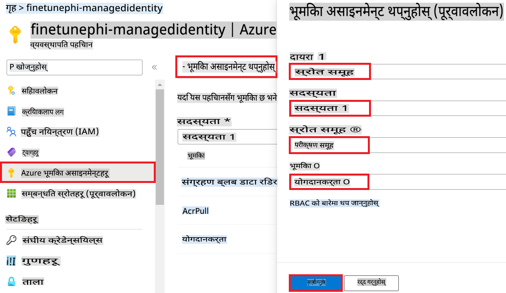

2. **Save** चयन गर्नुहोस्।  

#### Managed Identity मा Storage Blob Data Reader रोल असाइनमेन्ट थप्नुहोस्

1. पोर्टल पृष्ठको माथिल्लो **सर्च बार** मा *storage accounts* टाइप गर्नुहोस् र देखापर्ने विकल्पहरूबाट **Storage accounts** चयन गर्नुहोस्।  

    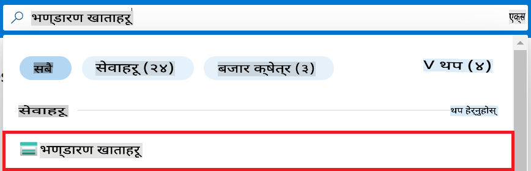

1. Azure Machine Learning Workspace सँग सम्बन्धित स्टोरेज अकाउन्ट चयन गर्नुहोस्। उदाहरणका लागि, *finetunephistorage*।  

1. Add role assignment पृष्ठमा जानका लागि निम्न कार्यहरू गर्नुहोस्:  

    - तपाईंले सिर्जना गर्नुभएको Azure Storage अकाउन्टमा जानुहोस्।  
    - बायाँपट्टि रहेको ट्याबबाट **Access Control (IAM)** चयन गर्नुहोस्।  
    - नेभिगेसन मेनुबाट **+ Add** चयन गर्नुहोस्।  
    - नेभिगेसन मेनुबाट **Add role assignment** चयन गर्नुहोस्।  

    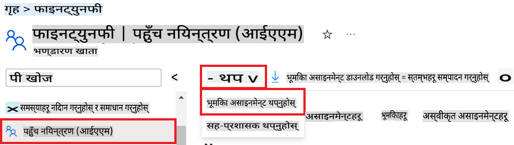

1. Add role assignment पृष्ठमा, निम्न कार्यहरू गर्नुहोस्:  

    - **Role** पृष्ठमा, **Storage Blob Data Reader** टाइप गर्नुहोस् र देखापर्ने विकल्पहरूबाट **Storage Blob Data Reader** चयन गर्नुहोस्।  
    - **Role** पृष्ठमा, **Next** चयन गर्नुहोस्।  
    - **Members** पृष्ठमा, **Assign access to** लाई **Managed identity** मा सेट गर्नुहोस्।  
    - **Members** पृष्ठमा, **+ Select members** चयन गर्नुहोस्।  
    - Select managed identities पृष्ठमा, तपाईंको Azure **Subscription** चयन गर्नुहोस्।  
    - Select managed identities पृष्ठमा, **Managed identity** लाई **Manage Identity** मा सेट गर्नुहोस्।  
    - Select managed identities पृष्ठमा, तपाईंले सिर्जना गर्नुभएको Managed Identity चयन गर्नुहोस्। उदाहरणका लागि, *finetunephi-managedidentity*।  
    - Select managed identities पृष्ठमा, **Select** चयन गर्नुहोस्।  

    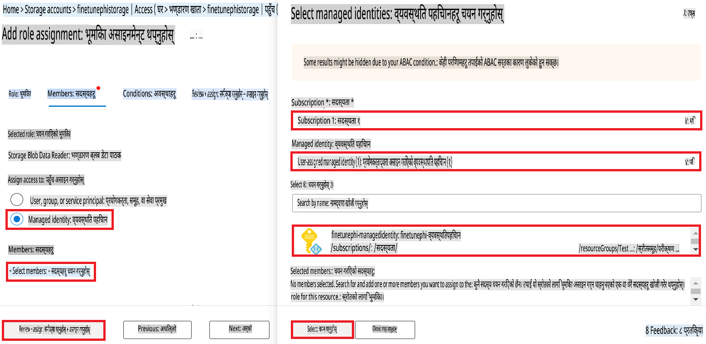

1. **Review + assign** चयन गर्नुहोस्।  

#### Managed Identity मा AcrPull रोल असाइनमेन्ट थप्नुहोस्

1. पोर्टल पृष्ठको माथिल्लो **सर्च बार** मा *container registries* टाइप गर्नुहोस् र देखापर्ने विकल्पहरूबाट **Container registries** चयन गर्नुहोस्।  

    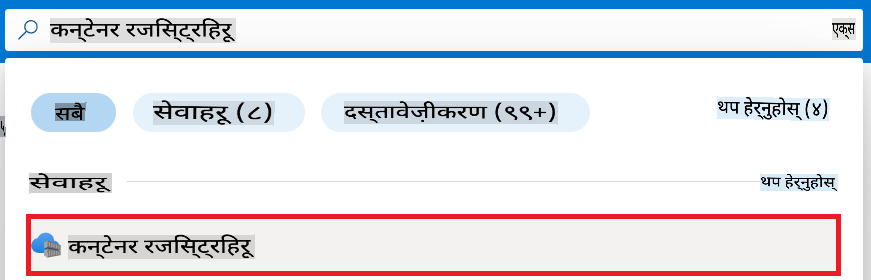

1. Azure Machine Learning Workspace सँग सम्बन्धित कन्टेनर रजिस्ट्री चयन गर्नुहोस्। उदाहरणका लागि, *finetunephicontainerregistry*।  

1. Add role assignment पृष्ठमा जानका लागि निम्न कार्यहरू गर्नुहोस्:  

    - बायाँपट्टि रहेको ट्याबबाट **Access Control (IAM)** चयन गर्नुहोस्।  
    - नेभिगेसन मेनुबाट **+ Add** चयन गर्नुहोस्।  
    - नेभिगेसन मेनुबाट **Add role assignment** चयन गर्नुहोस्।  

1. Add role assignment पृष्ठमा, निम्न कार्यहरू गर्नुहोस्:  

    - **Role** पृष्ठमा, **AcrPull** टाइप गर्नुहोस् र देखापर्ने विकल्पहरूबाट **AcrPull** चयन गर्नुहोस्।  
    - **Role** पृष्ठमा, **Next** चयन गर्नुहोस्।  
    - **Members** पृष्ठमा, **Assign access to** लाई **Managed identity** मा सेट गर्नुहोस्।  
    - **Members** पृष्ठमा, **+ Select members** चयन गर्नुहोस्।  
    - Select managed identities पृष्ठमा, तपाईंको Azure **Subscription** चयन गर्नुहोस्।  
    - Select managed identities पृष्ठमा, **Managed identity** लाई **Manage Identity** मा सेट गर्नुहोस्।  
    - Select managed identities पृष्ठमा, तपाईंले सिर्जना गर्नुभएको Managed Identity चयन गर्नुहोस्। उदाहरणका लागि, *finetunephi-managedidentity*।  
    - Select managed identities पृष्ठमा, **Select** चयन गर्नुहोस्।  
    - **Review + assign** चयन गर्नुहोस्।  

### प्रोजेक्ट सेटअप गर्नुहोस्

फाइन-ट्यूनिङका लागि आवश्यक डेटासेट डाउनलोड गर्न, तपाईंले स्थानीय वातावरण सेटअप गर्नुहुनेछ।  

यस अभ्यासमा, तपाईंले निम्न कार्यहरू गर्नुहुनेछ:  

- काम गर्नको लागि एउटा फोल्डर सिर्जना गर्नुहोस्।  
- एउटा भर्चुअल वातावरण सिर्जना गर्नुहोस्।  
- आवश्यक प्याकेजहरू इन्स्टल गर्नुहोस्।  
- डेटासेट डाउनलोड गर्न *download_dataset.py* फाइल बनाउनुहोस्।  

#### काम गर्नको लागि फोल्डर सिर्जना गर्नुहोस्

1. टर्मिनल विन्डो खोल्नुहोस् र *finetune-phi* नामको फोल्डर सिर्जना गर्न निम्न कमाण्ड टाइप गर्नुहोस्।  

    ```console
    mkdir finetune-phi
    ```

2. सिर्जना गरिएको *finetune-phi* फोल्डरमा जान निम्न कमाण्ड टाइप गर्नुहोस्।  

    ```console
    cd finetune-phi
    ```

#### भर्चुअल वातावरण सिर्जना गर्नुहोस्

1. *.venv* नामको भर्चुअल वातावरण सिर्जना गर्न निम्न कमाण्ड टाइप गर्नुहोस्।  

    ```console
    python -m venv .venv
    ```

2. भर्चुअल वातावरण सक्रिय गर्न निम्न कमाण्ड टाइप गर्नुहोस्।  

    ```console
    .venv\Scripts\activate.bat
    ```

> [!NOTE]  
> यदि यो सफल भयो भने, तपाईंले कमाण्ड प्रम्प्टअघि *(.venv)* देख्नुहुनेछ।  

#### आवश्यक प्याकेजहरू इन्स्टल गर्नुहोस्

1. आवश्यक प्याकेजहरू इन्स्टल गर्न निम्न कमाण्डहरू टाइप गर्नुहोस्।  

    ```console
    pip install datasets==2.19.1
    ```

#### `download_dataset.py` फाइल सिर्जना गर्नुहोस्

> [!NOTE]  
> पूर्ण फोल्डर संरचना:  
>  
> ```text
> └── YourUserName
> .    └── finetune-phi
> .        └── download_dataset.py
> ```

1. **Visual Studio Code** खोल्नुहोस्।  

1. मेनु बारबाट **File** चयन गर्नुहोस्।  

1. **Open Folder** चयन गर्नुहोस्।  

1. तपाईंले सिर्जना गर्नुभएको *finetune-phi* फोल्डर चयन गर्नुहोस्, जुन *C:\Users\yourUserName\finetune-phi* मा अवस्थित छ।  

    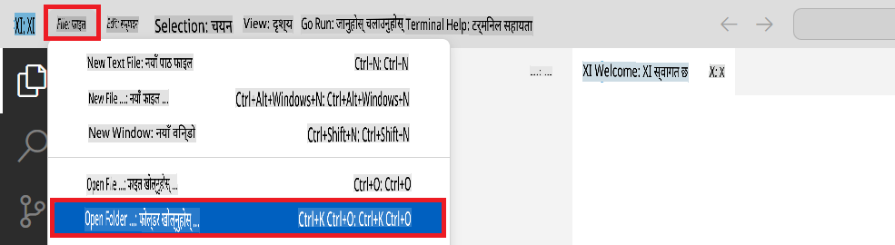

1. Visual Studio Code को बाँया प्यानलमा राइट-क्लिक गरेर **New File** चयन गर्नुहोस् र *download_dataset.py* नामको नयाँ फाइल सिर्जना गर्नुहोस्।  

     मा जानुहोस्।

1. बायाँपट्टि रहेको ट्याबबाट **Compute** चयन गर्नुहोस्।

1. नेभिगेसन मेनुबाट **Compute clusters** चयन गर्नुहोस्।

1. **+ New** चयन गर्नुहोस्।

    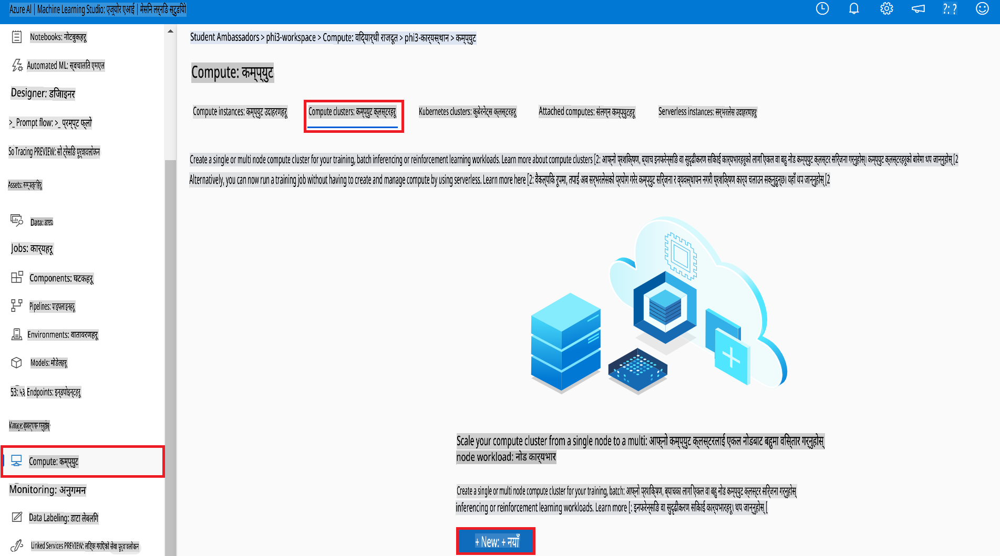

1. तलका कार्यहरू गर्नुहोस्:

    - तपाईँले प्रयोग गर्न चाहनुभएको **Region** चयन गर्नुहोस्।
    - **Virtual machine tier** लाई **Dedicated** मा चयन गर्नुहोस्।
    - **Virtual machine type** लाई **GPU** मा चयन गर्नुहोस्।
    - **Virtual machine size** फिल्टरलाई **Select from all options** मा सेट गर्नुहोस्।
    - **Virtual machine size** लाई **Standard_NC24ads_A100_v4** मा चयन गर्नुहोस्।

    

1. **Next** चयन गर्नुहोस्।

1. तलका कार्यहरू गर्नुहोस्:

    - **Compute name** प्रविष्ट गर्नुहोस्। यो अनौठो मान हुनुपर्छ।
    - **Minimum number of nodes** लाई **0** मा सेट गर्नुहोस्।
    - **Maximum number of nodes** लाई **1** मा सेट गर्नुहोस्।
    - **Idle seconds before scale down** लाई **120** मा सेट गर्नुहोस्।

    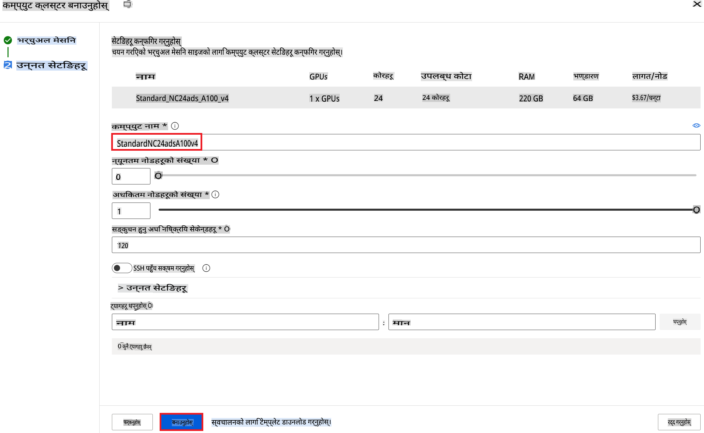

1. **Create** चयन गर्नुहोस्।

#### Phi-3 मोडेललाई फाइन-ट्यून गर्नुहोस्

1. [Azure ML Studio](https://ml.azure.com/home?wt.mc_id=studentamb_279723) मा जानुहोस्।

1. तपाईँले सिर्जना गर्नुभएको Azure Machine Learning workspace चयन गर्नुहोस्।

    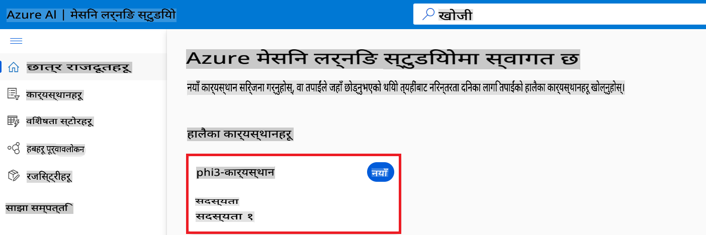

1. तलका कार्यहरू गर्नुहोस्:

    - बायाँपट्टि रहेको ट्याबबाट **Model catalog** चयन गर्नुहोस्।
    - **Search bar** मा *phi-3-mini-4k* टाइप गर्नुहोस् र देखिएका विकल्पहरूबाट **Phi-3-mini-4k-instruct** चयन गर्नुहोस्।

    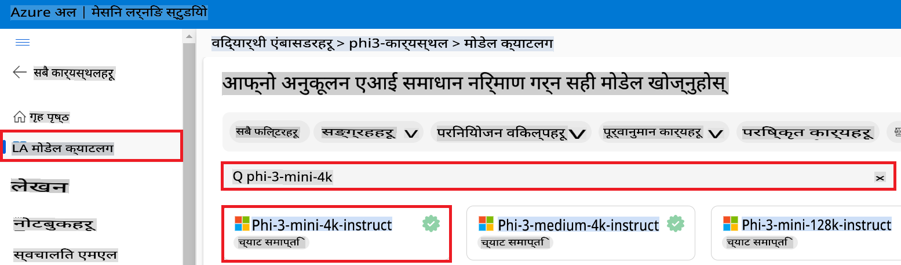

1. नेभिगेसन मेनुबाट **Fine-tune** चयन गर्नुहोस्।

    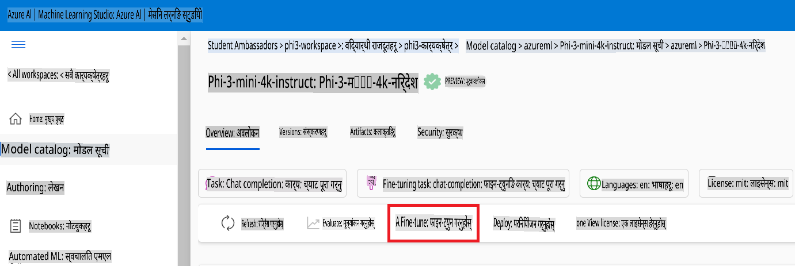

1. तलका कार्यहरू गर्नुहोस्:

    - **Select task type** लाई **Chat completion** मा चयन गर्नुहोस्।
    - **+ Select data** चयन गरी **Training data** अपलोड गर्नुहोस्।
    - Validation data अपलोड प्रकारलाई **Provide different validation data** मा चयन गर्नुहोस्।
    - **+ Select data** चयन गरी **Validation data** अपलोड गर्नुहोस्।

    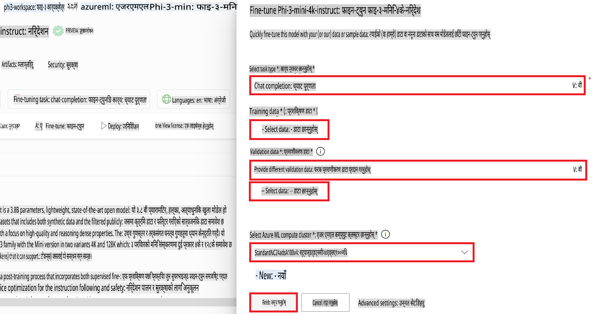

    > [!TIP]
    >
    > तपाईँले **Advanced settings** चयन गरी **learning_rate** र **lr_scheduler_type** जस्ता कन्फिगरेसनहरू अनुकूलन गर्न सक्नुहुन्छ, जसले तपाईँको फाइन-ट्यूनिंग प्रक्रिया विशेष आवश्यकताहरू अनुसार अनुकूलित गर्न मद्दत गर्दछ।

1. **Finish** चयन गर्नुहोस्।

1. यस अभ्यासमा, तपाईँले Azure Machine Learning प्रयोग गरेर Phi-3 मोडेललाई सफलतापूर्वक फाइन-ट्यून गर्नुभयो। कृपया ध्यान दिनुहोस् कि फाइन-ट्यूनिंग प्रक्रिया सम्पन्न हुन धेरै समय लाग्न सक्छ। फाइन-ट्यूनिंग जॉब चलाएपछि, यो पूरा हुने प्रतिक्षा गर्नुहोस्। तपाईँले आफ्नो Azure Machine Learning Workspace को बायाँपट्टि रहेको Jobs ट्याबमा गएर फाइन-ट्यूनिंग जॉबको स्थिति अनुगमन गर्न सक्नुहुन्छ। अर्को शृङ्खलामा, तपाईँले फाइन-ट्यून गरिएको मोडेललाई डिप्लोय गर्नेछ र यसलाई Prompt flow सँग एकीकृत गर्नेछ।

    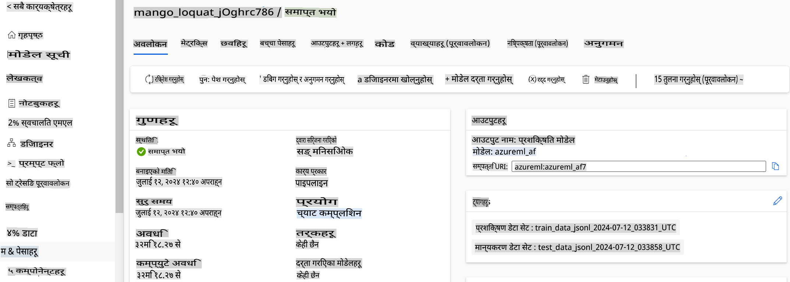

### फाइन-ट्यून गरिएको Phi-3 मोडेल डिप्लोय गर्नुहोस्

फाइन-ट्यून गरिएको Phi-3 मोडेललाई Prompt flow सँग एकीकृत गर्न, तपाईँले मोडेललाई वास्तविक-समयमा इनफरेन्सको लागि पहुँचयोग्य बनाउन डिप्लोय गर्न आवश्यक छ। यस प्रक्रियामा मोडेललाई रजिस्टर गर्ने, अनलाइन एन्डपोइन्ट सिर्जना गर्ने, र मोडेल डिप्लोय गर्ने समावेश छ।

यस अभ्यासमा, तपाईँले:

- Azure Machine Learning workspace मा फाइन-ट्यून गरिएको मोडेललाई रजिस्टर गर्नुहोस्।
- अनलाइन एन्डपोइन्ट सिर्जना गर्नुहोस्।
- रजिस्टर गरिएको फाइन-ट्यून गरिएको Phi-3 मोडेललाई डिप्लोय गर्नुहोस्।

#### फाइन-ट्यून गरिएको मोडेल रजिस्टर गर्नुहोस्

1. [Azure ML Studio](https://ml.azure.com/home?wt.mc_id=studentamb_279723) मा जानुहोस्।

1. तपाईँले सिर्जना गर्नुभएको Azure Machine Learning workspace चयन गर्नुहोस्।

    

1. बायाँपट्टि रहेको ट्याबबाट **Models** चयन गर्नुहोस्।
1. **+ Register** चयन गर्नुहोस्।
1. **From a job output** चयन गर्नुहोस्।

    

1. तपाईँले सिर्जना गर्नुभएको जॉब चयन गर्नुहोस्।

    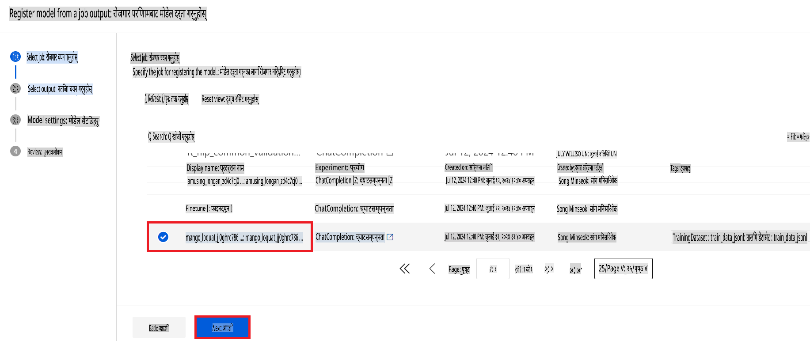

1. **Next** चयन गर्नुहोस्।

1. **Model type** लाई **MLflow** मा चयन गर्नुहोस्।

1. सुनिश्चित गर्नुहोस् कि **Job output** चयन गरिएको छ; यो स्वचालित रूपमा चयन गरिएको हुनुपर्छ।

    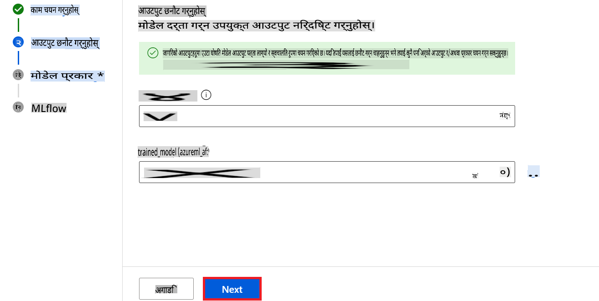

2. **Next** चयन गर्नुहोस्।

3. **Register** चयन गर्नुहोस्।

    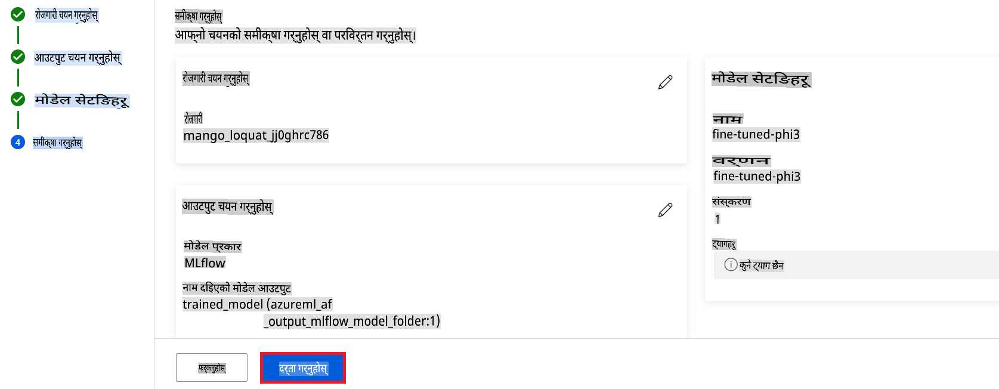

4. बायाँपट्टि रहेको ट्याबबाट **Models** मेनुमा गएर तपाईँले रजिस्टर गर्नुभएको मोडेल हेर्न सक्नुहुन्छ।

    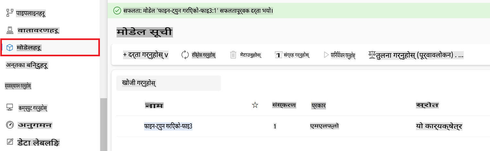

#### फाइन-ट्यून गरिएको मोडेल डिप्लोय गर्नुहोस्

1. तपाईँले सिर्जना गर्नुभएको Azure Machine Learning workspace मा जानुहोस्।

1. बायाँपट्टि रहेको ट्याबबाट **Endpoints** चयन गर्नुहोस्।

1. नेभिगेसन मेनुबाट **Real-time endpoints** चयन गर्नुहोस्।

    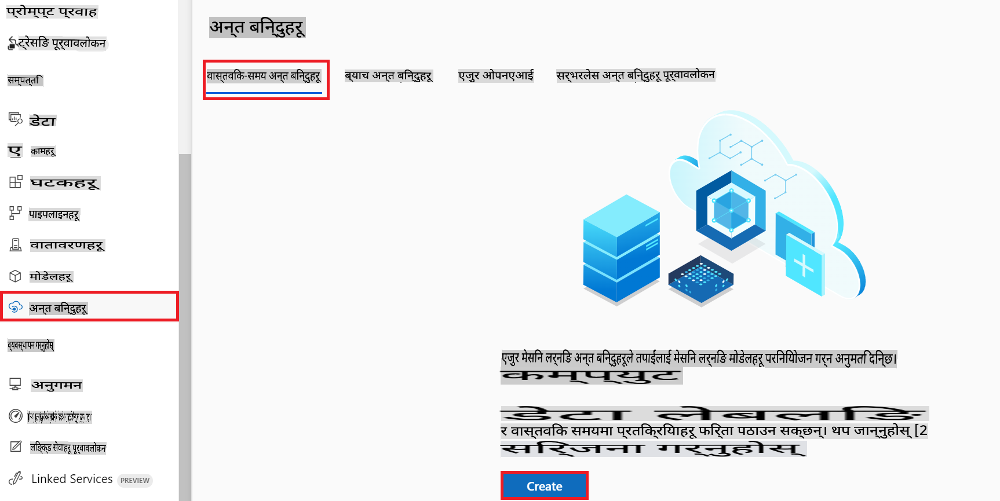

1. **Create** चयन गर्नुहोस्।

1. तपाईँले रजिस्टर गर्नुभएको मोडेल चयन गर्नुहोस्।

    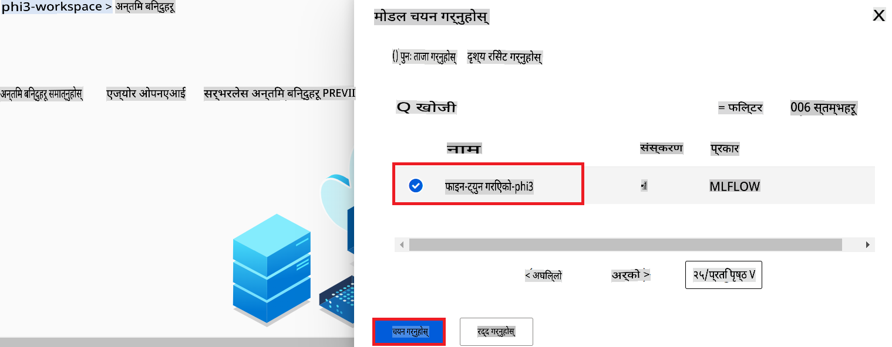

1. **Select** चयन गर्नुहोस्।

1. तलका कार्यहरू गर्नुहोस्:

    - **Virtual machine** लाई *Standard_NC6s_v3* मा चयन गर्नुहोस्।
    - तपाईँले प्रयोग गर्न चाहनुभएको **Instance count** चयन गर्नुहोस्। उदाहरणका लागि, *1*।
    - **Endpoint** लाई **New** मा चयन गरी नयाँ एन्डपोइन्ट सिर्जना गर्नुहोस्।
    - **Endpoint name** प्रविष्ट गर्नुहोस्। यो अनौठो मान हुनुपर्छ।
    - **Deployment name** प्रविष्ट गर्नुहोस्। यो अनौठो मान हुनुपर्छ।

    

1. **Deploy** चयन गर्नुहोस्।

> [!WARNING]
> तपाईँको खातामा अतिरिक्त शुल्क नआओस् भन्नका लागि, Azure Machine Learning workspace मा सिर्जना गरिएको एन्डपोइन्ट डिलिट गर्न निश्चित गर्नुहोस्।
>

#### Azure Machine Learning Workspace मा डिप्लोयमेन्ट स्थिति जाँच गर्नुहोस्

1. तपाईँले सिर्जना गर्नुभएको Azure Machine Learning workspace मा जानुहोस्।

1. बायाँपट्टि रहेको ट्याबबाट **Endpoints** चयन गर्नुहोस्।

1. तपाईँले सिर्जना गर्नुभएको एन्डपोइन्ट चयन गर्नुहोस्।

    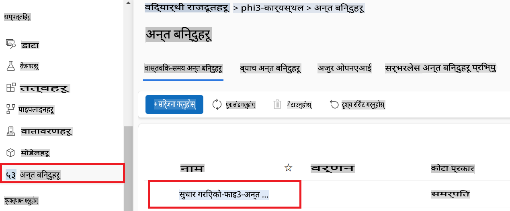

1. यस पृष्ठमा, तपाईँले डिप्लोयमेन्ट प्रक्रियाको क्रममा एन्डपोइन्टहरू व्यवस्थापन गर्न सक्नुहुन्छ।

> [!NOTE]
> डिप्लोयमेन्ट पूरा भएपछि, सुनिश्चित गर्नुहोस् कि **Live traffic** लाई **100%** मा सेट गरिएको छ। यदि यो छैन भने, **Update traffic** चयन गरी ट्राफिक सेटिङ समायोजन गर्नुहोस्। ध्यान दिनुहोस् कि यदि ट्राफिक 0% मा सेट गरिएको छ भने तपाईँले मोडेल परीक्षण गर्न सक्नुहुन्न।
>
> 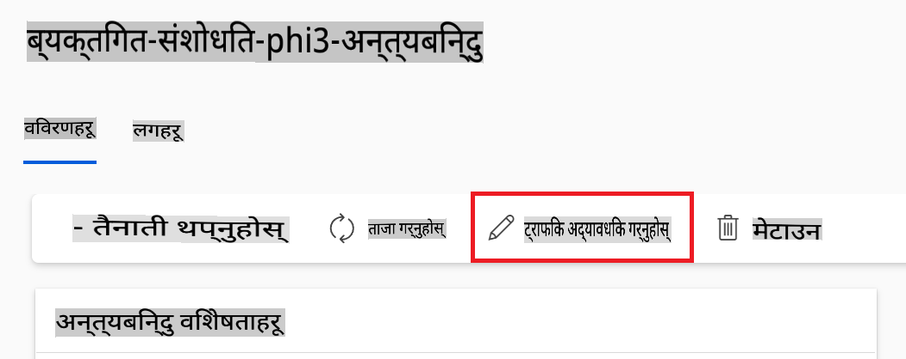
>

## परिदृश्य 3: Prompt flow सँग एकीकृत गर्नुहोस् र Azure AI Foundry मा तपाईँको कस्टम मोडेलसँग च्याट गर्नुहोस्

### कस्टम Phi-3 मोडेललाई Prompt flow सँग एकीकृत गर्नुहोस्

तपाईँको फाइन-ट्यून गरिएको मोडेल सफलतापूर्वक डिप्लोय गरेपछि, अब तपाईँले यसलाई Prompt Flow सँग एकीकृत गर्न सक्नुहुन्छ। यसले तपाईँको कस्टम Phi-3 मोडेललाई वास्तविक-समय अनुप्रयोगहरूमा प्रयोग गर्न सक्षम बनाउँछ, जसले विभिन्न प्रकारका इन्टरएक्टिभ कार्यहरू सम्भव बनाउँछ।

यस अभ्यासमा, तपाईँले:

- Azure AI Foundry Hub सिर्जना गर्नुहोस्।
- Azure AI Foundry Project सिर्जना गर्नुहोस्।
- Prompt flow सिर्जना गर्नुहोस्।
- फाइन-ट्यून गरिएको Phi-3 मोडेलको लागि कस्टम कनेक्शन थप्नुहोस्।
- Prompt flow सेटअप गरी तपाईँको कस्टम Phi-3 मोडेलसँग च्याट गर्नुहोस्।

> [!NOTE]
> तपाईँ Azure ML Studio प्रयोग गरी पनि Promptflow सँग एकीकृत गर्न सक्नुहुन्छ। यही एकीकरण प्रक्रिया Azure ML Studio मा पनि लागू गर्न सकिन्छ।

#### Azure AI Foundry Hub सिर्जना गर्नुहोस्

तपाईँले Project सिर्जना गर्नु अघि Hub सिर्जना गर्नु आवश्यक छ। Hub एक Resource Group जस्तै कार्य गर्दछ, जसले Azure AI Foundry भित्र धेरै Projects व्यवस्थित र व्यवस्थापन गर्न अनुमति दिन्छ।

1. [Azure AI Foundry](https://ai.azure.com/?WT.mc_id=aiml-137032-kinfeylo) मा जानुहोस्।

1. बायाँपट्टि रहेको ट्याबबाट **All hubs** चयन गर्नुहोस्।

1. नेभिगेसन मेनुबाट **+ New hub** चयन गर्नुहोस्।

    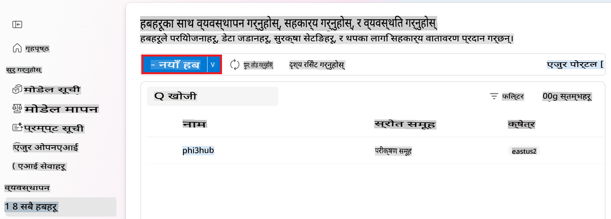

1. तलका कार्यहरू गर्नुहोस्:

    - **Hub name** प्रविष्ट गर्नुहोस्। यो अनौठो मान हुनुपर्छ।
    - तपाईँको Azure **Subscription** चयन गर्नुहोस्।
    - प्रयोग गर्न चाहनुभएको **Resource group** चयन गर्नुहोस् (आवश्यक परेमा नयाँ सिर्जना गर्नुहोस्)।
    - तपाईँले प्रयोग गर्न चाहनुभएको **Location** चयन गर्नुहोस्।
    - प्रयोग गर्न चाहनुभएको **Connect Azure AI Services** चयन गर्नुहोस् (आवश्यक परेमा नयाँ सिर्जना गर्नुहोस्)।
    - **Connect Azure AI Search** लाई **Skip connecting** मा चयन गर्नुहोस्।

    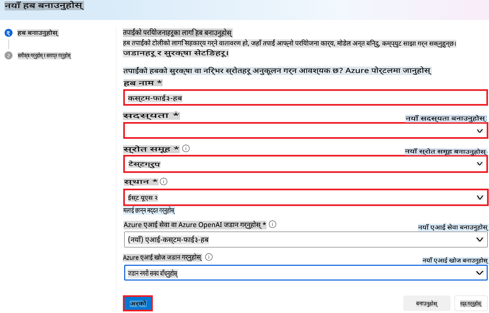

1. **Next** चयन गर्नुहोस्।

#### Azure AI Foundry Project सिर्जना गर्नुहोस्

1. तपाईँले सिर्जना गर्नुभएको Hub मा, बायाँपट्टि रहेको ट्याबबाट **All projects** चयन गर्नुहोस्।

1. नेभिगेसन मेनुबाट **+ New project** चयन गर्नुहोस्।

    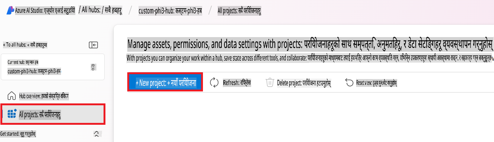

1. **Project name** प्रविष्ट गर्नुहोस्। यो अनौठो मान हुनुपर्छ।

    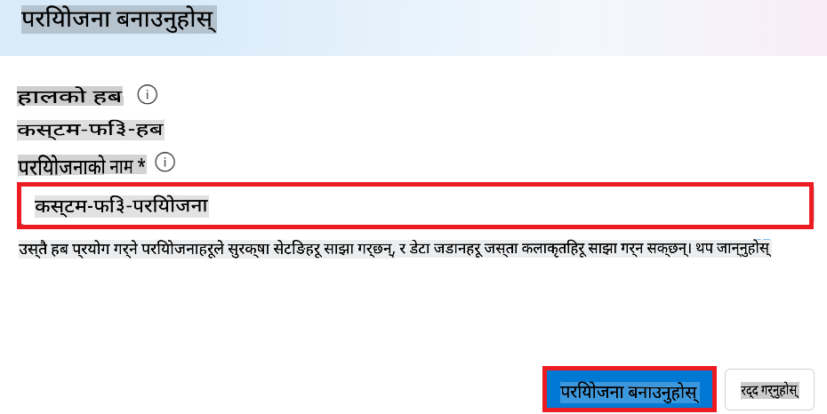

1. **Create a project** चयन गर्नुहोस्।

#### फाइन-ट्यून गरिएको Phi-3 मोडेलको लागि कस्टम कनेक्शन थप्नुहोस्

तपाईँको कस्टम Phi-3 मोडेललाई Prompt flow सँग एकीकृत गर्न, तपाईँले मोडेलको एन्डपोइन्ट र कीलाई कस्टम कनेक्शनमा सुरक्षित गर्न आवश्यक छ। यस सेटअपले Prompt flow मा तपाईँको कस्टम Phi-3 मोडेलको पहुँच सुनिश्चित गर्दछ।

#### फाइन-ट्यून गरिएको Phi-3 मोडेलको एपीआई की र एन्डपोइन्ट युआरआई सेट गर्नुहोस्

1. [Azure ML Studio](https://ml.azure.com/home?WT.mc_id=aiml-137032-kinfeylo) मा जानुहोस्।

1. तपाईँले सिर्जना गर्नुभएको Azure Machine Learning workspace मा जानुहोस्।

1. बायाँपट्टि रहेको ट्याबबाट **Endpoints** चयन गर्नुहोस्।

    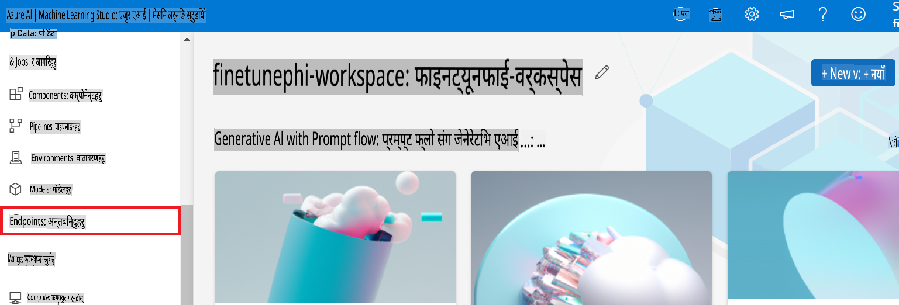

1. तपाईँले सिर्जना गर्नुभएको एन्डपोइन्ट चयन गर्नुहोस्।

    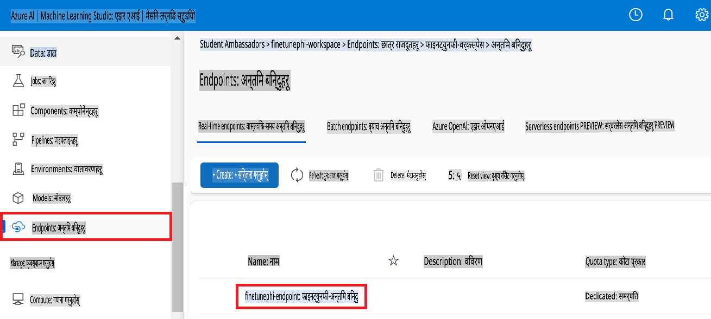

1. नेभिगेसन मेनुबाट **Consume** चयन गर्नुहोस्।

1. आफ्नो **REST endpoint** र **Primary key** प्रतिलिपि गर्नुहोस्।
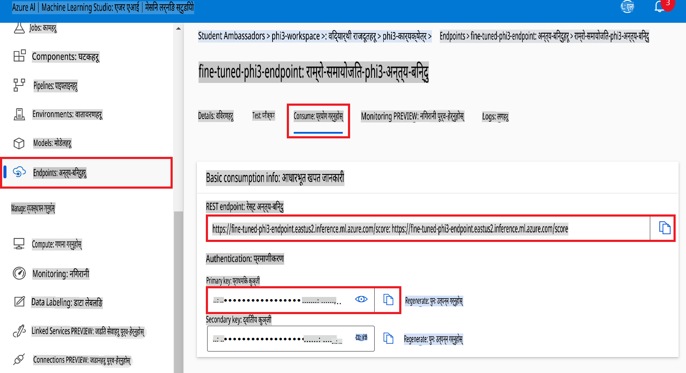

#### कस्टम कनेक्शन थप्नुहोस्

1. [Azure AI Foundry](https://ai.azure.com/?WT.mc_id=aiml-137032-kinfeylo) मा जानुहोस्।

1. तपाईंले सिर्जना गरेको Azure AI Foundry प्रोजेक्टमा जानुहोस्।

1. तपाईंले सिर्जना गरेको प्रोजेक्टमा, बायाँपट्टि रहेको ट्याबबाट **Settings** चयन गर्नुहोस्।

1. **+ New connection** चयन गर्नुहोस्।

    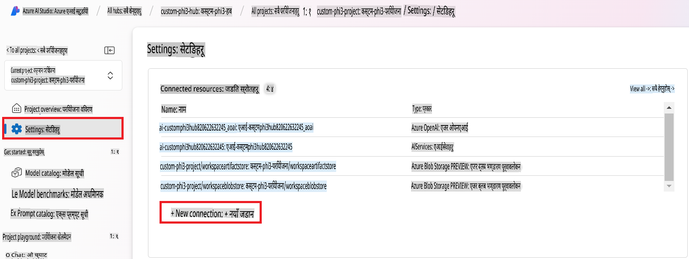

1. नेभिगेसन मेनुबाट **Custom keys** चयन गर्नुहोस्।

    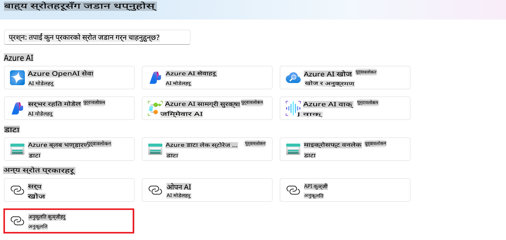

1. निम्न कार्यहरू गर्नुहोस्:

    - **+ Add key value pairs** चयन गर्नुहोस्।
    - कुञ्जी नामको लागि **endpoint** प्रविष्ट गर्नुहोस् र Azure ML Studio बाट प्रतिलिपि गरेको एन्डप्वाइन्टलाई मान क्षेत्रमा टाँस्नुहोस्।
    - पुन: **+ Add key value pairs** चयन गर्नुहोस्।
    - कुञ्जी नामको लागि **key** प्रविष्ट गर्नुहोस् र Azure ML Studio बाट प्रतिलिपि गरेको कुञ्जीलाई मान क्षेत्रमा टाँस्नुहोस्।
    - कुञ्जीहरू थपिसकेपछि, **is secret** चयन गर्नुहोस् ताकि कुञ्जी देखिने अवस्था नरहोस्।

    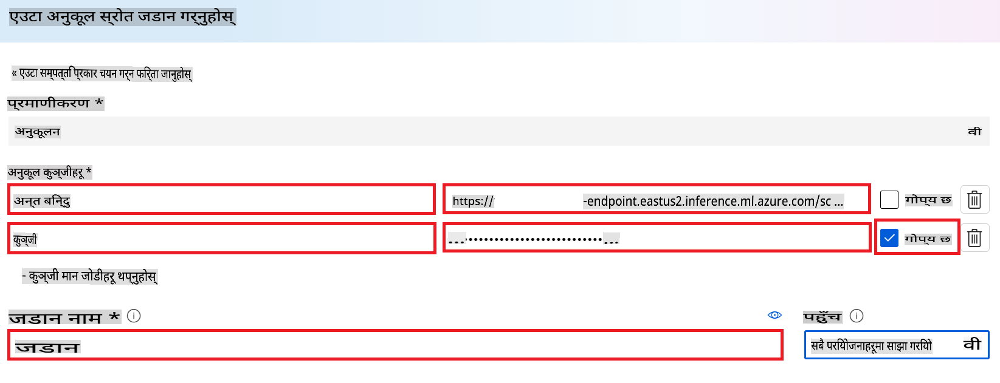

1. **Add connection** चयन गर्नुहोस्।

#### Prompt flow सिर्जना गर्नुहोस्

तपाईंले Azure AI Foundry मा कस्टम कनेक्शन थप्नुभयो। अब, निम्न चरणहरूको प्रयोग गरेर Prompt flow सिर्जना गरौं। त्यसपछि, तपाईं यस Prompt flow लाई कस्टम कनेक्शनसँग जडान गर्नुहुनेछ ताकि तपाईं Prompt flow भित्र फाइन-ट्युन गरिएको मोडेल प्रयोग गर्न सक्नुहुन्छ।

1. तपाईंले सिर्जना गरेको Azure AI Foundry प्रोजेक्टमा जानुहोस्।

1. बायाँपट्टि रहेको ट्याबबाट **Prompt flow** चयन गर्नुहोस्।

1. नेभिगेसन मेनुबाट **+ Create** चयन गर्नुहोस्।

    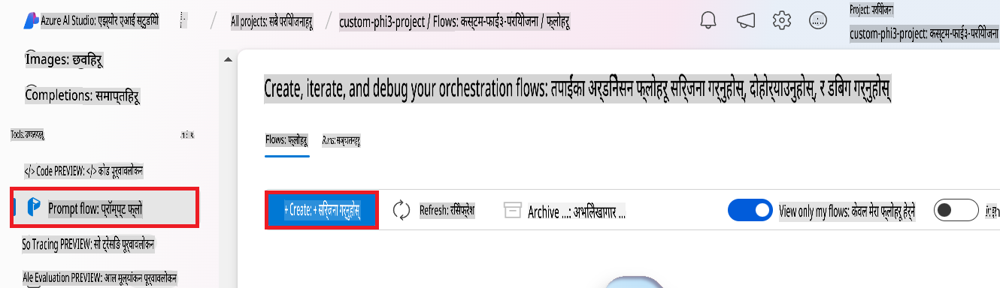

1. नेभिगेसन मेनुबाट **Chat flow** चयन गर्नुहोस्।

    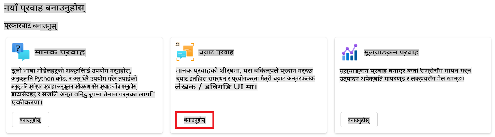

1. **Folder name** प्रविष्ट गर्नुहोस्।

    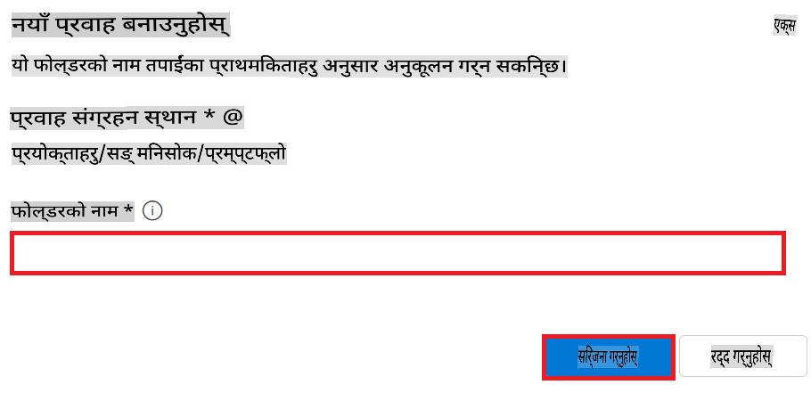

2. **Create** चयन गर्नुहोस्।

#### Prompt flow सेटअप गरेर आफ्नो कस्टम Phi-3 मोडेलसँग च्याट गर्नुहोस्

तपाईंले फाइन-ट्युन गरिएको Phi-3 मोडेललाई Prompt flow मा एकीकृत गर्न आवश्यक छ। तर, उपलब्ध Prompt flow यस उद्देश्यका लागि डिजाइन गरिएको छैन। त्यसैले, तपाईंले कस्टम मोडेलको एकीकरण सक्षम गर्न Prompt flow लाई पुन: डिजाइन गर्नुपर्छ।

1. Prompt flow भित्र, निम्न कार्यहरू गर्नुहोस् ताकि विद्यमान फ्लो पुन: निर्माण गर्न सकियोस्:

    - **Raw file mode** चयन गर्नुहोस्।
    - *flow.dag.yml* फाइलमा रहेको सबै कोड हटाउनुहोस्।
    - निम्न कोड *flow.dag.yml* फाइलमा थप्नुहोस्।

        ```yml
        inputs:
          input_data:
            type: string
            default: "Who founded Microsoft?"

        outputs:
          answer:
            type: string
            reference: ${integrate_with_promptflow.output}

        nodes:
        - name: integrate_with_promptflow
          type: python
          source:
            type: code
            path: integrate_with_promptflow.py
          inputs:
            input_data: ${inputs.input_data}
        ```

    - **Save** चयन गर्नुहोस्।

    

1. कस्टम Phi-3 मोडेललाई Prompt flow मा प्रयोग गर्न, निम्न कोड *integrate_with_promptflow.py* फाइलमा थप्नुहोस्।

    ```python
    import logging
    import requests
    from promptflow import tool
    from promptflow.connections import CustomConnection

    # Logging setup
    logging.basicConfig(
        format="%(asctime)s - %(levelname)s - %(name)s - %(message)s",
        datefmt="%Y-%m-%d %H:%M:%S",
        level=logging.DEBUG
    )
    logger = logging.getLogger(__name__)

    def query_phi3_model(input_data: str, connection: CustomConnection) -> str:
        """
        Send a request to the Phi-3 model endpoint with the given input data using Custom Connection.
        """

        # "connection" is the name of the Custom Connection, "endpoint", "key" are the keys in the Custom Connection
        endpoint_url = connection.endpoint
        api_key = connection.key

        headers = {
            "Content-Type": "application/json",
            "Authorization": f"Bearer {api_key}"
        }
        data = {
            "input_data": {
                "input_string": [
                    {"role": "user", "content": input_data}
                ],
                "parameters": {
                    "temperature": 0.7,
                    "max_new_tokens": 128
                }
            }
        }
        try:
            response = requests.post(endpoint_url, json=data, headers=headers)
            response.raise_for_status()
            
            # Log the full JSON response
            logger.debug(f"Full JSON response: {response.json()}")

            result = response.json()["output"]
            logger.info("Successfully received response from Azure ML Endpoint.")
            return result
        except requests.exceptions.RequestException as e:
            logger.error(f"Error querying Azure ML Endpoint: {e}")
            raise

    @tool
    def my_python_tool(input_data: str, connection: CustomConnection) -> str:
        """
        Tool function to process input data and query the Phi-3 model.
        """
        return query_phi3_model(input_data, connection)

    ```

    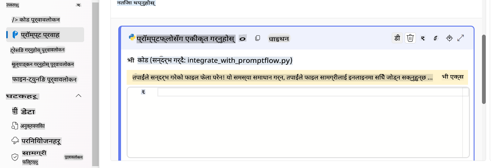

> [!NOTE]
> Azure AI Foundry मा Prompt flow प्रयोग गर्ने विस्तृत जानकारीको लागि, [Prompt flow in Azure AI Foundry](https://learn.microsoft.com/azure/ai-studio/how-to/prompt-flow) हेर्न सक्नुहुन्छ।

1. **Chat input**, **Chat output** चयन गर्नुहोस् ताकि तपाईं आफ्नो मोडेलसँग च्याट गर्न सक्नुहुन्छ।

    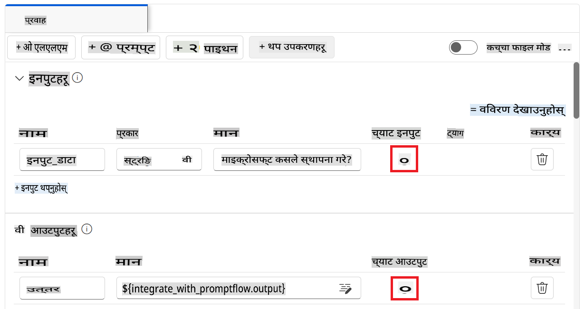

1. अब तपाईं आफ्नो कस्टम Phi-3 मोडेलसँग च्याट गर्न तयार हुनुहुन्छ। अर्को अभ्यासमा, तपाईं Prompt flow सुरु गर्ने र फाइन-ट्युन गरिएको Phi-3 मोडेलसँग च्याट गर्ने तरिका सिक्नुहुनेछ।

> [!NOTE]
>
> पुन: निर्माण गरिएको फ्लो तलको चित्र जस्तै देखिनुपर्छ:
>
> 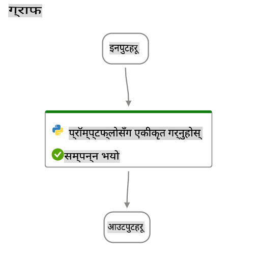
>

### आफ्नो कस्टम Phi-3 मोडेलसँग च्याट गर्नुहोस्

अब तपाईंले आफ्नो कस्टम Phi-3 मोडेललाई फाइन-ट्युन र Prompt flow मा एकीकृत गर्नुभयो, तपाईं यससँग अन्तरक्रिया गर्न तयार हुनुहुन्छ। यो अभ्यासले तपाईंलाई Prompt flow प्रयोग गरेर आफ्नो मोडेलसँग च्याट गर्नको लागि सेटअप र सुरु गर्ने प्रक्रियामा मार्गदर्शन गर्नेछ। यी चरणहरूको पालना गरेर, तपाईं आफ्नो फाइन-ट्युन गरिएको Phi-3 मोडेलको क्षमताहरू विभिन्न कार्यहरू र कुराकानीहरूको लागि पूर्ण रूपमा प्रयोग गर्न सक्नुहुनेछ।

- Prompt flow प्रयोग गरेर आफ्नो कस्टम Phi-3 मोडेलसँग च्याट गर्नुहोस्।

#### Prompt flow सुरु गर्नुहोस्

1. Prompt flow सुरु गर्न **Start compute sessions** चयन गर्नुहोस्।

    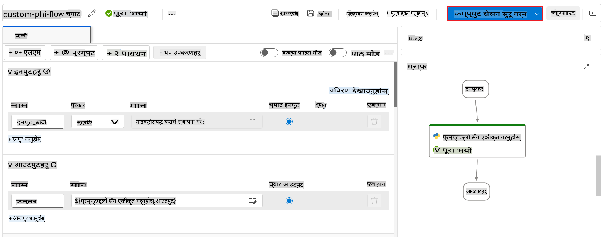

1. प्यारामिटरहरू नवीकरण गर्न **Validate and parse input** चयन गर्नुहोस्।

    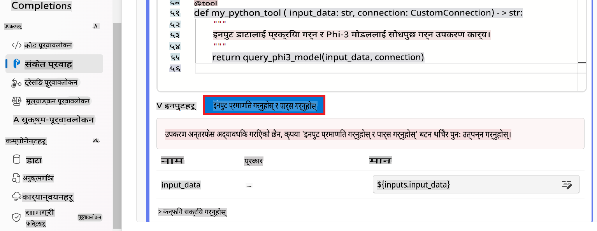

1. तपाईंले सिर्जना गरेको कस्टम कनेक्शनको **Value** चयन गर्नुहोस्। उदाहरणका लागि, *connection*।

    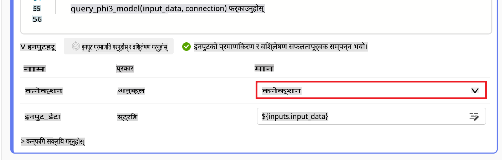

#### आफ्नो कस्टम मोडेलसँग च्याट गर्नुहोस्

1. **Chat** चयन गर्नुहोस्।

    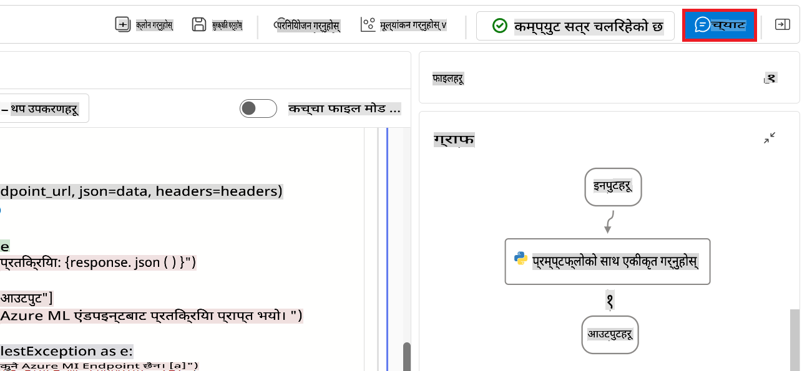

1. यहाँ एउटा परिणामको उदाहरण छ: अब तपाईं आफ्नो कस्टम Phi-3 मोडेलसँग च्याट गर्न सक्नुहुन्छ। फाइन-ट्युनिङको लागि प्रयोग गरिएको डाटाको आधारमा प्रश्न सोध्न सिफारिस गरिन्छ।

    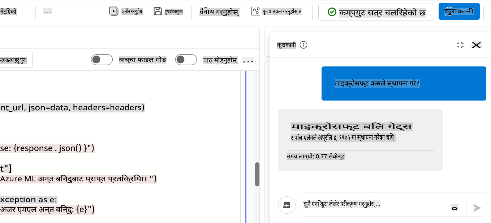

**अस्वीकरण**:  
यो दस्तावेज मेशिन-आधारित एआई अनुवाद सेवाहरू प्रयोग गरेर अनुवाद गरिएको हो। हामी यथासम्भव शुद्धताको प्रयास गर्छौं, तर कृपया जानकार रहनुहोस् कि स्वचालित अनुवादहरूले त्रुटिहरू वा अशुद्धताहरू समावेश गर्न सक्छ। मूल भाषामा रहेको मूल दस्तावेजलाई प्रामाणिक स्रोत मानिनुपर्छ। महत्वपूर्ण जानकारीका लागि, व्यावसायिक मानव अनुवाद सिफारिस गरिन्छ। यस अनुवादको प्रयोगबाट उत्पन्न हुने कुनै पनि गलतफहमी वा गलत व्याख्याका लागि हामी जिम्मेवार हुने छैनौं।