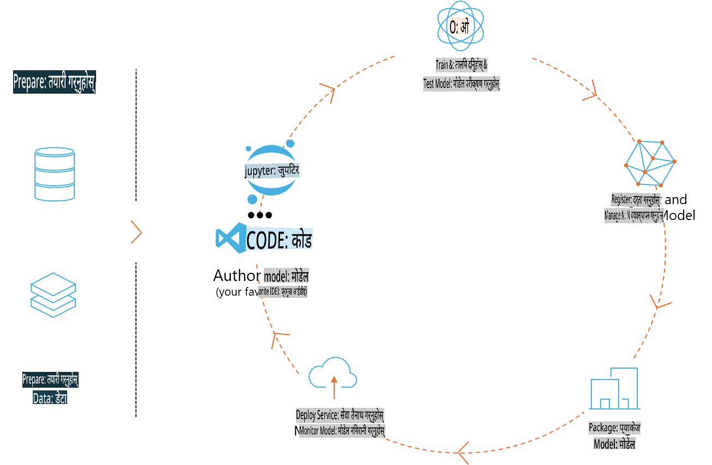
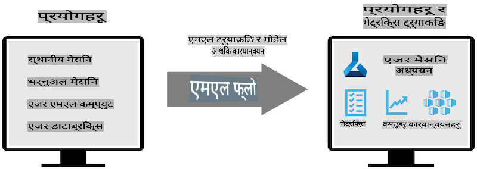
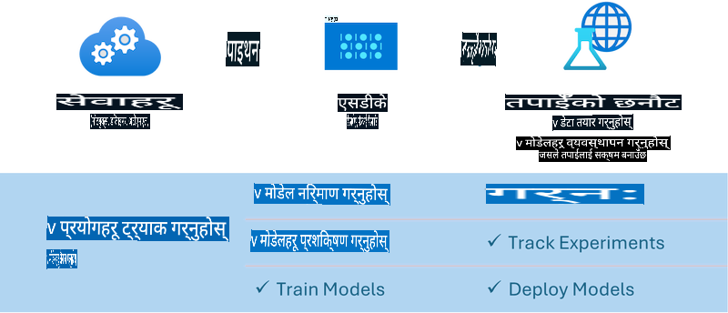

# एमएलफ्लो

[एमएलफ्लो](https://mlflow.org/) एक ओपन-सोर्स प्लेटफर्म हो जसले सम्पूर्ण मेसिन लर्निङ जीवनचक्रलाई व्यवस्थापन गर्न डिजाइन गरिएको हो।



एमएलफ्लो प्रयोग गरिन्छ एमएल जीवनचक्र व्यवस्थापन गर्न, जसमा प्रयोग, पुनःउत्पादन, डिप्लोयमेन्ट, र एक केन्द्रीय मोडल रजिस्ट्री समावेश छ। एमएलफ्लो हाल चारवटा प्रमुख कम्पोनेन्टहरू प्रदान गर्दछ।

- **एमएलफ्लो ट्र्याकिङ:** प्रयोग, कोड, डाटा कन्फिग, र नतिजाहरू रेकर्ड र क्वेरी गर्न।
- **एमएलफ्लो प्रोजेक्ट्स:** डाटा साइन्स कोडलाई कुनै पनि प्लेटफर्ममा पुनः चलाउन मिल्ने फर्म्याटमा प्याकेज गर्न।
- **एमएलफ्लो मोडल्स:** मेसिन लर्निङ मोडलहरूलाई विभिन्न सर्भिङ वातावरणहरूमा डिप्लोय गर्न।
- **मोडल रजिस्ट्री:** मोडलहरूलाई केन्द्रीय रिपोजिटरीमा स्टोर, एनोटेट, र व्यवस्थापन गर्न।

यसले प्रयोग ट्र्याक गर्न, कोडलाई पुनःउत्पादनयोग्य रनहरूमा प्याकेज गर्न, र मोडलहरू साझा र डिप्लोय गर्नका लागि क्षमताहरू समावेश गर्दछ। एमएलफ्लो Databricks मा इन्ग्रेटेड छ र विभिन्न एमएल लाइब्रेरीहरूलाई समर्थन गर्दछ, जसले यसलाई लाइब्रेरी-एग्नोस्टिक बनाउँछ। यसलाई कुनै पनि मेसिन लर्निङ लाइब्रेरी र कुनै पनि प्रोग्रामिङ भाषामा प्रयोग गर्न सकिन्छ, किनभने यसले REST API र CLI प्रदान गर्दछ।



एमएलफ्लोका प्रमुख विशेषताहरू:

- **प्रयोग ट्र्याकिङ:** प्यारामिटरहरू र नतिजाहरू रेकर्ड र तुलना गर्न।
- **मोडल व्यवस्थापन:** मोडलहरूलाई विभिन्न सर्भिङ र इन्फरेन्स प्लेटफर्महरूमा डिप्लोय गर्न।
- **मोडल रजिस्ट्री:** एमएलफ्लो मोडलहरूको जीवनचक्रलाई सहकार्यात्मक रूपमा व्यवस्थापन गर्न, जसमा भर्सनिङ र एनोटेसनहरू समावेश छन्।
- **प्रोजेक्ट्स:** एमएल कोडलाई साझा वा उत्पादन प्रयोगका लागि प्याकेज गर्न।

एमएलफ्लोले एमएलओप्स लूपलाई पनि समर्थन गर्दछ, जसमा डाटा तयार पार्ने, मोडलहरू रजिस्ट्री गर्ने र व्यवस्थापन गर्ने, मोडलहरूलाई कार्यान्वयनका लागि प्याकेज गर्ने, सेवाहरू डिप्लोय गर्ने, र मोडलहरू अनुगमन गर्ने समावेश छ। यसले विशेष गरी क्लाउड र एज वातावरणहरूमा प्रोटोटाइपबाट उत्पादन वर्कफ्लोमा जानको लागि प्रक्रिया सरल बनाउन खोज्दछ।

## ई२ई परिदृश्य - Phi-3 को लागि र्यापर बनाउने र एमएलफ्लो मोडलको रूपमा प्रयोग गर्ने

यस ई२ई नमूनामा हामी दुई फरक दृष्टिकोणहरू प्रदर्शन गर्नेछौं, जसमा Phi-3 सानो भाषा मोडल (SLM) को लागि र्यापर बनाउने र त्यसलाई स्थानीय रूपमा वा क्लाउडमा, जस्तै Azure Machine Learning workspace मा, एमएलफ्लो मोडलको रूपमा चलाउने।



| प्रोजेक्ट | विवरण | स्थान |
| ------------ | ----------- | -------- |
| ट्रान्सफर्मर पाइपलाइन | यदि तपाईं HuggingFace मोडललाई एमएलफ्लोको प्रयोगात्मक ट्रान्सफर्मर फ्लेभरसँग प्रयोग गर्न चाहनुहुन्छ भने ट्रान्सफर्मर पाइपलाइन र्यापर बनाउने सबैभन्दा सजिलो विकल्प हो। | [**TransformerPipeline.ipynb**](../../../../../../code/06.E2E/E2E_Phi-3-MLflow_TransformerPipeline.ipynb) |
| कस्टम पायथन र्यापर | लेख्दाको समयमा, ट्रान्सफर्मर पाइपलाइनले HuggingFace मोडलहरूको लागि ONNX फर्म्याटमा एमएलफ्लो र्यापर निर्माणलाई समर्थन गर्दैनथ्यो, यहाँसम्म कि प्रयोगात्मक optimum पायथन प्याकेजसँग पनि। यस्तो अवस्थामा, तपाईं एमएलफ्लो मोडलको लागि कस्टम पायथन र्यापर बनाउन सक्नुहुन्छ। | [**CustomPythonWrapper.ipynb**](../../../../../../code/06.E2E/E2E_Phi-3-MLflow_CustomPythonWrapper.ipynb) |

## प्रोजेक्ट: ट्रान्सफर्मर पाइपलाइन

1. तपाईंलाई एमएलफ्लो र HuggingFace का सम्बन्धित पायथन प्याकेजहरू आवश्यक पर्नेछ:

    ``` Python
    import mlflow
    import transformers
    ```

2. त्यसपछि, तपाईंले HuggingFace रजिस्ट्रीमा लक्ष्य Phi-3 मोडललाई उल्लेख गरेर ट्रान्सफर्मर पाइपलाइन सुरु गर्नुपर्छ। _Phi-3-mini-4k-instruct_ को मोडल कार्डमा देखिएझैं, यसको कार्य "Text Generation" प्रकारको छ:

    ``` Python
    pipeline = transformers.pipeline(
        task = "text-generation",
        model = "microsoft/Phi-3-mini-4k-instruct"
    )
    ```

3. अब तपाईंले आफ्नो Phi-3 मोडलको ट्रान्सफर्मर पाइपलाइनलाई एमएलफ्लो फर्म्याटमा सेभ गर्न सक्नुहुन्छ र थप विवरणहरू प्रदान गर्न सक्नुहुन्छ, जस्तै लक्ष्य आर्टिफ्याक्ट्स पथ, विशिष्ट मोडल कन्फिगरेशन सेटिङ्स र इन्फरेन्स API प्रकार:

    ``` Python
    model_info = mlflow.transformers.log_model(
        transformers_model = pipeline,
        artifact_path = "phi3-mlflow-model",
        model_config = model_config,
        task = "llm/v1/chat"
    )
    ```

## प्रोजेक्ट: कस्टम पायथन र्यापर

1. यहाँ हामी Microsoft को [ONNX Runtime generate() API](https://github.com/microsoft/onnxruntime-genai) लाई ONNX मोडलको इन्फरेन्स र टोकन्स एन्कोडिङ/डिकोडिङका लागि प्रयोग गर्न सक्छौं। तपाईंले आफ्नो लक्ष्य कम्प्युटका लागि _onnxruntime_genai_ प्याकेज चयन गर्नुपर्छ, तलको उदाहरण CPU लक्षित छ:

    ``` Python
    import mlflow
    from mlflow.models import infer_signature
    import onnxruntime_genai as og
    ```

1. हाम्रो कस्टम क्लासले दुईवटा मेथडहरू कार्यान्वयन गर्दछ: _load_context()_ जसले Phi-3 Mini 4K Instruct को **ONNX मोडल**, **जेनेरेटर प्यारामिटरहरू**, र **टोकनाइजर**लाई इनिसियलाइज गर्दछ; र _predict()_ जसले प्रदान गरिएको प्रम्प्टका लागि आउटपुट टोकन्स जेनेरेट गर्दछ:

    ``` Python
    class Phi3Model(mlflow.pyfunc.PythonModel):
        def load_context(self, context):
            # Retrieving model from the artifacts
            model_path = context.artifacts["phi3-mini-onnx"]
            model_options = {
                 "max_length": 300,
                 "temperature": 0.2,         
            }
        
            # Defining the model
            self.phi3_model = og.Model(model_path)
            self.params = og.GeneratorParams(self.phi3_model)
            self.params.set_search_options(**model_options)
            
            # Defining the tokenizer
            self.tokenizer = og.Tokenizer(self.phi3_model)
    
        def predict(self, context, model_input):
            # Retrieving prompt from the input
            prompt = model_input["prompt"][0]
            self.params.input_ids = self.tokenizer.encode(prompt)
    
            # Generating the model's response
            response = self.phi3_model.generate(self.params)
    
            return self.tokenizer.decode(response[0][len(self.params.input_ids):])
    ```

1. अब तपाईं _mlflow.pyfunc.log_model()_ फङ्सन प्रयोग गरेर Phi-3 मोडलको लागि कस्टम पायथन र्यापर (पिकल फर्म्याटमा) जेनेरेट गर्न सक्नुहुन्छ, मूल ONNX मोडल र आवश्यक निर्भरताहरू सहित:

    ``` Python
    model_info = mlflow.pyfunc.log_model(
        artifact_path = artifact_path,
        python_model = Phi3Model(),
        artifacts = {
            "phi3-mini-onnx": "cpu_and_mobile/cpu-int4-rtn-block-32-acc-level-4",
        },
        input_example = input_example,
        signature = infer_signature(input_example, ["Run"]),
        extra_pip_requirements = ["torch", "onnxruntime_genai", "numpy"],
    )
    ```

## जेनेरेट गरिएको एमएलफ्लो मोडलहरूको सिग्नेचरहरू

1. माथिको ट्रान्सफर्मर पाइपलाइन प्रोजेक्टको तेस्रो चरणमा, हामीले एमएलफ्लो मोडलको कार्यलाई “_llm/v1/chat_” मा सेट गरेका थियौं। यस्तो निर्देशनले मोडलको API र्यापर जेनेरेट गर्दछ, जुन OpenAI को Chat API सँग मिल्दोजुल्दो हुन्छ, तल देखाइएको छ:

    ``` Python
    {inputs: 
      ['messages': Array({content: string (required), name: string (optional), role: string (required)}) (required), 'temperature': double (optional), 'max_tokens': long (optional), 'stop': Array(string) (optional), 'n': long (optional), 'stream': boolean (optional)],
    outputs: 
      ['id': string (required), 'object': string (required), 'created': long (required), 'model': string (required), 'choices': Array({finish_reason: string (required), index: long (required), message: {content: string (required), name: string (optional), role: string (required)} (required)}) (required), 'usage': {completion_tokens: long (required), prompt_tokens: long (required), total_tokens: long (required)} (required)],
    params: 
      None}
    ```

1. यसका परिणामस्वरूप, तपाईंले आफ्नो प्रम्प्ट निम्न ढाँचामा सबमिट गर्न सक्नुहुन्छ:

    ``` Python
    messages = [{"role": "user", "content": "What is the capital of Spain?"}]
    ```

1. त्यसपछि, OpenAI API-सँग मिल्दो पोस्ट-प्रोसेसिङ, जस्तै _response[0][‘choices’][0][‘message’][‘content’]_ प्रयोग गरेर, तपाईं आफ्नो आउटपुटलाई यस्तो बनाउन सक्नुहुन्छ:

    ``` JSON
    Question: What is the capital of Spain?
    
    Answer: The capital of Spain is Madrid. It is the largest city in Spain and serves as the political, economic, and cultural center of the country. Madrid is located in the center of the Iberian Peninsula and is known for its rich history, art, and architecture, including the Royal Palace, the Prado Museum, and the Plaza Mayor.
    
    Usage: {'prompt_tokens': 11, 'completion_tokens': 73, 'total_tokens': 84}
    ```

1. माथिको कस्टम पायथन र्यापर प्रोजेक्टको तेस्रो चरणमा, हामीले एमएलफ्लो प्याकेजलाई दिइएको इनपुट उदाहरणबाट मोडलको सिग्नेचर जेनेरेट गर्न अनुमति दिएका थियौं। हाम्रो एमएलफ्लो र्यापरको सिग्नेचर यस प्रकार देखिन्छ:

    ``` Python
    {inputs: 
      ['prompt': string (required)],
    outputs: 
      [string (required)],
    params: 
      None}
    ```

1. त्यसैले, हाम्रो प्रम्प्टमा "prompt" नामक डिक्सनरी कुञ्जी समावेश हुनुपर्नेछ, यसजस्तै:

    ``` Python
    {"prompt": "<|system|>You are a stand-up comedian.<|end|><|user|>Tell me a joke about atom<|end|><|assistant|>",}
    ```

1. मोडलको आउटपुट त्यसपछि स्ट्रिङ फर्म्याटमा प्रदान गरिनेछ:

    ``` JSON
    Alright, here's a little atom-related joke for you!
    
    Why don't electrons ever play hide and seek with protons?
    
    Because good luck finding them when they're always "sharing" their electrons!
    
    Remember, this is all in good fun, and we're just having a little atomic-level humor!
    ```

**अस्वीकरण**:  
यो दस्तावेज़ मेसिन-आधारित एआई अनुवाद सेवाहरू प्रयोग गरी अनुवाद गरिएको हो। यद्यपि हामी शुद्धताको लागि प्रयास गर्दछौं, कृपया ध्यान दिनुहोस् कि स्वचालित अनुवादहरूमा त्रुटिहरू वा अशुद्धताहरू हुन सक्छ। मूल भाषामा रहेको मूल दस्तावेजलाई प्राधिकृत स्रोतको रूपमा मानिनुपर्छ। महत्वपूर्ण जानकारीका लागि, व्यावसायिक मानव अनुवादको सिफारिस गरिन्छ। यस अनुवादको प्रयोगबाट उत्पन्न कुनै पनि गलतफहमी वा गलत व्याख्याको लागि हामी जिम्मेवार हुनेछैनौं।