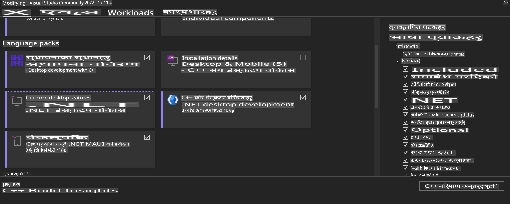
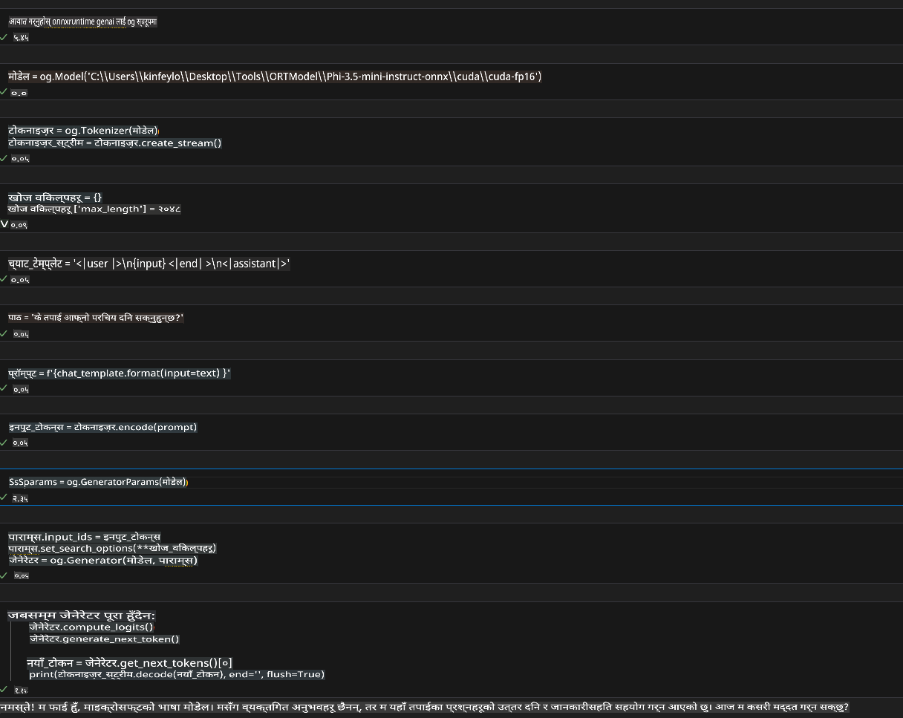
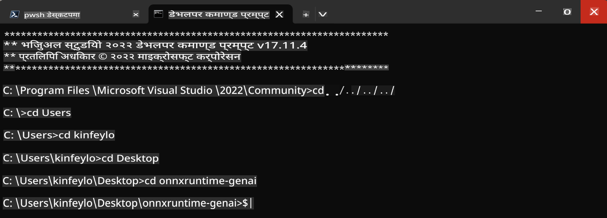

# **OnnxRuntime GenAI Windows GPU को लागि मार्गदर्शन**

यो मार्गदर्शनले Windows मा GPU हरूसँग ONNX Runtime (ORT) सेटअप र प्रयोग गर्नका लागि आवश्यक चरणहरू प्रदान गर्दछ। यो GPU एक्सेलेरेसन प्रयोग गरेर तपाईंको मोडेलहरूको प्रदर्शन र कार्यक्षमता सुधार गर्न डिजाइन गरिएको छ।

यो दस्तावेजले निम्न विषयहरूमा मार्गदर्शन प्रदान गर्दछ:

- वातावरण सेटअप: CUDA, cuDNN, र ONNX Runtime जस्ता आवश्यक निर्भरताहरू स्थापना गर्ने निर्देशहरू।
- कन्फिगरेसन: GPU स्रोतहरू प्रभावकारी रूपमा उपयोग गर्न वातावरण र ONNX Runtime कन्फिगर गर्ने तरिकाहरू।
- अप्टिमाइजेसन सुझावहरू: GPU सेटिङहरूलाई उत्कृष्ट प्रदर्शनको लागि कसरी ठीक गर्ने भन्ने सल्लाह।

### **1. Python 3.10.x /3.11.8**

   ***नोट*** [miniforge](https://github.com/conda-forge/miniforge/releases/latest/download/Miniforge3-Windows-x86_64.exe) लाई तपाईंको Python वातावरणको रूपमा प्रयोग गर्न सिफारिस गरिन्छ।

   ```bash

   conda create -n pydev python==3.11.8

   conda activate pydev

   ```

   ***स्मरण*** यदि तपाईंले Python ONNX लाइब्रेरी सम्बन्धी केही पनि स्थापना गर्नुभएको छ भने, कृपया यसलाई अनइन्स्टल गर्नुहोस्।

### **2. CMake लाई winget बाट स्थापना गर्नुहोस्**

   ```bash

   winget install -e --id Kitware.CMake

   ```

### **3. Visual Studio 2022 - Desktop Development with C++ स्थापना गर्नुहोस्**

   ***नोट*** यदि तपाईं कम्पाइल गर्न चाहनुहुन्न भने, यो चरण छोड्न सक्नुहुन्छ।



### **4. NVIDIA ड्राइभर स्थापना गर्नुहोस्**

1. **NVIDIA GPU ड्राइभर** [https://www.nvidia.com/en-us/drivers/](https://www.nvidia.com/en-us/drivers/)

2. **NVIDIA CUDA 12.4** [https://developer.nvidia.com/cuda-12-4-0-download-archive](https://developer.nvidia.com/cuda-12-4-0-download-archive)

3. **NVIDIA CUDNN 9.4** [https://developer.nvidia.com/cudnn-downloads](https://developer.nvidia.com/cudnn-downloads)

***स्मरण*** कृपया स्थापना प्रक्रियामा डिफल्ट सेटिङहरू प्रयोग गर्नुहोस्।

### **5. NVIDIA वातावरण सेट गर्नुहोस्**

NVIDIA CUDNN 9.4 का lib, bin, include फाइलहरू NVIDIA CUDA 12.4 का lib, bin, include मा कपी गर्नुहोस्।

- *'C:\Program Files\NVIDIA\CUDNN\v9.4\bin\12.6'* का फाइलहरू *'C:\Program Files\NVIDIA GPU Computing Toolkit\CUDA\v12.4\bin'* मा कपी गर्नुहोस्।

- *'C:\Program Files\NVIDIA\CUDNN\v9.4\include\12.6'* का फाइलहरू *'C:\Program Files\NVIDIA GPU Computing Toolkit\CUDA\v12.4\include'* मा कपी गर्नुहोस्।

- *'C:\Program Files\NVIDIA\CUDNN\v9.4\lib\12.6'* का फाइलहरू *'C:\Program Files\NVIDIA GPU Computing Toolkit\CUDA\v12.4\lib\x64'* मा कपी गर्नुहोस्।

### **6. Phi-3.5-mini-instruct-onnx डाउनलोड गर्नुहोस्**

   ```bash

   winget install -e --id Git.Git

   winget install -e --id GitHub.GitLFS

   git lfs install

   git clone https://huggingface.co/microsoft/Phi-3.5-mini-instruct-onnx

   ```

### **7. InferencePhi35Instruct.ipynb चलाउनुहोस्**

   [Notebook](../../../../../../code/09.UpdateSamples/Aug/ortgpu-phi35-instruct.ipynb) खोल्नुहोस् र कार्यान्वयन गर्नुहोस्।



### **8. ORT GenAI GPU कम्पाइल गर्नुहोस्**

   ***नोट*** 
   
   1. सबै onnx, onnxruntime, र onnxruntime-genai सम्बन्धी लाइब्रेरीहरू पहिले अनइन्स्टल गर्नुहोस्।

   ```bash

   pip list 
   
   ```

   त्यसपछि सबै onnxruntime लाइब्रेरीहरू अनइन्स्टल गर्नुहोस्, जस्तै:

   ```bash

   pip uninstall onnxruntime

   pip uninstall onnxruntime-genai

   pip uninstall onnxruntume-genai-cuda
   
   ```

   2. Visual Studio एक्स्टेन्सन समर्थन जाँच गर्नुहोस्।

   *C:\Program Files\NVIDIA GPU Computing Toolkit\CUDA\v12.4\extras* मा *C:\Program Files\NVIDIA GPU Computing Toolkit\CUDA\v12.4\extras\visual_studio_integration* फोल्डर फेला पार्न सुनिश्चित गर्नुहोस्। 

   यदि फेला परिएन भने, अन्य CUDA टूलकिट ड्राइभर फोल्डरहरू जाँच गर्नुहोस् र visual_studio_integration फोल्डर र सामग्रीहरू *C:\Program Files\NVIDIA GPU Computing Toolkit\CUDA\v12.4\extras\visual_studio_integration* मा कपी गर्नुहोस्।

   - यदि तपाईं कम्पाइल गर्न चाहनुहुन्न भने, यो चरण छोड्न सक्नुहुन्छ।

   ```bash

   git clone https://github.com/microsoft/onnxruntime-genai

   ```

   - [https://github.com/microsoft/onnxruntime/releases/download/v1.19.2/onnxruntime-win-x64-gpu-1.19.2.zip](https://github.com/microsoft/onnxruntime/releases/download/v1.19.2/onnxruntime-win-x64-gpu-1.19.2.zip) डाउनलोड गर्नुहोस्।

   - onnxruntime-win-x64-gpu-1.19.2.zip अनजिप गर्नुहोस्, र यसलाई **ort** नाम दिनुहोस्। ort फोल्डरलाई onnxruntime-genai मा कपी गर्नुहोस्।

   - Windows Terminal प्रयोग गरी, Developer Command Prompt for VS 2022 मा जानुहोस् र onnxruntime-genai मा जानुहोस्।



   - तपाईंको Python वातावरण प्रयोग गरी यसलाई कम्पाइल गर्नुहोस्।

   ```bash

   cd onnxruntime-genai

   python build.py --use_cuda  --cuda_home "C:\Program Files\NVIDIA GPU Computing Toolkit\CUDA\v12.4" --config Release
 

   cd build/Windows/Release/Wheel

   pip install .whl

   ```

**अस्वीकरण**:  
यो दस्तावेज मेसिन-आधारित एआई अनुवाद सेवाहरू प्रयोग गरी अनुवाद गरिएको हो। हामी शुद्धताका लागि प्रयास गर्छौं, तर कृपया सचेत रहनुहोस् कि स्वचालित अनुवादमा त्रुटिहरू वा अशुद्धताहरू हुन सक्छ। मूल भाषामा रहेको मूल दस्तावेजलाई आधिकारिक स्रोत मानिनुपर्छ। महत्त्वपूर्ण जानकारीका लागि, पेशेवर मानव अनुवाद सिफारिस गरिन्छ। यस अनुवादको प्रयोगबाट उत्पन्न हुने कुनै पनि गलतफहमी वा गलत व्याख्याका लागि हामी जिम्मेवार हुनेछैनौं।