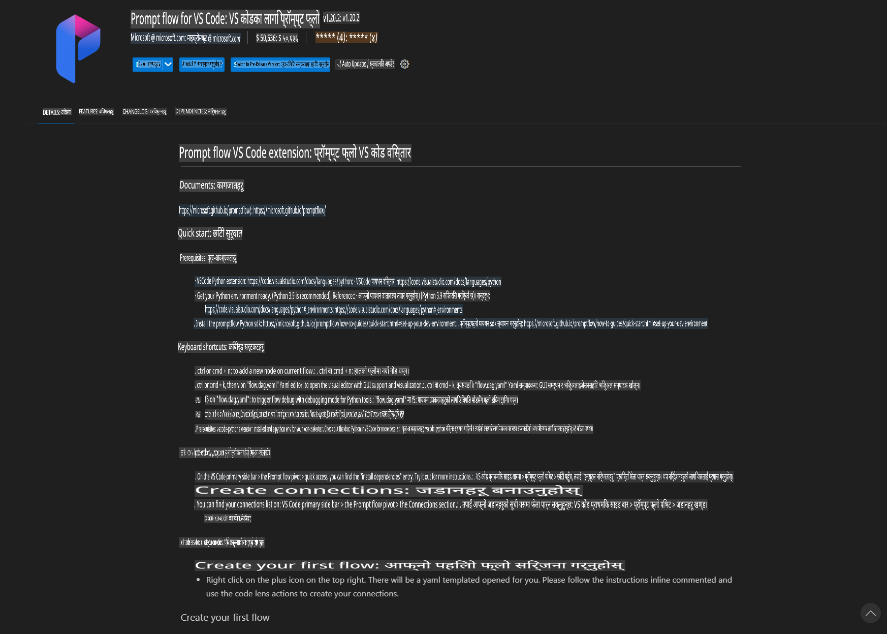
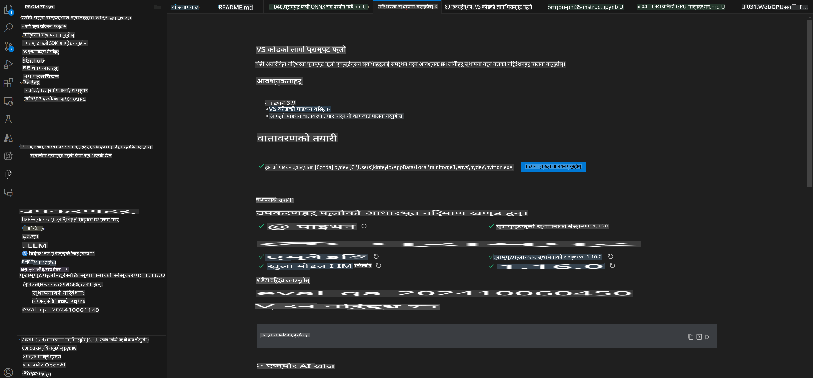
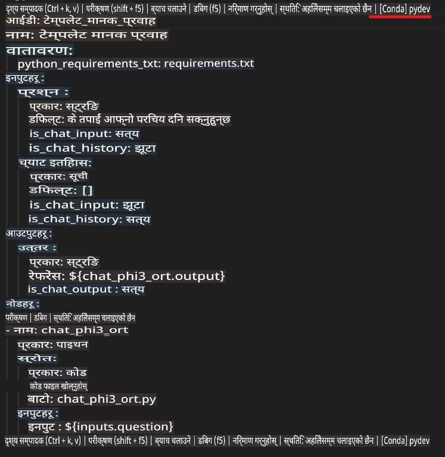
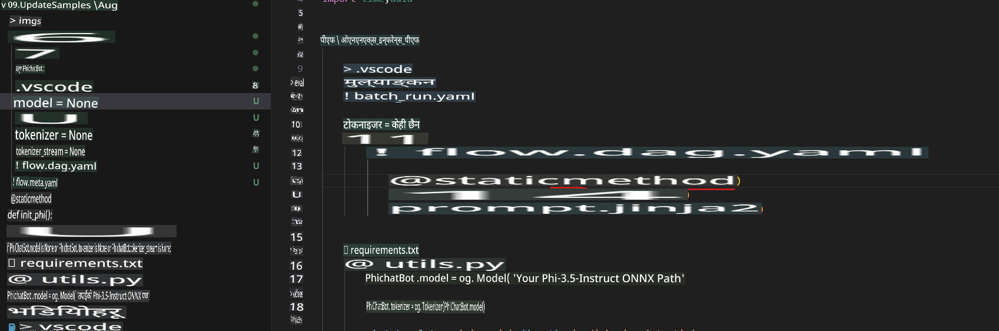
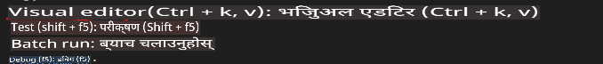
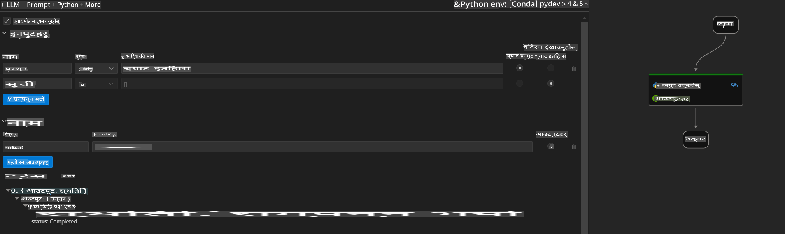
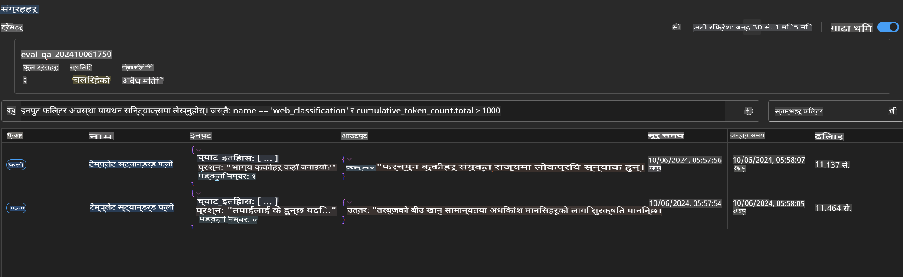

# Windows GPU प्रयोग गरेर Phi-3.5-Instruct ONNX को साथ Prompt Flow समाधान बनाउन 

तलको दस्तावेजले Phi-3 मोडेलहरूमा आधारित AI एप्लिकेशनहरू विकास गर्न ONNX (Open Neural Network Exchange) को साथ PromptFlow कसरी प्रयोग गर्ने भन्ने उदाहरण प्रस्तुत गर्दछ।

PromptFlow एउटा विकास उपकरणहरूको सेट हो, जसले LLM-आधारित (Large Language Model) AI एप्लिकेशनहरूको सम्पूर्ण विकास चक्रलाई - विचार निर्माणदेखि प्रोटोटाइप बनाउने, परीक्षण गर्ने र मूल्याङ्कन गर्ने कामलाई सहज बनाउँछ।

PromptFlow र ONNX लाई एकीकृत गर्दा विकासकर्ताहरूले निम्न फाइदाहरू लिन सक्छन्:

- **मोडेल प्रदर्शन अनुकूलन**: ONNX प्रयोग गरेर मोडेल इन्फरेन्स र डिप्लोयमेन्टलाई प्रभावकारी बनाउनुहोस्।
- **विकास सजिलो बनाउनुहोस्**: Workflow व्यवस्थापन र दोहोरिने कामहरू स्वचालित गर्न PromptFlow प्रयोग गर्नुहोस्।
- **सहकार्य सुधार गर्नुहोस्**: टोलीका सदस्यहरूबीच राम्रो सहकार्य गर्न एकीकृत विकास वातावरण प्रदान गर्नुहोस्।

**Prompt flow** एक विकास उपकरणहरूको सेट हो जसले LLM-आधारित AI एप्लिकेशनहरूको सम्पूर्ण विकास चक्र - विचार निर्माण, प्रोटोटाइप बनाउने, परीक्षण गर्ने, मूल्याङ्कन गर्ने, उत्पादनमा तैनाथ गर्ने र अनुगमन गर्ने कामलाई सहज बनाउँछ। यसले Prompt Engineering लाई धेरै सजिलो बनाउँछ र तपाईंलाई उत्पादन गुणस्तरको LLM एप्स निर्माण गर्न सक्षम बनाउँछ।

Prompt flow ले OpenAI, Azure OpenAI Service, र अनुकूलन योग्य मोडेलहरू (जस्तै Huggingface, स्थानीय LLM/SLM) सँग जडान गर्न सक्छ। हामी Phi-3.5 को क्वान्टाइज्ड ONNX मोडेललाई स्थानीय एप्लिकेशनहरूमा तैनाथ गर्न चाहन्छौं। Prompt flow ले हाम्रो व्यवसाय राम्रोसँग योजना गर्न र Phi-3.5 मा आधारित स्थानीय समाधानहरू पूरा गर्न मद्दत गर्दछ। यस उदाहरणमा, हामी ONNX Runtime GenAI Library सँग मिलाएर Windows GPU मा आधारित Prompt flow समाधान पूरा गर्नेछौं।

## **स्थापना**

### **Windows GPU का लागि ONNX Runtime GenAI**

Windows GPU का लागि ONNX Runtime GenAI सेटअप गर्न यो मार्गदर्शन पढ्नुहोस् [यहाँ क्लिक गर्नुहोस्](./ORTWindowGPUGuideline.md)

### **VSCode मा Prompt flow सेटअप गर्नुहोस्**

1. Prompt flow VS Code Extension स्थापना गर्नुहोस्



2. Prompt flow VS Code Extension स्थापना गरेपछि, एक्सटेन्सनमा क्लिक गर्नुहोस्, र **Installation dependencies** चयन गर्नुहोस्। यो मार्गदर्शन अनुसार आफ्नो वातावरणमा Prompt flow SDK स्थापना गर्नुहोस्।



3. [नमूना कोड](../../../../../../code/09.UpdateSamples/Aug/pf/onnx_inference_pf) डाउनलोड गर्नुहोस् र VS Code प्रयोग गरेर यो नमूना खोल्नुहोस्।


4. **flow.dag.yaml** खोल्नुहोस् र आफ्नो Python वातावरण चयन गर्नुहोस्।



   **chat_phi3_ort.py** खोल्नुहोस् र आफ्नो Phi-3.5-instruct ONNX मोडेलको स्थान परिवर्तन गर्नुहोस्।



5. आफ्नो Prompt flow परीक्षण गर्न चलाउनुहोस्।

**flow.dag.yaml** खोल्नुहोस् र Visual Editor मा क्लिक गर्नुहोस्।



यो क्लिक गरेपछि, चलाउनुहोस् र परीक्षण गर्नुहोस्।



1. टर्मिनलमा batch चलाएर थप नतिजा जाँच गर्न सक्नुहुन्छ।  

```bash

pf run create --file batch_run.yaml --stream --name 'Your eval qa name'    

```

तपाईं आफ्नो डिफल्ट ब्राउजरमा नतिजा जाँच गर्न सक्नुहुन्छ।



**अस्वीकरण**:  
यो दस्तावेज मेशिन-आधारित एआई अनुवाद सेवाहरू प्रयोग गरेर अनुवाद गरिएको हो। हामी यथार्थताको लागि प्रयास गर्छौं, तर कृपया सचेत रहनुहोस् कि स्वचालित अनुवादहरूले त्रुटि वा अशुद्धता समावेश गर्न सक्छ। मूल भाषा मा रहेको मूल दस्तावेजलाई आधिकारिक स्रोतको रूपमा मानिनुपर्छ। महत्त्वपूर्ण जानकारीका लागि, व्यावसायिक मानव अनुवादको सिफारिस गरिन्छ। यस अनुवादको प्रयोगबाट उत्पन्न कुनै पनि गलतफहमी वा गलत व्याख्याका लागि हामी उत्तरदायी हुने छैनौं।