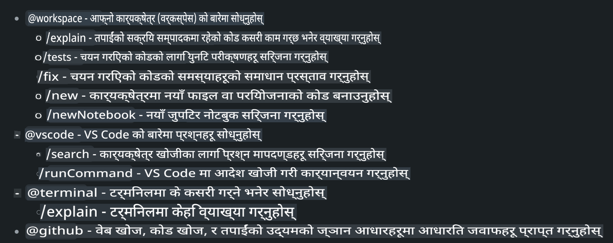
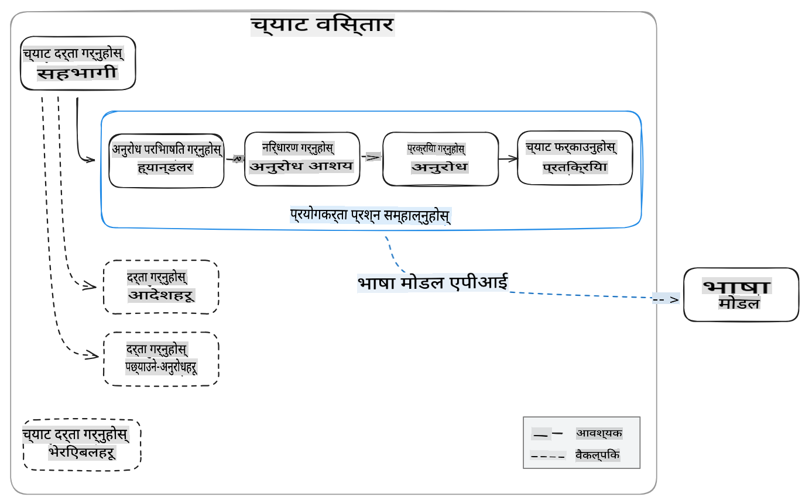
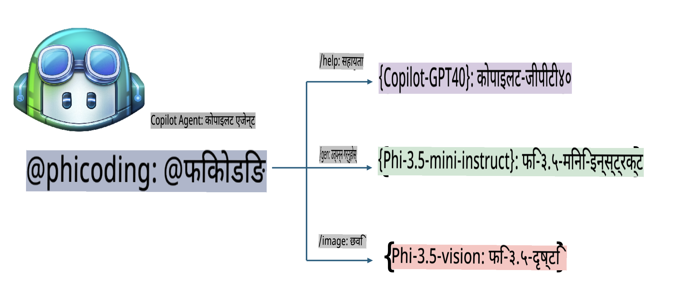
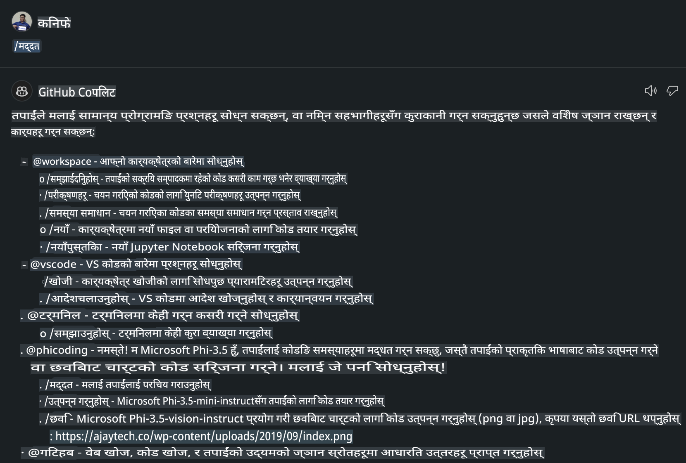
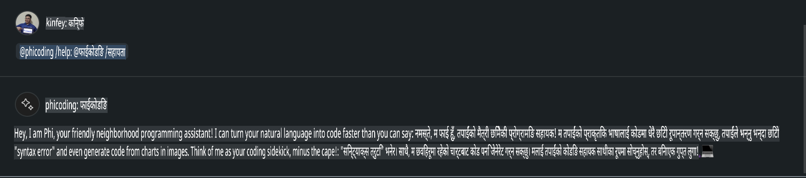
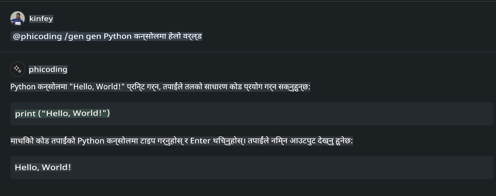
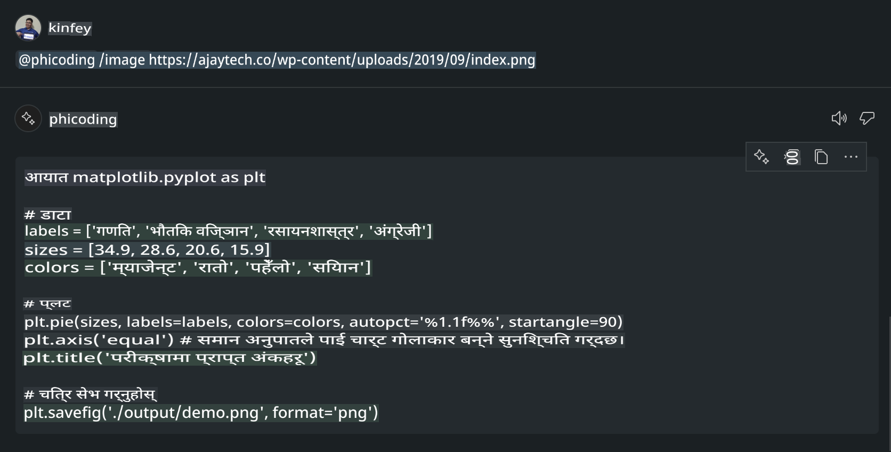

# **आफ्नै Visual Studio Code Chat Copilot Agent GitHub Models को Phi-3.5 प्रयोग गरेर बनाउनुहोस्**

के तपाईं Visual Studio Code Copilot प्रयोग गर्दै हुनुहुन्छ? विशेष गरी Chat मा, तपाईं विभिन्न एजेन्टहरू प्रयोग गरेर Visual Studio Code मा प्रोजेक्टहरू बनाउने, लेख्ने र मर्मत गर्ने क्षमता सुधार गर्न सक्नुहुन्छ। Visual Studio Code ले एउटा API प्रदान गर्दछ जसले कम्पनीहरू र व्यक्तिहरूलाई आफ्नै व्यवसायमा आधारित विभिन्न एजेन्टहरू बनाउने अनुमति दिन्छ, जसले विभिन्न क्षेत्रहरूमा उनीहरूको क्षमतालाई विस्तार गर्न मद्दत गर्दछ। यो लेखमा, हामी GitHub Models का **Phi-3.5-mini-instruct (128k)** र **Phi-3.5-vision-instruct (128k)** मा केन्द्रित हुनेछौं, जसलाई प्रयोग गरेर तपाईं आफ्नै Visual Studio Code Agent बनाउन सक्नुहुन्छ।

## **GitHub Models मा Phi-3.5 को बारेमा**

हामीलाई थाहा छ कि Phi-3/3.5-mini-instruct ले कोड बुझ्ने र उत्पन्न गर्ने उत्कृष्ट क्षमता राख्छ, र Gemma-2-9b र Mistral-Nemo-12B-instruct-2407 भन्दा धेरै फाइदाजनक छ।


GitHub Models ले हालसालै Phi-3.5-mini-instruct (128k) र Phi-3.5-vision-instruct (128k) मोडेलहरूको पहुँच उपलब्ध गराएको छ। विकासकर्ताहरूले यी मोडेलहरूलाई OpenAI SDK, Azure AI Inference SDK, र REST API मार्फत पहुँच गर्न सक्छन्।


***नोट:*** यहाँ Azure AI Inference SDK प्रयोग गर्न सिफारिस गरिन्छ, किनकि यसले उत्पादन वातावरणमा Azure Model Catalog सँग सजिलै स्विच गर्न सहयोग गर्दछ।

तल GitHub Models सँग Phi-3.5-mini-instruct (128k) र Phi-3.5-vision-instruct (128k) को कोड जेनेरेशन क्षमताको परिणामहरू छन्, जसले आगामी उदाहरणहरूको लागि तयारी गर्दछ।

**डेमो: GitHub Models Phi-3.5-mini-instruct (128k) ले Prompt बाट कोड उत्पन्न गर्‍यो** ([यो लिङ्क क्लिक गर्नुहोस्](../../../../../../code/09.UpdateSamples/Aug/ghmodel_phi35_instruct_demo.ipynb))

**डेमो: GitHub Models Phi-3.5-vision-instruct (128k) ले इमेजबाट कोड उत्पन्न गर्‍यो** ([यो लिङ्क क्लिक गर्नुहोस्](../../../../../../code/09.UpdateSamples/Aug/ghmodel_phi35_vision_demo.ipynb))

## **GitHub Copilot Chat Agent को बारेमा**

GitHub Copilot Chat Agent ले कोडको आधारमा विभिन्न प्रोजेक्ट परिदृश्यहरूमा फरक-फरक कार्यहरू पूरा गर्न सक्छ। प्रणालीसँग workspace, github, terminal, vscode नामक चार एजेन्टहरू छन्।



एजेन्टको नामसँग ‘@’ थपेर, तपाईं छिट्टै सम्बन्धित कार्यहरू पूरा गर्न सक्नुहुन्छ। यदि तपाईंले आफ्नो व्यवसाय-सँग सम्बन्धित सामग्री जस्तै आवश्यकता, कोडिङ, परीक्षण निर्दिष्टीकरण, र रिलिज थप्नुभयो भने, GitHub Copilot को आधारमा अझ बलियो निजी कम्पनी सुविधाहरू पाउन सक्नुहुन्छ।

Visual Studio Code Chat Agent ले अहिले आफ्नो API औपचारिक रूपमा सार्वजनिक गरेको छ, जसले कम्पनीहरू वा विकासकर्ताहरूलाई विभिन्न सफ्टवेयर व्यवसाय पारिस्थितिकी तन्त्रमा आधारित एजेन्टहरू विकास गर्न अनुमति दिन्छ। Visual Studio Code Extension Development को विकास विधिलाई आधार बनाएर, तपाईं सजिलै Visual Studio Code Chat Agent API को इन्टरफेस पहुँच गर्न सक्नुहुन्छ। हामी यस प्रक्रियाको आधारमा विकास गर्न सक्छौं।



विकास परिदृश्यले तेस्रो-पक्ष मोडेल API (जस्तै GitHub Models, Azure Model Catalog, र खुला स्रोत मोडेलहरूमा आधारित स्वनिर्मित सेवाहरू) को पहुँच समर्थन गर्न सक्छ, साथै GitHub Copilot द्वारा प्रदान गरिएका gpt-35-turbo, gpt-4, र gpt-4o मोडेलहरू पनि प्रयोग गर्न सक्छ।

## **Phi-3.5 मा आधारित @phicoding एजेन्ट थप्नुहोस्**

हामी Phi-3.5 को प्रोग्रामिङ क्षमताहरूलाई एकीकृत गरेर कोड लेखन, इमेज जेनेरेशन कोड, र अन्य कार्यहरू पूरा गर्ने प्रयास गर्छौं। Phi-3.5 को वरिपरि निर्मित एजेन्ट - @PHI तयार पार्न, तलका केही कार्यहरू छन्:

1. **@phicoding /help** कमाण्ड प्रयोग गरेर GitHub Copilot द्वारा प्रदान गरिएको GPT-4o को आधारमा आत्म-परिचय उत्पन्न गर्नुहोस्।

2. **@phicoding /gen** कमाण्ड प्रयोग गरेर **Phi-3.5-mini-instruct (128k)** को आधारमा विभिन्न प्रोग्रामिङ भाषाहरूका लागि कोड उत्पन्न गर्नुहोस्।

3. **@phicoding /image** कमाण्ड प्रयोग गरेर **Phi-3.5-vision-instruct (128k)** को आधारमा कोड उत्पन्न गर्नुहोस् र इमेज कम्प्लिशन गर्नुहोस्।



## **सम्बन्धित चरणहरू**

1. npm प्रयोग गरेर Visual Studio Code Extension विकास समर्थन स्थापना गर्नुहोस्।

```bash

npm install --global yo generator-code 

```

2. Visual Studio Code Extension प्लगइन बनाउनुहोस् (Typescript विकास मोड प्रयोग गरेर, नाम phiext राख्नुहोस्)।

```bash

yo code 

```

3. सिर्जना गरिएको प्रोजेक्ट खोल्नुहोस् र package.json संशोधन गर्नुहोस्। यहाँ GitHub Models को लागि सम्बन्धित निर्देशनहरू र कन्फिगरेसनहरू छन्। ध्यान दिनुहोस्, तपाईंले आफ्नो GitHub Models टोकन यहाँ थप्न आवश्यक छ।

```json

{
  "name": "phiext",
  "displayName": "phiext",
  "description": "",
  "version": "0.0.1",
  "engines": {
    "vscode": "^1.93.0"
  },
  "categories": [
    "AI",
    "Chat"
  ],
  "activationEvents": [],
  "enabledApiProposals": [
      "chatVariableResolver"
  ],
  "main": "./dist/extension.js",
  "contributes": {
    "chatParticipants": [
        {
            "id": "chat.phicoding",
            "name": "phicoding",
            "description": "Hey! I am Microsoft Phi-3.5, She can help me with coding problems, such as generation code with your natural language, or even generation code about chart from images. Just ask me anything!",
            "isSticky": true,
            "commands": [
                {
                    "name": "help",
                    "description": "Introduce myself to you"
                },
                {
                    "name": "gen",
                    "description": "Generate code for you with Microsoft Phi-3.5-mini-instruct"
                },
                {
                    "name": "image",
                    "description": "Generate code for chart from image(png or jpg) with Microsoft Phi-3.5-vision-instruct, please add image url like this : https://ajaytech.co/wp-content/uploads/2019/09/index.png"
                }
            ]
        }
    ],
    "commands": [
        {
            "command": "phicoding.namesInEditor",
            "title": "Use Microsoft Phi 3.5 in Editor"
        }
    ],
    "configuration": {
      "type": "object",
      "title": "githubmodels",
      "properties": {
        "githubmodels.endpoint": {
          "type": "string",
          "default": "https://models.inference.ai.azure.com",
          "description": "Your GitHub Models Endpoint",
          "order": 0
        },
        "githubmodels.api_key": {
          "type": "string",
          "default": "Your GitHub Models Token",
          "description": "Your GitHub Models Token",
          "order": 1
        },
        "githubmodels.phi35instruct": {
          "type": "string",
          "default": "Phi-3.5-mini-instruct",
          "description": "Your Phi-35-Instruct Model",
          "order": 2
        },
        "githubmodels.phi35vision": {
          "type": "string",
          "default": "Phi-3.5-vision-instruct",
          "description": "Your Phi-35-Vision Model",
          "order": 3
        }
      }
    }
  },
  "scripts": {
    "vscode:prepublish": "npm run package",
    "compile": "webpack",
    "watch": "webpack --watch",
    "package": "webpack --mode production --devtool hidden-source-map",
    "compile-tests": "tsc -p . --outDir out",
    "watch-tests": "tsc -p . -w --outDir out",
    "pretest": "npm run compile-tests && npm run compile && npm run lint",
    "lint": "eslint src",
    "test": "vscode-test"
  },
  "devDependencies": {
    "@types/vscode": "^1.93.0",
    "@types/mocha": "^10.0.7",
    "@types/node": "20.x",
    "@typescript-eslint/eslint-plugin": "^8.3.0",
    "@typescript-eslint/parser": "^8.3.0",
    "eslint": "^9.9.1",
    "typescript": "^5.5.4",
    "ts-loader": "^9.5.1",
    "webpack": "^5.94.0",
    "webpack-cli": "^5.1.4",
    "@vscode/test-cli": "^0.0.10",
    "@vscode/test-electron": "^2.4.1"
  },
  "dependencies": {
    "@types/node-fetch": "^2.6.11",
    "node-fetch": "^3.3.2",
    "@azure-rest/ai-inference": "latest",
    "@azure/core-auth": "latest",
    "@azure/core-sse": "latest"
  }
}


```

4. src/extension.ts संशोधन गर्नुहोस्।

```typescript

// The module 'vscode' contains the VS Code extensibility API
// Import the module and reference it with the alias vscode in your code below
import * as vscode from 'vscode';
import ModelClient from "@azure-rest/ai-inference";
import { AzureKeyCredential } from "@azure/core-auth";


interface IPhiChatResult extends vscode.ChatResult {
    metadata: {
        command: string;
    };
}


const MODEL_SELECTOR: vscode.LanguageModelChatSelector = { vendor: 'copilot', family: 'gpt-4o' };

function isValidImageUrl(url: string): boolean {
    const regex = /^(https?:\/\/.*\.(?:png|jpg))$/i;
    return regex.test(url);
}
  

// This method is called when your extension is activated
// Your extension is activated the very first time the command is executed
export function activate(context: vscode.ExtensionContext) {

    const codinghandler: vscode.ChatRequestHandler = async (request: vscode.ChatRequest, context: vscode.ChatContext, stream: vscode.ChatResponseStream, token: vscode.CancellationToken): Promise<IPhiChatResult> => {


        const config : any = vscode.workspace.getConfiguration('githubmodels');
        const endPoint: string = config.get('endpoint');
        const apiKey: string = config.get('api_key');
        const phi35instruct: string = config.get('phi35instruct');
        const phi35vision: string = config.get('phi35vision');
        
        if (request.command === 'help') {

            const content = "Welcome to Coding assistant with Microsoft Phi-3.5"; 
            stream.progress(content);


            try {
                const [model] = await vscode.lm.selectChatModels(MODEL_SELECTOR);
                if (model) {
                    const messages = [
                        vscode.LanguageModelChatMessage.User("Please help me express this content in a humorous way: I am a programming assistant who can help you convert natural language into code and generate code based on the charts in the images. output format like this : Hey I am Phi ......")
                    ];
                    const chatResponse = await model.sendRequest(messages, {}, token);
                    for await (const fragment of chatResponse.text) {
                        stream.markdown(fragment);
                    }
                }
            } catch(err) {
                console.log(err);
            }


            return { metadata: { command: 'help' } };

        }

        
        if (request.command === 'gen') {

            const content = "Welcome to use phi-3.5 to generate code";

            stream.progress(content);

            const client = new ModelClient(endPoint, new AzureKeyCredential(apiKey));

            const response = await client.path("/chat/completions").post({
              body: {
                messages: [
                  { role:"system", content: "You are a coding assistant.Help answer all code generation questions." },
                  { role:"user", content: request.prompt }
                ],
                model: phi35instruct,
                temperature: 0.4,
                max_tokens: 1000,
                top_p: 1.
              }
            });

            stream.markdown(response.body.choices[0].message.content);

            return { metadata: { command: 'gen' } };

        }


        
        if (request.command === 'image') {


            const content = "Welcome to use phi-3.5 to generate code from image(png or jpg),image url like this:https://ajaytech.co/wp-content/uploads/2019/09/index.png";

            stream.progress(content);

            if (!isValidImageUrl(request.prompt)) {
                stream.markdown('Please provide a valid image URL');
                return { metadata: { command: 'image' } };
            }
            else
            {

                const client = new ModelClient(endPoint, new AzureKeyCredential(apiKey));
    
                const response = await client.path("/chat/completions").post({
                    body: {
                      messages: [
                        { role: "system", content: "You are a helpful assistant that describes images in details." },
                        { role: "user", content: [
                            { type: "text", text: "Please generate code according to the chart in the picture according to the following requirements\n1. Keep all information in the chart, including data and text\n2. Do not generate additional information that is not included in the chart\n3. Please extract data from the picture, do not generate it from csv\n4. Please save the regenerated chart as a chart and save it to ./output/demo.png"},
                            { type: "image_url", image_url: {url: request.prompt}
                            }
                          ]
                        }
                      ],
                      model: phi35vision,
                      temperature: 0.4,
                      max_tokens: 2048,
                      top_p: 1.
                    }
                  });
    
                
                stream.markdown(response.body.choices[0].message.content);
    
                return { metadata: { command: 'image' } };
            }


        }


        return { metadata: { command: '' } };
    };


    const phi_ext = vscode.chat.createChatParticipant("chat.phicoding", codinghandler);

    phi_ext.iconPath = new vscode.ThemeIcon('sparkle');


    phi_ext.followupProvider = {
        provideFollowups(result: IPhiChatResult, context: vscode.ChatContext, token: vscode.CancellationToken) {
            return [{
                prompt: 'Let us coding with Phi-3.5 😋😋😋😋',
                label: vscode.l10n.t('Enjoy coding with Phi-3.5'),
                command: 'help'
            } satisfies vscode.ChatFollowup];
        }
    };

    context.subscriptions.push(phi_ext);
}

// This method is called when your extension is deactivated
export function deactivate() {}


```

6. चलाउनुहोस्।

***/help***



***@phicoding /help***



***@phicoding /gen***



***@phicoding /image***



तपाईं नमुना कोड डाउनलोड गर्न सक्नुहुन्छ: [क्लिक गर्नुहोस्](../../../../../../code/09.UpdateSamples/Aug/vscode)

## **स्रोतहरू**

1. GitHub Models मा साइन अप गर्नुहोस् [https://gh.io/models](https://gh.io/models)

2. Visual Studio Code Extension Development सिक्नुहोस् [https://code.visualstudio.com/api/get-started/your-first-extension](https://code.visualstudio.com/api/get-started/your-first-extension)

3. Visual Studio Code Coilot Chat API को बारेमा जान्नुहोस् [https://code.visualstudio.com/api/extension-guides/chat](https://code.visualstudio.com/api/extension-guides/chat)

**अस्वीकरण**:  
यो दस्तावेज मेसिन-आधारित एआई अनुवाद सेवाहरू प्रयोग गरी अनुवाद गरिएको हो। हामी शुद्धताका लागि प्रयास गर्छौं, तर कृपया सचेत हुनुहोस् कि स्वचालित अनुवादहरूमा त्रुटिहरू वा अशुद्धताहरू हुन सक्छन्। यसको मौलिक भाषामा रहेको मूल दस्तावेजलाई आधिकारिक स्रोत मानिनुपर्छ। महत्त्वपूर्ण जानकारीको लागि, व्यावसायिक मानव अनुवाद सिफारिस गरिन्छ। यो अनुवाद प्रयोग गर्दा उत्पन्न हुने कुनै पनि गलतफहमी वा गलत व्याख्याका लागि हामी जिम्मेवार हुने छैनौं।