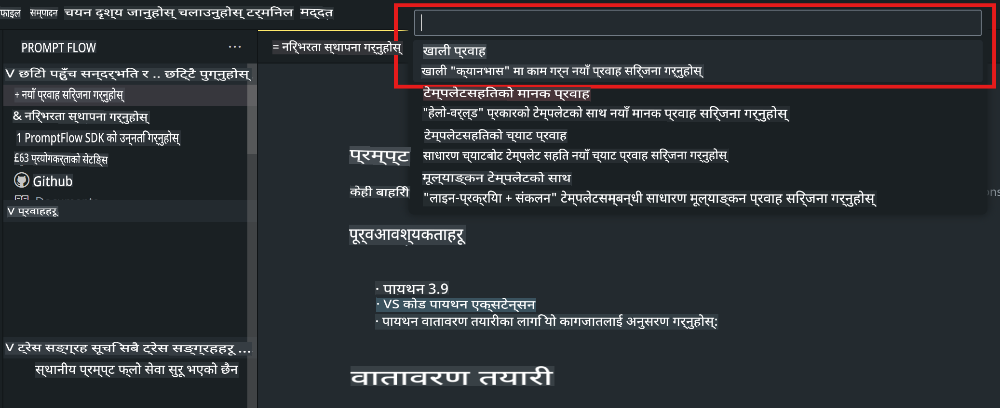
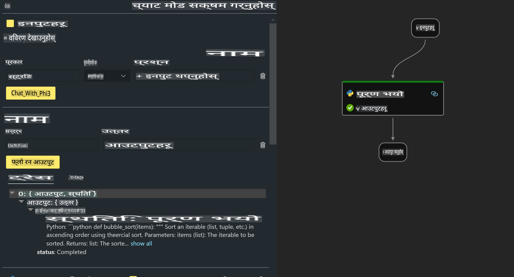

# **लैब २ - AIPC मा Phi-3-mini संग Prompt flow चलाउनुहोस्**

## **Prompt flow के हो**

Prompt flow LLM-आधारित AI एप्लिकेसनहरूको विकास चक्रलाई सहज बनाउन डिजाइन गरिएको विकास उपकरणहरूको एक सेट हो। यो आइडिया बनाउनेदेखि, प्रोटोटाइपिङ, परीक्षण, मूल्याङ्कन, उत्पादनमा तैनाती र निगरानीसम्मको सम्पूर्ण प्रक्रिया सरल बनाउँछ। यसले प्रम्प्ट इन्जिनियरिङलाई धेरै सजिलो बनाउँछ र उत्पादन स्तरको गुणस्तर भएको LLM एप्स निर्माण गर्न मद्दत पुर्‍याउँछ।

Prompt flow को साथमा, तपाईंलाई यी कार्यहरू गर्न सक्नुहुन्छ:

- LLMs, प्रम्प्टहरू, Python कोड र अन्य उपकरणहरूलाई एकै ठाउँमा जोडेर एक कार्यशील workflow निर्माण गर्नुहोस्।

- आफ्नो workflow डिबग र सुधार गर्नुहोस्, विशेष गरी LLMs सँगको अन्तरक्रिया सहजताका साथ।

- आफ्नो workflow को मूल्याङ्कन गर्नुहोस्, ठूलो datasets को प्रयोग गरी गुणस्तर र प्रदर्शन मेट्रिक्स गणना गर्नुहोस्।

- परीक्षण र मूल्याङ्कनलाई CI/CD प्रणालीमा एकीकृत गर्नुहोस् ताकि आफ्नो workflow को गुणस्तर सुनिश्चित गर्न सकियोस्।

- आफ्नो workflow लाई आफ्नो रोजाइको सेवा प्लेटफर्ममा तैनाती गर्नुहोस् वा आफ्नो एप्लिकेसनको कोड बेसमा सजिलै समाहित गर्नुहोस्।

- (वैकल्पिक तर अत्यधिक सिफारिस गरिएको) Azure AI मा Prompt flow को क्लाउड संस्करण प्रयोग गरेर आफ्नो टिमसँग सहकार्य गर्नुहोस्।

## **AIPC के हो**

AI PC मा CPU, GPU र NPU हुन्छ, जसले विशिष्ट AI एक्सेलेरेशन क्षमताहरू प्रदान गर्छ। NPU, वा neural processing unit, एक विशेष एक्सेलेरेटर हो जसले कृत्रिम बुद्धिमत्ता (AI) र मेशिन लर्निङ (ML) का कामहरू क्लाउडमा डेटा पठाउने सट्टा तपाईंको PC मा नै प्रक्रिया गर्छ। GPU र CPU ले पनि यी workloads प्रक्रिया गर्न सक्छन्, तर NPU कम-शक्ति AI गणनाहरूका लागि विशेष गरी प्रभावकारी छ। AI PC ले हाम्रो कम्प्युटरहरू कसरी सञ्चालन गर्छन् भन्ने कुरामा एक आधारभूत परिवर्तनको प्रतिनिधित्व गर्छ। यो पहिले नभएको समस्याको समाधान होइन। यसको सट्टा, यसले दैनिक PC प्रयोगहरूमा ठूलो सुधारको वाचा गर्दछ।

यो कसरी काम गर्छ त? ठूलो भाषा मोडेलहरू (LLMs) र सार्वजनिक डाटामा आधारित जेनेरेटिभ AI को तुलनामा, तपाईंको PC मा हुने AI धेरै सहज रूपमा पहुँचयोग्य छ। यो अवधारणा बुझ्न सजिलो छ, र किनभने यो तपाईंको डाटामा आधारित छ, क्लाउडमा पहुँच बिना नै, यसको फाइदाहरू धेरै मानिसहरूका लागि तत्काल आकर्षक छन्।

छोटो अवधिमा, AI PC संसारले तपाईंको PC मा सिधै साना AI मोडेलहरू र व्यक्तिगत सहायकहरू चलाउँछ, जसले तपाईंको डाटालाई प्रयोग गरेर व्यक्तिगत, निजी, र सुरक्षित AI सुधारहरू प्रदान गर्दछ। तपाईंले दैनिक गर्ने कामहरूमा – बैठक नोटहरू लिनु, फ्यान्टासी फुटबल लिगको व्यवस्थापन गर्नु, फोटो र भिडियो सम्पादनका लागि स्वचालित सुधारहरू गर्नु, वा सबैको आगमन र प्रस्थान समयको आधारमा परिवार पुनर्मिलनको सही कार्यक्रम बनाउनु – यी सबै कामहरूमा मद्दत पुर्‍याउँछ। 

## **AIPC मा Generation Code Flows निर्माण गर्नुहोस्**

***Note*** ：यदि तपाईंले वातावरण स्थापना पूरा गर्नुभएको छैन भने, कृपया [लैब ० -इन्स्टलेसनहरू](./01.Installations.md) मा जानुहोस्।

1. Visual Studio Code मा Prompt flow Extension खोल्नुहोस् र एउटा खाली flow प्रोजेक्ट सिर्जना गर्नुहोस्।



2. Inputs र Outputs parameters थप्नुहोस् र Python Code लाई नयाँ flow को रूपमा थप्नुहोस्।



तपाईं आफ्नो flow निर्माण गर्न यो संरचना (flow.dag.yaml) लाई सन्दर्भ गर्न सक्नुहुन्छ।

```yaml

inputs:
  question:
    type: string
    default: how to write Bubble Algorithm
outputs:
  answer:
    type: string
    reference: ${Chat_With_Phi3.output}
nodes:
- name: Chat_With_Phi3
  type: python
  source:
    type: code
    path: Chat_With_Phi3.py
  inputs:
    question: ${inputs.question}


```

3. ***Chat_With_Phi3.py*** मा कोड थप्नुहोस्।

```python


from promptflow.core import tool

# import torch
from transformers import AutoTokenizer, pipeline,TextStreamer
import intel_npu_acceleration_library as npu_lib

import warnings

import asyncio
import platform

class Phi3CodeAgent:
    
    model = None
    tokenizer = None
    text_streamer = None
    
    model_id = "microsoft/Phi-3-mini-4k-instruct"

    @staticmethod
    def init_phi3():
        
        if Phi3CodeAgent.model is None or Phi3CodeAgent.tokenizer is None or Phi3CodeAgent.text_streamer is None:
            Phi3CodeAgent.model = npu_lib.NPUModelForCausalLM.from_pretrained(
                                    Phi3CodeAgent.model_id,
                                    torch_dtype="auto",
                                    dtype=npu_lib.int4,
                                    trust_remote_code=True
                                )
            Phi3CodeAgent.tokenizer = AutoTokenizer.from_pretrained(Phi3CodeAgent.model_id)
            Phi3CodeAgent.text_streamer = TextStreamer(Phi3CodeAgent.tokenizer, skip_prompt=True)

    

    @staticmethod
    def chat_with_phi3(prompt):
        
        Phi3CodeAgent.init_phi3()

        messages = "<|system|>You are a AI Python coding assistant. Please help me to generate code in Python.The answer only genertated Python code, but any comments and instructions do not need to be generated<|end|><|user|>" + prompt +"<|end|><|assistant|>"


        generation_args = {
            "max_new_tokens": 1024,
            "return_full_text": False,
            "temperature": 0.3,
            "do_sample": False,
            "streamer": Phi3CodeAgent.text_streamer,
        }

        pipe = pipeline(
            "text-generation",
            model=Phi3CodeAgent.model,
            tokenizer=Phi3CodeAgent.tokenizer,
            # **generation_args
        )

        result = ''

        with warnings.catch_warnings():
            warnings.simplefilter("ignore")
            response = pipe(messages, **generation_args)
            result =response[0]['generated_text']
            return result


@tool
def my_python_tool(question: str) -> str:
    if platform.system() == 'Windows':
        asyncio.set_event_loop_policy(asyncio.WindowsSelectorEventLoopPolicy())
    return Phi3CodeAgent.chat_with_phi3(question)


```

4. Debug वा Run बाट flow परीक्षण गर्नुहोस् ताकि generation code ठीक छ कि छैन भनेर जाँच्न सकियोस्।


5. टर्मिनलमा development API को रूपमा flow चलाउनुहोस्।

```

pf flow serve --source ./ --port 8080 --host localhost   

```

यसलाई Postman / Thunder Client मा परीक्षण गर्न सक्नुहुन्छ।

### **नोट**

1. पहिलो पटक चलाउँदा धेरै समय लाग्छ। Hugging Face CLI बाट phi-3 मोडेल डाउनलोड गर्न सिफारिस गरिन्छ।

2. Intel NPU को सीमित कम्प्युटिङ क्षमतालाई ध्यानमा राख्दै, Phi-3-mini-4k-instruct प्रयोग गर्न सिफारिस गरिन्छ।

3. हामी Intel NPU Acceleration प्रयोग गरेर INT4 रूपान्तरण क्वान्टाइज गर्छौं, तर यदि तपाईंले सेवा पुनः चलाउनुहुन्छ भने, cache र nc_workshop फोल्डरहरू हटाउन आवश्यक पर्छ।

## **स्रोतहरू**

1. Promptflow सिक्नुहोस् [https://microsoft.github.io/promptflow/](https://microsoft.github.io/promptflow/)

2. Intel NPU Acceleration सिक्नुहोस् [https://github.com/intel/intel-npu-acceleration-library](https://github.com/intel/intel-npu-acceleration-library)

3. नमूना कोड डाउनलोड गर्नुहोस् [Local NPU Agent Sample Code](../../../../../../../../../code/07.Lab/01/AIPC)

**अस्वीकरण**:  
यो दस्तावेज़ मेशिन-आधारित एआई अनुवाद सेवाहरू प्रयोग गरेर अनुवाद गरिएको छ। हामी यथासम्भव सही अनुवाद प्रदान गर्न प्रयास गर्दछौं, तर कृपया जानकार हुनुहोस् कि स्वचालित अनुवादमा त्रुटिहरू वा अशुद्धताहरू हुन सक्छन्। मूल भाषामा रहेको दस्तावेज़लाई प्रामाणिक स्रोत मानिनुपर्छ। महत्वपूर्ण जानकारीको लागि, पेशेवर मानव अनुवादको सिफारिस गरिन्छ। यस अनुवादको प्रयोगबाट उत्पन्न हुने कुनै पनि गलतफहमी वा गलत व्याख्याको लागि हामी जिम्मेवार हुने छैनौं।