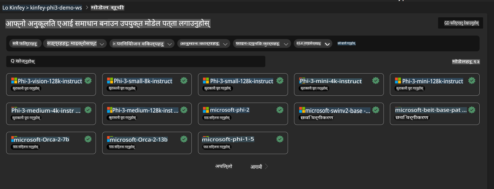
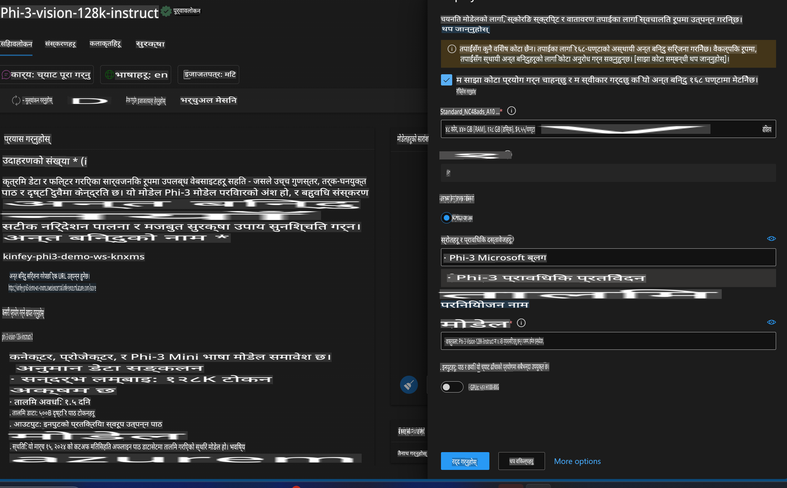
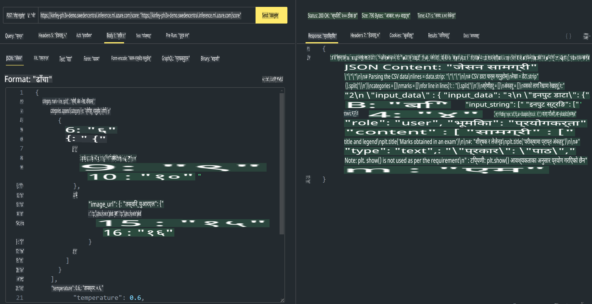

# **लैब ३ - Azure Machine Learning Service मा Phi-3-Vision तैनाथ गर्नुहोस्**

हामीले स्थानीय कोडको उत्पादन तैनाथी पूरा गर्न NPU प्रयोग गर्छौं, र त्यसपछि PHI-3-VISION को क्षमता समावेश गरेर तस्बिरबाट कोड उत्पन्न गर्ने लक्ष्य राख्छौं।

यस परिचयमा, हामी Azure Machine Learning Service मा छिटो Model As Service Phi-3 Vision सेवा निर्माण गर्न सक्छौं।

***Note***: Phi-3 Vision ले छिटो सामग्री उत्पन्न गर्न कम्प्युटिङ पावरको आवश्यकता पर्छ। हामीलाई यो हासिल गर्न क्लाउड कम्प्युटिङ पावरको आवश्यकता पर्छ।  

### **१. Azure Machine Learning Service सिर्जना गर्नुहोस्**

हामीले Azure Portal मा Azure Machine Learning Service सिर्जना गर्नुपर्छ। कसरी गर्ने भनेर सिक्न चाहनुहुन्छ भने कृपया यो लिंक भ्रमण गर्नुहोस् [https://learn.microsoft.com/azure/machine-learning/quickstart-create-resources?view=azureml-api-2](https://learn.microsoft.com/azure/machine-learning/quickstart-create-resources?view=azureml-api-2)  

### **२. Azure Machine Learning Service मा Phi-3 Vision छान्नुहोस्**



### **३. Azure मा Phi-3-Vision तैनाथ गर्नुहोस्**



### **४. Postman मा Endpoint परीक्षण गर्नुहोस्**



***Note***

1. पठाउनुपर्ने प्यारामिटरहरूमा Authorization, azureml-model-deployment, र Content-Type समावेश हुनुपर्छ। तपाईंले तैनाथी जानकारी जाँच गरेर यसलाई प्राप्त गर्नुपर्छ।

2. प्यारामिटरहरू पठाउन, Phi-3-Vision ले तस्बिरको लिंक पठाउनुपर्छ। कृपया GPT-4-Vision विधिलाई हेर्नुहोस् र प्यारामिटरहरू कसरी पठाउने भनेर बुझ्नुहोस्, जस्तै

```json

{
  "input_data":{
    "input_string":[
      {
        "role":"user",
        "content":[ 
          {
            "type": "text",
            "text": "You are a Python coding assistant.Please create Python code for image "
          },
          {
              "type": "image_url",
              "image_url": {
                "url": "https://ajaytech.co/wp-content/uploads/2019/09/index.png"
              }
          }
        ]
      }
    ],
    "parameters":{
          "temperature": 0.6,
          "top_p": 0.9,
          "do_sample": false,
          "max_new_tokens": 2048
    }
  }
}

```

3. **/score** लाई Post विधि प्रयोग गरेर कल गर्नुहोस्।  

**बधाई छ**! तपाईंले PHI-3-VISION को छिटो तैनाथी पूरा गर्नुभयो र तस्बिरबाट कोड कसरी उत्पन्न गर्ने भनेर प्रयास गर्नुभयो। अब, हामी NPU र क्लाउडलाई संयोजन गरेर अनुप्रयोगहरू निर्माण गर्न सक्छौं।  

**अस्वीकरण**:  
यो दस्तावेज मेशिन-आधारित एआई अनुवाद सेवाहरू प्रयोग गरेर अनुवाद गरिएको हो। हामी यथासम्भव शुद्धताको प्रयास गर्छौं, तर कृपया जानकार रहनुहोस् कि स्वचालित अनुवादमा त्रुटिहरू वा असत्यताहरू हुन सक्छन्। यसको मौलिक भाषामा रहेको मूल दस्तावेजलाई आधिकारिक स्रोत मानिनुपर्छ। महत्वपूर्ण जानकारीका लागि, पेशेवर मानव अनुवाद सिफारिस गरिन्छ। यस अनुवादको प्रयोगबाट उत्पन्न हुने कुनै पनि गलतफहमी वा गलत व्याख्याको लागि हामी जिम्मेवार हुनेछैनौं।  