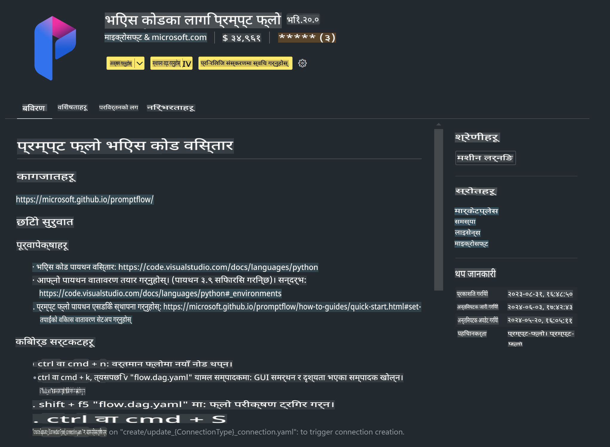

# **ल्याब ० - इन्स्टलेशन**

जब हामी ल्याबमा प्रवेश गर्छौं, हामीले सम्बन्धित वातावरण कन्फिगर गर्न आवश्यक छ :


### **१. Python 3.11+**

तपाईंको Python वातावरण कन्फिगर गर्न miniforge प्रयोग गर्न सिफारिस गरिन्छ।

miniforge कन्फिगर गर्न, कृपया [https://github.com/conda-forge/miniforge](https://github.com/conda-forge/miniforge) हेर्नुहोस्।

miniforge कन्फिगर गरेपछि, Power Shell मा निम्न कमाण्ड चलाउनुहोस्:

```bash

conda create -n pyenv python==3.11.8 -y

conda activate pyenv

```


### **२. Prompt flow SDK इन्स्टल गर्नुहोस्**

ल्याब १ मा, हामीले Prompt flow प्रयोग गर्नेछौं, त्यसैले तपाईंले Prompt flow SDK कन्फिगर गर्नुपर्नेछ।

```bash

pip install promptflow --upgrade

```

तपाईं यो कमाण्ड प्रयोग गरेर promptflow sdk जाँच गर्न सक्नुहुन्छ:

```bash

pf --version

```


### **३. Visual Studio Code Prompt flow Extension इन्स्टल गर्नुहोस्**




### **४. Apple's MLX Framework**

MLX एउटा array framework हो जुन Apple सिलिकनमा मेसिन लर्निङ अनुसन्धानका लागि Apple ले ल्याएको हो। तपाईं **Apple MLX framework** प्रयोग गरेर Apple Silicon मा LLM / SLM लाई द्रुत बनाउन सक्नुहुन्छ। थप जान्न चाहनुहुन्छ भने, कृपया [https://github.com/microsoft/PhiCookBook/blob/main/md/01.Introduction/03/MLX_Inference.md](https://github.com/microsoft/PhiCookBook/blob/main/md/01.Introduction/03/MLX_Inference.md) पढ्न सक्नुहुन्छ।

bash मा MLX framework Library इन्स्टल गर्नुहोस्:

```bash

pip install mlx-lm

```


### **५. अन्य Python Library**

requirements.txt बनाउनुहोस् र यस सामग्रीलाई थप्नुहोस्:

```txt

notebook
numpy 
scipy 
scikit-learn 
matplotlib 
pandas 
pillow 
graphviz

```


### **६. NVM इन्स्टल गर्नुहोस्**

Powershell मा nvm इन्स्टल गर्नुहोस्:

```bash

brew install nvm

```

nodejs 18.20 इन्स्टल गर्नुहोस्:

```bash

nvm install 18.20.0

nvm use 18.20.0

```


### **७. Visual Studio Code Development Support इन्स्टल गर्नुहोस्**

```bash

npm install --global yo generator-code

```

बधाई छ! तपाईंले SDK सफलतापूर्वक कन्फिगर गर्नुभयो। अब, हातमा कामको चरणतर्फ अगाडि बढ्नुहोस्।

**अस्वीकरण**:  
यो दस्तावेज मेसिन-आधारित एआई अनुवाद सेवाहरू प्रयोग गरी अनुवाद गरिएको हो। यद्यपि हामी शुद्धताको लागि प्रयास गर्छौं, कृपया जानकार हुनुहोस् कि स्वचालित अनुवादहरूमा त्रुटिहरू वा अशुद्धताहरू हुन सक्छन्। मूल भाषामा रहेको मूल दस्तावेजलाई प्राधिकृत स्रोत मानिनुपर्छ। महत्वपूर्ण जानकारीको लागि, व्यावसायिक मानव अनुवाद सिफारिस गरिन्छ। यो अनुवाद प्रयोगबाट उत्पन्न कुनै पनि गलतफहमी वा गलत व्याख्याका लागि हामी जिम्मेवार हुनेछैनौं।